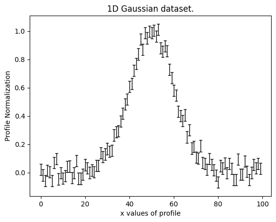
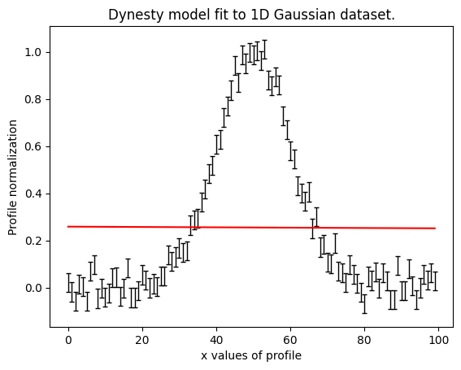
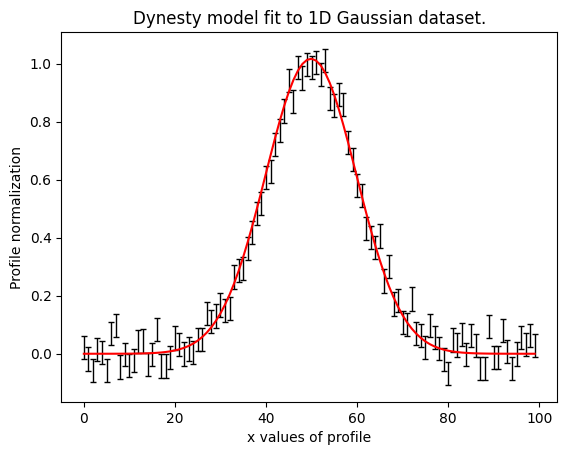

> ✏️ **This page is auto-generated from [`scripts/chapter_1_introduction/tutorial_3_non_linear_search.py`](../../scripts/chapter_1_introduction/tutorial_3_non_linear_search.py) — do not edit it directly.**
> It shows the example fully executed, with its real output images.
> Run it yourself via the [Python script](../../scripts/chapter_1_introduction/tutorial_3_non_linear_search.py) or the [Jupyter notebook](../../notebooks/chapter_1_introduction/tutorial_3_non_linear_search.ipynb).

Tutorial 3: Non Linear Search
=============================

In the previous tutorials, we laid the groundwork by defining a model and manually fitting it to data using fitting
functions. We quantified the goodness of fit using the log likelihood and demonstrated that for models with only a few
free parameters, we could achieve satisfactory fits by manually guessing parameter values. However, as the complexity
of our models increased, this approach quickly became impractical.

In this tutorial, we will delve into a more systematic approach for fitting models to data. This technique is designed
to handle models with a larger number of parameters—ranging from tens to hundreds. By adopting this approach, we aim
to achieve more efficient and reliable model fits, ensuring that our models accurately capture the underlying
structure of the data.

This approach not only improves the accuracy of our fits but also allows us to explore more complex models that better
represent the systems we are studying.

__Overview__

In this tutorial, we will use a non-linear search to fit a 1D Gaussian profile to noisy data. Specifically, we will:

- Introduce concept like a "parameter space", "likelihood surface" and "priors", and relate them to how a non-linear
  search works.

- Introduce the `Analysis` class, which defines the `log_likelihood_function` that quantifies the goodness of fit of a
  model instance to the data.

- Fit a 1D Gaussian model to 1D data with different non-linear searches, including a maximum likelihood estimator (MLE),
  Markok Chain Monte Carlo (MCMC) and nested sampling.

All these steps utilize **PyAutoFit**'s API for model-fitting.

__Contents__

This tutorial is split into the following sections:

- **Parameter Space**: Introduce the concept of a "parameter space" and how it relates to model-fitting.
- **Non-Linear Search**: Introduce the concept of a "non-linear search" and how it fits models to data.
- **Search Types**: Introduce the maximum likelihood estimator (MLE), Markov Chain Monte Carlo (MCMC) and nested sampling search algorithms used in this tutorial.
- **Deeper Background**: Provide links to resources that more thoroughly describe the statistical principles that underpin non-linear searches.
- **Data**: Load and plot the 1D Gaussian dataset we'll fit.
- **Model**: Introduce the 1D `Gaussian` model we'll fit to the data.
- **Priors**: Introduce priors and how they are used to define the parameter space and guide the non-linear search.
- **Analysis**: Introduce the `Analysis` class, which contains the `log_likelihood_function` used to fit the model to the data.
- **Searches**: An overview of the searches used in this tutorial.
- **Maximum Likelihood Estimation (MLE)**: Perform a model-fit using the MLE search.
- **Markov Chain Monte Carlo (MCMC)**: Perform a model-fit using the MCMC search.
- **Nested Sampling**: Perform a model-fit using the nested sampling search.
- **What is The Best Search To Use?**: Compare the strengths and weaknesses of each search method.
- **Wrap Up**: A summary of the concepts introduced in this tutorial.

__Parameter Space__

In mathematics, a function is defined by its parameters, which relate inputs to outputs.

For example, consider a simple function:

\[ f(x) = x^2 \]

Here, \( x \) is the parameter input into the function \( f \), and \( f(x) \) returns \( x^2 \). This
mapping between \( x \) and \( f(x) \) defines the "parameter space" of the function, which in this case is a parabola.

Functions can have multiple parameters, such as \( x \), \( y \), and \( z \):

\[ f(x, y, z) = x + y^2 - z^3 \]

Here, the mapping between \( x \), \( y \), \( z \), and \( f(x, y, z) \) defines a parameter space with three
dimensions.

This concept of a parameter space relates closely to how we define and use instances of models in model-fitting.
For instance, in our previous tutorial, we used instances of a 1D Gaussian profile with
parameters \( (x, I, \sigma) \) to fit data and compute a log likelihood.

This process can be thought of as complete analogous to a function \( f(x, y, z) \), where the output value is the
log likelihood. This key function, which maps parameter values to a log likelihood, is called the "likelihood function"
in statistical inference, albeit we will refer to it hereafter as the `log_likelihood_function` to be explicit
that it is the log of the likelihood function.

By expressing the likelihood in this manner, we can consider our model as having a parameter space -— a
multidimensional surface that spans all possible values of the model parameters \( x, I, \sigma \).

This surface is often referred to as the "likelihood surface", and our objective during model-fitting is to find
its peak.

This parameter space is "non-linear", meaning the relationship between the input parameters and the log likelihood
does not behave linearly. This non-linearity implies that we cannot predict the log likelihood from a set of model
parameters without actually performing a fit to the data by performing the forward model calculation.

__Non-Linear Search__

Now that we understand our problem in terms of a non-linear parameter space with a likelihood surface, we can
introduce the method used to fit the model to the data—the "non-linear search".

Previously, our approach involved manually guessing models until finding one with a good fit and high log likelihood.
Surprisingly, this random guessing forms the basis of how model-fitting using a non-linear search actually works!

A non-linear search involves systematically guessing many models while tracking their log likelihoods. As the
algorithm progresses, it tends to favor models with parameter combinations that have previously yielded higher
log likelihoods. This iterative refinement helps to efficiently explore the vast parameter space.

There are two key differences between guessing random models and using a non-linear search:

- **Computational Efficiency**: The non-linear search can evaluate the log likelihood of a model parameter
  combinations in milliseconds and therefore many thousands of models in minutes. This computational speed enables
  it to thoroughly sample potential solutions, which would be impractical for a human.

- **Effective Sampling**: The search algorithm maintains a robust memory of previously guessed models and their log
  likelihoods. This allows it to sample potential solutions more thoroughly and converge on the highest
  likelihood solutions more efficiently, which is again impractical for a human.

Think of the non-linear search as systematically exploring parameter space to pinpoint regions with the highest log
likelihood values. Its primary goal is to identify and converge on the parameter values that best describe the data.

__Search Types__

There are different types of non-linear searches, each of which explores parameter space in a unique way.
In this example, we will use three types of searches, which broadly represent the various approaches to non-linear
searches used in statistical inference.

These are:

- **Maximum Likelihood Estimation (MLE)**: This method aims to find the model that maximizes the likelihood function.
  It does so by testing nearby models and adjusting parameters in the direction that increases the likelihood.

- **Markov Chain Monte Carlo (MCMC)**: This approach uses a group of "walkers" that explore parameter space randomly.
  The likelihood at each walker's position influences the probability of the walker moving to a new position.

- **Nested Sampling**: This technique samples points from the parameter space iteratively. Lower likelihood points
  are replaced by higher likelihood ones, gradually concentrating the samples in regions of high likelihood.

We will provide more details on each of these searches below.

__Deeper Background__

**The descriptions of how searches work in this example are simplfied and phoenomenological and do not give a full
description of how they work at a deep statistical level. The goal is to provide you with an intuition for how to use
them and when different searches are appropriate for different problems. Later tutorials will provide a more formal
description of how these searches work.**

If you're interested in learning more about these principles, you can explore resources such as:

- [Markov Chain Monte Carlo (MCMC)](https://en.wikipedia.org/wiki/Markov_chain_Monte_Carlo)
- [Introduction to MCMC Sampling](https://twiecki.io/blog/2015/11/10/mcmc-sampling/)
- [Nested Sampling](https://www.imperial.ac.uk/media/imperial-college/research-centres-and-groups/astrophysics/public/icic/data-analysis-workshop/2016/NestedSampling_JRP.pdf)
- [A Zero-Math Introduction to MCMC Methods](https://towardsdatascience.com/a-zero-math-introduction-to-markov-chain-monte-carlo-methods-dcba889e0c50)


```python

import numpy as np
import matplotlib.pyplot as plt
from os import path

import autofit as af

from autofit import setup_notebook; setup_notebook()
```

    .../PyAutoNerves/autonerves/workspace.py:206: UserWarning: Cannot verify the workspace at HowToFit/scripts/chapter_1_introduction is compatible with the installed library version (2026.7.6.649): no `version.minimum_library_version` or `version.workspace_version` key in config/general.yaml and no version.txt at the workspace root.
    
    If you cloned the workspace from `main` rather than a release tag, set `version.workspace_version_check: False` in config/general.yaml to silence this warning. The `main` branch updates more frequently than library releases, so version mismatches are expected and not actionable for `main`-branch users.
    
    You can also set the environment variable PYAUTO_SKIP_WORKSPACE_VERSION_CHECK=1 to disable temporarily.
      warnings.warn(_missing_version_warning(root, library_version))


    Working Directory has been set to `HowToFit`


__Data__

Load and plot the dataset from the `HowToFit/dataset` folder.


```python
dataset_path = path.join("dataset", "example_1d", "gaussian_x1")
```

__Dataset Auto-Simulation__

If the dataset does not already exist on your system, it will be created by running the corresponding
simulator script. This ensures that all example scripts can be run without manually simulating data first.


```python
if not path.exists(dataset_path):
    import subprocess
    import sys

    subprocess.run(
        [sys.executable, "scripts/simulators/simulators.py"],
        check=True,
    )

data = af.util.numpy_array_from_json(file_path=path.join(dataset_path, "data.json"))
noise_map = af.util.numpy_array_from_json(
    file_path=path.join(dataset_path, "noise_map.json")
)

xvalues = np.arange(data.shape[0])

plt.errorbar(
    xvalues,
    data,
    yerr=noise_map,
    linestyle="",
    color="k",
    ecolor="k",
    elinewidth=1,
    capsize=2,
)
plt.title("1D Gaussian dataset.")
plt.xlabel("x values of profile")
plt.ylabel("Profile Normalization")
plt.show()
plt.clf()
```


    

    


    <Figure size 640x480 with 0 Axes>


__Model__

Create the `Gaussian` class from which we will compose model components using the standard format.


```python


class Gaussian:
    def __init__(
        self,
        centre: float = 30.0,  # <- **PyAutoFit** recognises these constructor arguments
        normalization: float = 1.0,  # <- are the Gaussian`s model parameters.
        sigma: float = 5.0,
    ):
        """
        Represents a 1D Gaussian profile.

        This is a model-component of example models in the **HowToFit** lectures and is used to perform model-fitting
        of example datasets.

        Parameters
        ----------
        centre
            The x coordinate of the profile centre.
        normalization
            Overall normalization of the profile.
        sigma
            The sigma value controlling the size of the Gaussian.
        """
        self.centre = centre
        self.normalization = normalization
        self.sigma = sigma

    def model_data_from(self, xvalues: np.ndarray) -> np.ndarray:
        """
        Returns a 1D Gaussian on an input list of Cartesian x coordinates.

        The input xvalues are translated to a coordinate system centred on the Gaussian, via its `centre`.

        The output is referred to as the `model_data` to signify that it is a representation of the data from the
        model.

        Parameters
        ----------
        xvalues
            The x coordinates in the original reference frame of the data.

        Returns
        -------
        np.array
            The Gaussian values at the input x coordinates.
        """
        transformed_xvalues = np.subtract(xvalues, self.centre)
        return np.multiply(
            np.divide(self.normalization, self.sigma * np.sqrt(2.0 * np.pi)),
            np.exp(-0.5 * np.square(np.divide(transformed_xvalues, self.sigma))),
        )

```

We now compose our model, a single 1D Gaussian, which we will fit to the data via the non-linear search.


```python
model = af.Model(Gaussian)

print(model.info)
```

    Total Free Parameters = 3
    
    model                                                                           Gaussian (N=3)
    
    centre                                                                          UniformPrior [0], lower_limit = 0.0, upper_limit = 100.0
    normalization                                                                   LogUniformPrior [1], lower_limit = 1e-06, upper_limit = 1000000.0
    sigma                                                                           UniformPrior [2], lower_limit = 0.0, upper_limit = 25.0


__Priors__

When we examine the `.info` of our model, we notice that each parameter (like `centre`, `normalization`, 
and `sigma` in our Gaussian model) is associated with priors, such as `UniformPrior`. These priors define the 
range of permissible values that each parameter can assume during the model fitting process.

The priors displayed above use default values defined in the `config/priors` directory. These default values have
been chosen to be broad, and contain all plausible solutions contained in the simulated 1D Gaussian datasets.

For instance, consider the `centre` parameter of our Gaussian. In theory, it could take on any value from 
negative to positive infinity. However, upon inspecting our dataset, we observe that valid values for `centre` 
fall strictly between 0.0 and 100.0. By using a `UniformPrior` with `lower_limit=0.0` and `upper_limit=100.0`, 
we restrict our parameter space to include only physically plausible values.

Priors serve two primary purposes:

**Defining Valid Parameter Space:** Priors specify the range of parameter values that constitute valid solutions. 
This ensures that our model explores only those solutions that are consistent with our observed data and physical 
constraints.

**Incorporating Prior Knowledge:** Priors also encapsulate our prior beliefs or expectations about the model 
parameters. For instance, if we have previously fitted a similar model to another dataset and obtained certain 
parameter values, we can incorporate this knowledge into our priors for a new dataset. This approach guides the 
model fitting process towards parameter values that are more probable based on our prior understanding.

While we are using `UniformPriors` in this tutorial due to their simplicity, **PyAutoFit** offers various other 
priors like `TruncatedGaussianPrior` and `LogUniformPrior`. These priors are useful for encoding different forms of prior 
information, such as normally distributed values around a mean (`TruncatedGaussianPrior`) or parameters spanning multiple 
orders of magnitude (`LogUniformPrior`).


```python
model.centre = af.UniformPrior(lower_limit=0.0, upper_limit=100.0)
model.normalization = af.UniformPrior(lower_limit=0.0, upper_limit=10.0)
model.sigma = af.UniformPrior(lower_limit=0.0, upper_limit=10.0)
```

__Analysis__

In **PyAutoFit**, the `Analysis` class plays a crucial role in interfacing between the data being fitted and the 
model under consideration. Its primary responsibilities include:

**Receiving Data:** The `Analysis` class is initialized with the data (`data`) and noise map (`noise_map`) that 
 the model aims to fit. 

**Defining the Log Likelihood Function:** The `Analysis` class defines the `log_likelihood_function`, which 
 computes the log likelihood of a model instance given the data. It evaluates how well the model, for a given set of 
 parameters, fits the observed data. 

**Interface with Non-linear Search:** The `log_likelihood_function` is repeatedly called by the non-linear search 
 algorithm to assess the goodness of fit of different parameter combinations. The search algorithm call this function
 many times and maps out regions of parameter space that yield high likelihood solutions.
    
Below is a suitable `Analysis` class for fitting a 1D gaussian to the data loaded above.


```python


class Analysis(af.Analysis):
    def __init__(self, data: np.ndarray, noise_map: np.ndarray):
        """
        The `Analysis` class acts as an interface between the data and model in **PyAutoFit**.

        Its `log_likelihood_function` defines how the model is fitted to the data and it is called many times by
        the non-linear search fitting algorithm.

        In this example the `Analysis` `__init__` constructor only contains the `data` and `noise-map`, but it can be
        easily extended to include other quantities.

        Parameters
        ----------
        data
            A 1D numpy array containing the data (e.g. a noisy 1D signal) fitted in the workspace examples.
        noise_map
            A 1D numpy array containing the noise values of the data, used for computing the goodness of fit
            metric, the log likelihood.
        """
        super().__init__()

        self.data = data
        self.noise_map = noise_map

    def log_likelihood_function(self, instance) -> float:
        """
        Returns the log likelihood of a fit of a 1D Gaussian to the dataset.

        The `instance` that comes into this method is an instance of the `Gaussian` model above. The parameter values
        are chosen by the non-linear search, based on where it thinks the high likelihood regions of parameter
        space are.

        The lines of Python code are commented out below to prevent excessive print statements when we run the
        non-linear search, but feel free to uncomment them and run the search to see the parameters of every instance
        that it fits.

        print("Gaussian Instance:")
        print("Centre = ", instance.centre)
        print("Normalization = ", instance.normalization)
        print("Sigma = ", instance.sigma)

        The data is fitted using an `instance` of the `Gaussian` class where its `model_data_from`
        is called in order to create a model data representation of the Gaussian that is fitted to the data.
        """
        xvalues = np.arange(self.data.shape[0])

        model_data = instance.model_data_from(xvalues=xvalues)
        residual_map = self.data - model_data
        chi_squared_map = (residual_map / self.noise_map) ** 2.0
        chi_squared = sum(chi_squared_map)
        noise_normalization = np.sum(np.log(2 * np.pi * noise_map**2.0))
        log_likelihood = -0.5 * (chi_squared + noise_normalization)

        return log_likelihood

```

We create an instance of the `Analysis` class by simply passing it the `data` and `noise_map`:


```python
analysis = Analysis(data=data, noise_map=noise_map)
```

__Searches__

To perform a non-linear search, we create an instance of a `NonLinearSearch` object. **PyAutoFit** offers many options 
for this. A detailed description of each search method and guidance on when to use them can be found in 
the [search cookbook](https://pyautofit.readthedocs.io/en/latest/cookbooks/search.html).

In this tutorial, we’ll focus on three searches that represent different approaches to model fitting:

1. **Maximum Likelihood Estimation (MLE)** using the `LBFGS` non-linear search.
2. **Markov Chain Monte Carlo (MCMC)** using the `Emcee` non-linear search.
3. **Nested Sampling** using the `Dynesty` non-linear search.

In this example, non-linear search results are stored in memory rather and not written to hard disk because the fits 
are fast and can therefore be easily regenerated. The next tutorial will perform fits which write results to the
hard-disk.

__Maximum Likelihood Estimation (MLE)__

Maximum likelihood estimation (MLE) is the most straightforward type of non-linear search. Here’s a simplified 
overview of how it works:

1. Starts at a point in parameter space with a set of initial values for the model parameters.
2. Calculates the likelihood of the model at this starting point.
3. Evaluates the likelihood at nearby points to estimate the gradient, determining the direction in which to move "up" in parameter space.
4. Moves to a new point where, based on the gradient, the likelihood is higher.

This process repeats until the search finds a point where the likelihood can no longer be improved, indicating that 
the maximum likelihood has been reached.

The `LBFGS` search is an example of an MLE algorithm that follows this iterative procedure. Let’s see how it 
performs on our 1D Gaussian model.

In the example below, we don’t specify a starting point for the MLE, so it begins at the center of the prior 
range for each parameter.


```python
search = af.LBFGS()
```

To begin the model-fit via the non-linear search, we pass it our model and analysis and begin the fit.

The fit will take a minute or so to run.


```python
print(
    """
    The non-linear search has begun running.
    This Jupyter notebook cell with progress once the search has completed - this could take a few minutes!
    """
)

model = af.Model(Gaussian)

result = search.fit(model=model, analysis=analysis)

print("The search has finished run - you may now continue the notebook.")
```

    
        The non-linear search has begun running.
        This Jupyter notebook cell with progress once the search has completed - this could take a few minutes!
        
    2026-07-11 16:22:50,877 - autofit.non_linear.search.abstract_search - INFO - Starting non-linear search with 1 cores.


    2026-07-11 16:22:50,890 - root - INFO - Output to hard-disk disabled, input a search name to enable.


    2026-07-11 16:22:51,022 - autofit.non_linear.initializer - INFO - Generating initial samples of model using JAX LH Function cores


    2026-07-11 16:22:51,023 - autofit.non_linear.initializer - INFO - Initial samples generated, starting non-linear search


    2026-07-11 16:22:51,024 - root - INFO - Starting new L-BFGS-B non-linear search (no previous samples found).


    2026-07-11 16:22:51,025 - root - INFO - Visualizing Starting Point Model in image_start folder.


    2026-07-11 16:22:51,043 - autofit.non_linear.search.updater - INFO - Creating latent samples by drawing 100 from the PDF.


    2026-07-11 16:22:51,044 - autofit.non_linear.search.updater - INFO - Drawing via PDF not available for this search, using all samples above the samples weight threshold instead.


    2026-07-11 16:22:51,053 - root - INFO - Removing search internal folder.


    2026-07-11 16:22:51,102 - root - INFO - Search complete, returning result


    The search has finished run - you may now continue the notebook.


Upon completion the non-linear search returns a `Result` object, which contains information about the model-fit.

The `info` attribute shows the result in a readable format.

[Above, we discussed that the `info_whitespace_length` parameter in the config files could b changed to make 
the `model.info` attribute display optimally on your computer. This attribute also controls the whitespace of the
`result.info` attribute.]


```python
print(result.info)
```

    Maximum Log Likelihood                                                          178.11809146
    
    model                                                                           Gaussian (N=3)
    
    Maximum Log Likelihood Model:
    
    centre                                                                          50.119
    normalization                                                                   25.114
    sigma                                                                           10.036
    
    


The result has a "maximum log likelihood instance", which refers to the specific set of model parameters (e.g., 
for a `Gaussian`) that yielded the highest log likelihood among all models tested by the non-linear search.


```python
print("Maximum Likelihood Model:\n")
max_log_likelihood_instance = result.samples.max_log_likelihood()
print("Centre = ", max_log_likelihood_instance.centre)
print("Normalization = ", max_log_likelihood_instance.normalization)
print("Sigma = ", max_log_likelihood_instance.sigma)
```

    Maximum Likelihood Model:
    
    Centre =  50.11929554760558
    Normalization =  25.113855320837537
    Sigma =  10.036449187081434


We can use this to plot the maximum log likelihood fit over the data and determine the quality of fit was inferred:


```python
model_data = result.max_log_likelihood_instance.model_data_from(
    xvalues=np.arange(data.shape[0])
)
plt.errorbar(
    x=xvalues,
    y=data,
    yerr=noise_map,
    linestyle="",
    color="k",
    ecolor="k",
    elinewidth=1,
    capsize=2,
)
plt.plot(xvalues, model_data, color="r")
plt.title("Dynesty model fit to 1D Gaussian dataset.")
plt.xlabel("x values of profile")
plt.ylabel("Profile normalization")
plt.show()
plt.close()
```


    

    


The fit quality was poor, and the MLE failed to identify the correct model. 

This happened because the starting point of the search was a poor match to the data, placing it far from the true 
solution in parameter space. As a result, after moving "up" the likelihood gradient several times, the search 
settled into a "local maximum," where it couldn't find a better solution.

To achieve a better fit with MLE, the search needs to begin in a region of parameter space where the log likelihood 
is higher. This process is known as "initialization," and it involves providing the search with an 
appropriate "starting point" in parameter space.


```python
initializer = af.InitializerParamStartPoints(
    {
        model.centre: 55.0,
        model.normalization: 20.0,
        model.sigma: 8.0,
    }
)

search = af.LBFGS(initializer=initializer)

print(
    """
    The non-linear search has begun running.
    This Jupyter notebook cell with progress once the search has completed - this could take a few minutes!
    """
)

model = af.Model(Gaussian)

result = search.fit(model=model, analysis=analysis)

print("The search has finished run - you may now continue the notebook.")
```

    
        The non-linear search has begun running.
        This Jupyter notebook cell with progress once the search has completed - this could take a few minutes!
        
    2026-07-11 16:22:51,221 - autofit.non_linear.search.abstract_search - INFO - Starting non-linear search with 1 cores.


    2026-07-11 16:22:51,231 - root - INFO - Output to hard-disk disabled, input a search name to enable.


    2026-07-11 16:22:51,232 - autofit.non_linear.initializer - INFO - Generating initial samples of model using JAX LH Function cores


    2026-07-11 16:22:51,233 - autofit.non_linear.initializer - WARNING - Range for centre not set in the InitializerParamBounds. Using defaults.


    2026-07-11 16:22:51,546 - autofit.non_linear.initializer - WARNING - Range for normalization not set in the InitializerParamBounds. Using defaults.


    2026-07-11 16:22:51,547 - autofit.non_linear.initializer - WARNING - Range for sigma not set in the InitializerParamBounds. Using defaults.


    2026-07-11 16:22:51,548 - autofit.non_linear.initializer - INFO - Initial samples generated, starting non-linear search


    2026-07-11 16:22:51,549 - root - INFO - Starting new L-BFGS-B non-linear search (no previous samples found).


    2026-07-11 16:22:51,549 - root - INFO - Visualizing Starting Point Model in image_start folder.


    2026-07-11 16:22:51,652 - autofit.non_linear.search.updater - INFO - Creating latent samples by drawing 100 from the PDF.


    2026-07-11 16:22:51,653 - autofit.non_linear.search.updater - INFO - Drawing via PDF not available for this search, using all samples above the samples weight threshold instead.


    2026-07-11 16:22:51,662 - root - INFO - Removing search internal folder.


    2026-07-11 16:22:51,719 - root - INFO - Search complete, returning result


    The search has finished run - you may now continue the notebook.


By printing `result.info` and looking at the maximum log likelihood model, we can confirm the search provided a
good model fit with a much higher likelihood than the incorrect model above.


```python
print(result.info)

model_data = result.max_log_likelihood_instance.model_data_from(
    xvalues=np.arange(data.shape[0])
)
plt.errorbar(
    x=xvalues,
    y=data,
    yerr=noise_map,
    linestyle="",
    color="k",
    ecolor="k",
    elinewidth=1,
    capsize=2,
)
plt.plot(xvalues, model_data, color="r")
plt.title("Dynesty model fit to 1D Gaussian dataset.")
plt.xlabel("x values of profile")
plt.ylabel("Profile normalization")
plt.show()
plt.close()
```

    Maximum Log Likelihood                                                          -3328.20371089
    
    model                                                                           Gaussian (N=3)
    
    Maximum Log Likelihood Model:
    
    centre                                                                          -17956.265
    normalization                                                                   63480.416
    sigma                                                                           8029.315
    
    


    

    


MLE is a great starting point for model-fitting because it’s fast, conceptually simple, and often yields 
accurate results. It is especially effective if you can provide a good initialization, allowing it to find the 
best-fit solution quickly.

However, MLE has its limitations. As seen above, it can get "stuck" in a local maximum, particularly if the 
starting point is poorly chosen. In complex model-fitting problems, providing a suitable starting point can be 
challenging. While MLE performed well in the example with just three parameters, it struggles with models that have 
many parameters, as the complexity of the likelihood surface makes simply moving "up" the gradient less effective.

The MLE also does not provide any information on the errors on the parameters, which is a significant limitation.
The next two types of searches "map out" the likelihood surface, such that they not only infer the maximum likelihood
solution but also quantify the errors on the parameters.

__Markov Chain Monte Carlo (MCMC)__

Markov Chain Monte Carlo (MCMC) is a more powerful method for model-fitting, though it is also more computationally 
intensive and conceptually complex. Here’s a simplified overview:

1. Place a set of "walkers" in parameter space, each with random parameter values.
2. Calculate the likelihood of each walker's position.
3. Move the walkers to new positions, guided by the likelihood of their current positions. Walkers in high-likelihood 
regions encourage those in lower regions to move closer to them.

This process repeats, with the walkers converging on the highest-likelihood regions of parameter space.

Unlike MLE, MCMC thoroughly explores parameter space. While MLE moves a single point up the likelihood gradient, 
MCMC uses many walkers to explore high-likelihood regions, making it more effective at finding the global maximum, 
though slower.

In the example below, we use the `Emcee` MCMC search to fit the 1D Gaussian model. The search starts with walkers 
initialized in a "ball" around the center of the model’s priors, similar to the MLE search that failed earlier.


```python
search = af.Emcee(
    nwalkers=10,  # The number of walkers we'll use to sample parameter space.
    nsteps=200,  # The number of steps each walker takes, after which 10 * 200 = 2000 steps the non-linear search ends.
)

print(
    """
    The non-linear search has begun running.
    This Jupyter notebook cell with progress once the search has completed - this could take a few minutes!
    """
)

model = af.Model(Gaussian)

result = search.fit(model=model, analysis=analysis)

print("The search has finished run - you may now continue the notebook.")

print(result.info)

model_data = result.max_log_likelihood_instance.model_data_from(
    xvalues=np.arange(data.shape[0])
)
plt.errorbar(
    x=xvalues,
    y=data,
    yerr=noise_map,
    linestyle="",
    color="k",
    ecolor="k",
    elinewidth=1,
    capsize=2,
)
plt.plot(xvalues, model_data, color="r")
plt.title("Dynesty model fit to 1D Gaussian dataset.")
plt.xlabel("x values of profile")
plt.ylabel("Profile normalization")
plt.show()
plt.close()
```

    
        The non-linear search has begun running.
        This Jupyter notebook cell with progress once the search has completed - this could take a few minutes!
        
    2026-07-11 16:22:51,829 - autofit.non_linear.search.abstract_search - INFO - Starting non-linear search with 1 cores.


    2026-07-11 16:22:51,837 - root - INFO - Output to hard-disk disabled, input a search name to enable.


    2026-07-11 16:22:51,863 - autofit.non_linear.initializer - INFO - Generating initial samples of model using JAX LH Function cores


    2026-07-11 16:22:51,866 - autofit.non_linear.initializer - INFO - Initial samples generated, starting non-linear search


    2026-07-11 16:22:51,867 - root - INFO - Visualizing Starting Point Model in image_start folder.


    2026-07-11 16:22:51,868 - root - INFO - Starting new Emcee non-linear search (no previous samples found).


      0%|          | 0/200 [00:00<?, ?it/s]

    .../PyAutoFit/autofit/non_linear/fitness.py:299: RuntimeWarning: invalid value encountered in scalar subtract
      log_likelihood -= np.sum(log_prior_list)
     32%|███▏      | 63/200 [00:00<00:00, 627.34it/s]

     64%|██████▍   | 129/200 [00:00<00:00, 642.26it/s]

     98%|█████████▊| 196/200 [00:00<00:00, 654.31it/s]

    100%|██████████| 200/200 [00:00<00:00, 644.86it/s]

    2026-07-11 16:22:52,211 - autofit.non_linear.search.updater - INFO - Creating latent samples by drawing 100 from the PDF.


    


    2026-07-11 16:22:52,278 - root - INFO - Search complete, returning result


    The search has finished run - you may now continue the notebook.
    Maximum Log Likelihood                                                          178.05680096
    
    model                                                                           Gaussian (N=3)
    
    Maximum Log Likelihood Model:
    
    centre                                                                          49.875
    normalization                                                                   25.412
    sigma                                                                           9.967
    
    
    Summary (3.0 sigma limits):
    
    centre                                                                          50.20 (49.63, 51.33)
    normalization                                                                   25.06 (15.27, 25.98)
    sigma                                                                           9.95 (6.66, 10.49)
    
    
    Summary (1.0 sigma limits):
    
    centre                                                                          50.20 (50.10, 50.28)
    normalization                                                                   25.06 (24.66, 25.25)
    sigma                                                                           9.95 (9.64, 10.04)
    
    instances
    
    


    

    


The MCMC search succeeded, finding the same high-likelihood model that the MLE search with a good starting point 
identified, even without a good initialization. Its use of multiple walkers exploring parameter space allowed it to 
avoid the local maxima that had trapped the MLE search.

A major advantage of MCMC is that it provides estimates of parameter uncertainties by "mapping out" the likelihood 
surface, unlike MLE, which only finds the maximum likelihood solution. These error estimates are accessible in 
the `result.info` string and through the `result.samples` object, with further details in tutorial 5.

While a good starting point wasn't necessary for this simple model, it becomes essential for efficiently mapping the 
likelihood surface in more complex models with many parameters. The code below shows an MCMC fit using a good starting 
point, with two key differences from the MLE initialization:

1. Instead of single starting values, we provide bounds for each parameter. MCMC initializes each walker in a 
small "ball" in parameter space, requiring a defined range for each parameter from which values are randomly drawn.
   
2. We do not specify a starting point for the sigma parameter, allowing its initial values to be drawn from its 
priors. This illustrates that with MCMC, it’s not necessary to know a good starting point for every parameter.


```python
initializer = af.InitializerParamBounds(
    {
        model.centre: (54.0, 56.0),
        model.normalization: (19.0, 21.0),
    }
)

search = af.Emcee(
    nwalkers=10,  # The number of walkers we'll use to sample parameter space.
    nsteps=200,  # The number of steps each walker takes, after which 10 * 200 = 2000 steps the non-linear search ends.
    initializer=initializer,
)

print(
    """
    The non-linear search has begun running.
    This Jupyter notebook cell with progress once the search has completed - this could take a few minutes!
    """
)

model = af.Model(Gaussian)

result = search.fit(model=model, analysis=analysis)

print("The search has finished run - you may now continue the notebook.")

print(result.info)
```

    
        The non-linear search has begun running.
        This Jupyter notebook cell with progress once the search has completed - this could take a few minutes!
        
    2026-07-11 16:22:52,386 - autofit.non_linear.search.abstract_search - INFO - Starting non-linear search with 1 cores.


    2026-07-11 16:22:52,395 - root - INFO - Output to hard-disk disabled, input a search name to enable.


    2026-07-11 16:22:52,397 - autofit.non_linear.initializer - INFO - Generating initial samples of model using JAX LH Function cores


    2026-07-11 16:22:52,397 - autofit.non_linear.initializer - WARNING - Range for centre not set in the InitializerParamBounds. Using defaults.


    2026-07-11 16:22:52,398 - autofit.non_linear.initializer - WARNING - Range for normalization not set in the InitializerParamBounds. Using defaults.


    2026-07-11 16:22:52,400 - autofit.non_linear.initializer - WARNING - Range for sigma not set in the InitializerParamBounds. Using defaults.


    2026-07-11 16:22:52,407 - autofit.non_linear.initializer - INFO - Initial samples generated, starting non-linear search


    2026-07-11 16:22:52,407 - root - INFO - Visualizing Starting Point Model in image_start folder.


    2026-07-11 16:22:52,408 - root - INFO - Starting new Emcee non-linear search (no previous samples found).


      0%|          | 0/200 [00:00<?, ?it/s]

    .../PyAutoFit/autofit/non_linear/fitness.py:299: RuntimeWarning: invalid value encountered in scalar subtract
      log_likelihood -= np.sum(log_prior_list)
     28%|██▊       | 56/200 [00:00<00:00, 552.01it/s]

     57%|█████▋    | 114/200 [00:00<00:00, 565.11it/s]

     89%|████████▉ | 178/200 [00:00<00:00, 595.09it/s]

    100%|██████████| 200/200 [00:00<00:00, 586.15it/s]

    2026-07-11 16:22:52,778 - autofit.non_linear.search.updater - INFO - Creating latent samples by drawing 100 from the PDF.


    


    2026-07-11 16:22:52,849 - root - INFO - Search complete, returning result


    The search has finished run - you may now continue the notebook.
    Maximum Log Likelihood                                                          179.87090348
    
    model                                                                           Gaussian (N=3)
    
    Maximum Log Likelihood Model:
    
    centre                                                                          14000309534.500
    normalization                                                                   14321679592530.984
    sigma                                                                           -1135993457.656
    
    
    Summary (3.0 sigma limits):
    
    centre                                                                          50.35 (44.70, 13301286926.78)
    normalization                                                                   24.36 (12.65, 13612118261755.57)
    sigma                                                                           7.15 (-1097240948.89, 2268.59)
    
    
    Summary (1.0 sigma limits):
    
    centre                                                                          50.35 (48.74, 12245.20)
    normalization                                                                   24.36 (22.22, 12379223.37)
    sigma                                                                           7.15 (-540.41, 8.31)
    
    instances
    
    


MCMC is a powerful tool for model-fitting, providing accurate parameter estimates and uncertainties. For simple models
without a starting point, MCMC can still find the correct solution, and if a good starting point is provided, it can
efficiently scale to more complex models with more parameters.

The main limitation of MCMC is that one has to supply the number of steps the walkers take (`nsteps`). If this value 
is too low, the walkers may not explore the likelihood surface sufficiently. It can be challenging to know the right 
number of steps, especially if models of different complexity are being fitted or if datasets of varying quality are 
used. One often ends up having to perform "trial and error" to verify a sufficient number of steps are used.

MCMC can perform badly in parameter spaces with certain types of complexity, for example when there are
are local maxima "peaks" the walkers can become stuck walking around them.

__Nested Sampling__

**Nested Sampling** is an advanced method for model-fitting that excels in handling complex models with intricate 
parameter spaces. Here’s a simplified overview of its process:

1. Start with a set of "live points" in parameter space, each initialized with random parameter values drawn from their respective priors.

2. Compute the log likelihood for each live point.

3. Draw a new point based on the likelihood of the current live points, favoring regions of higher likelihood.

4. If the new point has a higher likelihood than any existing live point, it becomes a live point, and the lowest likelihood live point is discarded.

This iterative process continues, gradually focusing the live points around higher likelihood regions of parameter 
space until they converge on the highest likelihood solution.

Like MCMC, Nested Sampling effectively maps out parameter space, providing accurate estimates of parameters and 
their uncertainties.


```python
search = af.DynestyStatic(
    sample="rwalk",  # This makes dynesty run faster, dont worry about what it means for now!
)
```

To begin the model-fit via the non-linear search, we pass it our model and analysis and begin the fit.

The fit will take a minute or so to run.


```python
print(
    """
    The non-linear search has begun running.
    This Jupyter notebook cell with progress once the search has completed - this could take a few minutes!
    """
)

model = af.Model(Gaussian)

result = search.fit(model=model, analysis=analysis)

print("The search has finished run - you may now continue the notebook.")

print(result.info)

model_data = result.max_log_likelihood_instance.model_data_from(
    xvalues=np.arange(data.shape[0])
)
plt.errorbar(
    x=xvalues,
    y=data,
    yerr=noise_map,
    linestyle="",
    color="k",
    ecolor="k",
    elinewidth=1,
    capsize=2,
)
plt.plot(xvalues, model_data, color="r")
plt.title("Dynesty model fit to 1D Gaussian dataset.")
plt.xlabel("x values of profile")
plt.ylabel("Profile normalization")
plt.show()
plt.close()
```

    
        The non-linear search has begun running.
        This Jupyter notebook cell with progress once the search has completed - this could take a few minutes!
        
    2026-07-11 16:22:52,867 - autofit.non_linear.search.abstract_search - INFO - Starting non-linear search with 1 cores.


    2026-07-11 16:22:52,875 - root - INFO - Output to hard-disk disabled, input a search name to enable.


    2026-07-11 16:22:52,876 - root - INFO - Starting new Dynesty non-linear search (no previous samples found).


    2026-07-11 16:22:52,990 - autofit.non_linear.initializer - INFO - Generating initial samples of model using JAX LH Function cores


    2026-07-11 16:22:53,003 - autofit.non_linear.initializer - INFO - Initial samples generated, starting non-linear search


    ~/venv/PyAuto/lib/python3.12/site-packages/dynesty/dynesty.py:194: UserWarning: Specifying slice option while using rwalk sampler does not make sense
      warnings.warn('Specifying slice option while using rwalk sampler'


    0it [00:00, ?it/s]

    46it [00:00, 440.76it/s, bound: 0 | nc: 4 | ncall: 119 | eff(%): 38.655 | loglstar:   -inf < -5362.648 <    inf | logz: -5364.513 +/-  0.192 | dlogz: 4645.754 >  0.059]

    91it [00:00, 260.29it/s, bound: 0 | nc: 2 | ncall: 248 | eff(%): 36.694 | loglstar:   -inf < -5358.318 <    inf | logz: -5362.807 +/-  0.191 | dlogz: 4643.330 >  0.059]

    121it [00:00, 167.23it/s, bound: 0 | nc: 18 | ncall: 414 | eff(%): 29.227 | loglstar:   -inf < -5307.724 <    inf | logz: -5314.539 +/-  0.357 | dlogz: 4596.699 >  0.059]

    142it [00:01, 103.18it/s, bound: 0 | nc: 13 | ncall: 675 | eff(%): 21.037 | loglstar:   -inf < -5189.045 <    inf | logz: -5196.460 +/-  0.383 | dlogz: 4482.471 >  0.059]

    157it [00:01, 81.41it/s, bound: 0 | nc: 5 | ncall: 868 | eff(%): 18.088 | loglstar:   -inf < -4990.432 <    inf | logz: -4997.101 +/-  0.362 | dlogz: 4277.207 >  0.059]  

    169it [00:01, 60.41it/s, bound: 0 | nc: 62 | ncall: 1115 | eff(%): 15.157 | loglstar:   -inf < -4879.085 <    inf | logz: -4887.029 +/-  0.396 | dlogz: 4171.314 >  0.059]

    178it [00:02, 43.80it/s, bound: 0 | nc: 33 | ncall: 1393 | eff(%): 12.778 | loglstar:   -inf < -4635.657 <    inf | logz: -4643.787 +/-  0.401 | dlogz: 3947.173 >  0.059]

    185it [00:02, 36.48it/s, bound: 0 | nc: 1 | ncall: 1603 | eff(%): 11.541 | loglstar:   -inf < -4446.264 <    inf | logz: -4454.532 +/-  0.405 | dlogz: 3777.640 >  0.059] 

    190it [00:02, 33.49it/s, bound: 0 | nc: 30 | ncall: 1746 | eff(%): 10.882 | loglstar:   -inf < -4369.135 <    inf | logz: -4377.503 +/-  0.407 | dlogz: 3686.870 >  0.059]

    195it [00:03, 25.26it/s, bound: 0 | nc: 110 | ncall: 1992 | eff(%):  9.789 | loglstar:   -inf < -4159.827 <    inf | logz: -4168.294 +/-  0.409 | dlogz: 3484.804 >  0.059]

    227it [00:03, 56.83it/s, bound: 5 | nc: 5 | ncall: 2153 | eff(%): 10.543 | loglstar:   -inf < -3197.218 <    inf | logz: -3206.320 +/-  0.423 | dlogz: 2547.137 >  0.059]  

    260it [00:03, 93.07it/s, bound: 9 | nc: 5 | ncall: 2318 | eff(%): 11.217 | loglstar:   -inf < -2364.645 <    inf | logz: -2373.284 +/-  0.408 | dlogz: 2009.988 >  0.059]

    289it [00:03, 124.41it/s, bound: 12 | nc: 5 | ncall: 2463 | eff(%): 11.734 | loglstar:   -inf < -1725.724 <    inf | logz: -1734.941 +/-  0.418 | dlogz: 1608.689 >  0.059]

    323it [00:03, 162.53it/s, bound: 17 | nc: 5 | ncall: 2633 | eff(%): 12.267 | loglstar:   -inf < -1175.677 <    inf | logz: -1186.693 +/-  0.453 | dlogz: 1089.470 >  0.059]

    348it [00:03, 180.21it/s, bound: 20 | nc: 5 | ncall: 2758 | eff(%): 12.618 | loglstar:   -inf < -913.460 <    inf | logz: -923.229 +/-  0.416 | dlogz: 1027.920 >  0.059]  

    377it [00:03, 204.86it/s, bound: 23 | nc: 5 | ncall: 2903 | eff(%): 12.987 | loglstar:   -inf < -579.293 <    inf | logz: -591.397 +/-  0.469 | dlogz: 707.096 >  0.059] 

    409it [00:03, 232.43it/s, bound: 27 | nc: 5 | ncall: 3063 | eff(%): 13.353 | loglstar:   -inf < -307.357 <    inf | logz: -320.097 +/-  0.479 | dlogz: 490.797 >  0.059]

    440it [00:04, 252.43it/s, bound: 31 | nc: 5 | ncall: 3218 | eff(%): 13.673 | loglstar:   -inf < -178.602 <    inf | logz: -188.971 +/-  0.420 | dlogz: 317.799 >  0.059]

    471it [00:04, 266.73it/s, bound: 35 | nc: 5 | ncall: 3373 | eff(%): 13.964 | loglstar:   -inf < -45.073 <    inf | logz: -58.981 +/-  0.485 | dlogz: 213.996 >  0.059]  

    501it [00:04, 268.57it/s, bound: 39 | nc: 5 | ncall: 3523 | eff(%): 14.221 | loglstar:   -inf < 40.637 <    inf | logz: 26.376 +/-  0.484 | dlogz: 136.735 >  0.059]  

    531it [00:04, 276.83it/s, bound: 43 | nc: 5 | ncall: 3673 | eff(%): 14.457 | loglstar:   -inf < 94.520 <    inf | logz: 80.831 +/-  0.460 | dlogz: 80.335 >  0.059] 

    563it [00:04, 286.04it/s, bound: 47 | nc: 5 | ncall: 3833 | eff(%): 14.688 | loglstar:   -inf < 111.136 <    inf | logz: 98.837 +/-  0.443 | dlogz: 61.333 >  0.059]

    593it [00:04, 274.02it/s, bound: 50 | nc: 5 | ncall: 3983 | eff(%): 14.888 | loglstar:   -inf < 123.610 <    inf | logz: 107.766 +/-  0.496 | dlogz: 55.390 >  0.059]

    622it [00:04, 277.21it/s, bound: 54 | nc: 5 | ncall: 4128 | eff(%): 15.068 | loglstar:   -inf < 140.977 <    inf | logz: 125.969 +/-  0.477 | dlogz: 35.745 >  0.059]

    653it [00:04, 282.41it/s, bound: 58 | nc: 5 | ncall: 4283 | eff(%): 15.246 | loglstar:   -inf < 154.748 <    inf | logz: 138.700 +/-  0.498 | dlogz: 22.602 >  0.059]

    683it [00:04, 284.45it/s, bound: 62 | nc: 5 | ncall: 4433 | eff(%): 15.407 | loglstar:   -inf < 161.739 <    inf | logz: 146.497 +/-  0.487 | dlogz: 17.739 >  0.059]

    718it [00:05, 302.50it/s, bound: 66 | nc: 5 | ncall: 4608 | eff(%): 15.582 | loglstar:   -inf < 168.350 <    inf | logz: 151.956 +/-  0.497 | dlogz: 11.617 >  0.059]

    752it [00:05, 308.04it/s, bound: 71 | nc: 5 | ncall: 4778 | eff(%): 15.739 | loglstar:   -inf < 171.360 <    inf | logz: 155.949 +/-  0.493 | dlogz:  6.800 >  0.059]

    785it [00:05, 312.46it/s, bound: 75 | nc: 5 | ncall: 4943 | eff(%): 15.881 | loglstar:   -inf < 173.652 <    inf | logz: 157.073 +/-  0.493 | dlogz:  5.008 >  0.059]

    817it [00:05, 310.19it/s, bound: 79 | nc: 5 | ncall: 5103 | eff(%): 16.010 | loglstar:   -inf < 175.084 <    inf | logz: 158.020 +/-  0.499 | dlogz:  3.432 >  0.059]

    849it [00:05, 307.12it/s, bound: 83 | nc: 5 | ncall: 5263 | eff(%): 16.131 | loglstar:   -inf < 176.159 <    inf | logz: 158.808 +/-  0.506 | dlogz:  2.094 >  0.059]

    880it [00:05, 296.37it/s, bound: 87 | nc: 5 | ncall: 5418 | eff(%): 16.242 | loglstar:   -inf < 177.212 <    inf | logz: 159.480 +/-  0.514 | dlogz:  1.173 >  0.059]

    910it [00:05, 263.21it/s, bound: 90 | nc: 5 | ncall: 5568 | eff(%): 16.343 | loglstar:   -inf < 177.585 <    inf | logz: 159.872 +/-  0.517 | dlogz:  0.599 >  0.059]

    940it [00:05, 271.66it/s, bound: 94 | nc: 5 | ncall: 5718 | eff(%): 16.439 | loglstar:   -inf < 177.856 <    inf | logz: 160.101 +/-  0.518 | dlogz:  0.307 >  0.059]

    970it [00:05, 279.05it/s, bound: 98 | nc: 5 | ncall: 5868 | eff(%): 16.530 | loglstar:   -inf < 177.943 <    inf | logz: 160.229 +/-  0.519 | dlogz:  0.157 >  0.059]

    999it [00:06, 274.78it/s, bound: 101 | nc: 5 | ncall: 6013 | eff(%): 16.614 | loglstar:   -inf < 177.970 <    inf | logz: 160.295 +/-  0.519 | dlogz:  0.079 >  0.059]

    1013it [00:06, 165.99it/s, +50 | bound: 103 | nc: 1 | ncall: 6133 | eff(%): 17.475 | loglstar:   -inf < 178.098 <    inf | logz: 160.366 +/-  0.520 | dlogz:  0.001 >  0.059]

    


    2026-07-11 16:22:59,192 - autofit.non_linear.search.updater - INFO - Creating latent samples by drawing 100 from the PDF.


    2026-07-11 16:22:59,295 - root - INFO - Search complete, returning result


    The search has finished run - you may now continue the notebook.
    Bayesian Evidence                                                               160.36570347
    Maximum Log Likelihood                                                          178.09800271
    
    model                                                                           Gaussian (N=3)
    
    Maximum Log Likelihood Model:
    
    centre                                                                          50.119
    normalization                                                                   25.176
    sigma                                                                           10.052
    
    
    Summary (3.0 sigma limits):
    
    centre                                                                          50.11 (49.71, 50.54)
    normalization                                                                   25.11 (24.29, 26.00)
    sigma                                                                           10.06 (9.64, 10.42)
    
    
    Summary (1.0 sigma limits):
    
    centre                                                                          50.11 (50.01, 50.24)
    normalization                                                                   25.11 (24.94, 25.34)
    sigma                                                                           10.06 (9.95, 10.19)
    
    instances
    
    


    

    


The **Nested Sampling** search was successful, identifying the same high-likelihood model as the MLE and MCMC searches. 
One of the main benefits of Nested Sampling is its ability to provide accurate parameter estimates and uncertainties, 
similar to MCMC. Additionally, it features a built-in stopping criterion, which eliminates the need for users to 
specify the number of steps the search should take. 

This method also excels in handling complex parameter spaces, particularly those with multiple peaks. This is because
the live points will identify each peak and converge around them, but then begin to be discard from a peak if higher
likelihood points are found elsewhere in parameter space. In MCMC, the walkers can get stuck indefinitely around a
peak, causing the method to stall.

Another significant advantage is that Nested Sampling estimates an important statistical quantity 
known as "evidence." This value quantifies how well the model fits the data while considering the model's complexity,
making it essential for Bayesian model comparison, which will be covered in later tutorials. 

Nested sampling cannot use a starting point, as it always samples parameter space from scratch by drawing live points
from the priors. This is both good and bad, depending on if you have access to a good starting point or not. If you do
not, your MCMC / MLE fit will likely struggle with initialization compared to Nested Sampling. Conversely, if you do 
possess a robust starting point, it can significantly enhance the performance of MCMC, allowing it to begin closer to 
the highest likelihood regions of parameter space. This proximity can lead to faster convergence and more reliable results.

However, Nested Sampling does have limitations; it often scales poorly with increased model complexity. For example, 
once a model has around 50 or more parameters, Nested Sampling can become very slow, whereas MCMC remains efficient 
even in such complex parameter spaces.

__What is The Best Search To Use?__

The choice of the best search method depends on several factors specific to the problem at hand. Here are key 
considerations that influence which search may be optimal:

Firstly, consider the speed of the fit regardless of the search method. If the fitting process runs efficiently, 
nested sampling could be advantageous for low-dimensional parameter spaces due to its ability to handle complex 
parameter spaces and its built-in stopping criterion. However, in high-dimensional scenarios, MCMC may be more 
suitable, as it scales better with the number of parameters.

Secondly, evaluate whether you have access to a robust starting point for your model fit. A strong initialization can 
make MCMC more appealing, allowing the algorithm to bypass the initial sampling stage and leading to quicker convergence.

Additionally, think about the importance of error estimation in your analysis. If error estimation is not a priority, 
MLE might suffice, but this approach heavily relies on having a solid starting point and may struggle with more complex models.

Ultimately, every model-fitting problem is unique, making it impossible to provide a one-size-fits-all answer regarding 
the best search method. This variability is why **PyAutoFit** offers a diverse array of search options, all 
standardized with a consistent interface. This standardization allows users to experiment with different searches on the 
same model-fitting problem and determine which yields the best results.

Finally, it’s important to note that MLE, MCMC, and nested sampling represent only three categories of non-linear 
searches, each containing various algorithms. Each algorithm has its strengths and weaknesses, so experimenting with 
them can reveal the most effective approach for your specific model-fitting challenge. For further guidance, a detailed 
description of each search method can be found in the [search cookbook](https://pyautofit.readthedocs.io/en/latest/cookbooks/search.html).

__Wrap Up__

This tutorial has laid the foundation with several fundamental concepts in model fitting and statistical inference:

1. **Parameter Space**: This refers to the range of possible values that each parameter in a model can take. It 
defines the dimensions over which the likelihood of different parameter values is evaluated.

2. **Likelihood Surface**: This surface represents how the likelihood of the model varies across the parameter space. 
It helps in identifying the best-fit parameters that maximize the likelihood of the model given the data.

3. **Non-linear Search**: This is an optimization technique used to explore the parameter space and find the 
combination of parameter values that best describe the data. It iteratively adjusts the parameters to maximize the 
likelihood. Many different search algorithms exist, each with their own strengths and weaknesses, and this tutorial
used the MLE, MCMC, and nested sampling searches.

4. **Priors**: Priors are probabilities assigned to different values of parameters before considering the data. 
They encapsulate our prior knowledge or assumptions about the parameter values. Priors can constrain the parameter 
space, making the search more efficient and realistic.

5. **Model Fitting**: The process of adjusting model parameters to minimize the difference between model predictions 
and observed data, quantified by the likelihood function.

Understanding these concepts is crucial as they form the backbone of model fitting and parameter estimation in 
scientific research and data analysis. In the next tutorials, these concepts will be further expanded upon to 
deepen your understanding and provide more advanced techniques for model fitting and analysis.


```python

```
