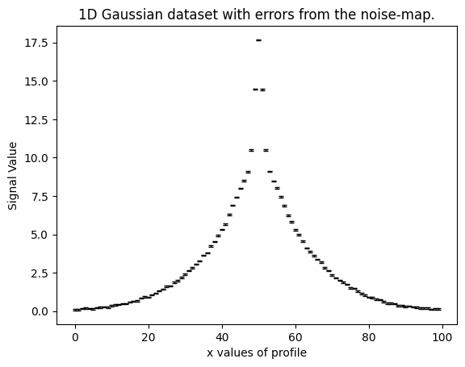
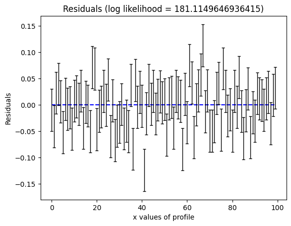
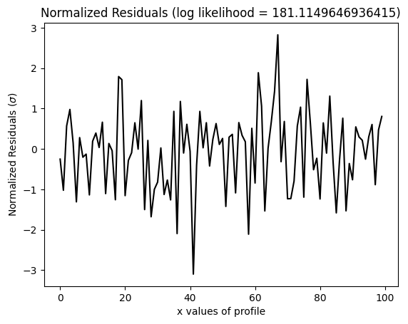
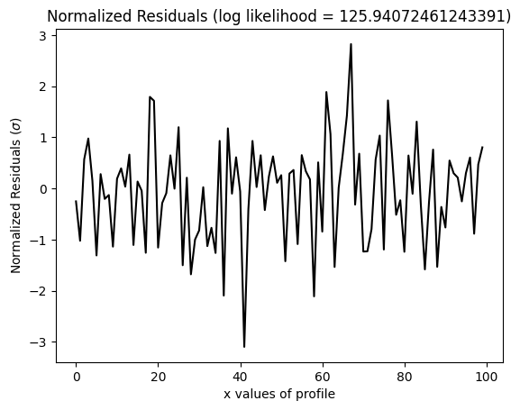
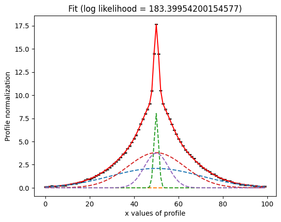
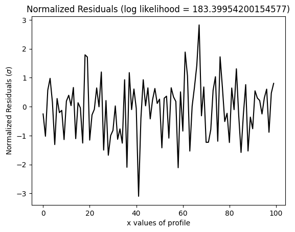
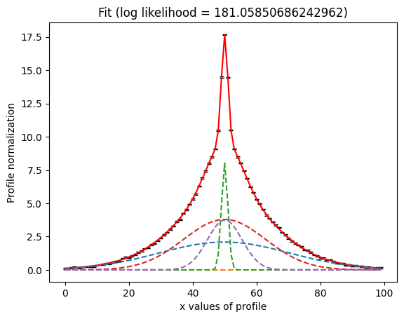
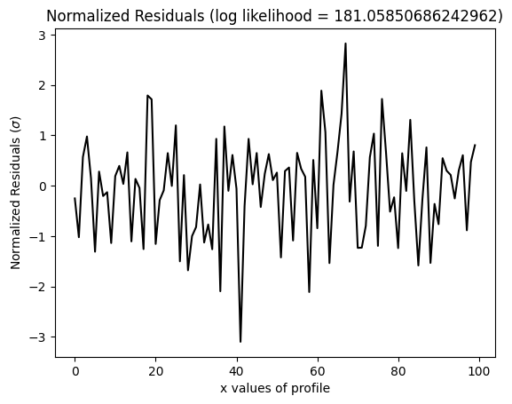

> ✏️ **This page is auto-generated from [`scripts/chapter_1_introduction/tutorial_4_why_modeling_is_hard.py`](../../scripts/chapter_1_introduction/tutorial_4_why_modeling_is_hard.py) — do not edit it directly.**
> It shows the example fully executed, with its real output images.
> Run it yourself via the [Python script](../../scripts/chapter_1_introduction/tutorial_4_why_modeling_is_hard.py) or the [Jupyter notebook](../../notebooks/chapter_1_introduction/tutorial_4_why_modeling_is_hard.ipynb).

Tutorial 4: Why Modeling Is Hard
================================

We have successfully fitted a simple 1D Gaussian profile to a dataset using a non-linear search. While achieving an
accurate model fit has been straightforward, the reality is that model fitting is a challenging problem where many things can go wrong.

This tutorial will illustrate why modeling is challenging, highlight common problems that occur when fitting complex
models, and show how a good scientific approach can help us overcome these challenges.

We will build on concepts introduced in previous tutorials, such as the non-linear parameter space, likelihood surface,
and the role of priors.

__Overview__

In this tutorial, we will fit complex models with up to 15 free parameters and consider the following:

- Why more complex models are more difficult to fit and may lead the non-linear search to infer an incorrect solution.

- Strategies for ensuring the non-linear search estimates the correct solution.

- What drives the run-times of a model fit and how to carefully balance run-times with model complexity.

__Contents__

- **Data**: Load and plot the 1D Gaussian dataset we'll fit, which is more complex than the previous tutorial.
- **Model**: The `Gaussian` model component that we will fit to the data.
- **Analysis**: The log likelihood function used to fit the model to the data.
- **Alternative Syntax**: An alternative loop-based approach for creating a summed profile from multiple model components.
- **Collection**: The `Collection` model used to compose the model-fit.
- **Search**: Set up the nested sampling search (Dynesty) for the model-fit.
- **Model Fit**: Perform the model-fit and examine the results.
- **Result**: Determine if the model-fit was successful and what can be done to ensure a good model-fit.
- **Why Modeling is Hard**: Introduce the concept of randomness and local maxima and why they make model-fitting challenging.
- **Prior Tuning**: Adjust the priors of the model to help the non-linear search find the global maxima solution.
- **Reducing Complexity**: Simplify the model to reduce the dimensionality of the parameter space.
- **Search More Thoroughly**: Adjust the non-linear search settings to search parameter space more thoroughly.
- **Summary**: Summarize the three strategies for ensuring successful model-fitting.
- **Run Times**: Discuss how the likelihood function and complexity of a model impacts the run-time of a model-fit.
- **Model Mismatch**: Introduce the concept of model mismatches and how it makes inferring the correct model challenging.
- **Astronomy Example**: How the concepts of this tutorial are applied to real astronomical problems.
- **Wrap Up**: A summary of the key takeaways of this tutorial.


```python

from autofit import setup_notebook; setup_notebook()

from os import path
import numpy as np
import matplotlib.pyplot as plt

import autofit as af
```

    Working Directory has been set to `HowToFit`


__Data__

Load the dataset we fit. 

This is a new `dataset` where the underlying signal is a sum of five `Gaussian` profiles.


```python
dataset_path = path.join("dataset", "example_1d", "gaussian_x5")
```

__Dataset Auto-Simulation__

If the dataset does not already exist on your system, it will be created by running the corresponding
simulator script. This ensures that all example scripts can be run without manually simulating data first.


```python
if not path.exists(dataset_path):
    import subprocess
    import sys

    subprocess.run(
        [sys.executable, "scripts/simulators/simulators.py"],
        check=True,
    )

data = af.util.numpy_array_from_json(file_path=path.join(dataset_path, "data.json"))
noise_map = af.util.numpy_array_from_json(
    file_path=path.join(dataset_path, "noise_map.json")
)
```

Plotting the data reveals that the signal is more complex than a simple 1D Gaussian, as the wings to the left and 
right are more extended than what a single Gaussian profile can account for.


```python
xvalues = np.arange(data.shape[0])
plt.errorbar(
    xvalues,
    data,
    yerr=noise_map,
    linestyle="",
    color="k",
    ecolor="k",
    elinewidth=1,
    capsize=2,
)
plt.title("1D Gaussian dataset with errors from the noise-map.")
plt.xlabel("x values of profile")
plt.ylabel("Signal Value")
plt.show()
plt.clf()
plt.close()
```


    

    


__Model__

Create the `Gaussian` class from which we will compose model components using the standard format.


```python


class Gaussian:
    def __init__(
        self,
        centre: float = 30.0,  # <- **PyAutoFit** recognises these constructor arguments
        normalization: float = 1.0,  # <- are the Gaussian`s model parameters.
        sigma: float = 5.0,
    ):
        """
        Represents a 1D Gaussian profile.

        This is a model-component of example models in the **HowToFit** lectures and is used to perform model-fitting
        of example datasets.

        Parameters
        ----------
        centre
            The x coordinate of the profile centre.
        normalization
            Overall normalization of the profile.
        sigma
            The sigma value controlling the size of the Gaussian.
        """
        self.centre = centre
        self.normalization = normalization
        self.sigma = sigma

    def model_data_from(self, xvalues: np.ndarray) -> np.ndarray:
        """
        Returns a 1D Gaussian on an input list of Cartesian x coordinates.

        The input xvalues are translated to a coordinate system centred on the Gaussian, via its `centre`.

        The output is referred to as the `model_data` to signify that it is a representation of the data from the
        model.

        Parameters
        ----------
        xvalues
            The x coordinates in the original reference frame of the data.

        Returns
        -------
        np.array
            The Gaussian values at the input x coordinates.
        """
        transformed_xvalues = np.subtract(xvalues, self.centre)
        return np.multiply(
            np.divide(self.normalization, self.sigma * np.sqrt(2.0 * np.pi)),
            np.exp(-0.5 * np.square(np.divide(transformed_xvalues, self.sigma))),
        )

```

__Analysis__

To define the Analysis class for this model-fit, we need to ensure that the `log_likelihood_function` can handle an 
instance containing multiple 1D profiles. Below is an expanded explanation and the corresponding class definition:

The log_likelihood_function will now assume that the instance it receives consists of multiple Gaussian profiles. 
For each Gaussian in the instance, it will compute the model_data and then sum these to create the overall `model_data` 
that is compared to the observed data.


```python


class Analysis(af.Analysis):
    def __init__(self, data: np.ndarray, noise_map: np.ndarray):
        """
        The `Analysis` class acts as an interface between the data and model in **PyAutoFit**.

        Its `log_likelihood_function` defines how the model is fitted to the data and it is called many times by
        the non-linear search fitting algorithm.

        In this example, the `log_likelihood_function` receives an instance containing multiple instances of
        the `Gaussian` class and sums the `model_data` of each to create the overall model fit to the data.

        In this example the `Analysis` `__init__` constructor only contains the `data` and `noise-map`, but it can be
        easily extended to include other quantities.

        Parameters
        ----------
        data
            A 1D numpy array containing the data (e.g. a noisy 1D signal) fitted in the workspace examples.
        noise_map
            A 1D numpy array containing the noise values of the data, used for computing the goodness of fit
            metric, the log likelihood.
        """
        super().__init__()

        self.data = data
        self.noise_map = noise_map

    def log_likelihood_function(self, instance) -> float:
        """
        Returns the log likelihood of a fit of a 1D Gaussian to the dataset.

        In the previous tutorial, the instance was a single `Gaussian` profile, however this function now assumes
        the instance contains multiple `Gaussian` profiles.

        The `model_data` is therefore the summed `model_data` of all individual Gaussians in the model.

        The docstring below describes this in more detail.

        Parameters
        ----------
        instance
            A list of 1D profiles with parameters set via the non-linear search.

        Returns
        -------
        float
            The log likelihood value indicating how well this model fit the `MaskedDataset`.
        """

        """
        In the previous tutorial the instance was a single `Gaussian` profile, meaning we could create the model data 
        using the line:

            model_data = instance.gaussian.model_data_from(xvalues=self.data.xvalues)

        In this tutorial our instance is comprised of three 1D Gaussians, because we will use a `Collection` to
        compose the model:

            model = Collection(gaussian_0=Gaussian, gaussian_1=Gaussian, gaussian_2=Gaussian).

        By using a Collection, this means the instance parameter input into the fit function is a
        dictionary where individual profiles (and their parameters) can be accessed as followed:

            print(instance.gaussian_0)
            print(instance.gaussian_1)
            print(instance.gaussian_2)
            
            print(instance.gaussian_0.centre)
            print(instance.gaussian_1.centre)
            print(instance.gaussian_2.centre)

        The `model_data` is therefore the summed `model_data` of all individual Gaussians in the model. 
        
        The function `model_data_from_instance` performs this summation. 
        """
        model_data = self.model_data_from_instance(instance=instance)

        residual_map = self.data - model_data
        chi_squared_map = (residual_map / self.noise_map) ** 2.0
        chi_squared = sum(chi_squared_map)
        noise_normalization = np.sum(np.log(2 * np.pi * noise_map**2.0))
        log_likelihood = -0.5 * (chi_squared + noise_normalization)

        return log_likelihood

    def model_data_from_instance(self, instance):
        """
        To create the summed profile of all individual profiles, we use a list comprehension to iterate over
        all profiles in the instance.

        The `instance` has the properties of a Python `iterator` and therefore can be looped over using the standard
        Python for syntax (e.g. `for profile in instance`).

        __Alternative Syntax__

        For those not familiar with Python list comprehensions, the code below shows how to use the instance to
        create the summed profile using a for loop and numpy array:

        model_data = np.zeros(shape=self.data.xvalues.shape[0])

        for profile in instance:
            model_data += profile.model_data_from(xvalues=self.data.xvalues)

        return model_data
        """
        xvalues = np.arange(self.data.shape[0])

        return sum([profile.model_data_from(xvalues=xvalues) for profile in instance])

```

__Collection__

In the previous tutorial, we fitted a single `Gaussian` profile to the dataset by turning it into a model 
component using the `Model` class.

In this tutorial, we will fit a model composed of five `Gaussian` profiles. To do this, we need to combine 
five `Gaussian` model components into a single model.

This can be achieved using a `Collection` object, which was introduced in tutorial 1. The `Collection` object allows 
us to group together multiple model components—in this case, five `Gaussian` profiles—into one model that can be 
passed to the non-linear search.


```python
model = af.Collection(
    gaussian_0=Gaussian,
    gaussian_1=Gaussian,
    gaussian_2=Gaussian,
    gaussian_3=Gaussian,
    gaussian_4=Gaussian,
)
```

The `model.info` confirms the model is composed of 5 `Gaussian` profiles.


```python
print(model.info)
```

    Total Free Parameters = 15
    
    model                                                                           Collection (N=15)
        gaussian_0 - gaussian_4                                                     Gaussian (N=3)
    
    gaussian_0
        centre                                                                      UniformPrior [0], lower_limit = 0.0, upper_limit = 100.0
        normalization                                                               LogUniformPrior [1], lower_limit = 1e-06, upper_limit = 1000000.0
        sigma                                                                       UniformPrior [2], lower_limit = 0.0, upper_limit = 25.0
    gaussian_1
        centre                                                                      UniformPrior [3], lower_limit = 0.0, upper_limit = 100.0
        normalization                                                               LogUniformPrior [4], lower_limit = 1e-06, upper_limit = 1000000.0
        sigma                                                                       UniformPrior [5], lower_limit = 0.0, upper_limit = 25.0
    gaussian_2
        centre                                                                      UniformPrior [6], lower_limit = 0.0, upper_limit = 100.0
        normalization                                                               LogUniformPrior [7], lower_limit = 1e-06, upper_limit = 1000000.0
        sigma                                                                       UniformPrior [8], lower_limit = 0.0, upper_limit = 25.0
    gaussian_3
        centre                                                                      UniformPrior [9], lower_limit = 0.0, upper_limit = 100.0
        normalization                                                               LogUniformPrior [10], lower_limit = 1e-06, upper_limit = 1000000.0
        sigma                                                                       UniformPrior [11], lower_limit = 0.0, upper_limit = 25.0
    gaussian_4
        centre                                                                      UniformPrior [12], lower_limit = 0.0, upper_limit = 100.0
        normalization                                                               LogUniformPrior [13], lower_limit = 1e-06, upper_limit = 1000000.0
        sigma                                                                       UniformPrior [14], lower_limit = 0.0, upper_limit = 25.0


__Search__

We again use the nested sampling algorithm Dynesty to fit the model to the data.


```python
search = af.DynestyStatic(
    sample="rwalk",  # This makes dynesty run faster, don't worry about what it means for now!
)
```

__Model Fit__

Perform the fit using our five `Gaussian` model, which has 15 free parameters.

This means the non-linear parameter space has a dimensionality of N=15, making it significantly more complex 
than the simpler model we fitted in the previous tutorial.

Consequently, the non-linear search takes slightly longer to run but still completes in under a minute.


```python
analysis = Analysis(data=data, noise_map=noise_map)

print(
    """
    The non-linear search has begun running.
    This Jupyter notebook cell with progress once the search has completed - this could take a few minutes!
    """
)

result = search.fit(model=model, analysis=analysis)

print("The search has finished run - you may now continue the notebook.")
```

    
        The non-linear search has begun running.
        This Jupyter notebook cell with progress once the search has completed - this could take a few minutes!
        
    2026-07-11 16:23:05,069 - autofit.non_linear.search.abstract_search - INFO - Starting non-linear search with 1 cores.


    2026-07-11 16:23:05,079 - root - INFO - Output to hard-disk disabled, input a search name to enable.


    2026-07-11 16:23:05,080 - root - INFO - Starting new Dynesty non-linear search (no previous samples found).


    2026-07-11 16:23:05,289 - autofit.non_linear.initializer - INFO - Generating initial samples of model using JAX LH Function cores


    2026-07-11 16:23:05,324 - autofit.non_linear.initializer - INFO - Initial samples generated, starting non-linear search


    ~/venv/PyAuto/lib/python3.12/site-packages/dynesty/dynesty.py:194: UserWarning: Specifying slice option while using rwalk sampler does not make sense
      warnings.warn('Specifying slice option while using rwalk sampler'


    0it [00:00, ?it/s]

    36it [00:00, 349.06it/s, bound: 0 | nc: 3 | ncall: 100 | eff(%): 36.000 | loglstar:   -inf <   -inf <    inf | logz:   -inf +/-    nan | dlogz:    inf >  0.059]

    71it [00:00, 234.58it/s, bound: 0 | nc: 1 | ncall: 204 | eff(%): 34.804 | loglstar:   -inf <   -inf <    inf | logz:   -inf +/-  0.347 | dlogz:    inf >  0.059]

    97it [00:00, 155.48it/s, bound: 0 | nc: 7 | ncall: 332 | eff(%): 29.217 | loglstar:   -inf < -676962.382 <    inf | logz: -676968.908 +/-  0.359 | dlogz: 541835.334 >  0.059]

    116it [00:01, 86.30it/s, bound: 0 | nc: 48 | ncall: 584 | eff(%): 19.863 | loglstar:   -inf < -655809.826 <    inf | logz: -655816.728 +/-  0.370 | dlogz: 520222.316 >  0.059]

    129it [00:01, 76.05it/s, bound: 0 | nc: 1 | ncall: 723 | eff(%): 17.842 | loglstar:   -inf < -647634.124 <    inf | logz: -647641.283 +/-  0.377 | dlogz: 511816.618 >  0.059] 

    140it [00:01, 68.17it/s, bound: 0 | nc: 23 | ncall: 840 | eff(%): 16.667 | loglstar:   -inf < -632562.848 <    inf | logz: -632570.225 +/-  0.382 | dlogz: 496673.227 >  0.059]

    149it [00:01, 58.54it/s, bound: 0 | nc: 11 | ncall: 967 | eff(%): 15.408 | loglstar:   -inf < -620370.724 <    inf | logz: -620378.279 +/-  0.387 | dlogz: 485513.004 >  0.059]

    156it [00:02, 46.49it/s, bound: 0 | nc: 2 | ncall: 1111 | eff(%): 14.041 | loglstar:   -inf < -606573.503 <    inf | logz: -606581.197 +/-  0.390 | dlogz: 471472.051 >  0.059]

    162it [00:02, 37.74it/s, bound: 0 | nc: 59 | ncall: 1268 | eff(%): 12.776 | loglstar:   -inf < -599639.808 <    inf | logz: -599647.622 +/-  0.393 | dlogz: 464375.439 >  0.059]

    167it [00:02, 31.86it/s, bound: 0 | nc: 25 | ncall: 1371 | eff(%): 12.181 | loglstar:   -inf < -583199.863 <    inf | logz: -583207.776 +/-  0.396 | dlogz: 452150.423 >  0.059]

    171it [00:02, 31.63it/s, bound: 0 | nc: 5 | ncall: 1447 | eff(%): 11.818 | loglstar:   -inf < -569894.638 <    inf | logz: -569902.630 +/-  0.398 | dlogz: 436253.538 >  0.059] 

    175it [00:02, 27.67it/s, bound: 0 | nc: 42 | ncall: 1559 | eff(%): 11.225 | loglstar:   -inf < -564236.979 <    inf | logz: -564245.050 +/-  0.400 | dlogz: 428434.317 >  0.059]

    178it [00:03, 25.65it/s, bound: 0 | nc: 17 | ncall: 1638 | eff(%): 10.867 | loglstar:   -inf < -562490.713 <    inf | logz: -562498.843 +/-  0.401 | dlogz: 426853.159 >  0.059]

    181it [00:03, 16.51it/s, bound: 1 | nc: 6 | ncall: 1845 | eff(%):  9.810 | loglstar:   -inf < -557232.231 <    inf | logz: -557240.420 +/-  0.403 | dlogz: 425013.706 >  0.059] 

    206it [00:03, 47.74it/s, bound: 4 | nc: 5 | ncall: 1970 | eff(%): 10.457 | loglstar:   -inf < -471575.571 <    inf | logz: -471584.257 +/-  0.413 | dlogz: 348098.046 >  0.059]

    232it [00:03, 81.14it/s, bound: 7 | nc: 5 | ncall: 2100 | eff(%): 11.048 | loglstar:   -inf < -376179.075 <    inf | logz: -376188.281 +/-  0.421 | dlogz: 256926.185 >  0.059]

    258it [00:03, 114.25it/s, bound: 10 | nc: 5 | ncall: 2230 | eff(%): 11.570 | loglstar:   -inf < -261154.544 <    inf | logz: -261164.268 +/-  0.430 | dlogz: 137801.135 >  0.059]

    280it [00:03, 136.17it/s, bound: 13 | nc: 5 | ncall: 2340 | eff(%): 11.966 | loglstar:   -inf < -213400.730 <    inf | logz: -213410.902 +/-  0.435 | dlogz: 182118.092 >  0.059]

    302it [00:04, 155.31it/s, bound: 16 | nc: 5 | ncall: 2450 | eff(%): 12.327 | loglstar:   -inf < -184912.417 <    inf | logz: -184920.530 +/-  0.380 | dlogz: 140640.287 >  0.059]

    324it [00:04, 168.77it/s, bound: 19 | nc: 5 | ncall: 2560 | eff(%): 12.656 | loglstar:   -inf < -175034.588 <    inf | logz: -175045.673 +/-  0.445 | dlogz: 130836.599 >  0.059]

    344it [00:04, 176.54it/s, bound: 21 | nc: 5 | ncall: 2660 | eff(%): 12.932 | loglstar:   -inf < -159297.074 <    inf | logz: -159306.914 +/-  0.411 | dlogz: 115026.106 >  0.059]

    364it [00:04, 181.46it/s, bound: 24 | nc: 5 | ncall: 2760 | eff(%): 13.188 | loglstar:   -inf < -151485.314 <    inf | logz: -151495.568 +/-  0.414 | dlogz: 107214.346 >  0.059]

    384it [00:04, 184.35it/s, bound: 26 | nc: 5 | ncall: 2860 | eff(%): 13.427 | loglstar:   -inf < -136064.884 <    inf | logz: -136077.188 +/-  0.457 | dlogz: 91900.187 >  0.059] 

    404it [00:04, 187.96it/s, bound: 29 | nc: 5 | ncall: 2960 | eff(%): 13.649 | loglstar:   -inf < -124853.150 <    inf | logz: -124864.207 +/-  0.425 | dlogz: 80582.182 >  0.059]

    426it [00:04, 195.99it/s, bound: 31 | nc: 5 | ncall: 3070 | eff(%): 13.876 | loglstar:   -inf < -111504.314 <    inf | logz: -111516.346 +/-  0.442 | dlogz: 67234.464 >  0.059]

    448it [00:04, 202.74it/s, bound: 34 | nc: 5 | ncall: 3180 | eff(%): 14.088 | loglstar:   -inf < -98643.791 <    inf | logz: -98657.386 +/-  0.472 | dlogz: 57842.330 >  0.059]  

    471it [00:04, 209.73it/s, bound: 37 | nc: 5 | ncall: 3295 | eff(%): 14.294 | loglstar:   -inf < -93382.628 <    inf | logz: -93395.042 +/-  0.441 | dlogz: 49111.660 >  0.059]

    494it [00:04, 213.22it/s, bound: 40 | nc: 5 | ncall: 3410 | eff(%): 14.487 | loglstar:   -inf < -86782.656 <    inf | logz: -86796.065 +/-  0.457 | dlogz: 42512.806 >  0.059]

    516it [00:05, 213.80it/s, bound: 43 | nc: 5 | ncall: 3520 | eff(%): 14.659 | loglstar:   -inf < -76030.319 <    inf | logz: -76044.167 +/-  0.464 | dlogz: 33874.773 >  0.059]

    539it [00:05, 218.21it/s, bound: 45 | nc: 5 | ncall: 3635 | eff(%): 14.828 | loglstar:   -inf < -66467.299 <    inf | logz: -66481.077 +/-  0.458 | dlogz: 24310.634 >  0.059]

    561it [00:05, 210.52it/s, bound: 48 | nc: 5 | ncall: 3745 | eff(%): 14.980 | loglstar:   -inf < -58401.375 <    inf | logz: -58417.241 +/-  0.499 | dlogz: 16653.533 >  0.059]

    583it [00:05, 202.79it/s, bound: 51 | nc: 5 | ncall: 3855 | eff(%): 15.123 | loglstar:   -inf < -54018.533 <    inf | logz: -54034.842 +/-  0.504 | dlogz: 12091.627 >  0.059]

    604it [00:05, 195.08it/s, bound: 54 | nc: 5 | ncall: 3960 | eff(%): 15.253 | loglstar:   -inf < -52277.995 <    inf | logz: -52293.606 +/-  0.486 | dlogz: 16571.889 >  0.059]

    626it [00:05, 199.56it/s, bound: 56 | nc: 5 | ncall: 4070 | eff(%): 15.381 | loglstar:   -inf < -50131.770 <    inf | logz: -50148.941 +/-  0.514 | dlogz: 14503.677 >  0.059]

    647it [00:05, 202.09it/s, bound: 59 | nc: 5 | ncall: 4175 | eff(%): 15.497 | loglstar:   -inf < -46247.663 <    inf | logz: -46265.252 +/-  0.520 | dlogz: 10553.178 >  0.059]

    669it [00:05, 206.46it/s, bound: 62 | nc: 5 | ncall: 4285 | eff(%): 15.613 | loglstar:   -inf < -44656.592 <    inf | logz: -44674.626 +/-  0.524 | dlogz: 9017.177 >  0.059] 

    690it [00:05, 207.29it/s, bound: 64 | nc: 5 | ncall: 4390 | eff(%): 15.718 | loglstar:   -inf < -44274.455 <    inf | logz: -44290.637 +/-  0.482 | dlogz: 11785.137 >  0.059]

    713it [00:06, 211.76it/s, bound: 67 | nc: 5 | ncall: 4505 | eff(%): 15.827 | loglstar:   -inf < -42622.954 <    inf | logz: -42641.878 +/-  0.533 | dlogz: 10171.492 >  0.059]

    735it [00:06, 213.43it/s, bound: 70 | nc: 5 | ncall: 4615 | eff(%): 15.926 | loglstar:   -inf < -42160.151 <    inf | logz: -42179.525 +/-  0.536 | dlogz: 9835.917 >  0.059] 

    760it [00:06, 221.66it/s, bound: 73 | nc: 5 | ncall: 4740 | eff(%): 16.034 | loglstar:   -inf < -39924.884 <    inf | logz: -39943.638 +/-  0.521 | dlogz: 7437.574 >  0.059]

    786it [00:06, 231.37it/s, bound: 76 | nc: 5 | ncall: 4870 | eff(%): 16.140 | loglstar:   -inf < -39022.002 <    inf | logz: -39042.409 +/-  0.547 | dlogz: 6549.020 >  0.059]

    810it [00:06, 229.17it/s, bound: 79 | nc: 5 | ncall: 4990 | eff(%): 16.232 | loglstar:   -inf < -37544.420 <    inf | logz: -37565.307 +/-  0.553 | dlogz: 5186.148 >  0.059]

    838it [00:06, 242.02it/s, bound: 83 | nc: 5 | ncall: 5130 | eff(%): 16.335 | loglstar:   -inf < -36800.267 <    inf | logz: -36821.710 +/-  0.557 | dlogz: 4679.464 >  0.059]

    865it [00:06, 248.71it/s, bound: 86 | nc: 5 | ncall: 5265 | eff(%): 16.429 | loglstar:   -inf < -35519.025 <    inf | logz: -35539.371 +/-  0.534 | dlogz: 4912.010 >  0.059]

    891it [00:06, 250.69it/s, bound: 90 | nc: 5 | ncall: 5395 | eff(%): 16.515 | loglstar:   -inf < -34188.087 <    inf | logz: -34210.598 +/-  0.572 | dlogz: 3591.748 >  0.059]

    917it [00:06, 250.16it/s, bound: 93 | nc: 5 | ncall: 5525 | eff(%): 16.597 | loglstar:   -inf < -33434.010 <    inf | logz: -33457.042 +/-  0.578 | dlogz: 2864.468 >  0.059]

    943it [00:06, 249.55it/s, bound: 97 | nc: 5 | ncall: 5655 | eff(%): 16.676 | loglstar:   -inf < -32749.017 <    inf | logz: -32771.448 +/-  0.565 | dlogz: 5273.469 >  0.059]

    972it [00:07, 260.68it/s, bound: 101 | nc: 5 | ncall: 5800 | eff(%): 16.759 | loglstar:   -inf < -32285.709 <    inf | logz: -32308.681 +/-  0.569 | dlogz: 7339.013 >  0.059]

    1001it [00:07, 267.34it/s, bound: 105 | nc: 5 | ncall: 5945 | eff(%): 16.838 | loglstar:   -inf < -31683.093 <    inf | logz: -31707.823 +/-  0.595 | dlogz: 11152.980 >  0.059]

    1028it [00:07, 267.13it/s, bound: 108 | nc: 5 | ncall: 6080 | eff(%): 16.908 | loglstar:   -inf < -30068.373 <    inf | logz: -30093.644 +/-  0.600 | dlogz: 10372.474 >  0.059]

    1055it [00:07, 266.03it/s, bound: 113 | nc: 5 | ncall: 6215 | eff(%): 16.975 | loglstar:   -inf < -28601.815 <    inf | logz: -28627.624 +/-  0.607 | dlogz: 8640.504 >  0.059] 

    1082it [00:07, 239.30it/s, bound: 116 | nc: 5 | ncall: 6350 | eff(%): 17.039 | loglstar:   -inf < -27057.195 <    inf | logz: -27081.536 +/-  0.579 | dlogz: 7978.674 >  0.059]

    1107it [00:07, 224.32it/s, bound: 120 | nc: 5 | ncall: 6475 | eff(%): 17.097 | loglstar:   -inf < -25983.378 <    inf | logz: -26010.239 +/-  0.616 | dlogz: 10992.740 >  0.059]

    1131it [00:07, 225.97it/s, bound: 123 | nc: 5 | ncall: 6595 | eff(%): 17.149 | loglstar:   -inf < -23547.514 <    inf | logz: -23574.853 +/-  0.623 | dlogz: 10684.604 >  0.059]

    1154it [00:07, 226.90it/s, bound: 127 | nc: 5 | ncall: 6710 | eff(%): 17.198 | loglstar:   -inf < -21859.080 <    inf | logz: -21885.764 +/-  0.609 | dlogz: 8721.452 >  0.059] 

    1178it [00:07, 230.43it/s, bound: 130 | nc: 5 | ncall: 6830 | eff(%): 17.247 | loglstar:   -inf < -20281.639 <    inf | logz: -20309.921 +/-  0.633 | dlogz: 7203.562 >  0.059]

    1202it [00:08, 231.94it/s, bound: 134 | nc: 5 | ncall: 6950 | eff(%): 17.295 | loglstar:   -inf < -19180.535 <    inf | logz: -19208.178 +/-  0.620 | dlogz: 6042.911 >  0.059]

    1229it [00:08, 241.47it/s, bound: 139 | nc: 5 | ncall: 7085 | eff(%): 17.347 | loglstar:   -inf < -18161.991 <    inf | logz: -18188.795 +/-  0.601 | dlogz: 8424.477 >  0.059]

    1255it [00:08, 245.08it/s, bound: 143 | nc: 5 | ncall: 7215 | eff(%): 17.394 | loglstar:   -inf < -16677.263 <    inf | logz: -16707.097 +/-  0.646 | dlogz: 6995.471 >  0.059]

    1285it [00:08, 258.34it/s, bound: 146 | nc: 5 | ncall: 7365 | eff(%): 17.447 | loglstar:   -inf < -15471.839 <    inf | logz: -15502.272 +/-  0.652 | dlogz: 6935.616 >  0.059]

    1312it [00:08, 260.26it/s, bound: 151 | nc: 5 | ncall: 7500 | eff(%): 17.493 | loglstar:   -inf < -14107.515 <    inf | logz: -14138.489 +/-  0.657 | dlogz: 5514.862 >  0.059]

    1341it [00:08, 268.54it/s, bound: 155 | nc: 5 | ncall: 7645 | eff(%): 17.541 | loglstar:   -inf < -13124.280 <    inf | logz: -13155.826 +/-  0.664 | dlogz: 4525.702 >  0.059]

    1370it [00:08, 274.65it/s, bound: 159 | nc: 5 | ncall: 7790 | eff(%): 17.587 | loglstar:   -inf < -12290.026 <    inf | logz: -12320.509 +/-  0.645 | dlogz: 3684.529 >  0.059]

    1400it [00:08, 278.36it/s, bound: 163 | nc: 5 | ncall: 7940 | eff(%): 17.632 | loglstar:   -inf < -11090.478 <    inf | logz: -11123.217 +/-  0.676 | dlogz: 2529.903 >  0.059]

    1428it [00:08, 271.40it/s, bound: 166 | nc: 5 | ncall: 8080 | eff(%): 17.673 | loglstar:   -inf < -10385.434 <    inf | logz: -10418.733 +/-  0.680 | dlogz: 1786.569 >  0.059]

    1457it [00:08, 276.67it/s, bound: 170 | nc: 5 | ncall: 8225 | eff(%): 17.714 | loglstar:   -inf < -9723.039 <    inf | logz: -9755.279 +/-  0.661 | dlogz: 2378.173 >  0.059]  

    1488it [00:09, 285.27it/s, bound: 174 | nc: 5 | ncall: 8380 | eff(%): 17.757 | loglstar:   -inf < -9244.603 <    inf | logz: -9277.466 +/-  0.667 | dlogz: 2645.872 >  0.059]

    1517it [00:09, 282.34it/s, bound: 178 | nc: 5 | ncall: 8525 | eff(%): 17.795 | loglstar:   -inf < -8750.492 <    inf | logz: -8785.585 +/-  0.696 | dlogz: 2199.812 >  0.059]

    1547it [00:09, 286.39it/s, bound: 183 | nc: 5 | ncall: 8675 | eff(%): 17.833 | loglstar:   -inf < -8184.322 <    inf | logz: -8220.020 +/-  0.703 | dlogz: 1595.906 >  0.059]

    1578it [00:09, 292.45it/s, bound: 188 | nc: 5 | ncall: 8830 | eff(%): 17.871 | loglstar:   -inf < -7524.929 <    inf | logz: -7561.244 +/-  0.709 | dlogz: 1145.003 >  0.059]

    1608it [00:09, 293.74it/s, bound: 192 | nc: 5 | ncall: 8980 | eff(%): 17.906 | loglstar:   -inf < -7296.280 <    inf | logz: -7333.222 +/-  0.713 | dlogz: 1105.129 >  0.059]

    1638it [00:09, 289.38it/s, bound: 196 | nc: 5 | ncall: 9130 | eff(%): 17.941 | loglstar:   -inf < -7031.596 <    inf | logz: -7067.947 +/-  0.697 | dlogz: 1091.543 >  0.059]

    1667it [00:09, 280.05it/s, bound: 201 | nc: 5 | ncall: 9275 | eff(%): 17.973 | loglstar:   -inf < -6714.885 <    inf | logz: -6752.933 +/-  0.719 | dlogz: 778.239 >  0.059] 

    1699it [00:09, 289.84it/s, bound: 205 | nc: 5 | ncall: 9435 | eff(%): 18.007 | loglstar:   -inf < -6556.201 <    inf | logz: -6593.854 +/-  0.713 | dlogz: 616.372 >  0.059]

    1729it [00:09, 284.76it/s, bound: 209 | nc: 5 | ncall: 9585 | eff(%): 18.039 | loglstar:   -inf < -6405.988 <    inf | logz: -6445.038 +/-  0.723 | dlogz: 856.664 >  0.059]

    1758it [00:10, 280.72it/s, bound: 214 | nc: 5 | ncall: 9730 | eff(%): 18.068 | loglstar:   -inf < -6217.292 <    inf | logz: -6257.243 +/-  0.740 | dlogz: 771.000 >  0.059]

    1788it [00:10, 285.50it/s, bound: 218 | nc: 5 | ncall: 9880 | eff(%): 18.097 | loglstar:   -inf < -6081.272 <    inf | logz: -6121.680 +/-  0.738 | dlogz: 625.590 >  0.059]

    1818it [00:10, 288.43it/s, bound: 222 | nc: 5 | ncall: 10030 | eff(%): 18.126 | loglstar:   -inf < -5980.286 <    inf | logz: -6020.269 +/-  0.734 | dlogz: 574.204 >  0.059]

    1848it [00:10, 290.36it/s, bound: 226 | nc: 5 | ncall: 10180 | eff(%): 18.153 | loglstar:   -inf < -5791.723 <    inf | logz: -5832.353 +/-  0.743 | dlogz: 385.784 >  0.059]

    1878it [00:10, 288.56it/s, bound: 230 | nc: 5 | ncall: 10330 | eff(%): 18.180 | loglstar:   -inf < -5694.234 <    inf | logz: -5735.901 +/-  0.746 | dlogz: 313.606 >  0.059]

    1907it [00:10, 279.89it/s, bound: 234 | nc: 5 | ncall: 10475 | eff(%): 18.205 | loglstar:   -inf < -5555.597 <    inf | logz: -5596.907 +/-  0.740 | dlogz: 409.483 >  0.059]

    1936it [00:10, 281.48it/s, bound: 237 | nc: 5 | ncall: 10620 | eff(%): 18.230 | loglstar:   -inf < -5520.492 <    inf | logz: -5563.596 +/-  0.762 | dlogz: 376.924 >  0.059]

    1966it [00:10, 285.15it/s, bound: 242 | nc: 5 | ncall: 10770 | eff(%): 18.254 | loglstar:   -inf < -5439.713 <    inf | logz: -5483.816 +/-  0.780 | dlogz: 392.344 >  0.059]

    1997it [00:10, 291.25it/s, bound: 247 | nc: 5 | ncall: 10925 | eff(%): 18.279 | loglstar:   -inf < -5371.853 <    inf | logz: -5416.531 +/-  0.783 | dlogz: 488.928 >  0.059]

    2028it [00:10, 292.20it/s, bound: 252 | nc: 5 | ncall: 11080 | eff(%): 18.303 | loglstar:   -inf < -5279.399 <    inf | logz: -5323.611 +/-  0.766 | dlogz: 549.241 >  0.059]

    2058it [00:11, 294.38it/s, bound: 255 | nc: 5 | ncall: 11230 | eff(%): 18.326 | loglstar:   -inf < -5197.653 <    inf | logz: -5243.262 +/-  0.782 | dlogz: 545.679 >  0.059]

    2088it [00:11, 291.54it/s, bound: 259 | nc: 5 | ncall: 11380 | eff(%): 18.348 | loglstar:   -inf < -5085.850 <    inf | logz: -5130.117 +/-  0.773 | dlogz: 430.834 >  0.059]

    2119it [00:11, 294.72it/s, bound: 264 | nc: 5 | ncall: 11535 | eff(%): 18.370 | loglstar:   -inf < -4989.770 <    inf | logz: -5035.643 +/-  0.780 | dlogz: 436.647 >  0.059]

    2150it [00:11, 297.19it/s, bound: 268 | nc: 5 | ncall: 11690 | eff(%): 18.392 | loglstar:   -inf < -4899.780 <    inf | logz: -4946.368 +/-  0.797 | dlogz: 347.254 >  0.059]

    2180it [00:11, 293.89it/s, bound: 271 | nc: 5 | ncall: 11840 | eff(%): 18.412 | loglstar:   -inf < -4800.515 <    inf | logz: -4847.357 +/-  0.796 | dlogz: 366.033 >  0.059]

    2210it [00:11, 283.57it/s, bound: 276 | nc: 5 | ncall: 11990 | eff(%): 18.432 | loglstar:   -inf < -4764.792 <    inf | logz: -4810.659 +/-  0.785 | dlogz: 328.269 >  0.059]

    2239it [00:11, 266.87it/s, bound: 279 | nc: 5 | ncall: 12135 | eff(%): 18.451 | loglstar:   -inf < -4711.500 <    inf | logz: -4761.102 +/-  0.829 | dlogz: 288.766 >  0.059]

    2268it [00:11, 271.81it/s, bound: 283 | nc: 5 | ncall: 12280 | eff(%): 18.469 | loglstar:   -inf < -4657.597 <    inf | logz: -4706.908 +/-  0.818 | dlogz: 224.333 >  0.059]

    2298it [00:11, 279.43it/s, bound: 287 | nc: 5 | ncall: 12430 | eff(%): 18.488 | loglstar:   -inf < -4610.278 <    inf | logz: -4661.015 +/-  0.838 | dlogz: 265.700 >  0.059]

    2327it [00:12, 277.68it/s, bound: 292 | nc: 5 | ncall: 12575 | eff(%): 18.505 | loglstar:   -inf < -4556.876 <    inf | logz: -4606.788 +/-  0.826 | dlogz: 444.007 >  0.059]

    2356it [00:12, 277.40it/s, bound: 296 | nc: 5 | ncall: 12720 | eff(%): 18.522 | loglstar:   -inf < -4505.287 <    inf | logz: -4557.231 +/-  0.851 | dlogz: 450.880 >  0.059]

    2385it [00:12, 280.16it/s, bound: 299 | nc: 5 | ncall: 12865 | eff(%): 18.539 | loglstar:   -inf < -4459.479 <    inf | logz: -4510.327 +/-  0.834 | dlogz: 712.685 >  0.059]

    2415it [00:12, 283.98it/s, bound: 303 | nc: 5 | ncall: 13015 | eff(%): 18.556 | loglstar:   -inf < -4409.904 <    inf | logz: -4461.642 +/-  0.840 | dlogz: 663.608 >  0.059]

    2445it [00:12, 286.60it/s, bound: 307 | nc: 5 | ncall: 13165 | eff(%): 18.572 | loglstar:   -inf < -4316.912 <    inf | logz: -4370.394 +/-  0.857 | dlogz: 573.184 >  0.059]

    2474it [00:12, 284.42it/s, bound: 310 | nc: 5 | ncall: 13310 | eff(%): 18.588 | loglstar:   -inf < -4235.231 <    inf | logz: -4288.364 +/-  0.856 | dlogz: 502.345 >  0.059]

    2503it [00:12, 247.76it/s, bound: 314 | nc: 5 | ncall: 13455 | eff(%): 18.603 | loglstar:   -inf < -4116.690 <    inf | logz: -4169.590 +/-  0.851 | dlogz: 382.330 >  0.059]

    2529it [00:12, 244.70it/s, bound: 317 | nc: 5 | ncall: 13585 | eff(%): 18.616 | loglstar:   -inf < -4058.960 <    inf | logz: -4112.301 +/-  0.851 | dlogz: 457.538 >  0.059]

    2555it [00:12, 240.26it/s, bound: 321 | nc: 5 | ncall: 13715 | eff(%): 18.629 | loglstar:   -inf < -3974.989 <    inf | logz: -4030.954 +/-  0.882 | dlogz: 386.044 >  0.059]

    2580it [00:13, 228.71it/s, bound: 324 | nc: 5 | ncall: 13840 | eff(%): 18.642 | loglstar:   -inf < -3933.400 <    inf | logz: -3988.059 +/-  0.859 | dlogz: 332.297 >  0.059]

    2604it [00:13, 228.95it/s, bound: 327 | nc: 5 | ncall: 13960 | eff(%): 18.653 | loglstar:   -inf < -3903.190 <    inf | logz: -3960.114 +/-  0.888 | dlogz: 307.461 >  0.059]

    2629it [00:13, 230.14it/s, bound: 330 | nc: 5 | ncall: 14085 | eff(%): 18.665 | loglstar:   -inf < -3884.056 <    inf | logz: -3939.796 +/-  0.874 | dlogz: 288.997 >  0.059]

    2653it [00:13, 224.40it/s, bound: 333 | nc: 5 | ncall: 14205 | eff(%): 18.677 | loglstar:   -inf < -3843.682 <    inf | logz: -3899.117 +/-  0.870 | dlogz: 365.637 >  0.059]

    2677it [00:13, 228.08it/s, bound: 336 | nc: 5 | ncall: 14325 | eff(%): 18.688 | loglstar:   -inf < -3798.061 <    inf | logz: -3855.180 +/-  0.882 | dlogz: 321.799 >  0.059]

    2703it [00:13, 234.95it/s, bound: 339 | nc: 5 | ncall: 14455 | eff(%): 18.699 | loglstar:   -inf < -3761.573 <    inf | logz: -3820.350 +/-  0.898 | dlogz: 287.779 >  0.059]

    2727it [00:13, 231.11it/s, bound: 342 | nc: 5 | ncall: 14575 | eff(%): 18.710 | loglstar:   -inf < -3729.105 <    inf | logz: -3788.540 +/-  0.909 | dlogz: 258.064 >  0.059]

    2751it [00:13, 208.03it/s, bound: 345 | nc: 5 | ncall: 14695 | eff(%): 18.721 | loglstar:   -inf < -3691.375 <    inf | logz: -3750.877 +/-  0.902 | dlogz: 216.550 >  0.059]

    2776it [00:13, 216.42it/s, bound: 348 | nc: 5 | ncall: 14820 | eff(%): 18.731 | loglstar:   -inf < -3644.681 <    inf | logz: -3703.636 +/-  0.902 | dlogz: 311.575 >  0.059]

    2801it [00:14, 224.84it/s, bound: 352 | nc: 5 | ncall: 14945 | eff(%): 18.742 | loglstar:   -inf < -3591.772 <    inf | logz: -3651.564 +/-  0.912 | dlogz: 259.446 >  0.059]

    2827it [00:14, 233.60it/s, bound: 355 | nc: 5 | ncall: 15075 | eff(%): 18.753 | loglstar:   -inf < -3548.807 <    inf | logz: -3608.553 +/-  0.909 | dlogz: 215.304 >  0.059]

    2851it [00:14, 233.54it/s, bound: 359 | nc: 5 | ncall: 15195 | eff(%): 18.763 | loglstar:   -inf < -3504.303 <    inf | logz: -3565.368 +/-  0.921 | dlogz: 259.892 >  0.059]

    2875it [00:14, 235.29it/s, bound: 362 | nc: 5 | ncall: 15315 | eff(%): 18.772 | loglstar:   -inf < -3480.360 <    inf | logz: -3540.181 +/-  0.907 | dlogz: 233.170 >  0.059]

    2899it [00:14, 236.65it/s, bound: 365 | nc: 5 | ncall: 15435 | eff(%): 18.782 | loglstar:   -inf < -3440.971 <    inf | logz: -3501.378 +/-  0.906 | dlogz: 215.082 >  0.059]

    2923it [00:14, 224.19it/s, bound: 368 | nc: 5 | ncall: 15555 | eff(%): 18.791 | loglstar:   -inf < -3388.419 <    inf | logz: -3451.788 +/-  0.943 | dlogz: 169.525 >  0.059]

    2946it [00:14, 216.71it/s, bound: 372 | nc: 5 | ncall: 15670 | eff(%): 18.800 | loglstar:   -inf < -3366.886 <    inf | logz: -3429.279 +/-  0.929 | dlogz: 142.514 >  0.059]

    2969it [00:14, 217.91it/s, bound: 375 | nc: 5 | ncall: 15785 | eff(%): 18.809 | loglstar:   -inf < -3340.426 <    inf | logz: -3404.417 +/-  0.942 | dlogz: 118.237 >  0.059]

    2992it [00:14, 220.07it/s, bound: 378 | nc: 5 | ncall: 15900 | eff(%): 18.818 | loglstar:   -inf < -3322.582 <    inf | logz: -3386.217 +/-  0.944 | dlogz: 98.952 >  0.059] 

    3015it [00:14, 218.97it/s, bound: 381 | nc: 5 | ncall: 16015 | eff(%): 18.826 | loglstar:   -inf < -3303.484 <    inf | logz: -3367.789 +/-  0.945 | dlogz: 80.005 >  0.059]

    3037it [00:15, 216.95it/s, bound: 383 | nc: 5 | ncall: 16125 | eff(%): 18.834 | loglstar:   -inf < -3291.004 <    inf | logz: -3356.147 +/-  0.946 | dlogz: 74.722 >  0.059]

    3062it [00:15, 223.54it/s, bound: 387 | nc: 5 | ncall: 16250 | eff(%): 18.843 | loglstar:   -inf < -3278.511 <    inf | logz: -3342.283 +/-  0.942 | dlogz: 61.537 >  0.059]

    3086it [00:15, 227.30it/s, bound: 390 | nc: 5 | ncall: 16370 | eff(%): 18.852 | loglstar:   -inf < -3267.117 <    inf | logz: -3333.471 +/-  0.960 | dlogz: 53.455 >  0.059]

    3111it [00:15, 232.99it/s, bound: 393 | nc: 5 | ncall: 16495 | eff(%): 18.860 | loglstar:   -inf < -3252.052 <    inf | logz: -3318.751 +/-  0.963 | dlogz: 37.967 >  0.059]

    3137it [00:15, 238.64it/s, bound: 396 | nc: 5 | ncall: 16625 | eff(%): 18.869 | loglstar:   -inf < -3241.167 <    inf | logz: -3307.366 +/-  0.954 | dlogz: 60.780 >  0.059]

    3161it [00:15, 225.76it/s, bound: 399 | nc: 5 | ncall: 16745 | eff(%): 18.877 | loglstar:   -inf < -3228.201 <    inf | logz: -3293.740 +/-  0.959 | dlogz: 47.071 >  0.059]

    3185it [00:15, 227.66it/s, bound: 402 | nc: 5 | ncall: 16865 | eff(%): 18.885 | loglstar:   -inf < -3221.507 <    inf | logz: -3288.603 +/-  0.959 | dlogz: 41.640 >  0.059]

    3208it [00:15, 225.99it/s, bound: 405 | nc: 5 | ncall: 16980 | eff(%): 18.893 | loglstar:   -inf < -3218.473 <    inf | logz: -3285.662 +/-  0.958 | dlogz: 38.082 >  0.059]

    3234it [00:15, 235.10it/s, bound: 408 | nc: 5 | ncall: 17110 | eff(%): 18.901 | loglstar:   -inf < -3208.836 <    inf | logz: -3276.342 +/-  0.974 | dlogz: 53.717 >  0.059]

    3258it [00:16, 221.87it/s, bound: 411 | nc: 5 | ncall: 17230 | eff(%): 18.909 | loglstar:   -inf < -3198.968 <    inf | logz: -3267.567 +/-  0.978 | dlogz: 47.690 >  0.059]

    3281it [00:16, 216.10it/s, bound: 415 | nc: 5 | ncall: 17345 | eff(%): 18.916 | loglstar:   -inf < -3191.602 <    inf | logz: -3259.916 +/-  0.982 | dlogz: 43.418 >  0.059]

    3305it [00:16, 221.80it/s, bound: 418 | nc: 5 | ncall: 17465 | eff(%): 18.924 | loglstar:   -inf < -3186.406 <    inf | logz: -3254.757 +/-  0.982 | dlogz: 45.126 >  0.059]

    3328it [00:16, 220.68it/s, bound: 421 | nc: 5 | ncall: 17580 | eff(%): 18.931 | loglstar:   -inf < -3180.130 <    inf | logz: -3250.980 +/-  0.995 | dlogz: 52.236 >  0.059]

    3352it [00:16, 222.46it/s, bound: 425 | nc: 5 | ncall: 17700 | eff(%): 18.938 | loglstar:   -inf < -3171.766 <    inf | logz: -3242.285 +/-  0.995 | dlogz: 42.641 >  0.059]

    3375it [00:16, 218.59it/s, bound: 428 | nc: 5 | ncall: 17815 | eff(%): 18.945 | loglstar:   -inf < -3161.316 <    inf | logz: -3232.514 +/-  1.008 | dlogz: 33.032 >  0.059]

    3398it [00:16, 220.35it/s, bound: 431 | nc: 5 | ncall: 17930 | eff(%): 18.951 | loglstar:   -inf < -3155.385 <    inf | logz: -3226.563 +/-  1.002 | dlogz: 34.306 >  0.059]

    3422it [00:16, 225.38it/s, bound: 435 | nc: 5 | ncall: 18050 | eff(%): 18.958 | loglstar:   -inf < -3151.227 <    inf | logz: -3222.548 +/-  1.001 | dlogz: 29.723 >  0.059]

    3446it [00:16, 229.25it/s, bound: 438 | nc: 5 | ncall: 18170 | eff(%): 18.965 | loglstar:   -inf < -3144.038 <    inf | logz: -3216.278 +/-  1.012 | dlogz: 29.213 >  0.059]

    3469it [00:16, 228.92it/s, bound: 441 | nc: 5 | ncall: 18285 | eff(%): 18.972 | loglstar:   -inf < -3140.698 <    inf | logz: -3211.973 +/-  1.009 | dlogz: 24.218 >  0.059]

    3493it [00:17, 230.28it/s, bound: 445 | nc: 5 | ncall: 18405 | eff(%): 18.979 | loglstar:   -inf < -3135.273 <    inf | logz: -3207.607 +/-  1.018 | dlogz: 20.942 >  0.059]

    3517it [00:17, 232.18it/s, bound: 448 | nc: 5 | ncall: 18525 | eff(%): 18.985 | loglstar:   -inf < -3131.892 <    inf | logz: -3203.824 +/-  1.016 | dlogz: 16.593 >  0.059]

    3542it [00:17, 235.95it/s, bound: 451 | nc: 5 | ncall: 18650 | eff(%): 18.992 | loglstar:   -inf < -3125.801 <    inf | logz: -3198.731 +/-  1.026 | dlogz: 16.917 >  0.059]

    3567it [00:17, 237.62it/s, bound: 455 | nc: 5 | ncall: 18775 | eff(%): 18.999 | loglstar:   -inf < -3123.639 <    inf | logz: -3196.680 +/-  1.023 | dlogz: 14.322 >  0.059]

    3592it [00:17, 239.88it/s, bound: 458 | nc: 5 | ncall: 18900 | eff(%): 19.005 | loglstar:   -inf < -3121.695 <    inf | logz: -3194.972 +/-  1.025 | dlogz: 12.083 >  0.059]

    3616it [00:17, 229.01it/s, bound: 461 | nc: 5 | ncall: 19020 | eff(%): 19.012 | loglstar:   -inf < -3119.236 <    inf | logz: -3193.290 +/-  1.031 | dlogz:  9.948 >  0.059]

    3639it [00:17, 224.41it/s, bound: 464 | nc: 5 | ncall: 19135 | eff(%): 19.018 | loglstar:   -inf < -3117.744 <    inf | logz: -3191.885 +/-  1.033 | dlogz:  8.049 >  0.059]

    3662it [00:17, 219.18it/s, bound: 467 | nc: 5 | ncall: 19250 | eff(%): 19.023 | loglstar:   -inf < -3116.298 <    inf | logz: -3190.845 +/-  1.034 | dlogz:  9.367 >  0.059]

    3684it [00:17, 213.58it/s, bound: 470 | nc: 5 | ncall: 19360 | eff(%): 19.029 | loglstar:   -inf < -3115.586 <    inf | logz: -3189.995 +/-  1.036 | dlogz:  8.062 >  0.059]

    3706it [00:18, 212.63it/s, bound: 473 | nc: 5 | ncall: 19470 | eff(%): 19.034 | loglstar:   -inf < -3114.786 <    inf | logz: -3189.469 +/-  1.037 | dlogz:  7.085 >  0.059]

    3729it [00:18, 215.48it/s, bound: 476 | nc: 5 | ncall: 19585 | eff(%): 19.040 | loglstar:   -inf < -3113.585 <    inf | logz: -3188.709 +/-  1.041 | dlogz:  5.863 >  0.059]

    3752it [00:18, 217.67it/s, bound: 479 | nc: 5 | ncall: 19700 | eff(%): 19.046 | loglstar:   -inf < -3112.587 <    inf | logz: -3188.192 +/-  1.043 | dlogz:  4.893 >  0.059]

    3776it [00:18, 222.67it/s, bound: 482 | nc: 5 | ncall: 19820 | eff(%): 19.051 | loglstar:   -inf < -3112.001 <    inf | logz: -3187.720 +/-  1.045 | dlogz:  3.946 >  0.059]

    3801it [00:18, 229.20it/s, bound: 486 | nc: 5 | ncall: 19945 | eff(%): 19.057 | loglstar:   -inf < -3111.140 <    inf | logz: -3187.310 +/-  1.047 | dlogz:  3.850 >  0.059]

    3826it [00:18, 233.50it/s, bound: 489 | nc: 5 | ncall: 20070 | eff(%): 19.063 | loglstar:   -inf < -3110.382 <    inf | logz: -3186.971 +/-  1.050 | dlogz:  3.691 >  0.059]

    3851it [00:18, 236.02it/s, bound: 493 | nc: 5 | ncall: 20195 | eff(%): 19.069 | loglstar:   -inf < -3109.558 <    inf | logz: -3186.610 +/-  1.053 | dlogz: 137.273 >  0.059]

    3877it [00:18, 242.74it/s, bound: 496 | nc: 5 | ncall: 20325 | eff(%): 19.075 | loglstar:   -inf < -3108.505 <    inf | logz: -3186.212 +/-  1.057 | dlogz: 180.588 >  0.059]

    3902it [00:18, 243.41it/s, bound: 499 | nc: 5 | ncall: 20450 | eff(%): 19.081 | loglstar:   -inf < -3107.894 <    inf | logz: -3185.828 +/-  1.061 | dlogz: 214.871 >  0.059]

    3927it [00:18, 240.42it/s, bound: 502 | nc: 5 | ncall: 20575 | eff(%): 19.086 | loglstar:   -inf < -3107.409 <    inf | logz: -3185.574 +/-  1.063 | dlogz: 262.167 >  0.059]

    3954it [00:19, 249.04it/s, bound: 506 | nc: 5 | ncall: 20710 | eff(%): 19.092 | loglstar:   -inf < -3106.449 <    inf | logz: -3185.313 +/-  1.066 | dlogz: 401.968 >  0.059]

    3979it [00:19, 242.51it/s, bound: 509 | nc: 5 | ncall: 20835 | eff(%): 19.098 | loglstar:   -inf < -3089.190 <    inf | logz: -3171.230 +/-  1.116 | dlogz: 400.672 >  0.059]

    4006it [00:19, 249.49it/s, bound: 513 | nc: 5 | ncall: 20970 | eff(%): 19.103 | loglstar:   -inf < -3028.774 <    inf | logz: -3113.872 +/-  1.142 | dlogz: 511.433 >  0.059]

    4037it [00:19, 266.87it/s, bound: 518 | nc: 5 | ncall: 21125 | eff(%): 19.110 | loglstar:   -inf < -2935.952 <    inf | logz: -3021.403 +/-  1.139 | dlogz: 413.664 >  0.059]

    4066it [00:19, 270.70it/s, bound: 522 | nc: 5 | ncall: 21270 | eff(%): 19.116 | loglstar:   -inf < -2804.742 <    inf | logz: -2890.069 +/-  1.135 | dlogz: 280.633 >  0.059]

    4094it [00:19, 259.11it/s, bound: 526 | nc: 5 | ncall: 21410 | eff(%): 19.122 | loglstar:   -inf < -2703.924 <    inf | logz: -2789.659 +/-  1.144 | dlogz: 179.833 >  0.059]

    4121it [00:19, 253.93it/s, bound: 530 | nc: 5 | ncall: 21545 | eff(%): 19.127 | loglstar:   -inf < -2676.905 <    inf | logz: -2763.583 +/-  1.140 | dlogz: 287.628 >  0.059]

    4147it [00:19, 251.85it/s, bound: 534 | nc: 5 | ncall: 21675 | eff(%): 19.133 | loglstar:   -inf < -2654.489 <    inf | logz: -2741.413 +/-  1.145 | dlogz: 264.911 >  0.059]

    4173it [00:19, 247.55it/s, bound: 538 | nc: 5 | ncall: 21805 | eff(%): 19.138 | loglstar:   -inf < -2595.726 <    inf | logz: -2683.058 +/-  1.153 | dlogz: 206.388 >  0.059]

    4198it [00:20, 244.69it/s, bound: 541 | nc: 5 | ncall: 21930 | eff(%): 19.143 | loglstar:   -inf < -2564.045 <    inf | logz: -2652.720 +/-  1.158 | dlogz: 189.504 >  0.059]

    4223it [00:20, 207.94it/s, bound: 545 | nc: 5 | ncall: 22055 | eff(%): 19.148 | loglstar:   -inf < -2528.320 <    inf | logz: -2614.630 +/-  1.140 | dlogz: 176.314 >  0.059]

    4245it [00:20, 187.73it/s, bound: 549 | nc: 5 | ncall: 22165 | eff(%): 19.152 | loglstar:   -inf < -2490.456 <    inf | logz: -2579.553 +/-  1.161 | dlogz: 189.182 >  0.059]

    4265it [00:20, 185.33it/s, bound: 551 | nc: 5 | ncall: 22265 | eff(%): 19.156 | loglstar:   -inf < -2464.797 <    inf | logz: -2554.431 +/-  1.163 | dlogz: 224.042 >  0.059]

    4285it [00:20, 186.16it/s, bound: 554 | nc: 5 | ncall: 22365 | eff(%): 19.159 | loglstar:   -inf < -2446.211 <    inf | logz: -2536.298 +/-  1.167 | dlogz: 272.742 >  0.059]

    4307it [00:20, 192.66it/s, bound: 557 | nc: 5 | ncall: 22475 | eff(%): 19.164 | loglstar:   -inf < -2417.344 <    inf | logz: -2507.510 +/-  1.169 | dlogz: 243.208 >  0.059]

    4327it [00:20, 190.78it/s, bound: 560 | nc: 5 | ncall: 22575 | eff(%): 19.167 | loglstar:   -inf < -2397.637 <    inf | logz: -2488.421 +/-  1.169 | dlogz: 373.970 >  0.059]

    4347it [00:20, 182.05it/s, bound: 562 | nc: 5 | ncall: 22675 | eff(%): 19.171 | loglstar:   -inf < -2358.398 <    inf | logz: -2448.698 +/-  1.172 | dlogz: 408.663 >  0.059]

    4366it [00:21, 174.86it/s, bound: 565 | nc: 5 | ncall: 22770 | eff(%): 19.174 | loglstar:   -inf < -2328.265 <    inf | logz: -2420.536 +/-  1.186 | dlogz: 382.616 >  0.059]

    4384it [00:21, 173.72it/s, bound: 567 | nc: 5 | ncall: 22860 | eff(%): 19.178 | loglstar:   -inf < -2301.027 <    inf | logz: -2392.674 +/-  1.180 | dlogz: 352.430 >  0.059]

    4404it [00:21, 176.69it/s, bound: 570 | nc: 5 | ncall: 22960 | eff(%): 19.181 | loglstar:   -inf < -2245.881 <    inf | logz: -2336.707 +/-  1.174 | dlogz: 497.115 >  0.059]

    4422it [00:21, 177.17it/s, bound: 572 | nc: 5 | ncall: 23050 | eff(%): 19.184 | loglstar:   -inf < -2199.901 <    inf | logz: -2292.184 +/-  1.185 | dlogz: 452.960 >  0.059]

    4443it [00:21, 184.65it/s, bound: 575 | nc: 5 | ncall: 23155 | eff(%): 19.188 | loglstar:   -inf < -2165.182 <    inf | logz: -2257.935 +/-  1.189 | dlogz: 541.031 >  0.059]

    4462it [00:21, 180.09it/s, bound: 577 | nc: 5 | ncall: 23250 | eff(%): 19.191 | loglstar:   -inf < -2084.769 <    inf | logz: -2179.031 +/-  1.201 | dlogz: 505.635 >  0.059]

    4481it [00:21, 182.82it/s, bound: 580 | nc: 5 | ncall: 23345 | eff(%): 19.195 | loglstar:   -inf < -2009.045 <    inf | logz: -2103.452 +/-  1.196 | dlogz: 456.785 >  0.059]

    4502it [00:21, 188.70it/s, bound: 583 | nc: 5 | ncall: 23450 | eff(%): 19.198 | loglstar:   -inf < -1930.708 <    inf | logz: -2024.381 +/-  1.194 | dlogz: 376.102 >  0.059]

    4521it [00:21, 188.81it/s, bound: 585 | nc: 5 | ncall: 23545 | eff(%): 19.202 | loglstar:   -inf < -1862.088 <    inf | logz: -1955.832 +/-  1.194 | dlogz: 306.935 >  0.059]

    4543it [00:21, 195.88it/s, bound: 588 | nc: 5 | ncall: 23655 | eff(%): 19.205 | loglstar:   -inf < -1794.314 <    inf | logz: -1889.577 +/-  1.200 | dlogz: 240.798 >  0.059]

    4563it [00:22, 192.88it/s, bound: 591 | nc: 5 | ncall: 23755 | eff(%): 19.209 | loglstar:   -inf < -1717.877 <    inf | logz: -1814.146 +/-  1.213 | dlogz: 379.909 >  0.059]

    4584it [00:22, 196.54it/s, bound: 593 | nc: 5 | ncall: 23860 | eff(%): 19.212 | loglstar:   -inf < -1669.403 <    inf | logz: -1765.933 +/-  1.210 | dlogz: 349.557 >  0.059]

    4604it [00:22, 196.63it/s, bound: 596 | nc: 5 | ncall: 23960 | eff(%): 19.215 | loglstar:   -inf < -1629.887 <    inf | logz: -1724.199 +/-  1.192 | dlogz: 407.633 >  0.059]

    4624it [00:22, 195.67it/s, bound: 599 | nc: 5 | ncall: 24060 | eff(%): 19.219 | loglstar:   -inf < -1590.358 <    inf | logz: -1686.571 +/-  1.208 | dlogz: 370.273 >  0.059]

    4644it [00:22, 189.72it/s, bound: 602 | nc: 5 | ncall: 24160 | eff(%): 19.222 | loglstar:   -inf < -1553.892 <    inf | logz: -1651.558 +/-  1.218 | dlogz: 336.168 >  0.059]

    4664it [00:22, 192.35it/s, bound: 604 | nc: 5 | ncall: 24260 | eff(%): 19.225 | loglstar:   -inf < -1504.288 <    inf | logz: -1601.485 +/-  1.217 | dlogz: 284.677 >  0.059]

    4684it [00:22, 192.45it/s, bound: 607 | nc: 5 | ncall: 24360 | eff(%): 19.228 | loglstar:   -inf < -1462.571 <    inf | logz: -1560.022 +/-  1.214 | dlogz: 242.562 >  0.059]

    4705it [00:22, 196.34it/s, bound: 609 | nc: 5 | ncall: 24465 | eff(%): 19.232 | loglstar:   -inf < -1427.355 <    inf | logz: -1526.389 +/-  1.226 | dlogz: 338.098 >  0.059]

    4725it [00:22, 186.75it/s, bound: 612 | nc: 5 | ncall: 24565 | eff(%): 19.235 | loglstar:   -inf < -1380.576 <    inf | logz: -1479.819 +/-  1.226 | dlogz: 290.639 >  0.059]

    4745it [00:23, 189.26it/s, bound: 614 | nc: 5 | ncall: 24665 | eff(%): 19.238 | loglstar:   -inf < -1348.555 <    inf | logz: -1447.005 +/-  1.219 | dlogz: 256.020 >  0.059]

    4765it [00:23, 188.60it/s, bound: 617 | nc: 5 | ncall: 24765 | eff(%): 19.241 | loglstar:   -inf < -1321.917 <    inf | logz: -1420.266 +/-  1.221 | dlogz: 228.608 >  0.059]

    4784it [00:23, 187.02it/s, bound: 620 | nc: 5 | ncall: 24860 | eff(%): 19.244 | loglstar:   -inf < -1294.259 <    inf | logz: -1393.464 +/-  1.226 | dlogz: 247.838 >  0.059]

    4803it [00:23, 177.15it/s, bound: 622 | nc: 5 | ncall: 24955 | eff(%): 19.247 | loglstar:   -inf < -1266.353 <    inf | logz: -1366.339 +/-  1.233 | dlogz: 220.836 >  0.059]

    4821it [00:23, 170.98it/s, bound: 624 | nc: 5 | ncall: 25045 | eff(%): 19.249 | loglstar:   -inf < -1234.459 <    inf | logz: -1335.287 +/-  1.234 | dlogz: 189.475 >  0.059]

    4839it [00:23, 172.44it/s, bound: 626 | nc: 5 | ncall: 25135 | eff(%): 19.252 | loglstar:   -inf < -1223.327 <    inf | logz: -1322.906 +/-  1.220 | dlogz: 175.745 >  0.059]

    4858it [00:23, 176.89it/s, bound: 629 | nc: 5 | ncall: 25230 | eff(%): 19.255 | loglstar:   -inf < -1195.042 <    inf | logz: -1295.463 +/-  1.233 | dlogz: 274.986 >  0.059]

    4879it [00:23, 183.43it/s, bound: 632 | nc: 5 | ncall: 25335 | eff(%): 19.258 | loglstar:   -inf < -1158.544 <    inf | logz: -1261.169 +/-  1.251 | dlogz: 332.831 >  0.059]

    4898it [00:23, 185.13it/s, bound: 634 | nc: 5 | ncall: 25430 | eff(%): 19.261 | loglstar:   -inf < -1139.580 <    inf | logz: -1239.890 +/-  1.231 | dlogz: 306.826 >  0.059]

    4917it [00:23, 169.07it/s, bound: 637 | nc: 5 | ncall: 25525 | eff(%): 19.263 | loglstar:   -inf < -1111.420 <    inf | logz: -1214.704 +/-  1.254 | dlogz: 313.410 >  0.059]

    4935it [00:24, 166.44it/s, bound: 639 | nc: 5 | ncall: 25615 | eff(%): 19.266 | loglstar:   -inf < -1087.309 <    inf | logz: -1190.842 +/-  1.252 | dlogz: 288.249 >  0.059]

    4954it [00:24, 170.86it/s, bound: 642 | nc: 5 | ncall: 25710 | eff(%): 19.269 | loglstar:   -inf < -1077.323 <    inf | logz: -1179.547 +/-  1.243 | dlogz: 275.037 >  0.059]

    4972it [00:24, 169.31it/s, bound: 644 | nc: 5 | ncall: 25800 | eff(%): 19.271 | loglstar:   -inf < -1047.803 <    inf | logz: -1151.825 +/-  1.253 | dlogz: 247.711 >  0.059]

    4992it [00:24, 175.23it/s, bound: 647 | nc: 5 | ncall: 25900 | eff(%): 19.274 | loglstar:   -inf < -1015.339 <    inf | logz: -1119.214 +/-  1.258 | dlogz: 214.694 >  0.059]

    5010it [00:24, 175.57it/s, bound: 649 | nc: 5 | ncall: 25990 | eff(%): 19.277 | loglstar:   -inf < -982.561 <    inf | logz: -1087.229 +/-  1.260 | dlogz: 182.691 >  0.059] 

    5029it [00:24, 177.84it/s, bound: 653 | nc: 5 | ncall: 26085 | eff(%): 19.279 | loglstar:   -inf < -942.331 <    inf | logz: -1047.945 +/-  1.269 | dlogz: 240.876 >  0.059]

    5051it [00:24, 188.59it/s, bound: 655 | nc: 5 | ncall: 26195 | eff(%): 19.282 | loglstar:   -inf < -922.753 <    inf | logz: -1027.475 +/-  1.257 | dlogz: 216.980 >  0.059]

    5074it [00:24, 199.89it/s, bound: 658 | nc: 5 | ncall: 26310 | eff(%): 19.285 | loglstar:   -inf < -890.187 <    inf | logz: -996.023 +/-  1.265 | dlogz: 185.567 >  0.059] 

    5095it [00:24, 198.38it/s, bound: 661 | nc: 5 | ncall: 26415 | eff(%): 19.288 | loglstar:   -inf < -860.389 <    inf | logz: -964.609 +/-  1.255 | dlogz: 152.874 >  0.059]

    5119it [00:25, 208.93it/s, bound: 664 | nc: 5 | ncall: 26535 | eff(%): 19.292 | loglstar:   -inf < -834.812 <    inf | logz: -940.638 +/-  1.263 | dlogz: 128.693 >  0.059]

    5141it [00:25, 210.00it/s, bound: 667 | nc: 5 | ncall: 26645 | eff(%): 19.294 | loglstar:   -inf < -816.368 <    inf | logz: -922.785 +/-  1.272 | dlogz: 117.135 >  0.059]

    5163it [00:25, 210.22it/s, bound: 670 | nc: 5 | ncall: 26755 | eff(%): 19.297 | loglstar:   -inf < -793.441 <    inf | logz: -901.470 +/-  1.280 | dlogz: 152.407 >  0.059]

    5185it [00:25, 205.98it/s, bound: 673 | nc: 5 | ncall: 26865 | eff(%): 19.300 | loglstar:   -inf < -778.968 <    inf | logz: -886.112 +/-  1.273 | dlogz: 151.699 >  0.059]

    5206it [00:25, 207.08it/s, bound: 677 | nc: 5 | ncall: 26970 | eff(%): 19.303 | loglstar:   -inf < -757.569 <    inf | logz: -866.255 +/-  1.285 | dlogz: 132.610 >  0.059]

    5227it [00:25, 204.77it/s, bound: 680 | nc: 5 | ncall: 27075 | eff(%): 19.306 | loglstar:   -inf < -735.428 <    inf | logz: -842.552 +/-  1.275 | dlogz: 192.294 >  0.059]

    5248it [00:25, 200.99it/s, bound: 682 | nc: 5 | ncall: 27180 | eff(%): 19.308 | loglstar:   -inf < -709.536 <    inf | logz: -819.026 +/-  1.288 | dlogz: 169.466 >  0.059]

    5269it [00:25, 200.85it/s, bound: 685 | nc: 5 | ncall: 27285 | eff(%): 19.311 | loglstar:   -inf < -688.247 <    inf | logz: -797.605 +/-  1.292 | dlogz: 147.363 >  0.059]

    5290it [00:25, 198.89it/s, bound: 688 | nc: 5 | ncall: 27390 | eff(%): 19.314 | loglstar:   -inf < -671.449 <    inf | logz: -781.591 +/-  1.288 | dlogz: 130.684 >  0.059]

    5311it [00:25, 199.61it/s, bound: 690 | nc: 5 | ncall: 27495 | eff(%): 19.316 | loglstar:   -inf < -656.615 <    inf | logz: -766.339 +/-  1.288 | dlogz: 114.740 >  0.059]

    5331it [00:26, 192.01it/s, bound: 693 | nc: 5 | ncall: 27595 | eff(%): 19.319 | loglstar:   -inf < -642.213 <    inf | logz: -752.912 +/-  1.295 | dlogz: 101.231 >  0.059]

    5352it [00:26, 194.77it/s, bound: 696 | nc: 5 | ncall: 27700 | eff(%): 19.321 | loglstar:   -inf < -627.427 <    inf | logz: -738.732 +/-  1.295 | dlogz: 133.584 >  0.059]

    5372it [00:26, 189.59it/s, bound: 698 | nc: 5 | ncall: 27800 | eff(%): 19.324 | loglstar:   -inf < -609.015 <    inf | logz: -720.284 +/-  1.302 | dlogz: 114.804 >  0.059]

    5392it [00:26, 190.97it/s, bound: 701 | nc: 5 | ncall: 27900 | eff(%): 19.326 | loglstar:   -inf < -601.285 <    inf | logz: -712.229 +/-  1.292 | dlogz: 151.299 >  0.059]

    5412it [00:26, 188.95it/s, bound: 704 | nc: 5 | ncall: 28000 | eff(%): 19.329 | loglstar:   -inf < -593.134 <    inf | logz: -704.499 +/-  1.302 | dlogz: 143.205 >  0.059]

    5433it [00:26, 193.67it/s, bound: 707 | nc: 5 | ncall: 28105 | eff(%): 19.331 | loglstar:   -inf < -582.559 <    inf | logz: -693.887 +/-  1.302 | dlogz: 134.669 >  0.059]

    5455it [00:26, 199.87it/s, bound: 710 | nc: 5 | ncall: 28215 | eff(%): 19.334 | loglstar:   -inf < -574.027 <    inf | logz: -685.884 +/-  1.306 | dlogz: 126.871 >  0.059]

    5477it [00:26, 203.79it/s, bound: 713 | nc: 5 | ncall: 28325 | eff(%): 19.336 | loglstar:   -inf < -560.920 <    inf | logz: -673.836 +/-  1.309 | dlogz: 159.789 >  0.059]

    5498it [00:26, 201.14it/s, bound: 717 | nc: 5 | ncall: 28430 | eff(%): 19.339 | loglstar:   -inf < -532.500 <    inf | logz: -645.145 +/-  1.312 | dlogz: 130.443 >  0.059]

    5519it [00:27, 202.86it/s, bound: 719 | nc: 5 | ncall: 28535 | eff(%): 19.341 | loglstar:   -inf < -511.752 <    inf | logz: -625.603 +/-  1.321 | dlogz: 157.373 >  0.059]

    5541it [00:27, 205.72it/s, bound: 722 | nc: 5 | ncall: 28645 | eff(%): 19.344 | loglstar:   -inf < -491.757 <    inf | logz: -606.488 +/-  1.324 | dlogz: 147.342 >  0.059]

    5562it [00:27, 199.37it/s, bound: 725 | nc: 5 | ncall: 28750 | eff(%): 19.346 | loglstar:   -inf < -469.098 <    inf | logz: -584.013 +/-  1.327 | dlogz: 147.191 >  0.059]

    5582it [00:27, 195.81it/s, bound: 727 | nc: 5 | ncall: 28850 | eff(%): 19.348 | loglstar:   -inf < -450.258 <    inf | logz: -566.810 +/-  1.336 | dlogz: 155.611 >  0.059]

    5602it [00:27, 193.33it/s, bound: 730 | nc: 5 | ncall: 28950 | eff(%): 19.351 | loglstar:   -inf < -434.797 <    inf | logz: -551.605 +/-  1.336 | dlogz: 139.631 >  0.059]

    5622it [00:27, 193.89it/s, bound: 732 | nc: 5 | ncall: 29050 | eff(%): 19.353 | loglstar:   -inf < -419.318 <    inf | logz: -536.363 +/-  1.338 | dlogz: 132.572 >  0.059]

    5645it [00:27, 204.10it/s, bound: 735 | nc: 5 | ncall: 29165 | eff(%): 19.355 | loglstar:   -inf < -397.858 <    inf | logz: -514.214 +/-  1.336 | dlogz: 108.934 >  0.059]

    5667it [00:27, 208.54it/s, bound: 738 | nc: 5 | ncall: 29275 | eff(%): 19.358 | loglstar:   -inf < -382.623 <    inf | logz: -500.059 +/-  1.337 | dlogz: 137.147 >  0.059]

    5688it [00:27, 207.18it/s, bound: 741 | nc: 5 | ncall: 29380 | eff(%): 19.360 | loglstar:   -inf < -364.064 <    inf | logz: -482.779 +/-  1.350 | dlogz: 129.827 >  0.059]

    5709it [00:28, 188.87it/s, bound: 744 | nc: 5 | ncall: 29485 | eff(%): 19.362 | loglstar:   -inf < -345.731 <    inf | logz: -463.445 +/-  1.343 | dlogz: 108.256 >  0.059]

    5729it [00:28, 186.35it/s, bound: 746 | nc: 5 | ncall: 29585 | eff(%): 19.365 | loglstar:   -inf < -326.340 <    inf | logz: -444.575 +/-  1.347 | dlogz: 89.175 >  0.059] 

    5749it [00:28, 188.66it/s, bound: 749 | nc: 5 | ncall: 29685 | eff(%): 19.367 | loglstar:   -inf < -316.235 <    inf | logz: -434.091 +/-  1.342 | dlogz: 107.706 >  0.059]

    5769it [00:28, 185.96it/s, bound: 752 | nc: 5 | ncall: 29785 | eff(%): 19.369 | loglstar:   -inf < -296.988 <    inf | logz: -416.301 +/-  1.351 | dlogz: 133.948 >  0.059]

    5790it [00:28, 191.54it/s, bound: 754 | nc: 5 | ncall: 29890 | eff(%): 19.371 | loglstar:   -inf < -280.015 <    inf | logz: -398.863 +/-  1.348 | dlogz: 115.741 >  0.059]

    5810it [00:28, 191.80it/s, bound: 757 | nc: 5 | ncall: 29990 | eff(%): 19.373 | loglstar:   -inf < -254.450 <    inf | logz: -375.261 +/-  1.359 | dlogz: 113.409 >  0.059]

    5831it [00:28, 195.95it/s, bound: 759 | nc: 5 | ncall: 30095 | eff(%): 19.375 | loglstar:   -inf < -240.922 <    inf | logz: -360.935 +/-  1.356 | dlogz: 97.927 >  0.059] 

    5851it [00:28, 195.62it/s, bound: 762 | nc: 5 | ncall: 30195 | eff(%): 19.377 | loglstar:   -inf < -226.959 <    inf | logz: -347.459 +/-  1.360 | dlogz: 115.360 >  0.059]

    5872it [00:28, 197.87it/s, bound: 765 | nc: 5 | ncall: 30300 | eff(%): 19.380 | loglstar:   -inf < -211.126 <    inf | logz: -331.402 +/-  1.360 | dlogz: 98.639 >  0.059] 

    5892it [00:28, 191.35it/s, bound: 767 | nc: 5 | ncall: 30400 | eff(%): 19.382 | loglstar:   -inf < -208.113 <    inf | logz: -328.995 +/-  1.353 | dlogz: 95.850 >  0.059]

    5913it [00:29, 195.36it/s, bound: 770 | nc: 5 | ncall: 30505 | eff(%): 19.384 | loglstar:   -inf < -188.645 <    inf | logz: -310.444 +/-  1.366 | dlogz: 83.967 >  0.059]

    5936it [00:29, 202.71it/s, bound: 773 | nc: 5 | ncall: 30620 | eff(%): 19.386 | loglstar:   -inf < -181.932 <    inf | logz: -303.491 +/-  1.364 | dlogz: 76.442 >  0.059]

    5957it [00:29, 198.91it/s, bound: 776 | nc: 5 | ncall: 30725 | eff(%): 19.388 | loglstar:   -inf < -168.216 <    inf | logz: -291.719 +/-  1.374 | dlogz: 65.578 >  0.059]

    5979it [00:29, 204.09it/s, bound: 779 | nc: 5 | ncall: 30835 | eff(%): 19.390 | loglstar:   -inf < -157.946 <    inf | logz: -282.255 +/-  1.380 | dlogz: 98.802 >  0.059]

    6001it [00:29, 206.32it/s, bound: 782 | nc: 5 | ncall: 30945 | eff(%): 19.392 | loglstar:   -inf < -149.472 <    inf | logz: -272.369 +/-  1.374 | dlogz: 87.494 >  0.059]

    6022it [00:29, 202.16it/s, bound: 785 | nc: 5 | ncall: 31050 | eff(%): 19.395 | loglstar:   -inf < -142.910 <    inf | logz: -266.626 +/-  1.375 | dlogz: 107.377 >  0.059]

    6044it [00:29, 206.25it/s, bound: 788 | nc: 5 | ncall: 31160 | eff(%): 19.397 | loglstar:   -inf < -134.279 <    inf | logz: -257.319 +/-  1.375 | dlogz: 97.464 >  0.059] 

    6065it [00:29, 205.61it/s, bound: 791 | nc: 5 | ncall: 31265 | eff(%): 19.399 | loglstar:   -inf < -120.829 <    inf | logz: -246.435 +/-  1.391 | dlogz: 87.072 >  0.059]

    6086it [00:29, 204.88it/s, bound: 794 | nc: 5 | ncall: 31370 | eff(%): 19.401 | loglstar:   -inf < -104.454 <    inf | logz: -230.058 +/-  1.388 | dlogz: 69.687 >  0.059]

    6107it [00:30, 203.61it/s, bound: 796 | nc: 5 | ncall: 31475 | eff(%): 19.403 | loglstar:   -inf < -95.193 <    inf | logz: -220.601 +/-  1.389 | dlogz: 59.713 >  0.059] 

    6128it [00:30, 200.83it/s, bound: 800 | nc: 5 | ncall: 31580 | eff(%): 19.405 | loglstar:   -inf < -87.232 <    inf | logz: -212.385 +/-  1.390 | dlogz: 91.878 >  0.059]

    6149it [00:30, 190.13it/s, bound: 803 | nc: 5 | ncall: 31685 | eff(%): 19.407 | loglstar:   -inf < -75.430 <    inf | logz: -203.226 +/-  1.404 | dlogz: 83.560 >  0.059]

    6169it [00:30, 188.15it/s, bound: 805 | nc: 5 | ncall: 31785 | eff(%): 19.409 | loglstar:   -inf < -66.947 <    inf | logz: -193.211 +/-  1.395 | dlogz: 71.932 >  0.059]

    6189it [00:30, 190.21it/s, bound: 808 | nc: 5 | ncall: 31885 | eff(%): 19.410 | loglstar:   -inf < -59.118 <    inf | logz: -186.989 +/-  1.400 | dlogz: 73.215 >  0.059]

    6209it [00:30, 176.71it/s, bound: 812 | nc: 5 | ncall: 31985 | eff(%): 19.412 | loglstar:   -inf < -51.009 <    inf | logz: -177.749 +/-  1.399 | dlogz: 63.242 >  0.059]

    6231it [00:30, 186.39it/s, bound: 815 | nc: 5 | ncall: 32095 | eff(%): 19.414 | loglstar:   -inf < -42.764 <    inf | logz: -169.966 +/-  1.404 | dlogz: 66.641 >  0.059]

    6253it [00:30, 194.78it/s, bound: 817 | nc: 5 | ncall: 32205 | eff(%): 19.416 | loglstar:   -inf < -32.884 <    inf | logz: -161.935 +/-  1.412 | dlogz: 58.689 >  0.059]

    6274it [00:30, 197.98it/s, bound: 820 | nc: 5 | ncall: 32310 | eff(%): 19.418 | loglstar:   -inf < -23.739 <    inf | logz: -153.127 +/-  1.413 | dlogz: 49.270 >  0.059]

    6296it [00:31, 203.59it/s, bound: 823 | nc: 5 | ncall: 32420 | eff(%): 19.420 | loglstar:   -inf < -17.428 <    inf | logz: -147.226 +/-  1.412 | dlogz: 42.878 >  0.059]

    6317it [00:31, 203.09it/s, bound: 826 | nc: 5 | ncall: 32525 | eff(%): 19.422 | loglstar:   -inf < -7.229 <    inf | logz: -136.509 +/-  1.417 | dlogz: 32.571 >  0.059] 

    6338it [00:31, 201.78it/s, bound: 828 | nc: 5 | ncall: 32630 | eff(%): 19.424 | loglstar:   -inf < -2.005 <    inf | logz: -131.988 +/-  1.417 | dlogz: 29.397 >  0.059]

    6359it [00:31, 201.75it/s, bound: 831 | nc: 5 | ncall: 32735 | eff(%): 19.426 | loglstar:   -inf <  1.861 <    inf | logz: -128.496 +/-  1.418 | dlogz: 35.712 >  0.059]

    6380it [00:31, 203.51it/s, bound: 833 | nc: 5 | ncall: 32840 | eff(%): 19.428 | loglstar:   -inf <  8.200 <    inf | logz: -122.959 +/-  1.424 | dlogz: 31.874 >  0.059]

    6402it [00:31, 205.76it/s, bound: 836 | nc: 5 | ncall: 32950 | eff(%): 19.429 | loglstar:   -inf < 11.893 <    inf | logz: -119.006 +/-  1.419 | dlogz: 37.513 >  0.059]

    6423it [00:31, 199.62it/s, bound: 839 | nc: 5 | ncall: 33055 | eff(%): 19.431 | loglstar:   -inf < 15.607 <    inf | logz: -115.545 +/-  1.424 | dlogz: 43.839 >  0.059]

    6444it [00:31, 201.83it/s, bound: 842 | nc: 5 | ncall: 33160 | eff(%): 19.433 | loglstar:   -inf < 21.194 <    inf | logz: -111.096 +/-  1.431 | dlogz: 39.186 >  0.059]

    6466it [00:31, 206.94it/s, bound: 844 | nc: 5 | ncall: 33270 | eff(%): 19.435 | loglstar:   -inf < 26.036 <    inf | logz: -105.937 +/-  1.431 | dlogz: 33.380 >  0.059]

    6487it [00:31, 206.96it/s, bound: 847 | nc: 5 | ncall: 33375 | eff(%): 19.437 | loglstar:   -inf < 33.854 <    inf | logz: -99.073 +/-  1.438 | dlogz: 34.651 >  0.059] 

    6509it [00:32, 209.51it/s, bound: 850 | nc: 5 | ncall: 33485 | eff(%): 19.439 | loglstar:   -inf < 39.978 <    inf | logz: -92.981 +/-  1.440 | dlogz: 35.337 >  0.059]

    6532it [00:32, 215.23it/s, bound: 853 | nc: 5 | ncall: 33600 | eff(%): 19.440 | loglstar:   -inf < 45.423 <    inf | logz: -88.198 +/-  1.443 | dlogz: 31.148 >  0.059]

    6554it [00:32, 208.95it/s, bound: 856 | nc: 5 | ncall: 33710 | eff(%): 19.442 | loglstar:   -inf < 48.905 <    inf | logz: -84.626 +/-  1.440 | dlogz: 29.968 >  0.059]

    6577it [00:32, 214.90it/s, bound: 858 | nc: 5 | ncall: 33825 | eff(%): 19.444 | loglstar:   -inf < 54.140 <    inf | logz: -80.586 +/-  1.448 | dlogz: 35.359 >  0.059]

    6599it [00:32, 211.08it/s, bound: 861 | nc: 5 | ncall: 33935 | eff(%): 19.446 | loglstar:   -inf < 58.880 <    inf | logz: -75.889 +/-  1.450 | dlogz: 30.152 >  0.059]

    6621it [00:32, 209.28it/s, bound: 864 | nc: 5 | ncall: 34045 | eff(%): 19.448 | loglstar:   -inf < 62.936 <    inf | logz: -72.279 +/-  1.452 | dlogz: 26.090 >  0.059]

    6642it [00:32, 202.11it/s, bound: 867 | nc: 5 | ncall: 34150 | eff(%): 19.449 | loglstar:   -inf < 67.089 <    inf | logz: -68.622 +/-  1.455 | dlogz: 31.986 >  0.059]

    6664it [00:32, 205.87it/s, bound: 870 | nc: 5 | ncall: 34260 | eff(%): 19.451 | loglstar:   -inf < 72.067 <    inf | logz: -64.768 +/-  1.459 | dlogz: 27.857 >  0.059]

    6686it [00:32, 207.65it/s, bound: 873 | nc: 5 | ncall: 34370 | eff(%): 19.453 | loglstar:   -inf < 74.062 <    inf | logz: -61.687 +/-  1.458 | dlogz: 24.074 >  0.059]

    6707it [00:32, 206.02it/s, bound: 876 | nc: 5 | ncall: 34475 | eff(%): 19.455 | loglstar:   -inf < 77.417 <    inf | logz: -59.009 +/-  1.461 | dlogz: 21.008 >  0.059]

    6728it [00:33, 190.66it/s, bound: 879 | nc: 5 | ncall: 34580 | eff(%): 19.456 | loglstar:   -inf < 80.386 <    inf | logz: -56.140 +/-  1.463 | dlogz: 17.682 >  0.059]

    6748it [00:33, 191.22it/s, bound: 881 | nc: 5 | ncall: 34680 | eff(%): 19.458 | loglstar:   -inf < 82.976 <    inf | logz: -54.602 +/-  1.464 | dlogz: 20.369 >  0.059]

    6768it [00:33, 190.37it/s, bound: 885 | nc: 5 | ncall: 34780 | eff(%): 19.459 | loglstar:   -inf < 87.917 <    inf | logz: -50.536 +/-  1.473 | dlogz: 20.620 >  0.059]

    6790it [00:33, 197.11it/s, bound: 888 | nc: 5 | ncall: 34890 | eff(%): 19.461 | loglstar:   -inf < 90.094 <    inf | logz: -47.914 +/-  1.471 | dlogz: 20.682 >  0.059]

    6812it [00:33, 201.59it/s, bound: 891 | nc: 5 | ncall: 35000 | eff(%): 19.463 | loglstar:   -inf < 93.103 <    inf | logz: -45.626 +/-  1.475 | dlogz: 17.999 >  0.059]

    6833it [00:33, 197.58it/s, bound: 894 | nc: 5 | ncall: 35105 | eff(%): 19.464 | loglstar:   -inf < 96.306 <    inf | logz: -42.407 +/-  1.479 | dlogz: 14.301 >  0.059]

    6854it [00:33, 198.90it/s, bound: 897 | nc: 5 | ncall: 35210 | eff(%): 19.466 | loglstar:   -inf < 101.004 <    inf | logz: -39.057 +/-  1.484 | dlogz: 14.613 >  0.059]

    6874it [00:33, 198.72it/s, bound: 899 | nc: 5 | ncall: 35310 | eff(%): 19.468 | loglstar:   -inf < 102.224 <    inf | logz: -36.830 +/-  1.482 | dlogz: 13.025 >  0.059]

    6895it [00:33, 196.53it/s, bound: 902 | nc: 5 | ncall: 35415 | eff(%): 19.469 | loglstar:   -inf < 105.375 <    inf | logz: -34.822 +/-  1.484 | dlogz: 10.648 >  0.059]

    6915it [00:34, 190.06it/s, bound: 905 | nc: 5 | ncall: 35515 | eff(%): 19.471 | loglstar:   -inf < 106.720 <    inf | logz: -33.407 +/-  1.484 | dlogz: 10.684 >  0.059]

    6935it [00:34, 175.97it/s, bound: 907 | nc: 5 | ncall: 35615 | eff(%): 19.472 | loglstar:   -inf < 108.175 <    inf | logz: -32.152 +/-  1.486 | dlogz:  9.009 >  0.059]

    6954it [00:34, 177.83it/s, bound: 909 | nc: 5 | ncall: 35710 | eff(%): 19.474 | loglstar:   -inf < 108.880 <    inf | logz: -31.331 +/-  1.486 | dlogz: 10.241 >  0.059]

    6974it [00:34, 182.37it/s, bound: 912 | nc: 5 | ncall: 35810 | eff(%): 19.475 | loglstar:   -inf < 110.361 <    inf | logz: -30.617 +/-  1.487 | dlogz:  9.145 >  0.059]

    6994it [00:34, 185.79it/s, bound: 915 | nc: 5 | ncall: 35910 | eff(%): 19.476 | loglstar:   -inf < 112.202 <    inf | logz: -29.377 +/-  1.493 | dlogz:  7.514 >  0.059]

    7015it [00:34, 191.58it/s, bound: 917 | nc: 5 | ncall: 36015 | eff(%): 19.478 | loglstar:   -inf < 113.573 <    inf | logz: -28.276 +/-  1.495 | dlogz:  5.987 >  0.059]

    7036it [00:34, 195.20it/s, bound: 920 | nc: 5 | ncall: 36120 | eff(%): 19.480 | loglstar:   -inf < 114.236 <    inf | logz: -27.523 +/-  1.495 | dlogz:  5.312 >  0.059]

    7056it [00:34, 195.37it/s, bound: 923 | nc: 5 | ncall: 36220 | eff(%): 19.481 | loglstar:   -inf < 114.818 <    inf | logz: -27.045 +/-  1.496 | dlogz:  4.750 >  0.059]

    7078it [00:34, 202.54it/s, bound: 925 | nc: 5 | ncall: 36330 | eff(%): 19.483 | loglstar:   -inf < 115.740 <    inf | logz: -26.594 +/-  1.497 | dlogz:  5.688 >  0.059]

    7099it [00:35, 204.72it/s, bound: 928 | nc: 5 | ncall: 36435 | eff(%): 19.484 | loglstar:   -inf < 116.330 <    inf | logz: -26.170 +/-  1.498 | dlogz:  5.619 >  0.059]

    7120it [00:35, 204.46it/s, bound: 931 | nc: 5 | ncall: 36540 | eff(%): 19.485 | loglstar:   -inf < 117.045 <    inf | logz: -25.799 +/-  1.500 | dlogz:  4.824 >  0.059]

    7142it [00:35, 206.87it/s, bound: 933 | nc: 5 | ncall: 36650 | eff(%): 19.487 | loglstar:   -inf < 117.506 <    inf | logz: -25.487 +/-  1.501 | dlogz:  4.117 >  0.059]

    7163it [00:35, 204.60it/s, bound: 936 | nc: 5 | ncall: 36755 | eff(%): 19.489 | loglstar:   -inf < 118.094 <    inf | logz: -25.230 +/-  1.502 | dlogz:  3.455 >  0.059]

    7185it [00:35, 207.08it/s, bound: 939 | nc: 5 | ncall: 36865 | eff(%): 19.490 | loglstar:   -inf < 118.597 <    inf | logz: -25.010 +/-  1.503 | dlogz:  3.167 >  0.059]

    7206it [00:35, 207.52it/s, bound: 942 | nc: 5 | ncall: 36970 | eff(%): 19.491 | loglstar:   -inf < 119.511 <    inf | logz: -24.777 +/-  1.505 | dlogz:  2.555 >  0.059]

    7227it [00:35, 203.84it/s, bound: 944 | nc: 5 | ncall: 37075 | eff(%): 19.493 | loglstar:   -inf < 120.003 <    inf | logz: -24.550 +/-  1.507 | dlogz:  2.373 >  0.059]

    7249it [00:35, 207.05it/s, bound: 947 | nc: 5 | ncall: 37185 | eff(%): 19.494 | loglstar:   -inf < 120.543 <    inf | logz: -24.336 +/-  1.508 | dlogz:  3.048 >  0.059]

    7270it [00:35, 203.42it/s, bound: 950 | nc: 5 | ncall: 37290 | eff(%): 19.496 | loglstar:   -inf < 121.164 <    inf | logz: -24.127 +/-  1.510 | dlogz:  2.462 >  0.059]

    7292it [00:35, 207.87it/s, bound: 952 | nc: 5 | ncall: 37400 | eff(%): 19.497 | loglstar:   -inf < 121.489 <    inf | logz: -23.951 +/-  1.512 | dlogz:  2.408 >  0.059]

    7315it [00:36, 213.78it/s, bound: 955 | nc: 5 | ncall: 37515 | eff(%): 19.499 | loglstar:   -inf < 121.775 <    inf | logz: -23.810 +/-  1.513 | dlogz:  1.873 >  0.059]

    7338it [00:36, 216.61it/s, bound: 958 | nc: 5 | ncall: 37630 | eff(%): 19.500 | loglstar:   -inf < 122.137 <    inf | logz: -23.706 +/-  1.514 | dlogz:  1.951 >  0.059]

    7360it [00:36, 211.50it/s, bound: 961 | nc: 5 | ncall: 37740 | eff(%): 19.502 | loglstar:   -inf < 122.558 <    inf | logz: -23.619 +/-  1.515 | dlogz:  5.117 >  0.059]

    7382it [00:36, 186.66it/s, bound: 964 | nc: 5 | ncall: 37850 | eff(%): 19.503 | loglstar:   -inf < 122.884 <    inf | logz: -23.540 +/-  1.516 | dlogz:  7.240 >  0.059]

    7402it [00:36, 187.55it/s, bound: 967 | nc: 5 | ncall: 37950 | eff(%): 19.505 | loglstar:   -inf < 123.581 <    inf | logz: -23.473 +/-  1.517 | dlogz:  9.735 >  0.059]

    7422it [00:36, 190.37it/s, bound: 970 | nc: 5 | ncall: 38050 | eff(%): 19.506 | loglstar:   -inf < 124.263 <    inf | logz: -23.388 +/-  1.518 | dlogz:  9.252 >  0.059]

    7446it [00:36, 202.35it/s, bound: 973 | nc: 5 | ncall: 38170 | eff(%): 19.507 | loglstar:   -inf < 125.337 <    inf | logz: -23.249 +/-  1.521 | dlogz: 16.149 >  0.059]

    7467it [00:36, 198.60it/s, bound: 976 | nc: 5 | ncall: 38275 | eff(%): 19.509 | loglstar:   -inf < 127.708 <    inf | logz: -22.804 +/-  1.532 | dlogz: 15.310 >  0.059]

    7488it [00:36, 200.45it/s, bound: 980 | nc: 5 | ncall: 38380 | eff(%): 19.510 | loglstar:   -inf < 130.188 <    inf | logz: -21.826 +/-  1.548 | dlogz: 13.967 >  0.059]

    7509it [00:37, 201.13it/s, bound: 984 | nc: 5 | ncall: 38485 | eff(%): 19.511 | loglstar:   -inf < 132.042 <    inf | logz: -20.064 +/-  1.562 | dlogz: 11.773 >  0.059]

    7530it [00:37, 203.12it/s, bound: 987 | nc: 5 | ncall: 38590 | eff(%): 19.513 | loglstar:   -inf < 133.550 <    inf | logz: -18.624 +/-  1.565 | dlogz: 12.998 >  0.059]

    7552it [00:37, 205.13it/s, bound: 989 | nc: 5 | ncall: 38700 | eff(%): 19.514 | loglstar:   -inf < 135.517 <    inf | logz: -17.458 +/-  1.566 | dlogz: 11.397 >  0.059]

    7575it [00:37, 211.89it/s, bound: 992 | nc: 5 | ncall: 38815 | eff(%): 19.516 | loglstar:   -inf < 137.749 <    inf | logz: -15.521 +/-  1.571 | dlogz: 10.384 >  0.059]

    7598it [00:37, 214.86it/s, bound: 995 | nc: 5 | ncall: 38930 | eff(%): 19.517 | loglstar:   -inf < 139.500 <    inf | logz: -14.102 +/-  1.573 | dlogz:  8.499 >  0.059]

    7623it [00:37, 223.02it/s, bound: 998 | nc: 5 | ncall: 39055 | eff(%): 19.519 | loglstar:   -inf < 141.088 <    inf | logz: -12.828 +/-  1.574 | dlogz:  9.913 >  0.059]

    7646it [00:37, 222.73it/s, bound: 1001 | nc: 5 | ncall: 39170 | eff(%): 19.520 | loglstar:   -inf < 142.941 <    inf | logz: -11.730 +/-  1.577 | dlogz:  8.372 >  0.059]

    7671it [00:37, 228.74it/s, bound: 1004 | nc: 5 | ncall: 39295 | eff(%): 19.522 | loglstar:   -inf < 143.947 <    inf | logz: -10.633 +/-  1.579 | dlogz:  6.752 >  0.059]

    7695it [00:37, 231.26it/s, bound: 1008 | nc: 5 | ncall: 39415 | eff(%): 19.523 | loglstar:   -inf < 145.572 <    inf | logz: -9.609 +/-  1.582 | dlogz:  5.261 >  0.059] 

    7719it [00:37, 227.73it/s, bound: 1011 | nc: 5 | ncall: 39535 | eff(%): 19.524 | loglstar:   -inf < 146.408 <    inf | logz: -8.914 +/-  1.583 | dlogz:  5.130 >  0.059]

    7742it [00:38, 225.64it/s, bound: 1014 | nc: 5 | ncall: 39650 | eff(%): 19.526 | loglstar:   -inf < 146.968 <    inf | logz: -8.398 +/-  1.584 | dlogz:  4.155 >  0.059]

    7765it [00:38, 210.86it/s, bound: 1017 | nc: 5 | ncall: 39765 | eff(%): 19.527 | loglstar:   -inf < 147.337 <    inf | logz: -8.060 +/-  1.584 | dlogz:  3.365 >  0.059]

    7787it [00:38, 208.79it/s, bound: 1020 | nc: 5 | ncall: 39875 | eff(%): 19.529 | loglstar:   -inf < 148.322 <    inf | logz: -7.788 +/-  1.585 | dlogz:  3.161 >  0.059]

    7809it [00:38, 210.96it/s, bound: 1023 | nc: 5 | ncall: 39985 | eff(%): 19.530 | loglstar:   -inf < 148.824 <    inf | logz: -7.478 +/-  1.586 | dlogz:  5.166 >  0.059]

    7831it [00:38, 210.81it/s, bound: 1026 | nc: 5 | ncall: 40095 | eff(%): 19.531 | loglstar:   -inf < 149.500 <    inf | logz: -7.219 +/-  1.588 | dlogz:  4.476 >  0.059]

    7853it [00:38, 212.26it/s, bound: 1029 | nc: 5 | ncall: 40205 | eff(%): 19.532 | loglstar:   -inf < 150.158 <    inf | logz: -6.977 +/-  1.589 | dlogz:  3.899 >  0.059]

    7875it [00:38, 210.53it/s, bound: 1032 | nc: 5 | ncall: 40315 | eff(%): 19.534 | loglstar:   -inf < 150.906 <    inf | logz: -6.736 +/-  1.591 | dlogz:  3.239 >  0.059]

    7897it [00:38, 206.26it/s, bound: 1035 | nc: 5 | ncall: 40425 | eff(%): 19.535 | loglstar:   -inf < 151.216 <    inf | logz: -6.523 +/-  1.593 | dlogz:  3.947 >  0.059]

    7920it [00:38, 211.02it/s, bound: 1039 | nc: 5 | ncall: 40540 | eff(%): 19.536 | loglstar:   -inf < 151.732 <    inf | logz: -6.350 +/-  1.594 | dlogz:  3.487 >  0.059]

    7943it [00:39, 215.26it/s, bound: 1042 | nc: 5 | ncall: 40655 | eff(%): 19.538 | loglstar:   -inf < 152.567 <    inf | logz: -6.165 +/-  1.596 | dlogz:  2.869 >  0.059]

    7965it [00:39, 214.83it/s, bound: 1045 | nc: 5 | ncall: 40765 | eff(%): 19.539 | loglstar:   -inf < 153.643 <    inf | logz: -5.921 +/-  1.599 | dlogz:  2.245 >  0.059]

    7987it [00:39, 209.51it/s, bound: 1047 | nc: 5 | ncall: 40875 | eff(%): 19.540 | loglstar:   -inf < 154.536 <    inf | logz: -5.603 +/-  1.603 | dlogz:  5.520 >  0.059]

    8009it [00:39, 211.50it/s, bound: 1050 | nc: 5 | ncall: 40985 | eff(%): 19.541 | loglstar:   -inf < 155.198 <    inf | logz: -5.300 +/-  1.606 | dlogz:  5.040 >  0.059]

    8031it [00:39, 202.57it/s, bound: 1053 | nc: 5 | ncall: 41095 | eff(%): 19.543 | loglstar:   -inf < 155.547 <    inf | logz: -5.024 +/-  1.609 | dlogz:  4.322 >  0.059]

    8052it [00:39, 200.41it/s, bound: 1057 | nc: 5 | ncall: 41200 | eff(%): 19.544 | loglstar:   -inf < 156.025 <    inf | logz: -4.841 +/-  1.610 | dlogz:  4.209 >  0.059]

    8073it [00:39, 201.59it/s, bound: 1061 | nc: 5 | ncall: 41305 | eff(%): 19.545 | loglstar:   -inf < 156.992 <    inf | logz: -4.638 +/-  1.612 | dlogz:  4.322 >  0.059]

    8094it [00:39, 199.78it/s, bound: 1063 | nc: 5 | ncall: 41410 | eff(%): 19.546 | loglstar:   -inf < 157.935 <    inf | logz: -4.339 +/-  1.616 | dlogz:  4.227 >  0.059]

    8117it [00:39, 208.30it/s, bound: 1066 | nc: 5 | ncall: 41525 | eff(%): 19.547 | loglstar:   -inf < 159.200 <    inf | logz: -3.880 +/-  1.622 | dlogz:  5.612 >  0.059]

    8140it [00:40, 214.47it/s, bound: 1069 | nc: 5 | ncall: 41640 | eff(%): 19.549 | loglstar:   -inf < 159.763 <    inf | logz: -3.464 +/-  1.626 | dlogz:  4.736 >  0.059]

    8164it [00:40, 221.50it/s, bound: 1073 | nc: 5 | ncall: 41760 | eff(%): 19.550 | loglstar:   -inf < 160.551 <    inf | logz: -3.143 +/-  1.628 | dlogz:  3.940 >  0.059]

    8187it [00:40, 222.55it/s, bound: 1076 | nc: 5 | ncall: 41875 | eff(%): 19.551 | loglstar:   -inf < 161.081 <    inf | logz: -2.836 +/-  1.631 | dlogz:  6.148 >  0.059]

    8210it [00:40, 216.62it/s, bound: 1079 | nc: 5 | ncall: 41990 | eff(%): 19.552 | loglstar:   -inf < 161.622 <    inf | logz: -2.598 +/-  1.632 | dlogz:  5.439 >  0.059]

    8233it [00:40, 217.85it/s, bound: 1082 | nc: 5 | ncall: 42105 | eff(%): 19.553 | loglstar:   -inf < 162.034 <    inf | logz: -2.404 +/-  1.634 | dlogz:  4.785 >  0.059]

    8255it [00:40, 216.83it/s, bound: 1085 | nc: 5 | ncall: 42215 | eff(%): 19.555 | loglstar:   -inf < 162.941 <    inf | logz: -2.222 +/-  1.635 | dlogz:  4.171 >  0.059]

    8277it [00:40, 216.18it/s, bound: 1088 | nc: 5 | ncall: 42325 | eff(%): 19.556 | loglstar:   -inf < 163.790 <    inf | logz: -1.972 +/-  1.638 | dlogz:  5.531 >  0.059]

    8300it [00:40, 218.86it/s, bound: 1091 | nc: 5 | ncall: 42440 | eff(%): 19.557 | loglstar:   -inf < 165.113 <    inf | logz: -1.530 +/-  1.644 | dlogz:  5.437 >  0.059]

    8323it [00:40, 221.25it/s, bound: 1094 | nc: 5 | ncall: 42555 | eff(%): 19.558 | loglstar:   -inf < 165.776 <    inf | logz: -1.150 +/-  1.647 | dlogz:  4.600 >  0.059]

    8346it [00:40, 223.23it/s, bound: 1097 | nc: 5 | ncall: 42670 | eff(%): 19.559 | loglstar:   -inf < 166.286 <    inf | logz: -0.851 +/-  1.650 | dlogz:  3.848 >  0.059]

    8369it [00:41, 220.13it/s, bound: 1100 | nc: 5 | ncall: 42785 | eff(%): 19.561 | loglstar:   -inf < 166.891 <    inf | logz: -0.590 +/-  1.652 | dlogz:  3.323 >  0.059]

    8392it [00:41, 220.00it/s, bound: 1103 | nc: 5 | ncall: 42900 | eff(%): 19.562 | loglstar:   -inf < 167.684 <    inf | logz: -0.318 +/-  1.654 | dlogz:  3.061 >  0.059]

    8415it [00:41, 218.89it/s, bound: 1106 | nc: 5 | ncall: 43015 | eff(%): 19.563 | loglstar:   -inf < 167.931 <    inf | logz: -0.107 +/-  1.656 | dlogz:  5.397 >  0.059]

    8437it [00:41, 215.25it/s, bound: 1108 | nc: 5 | ncall: 43125 | eff(%): 19.564 | loglstar:   -inf < 168.492 <    inf | logz:  0.064 +/-  1.657 | dlogz:  4.790 >  0.059]

    8459it [00:41, 210.09it/s, bound: 1111 | nc: 5 | ncall: 43235 | eff(%): 19.565 | loglstar:   -inf < 169.331 <    inf | logz:  0.230 +/-  1.659 | dlogz:  4.252 >  0.059]

    8481it [00:41, 212.42it/s, bound: 1114 | nc: 5 | ncall: 43345 | eff(%): 19.566 | loglstar:   -inf < 170.287 <    inf | logz:  0.452 +/-  1.661 | dlogz:  3.606 >  0.059]

    8503it [00:41, 197.05it/s, bound: 1117 | nc: 5 | ncall: 43455 | eff(%): 19.567 | loglstar:   -inf < 171.000 <    inf | logz:  0.712 +/-  1.664 | dlogz:  2.936 >  0.059]

    8523it [00:41, 176.36it/s, bound: 1121 | nc: 5 | ncall: 43555 | eff(%): 19.568 | loglstar:   -inf < 171.223 <    inf | logz:  0.911 +/-  1.667 | dlogz:  2.550 >  0.059]

    8542it [00:41, 168.25it/s, bound: 1123 | nc: 5 | ncall: 43650 | eff(%): 19.569 | loglstar:   -inf < 171.765 <    inf | logz:  1.060 +/-  1.668 | dlogz:  2.075 >  0.059]

    8560it [00:42, 160.79it/s, bound: 1125 | nc: 5 | ncall: 43740 | eff(%): 19.570 | loglstar:   -inf < 172.030 <    inf | logz:  1.191 +/-  1.669 | dlogz:  1.654 >  0.059]

    8577it [00:42, 152.19it/s, bound: 1127 | nc: 5 | ncall: 43825 | eff(%): 19.571 | loglstar:   -inf < 172.623 <    inf | logz:  1.310 +/-  1.671 | dlogz:  1.537 >  0.059]

    8593it [00:42, 138.09it/s, bound: 1129 | nc: 5 | ncall: 43905 | eff(%): 19.572 | loglstar:   -inf < 173.279 <    inf | logz:  1.454 +/-  1.673 | dlogz:  2.248 >  0.059]

    8608it [00:42, 135.57it/s, bound: 1131 | nc: 5 | ncall: 43980 | eff(%): 19.573 | loglstar:   -inf < 173.624 <    inf | logz:  1.584 +/-  1.674 | dlogz:  1.873 >  0.059]

    8624it [00:42, 141.06it/s, bound: 1134 | nc: 5 | ncall: 44060 | eff(%): 19.573 | loglstar:   -inf < 173.829 <    inf | logz:  1.704 +/-  1.676 | dlogz:  1.512 >  0.059]

    8639it [00:42, 139.40it/s, bound: 1135 | nc: 5 | ncall: 44135 | eff(%): 19.574 | loglstar:   -inf < 174.123 <    inf | logz:  1.796 +/-  1.677 | dlogz:  1.222 >  0.059]

    8655it [00:42, 144.65it/s, bound: 1138 | nc: 5 | ncall: 44215 | eff(%): 19.575 | loglstar:   -inf < 174.300 <    inf | logz:  1.885 +/-  1.678 | dlogz:  1.735 >  0.059]

    8673it [00:42, 154.16it/s, bound: 1140 | nc: 5 | ncall: 44305 | eff(%): 19.576 | loglstar:   -inf < 174.391 <    inf | logz:  1.958 +/-  1.679 | dlogz:  1.389 >  0.059]

    8689it [00:43, 155.15it/s, bound: 1142 | nc: 5 | ncall: 44385 | eff(%): 19.576 | loglstar:   -inf < 174.587 <    inf | logz:  2.006 +/-  1.679 | dlogz:  1.188 >  0.059]

    8708it [00:43, 163.38it/s, bound: 1144 | nc: 5 | ncall: 44480 | eff(%): 19.577 | loglstar:   -inf < 174.810 <    inf | logz:  2.056 +/-  1.680 | dlogz:  0.906 >  0.059]

    8728it [00:43, 172.50it/s, bound: 1147 | nc: 5 | ncall: 44580 | eff(%): 19.578 | loglstar:   -inf < 175.026 <    inf | logz:  2.096 +/-  1.680 | dlogz:  1.178 >  0.059]

    8746it [00:43, 170.07it/s, bound: 1149 | nc: 5 | ncall: 44670 | eff(%): 19.579 | loglstar:   -inf < 175.322 <    inf | logz:  2.128 +/-  1.681 | dlogz:  0.924 >  0.059]

    8766it [00:43, 178.00it/s, bound: 1151 | nc: 5 | ncall: 44770 | eff(%): 19.580 | loglstar:   -inf < 175.493 <    inf | logz:  2.157 +/-  1.681 | dlogz:  0.804 >  0.059]

    8790it [00:43, 194.74it/s, bound: 1154 | nc: 5 | ncall: 44890 | eff(%): 19.581 | loglstar:   -inf < 175.901 <    inf | logz:  2.187 +/-  1.681 | dlogz:  0.697 >  0.059]

    8813it [00:43, 203.91it/s, bound: 1157 | nc: 5 | ncall: 45005 | eff(%): 19.582 | loglstar:   -inf < 176.377 <    inf | logz:  2.214 +/-  1.682 | dlogz:  0.482 >  0.059]

    8834it [00:43, 200.92it/s, bound: 1160 | nc: 5 | ncall: 45110 | eff(%): 19.583 | loglstar:   -inf < 176.705 <    inf | logz:  2.238 +/-  1.682 | dlogz:  0.335 >  0.059]

    8857it [00:43, 208.42it/s, bound: 1163 | nc: 5 | ncall: 45225 | eff(%): 19.584 | loglstar:   -inf < 177.199 <    inf | logz:  2.262 +/-  1.683 | dlogz:  0.400 >  0.059]

    8880it [00:43, 211.64it/s, bound: 1167 | nc: 5 | ncall: 45340 | eff(%): 19.585 | loglstar:   -inf < 177.430 <    inf | logz:  2.283 +/-  1.683 | dlogz:  0.264 >  0.059]

    8902it [00:44, 208.82it/s, bound: 1170 | nc: 5 | ncall: 45450 | eff(%): 19.586 | loglstar:   -inf < 177.766 <    inf | logz:  2.299 +/-  1.684 | dlogz:  0.175 >  0.059]

    8926it [00:44, 215.99it/s, bound: 1173 | nc: 5 | ncall: 45570 | eff(%): 19.587 | loglstar:   -inf < 178.046 <    inf | logz:  2.314 +/-  1.684 | dlogz:  0.134 >  0.059]

    8948it [00:44, 190.86it/s, bound: 1176 | nc: 5 | ncall: 45680 | eff(%): 19.588 | loglstar:   -inf < 178.219 <    inf | logz:  2.325 +/-  1.684 | dlogz:  0.175 >  0.059]

    8968it [00:44, 177.14it/s, bound: 1179 | nc: 5 | ncall: 45780 | eff(%): 19.589 | loglstar:   -inf < 178.551 <    inf | logz:  2.333 +/-  1.685 | dlogz:  0.140 >  0.059]

    8987it [00:44, 177.14it/s, bound: 1181 | nc: 5 | ncall: 45875 | eff(%): 19.590 | loglstar:   -inf < 178.927 <    inf | logz:  2.341 +/-  1.685 | dlogz:  0.097 >  0.059]

    9008it [00:44, 184.19it/s, bound: 1184 | nc: 5 | ncall: 45980 | eff(%): 19.591 | loglstar:   -inf < 179.131 <    inf | logz:  2.348 +/-  1.685 | dlogz:  0.110 >  0.059]

    9028it [00:44, 188.16it/s, bound: 1187 | nc: 5 | ncall: 46080 | eff(%): 19.592 | loglstar:   -inf < 179.333 <    inf | logz:  2.354 +/-  1.685 | dlogz:  0.074 >  0.059]

    9039it [00:44, 201.70it/s, +50 | bound: 1188 | nc: 1 | ncall: 46185 | eff(%): 19.701 | loglstar:   -inf < 181.115 <    inf | logz:  2.376 +/-  1.690 | dlogz:  0.001 >  0.059]

    


    2026-07-11 16:23:51,837 - autofit.non_linear.search.updater - INFO - Creating latent samples by drawing 100 from the PDF.


    2026-07-11 16:23:52,602 - root - INFO - Removing search internal folder.


    2026-07-11 16:23:52,655 - root - INFO - Search complete, returning result


    The search has finished run - you may now continue the notebook.


__Result__

The `info` attribute shows the result in a readable format, which contains information on the full collection
of all 5 model components.


```python
print(result.info)
```

    Bayesian Evidence                                                               2.37555245
    Maximum Log Likelihood                                                          181.11496469
    
    model                                                                           Collection (N=15)
        gaussian_0 - gaussian_4                                                     Gaussian (N=3)
    
    Maximum Log Likelihood Model:
    
    gaussian_0
        centre                                                                      49.879
    ... [51 lines of output truncated] ...
        centre                                                                      51.71 (41.37, 60.03)
        normalization                                                               0.00 (0.00, 0.00)
        sigma                                                                       18.81 (16.40, 21.77)
    gaussian_2
        centre                                                                      50.00 (49.99, 50.00)
        normalization                                                               20.50 (20.32, 20.65)
        sigma                                                                       1.01 (1.01, 1.02)
    gaussian_3
        centre                                                                      50.21 (50.11, 50.29)
        normalization                                                               125.71 (121.73, 129.59)
        sigma                                                                       13.44 (13.28, 13.61)
    gaussian_4
        centre                                                                      49.96 (49.93, 50.00)
        normalization                                                               55.27 (54.46, 56.10)
        sigma                                                                       5.58 (5.53, 5.62)
    
    instances
    
    


From the result info, it is hard to assess if the model fit was good or not.

A good way to evaluate the fit is through a visual inspection of the model data plotted over the actual data.

If the model data (red line) consistently aligns with the data points (black error bars), the fit is good. 
However, if the model misses certain features of the data, such as peaks or regions of high intensity, 
the fit was not successful.


```python
instance = result.max_log_likelihood_instance

model_data_0 = instance.gaussian_0.model_data_from(xvalues=np.arange(data.shape[0]))
model_data_1 = instance.gaussian_1.model_data_from(xvalues=np.arange(data.shape[0]))
model_data_2 = instance.gaussian_2.model_data_from(xvalues=np.arange(data.shape[0]))
model_data_3 = instance.gaussian_3.model_data_from(xvalues=np.arange(data.shape[0]))
model_data_4 = instance.gaussian_4.model_data_from(xvalues=np.arange(data.shape[0]))

model_data_list = [model_data_0, model_data_1, model_data_2, model_data_3, model_data_4]

model_data = sum(model_data_list)

plt.errorbar(
    x=xvalues,
    y=data,
    yerr=noise_map,
    linestyle="",
    color="k",
    ecolor="k",
    elinewidth=1,
    capsize=2,
)
plt.plot(range(data.shape[0]), model_data, color="r")
for model_data_1d_individual in model_data_list:
    plt.plot(range(data.shape[0]), model_data_1d_individual, "--")
plt.title(f"Fit (log likelihood = {result.log_likelihood})")
plt.xlabel("x values of profile")
plt.ylabel("Profile normalization")
plt.show()
plt.close()
```


    

    


It's challenging to determine from the plot whether the data and model data perfectly overlap across the entire dataset.

To clarify this, the residual map introduced in tutorial 2 is useful. It provides a clear representation of where 
the differences between the model and data exceed the noise level.

Regions where the black error bars do not align with the zero line in the residual map indicate areas where the model 
did not fit the data well and is inconsistent with the data above the noise level. Furthermore, regions where
larger values of residuals are next to one another indicate that the model failed to accurate fit that
region of the data.


```python
residual_map = data - model_data
plt.plot(range(data.shape[0]), np.zeros(data.shape[0]), "--", color="b")
plt.errorbar(
    x=xvalues,
    y=residual_map,
    yerr=noise_map,
    color="k",
    ecolor="k",
    elinewidth=1,
    capsize=2,
    linestyle="",
)
plt.title(f"Residuals (log likelihood = {result.log_likelihood})")
plt.xlabel("x values of profile")
plt.ylabel("Residuals")
plt.show()
plt.clf()
plt.close()
```


    

    


The normalized residual map, as discussed in tutorial 2, provides an alternative visualization of the fit quality.

Normalized residuals indicate the standard deviation (σ) level at which the residuals could have been drawn from the 
noise. For instance, a normalized residual of 2.0 suggests that a residual value is 2.0σ away from the noise, 
implying there is a 5% chance such a residual would occur due to noise.

Values of normalized residuals above 3.0 are particularly improbable (occurring only 0.3% of the time), which is 
generally considered a threshold where issues with the model-fit are likely the cause of the residual as opposed
to it being a noise fluctuation.


```python
residual_map = data - model_data
normalized_residual_map = residual_map / noise_map
plt.plot(xvalues, normalized_residual_map, color="k")
plt.title(f"Normalized Residuals (log likelihood = {result.log_likelihood})")
plt.xlabel("x values of profile")
plt.ylabel("Normalized Residuals ($\sigma$)")
plt.show()
plt.clf()
plt.close()
```

    <>:6: SyntaxWarning: invalid escape sequence '\s'
    <>:6: SyntaxWarning: invalid escape sequence '\s'
    /tmp/ipykernel_20726/582017931.py:6: SyntaxWarning: invalid escape sequence '\s'
      plt.ylabel("Normalized Residuals ($\sigma$)")


    

    


So, did you achieve a good fit? Maybe a bad one? Or just an okay one?

The truth is, I don't know, and I can't tell you for sure. Modeling is inherently random. It's not uncommon to 
fit the same model to the same dataset using the same non-linear search and get a different result each time.

When I ran the model fit above, that's exactly what happened. It produced a range of fits: some bad, some okay, and 
some good, as shown in the images below:

<table><tr>
<td> </td>
<td>   </td>
<td>  </td>
</tr></table>

Distinguishing between the good and okay fit is difficult, however the normalized residuals make this easier. They show
that for the okay fit there are residuals above 3.0 sigma, indicating that the model did not perfectly fit the data.

<table><tr>
<td> </td>
<td>   </td>
<td>  </td>
</tr></table>

You should quickly rerun the code above a couple of times to see this variability for yourself.

__Why Modeling is Hard__

This variability is at the heart of why modeling is challenging. The process of model-fitting is stochastic, 
meaning it's hard as the scientist to determine if a better fit is possible or not.

Why does modeling produce different results each time, and why might it sometimes infer solutions that are not good fits?

In the previous tutorial, the non-linear search consistently found models that visually matched the data well, 
minimizing residuals and yielding high log likelihood values. These optimal solutions are called 'global maxima', 
they are where the model parameters correspond to the highest likelihood regions across the entire parameter space. 
This ideal scenario is illustrated in the `good_fit.png` image above.

However, non-linear searches do not always find these global maxima. Instead, they might settle on 'local maxima' 
solutions, which have high log likelihood values relative to nearby models in parameter space but are significantly 
lower than the true global maxima found elsewhere.

This is what happened for the okay and bad fits above. The non-linear search converged on solutions that were locally
peaks on the likelihood surface but were not the global maximum solution. This is why the residuals were higher and
the normalized residuals above 3.0 sigma.

Why does a non-linear search end up at local maxima? As discussed, the search iterates through many models, 
focusing more on regions where previous guesses yielded higher likelihoods. It gradually converges around 
solutions with higher likelihoods compared to surrounding models. If the search isn't exhaustive enough, it might 
converge on a local maxima that appears good compared to nearby models but isn't the global maximum.

Modeling is challenging because the parameter spaces of complex models are typically filled with local maxima, 
making it hard for a non-linear search to locate the global maximum.

Fortunately, there are strategies to help non-linear searches find the global maxima, and we'll now explore three of 
them.

__Prior Tuning__

First, let's assist our non-linear search by tuning our priors. Priors provide guidance to the search on where to 
explore in the parameter space. By setting more accurate priors ('tuning' them), we can help the search find the 
global solution instead of settling for a local maximum.

For instance, from the data itself, it's evident that all `Gaussian` profiles are centered around pixel 50. In our 
previous fit, the `centre` parameter of each `Gaussian` had a `UniformPrior` spanning from 0.0 to 100.0, which is 
much broader than necessary given the data's range.

Additionally, the peak value of the data's `normalization` parameter was around 17.5. This indicates that 
the `normalization` values of our `Gaussians` do not exceed 500.0, allowing us to refine our prior accordingly.

The following code snippet adjusts these priors for the `centre` and `normalization` parameters of 
each `Gaussian` using **PyAutoFit**'s API for model and prior customization:


```python
gaussian_0 = af.Model(Gaussian)

gaussian_0.centre = af.UniformPrior(lower_limit=45.0, upper_limit=55.0)
gaussian_0.normalization = af.LogUniformPrior(lower_limit=0.1, upper_limit=500.0)

gaussian_1 = af.Model(Gaussian)

gaussian_1.centre = af.UniformPrior(lower_limit=45.0, upper_limit=55.0)
gaussian_1.normalization = af.LogUniformPrior(lower_limit=0.1, upper_limit=500.0)

gaussian_2 = af.Model(Gaussian)

gaussian_2.centre = af.UniformPrior(lower_limit=45.0, upper_limit=55.0)
gaussian_2.normalization = af.LogUniformPrior(lower_limit=0.1, upper_limit=500.0)

gaussian_3 = af.Model(Gaussian)

gaussian_3.centre = af.UniformPrior(lower_limit=45.0, upper_limit=55.0)
gaussian_3.normalization = af.LogUniformPrior(lower_limit=0.1, upper_limit=500.0)

gaussian_4 = af.Model(Gaussian)

gaussian_4.centre = af.UniformPrior(lower_limit=45.0, upper_limit=55.0)
gaussian_4.normalization = af.LogUniformPrior(lower_limit=0.1, upper_limit=500.0)

model = af.Collection(
    gaussian_0=gaussian_0,
    gaussian_1=gaussian_1,
    gaussian_2=gaussian_2,
    gaussian_3=gaussian_3,
    gaussian_4=gaussian_4,
)
```

The `info` attribute shows the model is now using the priors specified above.


```python
print(model.info)
```

    Total Free Parameters = 15
    
    model                                                                           Collection (N=15)
        gaussian_0 - gaussian_4                                                     Gaussian (N=3)
    
    gaussian_0
        centre                                                                      UniformPrior [18], lower_limit = 45.0, upper_limit = 55.0
        normalization                                                               LogUniformPrior [19], lower_limit = 0.1, upper_limit = 500.0
        sigma                                                                       UniformPrior [17], lower_limit = 0.0, upper_limit = 25.0
    gaussian_1
        centre                                                                      UniformPrior [23], lower_limit = 45.0, upper_limit = 55.0
        normalization                                                               LogUniformPrior [24], lower_limit = 0.1, upper_limit = 500.0
        sigma                                                                       UniformPrior [22], lower_limit = 0.0, upper_limit = 25.0
    gaussian_2
        centre                                                                      UniformPrior [28], lower_limit = 45.0, upper_limit = 55.0
        normalization                                                               LogUniformPrior [29], lower_limit = 0.1, upper_limit = 500.0
        sigma                                                                       UniformPrior [27], lower_limit = 0.0, upper_limit = 25.0
    gaussian_3
        centre                                                                      UniformPrior [33], lower_limit = 45.0, upper_limit = 55.0
        normalization                                                               LogUniformPrior [34], lower_limit = 0.1, upper_limit = 500.0
        sigma                                                                       UniformPrior [32], lower_limit = 0.0, upper_limit = 25.0
    gaussian_4
        centre                                                                      UniformPrior [38], lower_limit = 45.0, upper_limit = 55.0
        normalization                                                               LogUniformPrior [39], lower_limit = 0.1, upper_limit = 500.0
        sigma                                                                       UniformPrior [37], lower_limit = 0.0, upper_limit = 25.0


We now repeat the model-fit using these updated priors.

First, you should note that the run time of the fit is significantly faster than the previous fit. This is because
the prior is telling the non-linear search where to look, meaning it converges on solutions more quickly
and spends less time searching regions of parameter space that do not contain solutions.

Second, the model-fit consistently produces a good model-fit more often, because our tuned priors are centred
on the global maxima solution ensuring the non-linear search is less likely to converge on a local maxima.


```python
print(
    """
    The non-linear search has begun running.
    This Jupyter notebook cell with progress once the search has completed - this could take a few minutes!
    """
)

result = search.fit(model=model, analysis=analysis)

print("The search has finished run - you may now continue the notebook.")
```

    
        The non-linear search has begun running.
        This Jupyter notebook cell with progress once the search has completed - this could take a few minutes!
        
    2026-07-11 16:23:53,402 - autofit.non_linear.search.abstract_search - INFO - Starting non-linear search with 1 cores.


    2026-07-11 16:23:53,412 - root - INFO - Output to hard-disk disabled, input a search name to enable.


    2026-07-11 16:23:53,412 - root - INFO - Starting new Dynesty non-linear search (no previous samples found).


    2026-07-11 16:23:53,418 - autofit.non_linear.initializer - INFO - Generating initial samples of model using JAX LH Function cores


    2026-07-11 16:23:53,453 - autofit.non_linear.initializer - INFO - Initial samples generated, starting non-linear search


    ~/venv/PyAuto/lib/python3.12/site-packages/dynesty/dynesty.py:194: UserWarning: Specifying slice option while using rwalk sampler does not make sense
      warnings.warn('Specifying slice option while using rwalk sampler'


    0it [00:00, ?it/s]

    41it [00:00, 399.92it/s, bound: 0 | nc: 3 | ncall: 111 | eff(%): 36.937 | loglstar:   -inf < -400171.406 <    inf | logz: -400176.823 +/-  0.328 | dlogz: 361498.731 >  0.059]

    81it [00:00, 191.86it/s, bound: 0 | nc: 5 | ncall: 233 | eff(%): 34.764 | loglstar:   -inf < -171719.837 <    inf | logz: -171726.046 +/-  0.351 | dlogz: 122393.273 >  0.059]

    106it [00:00, 142.80it/s, bound: 0 | nc: 8 | ncall: 359 | eff(%): 29.526 | loglstar:   -inf < -122968.119 <    inf | logz: -122974.823 +/-  0.364 | dlogz: 90810.063 >  0.059]

    124it [00:01, 96.75it/s, bound: 0 | nc: 10 | ncall: 527 | eff(%): 23.529 | loglstar:   -inf < -98148.709 <    inf | logz: -98155.769 +/-  0.374 | dlogz: 65951.495 >  0.059]  

    137it [00:01, 73.41it/s, bound: 0 | nc: 8 | ncall: 692 | eff(%): 19.798 | loglstar:   -inf < -86398.862 <    inf | logz: -86406.180 +/-  0.381 | dlogz: 55750.237 >  0.059] 

    147it [00:01, 64.32it/s, bound: 0 | nc: 17 | ncall: 811 | eff(%): 18.126 | loglstar:   -inf < -80449.473 <    inf | logz: -80456.989 +/-  0.386 | dlogz: 48307.329 >  0.059]

    155it [00:01, 50.04it/s, bound: 0 | nc: 2 | ncall: 971 | eff(%): 15.963 | loglstar:   -inf < -75766.995 <    inf | logz: -75774.670 +/-  0.390 | dlogz: 43565.352 >  0.059] 

    162it [00:02, 45.67it/s, bound: 0 | nc: 5 | ncall: 1081 | eff(%): 14.986 | loglstar:   -inf < -71902.617 <    inf | logz: -71910.430 +/-  0.393 | dlogz: 39768.980 >  0.059]

    168it [00:02, 31.07it/s, bound: 0 | nc: 43 | ncall: 1321 | eff(%): 12.718 | loglstar:   -inf < -69039.241 <    inf | logz: -69047.173 +/-  0.396 | dlogz: 36999.448 >  0.059]

    172it [00:02, 28.95it/s, bound: 0 | nc: 9 | ncall: 1433 | eff(%): 12.003 | loglstar:   -inf < -67424.806 <    inf | logz: -67432.817 +/-  0.398 | dlogz: 50124.627 >  0.059] 

    176it [00:03, 26.09it/s, bound: 0 | nc: 13 | ncall: 1547 | eff(%): 11.377 | loglstar:   -inf < -66929.174 <    inf | logz: -66937.265 +/-  0.400 | dlogz: 49486.890 >  0.059]

    179it [00:03, 21.55it/s, bound: 0 | nc: 75 | ncall: 1689 | eff(%): 10.598 | loglstar:   -inf < -65922.218 <    inf | logz: -65930.368 +/-  0.402 | dlogz: 49052.141 >  0.059]

    182it [00:03, 22.29it/s, bound: 0 | nc: 33 | ncall: 1753 | eff(%): 10.382 | loglstar:   -inf < -65485.241 <    inf | logz: -65493.450 +/-  0.403 | dlogz: 48577.668 >  0.059]

    185it [00:03, 20.43it/s, bound: 0 | nc: 28 | ncall: 1844 | eff(%): 10.033 | loglstar:   -inf < -63221.079 <    inf | logz: -63229.348 +/-  0.405 | dlogz: 47182.924 >  0.059]

    188it [00:03, 21.24it/s, bound: 1 | nc: 5 | ncall: 1910 | eff(%):  9.843 | loglstar:   -inf < -62665.543 <    inf | logz: -62673.871 +/-  0.406 | dlogz: 45862.578 >  0.059] 

    220it [00:03, 77.22it/s, bound: 5 | nc: 5 | ncall: 2070 | eff(%): 10.628 | loglstar:   -inf < -50558.309 <    inf | logz: -50567.274 +/-  0.418 | dlogz: 34284.096 >  0.059]

    245it [00:03, 112.87it/s, bound: 8 | nc: 5 | ncall: 2195 | eff(%): 11.162 | loglstar:   -inf < -45528.438 <    inf | logz: -45536.262 +/-  0.382 | dlogz: 28437.321 >  0.059]

    269it [00:04, 141.74it/s, bound: 11 | nc: 5 | ncall: 2315 | eff(%): 11.620 | loglstar:   -inf < -39794.131 <    inf | logz: -39804.089 +/-  0.430 | dlogz: 31410.159 >  0.059]

    294it [00:04, 168.40it/s, bound: 14 | nc: 5 | ncall: 2440 | eff(%): 12.049 | loglstar:   -inf < -33611.185 <    inf | logz: -33619.992 +/-  0.399 | dlogz: 23945.788 >  0.059]

    321it [00:04, 193.51it/s, bound: 17 | nc: 5 | ncall: 2575 | eff(%): 12.466 | loglstar:   -inf < -31645.622 <    inf | logz: -31655.518 +/-  0.417 | dlogz: 21981.344 >  0.059]

    347it [00:04, 210.28it/s, bound: 21 | nc: 5 | ncall: 2705 | eff(%): 12.828 | loglstar:   -inf < -25260.596 <    inf | logz: -25272.129 +/-  0.452 | dlogz: 16112.031 >  0.059]

    373it [00:04, 222.42it/s, bound: 24 | nc: 5 | ncall: 2835 | eff(%): 13.157 | loglstar:   -inf < -20323.644 <    inf | logz: -20335.697 +/-  0.459 | dlogz: 10841.977 >  0.059]

    398it [00:04, 228.48it/s, bound: 27 | nc: 5 | ncall: 2960 | eff(%): 13.446 | loglstar:   -inf < -17644.223 <    inf | logz: -17656.779 +/-  0.466 | dlogz: 10718.196 >  0.059]

    422it [00:04, 224.09it/s, bound: 30 | nc: 5 | ncall: 3080 | eff(%): 13.701 | loglstar:   -inf < -16012.203 <    inf | logz: -16025.243 +/-  0.471 | dlogz: 8953.956 >  0.059] 

    446it [00:04, 225.40it/s, bound: 33 | nc: 5 | ncall: 3200 | eff(%): 13.938 | loglstar:   -inf < -14844.944 <    inf | logz: -14858.465 +/-  0.477 | dlogz: 8818.940 >  0.059]

    471it [00:04, 231.54it/s, bound: 36 | nc: 5 | ncall: 3325 | eff(%): 14.165 | loglstar:   -inf < -13237.662 <    inf | logz: -13251.680 +/-  0.485 | dlogz: 7033.616 >  0.059]

    497it [00:04, 238.96it/s, bound: 39 | nc: 5 | ncall: 3455 | eff(%): 14.385 | loglstar:   -inf < -11648.091 <    inf | logz: -11660.356 +/-  0.441 | dlogz: 5367.508 >  0.059]

    522it [00:05, 239.66it/s, bound: 43 | nc: 5 | ncall: 3580 | eff(%): 14.581 | loglstar:   -inf < -10103.510 <    inf | logz: -10118.560 +/-  0.497 | dlogz: 4182.646 >  0.059]

    547it [00:05, 241.95it/s, bound: 46 | nc: 5 | ncall: 3705 | eff(%): 14.764 | loglstar:   -inf < -9668.884 <    inf | logz: -9683.370 +/-  0.477 | dlogz: 4633.770 >  0.059]  

    572it [00:05, 242.94it/s, bound: 49 | nc: 5 | ncall: 3830 | eff(%): 14.935 | loglstar:   -inf < -8910.047 <    inf | logz: -8926.151 +/-  0.507 | dlogz: 3910.858 >  0.059]

    597it [00:05, 222.87it/s, bound: 52 | nc: 5 | ncall: 3955 | eff(%): 15.095 | loglstar:   -inf < -7732.972 <    inf | logz: -7748.406 +/-  0.487 | dlogz: 2697.716 >  0.059]

    620it [00:05, 221.58it/s, bound: 55 | nc: 5 | ncall: 4070 | eff(%): 15.233 | loglstar:   -inf < -7300.102 <    inf | logz: -7317.172 +/-  0.516 | dlogz: 3024.185 >  0.059]

    643it [00:05, 221.61it/s, bound: 58 | nc: 5 | ncall: 4185 | eff(%): 15.364 | loglstar:   -inf < -6859.649 <    inf | logz: -6877.188 +/-  0.525 | dlogz: 2618.412 >  0.059]

    668it [00:05, 228.65it/s, bound: 61 | nc: 5 | ncall: 4310 | eff(%): 15.499 | loglstar:   -inf < -6386.942 <    inf | logz: -6404.980 +/-  0.531 | dlogz: 2240.373 >  0.059]

    692it [00:05, 223.90it/s, bound: 64 | nc: 5 | ncall: 4430 | eff(%): 15.621 | loglstar:   -inf < -6040.997 <    inf | logz: -6059.386 +/-  0.527 | dlogz: 2219.338 >  0.059]

    716it [00:05, 226.94it/s, bound: 67 | nc: 5 | ncall: 4550 | eff(%): 15.736 | loglstar:   -inf < -5570.984 <    inf | logz: -5589.982 +/-  0.543 | dlogz: 1825.647 >  0.059]

    741it [00:06, 231.17it/s, bound: 71 | nc: 5 | ncall: 4675 | eff(%): 15.850 | loglstar:   -inf < -5158.786 <    inf | logz: -5177.717 +/-  0.533 | dlogz: 1560.985 >  0.059]

    765it [00:06, 231.19it/s, bound: 75 | nc: 5 | ncall: 4795 | eff(%): 15.954 | loglstar:   -inf < -4916.839 <    inf | logz: -4936.817 +/-  0.556 | dlogz: 1452.023 >  0.059]

    790it [00:06, 233.77it/s, bound: 79 | nc: 5 | ncall: 4920 | eff(%): 16.057 | loglstar:   -inf < -4570.053 <    inf | logz: -4590.523 +/-  0.561 | dlogz: 1084.535 >  0.059]

    814it [00:06, 230.64it/s, bound: 83 | nc: 5 | ncall: 5040 | eff(%): 16.151 | loglstar:   -inf < -4285.316 <    inf | logz: -4306.276 +/-  0.568 | dlogz: 1302.550 >  0.059]

    838it [00:06, 208.95it/s, bound: 86 | nc: 5 | ncall: 5160 | eff(%): 16.240 | loglstar:   -inf < -4201.688 <    inf | logz: -4220.729 +/-  0.527 | dlogz: 1559.350 >  0.059]

    860it [00:06, 195.94it/s, bound: 89 | nc: 5 | ncall: 5270 | eff(%): 16.319 | loglstar:   -inf < -3998.734 <    inf | logz: -4020.632 +/-  0.577 | dlogz: 1750.804 >  0.059]

    880it [00:06, 194.51it/s, bound: 92 | nc: 5 | ncall: 5370 | eff(%): 16.387 | loglstar:   -inf < -3842.021 <    inf | logz: -3862.025 +/-  0.539 | dlogz: 1564.707 >  0.059]

    902it [00:06, 199.27it/s, bound: 96 | nc: 5 | ncall: 5480 | eff(%): 16.460 | loglstar:   -inf < -3582.729 <    inf | logz: -3605.244 +/-  0.575 | dlogz: 1309.522 >  0.059]

    924it [00:06, 203.42it/s, bound: 100 | nc: 5 | ncall: 5590 | eff(%): 16.530 | loglstar:   -inf < -3371.740 <    inf | logz: -3394.920 +/-  0.591 | dlogz: 1131.829 >  0.059]

    948it [00:07, 212.82it/s, bound: 103 | nc: 5 | ncall: 5710 | eff(%): 16.602 | loglstar:   -inf < -3234.813 <    inf | logz: -3256.822 +/-  0.569 | dlogz: 1315.372 >  0.059]

    972it [00:07, 219.69it/s, bound: 107 | nc: 5 | ncall: 5830 | eff(%): 16.672 | loglstar:   -inf < -3025.641 <    inf | logz: -3049.783 +/-  0.601 | dlogz: 1115.809 >  0.059]

    999it [00:07, 231.68it/s, bound: 110 | nc: 5 | ncall: 5965 | eff(%): 16.748 | loglstar:   -inf < -2828.227 <    inf | logz: -2852.908 +/-  0.608 | dlogz: 930.053 >  0.059] 

    1023it [00:07, 215.87it/s, bound: 114 | nc: 5 | ncall: 6085 | eff(%): 16.812 | loglstar:   -inf < -2685.033 <    inf | logz: -2709.189 +/-  0.579 | dlogz: 766.329 >  0.059]

    1046it [00:07, 219.64it/s, bound: 117 | nc: 5 | ncall: 6200 | eff(%): 16.871 | loglstar:   -inf < -2628.968 <    inf | logz: -2652.033 +/-  0.571 | dlogz: 770.775 >  0.059]

    1070it [00:07, 223.66it/s, bound: 121 | nc: 5 | ncall: 6320 | eff(%): 16.930 | loglstar:   -inf < -2453.210 <    inf | logz: -2479.324 +/-  0.622 | dlogz: 802.736 >  0.059]

    1093it [00:07, 220.28it/s, bound: 124 | nc: 5 | ncall: 6435 | eff(%): 16.985 | loglstar:   -inf < -2337.381 <    inf | logz: -2361.948 +/-  0.594 | dlogz: 724.438 >  0.059]

    1118it [00:07, 226.69it/s, bound: 129 | nc: 5 | ncall: 6560 | eff(%): 17.043 | loglstar:   -inf < -2244.253 <    inf | logz: -2269.682 +/-  0.605 | dlogz: 696.651 >  0.059]

    1144it [00:07, 234.43it/s, bound: 132 | nc: 5 | ncall: 6690 | eff(%): 17.100 | loglstar:   -inf < -2114.202 <    inf | logz: -2141.746 +/-  0.633 | dlogz: 570.828 >  0.059]

    1170it [00:07, 239.81it/s, bound: 136 | nc: 5 | ncall: 6820 | eff(%): 17.155 | loglstar:   -inf < -1988.523 <    inf | logz: -2015.528 +/-  0.624 | dlogz: 714.957 >  0.059]

    1198it [00:08, 250.92it/s, bound: 139 | nc: 5 | ncall: 6960 | eff(%): 17.213 | loglstar:   -inf < -1840.172 <    inf | logz: -1867.742 +/-  0.628 | dlogz: 792.772 >  0.059]

    1225it [00:08, 253.15it/s, bound: 143 | nc: 5 | ncall: 7095 | eff(%): 17.266 | loglstar:   -inf < -1689.754 <    inf | logz: -1718.559 +/-  0.639 | dlogz: 843.108 >  0.059]

    1251it [00:08, 252.00it/s, bound: 147 | nc: 5 | ncall: 7225 | eff(%): 17.315 | loglstar:   -inf < -1561.233 <    inf | logz: -1589.859 +/-  0.640 | dlogz: 993.155 >  0.059]

    1277it [00:08, 249.73it/s, bound: 152 | nc: 5 | ncall: 7355 | eff(%): 17.362 | loglstar:   -inf < -1377.445 <    inf | logz: -1407.716 +/-  0.663 | dlogz: 844.570 >  0.059]

    1303it [00:08, 249.85it/s, bound: 156 | nc: 5 | ncall: 7485 | eff(%): 17.408 | loglstar:   -inf < -1196.682 <    inf | logz: -1225.465 +/-  0.637 | dlogz: 761.658 >  0.059]

    1329it [00:08, 249.60it/s, bound: 159 | nc: 5 | ncall: 7615 | eff(%): 17.452 | loglstar:   -inf < -1024.194 <    inf | logz: -1055.072 +/-  0.651 | dlogz: 622.676 >  0.059]

    1355it [00:08, 251.57it/s, bound: 162 | nc: 5 | ncall: 7745 | eff(%): 17.495 | loglstar:   -inf < -877.206 <    inf | logz: -909.041 +/-  0.678 | dlogz: 701.457 >  0.059]  

    1381it [00:08, 248.54it/s, bound: 165 | nc: 5 | ncall: 7875 | eff(%): 17.537 | loglstar:   -inf < -783.338 <    inf | logz: -815.681 +/-  0.682 | dlogz: 577.656 >  0.059]

    1406it [00:08, 245.51it/s, bound: 169 | nc: 5 | ncall: 8000 | eff(%): 17.575 | loglstar:   -inf < -685.095 <    inf | logz: -716.291 +/-  0.663 | dlogz: 473.268 >  0.059]

    1431it [00:09, 244.22it/s, bound: 172 | nc: 5 | ncall: 8125 | eff(%): 17.612 | loglstar:   -inf < -586.887 <    inf | logz: -620.226 +/-  0.691 | dlogz: 380.328 >  0.059]

    1456it [00:09, 241.35it/s, bound: 175 | nc: 5 | ncall: 8250 | eff(%): 17.648 | loglstar:   -inf < -489.720 <    inf | logz: -523.580 +/-  0.698 | dlogz: 352.233 >  0.059]

    1481it [00:09, 240.42it/s, bound: 179 | nc: 5 | ncall: 8375 | eff(%): 17.684 | loglstar:   -inf < -423.863 <    inf | logz: -457.773 +/-  0.690 | dlogz: 280.541 >  0.059]

    1506it [00:09, 233.88it/s, bound: 182 | nc: 5 | ncall: 8500 | eff(%): 17.718 | loglstar:   -inf < -334.261 <    inf | logz: -368.762 +/-  0.697 | dlogz: 377.826 >  0.059]

    1530it [00:09, 230.09it/s, bound: 186 | nc: 5 | ncall: 8620 | eff(%): 17.749 | loglstar:   -inf < -267.518 <    inf | logz: -302.864 +/-  0.714 | dlogz: 330.437 >  0.059]

    1555it [00:09, 233.38it/s, bound: 189 | nc: 5 | ncall: 8745 | eff(%): 17.782 | loglstar:   -inf < -211.245 <    inf | logz: -246.627 +/-  0.701 | dlogz: 254.186 >  0.059]

    1579it [00:09, 231.64it/s, bound: 193 | nc: 5 | ncall: 8865 | eff(%): 17.812 | loglstar:   -inf < -171.154 <    inf | logz: -205.829 +/-  0.702 | dlogz: 212.081 >  0.059]

    1603it [00:09, 233.49it/s, bound: 196 | nc: 5 | ncall: 8985 | eff(%): 17.841 | loglstar:   -inf < -133.804 <    inf | logz: -169.844 +/-  0.715 | dlogz: 176.398 >  0.059]

    1627it [00:09, 233.99it/s, bound: 199 | nc: 5 | ncall: 9105 | eff(%): 17.869 | loglstar:   -inf < -98.617 <    inf | logz: -135.827 +/-  0.731 | dlogz: 143.797 >  0.059] 

    1651it [00:09, 232.75it/s, bound: 202 | nc: 5 | ncall: 9225 | eff(%): 17.897 | loglstar:   -inf < -77.248 <    inf | logz: -114.608 +/-  0.727 | dlogz: 137.772 >  0.059]

    1675it [00:10, 233.45it/s, bound: 205 | nc: 5 | ncall: 9345 | eff(%): 17.924 | loglstar:   -inf < -42.908 <    inf | logz: -80.923 +/-  0.736 | dlogz: 106.638 >  0.059] 

    1699it [00:10, 234.89it/s, bound: 208 | nc: 5 | ncall: 9465 | eff(%): 17.950 | loglstar:   -inf < -35.240 <    inf | logz: -71.714 +/-  0.712 | dlogz: 107.013 >  0.059]

    1723it [00:10, 236.36it/s, bound: 211 | nc: 5 | ncall: 9585 | eff(%): 17.976 | loglstar:   -inf < -15.039 <    inf | logz: -52.862 +/-  0.727 | dlogz: 90.894 >  0.059] 

    1747it [00:10, 226.69it/s, bound: 215 | nc: 5 | ncall: 9705 | eff(%): 18.001 | loglstar:   -inf <  3.716 <    inf | logz: -35.032 +/-  0.727 | dlogz: 72.663 >  0.059] 

    1770it [00:10, 212.22it/s, bound: 218 | nc: 5 | ncall: 9820 | eff(%): 18.024 | loglstar:   -inf < 18.161 <    inf | logz: -21.471 +/-  0.751 | dlogz: 66.012 >  0.059]

    1792it [00:10, 205.41it/s, bound: 220 | nc: 5 | ncall: 9930 | eff(%): 18.046 | loglstar:   -inf < 38.243 <    inf | logz: -1.423 +/-  0.749 | dlogz: 46.821 >  0.059] 

    1814it [00:10, 208.38it/s, bound: 223 | nc: 5 | ncall: 10040 | eff(%): 18.068 | loglstar:   -inf < 43.973 <    inf | logz:  5.787 +/-  0.733 | dlogz: 52.139 >  0.059]

    1836it [00:10, 210.88it/s, bound: 227 | nc: 5 | ncall: 10150 | eff(%): 18.089 | loglstar:   -inf < 49.619 <    inf | logz: 10.549 +/-  0.740 | dlogz: 47.018 >  0.059]

    1858it [00:10, 213.10it/s, bound: 230 | nc: 5 | ncall: 10260 | eff(%): 18.109 | loglstar:   -inf < 58.851 <    inf | logz: 19.202 +/-  0.750 | dlogz: 37.958 >  0.059]

    1881it [00:11, 217.01it/s, bound: 233 | nc: 5 | ncall: 10375 | eff(%): 18.130 | loglstar:   -inf < 64.400 <    inf | logz: 23.698 +/-  0.752 | dlogz: 40.691 >  0.059]

    1905it [00:11, 222.42it/s, bound: 236 | nc: 5 | ncall: 10495 | eff(%): 18.152 | loglstar:   -inf < 69.396 <    inf | logz: 29.470 +/-  0.751 | dlogz: 43.342 >  0.059]

    1929it [00:11, 225.17it/s, bound: 239 | nc: 5 | ncall: 10615 | eff(%): 18.172 | loglstar:   -inf < 75.363 <    inf | logz: 34.720 +/-  0.763 | dlogz: 37.631 >  0.059]

    1952it [00:11, 222.19it/s, bound: 243 | nc: 5 | ncall: 10730 | eff(%): 18.192 | loglstar:   -inf < 81.450 <    inf | logz: 39.809 +/-  0.769 | dlogz: 32.163 >  0.059]

    1976it [00:11, 225.66it/s, bound: 246 | nc: 5 | ncall: 10850 | eff(%): 18.212 | loglstar:   -inf < 85.381 <    inf | logz: 44.017 +/-  0.769 | dlogz: 29.722 >  0.059]

    2000it [00:11, 227.52it/s, bound: 249 | nc: 5 | ncall: 10970 | eff(%): 18.232 | loglstar:   -inf < 91.202 <    inf | logz: 49.099 +/-  0.777 | dlogz: 24.173 >  0.059]

    2023it [00:11, 228.04it/s, bound: 253 | nc: 5 | ncall: 11085 | eff(%): 18.250 | loglstar:   -inf < 94.878 <    inf | logz: 52.875 +/-  0.779 | dlogz: 19.892 >  0.059]

    2046it [00:11, 227.15it/s, bound: 257 | nc: 5 | ncall: 11200 | eff(%): 18.268 | loglstar:   -inf < 96.868 <    inf | logz: 54.667 +/-  0.778 | dlogz: 17.615 >  0.059]

    2069it [00:11, 224.39it/s, bound: 260 | nc: 5 | ncall: 11315 | eff(%): 18.285 | loglstar:   -inf < 101.870 <    inf | logz: 58.413 +/-  0.796 | dlogz: 18.765 >  0.059]

    2092it [00:11, 220.89it/s, bound: 264 | nc: 5 | ncall: 11430 | eff(%): 18.303 | loglstar:   -inf < 103.680 <    inf | logz: 60.256 +/-  0.791 | dlogz: 16.403 >  0.059]

    2115it [00:12, 205.00it/s, bound: 266 | nc: 5 | ncall: 11545 | eff(%): 18.320 | loglstar:   -inf < 105.509 <    inf | logz: 62.197 +/-  0.794 | dlogz: 13.949 >  0.059]

    2136it [00:12, 194.15it/s, bound: 269 | nc: 5 | ncall: 11650 | eff(%): 18.335 | loglstar:   -inf < 107.356 <    inf | logz: 63.412 +/-  0.797 | dlogz: 12.317 >  0.059]

    2156it [00:12, 176.41it/s, bound: 272 | nc: 5 | ncall: 11750 | eff(%): 18.349 | loglstar:   -inf < 109.092 <    inf | logz: 64.527 +/-  0.801 | dlogz: 10.820 >  0.059]

    2175it [00:12, 166.98it/s, bound: 274 | nc: 5 | ncall: 11845 | eff(%): 18.362 | loglstar:   -inf < 110.081 <    inf | logz: 65.514 +/-  0.804 | dlogz:  9.434 >  0.059]

    2192it [00:12, 162.27it/s, bound: 277 | nc: 5 | ncall: 11930 | eff(%): 18.374 | loglstar:   -inf < 111.073 <    inf | logz: 66.382 +/-  0.808 | dlogz: 11.454 >  0.059]

    2209it [00:12, 146.17it/s, bound: 280 | nc: 5 | ncall: 12015 | eff(%): 18.385 | loglstar:   -inf < 112.034 <    inf | logz: 66.983 +/-  0.808 | dlogz: 10.494 >  0.059]

    2224it [00:12, 144.74it/s, bound: 282 | nc: 5 | ncall: 12090 | eff(%): 18.395 | loglstar:   -inf < 112.600 <    inf | logz: 67.454 +/-  0.810 | dlogz:  9.720 >  0.059]

    2240it [00:12, 148.15it/s, bound: 284 | nc: 5 | ncall: 12170 | eff(%): 18.406 | loglstar:   -inf < 113.989 <    inf | logz: 68.086 +/-  0.814 | dlogz:  8.787 >  0.059]

    2259it [00:13, 159.17it/s, bound: 287 | nc: 5 | ncall: 12265 | eff(%): 18.418 | loglstar:   -inf < 115.762 <    inf | logz: 69.172 +/-  0.824 | dlogz:  8.064 >  0.059]

    2281it [00:13, 174.64it/s, bound: 289 | nc: 5 | ncall: 12375 | eff(%): 18.432 | loglstar:   -inf < 116.288 <    inf | logz: 70.076 +/-  0.827 | dlogz:  6.684 >  0.059]

    2304it [00:13, 186.74it/s, bound: 292 | nc: 5 | ncall: 12490 | eff(%): 18.447 | loglstar:   -inf < 117.558 <    inf | logz: 70.723 +/-  0.828 | dlogz:  5.585 >  0.059]

    2327it [00:13, 198.66it/s, bound: 296 | nc: 5 | ncall: 12605 | eff(%): 18.461 | loglstar:   -inf < 118.490 <    inf | logz: 71.356 +/-  0.831 | dlogz:  4.483 >  0.059]

    2351it [00:13, 208.46it/s, bound: 299 | nc: 5 | ncall: 12725 | eff(%): 18.475 | loglstar:   -inf < 118.951 <    inf | logz: 71.851 +/-  0.833 | dlogz:  3.547 >  0.059]

    2373it [00:13, 205.31it/s, bound: 302 | nc: 5 | ncall: 12835 | eff(%): 18.489 | loglstar:   -inf < 119.447 <    inf | logz: 72.185 +/-  0.835 | dlogz:  2.800 >  0.059]

    2394it [00:13, 204.92it/s, bound: 305 | nc: 5 | ncall: 12940 | eff(%): 18.501 | loglstar:   -inf < 120.122 <    inf | logz: 72.458 +/-  0.837 | dlogz:  2.167 >  0.059]

    2416it [00:13, 206.34it/s, bound: 308 | nc: 5 | ncall: 13050 | eff(%): 18.513 | loglstar:   -inf < 120.620 <    inf | logz: 72.701 +/-  0.839 | dlogz:  3.108 >  0.059]

    2438it [00:13, 208.37it/s, bound: 310 | nc: 5 | ncall: 13160 | eff(%): 18.526 | loglstar:   -inf < 121.044 <    inf | logz: 72.909 +/-  0.841 | dlogz:  2.853 >  0.059]

    2461it [00:13, 212.33it/s, bound: 313 | nc: 5 | ncall: 13275 | eff(%): 18.539 | loglstar:   -inf < 121.433 <    inf | logz: 73.085 +/-  0.842 | dlogz:  2.260 >  0.059]

    2484it [00:14, 214.12it/s, bound: 316 | nc: 5 | ncall: 13390 | eff(%): 18.551 | loglstar:   -inf < 121.816 <    inf | logz: 73.237 +/-  0.844 | dlogz:  1.711 >  0.059]

    2506it [00:14, 213.09it/s, bound: 319 | nc: 5 | ncall: 13500 | eff(%): 18.563 | loglstar:   -inf < 122.077 <    inf | logz: 73.336 +/-  0.845 | dlogz:  1.710 >  0.059]

    2528it [00:14, 202.82it/s, bound: 322 | nc: 5 | ncall: 13610 | eff(%): 18.575 | loglstar:   -inf < 122.619 <    inf | logz: 73.419 +/-  0.847 | dlogz:  1.307 >  0.059]

    2549it [00:14, 198.35it/s, bound: 325 | nc: 5 | ncall: 13715 | eff(%): 18.585 | loglstar:   -inf < 123.021 <    inf | logz: 73.494 +/-  0.848 | dlogz:  0.972 >  0.059]

    2569it [00:14, 197.56it/s, bound: 328 | nc: 5 | ncall: 13815 | eff(%): 18.596 | loglstar:   -inf < 123.438 <    inf | logz: 73.560 +/-  0.849 | dlogz:  0.710 >  0.059]

    2590it [00:14, 200.06it/s, bound: 331 | nc: 5 | ncall: 13920 | eff(%): 18.606 | loglstar:   -inf < 123.737 <    inf | logz: 73.621 +/-  0.850 | dlogz:  0.493 >  0.059]

    2612it [00:14, 205.10it/s, bound: 334 | nc: 5 | ncall: 14030 | eff(%): 18.617 | loglstar:   -inf < 123.979 <    inf | logz: 73.675 +/-  0.852 | dlogz:  0.445 >  0.059]

    2634it [00:14, 207.27it/s, bound: 337 | nc: 5 | ncall: 14140 | eff(%): 18.628 | loglstar:   -inf < 124.242 <    inf | logz: 73.718 +/-  0.853 | dlogz:  0.297 >  0.059]

    2656it [00:14, 210.98it/s, bound: 340 | nc: 5 | ncall: 14250 | eff(%): 18.639 | loglstar:   -inf < 124.392 <    inf | logz: 73.751 +/-  0.854 | dlogz:  0.195 >  0.059]

    2678it [00:15, 212.58it/s, bound: 343 | nc: 5 | ncall: 14360 | eff(%): 18.649 | loglstar:   -inf < 124.665 <    inf | logz: 73.777 +/-  0.854 | dlogz:  0.125 >  0.059]

    2700it [00:15, 214.06it/s, bound: 346 | nc: 5 | ncall: 14470 | eff(%): 18.659 | loglstar:   -inf < 124.749 <    inf | logz: 73.795 +/-  0.855 | dlogz:  0.096 >  0.059]

    2722it [00:15, 215.70it/s, bound: 349 | nc: 5 | ncall: 14580 | eff(%): 18.669 | loglstar:   -inf < 124.891 <    inf | logz: 73.808 +/-  0.855 | dlogz:  0.062 >  0.059]

    2731it [00:15, 178.52it/s, +50 | bound: 350 | nc: 1 | ncall: 14675 | eff(%): 19.015 | loglstar:   -inf < 125.941 <    inf | logz: 73.841 +/-  0.861 | dlogz:  0.001 >  0.059]

    


    2026-07-11 16:24:09,309 - autofit.non_linear.search.updater - INFO - Creating latent samples by drawing 100 from the PDF.


    2026-07-11 16:24:09,531 - root - INFO - Removing search internal folder.


    2026-07-11 16:24:09,590 - root - INFO - Search complete, returning result


    The search has finished run - you may now continue the notebook.


Lets print the result info and plot the fit to the dataset to confirm the priors have provided a better model-fit.


```python
print(result.info)

plt.errorbar(
    x=xvalues,
    y=data,
    yerr=noise_map,
    color="k",
    ecolor="k",
    elinewidth=1,
    capsize=2,
    linestyle="",
)
plt.plot(range(data.shape[0]), model_data, color="r")
for model_data_1d_individual in model_data_list:
    plt.plot(range(data.shape[0]), model_data_1d_individual, "--")
plt.title(f"Fit (log likelihood = {result.log_likelihood})")
plt.xlabel("x values of profile")
plt.ylabel("Profile normalization")
plt.show()
plt.clf()
plt.close()

residual_map = data - model_data
normalized_residual_map = residual_map / noise_map
plt.plot(xvalues, normalized_residual_map, color="k")
plt.title(f"Normalized Residuals (log likelihood = {result.log_likelihood})")
plt.xlabel("x values of profile")
plt.ylabel("Normalized Residuals ($\sigma$)")
plt.show()
plt.clf()
plt.close()
```

    Bayesian Evidence                                                               73.84079536
    Maximum Log Likelihood                                                          125.94072461
    
    model                                                                           Collection (N=15)
        gaussian_0 - gaussian_4                                                     Gaussian (N=3)
    
    Maximum Log Likelihood Model:
    
    gaussian_0
        sigma                                                                       6.053
    ... [51 lines of output truncated] ...
        sigma                                                                       1.03 (1.03, 1.04)
        centre                                                                      50.00 (49.99, 50.00)
        normalization                                                               20.93 (20.81, 21.08)
    gaussian_2
        sigma                                                                       10.35 (9.05, 19.85)
        centre                                                                      52.24 (51.07, 52.39)
        normalization                                                               2.46 (0.46, 3.09)
    gaussian_3
        sigma                                                                       16.61 (16.57, 16.64)
        centre                                                                      49.98 (49.94, 50.01)
        normalization                                                               206.37 (205.66, 206.90)
    gaussian_4
        sigma                                                                       4.02 (2.66, 5.25)
        centre                                                                      48.04 (47.53, 48.52)
        normalization                                                               0.45 (0.35, 0.60)
    
    instances
    
    


    <>:28: SyntaxWarning: invalid escape sequence '\s'
    <>:28: SyntaxWarning: invalid escape sequence '\s'
    /tmp/ipykernel_20726/2299532750.py:28: SyntaxWarning: invalid escape sequence '\s'
      plt.ylabel("Normalized Residuals ($\sigma$)")


    

    


    

    


Lets consider the advantages and disadvantages of prior tuning:

**Advantages:**

- Higher likelihood of finding the global maximum log likelihood solutions in parameter space.

- Faster search times, as the non-linear search explores less of the parameter space.

**Disadvantages:**

- Incorrectly specified priors could lead the non-linear search to an incorrect solution.

- It is not always clear how the priors should be tuned, especially for complex models.

- Priors tuning must be applied to each dataset fitted. For large datasets, this process would be very time-consuming.

__Reducing Complexity__

The non-linear search may fail because the model is too complex, making its parameter space too difficult to 
sample accurately consistent. To address this, we may be able to simplify the model while ensuring it remains 
realistic enough for our scientific study. By making certain assumptions, we can reduce the number of model 
parameters, thereby lowering the dimensionality of the parameter space and improving the search's performance.

For example, we may know that the `Gaussian`'s in our model are aligned at the same `centre`. We can therefore
compose a model that assumes that the `centre` of each `Gaussian` is the same, reducing the dimensionality of the
model from N=15 to N=11.

The code below shows how we can customize the model components to ensure the `centre` of each `Gaussian` is the same:


```python
gaussian_0 = af.Model(Gaussian)
gaussian_1 = af.Model(Gaussian)
gaussian_2 = af.Model(Gaussian)
gaussian_3 = af.Model(Gaussian)
gaussian_4 = af.Model(Gaussian)

gaussian_1.centre = gaussian_0.centre
gaussian_2.centre = gaussian_0.centre
gaussian_3.centre = gaussian_0.centre
gaussian_4.centre = gaussian_0.centre

model = af.Collection(
    gaussian_0=gaussian_0,
    gaussian_1=gaussian_1,
    gaussian_2=gaussian_2,
    gaussian_3=gaussian_3,
    gaussian_4=gaussian_4,
)
```

The `info` attribute shows the model is now using the same `centre` for all `Gaussian`'s and has 11 free parameters.


```python
print(model.info)
```

    Total Free Parameters = 11
    
    model                                                                           Collection (N=11)
        gaussian_0 - gaussian_4                                                     Gaussian (N=3)
    
    gaussian_0 - gaussian_4
        centre                                                                      UniformPrior [40], lower_limit = 0.0, upper_limit = 100.0
    gaussian_0
        normalization                                                               LogUniformPrior [41], lower_limit = 1e-06, upper_limit = 1000000.0
        sigma                                                                       UniformPrior [42], lower_limit = 0.0, upper_limit = 25.0
    gaussian_1
        normalization                                                               LogUniformPrior [44], lower_limit = 1e-06, upper_limit = 1000000.0
        sigma                                                                       UniformPrior [45], lower_limit = 0.0, upper_limit = 25.0
    gaussian_2
        normalization                                                               LogUniformPrior [47], lower_limit = 1e-06, upper_limit = 1000000.0
        sigma                                                                       UniformPrior [48], lower_limit = 0.0, upper_limit = 25.0
    gaussian_3
        normalization                                                               LogUniformPrior [50], lower_limit = 1e-06, upper_limit = 1000000.0
        sigma                                                                       UniformPrior [51], lower_limit = 0.0, upper_limit = 25.0
    gaussian_4
        normalization                                                               LogUniformPrior [53], lower_limit = 1e-06, upper_limit = 1000000.0
        sigma                                                                       UniformPrior [54], lower_limit = 0.0, upper_limit = 25.0


We now repeat the model-fit using this updated model where the `centre` of each `Gaussian` is the same.

You should again note that the run time of the fit is significantly faster than the previous fits
and that it consistently produces a good model-fit more often. This is because the model is less complex,
non-linear parameter space is less difficult to sample and the search is less likely to converge on a local maxima.


```python
print(
    """
    The non-linear search has begun running.
    This Jupyter notebook cell with progress once the search has completed - this could take a few minutes!
    """
)

result = search.fit(model=model, analysis=analysis)

print("The search has finished run - you may now continue the notebook.")
```

    
        The non-linear search has begun running.
        This Jupyter notebook cell with progress once the search has completed - this could take a few minutes!
        
    2026-07-11 16:24:09,915 - autofit.non_linear.search.abstract_search - INFO - Starting non-linear search with 1 cores.


    2026-07-11 16:24:09,924 - root - INFO - Output to hard-disk disabled, input a search name to enable.


    2026-07-11 16:24:09,924 - root - INFO - Starting new Dynesty non-linear search (no previous samples found).


    2026-07-11 16:24:09,930 - autofit.non_linear.initializer - INFO - Generating initial samples of model using JAX LH Function cores


    2026-07-11 16:24:09,961 - autofit.non_linear.initializer - INFO - Initial samples generated, starting non-linear search


    ~/venv/PyAuto/lib/python3.12/site-packages/dynesty/dynesty.py:194: UserWarning: Specifying slice option while using rwalk sampler does not make sense
      warnings.warn('Specifying slice option while using rwalk sampler'


    0it [00:00, ?it/s]

    29it [00:00, 279.69it/s, bound: 0 | nc: 2 | ncall: 86 | eff(%): 33.721 | loglstar:   -inf <   -inf <    inf | logz:   -inf +/- 48.943 | dlogz:    inf >  0.059]

    57it [00:00, 207.86it/s, bound: 0 | nc: 7 | ncall: 141 | eff(%): 40.426 | loglstar:   -inf <   -inf <    inf | logz:   -inf +/-  0.295 | dlogz:    inf >  0.059]

    79it [00:00, 182.30it/s, bound: 0 | nc: 10 | ncall: 216 | eff(%): 36.574 | loglstar:   -inf <   -inf <    inf | logz:   -inf +/-  0.350 | dlogz:    inf >  0.059]

    98it [00:00, 151.08it/s, bound: 0 | nc: 11 | ncall: 302 | eff(%): 32.450 | loglstar:   -inf < -660222.268 <    inf | logz: -660228.814 +/-  0.360 | dlogz: 472141.147 >  0.059]

    114it [00:00, 101.84it/s, bound: 0 | nc: 4 | ncall: 455 | eff(%): 25.055 | loglstar:   -inf < -654344.798 <    inf | logz: -654351.661 +/-  0.369 | dlogz: 454035.388 >  0.059]

    127it [00:01, 71.00it/s, bound: 0 | nc: 6 | ncall: 660 | eff(%): 19.242 | loglstar:   -inf < -638613.090 <    inf | logz: -638620.210 +/-  0.375 | dlogz: 456334.842 >  0.059] 

    137it [00:01, 57.62it/s, bound: 0 | nc: 17 | ncall: 826 | eff(%): 16.586 | loglstar:   -inf < -623466.760 <    inf | logz: -623474.078 +/-  0.381 | dlogz: 441499.942 >  0.059]

    145it [00:01, 40.28it/s, bound: 0 | nc: 12 | ncall: 1073 | eff(%): 13.514 | loglstar:   -inf < -606925.822 <    inf | logz: -606933.299 +/-  0.385 | dlogz: 537317.491 >  0.059]

    151it [00:02, 37.03it/s, bound: 0 | nc: 8 | ncall: 1184 | eff(%): 12.753 | loglstar:   -inf < -597212.469 <    inf | logz: -597220.065 +/-  0.388 | dlogz: 527467.105 >  0.059] 

    156it [00:02, 37.18it/s, bound: 0 | nc: 29 | ncall: 1259 | eff(%): 12.391 | loglstar:   -inf < -588879.698 <    inf | logz: -588887.392 +/-  0.390 | dlogz: 520980.455 >  0.059]

    161it [00:02, 37.43it/s, bound: 0 | nc: 13 | ncall: 1329 | eff(%): 12.114 | loglstar:   -inf < -577439.448 <    inf | logz: -577447.241 +/-  0.393 | dlogz: 509594.745 >  0.059]

    166it [00:02, 33.34it/s, bound: 0 | nc: 13 | ncall: 1430 | eff(%): 11.608 | loglstar:   -inf < -569292.970 <    inf | logz: -569300.862 +/-  0.395 | dlogz: 502413.291 >  0.059]

    170it [00:02, 34.45it/s, bound: 0 | nc: 1 | ncall: 1484 | eff(%): 11.456 | loglstar:   -inf < -557089.818 <    inf | logz: -557097.789 +/-  0.397 | dlogz: 489121.509 >  0.059] 

    174it [00:03, 25.94it/s, bound: 0 | nc: 88 | ncall: 1665 | eff(%): 10.450 | loglstar:   -inf < -532586.243 <    inf | logz: -532594.294 +/-  0.399 | dlogz: 462850.670 >  0.059]

    178it [00:03, 21.05it/s, bound: 1 | nc: 6 | ncall: 1808 | eff(%):  9.845 | loglstar:   -inf < -517231.856 <    inf | logz: -517239.986 +/-  0.401 | dlogz: 449692.119 >  0.059] 

    206it [00:03, 60.76it/s, bound: 4 | nc: 5 | ncall: 1948 | eff(%): 10.575 | loglstar:   -inf < -376633.234 <    inf | logz: -376640.271 +/-  0.370 | dlogz: 306741.381 >  0.059]

    232it [00:03, 96.14it/s, bound: 7 | nc: 5 | ncall: 2078 | eff(%): 11.165 | loglstar:   -inf < -259663.684 <    inf | logz: -259672.893 +/-  0.419 | dlogz: 192112.354 >  0.059]

    254it [00:03, 121.09it/s, bound: 10 | nc: 5 | ncall: 2188 | eff(%): 11.609 | loglstar:   -inf < -215968.889 <    inf | logz: -215977.419 +/-  0.399 | dlogz: 159152.803 >  0.059]

    277it [00:03, 145.32it/s, bound: 13 | nc: 5 | ncall: 2303 | eff(%): 12.028 | loglstar:   -inf < -192876.534 <    inf | logz: -192883.958 +/-  0.363 | dlogz: 136057.945 >  0.059]

    303it [00:03, 171.95it/s, bound: 17 | nc: 5 | ncall: 2433 | eff(%): 12.454 | loglstar:   -inf < -150065.150 <    inf | logz: -150075.788 +/-  0.438 | dlogz: 127941.780 >  0.059]

    325it [00:03, 182.98it/s, bound: 20 | nc: 5 | ncall: 2543 | eff(%): 12.780 | loglstar:   -inf < -128347.662 <    inf | logz: -128358.739 +/-  0.445 | dlogz: 104129.156 >  0.059]

    349it [00:04, 196.34it/s, bound: 23 | nc: 5 | ncall: 2663 | eff(%): 13.106 | loglstar:   -inf < -107212.722 <    inf | logz: -107224.279 +/-  0.451 | dlogz: 85647.186 >  0.059] 

    371it [00:04, 191.42it/s, bound: 26 | nc: 5 | ncall: 2773 | eff(%): 13.379 | loglstar:   -inf < -91571.469 <    inf | logz: -91583.479 +/-  0.456 | dlogz: 70172.079 >  0.059]  

    394it [00:04, 198.91it/s, bound: 29 | nc: 5 | ncall: 2888 | eff(%): 13.643 | loglstar:   -inf < -74099.303 <    inf | logz: -74110.653 +/-  0.439 | dlogz: 49482.768 >  0.059]

    417it [00:04, 206.77it/s, bound: 31 | nc: 5 | ncall: 3003 | eff(%): 13.886 | loglstar:   -inf < -69895.339 <    inf | logz: -69906.263 +/-  0.423 | dlogz: 45320.090 >  0.059]

    442it [00:04, 217.37it/s, bound: 35 | nc: 5 | ncall: 3128 | eff(%): 14.130 | loglstar:   -inf < -61937.750 <    inf | logz: -61949.531 +/-  0.439 | dlogz: 37363.034 >  0.059]

    468it [00:04, 228.80it/s, bound: 38 | nc: 5 | ncall: 3258 | eff(%): 14.365 | loglstar:   -inf < -54346.309 <    inf | logz: -54360.266 +/-  0.481 | dlogz: 42091.543 >  0.059]

    492it [00:04, 226.06it/s, bound: 41 | nc: 5 | ncall: 3378 | eff(%): 14.565 | loglstar:   -inf < -45738.839 <    inf | logz: -45753.276 +/-  0.488 | dlogz: 35838.867 >  0.059]

    516it [00:04, 228.51it/s, bound: 44 | nc: 5 | ncall: 3498 | eff(%): 14.751 | loglstar:   -inf < -33860.503 <    inf | logz: -33875.420 +/-  0.495 | dlogz: 23594.654 >  0.059]

    540it [00:04, 223.25it/s, bound: 47 | nc: 5 | ncall: 3618 | eff(%): 14.925 | loglstar:   -inf < -28051.476 <    inf | logz: -28065.753 +/-  0.479 | dlogz: 17452.334 >  0.059]

    564it [00:05, 225.77it/s, bound: 50 | nc: 5 | ncall: 3738 | eff(%): 15.088 | loglstar:   -inf < -27846.479 <    inf | logz: -27858.385 +/-  0.415 | dlogz: 17243.365 >  0.059]

    587it [00:05, 222.66it/s, bound: 53 | nc: 5 | ncall: 3853 | eff(%): 15.235 | loglstar:   -inf < -24621.141 <    inf | logz: -24636.447 +/-  0.485 | dlogz: 14021.998 >  0.059]

    610it [00:05, 222.12it/s, bound: 56 | nc: 5 | ncall: 3968 | eff(%): 15.373 | loglstar:   -inf < -20407.133 <    inf | logz: -20424.017 +/-  0.514 | dlogz: 10033.528 >  0.059]

    633it [00:05, 206.12it/s, bound: 59 | nc: 5 | ncall: 4083 | eff(%): 15.503 | loglstar:   -inf < -16686.800 <    inf | logz: -16704.144 +/-  0.520 | dlogz: 6117.784 >  0.059] 

    655it [00:05, 209.56it/s, bound: 62 | nc: 5 | ncall: 4193 | eff(%): 15.621 | loglstar:   -inf < -15663.456 <    inf | logz: -15680.127 +/-  0.503 | dlogz: 5216.347 >  0.059]

    678it [00:05, 213.57it/s, bound: 65 | nc: 5 | ncall: 4308 | eff(%): 15.738 | loglstar:   -inf < -14542.138 <    inf | logz: -14560.405 +/-  0.529 | dlogz: 6389.229 >  0.059]

    700it [00:05, 202.61it/s, bound: 68 | nc: 5 | ncall: 4418 | eff(%): 15.844 | loglstar:   -inf < -13489.622 <    inf | logz: -13508.326 +/-  0.535 | dlogz: 5266.006 >  0.059]

    722it [00:05, 205.94it/s, bound: 71 | nc: 5 | ncall: 4528 | eff(%): 15.945 | loglstar:   -inf < -12327.516 <    inf | logz: -12344.655 +/-  0.501 | dlogz: 4060.165 >  0.059]

    745it [00:05, 210.54it/s, bound: 74 | nc: 5 | ncall: 4643 | eff(%): 16.046 | loglstar:   -inf < -11670.525 <    inf | logz: -11690.075 +/-  0.537 | dlogz: 6824.719 >  0.059]

    767it [00:05, 212.94it/s, bound: 77 | nc: 5 | ncall: 4753 | eff(%): 16.137 | loglstar:   -inf < -11254.449 <    inf | logz: -11274.509 +/-  0.546 | dlogz: 6457.507 >  0.059]

    791it [00:06, 217.66it/s, bound: 81 | nc: 5 | ncall: 4873 | eff(%): 16.232 | loglstar:   -inf < -10451.714 <    inf | logz: -10472.254 +/-  0.553 | dlogz: 5621.037 >  0.059]

    816it [00:06, 226.38it/s, bound: 84 | nc: 5 | ncall: 4998 | eff(%): 16.327 | loglstar:   -inf < -9353.321 <    inf | logz: -9372.349 +/-  0.521 | dlogz: 4550.190 >  0.059]  

    841it [00:06, 231.58it/s, bound: 87 | nc: 5 | ncall: 5123 | eff(%): 16.416 | loglstar:   -inf < -8533.746 <    inf | logz: -8555.286 +/-  0.564 | dlogz: 4089.582 >  0.059]

    866it [00:06, 235.31it/s, bound: 91 | nc: 5 | ncall: 5248 | eff(%): 16.502 | loglstar:   -inf < -8181.712 <    inf | logz: -8203.752 +/-  0.570 | dlogz: 3713.754 >  0.059]

    892it [00:06, 241.91it/s, bound: 94 | nc: 5 | ncall: 5378 | eff(%): 16.586 | loglstar:   -inf < -7581.311 <    inf | logz: -7603.868 +/-  0.576 | dlogz: 3232.837 >  0.059]

    919it [00:06, 249.39it/s, bound: 97 | nc: 5 | ncall: 5513 | eff(%): 16.670 | loglstar:   -inf < -6621.450 <    inf | logz: -6644.549 +/-  0.582 | dlogz: 2179.460 >  0.059]

    944it [00:06, 244.33it/s, bound: 101 | nc: 5 | ncall: 5638 | eff(%): 16.744 | loglstar:   -inf < -6101.019 <    inf | logz: -6122.968 +/-  0.559 | dlogz: 1615.372 >  0.059]

    969it [00:06, 241.74it/s, bound: 104 | nc: 5 | ncall: 5763 | eff(%): 16.814 | loglstar:   -inf < -5514.974 <    inf | logz: -5539.073 +/-  0.594 | dlogz: 1209.237 >  0.059]

    994it [00:06, 242.82it/s, bound: 107 | nc: 5 | ncall: 5888 | eff(%): 16.882 | loglstar:   -inf < -5118.183 <    inf | logz: -5142.788 +/-  0.599 | dlogz: 805.671 >  0.059] 

    1019it [00:07, 235.33it/s, bound: 110 | nc: 5 | ncall: 6013 | eff(%): 16.947 | loglstar:   -inf < -4877.390 <    inf | logz: -4902.495 +/-  0.605 | dlogz: 964.078 >  0.059]

    1044it [00:07, 235.85it/s, bound: 113 | nc: 5 | ncall: 6138 | eff(%): 17.009 | loglstar:   -inf < -4758.843 <    inf | logz: -4783.242 +/-  0.582 | dlogz: 835.420 >  0.059]

    1068it [00:07, 222.31it/s, bound: 116 | nc: 5 | ncall: 6258 | eff(%): 17.066 | loglstar:   -inf < -4645.077 <    inf | logz: -4669.528 +/-  0.585 | dlogz: 755.328 >  0.059]

    1091it [00:07, 220.93it/s, bound: 119 | nc: 5 | ncall: 6373 | eff(%): 17.119 | loglstar:   -inf < -4489.133 <    inf | logz: -4514.580 +/-  0.599 | dlogz: 600.502 >  0.059]

    1114it [00:07, 219.34it/s, bound: 123 | nc: 5 | ncall: 6488 | eff(%): 17.170 | loglstar:   -inf < -4370.616 <    inf | logz: -4397.642 +/-  0.622 | dlogz: 508.564 >  0.059]

    1139it [00:07, 227.37it/s, bound: 126 | nc: 5 | ncall: 6613 | eff(%): 17.224 | loglstar:   -inf < -4262.123 <    inf | logz: -4289.649 +/-  0.627 | dlogz: 452.599 >  0.059]

    1162it [00:07, 227.29it/s, bound: 129 | nc: 5 | ncall: 6728 | eff(%): 17.271 | loglstar:   -inf < -4118.627 <    inf | logz: -4146.613 +/-  0.632 | dlogz: 409.056 >  0.059]

    1186it [00:07, 230.25it/s, bound: 132 | nc: 5 | ncall: 6848 | eff(%): 17.319 | loglstar:   -inf < -4032.806 <    inf | logz: -4060.465 +/-  0.621 | dlogz: 387.738 >  0.059]

    1211it [00:07, 234.32it/s, bound: 135 | nc: 5 | ncall: 6973 | eff(%): 17.367 | loglstar:   -inf < -3987.210 <    inf | logz: -4015.823 +/-  0.631 | dlogz: 421.739 >  0.059]

    1236it [00:07, 237.83it/s, bound: 139 | nc: 5 | ncall: 7098 | eff(%): 17.413 | loglstar:   -inf < -3927.754 <    inf | logz: -3955.937 +/-  0.624 | dlogz: 360.308 >  0.059]

    1260it [00:08, 236.24it/s, bound: 142 | nc: 5 | ncall: 7218 | eff(%): 17.456 | loglstar:   -inf < -3873.872 <    inf | logz: -3903.319 +/-  0.636 | dlogz: 307.789 >  0.059]

    1284it [00:08, 230.37it/s, bound: 145 | nc: 5 | ncall: 7338 | eff(%): 17.498 | loglstar:   -inf < -3816.619 <    inf | logz: -3846.655 +/-  0.641 | dlogz: 250.587 >  0.059]

    1308it [00:08, 224.75it/s, bound: 148 | nc: 5 | ncall: 7458 | eff(%): 17.538 | loglstar:   -inf < -3773.926 <    inf | logz: -3803.503 +/-  0.639 | dlogz: 432.127 >  0.059]

    1331it [00:08, 219.66it/s, bound: 151 | nc: 5 | ncall: 7573 | eff(%): 17.576 | loglstar:   -inf < -3737.201 <    inf | logz: -3767.361 +/-  0.650 | dlogz: 475.830 >  0.059]

    1355it [00:08, 223.15it/s, bound: 154 | nc: 5 | ncall: 7693 | eff(%): 17.613 | loglstar:   -inf < -3655.797 <    inf | logz: -3687.641 +/-  0.677 | dlogz: 1171.039 >  0.059]

    1378it [00:08, 220.96it/s, bound: 157 | nc: 5 | ncall: 7808 | eff(%): 17.649 | loglstar:   -inf < -3613.095 <    inf | logz: -3643.452 +/-  0.651 | dlogz: 2407.662 >  0.059]

    1401it [00:08, 222.86it/s, bound: 160 | nc: 5 | ncall: 7923 | eff(%): 17.683 | loglstar:   -inf < -3458.276 <    inf | logz: -3490.096 +/-  0.662 | dlogz: 2254.245 >  0.059]

    1424it [00:08, 221.00it/s, bound: 162 | nc: 5 | ncall: 8038 | eff(%): 17.716 | loglstar:   -inf < -3320.550 <    inf | logz: -3352.486 +/-  0.669 | dlogz: 2149.616 >  0.059]

    1447it [00:08, 218.12it/s, bound: 165 | nc: 5 | ncall: 8153 | eff(%): 17.748 | loglstar:   -inf < -3150.581 <    inf | logz: -3184.282 +/-  0.694 | dlogz: 1989.778 >  0.059]

    1469it [00:09, 199.98it/s, bound: 168 | nc: 5 | ncall: 8263 | eff(%): 17.778 | loglstar:   -inf < -2803.335 <    inf | logz: -2836.357 +/-  0.683 | dlogz: 1632.866 >  0.059]

    1490it [00:09, 175.47it/s, bound: 171 | nc: 5 | ncall: 8368 | eff(%): 17.806 | loglstar:   -inf < -2490.732 <    inf | logz: -2525.275 +/-  0.702 | dlogz: 1634.016 >  0.059]

    1509it [00:09, 169.28it/s, bound: 173 | nc: 5 | ncall: 8463 | eff(%): 17.831 | loglstar:   -inf < -2254.130 <    inf | logz: -2289.069 +/-  0.707 | dlogz: 1590.304 >  0.059]

    1528it [00:09, 173.13it/s, bound: 176 | nc: 5 | ncall: 8558 | eff(%): 17.855 | loglstar:   -inf < -1953.218 <    inf | logz: -1988.538 +/-  0.710 | dlogz: 1387.445 >  0.059]

    1549it [00:09, 182.47it/s, bound: 178 | nc: 5 | ncall: 8663 | eff(%): 17.881 | loglstar:   -inf < -1782.083 <    inf | logz: -1815.551 +/-  0.680 | dlogz: 1086.293 >  0.059]

    1570it [00:09, 188.66it/s, bound: 181 | nc: 5 | ncall: 8768 | eff(%): 17.906 | loglstar:   -inf < -1586.633 <    inf | logz: -1621.621 +/-  0.697 | dlogz: 981.686 >  0.059] 

    1592it [00:09, 196.67it/s, bound: 185 | nc: 5 | ncall: 8878 | eff(%): 17.932 | loglstar:   -inf < -1477.266 <    inf | logz: -1512.940 +/-  0.688 | dlogz: 1021.788 >  0.059]

    1616it [00:09, 207.57it/s, bound: 188 | nc: 5 | ncall: 8998 | eff(%): 17.960 | loglstar:   -inf < -1242.027 <    inf | logz: -1278.972 +/-  0.718 | dlogz: 800.642 >  0.059] 

    1639it [00:09, 212.95it/s, bound: 191 | nc: 5 | ncall: 9113 | eff(%): 17.985 | loglstar:   -inf < -1106.836 <    inf | logz: -1144.392 +/-  0.729 | dlogz: 828.987 >  0.059]

    1661it [00:10, 213.01it/s, bound: 194 | nc: 5 | ncall: 9223 | eff(%): 18.009 | loglstar:   -inf < -960.817 <    inf | logz: -996.653 +/-  0.700 | dlogz: 721.204 >  0.059]  

    1683it [00:10, 214.98it/s, bound: 197 | nc: 5 | ncall: 9333 | eff(%): 18.033 | loglstar:   -inf < -851.485 <    inf | logz: -889.927 +/-  0.737 | dlogz: 892.405 >  0.059]

    1705it [00:10, 195.78it/s, bound: 200 | nc: 5 | ncall: 9443 | eff(%): 18.056 | loglstar:   -inf < -625.408 <    inf | logz: -664.289 +/-  0.741 | dlogz: 688.229 >  0.059]

    1725it [00:10, 184.09it/s, bound: 203 | nc: 5 | ncall: 9543 | eff(%): 18.076 | loglstar:   -inf < -510.803 <    inf | logz: -550.066 +/-  0.742 | dlogz: 553.677 >  0.059]

    1744it [00:10, 185.45it/s, bound: 205 | nc: 5 | ncall: 9638 | eff(%): 18.095 | loglstar:   -inf < -447.294 <    inf | logz: -485.556 +/-  0.723 | dlogz: 485.349 >  0.059]

    1765it [00:10, 191.25it/s, bound: 208 | nc: 5 | ncall: 9743 | eff(%): 18.116 | loglstar:   -inf < -371.639 <    inf | logz: -411.216 +/-  0.736 | dlogz: 411.349 >  0.059]

    1788it [00:10, 201.74it/s, bound: 210 | nc: 5 | ncall: 9858 | eff(%): 18.138 | loglstar:   -inf < -298.082 <    inf | logz: -337.442 +/-  0.738 | dlogz: 336.684 >  0.059]

    1811it [00:10, 208.67it/s, bound: 213 | nc: 5 | ncall: 9973 | eff(%): 18.159 | loglstar:   -inf < -245.349 <    inf | logz: -285.728 +/-  0.747 | dlogz: 310.711 >  0.059]

    1835it [00:10, 217.49it/s, bound: 216 | nc: 5 | ncall: 10093 | eff(%): 18.181 | loglstar:   -inf < -179.112 <    inf | logz: -219.787 +/-  0.746 | dlogz: 252.218 >  0.059]

    1860it [00:11, 225.29it/s, bound: 220 | nc: 5 | ncall: 10218 | eff(%): 18.203 | loglstar:   -inf < -125.204 <    inf | logz: -166.402 +/-  0.748 | dlogz: 230.138 >  0.059]

    1886it [00:11, 233.09it/s, bound: 223 | nc: 5 | ncall: 10348 | eff(%): 18.226 | loglstar:   -inf < -74.191 <    inf | logz: -116.703 +/-  0.775 | dlogz: 185.902 >  0.059] 

    1910it [00:11, 226.86it/s, bound: 226 | nc: 5 | ncall: 10468 | eff(%): 18.246 | loglstar:   -inf < -25.731 <    inf | logz: -68.310 +/-  0.770 | dlogz: 156.313 >  0.059] 

    1934it [00:11, 229.27it/s, bound: 229 | nc: 5 | ncall: 10588 | eff(%): 18.266 | loglstar:   -inf < 16.707 <    inf | logz: -26.505 +/-  0.777 | dlogz: 114.410 >  0.059] 

    1957it [00:11, 197.75it/s, bound: 232 | nc: 5 | ncall: 10703 | eff(%): 18.285 | loglstar:   -inf < 31.788 <    inf | logz: -10.515 +/-  0.757 | dlogz: 109.161 >  0.059]

    1978it [00:11, 188.98it/s, bound: 235 | nc: 5 | ncall: 10808 | eff(%): 18.301 | loglstar:   -inf < 47.065 <    inf | logz:  4.591 +/-  0.761 | dlogz: 96.010 >  0.059]  

    1999it [00:11, 192.36it/s, bound: 238 | nc: 5 | ncall: 10913 | eff(%): 18.318 | loglstar:   -inf < 68.437 <    inf | logz: 24.683 +/-  0.786 | dlogz: 78.098 >  0.059]

    2022it [00:11, 201.32it/s, bound: 240 | nc: 5 | ncall: 11028 | eff(%): 18.335 | loglstar:   -inf < 91.629 <    inf | logz: 48.450 +/-  0.778 | dlogz: 53.181 >  0.059]

    2045it [00:11, 207.94it/s, bound: 243 | nc: 5 | ncall: 11143 | eff(%): 18.352 | loglstar:   -inf < 103.193 <    inf | logz: 58.786 +/-  0.779 | dlogz: 45.572 >  0.059]

    2070it [00:12, 217.34it/s, bound: 246 | nc: 5 | ncall: 11268 | eff(%): 18.371 | loglstar:   -inf < 112.505 <    inf | logz: 68.453 +/-  0.778 | dlogz: 46.180 >  0.059]

    2095it [00:12, 223.10it/s, bound: 250 | nc: 5 | ncall: 11393 | eff(%): 18.388 | loglstar:   -inf < 128.271 <    inf | logz: 83.549 +/-  0.788 | dlogz: 37.245 >  0.059]

    2119it [00:12, 224.24it/s, bound: 253 | nc: 5 | ncall: 11513 | eff(%): 18.405 | loglstar:   -inf < 137.649 <    inf | logz: 93.471 +/-  0.787 | dlogz: 34.872 >  0.059]

    2142it [00:12, 209.89it/s, bound: 255 | nc: 5 | ncall: 11628 | eff(%): 18.421 | loglstar:   -inf < 141.127 <    inf | logz: 95.842 +/-  0.783 | dlogz: 31.972 >  0.059]

    2164it [00:12, 197.20it/s, bound: 258 | nc: 5 | ncall: 11738 | eff(%): 18.436 | loglstar:   -inf < 144.620 <    inf | logz: 98.984 +/-  0.790 | dlogz: 28.369 >  0.059]

    2185it [00:12, 198.47it/s, bound: 261 | nc: 5 | ncall: 11843 | eff(%): 18.450 | loglstar:   -inf < 149.245 <    inf | logz: 102.912 +/-  0.797 | dlogz: 24.078 >  0.059]

    2208it [00:12, 206.95it/s, bound: 264 | nc: 5 | ncall: 11958 | eff(%): 18.465 | loglstar:   -inf < 153.435 <    inf | logz: 107.116 +/-  0.804 | dlogz: 19.357 >  0.059]

    2229it [00:12, 206.62it/s, bound: 266 | nc: 5 | ncall: 12063 | eff(%): 18.478 | loglstar:   -inf < 156.682 <    inf | logz: 110.032 +/-  0.803 | dlogz: 22.708 >  0.059]

    2250it [00:12, 196.48it/s, bound: 269 | nc: 5 | ncall: 12168 | eff(%): 18.491 | loglstar:   -inf < 160.087 <    inf | logz: 112.715 +/-  0.808 | dlogz: 19.647 >  0.059]

    2271it [00:13, 196.90it/s, bound: 272 | nc: 5 | ncall: 12273 | eff(%): 18.504 | loglstar:   -inf < 162.889 <    inf | logz: 115.502 +/-  0.811 | dlogz: 16.374 >  0.059]

    2291it [00:13, 181.18it/s, bound: 274 | nc: 5 | ncall: 12373 | eff(%): 18.516 | loglstar:   -inf < 164.926 <    inf | logz: 117.113 +/-  0.812 | dlogz: 14.385 >  0.059]

    2310it [00:13, 169.17it/s, bound: 276 | nc: 5 | ncall: 12468 | eff(%): 18.527 | loglstar:   -inf < 166.655 <    inf | logz: 118.847 +/-  0.817 | dlogz: 12.231 >  0.059]

    2328it [00:13, 153.66it/s, bound: 279 | nc: 5 | ncall: 12558 | eff(%): 18.538 | loglstar:   -inf < 167.812 <    inf | logz: 119.957 +/-  0.817 | dlogz: 10.743 >  0.059]

    2344it [00:13, 152.92it/s, bound: 281 | nc: 5 | ncall: 12638 | eff(%): 18.547 | loglstar:   -inf < 168.725 <    inf | logz: 120.817 +/-  0.819 | dlogz:  9.548 >  0.059]

    2363it [00:13, 160.89it/s, bound: 283 | nc: 5 | ncall: 12733 | eff(%): 18.558 | loglstar:   -inf < 170.149 <    inf | logz: 121.671 +/-  0.821 | dlogz:  8.325 >  0.059]

    2381it [00:13, 165.90it/s, bound: 285 | nc: 5 | ncall: 12823 | eff(%): 18.568 | loglstar:   -inf < 170.849 <    inf | logz: 122.427 +/-  0.823 | dlogz:  8.122 >  0.059]

    2398it [00:13, 166.06it/s, bound: 287 | nc: 5 | ncall: 12908 | eff(%): 18.578 | loglstar:   -inf < 171.370 <    inf | logz: 122.892 +/-  0.824 | dlogz:  7.308 >  0.059]

    2417it [00:13, 171.32it/s, bound: 290 | nc: 5 | ncall: 13003 | eff(%): 18.588 | loglstar:   -inf < 172.423 <    inf | logz: 123.402 +/-  0.826 | dlogz:  6.421 >  0.059]

    2435it [00:14, 167.67it/s, bound: 292 | nc: 5 | ncall: 13093 | eff(%): 18.598 | loglstar:   -inf < 173.725 <    inf | logz: 124.108 +/-  0.832 | dlogz:  5.370 >  0.059]

    2455it [00:14, 174.53it/s, bound: 295 | nc: 5 | ncall: 13193 | eff(%): 18.608 | loglstar:   -inf < 174.520 <    inf | logz: 124.739 +/-  0.836 | dlogz:  4.335 >  0.059]

    2474it [00:14, 177.98it/s, bound: 297 | nc: 5 | ncall: 13288 | eff(%): 18.618 | loglstar:   -inf < 175.433 <    inf | logz: 125.269 +/-  0.839 | dlogz:  5.315 >  0.059]

    2492it [00:14, 169.98it/s, bound: 299 | nc: 5 | ncall: 13378 | eff(%): 18.628 | loglstar:   -inf < 176.045 <    inf | logz: 125.726 +/-  0.842 | dlogz:  4.500 >  0.059]

    2510it [00:14, 171.40it/s, bound: 301 | nc: 5 | ncall: 13468 | eff(%): 18.637 | loglstar:   -inf < 176.519 <    inf | logz: 126.088 +/-  0.844 | dlogz:  3.784 >  0.059]

    2530it [00:14, 177.38it/s, bound: 304 | nc: 5 | ncall: 13568 | eff(%): 18.647 | loglstar:   -inf < 177.117 <    inf | logz: 126.460 +/-  0.846 | dlogz:  3.033 >  0.059]

    2549it [00:14, 179.74it/s, bound: 308 | nc: 5 | ncall: 13663 | eff(%): 18.656 | loglstar:   -inf < 177.494 <    inf | logz: 126.718 +/-  0.847 | dlogz:  2.433 >  0.059]

    2568it [00:14, 178.51it/s, bound: 311 | nc: 5 | ncall: 13758 | eff(%): 18.666 | loglstar:   -inf < 177.633 <    inf | logz: 126.900 +/-  0.848 | dlogz:  2.727 >  0.059]

    2586it [00:14, 175.70it/s, bound: 313 | nc: 5 | ncall: 13848 | eff(%): 18.674 | loglstar:   -inf < 177.997 <    inf | logz: 127.027 +/-  0.849 | dlogz:  2.277 >  0.059]

    2606it [00:15, 180.69it/s, bound: 316 | nc: 5 | ncall: 13948 | eff(%): 18.684 | loglstar:   -inf < 178.445 <    inf | logz: 127.145 +/-  0.850 | dlogz:  1.827 >  0.059]

    2627it [00:15, 188.03it/s, bound: 319 | nc: 5 | ncall: 14053 | eff(%): 18.694 | loglstar:   -inf < 178.978 <    inf | logz: 127.275 +/-  0.851 | dlogz:  1.998 >  0.059]

    2646it [00:15, 184.73it/s, bound: 322 | nc: 5 | ncall: 14148 | eff(%): 18.702 | loglstar:   -inf < 179.628 <    inf | logz: 127.401 +/-  0.853 | dlogz:  1.579 >  0.059]

    2665it [00:15, 185.77it/s, bound: 325 | nc: 5 | ncall: 14243 | eff(%): 18.711 | loglstar:   -inf < 179.827 <    inf | logz: 127.516 +/-  0.855 | dlogz:  1.650 >  0.059]

    2685it [00:15, 186.69it/s, bound: 328 | nc: 5 | ncall: 14343 | eff(%): 18.720 | loglstar:   -inf < 180.140 <    inf | logz: 127.609 +/-  0.856 | dlogz:  1.271 >  0.059]

    2708it [00:15, 198.32it/s, bound: 330 | nc: 5 | ncall: 14458 | eff(%): 18.730 | loglstar:   -inf < 180.570 <    inf | logz: 127.706 +/-  0.858 | dlogz:  0.903 >  0.059]

    2729it [00:15, 200.41it/s, bound: 333 | nc: 5 | ncall: 14563 | eff(%): 18.739 | loglstar:   -inf < 180.918 <    inf | logz: 127.780 +/-  0.860 | dlogz:  0.850 >  0.059]

    2750it [00:15, 198.74it/s, bound: 336 | nc: 5 | ncall: 14668 | eff(%): 18.748 | loglstar:   -inf < 181.140 <    inf | logz: 127.841 +/-  0.861 | dlogz:  0.603 >  0.059]

    2770it [00:15, 195.81it/s, bound: 338 | nc: 5 | ncall: 14768 | eff(%): 18.757 | loglstar:   -inf < 181.499 <    inf | logz: 127.888 +/-  0.862 | dlogz:  0.424 >  0.059]

    2790it [00:15, 187.78it/s, bound: 341 | nc: 5 | ncall: 14868 | eff(%): 18.765 | loglstar:   -inf < 181.678 <    inf | logz: 127.930 +/-  0.863 | dlogz:  0.292 >  0.059]

    2811it [00:16, 193.73it/s, bound: 344 | nc: 5 | ncall: 14973 | eff(%): 18.774 | loglstar:   -inf < 181.937 <    inf | logz: 127.964 +/-  0.864 | dlogz:  0.195 >  0.059]

    2833it [00:16, 200.30it/s, bound: 347 | nc: 5 | ncall: 15083 | eff(%): 18.783 | loglstar:   -inf < 182.106 <    inf | logz: 127.992 +/-  0.865 | dlogz:  0.142 >  0.059]

    2854it [00:16, 198.67it/s, bound: 350 | nc: 5 | ncall: 15188 | eff(%): 18.791 | loglstar:   -inf < 182.268 <    inf | logz: 128.012 +/-  0.865 | dlogz:  0.094 >  0.059]

    2874it [00:16, 196.75it/s, bound: 353 | nc: 5 | ncall: 15288 | eff(%): 18.799 | loglstar:   -inf < 182.441 <    inf | logz: 128.027 +/-  0.866 | dlogz:  0.083 >  0.059]

    2891it [00:16, 175.08it/s, +50 | bound: 355 | nc: 1 | ncall: 15423 | eff(%): 19.131 | loglstar:   -inf < 183.400 <    inf | logz: 128.070 +/-  0.872 | dlogz:  0.001 >  0.059]

    


    2026-07-11 16:24:27,006 - autofit.non_linear.search.updater - INFO - Creating latent samples by drawing 100 from the PDF.


    2026-07-11 16:24:27,245 - root - INFO - Removing search internal folder.


    2026-07-11 16:24:27,341 - root - INFO - Search complete, returning result


    The search has finished run - you may now continue the notebook.


Lets print the result info and plot the fit to the dataset to confirm the reduced model complexity has 
provided a better model-fit.


```python
print(result.info)

plt.errorbar(
    x=xvalues,
    y=data,
    yerr=noise_map,
    color="k",
    ecolor="k",
    elinewidth=1,
    capsize=2,
    linestyle="",
)
plt.plot(range(data.shape[0]), model_data, color="r")
for model_data_1d_individual in model_data_list:
    plt.plot(range(data.shape[0]), model_data_1d_individual, "--")
plt.title(f"Fit (log likelihood = {result.log_likelihood})")
plt.xlabel("x values of profile")
plt.ylabel("Profile normalization")
plt.show()
plt.clf()
plt.close()

residual_map = data - model_data
normalized_residual_map = residual_map / noise_map
plt.plot(xvalues, normalized_residual_map, color="k")
plt.title(f"Normalized Residuals (log likelihood = {result.log_likelihood})")
plt.xlabel("x values of profile")
plt.ylabel("Normalized Residuals ($\sigma$)")
plt.show()
plt.clf()
plt.close()
```

    Bayesian Evidence                                                               128.06963951
    Maximum Log Likelihood                                                          183.39954200
    
    model                                                                           Collection (N=11)
        gaussian_0 - gaussian_4                                                     Gaussian (N=3)
    
    Maximum Log Likelihood Model:
    
    gaussian_0 - gaussian_4
        centre                                                                      49.999
    ... [42 lines of output truncated] ...
    gaussian_0
        normalization                                                               0.00 (0.00, 0.00)
        sigma                                                                       18.66 (16.22, 21.61)
    gaussian_1
        normalization                                                               99.47 (91.47, 107.33)
        sigma                                                                       12.09 (11.90, 12.30)
    gaussian_2
        normalization                                                               129.93 (124.16, 136.62)
        sigma                                                                       19.42 (19.11, 19.79)
    gaussian_3
        normalization                                                               49.48 (47.84, 51.33)
        sigma                                                                       5.33 (5.26, 5.43)
    gaussian_4
        normalization                                                               20.24 (20.11, 20.40)
        sigma                                                                       1.01 (1.01, 1.02)
    
    instances
    
    


    <>:28: SyntaxWarning: invalid escape sequence '\s'
    <>:28: SyntaxWarning: invalid escape sequence '\s'
    /tmp/ipykernel_20726/2299532750.py:28: SyntaxWarning: invalid escape sequence '\s'
      plt.ylabel("Normalized Residuals ($\sigma$)")


    

    


    

    


Let’s consider the advantages and disadvantages of simplifying the model:

Advantages:

- By reducing the complexity of the parameter space, we increase the chances of finding the global maximum log 
likelihood, and the search requires less time to do so.

- Unlike with tuned priors, this approach is not specific to a single dataset, allowing us to use it on many datasets.

Disadvantages:

- Our model is less realistic, which may negatively impact the accuracy of our fit and the scientific results we
derive from it.

__Search More Thoroughly__

In approaches 1 and 2, we assisted our non-linear search to find the highest log likelihood regions of parameter 
space. In approach 3, we're simply going to tell the search to look more thoroughly through parameter space.

Every non-linear search has settings that control how thoroughly it explores parameter space. For Dynesty, the 
primary setting is the number of live points `nlive`. The more thoroughly the search examines the space, the more 
likely it is to find the global maximum model. However, this also means the search will take longer!

Below, we configure a more thorough Dynesty search with `nlive=500`. It is currently unclear what changing
this setting actually does and what the number of live points actually means. These will be covered in chapter 2
of the **HowToFit** lectures, where we will also expand on how a non-linear search actually works and the different
types of methods that can be used to search parameter space. 


```python
model = af.Collection(
    gaussian_0=Gaussian,
    gaussian_1=Gaussian,
    gaussian_2=Gaussian,
    gaussian_3=Gaussian,
    gaussian_4=Gaussian,
)
```

The `model.info` confirms the model is the same model fitted initially, composed of 5 `Gaussian` profiles.


```python
print(model.info)
```

    Total Free Parameters = 15
    
    model                                                                           Collection (N=15)
        gaussian_0 - gaussian_4                                                     Gaussian (N=3)
    
    gaussian_0
        centre                                                                      UniformPrior [55], lower_limit = 0.0, upper_limit = 100.0
        normalization                                                               LogUniformPrior [56], lower_limit = 1e-06, upper_limit = 1000000.0
        sigma                                                                       UniformPrior [57], lower_limit = 0.0, upper_limit = 25.0
    gaussian_1
        centre                                                                      UniformPrior [58], lower_limit = 0.0, upper_limit = 100.0
        normalization                                                               LogUniformPrior [59], lower_limit = 1e-06, upper_limit = 1000000.0
        sigma                                                                       UniformPrior [60], lower_limit = 0.0, upper_limit = 25.0
    gaussian_2
        centre                                                                      UniformPrior [61], lower_limit = 0.0, upper_limit = 100.0
        normalization                                                               LogUniformPrior [62], lower_limit = 1e-06, upper_limit = 1000000.0
        sigma                                                                       UniformPrior [63], lower_limit = 0.0, upper_limit = 25.0
    gaussian_3
        centre                                                                      UniformPrior [64], lower_limit = 0.0, upper_limit = 100.0
        normalization                                                               LogUniformPrior [65], lower_limit = 1e-06, upper_limit = 1000000.0
        sigma                                                                       UniformPrior [66], lower_limit = 0.0, upper_limit = 25.0
    gaussian_4
        centre                                                                      UniformPrior [67], lower_limit = 0.0, upper_limit = 100.0
        normalization                                                               LogUniformPrior [68], lower_limit = 1e-06, upper_limit = 1000000.0
        sigma                                                                       UniformPrior [69], lower_limit = 0.0, upper_limit = 25.0


__Search__

We again use the nested sampling algorithm Dynesty to fit the model to the data, but now increase the number of live 
points to 300 meaning it will search parameter space more thoroughly.


```python
search = af.DynestyStatic(
    nlive=300,
    sample="rwalk",  # This makes dynesty run faster, don't worry about what it means for now!
)
```

__Model Fit__

Perform the fit using our five `Gaussian` model, which has 15 free parameters. 


```python
analysis = Analysis(data=data, noise_map=noise_map)

print(
    """
    The non-linear search has begun running.
    This Jupyter notebook cell with progress once the search has completed - this could take a few minutes!
    """
)

result = search.fit(model=model, analysis=analysis)

print("The search has finished run - you may now continue the notebook.")

```

    
        The non-linear search has begun running.
        This Jupyter notebook cell with progress once the search has completed - this could take a few minutes!
        
    2026-07-11 16:24:27,728 - autofit.non_linear.search.abstract_search - INFO - Starting non-linear search with 1 cores.


    2026-07-11 16:24:27,740 - root - INFO - Output to hard-disk disabled, input a search name to enable.


    2026-07-11 16:24:27,741 - root - INFO - Starting new Dynesty non-linear search (no previous samples found).


    2026-07-11 16:24:27,748 - autofit.non_linear.initializer - INFO - Generating initial samples of model using JAX LH Function cores


    2026-07-11 16:24:27,986 - autofit.non_linear.initializer - INFO - Initial samples generated, starting non-linear search


    ~/venv/PyAuto/lib/python3.12/site-packages/dynesty/dynesty.py:194: UserWarning: Specifying slice option while using rwalk sampler does not make sense
      warnings.warn('Specifying slice option while using rwalk sampler'


    0it [00:00, ?it/s]

    42it [00:00, 413.74it/s, bound: 0 | nc: 1 | ncall: 344 | eff(%): 12.209 | loglstar:   -inf <   -inf <    inf | logz:   -inf +/- 827.978 | dlogz:    inf >  0.309]

    84it [00:00, 340.34it/s, bound: 0 | nc: 1 | ncall: 393 | eff(%): 21.374 | loglstar:   -inf <   -inf <    inf | logz:   -inf +/-    nan | dlogz:    inf >  0.309] 

    119it [00:00, 302.21it/s, bound: 0 | nc: 1 | ncall: 442 | eff(%): 26.923 | loglstar:   -inf <   -inf <    inf | logz:   -inf +/-    nan | dlogz:    inf >  0.309]

    150it [00:00, 298.15it/s, bound: 0 | nc: 2 | ncall: 485 | eff(%): 30.928 | loglstar:   -inf <   -inf <    inf | logz:   -inf +/- 20.140 | dlogz:    inf >  0.309]

    181it [00:00, 274.04it/s, bound: 0 | nc: 3 | ncall: 540 | eff(%): 33.519 | loglstar:   -inf <   -inf <    inf | logz:   -inf +/-    nan | dlogz:    inf >  0.309]

    209it [00:00, 251.89it/s, bound: 0 | nc: 1 | ncall: 593 | eff(%): 35.245 | loglstar:   -inf <   -inf <    inf | logz:   -inf +/-  0.815 | dlogz:    inf >  0.309]

    235it [00:00, 230.69it/s, bound: 0 | nc: 3 | ncall: 643 | eff(%): 36.547 | loglstar:   -inf <   -inf <    inf | logz:   -inf +/-  0.228 | dlogz:    inf >  0.309]

    259it [00:01, 210.97it/s, bound: 0 | nc: 5 | ncall: 709 | eff(%): 36.530 | loglstar:   -inf <   -inf <    inf | logz:   -inf +/-    nan | dlogz:    inf >  0.309]

    281it [00:01, 186.35it/s, bound: 0 | nc: 2 | ncall: 765 | eff(%): 36.732 | loglstar:   -inf <   -inf <    inf | logz:   -inf +/-    nan | dlogz:    inf >  0.309]

    301it [00:01, 183.65it/s, bound: 0 | nc: 1 | ncall: 805 | eff(%): 37.391 | loglstar:   -inf <   -inf <    inf | logz:   -inf +/-  0.164 | dlogz:    inf >  0.309]

    320it [00:01, 174.28it/s, bound: 0 | nc: 4 | ncall: 846 | eff(%): 37.825 | loglstar:   -inf <   -inf <    inf | logz:   -inf +/-  0.162 | dlogz:    inf >  0.309]

    338it [00:01, 150.68it/s, bound: 0 | nc: 7 | ncall: 900 | eff(%): 37.556 | loglstar:   -inf <   -inf <    inf | logz:   -inf +/-  0.159 | dlogz:    inf >  0.309]

    354it [00:01, 139.27it/s, bound: 0 | nc: 3 | ncall: 963 | eff(%): 36.760 | loglstar:   -inf <   -inf <    inf | logz:   -inf +/-  0.159 | dlogz:    inf >  0.309]

    369it [00:01, 131.39it/s, bound: 0 | nc: 4 | ncall: 1015 | eff(%): 36.355 | loglstar:   -inf <   -inf <    inf | logz:   -inf +/-  0.159 | dlogz:    inf >  0.309]

    383it [00:01, 125.87it/s, bound: 0 | nc: 2 | ncall: 1073 | eff(%): 35.694 | loglstar:   -inf <   -inf <    inf | logz:   -inf +/-  0.160 | dlogz:    inf >  0.309]

    397it [00:02, 121.19it/s, bound: 0 | nc: 14 | ncall: 1118 | eff(%): 35.510 | loglstar:   -inf <   -inf <    inf | logz:   -inf +/-  0.160 | dlogz:    inf >  0.309]

    410it [00:02, 95.54it/s, bound: 0 | nc: 5 | ncall: 1194 | eff(%): 34.338 | loglstar:   -inf <   -inf <    inf | logz:   -inf +/-  0.161 | dlogz:    inf >  0.309]  

    424it [00:02, 103.71it/s, bound: 0 | nc: 2 | ncall: 1225 | eff(%): 34.612 | loglstar:   -inf <   -inf <    inf | logz:   -inf +/-  0.161 | dlogz:    inf >  0.309]

    436it [00:02, 79.11it/s, bound: 0 | nc: 4 | ncall: 1295 | eff(%): 33.668 | loglstar:   -inf <   -inf <    inf | logz:   -inf +/-  0.162 | dlogz:    inf >  0.309] 

    446it [00:02, 77.90it/s, bound: 0 | nc: 4 | ncall: 1334 | eff(%): 33.433 | loglstar:   -inf <   -inf <    inf | logz:   -inf +/-  0.162 | dlogz:    inf >  0.309]

    455it [00:03, 66.37it/s, bound: 0 | nc: 2 | ncall: 1401 | eff(%): 32.477 | loglstar:   -inf <   -inf <    inf | logz:   -inf +/-  0.162 | dlogz:    inf >  0.309]

    464it [00:03, 68.27it/s, bound: 0 | nc: 7 | ncall: 1447 | eff(%): 32.066 | loglstar:   -inf <   -inf <    inf | logz:   -inf +/-  0.163 | dlogz:    inf >  0.309]

    472it [00:03, 68.60it/s, bound: 0 | nc: 5 | ncall: 1498 | eff(%): 31.509 | loglstar:   -inf <   -inf <    inf | logz:   -inf +/-  0.163 | dlogz:    inf >  0.309]

    482it [00:03, 74.24it/s, bound: 0 | nc: 8 | ncall: 1545 | eff(%): 31.197 | loglstar:   -inf <   -inf <    inf | logz:   -inf +/-  0.163 | dlogz:    inf >  0.309]

    494it [00:03, 84.02it/s, bound: 0 | nc: 9 | ncall: 1596 | eff(%): 30.952 | loglstar:   -inf <   -inf <    inf | logz:   -inf +/-  0.164 | dlogz:    inf >  0.309]

    503it [00:03, 75.11it/s, bound: 0 | nc: 2 | ncall: 1658 | eff(%): 30.338 | loglstar:   -inf <   -inf <    inf | logz:   -inf +/-  0.164 | dlogz: 956835.315 >  0.309]

    511it [00:03, 72.37it/s, bound: 0 | nc: 4 | ncall: 1699 | eff(%): 30.077 | loglstar:   -inf < -954818.424 <    inf | logz: -954826.521 +/-  0.164 | dlogz: 853160.177 >  0.309]

    519it [00:03, 64.25it/s, bound: 0 | nc: 1 | ncall: 1758 | eff(%): 29.522 | loglstar:   -inf < -839644.523 <    inf | logz: -839652.648 +/-  0.164 | dlogz: 729083.632 >  0.309]

    527it [00:04, 67.35it/s, bound: 0 | nc: 2 | ncall: 1795 | eff(%): 29.359 | loglstar:   -inf < -747002.704 <    inf | logz: -747010.854 +/-  0.165 | dlogz: 649150.640 >  0.309]

    539it [00:04, 78.05it/s, bound: 0 | nc: 10 | ncall: 1852 | eff(%): 29.104 | loglstar:   -inf < -693072.470 <    inf | logz: -693080.660 +/-  0.165 | dlogz: 585305.025 >  0.309]

    548it [00:04, 79.72it/s, bound: 0 | nc: 2 | ncall: 1906 | eff(%): 28.751 | loglstar:   -inf < -674346.431 <    inf | logz: -674354.652 +/-  0.165 | dlogz: 564101.639 >  0.309] 

    557it [00:04, 75.95it/s, bound: 0 | nc: 6 | ncall: 1958 | eff(%): 28.447 | loglstar:   -inf < -662146.954 <    inf | logz: -662155.204 +/-  0.166 | dlogz: 552179.879 >  0.309]

    565it [00:04, 64.62it/s, bound: 0 | nc: 5 | ncall: 2034 | eff(%): 27.778 | loglstar:   -inf < -660233.337 <    inf | logz: -660239.905 +/-  0.142 | dlogz: 548949.817 >  0.309]

    572it [00:04, 65.48it/s, bound: 0 | nc: 10 | ncall: 2081 | eff(%): 27.487 | loglstar:   -inf < -660229.547 <    inf | logz: -660236.626 +/-  0.142 | dlogz: 548946.706 >  0.309]

    581it [00:04, 70.68it/s, bound: 0 | nc: 12 | ncall: 2130 | eff(%): 27.277 | loglstar:   -inf < -660198.799 <    inf | logz: -660206.988 +/-  0.161 | dlogz: 548919.093 >  0.309]

    594it [00:04, 84.48it/s, bound: 0 | nc: 8 | ncall: 2177 | eff(%): 27.285 | loglstar:   -inf < -660152.570 <    inf | logz: -660160.908 +/-  0.165 | dlogz: 548874.331 >  0.309] 

    603it [00:04, 85.41it/s, bound: 0 | nc: 4 | ncall: 2222 | eff(%): 27.138 | loglstar:   -inf < -660090.568 <    inf | logz: -660098.972 +/-  0.167 | dlogz: 548826.733 >  0.309]

    612it [00:05, 77.01it/s, bound: 0 | nc: 2 | ncall: 2278 | eff(%): 26.866 | loglstar:   -inf < -659960.898 <    inf | logz: -659969.331 +/-  0.168 | dlogz: 550418.900 >  0.309]

    620it [00:05, 73.80it/s, bound: 0 | nc: 3 | ncall: 2344 | eff(%): 26.451 | loglstar:   -inf < -659738.882 <    inf | logz: -659747.342 +/-  0.168 | dlogz: 550220.762 >  0.309]

    628it [00:05, 73.94it/s, bound: 0 | nc: 2 | ncall: 2401 | eff(%): 26.156 | loglstar:   -inf < -659482.227 <    inf | logz: -659490.714 +/-  0.168 | dlogz: 549943.807 >  0.309]

    636it [00:05, 75.55it/s, bound: 0 | nc: 2 | ncall: 2451 | eff(%): 25.949 | loglstar:   -inf < -659115.689 <    inf | logz: -659124.202 +/-  0.168 | dlogz: 549582.056 >  0.309]

    646it [00:05, 80.64it/s, bound: 0 | nc: 10 | ncall: 2503 | eff(%): 25.809 | loglstar:   -inf < -658803.633 <    inf | logz: -658812.180 +/-  0.169 | dlogz: 549318.680 >  0.309]

    655it [00:05, 77.96it/s, bound: 0 | nc: 4 | ncall: 2561 | eff(%): 25.576 | loglstar:   -inf < -658483.742 <    inf | logz: -658492.319 +/-  0.169 | dlogz: 548959.421 >  0.309] 

    663it [00:06, 42.70it/s, bound: 0 | nc: 19 | ncall: 2749 | eff(%): 24.118 | loglstar:   -inf < -658120.947 <    inf | logz: -658129.534 +/-  0.168 | dlogz: 548571.614 >  0.309]

    670it [00:06, 43.36it/s, bound: 0 | nc: 8 | ncall: 2802 | eff(%): 23.911 | loglstar:   -inf < -657756.949 <    inf | logz: -657765.576 +/-  0.169 | dlogz: 548214.835 >  0.309] 

    676it [00:06, 41.31it/s, bound: 0 | nc: 21 | ncall: 2881 | eff(%): 23.464 | loglstar:   -inf < -657312.041 <    inf | logz: -657320.687 +/-  0.170 | dlogz: 547766.545 >  0.309]

    682it [00:06, 40.38it/s, bound: 0 | nc: 5 | ncall: 2941 | eff(%): 23.189 | loglstar:   -inf < -656954.400 <    inf | logz: -656963.067 +/-  0.170 | dlogz: 547507.738 >  0.309] 

    691it [00:06, 48.79it/s, bound: 0 | nc: 11 | ncall: 2982 | eff(%): 23.172 | loglstar:   -inf < -656056.389 <    inf | logz: -656065.085 +/-  0.170 | dlogz: 546612.467 >  0.309]

    697it [00:06, 49.45it/s, bound: 0 | nc: 25 | ncall: 3046 | eff(%): 22.882 | loglstar:   -inf < -655192.684 <    inf | logz: -655201.401 +/-  0.170 | dlogz: 545815.847 >  0.309]

    703it [00:07, 41.10it/s, bound: 0 | nc: 2 | ncall: 3136 | eff(%): 22.417 | loglstar:   -inf < -654499.287 <    inf | logz: -654508.023 +/-  0.171 | dlogz: 545263.765 >  0.309] 

    709it [00:07, 44.32it/s, bound: 0 | nc: 23 | ncall: 3181 | eff(%): 22.289 | loglstar:   -inf < -653836.997 <    inf | logz: -653845.753 +/-  0.171 | dlogz: 544581.329 >  0.309]

    715it [00:07, 32.48it/s, bound: 0 | nc: 78 | ncall: 3286 | eff(%): 21.759 | loglstar:   -inf < -652614.986 <    inf | logz: -652623.762 +/-  0.171 | dlogz: 543316.655 >  0.309]

    720it [00:07, 35.38it/s, bound: 0 | nc: 12 | ncall: 3332 | eff(%): 21.609 | loglstar:   -inf < -651981.822 <    inf | logz: -651990.615 +/-  0.171 | dlogz: 542749.903 >  0.309]

    725it [00:07, 36.61it/s, bound: 0 | nc: 15 | ncall: 3387 | eff(%): 21.405 | loglstar:   -inf < -650803.780 <    inf | logz: -650812.590 +/-  0.171 | dlogz: 541403.218 >  0.309]

    730it [00:07, 32.32it/s, bound: 0 | nc: 58 | ncall: 3486 | eff(%): 20.941 | loglstar:   -inf < -650160.067 <    inf | logz: -650168.894 +/-  0.171 | dlogz: 540720.599 >  0.309]

    734it [00:07, 32.90it/s, bound: 0 | nc: 13 | ncall: 3548 | eff(%): 20.688 | loglstar:   -inf < -649938.731 <    inf | logz: -649947.570 +/-  0.172 | dlogz: 540397.308 >  0.309]

    741it [00:08, 38.82it/s, bound: 0 | nc: 10 | ncall: 3604 | eff(%): 20.560 | loglstar:   -inf < -649066.991 <    inf | logz: -649075.853 +/-  0.172 | dlogz: 576178.909 >  0.309]

    746it [00:08, 37.79it/s, bound: 0 | nc: 7 | ncall: 3670 | eff(%): 20.327 | loglstar:   -inf < -648740.892 <    inf | logz: -648749.771 +/-  0.172 | dlogz: 575819.041 >  0.309] 

    752it [00:08, 39.41it/s, bound: 0 | nc: 30 | ncall: 3738 | eff(%): 20.118 | loglstar:   -inf < -647363.717 <    inf | logz: -647372.617 +/-  0.172 | dlogz: 574794.472 >  0.309]

    757it [00:08, 40.76it/s, bound: 0 | nc: 11 | ncall: 3787 | eff(%): 19.989 | loglstar:   -inf < -646847.543 <    inf | logz: -646856.459 +/-  0.172 | dlogz: 574240.984 >  0.309]

    762it [00:08, 32.87it/s, bound: 0 | nc: 33 | ncall: 3856 | eff(%): 19.761 | loglstar:   -inf < -645835.973 <    inf | logz: -645844.906 +/-  0.172 | dlogz: 572928.785 >  0.309]

    766it [00:08, 32.70it/s, bound: 0 | nc: 3 | ncall: 3892 | eff(%): 19.681 | loglstar:   -inf < -645459.409 <    inf | logz: -645468.355 +/-  0.173 | dlogz: 572630.404 >  0.309] 

    772it [00:08, 37.31it/s, bound: 0 | nc: 14 | ncall: 3939 | eff(%): 19.599 | loglstar:   -inf < -644883.059 <    inf | logz: -644892.025 +/-  0.173 | dlogz: 572025.994 >  0.309]

    777it [00:09, 40.13it/s, bound: 0 | nc: 7 | ncall: 3982 | eff(%): 19.513 | loglstar:   -inf < -644189.059 <    inf | logz: -644198.041 +/-  0.173 | dlogz: 571292.681 >  0.309] 

    782it [00:09, 38.11it/s, bound: 0 | nc: 24 | ncall: 4053 | eff(%): 19.294 | loglstar:   -inf < -643096.067 <    inf | logz: -643105.066 +/-  0.173 | dlogz: 570395.902 >  0.309]

    787it [00:09, 33.08it/s, bound: 0 | nc: 22 | ncall: 4153 | eff(%): 18.950 | loglstar:   -inf < -641656.942 <    inf | logz: -641665.958 +/-  0.173 | dlogz: 569192.746 >  0.309]

    791it [00:09, 30.56it/s, bound: 0 | nc: 8 | ncall: 4237 | eff(%): 18.669 | loglstar:   -inf < -640710.908 <    inf | logz: -640719.937 +/-  0.173 | dlogz: 568128.449 >  0.309] 

    795it [00:09, 31.14it/s, bound: 0 | nc: 20 | ncall: 4298 | eff(%): 18.497 | loglstar:   -inf < -638985.366 <    inf | logz: -638994.409 +/-  0.173 | dlogz: 566363.461 >  0.309]

    802it [00:09, 39.29it/s, bound: 0 | nc: 8 | ncall: 4356 | eff(%): 18.411 | loglstar:   -inf < -634078.031 <    inf | logz: -634087.097 +/-  0.174 | dlogz: 561384.499 >  0.309] 

    807it [00:09, 36.68it/s, bound: 0 | nc: 1 | ncall: 4427 | eff(%): 18.229 | loglstar:   -inf < -632663.759 <    inf | logz: -632672.841 +/-  0.174 | dlogz: 560500.046 >  0.309]

    812it [00:10, 33.14it/s, bound: 0 | nc: 37 | ncall: 4514 | eff(%): 17.988 | loglstar:   -inf < -631020.502 <    inf | logz: -631029.601 +/-  0.174 | dlogz: 558535.429 >  0.309]

    818it [00:10, 37.73it/s, bound: 0 | nc: 6 | ncall: 4573 | eff(%): 17.888 | loglstar:   -inf < -628596.523 <    inf | logz: -628605.642 +/-  0.174 | dlogz: 556086.417 >  0.309] 

    823it [00:10, 37.00it/s, bound: 0 | nc: 11 | ncall: 4636 | eff(%): 17.752 | loglstar:   -inf < -626660.007 <    inf | logz: -626669.143 +/-  0.174 | dlogz: 553772.939 >  0.309]

    829it [00:10, 39.99it/s, bound: 0 | nc: 24 | ncall: 4696 | eff(%): 17.653 | loglstar:   -inf < -625310.279 <    inf | logz: -625319.434 +/-  0.175 | dlogz: 552726.767 >  0.309]

    834it [00:10, 37.72it/s, bound: 0 | nc: 6 | ncall: 4782 | eff(%): 17.440 | loglstar:   -inf < -623978.617 <    inf | logz: -623987.789 +/-  0.175 | dlogz: 551362.494 >  0.309] 

    838it [00:10, 36.38it/s, bound: 0 | nc: 18 | ncall: 4842 | eff(%): 17.307 | loglstar:   -inf < -622871.468 <    inf | logz: -622880.654 +/-  0.175 | dlogz: 550842.936 >  0.309]

    847it [00:10, 48.12it/s, bound: 0 | nc: 5 | ncall: 4905 | eff(%): 17.268 | loglstar:   -inf < -619652.165 <    inf | logz: -619661.381 +/-  0.175 | dlogz: 547176.269 >  0.309] 

    853it [00:11, 42.62it/s, bound: 0 | nc: 35 | ncall: 4995 | eff(%): 17.077 | loglstar:   -inf < -614485.393 <    inf | logz: -614494.629 +/-  0.175 | dlogz: 541629.342 >  0.309]

    858it [00:11, 26.13it/s, bound: 0 | nc: 12 | ncall: 5171 | eff(%): 16.593 | loglstar:   -inf < -612177.796 <    inf | logz: -612187.048 +/-  0.175 | dlogz: 540235.430 >  0.309]

    862it [00:11, 25.28it/s, bound: 0 | nc: 25 | ncall: 5235 | eff(%): 16.466 | loglstar:   -inf < -609695.699 <    inf | logz: -609704.965 +/-  0.176 | dlogz: 537743.416 >  0.309]

    867it [00:11, 26.91it/s, bound: 0 | nc: 21 | ncall: 5288 | eff(%): 16.396 | loglstar:   -inf < -606538.602 <    inf | logz: -606547.884 +/-  0.176 | dlogz: 533871.617 >  0.309]

    871it [00:11, 26.35it/s, bound: 0 | nc: 8 | ncall: 5357 | eff(%): 16.259 | loglstar:   -inf < -605101.971 <    inf | logz: -605111.252 +/-  0.175 | dlogz: 532176.348 >  0.309] 

    876it [00:12, 29.93it/s, bound: 0 | nc: 12 | ncall: 5409 | eff(%): 16.195 | loglstar:   -inf < -601668.592 <    inf | logz: -601677.904 +/-  0.176 | dlogz: 529266.601 >  0.309]

    880it [00:12, 26.21it/s, bound: 0 | nc: 16 | ncall: 5505 | eff(%): 15.985 | loglstar:   -inf < -599990.486 <    inf | logz: -599999.812 +/-  0.176 | dlogz: 527206.543 >  0.309]

    883it [00:12, 20.28it/s, bound: 0 | nc: 13 | ncall: 5640 | eff(%): 15.656 | loglstar:   -inf < -599132.353 <    inf | logz: -599141.688 +/-  0.176 | dlogz: 526220.219 >  0.309]

    886it [00:12, 20.04it/s, bound: 0 | nc: 57 | ncall: 5707 | eff(%): 15.525 | loglstar:   -inf < -598441.268 <    inf | logz: -598450.613 +/-  0.176 | dlogz: 525667.433 >  0.309]

    893it [00:12, 29.04it/s, bound: 0 | nc: 1 | ncall: 5743 | eff(%): 15.549 | loglstar:   -inf < -596767.728 <    inf | logz: -596777.097 +/-  0.177 | dlogz: 523883.356 >  0.309] 

    897it [00:13, 22.90it/s, bound: 0 | nc: 2 | ncall: 5879 | eff(%): 15.258 | loglstar:   -inf < -595029.674 <    inf | logz: -595039.056 +/-  0.177 | dlogz: 522353.861 >  0.309]

    900it [00:13, 23.03it/s, bound: 0 | nc: 4 | ncall: 5936 | eff(%): 15.162 | loglstar:   -inf < -592728.619 <    inf | logz: -592738.011 +/-  0.177 | dlogz: 519900.693 >  0.309]

    909it [00:13, 34.51it/s, bound: 0 | nc: 16 | ncall: 6006 | eff(%): 15.135 | loglstar:   -inf < -589798.230 <    inf | logz: -589807.652 +/-  0.177 | dlogz: 516908.898 >  0.309]

    915it [00:13, 34.30it/s, bound: 0 | nc: 56 | ncall: 6107 | eff(%): 14.983 | loglstar:   -inf < -587421.577 <    inf | logz: -587431.019 +/-  0.177 | dlogz: 515327.006 >  0.309]

    919it [00:13, 33.85it/s, bound: 0 | nc: 19 | ncall: 6172 | eff(%): 14.890 | loglstar:   -inf < -584777.452 <    inf | logz: -584786.908 +/-  0.177 | dlogz: 512191.161 >  0.309]

    923it [00:13, 27.74it/s, bound: 0 | nc: 45 | ncall: 6275 | eff(%): 14.709 | loglstar:   -inf < -580945.821 <    inf | logz: -580955.290 +/-  0.178 | dlogz: 508071.554 >  0.309]

    930it [00:13, 35.09it/s, bound: 0 | nc: 19 | ncall: 6332 | eff(%): 14.687 | loglstar:   -inf < -577862.091 <    inf | logz: -577871.582 +/-  0.178 | dlogz: 506059.398 >  0.309]

    935it [00:14, 29.92it/s, bound: 0 | nc: 15 | ncall: 6431 | eff(%): 14.539 | loglstar:   -inf < -575490.749 <    inf | logz: -575500.258 +/-  0.178 | dlogz: 502661.361 >  0.309]

    939it [00:14, 21.92it/s, bound: 0 | nc: 35 | ncall: 6574 | eff(%): 14.284 | loglstar:   -inf < -574173.384 <    inf | logz: -574182.905 +/-  0.178 | dlogz: 501682.106 >  0.309]

    942it [00:14, 20.49it/s, bound: 0 | nc: 22 | ncall: 6658 | eff(%): 14.148 | loglstar:   -inf < -572867.000 <    inf | logz: -572876.531 +/-  0.178 | dlogz: 499997.678 >  0.309]

    945it [00:14, 21.91it/s, bound: 0 | nc: 13 | ncall: 6703 | eff(%): 14.098 | loglstar:   -inf < -571992.236 <    inf | logz: -572001.778 +/-  0.178 | dlogz: 499247.366 >  0.309]

    948it [00:14, 22.68it/s, bound: 0 | nc: 2 | ncall: 6746 | eff(%): 14.053 | loglstar:   -inf < -570149.597 <    inf | logz: -570159.149 +/-  0.178 | dlogz: 498162.236 >  0.309] 

    951it [00:15, 21.63it/s, bound: 0 | nc: 20 | ncall: 6809 | eff(%): 13.967 | loglstar:   -inf < -566909.934 <    inf | logz: -566919.496 +/-  0.178 | dlogz: 494061.412 >  0.309]

    954it [00:15, 14.02it/s, bound: 0 | nc: 125 | ncall: 7006 | eff(%): 13.617 | loglstar:   -inf < -565953.467 <    inf | logz: -565963.039 +/-  0.178 | dlogz: 493186.876 >  0.309]

    958it [00:15, 17.77it/s, bound: 0 | nc: 19 | ncall: 7064 | eff(%): 13.562 | loglstar:   -inf < -565055.366 <    inf | logz: -565064.951 +/-  0.179 | dlogz: 492623.583 >  0.309] 

    963it [00:15, 23.08it/s, bound: 0 | nc: 14 | ncall: 7124 | eff(%): 13.518 | loglstar:   -inf < -564369.875 <    inf | logz: -564379.477 +/-  0.179 | dlogz: 491681.736 >  0.309]

    967it [00:16, 19.50it/s, bound: 0 | nc: 30 | ncall: 7257 | eff(%): 13.325 | loglstar:   -inf < -562658.863 <    inf | logz: -562668.478 +/-  0.179 | dlogz: 489831.177 >  0.309]

    970it [00:16, 19.05it/s, bound: 0 | nc: 36 | ncall: 7340 | eff(%): 13.215 | loglstar:   -inf < -559859.379 <    inf | logz: -559869.004 +/-  0.179 | dlogz: 487824.293 >  0.309]

    973it [00:16, 19.40it/s, bound: 0 | nc: 28 | ncall: 7395 | eff(%): 13.158 | loglstar:   -inf < -558571.156 <    inf | logz: -558580.791 +/-  0.179 | dlogz: 486036.987 >  0.309]

    976it [00:16, 15.95it/s, bound: 0 | nc: 107 | ncall: 7535 | eff(%): 12.953 | loglstar:   -inf < -556274.846 <    inf | logz: -556284.491 +/-  0.179 | dlogz: 484500.833 >  0.309]

    978it [00:16, 14.33it/s, bound: 0 | nc: 53 | ncall: 7612 | eff(%): 12.848 | loglstar:   -inf < -555233.562 <    inf | logz: -555243.214 +/-  0.179 | dlogz: 482826.146 >  0.309] 

    980it [00:16, 13.60it/s, bound: 0 | nc: 56 | ncall: 7686 | eff(%): 12.750 | loglstar:   -inf < -554215.585 <    inf | logz: -554225.244 +/-  0.179 | dlogz: 481941.020 >  0.309]

    982it [00:17, 14.52it/s, bound: 0 | nc: 34 | ncall: 7743 | eff(%): 12.682 | loglstar:   -inf < -552415.609 <    inf | logz: -552425.274 +/-  0.179 | dlogz: 480069.253 >  0.309]

    984it [00:17, 14.81it/s, bound: 0 | nc: 10 | ncall: 7803 | eff(%): 12.611 | loglstar:   -inf < -551526.264 <    inf | logz: -551535.935 +/-  0.179 | dlogz: 479068.346 >  0.309]

    987it [00:17, 17.06it/s, bound: 0 | nc: 16 | ncall: 7865 | eff(%): 12.549 | loglstar:   -inf < -550563.040 <    inf | logz: -550572.721 +/-  0.179 | dlogz: 477965.174 >  0.309]

    989it [00:17, 14.65it/s, bound: 0 | nc: 49 | ncall: 7948 | eff(%): 12.443 | loglstar:   -inf < -549983.951 <    inf | logz: -549993.639 +/-  0.180 | dlogz: 493448.142 >  0.309]

    994it [00:17, 21.34it/s, bound: 0 | nc: 11 | ncall: 8003 | eff(%): 12.420 | loglstar:   -inf < -547698.433 <    inf | logz: -547708.138 +/-  0.180 | dlogz: 491127.384 >  0.309]

    997it [00:17, 17.57it/s, bound: 0 | nc: 2 | ncall: 8116 | eff(%): 12.284 | loglstar:   -inf < -546073.876 <    inf | logz: -546083.591 +/-  0.180 | dlogz: 490500.209 >  0.309] 

    1000it [00:18, 15.57it/s, bound: 0 | nc: 56 | ncall: 8225 | eff(%): 12.158 | loglstar:   -inf < -545048.278 <    inf | logz: -545058.002 +/-  0.180 | dlogz: 489356.936 >  0.309]

    1004it [00:18, 14.98it/s, bound: 0 | nc: 79 | ncall: 8351 | eff(%): 12.023 | loglstar:   -inf < -542606.773 <    inf | logz: -542616.511 +/-  0.180 | dlogz: 486640.008 >  0.309]

    1009it [00:18, 19.18it/s, bound: 0 | nc: 35 | ncall: 8426 | eff(%): 11.975 | loglstar:   -inf < -540253.124 <    inf | logz: -540262.879 +/-  0.180 | dlogz: 484073.052 >  0.309]

    1016it [00:18, 25.60it/s, bound: 0 | nc: 32 | ncall: 8514 | eff(%): 11.933 | loglstar:   -inf < -536191.026 <    inf | logz: -536200.804 +/-  0.180 | dlogz: 480640.537 >  0.309]

    1019it [00:19, 18.17it/s, bound: 0 | nc: 90 | ncall: 8677 | eff(%): 11.744 | loglstar:   -inf < -534601.683 <    inf | logz: -534611.471 +/-  0.180 | dlogz: 478151.939 >  0.309]

    1022it [00:19, 15.73it/s, bound: 0 | nc: 25 | ncall: 8806 | eff(%): 11.606 | loglstar:   -inf < -532764.256 <    inf | logz: -532774.054 +/-  0.181 | dlogz: 476809.607 >  0.309]

    1024it [00:19, 15.59it/s, bound: 0 | nc: 47 | ncall: 8873 | eff(%): 11.541 | loglstar:   -inf < -532535.568 <    inf | logz: -532545.373 +/-  0.181 | dlogz: 475987.937 >  0.309]

    1028it [00:19, 19.40it/s, bound: 0 | nc: 14 | ncall: 8935 | eff(%): 11.505 | loglstar:   -inf < -529479.561 <    inf | logz: -529489.379 +/-  0.181 | dlogz: 473643.148 >  0.309]

    1034it [00:19, 25.78it/s, bound: 0 | nc: 27 | ncall: 9012 | eff(%): 11.474 | loglstar:   -inf < -525531.537 <    inf | logz: -525541.375 +/-  0.181 | dlogz: 469078.823 >  0.309]

    1038it [00:19, 23.32it/s, bound: 0 | nc: 6 | ncall: 9119 | eff(%): 11.383 | loglstar:   -inf < -524804.030 <    inf | logz: -524813.881 +/-  0.181 | dlogz: 468492.106 >  0.309] 

    1041it [00:20, 17.40it/s, bound: 0 | nc: 31 | ncall: 9284 | eff(%): 11.213 | loglstar:   -inf < -523802.087 <    inf | logz: -523811.948 +/-  0.181 | dlogz: 467254.635 >  0.309]

    1044it [00:20, 11.82it/s, bound: 0 | nc: 45 | ncall: 9530 | eff(%): 10.955 | loglstar:   -inf < -520706.631 <    inf | logz: -520716.502 +/-  0.181 | dlogz: 464251.549 >  0.309]

    1047it [00:21, 11.18it/s, bound: 0 | nc: 103 | ncall: 9686 | eff(%): 10.809 | loglstar:   -inf < -519618.896 <    inf | logz: -519628.777 +/-  0.181 | dlogz: 463444.662 >  0.309]

    1050it [00:21, 12.56it/s, bound: 0 | nc: 61 | ncall: 9760 | eff(%): 10.758 | loglstar:   -inf < -518051.945 <    inf | logz: -518061.836 +/-  0.181 | dlogz: 461927.810 >  0.309] 

    1052it [00:21, 11.14it/s, bound: 0 | nc: 83 | ncall: 9872 | eff(%): 10.656 | loglstar:   -inf < -516493.692 <    inf | logz: -516503.590 +/-  0.181 | dlogz: 460561.903 >  0.309]

    1056it [00:21, 13.69it/s, bound: 0 | nc: 37 | ncall: 9952 | eff(%): 10.611 | loglstar:   -inf < -515629.018 <    inf | logz: -515638.929 +/-  0.182 | dlogz: 459241.377 >  0.309]

    1059it [00:21, 14.50it/s, bound: 0 | nc: 36 | ncall: 10024 | eff(%): 10.565 | loglstar:   -inf < -511716.615 <    inf | logz: -511726.536 +/-  0.182 | dlogz: 455311.606 >  0.309]

    1061it [00:22, 12.06it/s, bound: 0 | nc: 42 | ncall: 10125 | eff(%): 10.479 | loglstar:   -inf < -511221.673 <    inf | logz: -511231.601 +/-  0.182 | dlogz: 454985.559 >  0.309]

    1065it [00:22, 14.76it/s, bound: 0 | nc: 29 | ncall: 10202 | eff(%): 10.439 | loglstar:   -inf < -510585.378 <    inf | logz: -510595.319 +/-  0.182 | dlogz: 454173.320 >  0.309]

    1069it [00:22, 16.27it/s, bound: 0 | nc: 65 | ncall: 10305 | eff(%): 10.374 | loglstar:   -inf < -509347.275 <    inf | logz: -509357.229 +/-  0.182 | dlogz: 453280.831 >  0.309]

    1073it [00:22, 14.85it/s, bound: 0 | nc: 114 | ncall: 10459 | eff(%): 10.259 | loglstar:   -inf < -508336.642 <    inf | logz: -508346.609 +/-  0.182 | dlogz: 451897.859 >  0.309]

    1075it [00:23, 11.48it/s, bound: 0 | nc: 109 | ncall: 10596 | eff(%): 10.145 | loglstar:   -inf < -508193.535 <    inf | logz: -508203.510 +/-  0.182 | dlogz: 451707.769 >  0.309]

    1077it [00:23, 10.08it/s, bound: 0 | nc: 128 | ncall: 10729 | eff(%): 10.038 | loglstar:   -inf < -507458.829 <    inf | logz: -507468.810 +/-  0.182 | dlogz: 451075.400 >  0.309]

    1079it [00:23,  9.35it/s, bound: 0 | nc: 122 | ncall: 10858 | eff(%):  9.937 | loglstar:   -inf < -506895.895 <    inf | logz: -506905.883 +/-  0.182 | dlogz: 450786.497 >  0.309]

    1104it [00:23, 42.00it/s, bound: 1 | nc: 5 | ncall: 10984 | eff(%): 10.051 | loglstar:   -inf < -490194.038 <    inf | logz: -490204.109 +/-  0.183 | dlogz: 433808.707 >  0.309]  

    1130it [00:23, 77.39it/s, bound: 2 | nc: 5 | ncall: 11114 | eff(%): 10.167 | loglstar:   -inf < -476463.843 <    inf | logz: -476474.000 +/-  0.184 | dlogz: 420060.792 >  0.309]

    1152it [00:23, 103.85it/s, bound: 2 | nc: 5 | ncall: 11224 | eff(%): 10.264 | loglstar:   -inf < -465039.873 <    inf | logz: -465050.103 +/-  0.184 | dlogz: 408667.593 >  0.309]

    1175it [00:24, 129.81it/s, bound: 3 | nc: 5 | ncall: 11339 | eff(%): 10.362 | loglstar:   -inf < -441310.296 <    inf | logz: -441320.604 +/-  0.185 | dlogz: 384887.770 >  0.309]

    1199it [00:24, 154.46it/s, bound: 3 | nc: 5 | ncall: 11459 | eff(%): 10.463 | loglstar:   -inf < -426665.017 <    inf | logz: -426675.404 +/-  0.186 | dlogz: 370133.904 >  0.309]

    1222it [00:24, 171.66it/s, bound: 4 | nc: 5 | ncall: 11574 | eff(%): 10.558 | loglstar:   -inf < -416350.907 <    inf | logz: -416361.371 +/-  0.186 | dlogz: 360583.086 >  0.309]

    1245it [00:24, 185.27it/s, bound: 4 | nc: 5 | ncall: 11689 | eff(%): 10.651 | loglstar:   -inf < -396218.645 <    inf | logz: -396228.083 +/-  0.177 | dlogz: 339628.026 >  0.309]

    1270it [00:24, 202.18it/s, bound: 5 | nc: 5 | ncall: 11814 | eff(%): 10.750 | loglstar:   -inf < -382785.230 <    inf | logz: -382794.752 +/-  0.177 | dlogz: 326194.612 >  0.309]

    1301it [00:24, 231.39it/s, bound: 5 | nc: 5 | ncall: 11969 | eff(%): 10.870 | loglstar:   -inf < -361613.050 <    inf | logz: -361623.776 +/-  0.188 | dlogz: 306281.897 >  0.309]

    1326it [00:24, 231.07it/s, bound: 6 | nc: 5 | ncall: 12094 | eff(%): 10.964 | loglstar:   -inf < -341822.079 <    inf | logz: -341832.889 +/-  0.189 | dlogz: 286445.669 >  0.309]

    1351it [00:24, 235.01it/s, bound: 7 | nc: 5 | ncall: 12219 | eff(%): 11.057 | loglstar:   -inf < -327728.234 <    inf | logz: -327739.127 +/-  0.189 | dlogz: 271798.293 >  0.309]

    1376it [00:24, 235.93it/s, bound: 7 | nc: 5 | ncall: 12344 | eff(%): 11.147 | loglstar:   -inf < -314350.956 <    inf | logz: -314360.316 +/-  0.175 | dlogz: 257759.236 >  0.309]

    1401it [00:25, 223.46it/s, bound: 8 | nc: 5 | ncall: 12469 | eff(%): 11.236 | loglstar:   -inf < -301998.452 <    inf | logz: -302009.512 +/-  0.190 | dlogz: 245507.323 >  0.309]

    1426it [00:25, 230.58it/s, bound: 8 | nc: 5 | ncall: 12594 | eff(%): 11.323 | loglstar:   -inf < -286544.646 <    inf | logz: -286555.789 +/-  0.191 | dlogz: 231824.987 >  0.309]

    1450it [00:25, 224.28it/s, bound: 9 | nc: 5 | ncall: 12714 | eff(%): 11.405 | loglstar:   -inf < -280456.080 <    inf | logz: -280465.687 +/-  0.177 | dlogz: 223864.360 >  0.309]

    1476it [00:25, 233.51it/s, bound: 9 | nc: 5 | ncall: 12844 | eff(%): 11.492 | loglstar:   -inf < -269605.723 <    inf | logz: -269617.033 +/-  0.192 | dlogz: 213029.954 >  0.309]

    1500it [00:25, 231.07it/s, bound: 10 | nc: 5 | ncall: 12964 | eff(%): 11.571 | loglstar:   -inf < -257332.871 <    inf | logz: -257344.261 +/-  0.192 | dlogz: 201055.334 >  0.309]

    1526it [00:25, 238.86it/s, bound: 10 | nc: 5 | ncall: 13094 | eff(%): 11.654 | loglstar:   -inf < -247084.214 <    inf | logz: -247095.691 +/-  0.193 | dlogz: 195128.793 >  0.309]

    1551it [00:25, 241.38it/s, bound: 11 | nc: 5 | ncall: 13219 | eff(%): 11.733 | loglstar:   -inf < -235195.435 <    inf | logz: -235205.893 +/-  0.183 | dlogz: 182731.829 >  0.309]

    1576it [00:25, 236.01it/s, bound: 12 | nc: 5 | ncall: 13344 | eff(%): 11.811 | loglstar:   -inf < -226103.833 <    inf | logz: -226115.476 +/-  0.194 | dlogz: 187999.840 >  0.309]

    1602it [00:25, 241.90it/s, bound: 12 | nc: 5 | ncall: 13474 | eff(%): 11.890 | loglstar:   -inf < -215088.515 <    inf | logz: -215100.245 +/-  0.194 | dlogz: 175895.966 >  0.309]

    1627it [00:26, 228.75it/s, bound: 13 | nc: 5 | ncall: 13599 | eff(%): 11.964 | loglstar:   -inf < -200370.109 <    inf | logz: -200381.922 +/-  0.195 | dlogz: 161188.425 >  0.309]

    1651it [00:26, 228.61it/s, bound: 13 | nc: 5 | ncall: 13719 | eff(%): 12.034 | loglstar:   -inf < -188713.814 <    inf | logz: -188723.751 +/-  0.178 | dlogz: 149381.054 >  0.309]

    1675it [00:26, 215.23it/s, bound: 14 | nc: 5 | ncall: 13839 | eff(%): 12.103 | loglstar:   -inf < -186944.095 <    inf | logz: -186954.114 +/-  0.178 | dlogz: 147611.335 >  0.309]

    1697it [00:26, 213.63it/s, bound: 14 | nc: 5 | ncall: 13949 | eff(%): 12.166 | loglstar:   -inf < -180720.407 <    inf | logz: -180732.454 +/-  0.196 | dlogz: 141397.467 >  0.309]

    1719it [00:26, 210.66it/s, bound: 15 | nc: 5 | ncall: 14059 | eff(%): 12.227 | loglstar:   -inf < -177902.761 <    inf | logz: -177914.882 +/-  0.196 | dlogz: 138875.359 >  0.309]

    1741it [00:26, 209.11it/s, bound: 15 | nc: 5 | ncall: 14169 | eff(%): 12.287 | loglstar:   -inf < -173993.607 <    inf | logz: -174004.700 +/-  0.187 | dlogz: 134662.463 >  0.309]

    1762it [00:26, 200.77it/s, bound: 16 | nc: 5 | ncall: 14274 | eff(%): 12.344 | loglstar:   -inf < -170374.133 <    inf | logz: -170386.398 +/-  0.197 | dlogz: 131957.550 >  0.309]

    1784it [00:26, 205.84it/s, bound: 16 | nc: 5 | ncall: 14384 | eff(%): 12.403 | loglstar:   -inf < -166191.897 <    inf | logz: -166204.236 +/-  0.197 | dlogz: 127125.806 >  0.309]

    1805it [00:26, 188.11it/s, bound: 17 | nc: 5 | ncall: 14489 | eff(%): 12.458 | loglstar:   -inf < -159996.635 <    inf | logz: -160009.043 +/-  0.197 | dlogz: 121338.237 >  0.309]

    1825it [00:27, 182.39it/s, bound: 17 | nc: 5 | ncall: 14589 | eff(%): 12.509 | loglstar:   -inf < -156236.814 <    inf | logz: -156247.333 +/-  0.180 | dlogz: 116904.054 >  0.309]

    1844it [00:27, 179.81it/s, bound: 18 | nc: 5 | ncall: 14684 | eff(%): 12.558 | loglstar:   -inf < -152495.375 <    inf | logz: -152507.914 +/-  0.198 | dlogz: 113186.167 >  0.309]

    1865it [00:27, 187.79it/s, bound: 18 | nc: 5 | ncall: 14789 | eff(%): 12.611 | loglstar:   -inf < -149156.052 <    inf | logz: -149168.661 +/-  0.198 | dlogz: 109943.086 >  0.309]

    1886it [00:27, 192.76it/s, bound: 18 | nc: 5 | ncall: 14894 | eff(%): 12.663 | loglstar:   -inf < -144335.171 <    inf | logz: -144347.850 +/-  0.199 | dlogz: 105016.846 >  0.309]

    1906it [00:27, 193.28it/s, bound: 19 | nc: 5 | ncall: 14994 | eff(%): 12.712 | loglstar:   -inf < -139974.277 <    inf | logz: -139987.023 +/-  0.199 | dlogz: 100689.890 >  0.309]

    1930it [00:27, 204.88it/s, bound: 19 | nc: 5 | ncall: 15114 | eff(%): 12.770 | loglstar:   -inf < -135386.208 <    inf | logz: -135399.034 +/-  0.199 | dlogz: 96148.957 >  0.309] 

    1951it [00:27, 204.15it/s, bound: 20 | nc: 5 | ncall: 15219 | eff(%): 12.820 | loglstar:   -inf < -132064.156 <    inf | logz: -132077.052 +/-  0.200 | dlogz: 93642.082 >  0.309]

    1974it [00:27, 211.52it/s, bound: 20 | nc: 5 | ncall: 15334 | eff(%): 12.873 | loglstar:   -inf < -128622.354 <    inf | logz: -128635.327 +/-  0.200 | dlogz: 89392.491 >  0.309]

    1997it [00:27, 214.75it/s, bound: 21 | nc: 5 | ncall: 15449 | eff(%): 12.926 | loglstar:   -inf < -123339.080 <    inf | logz: -123351.027 +/-  0.191 | dlogz: 84007.936 >  0.309]

    2022it [00:27, 224.92it/s, bound: 21 | nc: 5 | ncall: 15574 | eff(%): 12.983 | loglstar:   -inf < -118889.653 <    inf | logz: -118901.684 +/-  0.192 | dlogz: 79558.509 >  0.309]

    2045it [00:28, 220.84it/s, bound: 22 | nc: 5 | ncall: 15689 | eff(%): 13.035 | loglstar:   -inf < -117809.570 <    inf | logz: -117821.678 +/-  0.192 | dlogz: 78478.426 >  0.309]

    2068it [00:28, 223.48it/s, bound: 22 | nc: 5 | ncall: 15804 | eff(%): 13.085 | loglstar:   -inf < -114297.686 <    inf | logz: -114310.973 +/-  0.202 | dlogz: 75125.675 >  0.309]

    2091it [00:28, 216.87it/s, bound: 23 | nc: 5 | ncall: 15919 | eff(%): 13.135 | loglstar:   -inf < -111801.534 <    inf | logz: -111812.312 +/-  0.180 | dlogz: 72467.975 >  0.309]

    2114it [00:28, 211.56it/s, bound: 24 | nc: 5 | ncall: 16034 | eff(%): 13.184 | loglstar:   -inf < -109602.287 <    inf | logz: -109615.727 +/-  0.203 | dlogz: 70313.146 >  0.309]

    2137it [00:28, 214.83it/s, bound: 24 | nc: 5 | ncall: 16149 | eff(%): 13.233 | loglstar:   -inf < -107372.905 <    inf | logz: -107386.423 +/-  0.203 | dlogz: 68208.815 >  0.309]

    2159it [00:28, 208.51it/s, bound: 25 | nc: 5 | ncall: 16259 | eff(%): 13.279 | loglstar:   -inf < -104325.363 <    inf | logz: -104337.852 +/-  0.194 | dlogz: 64994.219 >  0.309]

    2183it [00:28, 215.63it/s, bound: 25 | nc: 5 | ncall: 16379 | eff(%): 13.328 | loglstar:   -inf < -101429.424 <    inf | logz: -101443.095 +/-  0.204 | dlogz: 62376.481 >  0.309]

    2205it [00:28, 209.54it/s, bound: 26 | nc: 5 | ncall: 16489 | eff(%): 13.373 | loglstar:   -inf < -98147.535 <    inf | logz: -98161.279 +/-  0.204 | dlogz: 59075.017 >  0.309]  

    2228it [00:28, 213.45it/s, bound: 26 | nc: 5 | ncall: 16604 | eff(%): 13.418 | loglstar:   -inf < -94206.501 <    inf | logz: -94220.321 +/-  0.204 | dlogz: 54963.135 >  0.309]

    2250it [00:29, 205.10it/s, bound: 27 | nc: 5 | ncall: 16714 | eff(%): 13.462 | loglstar:   -inf < -92978.862 <    inf | logz: -92992.757 +/-  0.205 | dlogz: 53739.588 >  0.309]

    2272it [00:29, 207.09it/s, bound: 27 | nc: 5 | ncall: 16824 | eff(%): 13.505 | loglstar:   -inf < -90214.691 <    inf | logz: -90228.659 +/-  0.205 | dlogz: 50893.269 >  0.309]

    2293it [00:29, 205.34it/s, bound: 27 | nc: 5 | ncall: 16929 | eff(%): 13.545 | loglstar:   -inf < -88210.660 <    inf | logz: -88224.698 +/-  0.205 | dlogz: 48931.925 >  0.309]

    2314it [00:29, 197.17it/s, bound: 28 | nc: 5 | ncall: 17034 | eff(%): 13.585 | loglstar:   -inf < -85651.400 <    inf | logz: -85664.406 +/-  0.197 | dlogz: 46320.256 >  0.309]

    2336it [00:29, 200.95it/s, bound: 28 | nc: 5 | ncall: 17144 | eff(%): 13.626 | loglstar:   -inf < -84983.553 <    inf | logz: -84995.487 +/-  0.182 | dlogz: 45650.405 >  0.309]

    2357it [00:29, 192.98it/s, bound: 29 | nc: 5 | ncall: 17249 | eff(%): 13.665 | loglstar:   -inf < -83647.822 <    inf | logz: -83660.972 +/-  0.197 | dlogz: 44316.678 >  0.309]

    2380it [00:29, 201.87it/s, bound: 29 | nc: 5 | ncall: 17364 | eff(%): 13.707 | loglstar:   -inf < -81805.885 <    inf | logz: -81820.214 +/-  0.207 | dlogz: 42632.071 >  0.309]

    2401it [00:29, 196.97it/s, bound: 30 | nc: 5 | ncall: 17469 | eff(%): 13.744 | loglstar:   -inf < -80481.314 <    inf | logz: -80494.610 +/-  0.198 | dlogz: 41150.170 >  0.309]

    2422it [00:29, 200.26it/s, bound: 30 | nc: 5 | ncall: 17574 | eff(%): 13.782 | loglstar:   -inf < -79059.403 <    inf | logz: -79073.871 +/-  0.208 | dlogz: 39856.730 >  0.309]

    2443it [00:30, 198.59it/s, bound: 31 | nc: 5 | ncall: 17679 | eff(%): 13.819 | loglstar:   -inf < -77929.057 <    inf | logz: -77943.595 +/-  0.208 | dlogz: 39212.976 >  0.309]

    2465it [00:30, 202.75it/s, bound: 31 | nc: 5 | ncall: 17789 | eff(%): 13.857 | loglstar:   -inf < -77012.045 <    inf | logz: -77026.657 +/-  0.208 | dlogz: 38293.769 >  0.309]

    2486it [00:30, 198.74it/s, bound: 32 | nc: 5 | ncall: 17894 | eff(%): 13.893 | loglstar:   -inf < -75386.598 <    inf | logz: -75401.279 +/-  0.209 | dlogz: 36678.622 >  0.309]

    2510it [00:30, 209.62it/s, bound: 32 | nc: 5 | ncall: 18014 | eff(%): 13.934 | loglstar:   -inf < -74332.393 <    inf | logz: -74347.152 +/-  0.209 | dlogz: 35582.528 >  0.309]

    2532it [00:30, 208.94it/s, bound: 33 | nc: 5 | ncall: 18124 | eff(%): 13.970 | loglstar:   -inf < -73341.778 <    inf | logz: -73354.997 +/-  0.196 | dlogz: 36357.899 >  0.309]

    2553it [00:30, 205.35it/s, bound: 34 | nc: 5 | ncall: 18229 | eff(%): 14.005 | loglstar:   -inf < -72845.432 <    inf | logz: -72860.337 +/-  0.210 | dlogz: 35950.916 >  0.309]

    2574it [00:30, 203.01it/s, bound: 35 | nc: 5 | ncall: 18334 | eff(%): 14.039 | loglstar:   -inf < -71657.831 <    inf | logz: -71671.190 +/-  0.197 | dlogz: 34673.951 >  0.309]

    2597it [00:30, 209.37it/s, bound: 35 | nc: 5 | ncall: 18449 | eff(%): 14.077 | loglstar:   -inf < -70942.899 <    inf | logz: -70957.951 +/-  0.210 | dlogz: 33978.338 >  0.309]

    2618it [00:30, 206.52it/s, bound: 36 | nc: 5 | ncall: 18554 | eff(%): 14.110 | loglstar:   -inf < -70405.334 <    inf | logz: -70419.354 +/-  0.202 | dlogz: 33422.557 >  0.309]

    2641it [00:30, 212.47it/s, bound: 36 | nc: 5 | ncall: 18669 | eff(%): 14.146 | loglstar:   -inf < -68877.708 <    inf | logz: -68892.906 +/-  0.211 | dlogz: 31903.036 >  0.309]

    2663it [00:31, 208.67it/s, bound: 37 | nc: 5 | ncall: 18779 | eff(%): 14.181 | loglstar:   -inf < -66838.915 <    inf | logz: -66852.571 +/-  0.198 | dlogz: 29855.036 >  0.309]

    2685it [00:31, 211.85it/s, bound: 37 | nc: 5 | ncall: 18889 | eff(%): 14.215 | loglstar:   -inf < -65567.083 <    inf | logz: -65580.218 +/-  0.193 | dlogz: 28582.349 >  0.309]

    2707it [00:31, 200.58it/s, bound: 38 | nc: 5 | ncall: 18999 | eff(%): 14.248 | loglstar:   -inf < -64582.072 <    inf | logz: -64597.491 +/-  0.212 | dlogz: 27645.284 >  0.309]

    2730it [00:31, 208.02it/s, bound: 38 | nc: 5 | ncall: 19114 | eff(%): 14.283 | loglstar:   -inf < -63486.109 <    inf | logz: -63501.605 +/-  0.212 | dlogz: 26776.144 >  0.309]

    2751it [00:31, 198.59it/s, bound: 39 | nc: 5 | ncall: 19219 | eff(%): 14.314 | loglstar:   -inf < -63007.570 <    inf | logz: -63021.520 +/-  0.200 | dlogz: 26023.690 >  0.309]

    2773it [00:31, 204.07it/s, bound: 39 | nc: 5 | ncall: 19329 | eff(%): 14.346 | loglstar:   -inf < -62283.642 <    inf | logz: -62299.281 +/-  0.213 | dlogz: 25374.843 >  0.309]

    2794it [00:31, 201.44it/s, bound: 40 | nc: 5 | ncall: 19434 | eff(%): 14.377 | loglstar:   -inf < -61367.375 <    inf | logz: -61383.085 +/-  0.213 | dlogz: 24567.938 >  0.309]

    2816it [00:31, 204.76it/s, bound: 40 | nc: 5 | ncall: 19544 | eff(%): 14.409 | loglstar:   -inf < -60534.659 <    inf | logz: -60547.702 +/-  0.191 | dlogz: 23549.287 >  0.309]

    2837it [00:31, 200.23it/s, bound: 41 | nc: 5 | ncall: 19649 | eff(%): 14.438 | loglstar:   -inf < -59854.057 <    inf | logz: -59869.833 +/-  0.211 | dlogz: 22873.979 >  0.309]

    2858it [00:32, 186.08it/s, bound: 41 | nc: 5 | ncall: 19754 | eff(%): 14.468 | loglstar:   -inf < -59028.400 <    inf | logz: -59044.323 +/-  0.214 | dlogz: 23909.534 >  0.309]

    2877it [00:32, 175.12it/s, bound: 41 | nc: 5 | ncall: 19849 | eff(%): 14.494 | loglstar:   -inf < -58482.912 <    inf | logz: -58498.899 +/-  0.215 | dlogz: 23360.663 >  0.309]

    2895it [00:32, 174.43it/s, bound: 42 | nc: 5 | ncall: 19939 | eff(%): 14.519 | loglstar:   -inf < -57729.420 <    inf | logz: -57745.467 +/-  0.215 | dlogz: 22611.660 >  0.309]

    2916it [00:32, 183.72it/s, bound: 42 | nc: 5 | ncall: 20044 | eff(%): 14.548 | loglstar:   -inf < -56488.077 <    inf | logz: -56504.194 +/-  0.215 | dlogz: 21375.554 >  0.309]

    2935it [00:32, 184.46it/s, bound: 43 | nc: 5 | ncall: 20139 | eff(%): 14.574 | loglstar:   -inf < -56045.795 <    inf | logz: -56061.975 +/-  0.216 | dlogz: 20919.873 >  0.309]

    2957it [00:32, 192.81it/s, bound: 43 | nc: 5 | ncall: 20249 | eff(%): 14.603 | loglstar:   -inf < -55437.466 <    inf | logz: -55453.720 +/-  0.216 | dlogz: 20356.613 >  0.309]

    2977it [00:32, 188.37it/s, bound: 44 | nc: 5 | ncall: 20349 | eff(%): 14.630 | loglstar:   -inf < -54862.040 <    inf | logz: -54876.149 +/-  0.199 | dlogz: 19716.688 >  0.309]

    3000it [00:32, 197.63it/s, bound: 44 | nc: 5 | ncall: 20464 | eff(%): 14.660 | loglstar:   -inf < -54417.262 <    inf | logz: -54433.411 +/-  0.211 | dlogz: 19275.829 >  0.309]

    3021it [00:32, 200.11it/s, bound: 45 | nc: 5 | ncall: 20569 | eff(%): 14.687 | loglstar:   -inf < -53780.945 <    inf | logz: -53797.412 +/-  0.217 | dlogz: 18693.820 >  0.309]

    3043it [00:33, 198.13it/s, bound: 46 | nc: 5 | ncall: 20679 | eff(%): 14.715 | loglstar:   -inf < -53053.592 <    inf | logz: -53070.132 +/-  0.217 | dlogz: 17993.135 >  0.309]

    3063it [00:33, 189.42it/s, bound: 46 | nc: 5 | ncall: 20779 | eff(%): 14.741 | loglstar:   -inf < -52811.984 <    inf | logz: -52825.731 +/-  0.194 | dlogz: 17665.856 >  0.309]

    3083it [00:33, 180.51it/s, bound: 46 | nc: 5 | ncall: 20879 | eff(%): 14.766 | loglstar:   -inf < -52650.940 <    inf | logz: -52666.977 +/-  0.207 | dlogz: 17507.949 >  0.309]

    3102it [00:33, 170.01it/s, bound: 47 | nc: 5 | ncall: 20974 | eff(%): 14.790 | loglstar:   -inf < -52138.170 <    inf | logz: -52154.908 +/-  0.218 | dlogz: 17063.525 >  0.309]

    3122it [00:33, 177.73it/s, bound: 47 | nc: 5 | ncall: 21074 | eff(%): 14.814 | loglstar:   -inf < -51776.735 <    inf | logz: -51792.438 +/-  0.210 | dlogz: 16633.339 >  0.309]

    3140it [00:33, 177.88it/s, bound: 48 | nc: 5 | ncall: 21164 | eff(%): 14.837 | loglstar:   -inf < -51657.112 <    inf | logz: -51672.361 +/-  0.206 | dlogz: 16512.614 >  0.309]

    3162it [00:33, 189.64it/s, bound: 48 | nc: 5 | ncall: 21274 | eff(%): 14.863 | loglstar:   -inf < -51040.121 <    inf | logz: -51057.060 +/-  0.219 | dlogz: 15918.010 >  0.309]

    3182it [00:33, 185.92it/s, bound: 49 | nc: 5 | ncall: 21374 | eff(%): 14.887 | loglstar:   -inf < -50717.557 <    inf | logz: -50733.461 +/-  0.211 | dlogz: 15574.161 >  0.309]

    3203it [00:33, 191.71it/s, bound: 49 | nc: 5 | ncall: 21479 | eff(%): 14.912 | loglstar:   -inf < -50273.702 <    inf | logz: -50290.778 +/-  0.220 | dlogz: 15171.435 >  0.309]

    3223it [00:34, 186.27it/s, bound: 50 | nc: 5 | ncall: 21579 | eff(%): 14.936 | loglstar:   -inf < -49998.918 <    inf | logz: -50013.200 +/-  0.197 | dlogz: 14852.790 >  0.309]

    3244it [00:34, 190.61it/s, bound: 50 | nc: 5 | ncall: 21684 | eff(%): 14.960 | loglstar:   -inf < -49711.376 <    inf | logz: -49726.633 +/-  0.205 | dlogz: 14566.364 >  0.309]

    3265it [00:34, 195.81it/s, bound: 50 | nc: 5 | ncall: 21789 | eff(%): 14.985 | loglstar:   -inf < -49484.689 <    inf | logz: -49500.365 +/-  0.207 | dlogz: 14340.191 >  0.309]

    3285it [00:34, 192.97it/s, bound: 51 | nc: 5 | ncall: 21889 | eff(%): 15.008 | loglstar:   -inf < -49144.105 <    inf | logz: -49160.353 +/-  0.212 | dlogz: 14000.709 >  0.309]

    3305it [00:34, 193.64it/s, bound: 51 | nc: 5 | ncall: 21989 | eff(%): 15.030 | loglstar:   -inf < -48718.581 <    inf | logz: -48735.998 +/-  0.221 | dlogz: 13634.857 >  0.309]

    3325it [00:34, 187.63it/s, bound: 52 | nc: 5 | ncall: 22089 | eff(%): 15.053 | loglstar:   -inf < -48547.208 <    inf | logz: -48564.690 +/-  0.221 | dlogz: 13411.347 >  0.309]

    3345it [00:34, 191.04it/s, bound: 52 | nc: 5 | ncall: 22189 | eff(%): 15.075 | loglstar:   -inf < -48249.696 <    inf | logz: -48266.144 +/-  0.213 | dlogz: 13106.300 >  0.309]

    3365it [00:34, 174.74it/s, bound: 53 | nc: 5 | ncall: 22289 | eff(%): 15.097 | loglstar:   -inf < -48039.558 <    inf | logz: -48057.136 +/-  0.221 | dlogz: 15218.238 >  0.309]

    3383it [00:34, 154.74it/s, bound: 54 | nc: 5 | ncall: 22379 | eff(%): 15.117 | loglstar:   -inf < -47819.302 <    inf | logz: -47836.979 +/-  0.222 | dlogz: 15010.507 >  0.309]

    3400it [00:35, 155.41it/s, bound: 54 | nc: 5 | ncall: 22464 | eff(%): 15.135 | loglstar:   -inf < -47468.372 <    inf | logz: -47486.106 +/-  0.223 | dlogz: 14684.071 >  0.309]

    3416it [00:35, 156.36it/s, bound: 54 | nc: 5 | ncall: 22544 | eff(%): 15.153 | loglstar:   -inf < -47323.796 <    inf | logz: -47341.583 +/-  0.223 | dlogz: 14509.195 >  0.309]

    3432it [00:35, 150.88it/s, bound: 55 | nc: 5 | ncall: 22624 | eff(%): 15.170 | loglstar:   -inf < -47163.999 <    inf | logz: -47181.839 +/-  0.223 | dlogz: 15852.514 >  0.309]

    3450it [00:35, 156.62it/s, bound: 55 | nc: 5 | ncall: 22714 | eff(%): 15.189 | loglstar:   -inf < -47019.935 <    inf | logz: -47035.879 +/-  0.208 | dlogz: 15674.446 >  0.309]

    3466it [00:35, 157.20it/s, bound: 56 | nc: 5 | ncall: 22794 | eff(%): 15.206 | loglstar:   -inf < -46945.563 <    inf | logz: -46960.657 +/-  0.201 | dlogz: 15598.959 >  0.309]

    3485it [00:35, 165.91it/s, bound: 56 | nc: 5 | ncall: 22889 | eff(%): 15.226 | loglstar:   -inf < -46766.664 <    inf | logz: -46783.579 +/-  0.215 | dlogz: 15422.791 >  0.309]

    3502it [00:35, 166.89it/s, bound: 57 | nc: 5 | ncall: 22974 | eff(%): 15.243 | loglstar:   -inf < -46528.605 <    inf | logz: -46546.679 +/-  0.224 | dlogz: 15211.370 >  0.309]

    3522it [00:35, 174.95it/s, bound: 57 | nc: 5 | ncall: 23074 | eff(%): 15.264 | loglstar:   -inf < -46264.151 <    inf | logz: -46282.237 +/-  0.223 | dlogz: 14923.852 >  0.309]

    3541it [00:35, 170.13it/s, bound: 58 | nc: 5 | ncall: 23169 | eff(%): 15.283 | loglstar:   -inf < -46063.260 <    inf | logz: -46079.781 +/-  0.211 | dlogz: 14718.177 >  0.309]

    3559it [00:36, 171.89it/s, bound: 58 | nc: 5 | ncall: 23259 | eff(%): 15.302 | loglstar:   -inf < -45801.313 <    inf | logz: -45818.475 +/-  0.217 | dlogz: 14457.441 >  0.309]

    3577it [00:36, 173.60it/s, bound: 58 | nc: 5 | ncall: 23349 | eff(%): 15.320 | loglstar:   -inf < -45504.587 <    inf | logz: -45522.911 +/-  0.225 | dlogz: 14194.462 >  0.309]

    3595it [00:36, 169.26it/s, bound: 59 | nc: 5 | ncall: 23439 | eff(%): 15.338 | loglstar:   -inf < -45342.953 <    inf | logz: -45361.308 +/-  0.224 | dlogz: 14003.291 >  0.309]

    3612it [00:36, 159.26it/s, bound: 60 | nc: 5 | ncall: 23524 | eff(%): 15.355 | loglstar:   -inf < -45179.223 <    inf | logz: -45196.561 +/-  0.217 | dlogz: 13835.349 >  0.309]

    3631it [00:36, 167.34it/s, bound: 60 | nc: 5 | ncall: 23619 | eff(%): 15.373 | loglstar:   -inf < -44943.944 <    inf | logz: -44962.449 +/-  0.226 | dlogz: 13610.859 >  0.309]

    3648it [00:36, 156.46it/s, bound: 61 | nc: 5 | ncall: 23704 | eff(%): 15.390 | loglstar:   -inf < -44799.952 <    inf | logz: -44818.513 +/-  0.226 | dlogz: 13467.718 >  0.309]

    3664it [00:36, 155.67it/s, bound: 61 | nc: 5 | ncall: 23784 | eff(%): 15.405 | loglstar:   -inf < -44580.529 <    inf | logz: -44599.143 +/-  0.227 | dlogz: 13247.586 >  0.309]

    3680it [00:36, 148.53it/s, bound: 62 | nc: 5 | ncall: 23864 | eff(%): 15.421 | loglstar:   -inf < -44304.597 <    inf | logz: -44321.554 +/-  0.212 | dlogz: 12959.469 >  0.309]

    3695it [00:36, 148.46it/s, bound: 62 | nc: 5 | ncall: 23939 | eff(%): 15.435 | loglstar:   -inf < -44221.377 <    inf | logz: -44238.479 +/-  0.215 | dlogz: 14039.777 >  0.309]

    3714it [00:36, 159.58it/s, bound: 62 | nc: 5 | ncall: 24034 | eff(%): 15.453 | loglstar:   -inf < -44007.725 <    inf | logz: -44024.296 +/-  0.210 | dlogz: 13825.271 >  0.309]

    3731it [00:37, 161.90it/s, bound: 63 | nc: 5 | ncall: 24119 | eff(%): 15.469 | loglstar:   -inf < -43932.874 <    inf | logz: -43951.677 +/-  0.226 | dlogz: 14220.611 >  0.309]

    3748it [00:37, 153.76it/s, bound: 63 | nc: 5 | ncall: 24204 | eff(%): 15.485 | loglstar:   -inf < -43808.150 <    inf | logz: -43826.923 +/-  0.224 | dlogz: 14095.207 >  0.309]

    3764it [00:37, 148.90it/s, bound: 64 | nc: 5 | ncall: 24284 | eff(%): 15.500 | loglstar:   -inf < -43577.397 <    inf | logz: -43596.346 +/-  0.228 | dlogz: 14835.930 >  0.309]

    3783it [00:37, 158.59it/s, bound: 64 | nc: 5 | ncall: 24379 | eff(%): 15.517 | loglstar:   -inf < -43379.849 <    inf | logz: -43396.905 +/-  0.213 | dlogz: 14614.264 >  0.309]

    3802it [00:37, 164.88it/s, bound: 64 | nc: 5 | ncall: 24474 | eff(%): 15.535 | loglstar:   -inf < -43174.463 <    inf | logz: -43193.481 +/-  0.226 | dlogz: 14413.418 >  0.309]

    3819it [00:37, 162.35it/s, bound: 65 | nc: 5 | ncall: 24559 | eff(%): 15.550 | loglstar:   -inf < -42961.277 <    inf | logz: -42978.793 +/-  0.216 | dlogz: 14196.205 >  0.309]

    3840it [00:37, 175.31it/s, bound: 65 | nc: 5 | ncall: 24664 | eff(%): 15.569 | loglstar:   -inf < -42849.850 <    inf | logz: -42867.950 +/-  0.220 | dlogz: 14085.878 >  0.309]

    3858it [00:37, 168.35it/s, bound: 66 | nc: 5 | ncall: 24754 | eff(%): 15.585 | loglstar:   -inf < -42668.277 <    inf | logz: -42687.436 +/-  0.226 | dlogz: 13907.215 >  0.309]

    3878it [00:37, 176.36it/s, bound: 66 | nc: 5 | ncall: 24854 | eff(%): 15.603 | loglstar:   -inf < -42366.741 <    inf | logz: -42386.070 +/-  0.229 | dlogz: 13628.655 >  0.309]

    3897it [00:38, 179.26it/s, bound: 66 | nc: 5 | ncall: 24949 | eff(%): 15.620 | loglstar:   -inf < -41992.265 <    inf | logz: -42011.575 +/-  0.227 | dlogz: 13231.444 >  0.309]

    3916it [00:38, 164.02it/s, bound: 68 | nc: 5 | ncall: 25044 | eff(%): 15.636 | loglstar:   -inf < -41628.637 <    inf | logz: -41648.093 +/-  0.230 | dlogz: 12889.439 >  0.309]

    3933it [00:38, 159.67it/s, bound: 68 | nc: 5 | ncall: 25129 | eff(%): 15.651 | loglstar:   -inf < -41292.818 <    inf | logz: -41312.331 +/-  0.230 | dlogz: 12642.113 >  0.309]

    3950it [00:38, 157.81it/s, bound: 69 | nc: 5 | ncall: 25214 | eff(%): 15.666 | loglstar:   -inf < -41125.062 <    inf | logz: -41143.530 +/-  0.222 | dlogz: 12361.092 >  0.309]

    3968it [00:38, 163.22it/s, bound: 69 | nc: 5 | ncall: 25304 | eff(%): 15.681 | loglstar:   -inf < -40693.632 <    inf | logz: -40712.160 +/-  0.222 | dlogz: 11929.662 >  0.309]

    3986it [00:38, 167.22it/s, bound: 69 | nc: 5 | ncall: 25394 | eff(%): 15.697 | loglstar:   -inf < -40385.724 <    inf | logz: -40405.414 +/-  0.231 | dlogz: 11661.155 >  0.309]

    4003it [00:38, 167.57it/s, bound: 70 | nc: 5 | ncall: 25479 | eff(%): 15.711 | loglstar:   -inf < -40052.696 <    inf | logz: -40072.442 +/-  0.231 | dlogz: 11322.230 >  0.309]

    4020it [00:38, 159.99it/s, bound: 70 | nc: 5 | ncall: 25564 | eff(%): 15.725 | loglstar:   -inf < -39975.209 <    inf | logz: -39992.801 +/-  0.215 | dlogz: 11209.283 >  0.309]

    4037it [00:38, 161.72it/s, bound: 70 | nc: 5 | ncall: 25649 | eff(%): 15.739 | loglstar:   -inf < -39651.495 <    inf | logz: -39671.355 +/-  0.231 | dlogz: 10946.229 >  0.309]

    4054it [00:39, 163.39it/s, bound: 71 | nc: 5 | ncall: 25734 | eff(%): 15.753 | loglstar:   -inf < -39337.541 <    inf | logz: -39356.202 +/-  0.220 | dlogz: 14548.603 >  0.309]

    4072it [00:39, 167.05it/s, bound: 72 | nc: 5 | ncall: 25824 | eff(%): 15.768 | loglstar:   -inf < -39230.185 <    inf | logz: -39250.162 +/-  0.232 | dlogz: 14456.977 >  0.309]

    4090it [00:39, 170.07it/s, bound: 72 | nc: 5 | ncall: 25914 | eff(%): 15.783 | loglstar:   -inf < -38914.943 <    inf | logz: -38934.979 +/-  0.232 | dlogz: 14133.892 >  0.309]

    4108it [00:39, 170.79it/s, bound: 73 | nc: 5 | ncall: 26004 | eff(%): 15.798 | loglstar:   -inf < -38724.398 <    inf | logz: -38743.393 +/-  0.224 | dlogz: 13935.864 >  0.309]

    4128it [00:39, 178.06it/s, bound: 73 | nc: 5 | ncall: 26104 | eff(%): 15.814 | loglstar:   -inf < -38621.972 <    inf | logz: -38642.118 +/-  0.232 | dlogz: 13837.750 >  0.309]

    4149it [00:39, 181.26it/s, bound: 73 | nc: 5 | ncall: 26209 | eff(%): 15.830 | loglstar:   -inf < -38392.793 <    inf | logz: -38410.613 +/-  0.215 | dlogz: 13602.048 >  0.309]

    4168it [00:39, 160.48it/s, bound: 74 | nc: 5 | ncall: 26304 | eff(%): 15.845 | loglstar:   -inf < -38276.408 <    inf | logz: -38296.028 +/-  0.219 | dlogz: 13487.991 >  0.309]

    4185it [00:39, 153.08it/s, bound: 74 | nc: 5 | ncall: 26389 | eff(%): 15.859 | loglstar:   -inf < -37934.863 <    inf | logz: -37955.217 +/-  0.233 | dlogz: 13153.579 >  0.309]

    4201it [00:40, 138.61it/s, bound: 75 | nc: 5 | ncall: 26469 | eff(%): 15.871 | loglstar:   -inf < -37689.993 <    inf | logz: -37710.401 +/-  0.233 | dlogz: 12937.218 >  0.309]

    4216it [00:40, 140.66it/s, bound: 75 | nc: 5 | ncall: 26544 | eff(%): 15.883 | loglstar:   -inf < -37508.635 <    inf | logz: -37527.138 +/-  0.219 | dlogz: 12718.485 >  0.309]

    4233it [00:40, 144.21it/s, bound: 76 | nc: 5 | ncall: 26629 | eff(%): 15.896 | loglstar:   -inf < -37505.334 <    inf | logz: -37523.546 +/-  0.213 | dlogz: 12714.723 >  0.309]

    4251it [00:40, 152.40it/s, bound: 76 | nc: 5 | ncall: 26719 | eff(%): 15.910 | loglstar:   -inf < -37379.032 <    inf | logz: -37399.609 +/-  0.234 | dlogz: 12613.993 >  0.309]

    4271it [00:40, 162.18it/s, bound: 76 | nc: 5 | ncall: 26819 | eff(%): 15.925 | loglstar:   -inf < -37088.688 <    inf | logz: -37106.601 +/-  0.214 | dlogz: 12297.569 >  0.309]

    4288it [00:40, 161.77it/s, bound: 77 | nc: 5 | ncall: 26904 | eff(%): 15.938 | loglstar:   -inf < -36849.966 <    inf | logz: -36869.565 +/-  0.226 | dlogz: 12061.432 >  0.309]

    4307it [00:40, 168.14it/s, bound: 77 | nc: 5 | ncall: 26999 | eff(%): 15.952 | loglstar:   -inf < -36667.854 <    inf | logz: -36687.596 +/-  0.227 | dlogz: 11879.434 >  0.309]

    4325it [00:40, 170.23it/s, bound: 78 | nc: 5 | ncall: 27089 | eff(%): 15.966 | loglstar:   -inf < -36521.338 <    inf | logz: -36539.443 +/-  0.214 | dlogz: 11730.233 >  0.309]

    4343it [00:40, 166.64it/s, bound: 78 | nc: 5 | ncall: 27179 | eff(%): 15.979 | loglstar:   -inf < -36380.478 <    inf | logz: -36400.262 +/-  0.227 | dlogz: 11591.944 >  0.309]

    4361it [00:40, 168.75it/s, bound: 78 | nc: 5 | ncall: 27269 | eff(%): 15.993 | loglstar:   -inf < -36262.934 <    inf | logz: -36281.149 +/-  0.215 | dlogz: 11471.815 >  0.309]

    4378it [00:41, 160.72it/s, bound: 79 | nc: 5 | ncall: 27354 | eff(%): 16.005 | loglstar:   -inf < -36091.097 <    inf | logz: -36110.144 +/-  0.221 | dlogz: 11300.947 >  0.309]

    4398it [00:41, 169.79it/s, bound: 79 | nc: 5 | ncall: 27454 | eff(%): 16.020 | loglstar:   -inf < -35919.243 <    inf | logz: -35938.697 +/-  0.224 | dlogz: 11129.607 >  0.309]

    4416it [00:41, 165.51it/s, bound: 80 | nc: 5 | ncall: 27544 | eff(%): 16.033 | loglstar:   -inf < -35825.413 <    inf | logz: -35845.442 +/-  0.228 | dlogz: 11470.697 >  0.309]

    4435it [00:41, 170.04it/s, bound: 80 | nc: 5 | ncall: 27639 | eff(%): 16.046 | loglstar:   -inf < -35387.605 <    inf | logz: -35408.124 +/-  0.226 | dlogz: 11033.214 >  0.309]

    4455it [00:41, 176.31it/s, bound: 80 | nc: 5 | ncall: 27739 | eff(%): 16.060 | loglstar:   -inf < -35266.893 <    inf | logz: -35285.391 +/-  0.215 | dlogz: 10909.556 >  0.309]

    4473it [00:41, 166.20it/s, bound: 81 | nc: 5 | ncall: 27829 | eff(%): 16.073 | loglstar:   -inf < -35145.469 <    inf | logz: -35164.814 +/-  0.222 | dlogz: 10789.108 >  0.309]

    4490it [00:41, 161.86it/s, bound: 81 | nc: 5 | ncall: 27914 | eff(%): 16.085 | loglstar:   -inf < -35063.460 <    inf | logz: -35081.807 +/-  0.214 | dlogz: 10705.821 >  0.309]

    4507it [00:41, 153.16it/s, bound: 82 | nc: 5 | ncall: 27999 | eff(%): 16.097 | loglstar:   -inf < -34926.642 <    inf | logz: -34948.078 +/-  0.237 | dlogz: 10587.576 >  0.309]

    4525it [00:41, 158.88it/s, bound: 82 | nc: 5 | ncall: 28089 | eff(%): 16.110 | loglstar:   -inf < -34846.233 <    inf | logz: -34864.315 +/-  0.212 | dlogz: 10488.177 >  0.309]

    4543it [00:42, 162.82it/s, bound: 82 | nc: 5 | ncall: 28179 | eff(%): 16.122 | loglstar:   -inf < -34846.233 <    inf | logz: -34863.508 +/-  0.205 | dlogz: 10487.265 >  0.309]

    4561it [00:42, 165.71it/s, bound: 83 | nc: 5 | ncall: 28269 | eff(%): 16.134 | loglstar:   -inf < -34688.865 <    inf | logz: -34710.485 +/-  0.237 | dlogz: 10340.030 >  0.309]

    4580it [00:42, 172.29it/s, bound: 83 | nc: 5 | ncall: 28364 | eff(%): 16.147 | loglstar:   -inf < -34476.533 <    inf | logz: -34496.009 +/-  0.221 | dlogz: 10119.861 >  0.309]

    4598it [00:42, 166.89it/s, bound: 84 | nc: 5 | ncall: 28454 | eff(%): 16.159 | loglstar:   -inf < -34256.700 <    inf | logz: -34278.026 +/-  0.231 | dlogz: 9903.325 >  0.309] 

    4618it [00:42, 175.02it/s, bound: 84 | nc: 5 | ncall: 28554 | eff(%): 16.173 | loglstar:   -inf < -33995.632 <    inf | logz: -34016.332 +/-  0.230 | dlogz: 9640.880 >  0.309]

    4636it [00:42, 166.97it/s, bound: 85 | nc: 5 | ncall: 28644 | eff(%): 16.185 | loglstar:   -inf < -33681.891 <    inf | logz: -33703.765 +/-  0.238 | dlogz: 9358.486 >  0.309]

    4660it [00:42, 187.06it/s, bound: 85 | nc: 5 | ncall: 28764 | eff(%): 16.201 | loglstar:   -inf < -33427.543 <    inf | logz: -33449.496 +/-  0.239 | dlogz: 9091.377 >  0.309]

    4681it [00:42, 192.89it/s, bound: 86 | nc: 5 | ncall: 28869 | eff(%): 16.215 | loglstar:   -inf < -33181.439 <    inf | logz: -33201.836 +/-  0.227 | dlogz: 8825.604 >  0.309]

    4706it [00:42, 207.24it/s, bound: 86 | nc: 5 | ncall: 28994 | eff(%): 16.231 | loglstar:   -inf < -32968.304 <    inf | logz: -32988.201 +/-  0.223 | dlogz: 12510.188 >  0.309]

    4730it [00:43, 212.32it/s, bound: 88 | nc: 5 | ncall: 29114 | eff(%): 16.246 | loglstar:   -inf < -32778.469 <    inf | logz: -32799.305 +/-  0.228 | dlogz: 12321.693 >  0.309]

    4758it [00:43, 231.82it/s, bound: 88 | nc: 5 | ncall: 29254 | eff(%): 16.264 | loglstar:   -inf < -32649.672 <    inf | logz: -32671.955 +/-  0.240 | dlogz: 12205.952 >  0.309]

    4782it [00:43, 230.53it/s, bound: 89 | nc: 5 | ncall: 29374 | eff(%): 16.280 | loglstar:   -inf < -32358.543 <    inf | logz: -32379.796 +/-  0.232 | dlogz: 11902.360 >  0.309]

    4806it [00:43, 218.94it/s, bound: 89 | nc: 5 | ncall: 29494 | eff(%): 16.295 | loglstar:   -inf < -32110.249 <    inf | logz: -32132.479 +/-  0.236 | dlogz: 11656.223 >  0.309]

    4829it [00:43, 200.60it/s, bound: 90 | nc: 5 | ncall: 29609 | eff(%): 16.309 | loglstar:   -inf < -31789.186 <    inf | logz: -31811.664 +/-  0.240 | dlogz: 11336.865 >  0.309]

    4851it [00:43, 205.71it/s, bound: 90 | nc: 5 | ncall: 29719 | eff(%): 16.323 | loglstar:   -inf < -31422.514 <    inf | logz: -31443.527 +/-  0.230 | dlogz: 10965.311 >  0.309]

    4872it [00:43, 201.33it/s, bound: 91 | nc: 5 | ncall: 29824 | eff(%): 16.336 | loglstar:   -inf < -31422.514 <    inf | logz: -31441.256 +/-  0.213 | dlogz: 10962.478 >  0.309]

    4902it [00:43, 227.63it/s, bound: 91 | nc: 5 | ncall: 29974 | eff(%): 16.354 | loglstar:   -inf < -31227.970 <    inf | logz: -31250.738 +/-  0.242 | dlogz: 10789.291 >  0.309]

    4928it [00:43, 235.29it/s, bound: 92 | nc: 5 | ncall: 30104 | eff(%): 16.370 | loglstar:   -inf < -30914.391 <    inf | logz: -30937.140 +/-  0.238 | dlogz: 10460.517 >  0.309]

    4954it [00:44, 235.16it/s, bound: 93 | nc: 5 | ncall: 30234 | eff(%): 16.386 | loglstar:   -inf < -30670.370 <    inf | logz: -30693.312 +/-  0.243 | dlogz: 10250.047 >  0.309]

    4982it [00:44, 246.72it/s, bound: 93 | nc: 5 | ncall: 30374 | eff(%): 16.402 | loglstar:   -inf < -30415.915 <    inf | logz: -30438.950 +/-  0.243 | dlogz: 15207.683 >  0.309]

    5007it [00:44, 245.77it/s, bound: 94 | nc: 5 | ncall: 30499 | eff(%): 16.417 | loglstar:   -inf < -30211.944 <    inf | logz: -30233.960 +/-  0.236 | dlogz: 14955.347 >  0.309]

    5036it [00:44, 256.65it/s, bound: 94 | nc: 5 | ncall: 30644 | eff(%): 16.434 | loglstar:   -inf < -29956.315 <    inf | logz: -29978.880 +/-  0.237 | dlogz: 14700.503 >  0.309]

    5062it [00:44, 253.54it/s, bound: 95 | nc: 5 | ncall: 30774 | eff(%): 16.449 | loglstar:   -inf < -29706.937 <    inf | logz: -29730.239 +/-  0.244 | dlogz: 14464.374 >  0.309]

    5089it [00:44, 256.15it/s, bound: 96 | nc: 5 | ncall: 30909 | eff(%): 16.464 | loglstar:   -inf < -29496.040 <    inf | logz: -29516.093 +/-  0.221 | dlogz: 14236.184 >  0.309]

    5118it [00:44, 264.37it/s, bound: 96 | nc: 5 | ncall: 31054 | eff(%): 16.481 | loglstar:   -inf < -29295.438 <    inf | logz: -29317.829 +/-  0.237 | dlogz: 14038.842 >  0.309]

    5145it [00:44, 254.77it/s, bound: 97 | nc: 5 | ncall: 31189 | eff(%): 16.496 | loglstar:   -inf < -28993.219 <    inf | logz: -29016.802 +/-  0.245 | dlogz: 13757.706 >  0.309]

    5171it [00:44, 241.04it/s, bound: 97 | nc: 5 | ncall: 31319 | eff(%): 16.511 | loglstar:   -inf < -28845.747 <    inf | logz: -28866.157 +/-  0.222 | dlogz: 13585.978 >  0.309]

    5196it [00:45, 229.19it/s, bound: 98 | nc: 5 | ncall: 31444 | eff(%): 16.525 | loglstar:   -inf < -28750.342 <    inf | logz: -28772.983 +/-  0.238 | dlogz: 13493.711 >  0.309]

    5220it [00:45, 230.77it/s, bound: 98 | nc: 5 | ncall: 31564 | eff(%): 16.538 | loglstar:   -inf < -28561.753 <    inf | logz: -28583.377 +/-  0.231 | dlogz: 13303.201 >  0.309]

    5244it [00:45, 213.20it/s, bound: 99 | nc: 5 | ncall: 31684 | eff(%): 16.551 | loglstar:   -inf < -28234.644 <    inf | logz: -28257.165 +/-  0.233 | dlogz: 12977.125 >  0.309]

    5267it [00:45, 212.33it/s, bound: 100 | nc: 5 | ncall: 31799 | eff(%): 16.563 | loglstar:   -inf < -28088.374 <    inf | logz: -28111.263 +/-  0.239 | dlogz: 12831.778 >  0.309]

    5292it [00:45, 220.11it/s, bound: 100 | nc: 5 | ncall: 31924 | eff(%): 16.577 | loglstar:   -inf < -27815.835 <    inf | logz: -27839.909 +/-  0.247 | dlogz: 12572.346 >  0.309]

    5315it [00:45, 216.22it/s, bound: 101 | nc: 5 | ncall: 32039 | eff(%): 16.589 | loglstar:   -inf < -27556.516 <    inf | logz: -27580.630 +/-  0.246 | dlogz: 12303.862 >  0.309]

    5337it [00:45, 212.88it/s, bound: 101 | nc: 5 | ncall: 32149 | eff(%): 16.601 | loglstar:   -inf < -27317.697 <    inf | logz: -27341.921 +/-  0.248 | dlogz: 12076.245 >  0.309]

    5359it [00:45, 209.76it/s, bound: 102 | nc: 5 | ncall: 32259 | eff(%): 16.612 | loglstar:   -inf < -27143.062 <    inf | logz: -27166.786 +/-  0.239 | dlogz: 11887.009 >  0.309]

    5383it [00:45, 216.45it/s, bound: 102 | nc: 5 | ncall: 32379 | eff(%): 16.625 | loglstar:   -inf < -26913.126 <    inf | logz: -26936.401 +/-  0.241 | dlogz: 11656.527 >  0.309]

    5405it [00:45, 215.65it/s, bound: 103 | nc: 5 | ncall: 32489 | eff(%): 16.636 | loglstar:   -inf < -26614.192 <    inf | logz: -26637.541 +/-  0.241 | dlogz: 11357.596 >  0.309]

    5429it [00:46, 222.40it/s, bound: 103 | nc: 5 | ncall: 32609 | eff(%): 16.649 | loglstar:   -inf < -26404.221 <    inf | logz: -26428.040 +/-  0.240 | dlogz: 11147.905 >  0.309]

    5452it [00:46, 216.62it/s, bound: 104 | nc: 5 | ncall: 32724 | eff(%): 16.661 | loglstar:   -inf < -26182.216 <    inf | logz: -26206.823 +/-  0.249 | dlogz: 10968.959 >  0.309]

    5479it [00:46, 231.62it/s, bound: 104 | nc: 5 | ncall: 32859 | eff(%): 16.674 | loglstar:   -inf < -25972.719 <    inf | logz: -25997.417 +/-  0.250 | dlogz: 10725.940 >  0.309]

    5504it [00:46, 236.36it/s, bound: 105 | nc: 5 | ncall: 32984 | eff(%): 16.687 | loglstar:   -inf < -25651.211 <    inf | logz: -25675.029 +/-  0.243 | dlogz: 10394.828 >  0.309]

    5533it [00:46, 250.96it/s, bound: 105 | nc: 5 | ncall: 33129 | eff(%): 16.701 | loglstar:   -inf < -25405.397 <    inf | logz: -25429.172 +/-  0.243 | dlogz: 10148.799 >  0.309]

    5560it [00:46, 254.06it/s, bound: 106 | nc: 5 | ncall: 33264 | eff(%): 16.715 | loglstar:   -inf < -25260.959 <    inf | logz: -25283.195 +/-  0.232 | dlogz: 10001.778 >  0.309]

    5586it [00:46, 246.59it/s, bound: 107 | nc: 5 | ncall: 33394 | eff(%): 16.728 | loglstar:   -inf < -25260.959 <    inf | logz: -25281.699 +/-  0.221 | dlogz: 10000.076 >  0.309]

    5611it [00:46, 241.41it/s, bound: 107 | nc: 5 | ncall: 33519 | eff(%): 16.740 | loglstar:   -inf < -25160.975 <    inf | logz: -25186.122 +/-  0.251 | dlogz: 9920.235 >  0.309] 

    5636it [00:46, 225.08it/s, bound: 108 | nc: 5 | ncall: 33644 | eff(%): 16.752 | loglstar:   -inf < -24995.987 <    inf | logz: -25020.112 +/-  0.244 | dlogz: 9739.380 >  0.309]

    5660it [00:47, 228.91it/s, bound: 108 | nc: 5 | ncall: 33764 | eff(%): 16.763 | loglstar:   -inf < -24794.931 <    inf | logz: -24818.625 +/-  0.241 | dlogz: 9537.233 >  0.309]

    5684it [00:47, 230.39it/s, bound: 109 | nc: 5 | ncall: 33884 | eff(%): 16.775 | loglstar:   -inf < -24624.932 <    inf | logz: -24649.220 +/-  0.245 | dlogz: 10204.932 >  0.309]

    5708it [00:47, 229.32it/s, bound: 109 | nc: 5 | ncall: 34004 | eff(%): 16.786 | loglstar:   -inf < -24490.515 <    inf | logz: -24515.038 +/-  0.245 | dlogz: 10070.753 >  0.309]

    5732it [00:47, 218.93it/s, bound: 110 | nc: 5 | ncall: 34124 | eff(%): 16.798 | loglstar:   -inf < -24371.538 <    inf | logz: -24396.007 +/-  0.243 | dlogz: 9951.411 >  0.309] 

    5755it [00:47, 210.27it/s, bound: 110 | nc: 5 | ncall: 34239 | eff(%): 16.808 | loglstar:   -inf < -24296.124 <    inf | logz: -24321.751 +/-  0.253 | dlogz: 9888.004 >  0.309]

    5777it [00:47, 195.69it/s, bound: 111 | nc: 5 | ncall: 34349 | eff(%): 16.819 | loglstar:   -inf < -24106.807 <    inf | logz: -24131.310 +/-  0.244 | dlogz: 9686.544 >  0.309]

    5797it [00:47, 193.44it/s, bound: 111 | nc: 5 | ncall: 34449 | eff(%): 16.828 | loglstar:   -inf < -23915.875 <    inf | logz: -23941.642 +/-  0.254 | dlogz: 9511.553 >  0.309]

    5817it [00:47, 191.62it/s, bound: 112 | nc: 5 | ncall: 34549 | eff(%): 16.837 | loglstar:   -inf < -23719.447 <    inf | logz: -23744.441 +/-  0.245 | dlogz: 9299.676 >  0.309]

    5839it [00:47, 199.14it/s, bound: 112 | nc: 5 | ncall: 34659 | eff(%): 16.847 | loglstar:   -inf < -23535.599 <    inf | logz: -23561.307 +/-  0.251 | dlogz: 9117.807 >  0.309]

    5861it [00:48, 204.00it/s, bound: 113 | nc: 5 | ncall: 34769 | eff(%): 16.857 | loglstar:   -inf < -23309.182 <    inf | logz: -23335.150 +/-  0.254 | dlogz: 8894.198 >  0.309]

    5887it [00:48, 219.92it/s, bound: 113 | nc: 5 | ncall: 34899 | eff(%): 16.869 | loglstar:   -inf < -23048.510 <    inf | logz: -23073.468 +/-  0.248 | dlogz: 9985.359 >  0.309]

    5910it [00:48, 221.36it/s, bound: 114 | nc: 5 | ncall: 35014 | eff(%): 16.879 | loglstar:   -inf < -22805.606 <    inf | logz: -22831.750 +/-  0.256 | dlogz: 9780.611 >  0.309]

    5940it [00:48, 242.73it/s, bound: 114 | nc: 5 | ncall: 35164 | eff(%): 16.892 | loglstar:   -inf < -22537.818 <    inf | logz: -22564.061 +/-  0.256 | dlogz: 10568.485 >  0.309]

    5966it [00:48, 245.97it/s, bound: 115 | nc: 5 | ncall: 35294 | eff(%): 16.904 | loglstar:   -inf < -22404.515 <    inf | logz: -22428.636 +/-  0.242 | dlogz: 10425.821 >  0.309]

    5991it [00:48, 242.27it/s, bound: 116 | nc: 5 | ncall: 35419 | eff(%): 16.915 | loglstar:   -inf < -22220.394 <    inf | logz: -22246.809 +/-  0.257 | dlogz: 10256.449 >  0.309]

    6022it [00:48, 258.75it/s, bound: 116 | nc: 5 | ncall: 35574 | eff(%): 16.928 | loglstar:   -inf < -21962.033 <    inf | logz: -21987.162 +/-  0.247 | dlogz: 9984.601 >  0.309] 

    6050it [00:48, 262.98it/s, bound: 117 | nc: 5 | ncall: 35714 | eff(%): 16.940 | loglstar:   -inf < -21702.820 <    inf | logz: -21729.431 +/-  0.257 | dlogz: 9734.229 >  0.309]

    6077it [00:48, 256.65it/s, bound: 118 | nc: 5 | ncall: 35849 | eff(%): 16.952 | loglstar:   -inf < -21450.696 <    inf | logz: -21477.398 +/-  0.258 | dlogz: 9486.892 >  0.309]

    6103it [00:48, 250.94it/s, bound: 118 | nc: 5 | ncall: 35979 | eff(%): 16.963 | loglstar:   -inf < -21198.273 <    inf | logz: -21223.960 +/-  0.251 | dlogz: 9221.534 >  0.309]

    6129it [00:49, 236.40it/s, bound: 119 | nc: 5 | ncall: 36109 | eff(%): 16.974 | loglstar:   -inf < -20939.295 <    inf | logz: -20963.755 +/-  0.243 | dlogz: 8960.345 >  0.309]

    6153it [00:49, 226.87it/s, bound: 119 | nc: 5 | ncall: 36229 | eff(%): 16.984 | loglstar:   -inf < -20808.426 <    inf | logz: -20835.382 +/-  0.259 | dlogz: 8869.665 >  0.309]

    6176it [00:49, 213.76it/s, bound: 120 | nc: 5 | ncall: 36344 | eff(%): 16.993 | loglstar:   -inf < -20715.954 <    inf | logz: -20741.884 +/-  0.252 | dlogz: 8739.213 >  0.309]

    6199it [00:49, 217.32it/s, bound: 120 | nc: 5 | ncall: 36459 | eff(%): 17.003 | loglstar:   -inf < -20639.424 <    inf | logz: -20665.431 +/-  0.252 | dlogz: 8662.685 >  0.309]

    6222it [00:49, 220.37it/s, bound: 121 | nc: 5 | ncall: 36574 | eff(%): 17.012 | loglstar:   -inf < -20539.227 <    inf | logz: -20563.553 +/-  0.240 | dlogz: 8559.756 >  0.309]

    6257it [00:49, 248.65it/s, bound: 122 | nc: 5 | ncall: 36749 | eff(%): 17.026 | loglstar:   -inf < -20383.299 <    inf | logz: -20410.329 +/-  0.255 | dlogz: 8705.874 >  0.309]

    6289it [00:49, 267.67it/s, bound: 122 | nc: 5 | ncall: 36909 | eff(%): 17.039 | loglstar:   -inf < -20099.967 <    inf | logz: -20127.031 +/-  0.255 | dlogz: 10631.576 >  0.309]

    6319it [00:49, 274.85it/s, bound: 123 | nc: 5 | ncall: 37059 | eff(%): 17.051 | loglstar:   -inf < -19895.241 <    inf | logz: -19922.751 +/-  0.261 | dlogz: 10434.202 >  0.309]

    6347it [00:49, 261.48it/s, bound: 124 | nc: 5 | ncall: 37199 | eff(%): 17.062 | loglstar:   -inf < -19768.823 <    inf | logz: -19795.858 +/-  0.250 | dlogz: 10299.248 >  0.309]

    6379it [00:50, 277.77it/s, bound: 124 | nc: 5 | ncall: 37359 | eff(%): 17.075 | loglstar:   -inf < -19588.236 <    inf | logz: -19614.580 +/-  0.249 | dlogz: 10117.623 >  0.309]

    6408it [00:50, 280.58it/s, bound: 125 | nc: 5 | ncall: 37504 | eff(%): 17.086 | loglstar:   -inf < -19465.745 <    inf | logz: -19493.552 +/-  0.262 | dlogz: 10006.164 >  0.309]

    6437it [00:50, 276.39it/s, bound: 126 | nc: 5 | ncall: 37649 | eff(%): 17.097 | loglstar:   -inf < -19308.281 <    inf | logz: -19333.325 +/-  0.243 | dlogz: 9835.583 >  0.309] 

    6468it [00:50, 285.73it/s, bound: 126 | nc: 5 | ncall: 37804 | eff(%): 17.109 | loglstar:   -inf < -19108.666 <    inf | logz: -19135.555 +/-  0.255 | dlogz: 9638.649 >  0.309]

    6497it [00:50, 282.60it/s, bound: 127 | nc: 5 | ncall: 37949 | eff(%): 17.120 | loglstar:   -inf < -18926.858 <    inf | logz: -18953.861 +/-  0.256 | dlogz: 9456.891 >  0.309]

    6527it [00:50, 279.28it/s, bound: 128 | nc: 5 | ncall: 38099 | eff(%): 17.132 | loglstar:   -inf < -18566.079 <    inf | logz: -18594.283 +/-  0.264 | dlogz: 9115.876 >  0.309]

    6560it [00:50, 292.96it/s, bound: 128 | nc: 5 | ncall: 38264 | eff(%): 17.144 | loglstar:   -inf < -18337.116 <    inf | logz: -18363.814 +/-  0.254 | dlogz: 8866.047 >  0.309]

    6590it [00:50, 288.94it/s, bound: 129 | nc: 5 | ncall: 38414 | eff(%): 17.155 | loglstar:   -inf < -18115.803 <    inf | logz: -18144.212 +/-  0.264 | dlogz: 8651.782 >  0.309]

    6619it [00:50, 275.71it/s, bound: 130 | nc: 5 | ncall: 38559 | eff(%): 17.166 | loglstar:   -inf < -17943.477 <    inf | logz: -17971.046 +/-  0.253 | dlogz: 8473.240 >  0.309]

    6650it [00:51, 284.25it/s, bound: 130 | nc: 5 | ncall: 38714 | eff(%): 17.177 | loglstar:   -inf < -17710.379 <    inf | logz: -17737.377 +/-  0.255 | dlogz: 8239.310 >  0.309]

    6679it [00:51, 271.93it/s, bound: 131 | nc: 5 | ncall: 38859 | eff(%): 17.188 | loglstar:   -inf < -17574.706 <    inf | logz: -17602.633 +/-  0.255 | dlogz: 8104.747 >  0.309]

    6709it [00:51, 278.72it/s, bound: 132 | nc: 5 | ncall: 39009 | eff(%): 17.199 | loglstar:   -inf < -17411.116 <    inf | logz: -17438.311 +/-  0.256 | dlogz: 7940.046 >  0.309]

    6739it [00:51, 283.35it/s, bound: 132 | nc: 5 | ncall: 39159 | eff(%): 17.209 | loglstar:   -inf < -17140.983 <    inf | logz: -17168.793 +/-  0.260 | dlogz: 7671.016 >  0.309]

    6768it [00:51, 275.43it/s, bound: 133 | nc: 5 | ncall: 39304 | eff(%): 17.220 | loglstar:   -inf < -16884.744 <    inf | logz: -16911.797 +/-  0.255 | dlogz: 7413.161 >  0.309]

    6797it [00:51, 273.22it/s, bound: 134 | nc: 5 | ncall: 39449 | eff(%): 17.230 | loglstar:   -inf < -16671.074 <    inf | logz: -16700.178 +/-  0.268 | dlogz: 7230.028 >  0.309]

    6830it [00:51, 286.87it/s, bound: 134 | nc: 5 | ncall: 39614 | eff(%): 17.241 | loglstar:   -inf < -16394.318 <    inf | logz: -16422.429 +/-  0.261 | dlogz: 6924.348 >  0.309]

    6859it [00:51, 287.19it/s, bound: 135 | nc: 5 | ncall: 39759 | eff(%): 17.251 | loglstar:   -inf < -16211.961 <    inf | logz: -16240.939 +/-  0.263 | dlogz: 6743.615 >  0.309]

    6888it [00:51, 280.70it/s, bound: 136 | nc: 5 | ncall: 39904 | eff(%): 17.261 | loglstar:   -inf < -16124.614 <    inf | logz: -16151.607 +/-  0.253 | dlogz: 6652.435 >  0.309]

    6919it [00:52, 288.72it/s, bound: 136 | nc: 5 | ncall: 40059 | eff(%): 17.272 | loglstar:   -inf < -16057.055 <    inf | logz: -16086.570 +/-  0.269 | dlogz: 7238.402 >  0.309]

    6948it [00:52, 284.91it/s, bound: 137 | nc: 5 | ncall: 40204 | eff(%): 17.282 | loglstar:   -inf < -15921.249 <    inf | logz: -15950.856 +/-  0.269 | dlogz: 7098.168 >  0.309]

    6977it [00:52, 268.81it/s, bound: 138 | nc: 5 | ncall: 40349 | eff(%): 17.292 | loglstar:   -inf < -15739.161 <    inf | logz: -15768.870 +/-  0.269 | dlogz: 7651.277 >  0.309]

    7005it [00:52, 255.96it/s, bound: 138 | nc: 5 | ncall: 40489 | eff(%): 17.301 | loglstar:   -inf < -15571.075 <    inf | logz: -15599.775 +/-  0.263 | dlogz: 7466.833 >  0.309]

    7031it [00:52, 242.57it/s, bound: 139 | nc: 5 | ncall: 40619 | eff(%): 17.310 | loglstar:   -inf < -15389.462 <    inf | logz: -15419.152 +/-  0.266 | dlogz: 7287.428 >  0.309]

    7056it [00:52, 238.17it/s, bound: 139 | nc: 5 | ncall: 40744 | eff(%): 17.318 | loglstar:   -inf < -15303.829 <    inf | logz: -15332.113 +/-  0.253 | dlogz: 7198.200 >  0.309]

    7080it [00:52, 230.40it/s, bound: 140 | nc: 5 | ncall: 40864 | eff(%): 17.326 | loglstar:   -inf < -15124.059 <    inf | logz: -15153.893 +/-  0.267 | dlogz: 7021.923 >  0.309]

    7108it [00:52, 241.97it/s, bound: 140 | nc: 5 | ncall: 41004 | eff(%): 17.335 | loglstar:   -inf < -14915.043 <    inf | logz: -14944.087 +/-  0.264 | dlogz: 6810.800 >  0.309]

    7133it [00:52, 237.99it/s, bound: 141 | nc: 5 | ncall: 41129 | eff(%): 17.343 | loglstar:   -inf < -14790.417 <    inf | logz: -14819.545 +/-  0.265 | dlogz: 6686.175 >  0.309]

    7157it [00:53, 232.91it/s, bound: 142 | nc: 5 | ncall: 41249 | eff(%): 17.351 | loglstar:   -inf < -14646.141 <    inf | logz: -14676.447 +/-  0.272 | dlogz: 6548.245 >  0.309]

    7184it [00:53, 241.49it/s, bound: 142 | nc: 5 | ncall: 41384 | eff(%): 17.359 | loglstar:   -inf < -14507.696 <    inf | logz: -14538.095 +/-  0.272 | dlogz: 7124.901 >  0.309]

    7209it [00:53, 233.59it/s, bound: 143 | nc: 5 | ncall: 41509 | eff(%): 17.367 | loglstar:   -inf < -14426.397 <    inf | logz: -14453.707 +/-  0.252 | dlogz: 7032.686 >  0.309]

    7243it [00:53, 261.65it/s, bound: 143 | nc: 5 | ncall: 41679 | eff(%): 17.378 | loglstar:   -inf < -14124.493 <    inf | logz: -14155.090 +/-  0.273 | dlogz: 6747.247 >  0.309]

    7270it [00:53, 263.31it/s, bound: 144 | nc: 5 | ncall: 41814 | eff(%): 17.387 | loglstar:   -inf < -13976.697 <    inf | logz: -14007.293 +/-  0.271 | dlogz: 6588.674 >  0.309]

    7297it [00:53, 237.81it/s, bound: 145 | nc: 5 | ncall: 41949 | eff(%): 17.395 | loglstar:   -inf < -13824.394 <    inf | logz: -13854.063 +/-  0.267 | dlogz: 6450.776 >  0.309]

    7322it [00:53, 221.13it/s, bound: 145 | nc: 5 | ncall: 42074 | eff(%): 17.403 | loglstar:   -inf < -13719.255 <    inf | logz: -13747.851 +/-  0.259 | dlogz: 6343.630 >  0.309]

    7345it [00:53, 223.07it/s, bound: 146 | nc: 5 | ncall: 42189 | eff(%): 17.410 | loglstar:   -inf < -13590.408 <    inf | logz: -13621.345 +/-  0.274 | dlogz: 6235.885 >  0.309]

    7371it [00:53, 233.09it/s, bound: 146 | nc: 5 | ncall: 42319 | eff(%): 17.418 | loglstar:   -inf < -13408.882 <    inf | logz: -13439.906 +/-  0.275 | dlogz: 6060.931 >  0.309]

    7399it [00:54, 245.28it/s, bound: 147 | nc: 5 | ncall: 42459 | eff(%): 17.426 | loglstar:   -inf < -13257.037 <    inf | logz: -13288.151 +/-  0.275 | dlogz: 5889.278 >  0.309]

    7429it [00:54, 257.97it/s, bound: 148 | nc: 5 | ncall: 42609 | eff(%): 17.435 | loglstar:   -inf < -13200.922 <    inf | logz: -13232.099 +/-  0.273 | dlogz: 5830.482 >  0.309]

    7457it [00:54, 261.31it/s, bound: 148 | nc: 5 | ncall: 42749 | eff(%): 17.444 | loglstar:   -inf < -13011.995 <    inf | logz: -13041.793 +/-  0.264 | dlogz: 5637.468 >  0.309]

    7484it [00:54, 244.72it/s, bound: 149 | nc: 5 | ncall: 42884 | eff(%): 17.452 | loglstar:   -inf < -12895.089 <    inf | logz: -12925.386 +/-  0.269 | dlogz: 6020.286 >  0.309]

    7513it [00:54, 256.37it/s, bound: 149 | nc: 5 | ncall: 43029 | eff(%): 17.460 | loglstar:   -inf < -12733.933 <    inf | logz: -12765.432 +/-  0.277 | dlogz: 5902.953 >  0.309]

    7541it [00:54, 260.44it/s, bound: 150 | nc: 5 | ncall: 43169 | eff(%): 17.469 | loglstar:   -inf < -12611.997 <    inf | logz: -12642.486 +/-  0.270 | dlogz: 6244.447 >  0.309]

    7568it [00:54, 260.56it/s, bound: 151 | nc: 5 | ncall: 43304 | eff(%): 17.476 | loglstar:   -inf < -12431.919 <    inf | logz: -12463.600 +/-  0.277 | dlogz: 6071.495 >  0.309]

    7599it [00:54, 273.11it/s, bound: 151 | nc: 5 | ncall: 43459 | eff(%): 17.485 | loglstar:   -inf < -12247.439 <    inf | logz: -12279.146 +/-  0.275 | dlogz: 5882.474 >  0.309]

    7627it [00:54, 269.12it/s, bound: 152 | nc: 5 | ncall: 43599 | eff(%): 17.494 | loglstar:   -inf < -12058.392 <    inf | logz: -12090.250 +/-  0.277 | dlogz: 5695.362 >  0.309]

    7655it [00:54, 268.46it/s, bound: 153 | nc: 5 | ncall: 43739 | eff(%): 17.502 | loglstar:   -inf < -11812.957 <    inf | logz: -11843.907 +/-  0.270 | dlogz: 5445.413 >  0.309]

    7688it [00:55, 284.15it/s, bound: 153 | nc: 5 | ncall: 43904 | eff(%): 17.511 | loglstar:   -inf < -11540.520 <    inf | logz: -11572.600 +/-  0.279 | dlogz: 5179.380 >  0.309]

    7717it [00:55, 282.96it/s, bound: 154 | nc: 5 | ncall: 44049 | eff(%): 17.519 | loglstar:   -inf < -11393.291 <    inf | logz: -11425.471 +/-  0.279 | dlogz: 5046.744 >  0.309]

    7746it [00:55, 281.67it/s, bound: 155 | nc: 5 | ncall: 44194 | eff(%): 17.527 | loglstar:   -inf < -11240.888 <    inf | logz: -11272.570 +/-  0.272 | dlogz: 5753.977 >  0.309]

    7777it [00:55, 288.53it/s, bound: 155 | nc: 5 | ncall: 44349 | eff(%): 17.536 | loglstar:   -inf < -11038.368 <    inf | logz: -11070.679 +/-  0.278 | dlogz: 5554.275 >  0.309]

    7807it [00:55, 289.93it/s, bound: 156 | nc: 5 | ncall: 44499 | eff(%): 17.544 | loglstar:   -inf < -10918.255 <    inf | logz: -10950.735 +/-  0.281 | dlogz: 5458.041 >  0.309]

    7837it [00:55, 278.07it/s, bound: 157 | nc: 5 | ncall: 44649 | eff(%): 17.552 | loglstar:   -inf < -10731.240 <    inf | logz: -10763.820 +/-  0.281 | dlogz: 5254.395 >  0.309]

    7868it [00:55, 286.60it/s, bound: 157 | nc: 5 | ncall: 44804 | eff(%): 17.561 | loglstar:   -inf < -10583.337 <    inf | logz: -10616.022 +/-  0.281 | dlogz: 5105.137 >  0.309]

    7897it [00:55, 283.28it/s, bound: 158 | nc: 5 | ncall: 44949 | eff(%): 17.569 | loglstar:   -inf < -10497.945 <    inf | logz: -10528.986 +/-  0.270 | dlogz: 5009.234 >  0.309]

    7926it [00:55, 274.07it/s, bound: 159 | nc: 5 | ncall: 45094 | eff(%): 17.577 | loglstar:   -inf < -10372.304 <    inf | logz: -10403.815 +/-  0.273 | dlogz: 4884.249 >  0.309]

    7962it [00:56, 294.49it/s, bound: 159 | nc: 5 | ncall: 45274 | eff(%): 17.586 | loglstar:   -inf < -10225.199 <    inf | logz: -10257.095 +/-  0.276 | dlogz: 4737.792 >  0.309]

    7992it [00:56, 287.20it/s, bound: 160 | nc: 5 | ncall: 45424 | eff(%): 17.594 | loglstar:   -inf < -9982.690 <    inf | logz: -10015.784 +/-  0.283 | dlogz: 4501.155 >  0.309] 

    8021it [00:56, 284.31it/s, bound: 161 | nc: 5 | ncall: 45569 | eff(%): 17.602 | loglstar:   -inf < -9848.890 <    inf | logz: -9880.524 +/-  0.273 | dlogz: 4360.446 >  0.309] 

    8051it [00:56, 287.52it/s, bound: 161 | nc: 5 | ncall: 45719 | eff(%): 17.610 | loglstar:   -inf < -9717.167 <    inf | logz: -9749.545 +/-  0.275 | dlogz: 4229.642 >  0.309]

    8080it [00:56, 280.52it/s, bound: 162 | nc: 5 | ncall: 45864 | eff(%): 17.617 | loglstar:   -inf < -9566.459 <    inf | logz: -9599.851 +/-  0.284 | dlogz: 4091.897 >  0.309]

    8109it [00:56, 273.83it/s, bound: 163 | nc: 5 | ncall: 46009 | eff(%): 17.625 | loglstar:   -inf < -9462.154 <    inf | logz: -9494.025 +/-  0.275 | dlogz: 3973.643 >  0.309]

    8139it [00:56, 278.91it/s, bound: 163 | nc: 5 | ncall: 46159 | eff(%): 17.633 | loglstar:   -inf < -9251.613 <    inf | logz: -9285.201 +/-  0.285 | dlogz: 3773.106 >  0.309]

    8171it [00:56, 287.64it/s, bound: 164 | nc: 5 | ncall: 46319 | eff(%): 17.641 | loglstar:   -inf < -9187.178 <    inf | logz: -9220.863 +/-  0.285 | dlogz: 3704.947 >  0.309]

    8200it [00:56, 281.93it/s, bound: 165 | nc: 5 | ncall: 46464 | eff(%): 17.648 | loglstar:   -inf < -9050.445 <    inf | logz: -9082.621 +/-  0.276 | dlogz: 3561.936 >  0.309]

    8234it [00:56, 297.98it/s, bound: 165 | nc: 5 | ncall: 46634 | eff(%): 17.657 | loglstar:   -inf < -8910.355 <    inf | logz: -8943.897 +/-  0.281 | dlogz: 3424.410 >  0.309]

    8264it [00:57, 288.57it/s, bound: 166 | nc: 5 | ncall: 46784 | eff(%): 17.664 | loglstar:   -inf < -8801.045 <    inf | logz: -8831.756 +/-  0.266 | dlogz: 3310.426 >  0.309]

    8293it [00:57, 281.26it/s, bound: 167 | nc: 5 | ncall: 46929 | eff(%): 17.671 | loglstar:   -inf < -8685.549 <    inf | logz: -8717.451 +/-  0.274 | dlogz: 3196.193 >  0.309]

    8324it [00:57, 289.24it/s, bound: 167 | nc: 5 | ncall: 47084 | eff(%): 17.679 | loglstar:   -inf < -8552.787 <    inf | logz: -8586.994 +/-  0.287 | dlogz: 3073.984 >  0.309]

    8354it [00:57, 273.20it/s, bound: 168 | nc: 5 | ncall: 47234 | eff(%): 17.686 | loglstar:   -inf < -8382.422 <    inf | logz: -8416.702 +/-  0.287 | dlogz: 3178.379 >  0.309]

    8382it [00:57, 255.43it/s, bound: 169 | nc: 5 | ncall: 47374 | eff(%): 17.693 | loglstar:   -inf < -8283.078 <    inf | logz: -8317.452 +/-  0.287 | dlogz: 3639.669 >  0.309]

    8408it [00:57, 237.66it/s, bound: 169 | nc: 5 | ncall: 47504 | eff(%): 17.700 | loglstar:   -inf < -8215.125 <    inf | logz: -8249.610 +/-  0.288 | dlogz: 3574.124 >  0.309]

    8433it [00:57, 236.62it/s, bound: 170 | nc: 5 | ncall: 47629 | eff(%): 17.706 | loglstar:   -inf < -8086.859 <    inf | logz: -8120.328 +/-  0.282 | dlogz: 3439.290 >  0.309]

    8462it [00:57, 244.22it/s, bound: 171 | nc: 5 | ncall: 47774 | eff(%): 17.713 | loglstar:   -inf < -8049.233 <    inf | logz: -8083.737 +/-  0.284 | dlogz: 3403.553 >  0.309]

    8497it [00:58, 272.01it/s, bound: 171 | nc: 5 | ncall: 47949 | eff(%): 17.721 | loglstar:   -inf < -7924.536 <    inf | logz: -7957.384 +/-  0.276 | dlogz: 3275.374 >  0.309]

    8526it [00:58, 275.26it/s, bound: 172 | nc: 5 | ncall: 48094 | eff(%): 17.728 | loglstar:   -inf < -7883.830 <    inf | logz: -7917.096 +/-  0.280 | dlogz: 3235.156 >  0.309]

    8554it [00:58, 254.99it/s, bound: 173 | nc: 5 | ncall: 48234 | eff(%): 17.734 | loglstar:   -inf < -7816.781 <    inf | logz: -7850.178 +/-  0.280 | dlogz: 3168.168 >  0.309]

    8585it [00:58, 268.44it/s, bound: 173 | nc: 5 | ncall: 48389 | eff(%): 17.742 | loglstar:   -inf < -7713.570 <    inf | logz: -7748.590 +/-  0.288 | dlogz: 3069.052 >  0.309]

    8613it [00:58, 263.89it/s, bound: 174 | nc: 5 | ncall: 48529 | eff(%): 17.748 | loglstar:   -inf < -7579.300 <    inf | logz: -7613.528 +/-  0.279 | dlogz: 2931.411 >  0.309]

    8641it [00:58, 267.33it/s, bound: 174 | nc: 5 | ncall: 48669 | eff(%): 17.755 | loglstar:   -inf < -7495.403 <    inf | logz: -7530.572 +/-  0.288 | dlogz: 2850.388 >  0.309]

    8668it [00:58, 261.29it/s, bound: 175 | nc: 5 | ncall: 48804 | eff(%): 17.761 | loglstar:   -inf < -7384.779 <    inf | logz: -7419.104 +/-  0.285 | dlogz: 2737.313 >  0.309]

    8695it [00:58, 259.17it/s, bound: 176 | nc: 5 | ncall: 48939 | eff(%): 17.767 | loglstar:   -inf < -7373.856 <    inf | logz: -7405.818 +/-  0.271 | dlogz: 2722.870 >  0.309]

    8724it [00:58, 265.27it/s, bound: 176 | nc: 5 | ncall: 49084 | eff(%): 17.774 | loglstar:   -inf < -7287.382 <    inf | logz: -7321.761 +/-  0.284 | dlogz: 2639.629 >  0.309]

    8751it [00:58, 264.51it/s, bound: 177 | nc: 5 | ncall: 49219 | eff(%): 17.780 | loglstar:   -inf < -7204.338 <    inf | logz: -7239.499 +/-  0.285 | dlogz: 2557.757 >  0.309]

    8778it [00:59, 264.86it/s, bound: 178 | nc: 5 | ncall: 49354 | eff(%): 17.786 | loglstar:   -inf < -7171.221 <    inf | logz: -7205.771 +/-  0.284 | dlogz: 2523.443 >  0.309]

    8807it [00:59, 271.90it/s, bound: 178 | nc: 5 | ncall: 49499 | eff(%): 17.792 | loglstar:   -inf < -7106.524 <    inf | logz: -7141.216 +/-  0.286 | dlogz: 2458.871 >  0.309]

    8838it [00:59, 281.45it/s, bound: 179 | nc: 5 | ncall: 49654 | eff(%): 17.799 | loglstar:   -inf < -6996.373 <    inf | logz: -7032.140 +/-  0.289 | dlogz: 2350.742 >  0.309]

    8867it [00:59, 273.43it/s, bound: 180 | nc: 5 | ncall: 49799 | eff(%): 17.806 | loglstar:   -inf < -6913.103 <    inf | logz: -6947.985 +/-  0.286 | dlogz: 2265.421 >  0.309]

    8900it [00:59, 287.79it/s, bound: 180 | nc: 5 | ncall: 49964 | eff(%): 17.813 | loglstar:   -inf < -6881.192 <    inf | logz: -6914.442 +/-  0.276 | dlogz: 2230.859 >  0.309]

    8929it [00:59, 277.93it/s, bound: 181 | nc: 5 | ncall: 50109 | eff(%): 17.819 | loglstar:   -inf < -6819.509 <    inf | logz: -6855.316 +/-  0.288 | dlogz: 2173.054 >  0.309]

    8957it [00:59, 277.53it/s, bound: 182 | nc: 5 | ncall: 50249 | eff(%): 17.825 | loglstar:   -inf < -6751.262 <    inf | logz: -6785.844 +/-  0.284 | dlogz: 2102.388 >  0.309]

    8990it [00:59, 290.58it/s, bound: 182 | nc: 5 | ncall: 50414 | eff(%): 17.832 | loglstar:   -inf < -6671.586 <    inf | logz: -6706.893 +/-  0.288 | dlogz: 2689.104 >  0.309]

    9020it [00:59, 290.79it/s, bound: 183 | nc: 5 | ncall: 50564 | eff(%): 17.839 | loglstar:   -inf < -6601.218 <    inf | logz: -6636.646 +/-  0.289 | dlogz: 2618.797 >  0.309]

    9050it [01:00, 291.54it/s, bound: 184 | nc: 5 | ncall: 50714 | eff(%): 17.845 | loglstar:   -inf < -6517.709 <    inf | logz: -6552.724 +/-  0.287 | dlogz: 2534.192 >  0.309]

    9082it [01:00, 297.81it/s, bound: 184 | nc: 5 | ncall: 50874 | eff(%): 17.852 | loglstar:   -inf < -6438.956 <    inf | logz: -6474.422 +/-  0.287 | dlogz: 2456.097 >  0.309]

    9112it [01:00, 291.38it/s, bound: 185 | nc: 5 | ncall: 51024 | eff(%): 17.858 | loglstar:   -inf < -6339.211 <    inf | logz: -6374.510 +/-  0.286 | dlogz: 2355.825 >  0.309]

    9142it [01:00, 284.65it/s, bound: 186 | nc: 5 | ncall: 51174 | eff(%): 17.865 | loglstar:   -inf < -6272.243 <    inf | logz: -6309.184 +/-  0.297 | dlogz: 2297.760 >  0.309]

    9174it [01:00, 293.23it/s, bound: 186 | nc: 5 | ncall: 51334 | eff(%): 17.871 | loglstar:   -inf < -6197.745 <    inf | logz: -6234.421 +/-  0.290 | dlogz: 2216.222 >  0.309]

    9204it [01:00, 275.80it/s, bound: 187 | nc: 5 | ncall: 51484 | eff(%): 17.877 | loglstar:   -inf < -6103.998 <    inf | logz: -6141.145 +/-  0.298 | dlogz: 2128.408 >  0.309]

    9232it [01:00, 270.52it/s, bound: 188 | nc: 5 | ncall: 51624 | eff(%): 17.883 | loglstar:   -inf < -6068.274 <    inf | logz: -6103.760 +/-  0.287 | dlogz: 2084.541 >  0.309]

    9260it [01:00, 270.34it/s, bound: 188 | nc: 5 | ncall: 51764 | eff(%): 17.889 | loglstar:   -inf < -6022.703 <    inf | logz: -6060.037 +/-  0.299 | dlogz: 2047.261 >  0.309]

    9288it [01:00, 263.89it/s, bound: 189 | nc: 5 | ncall: 51904 | eff(%): 17.895 | loglstar:   -inf < -5948.740 <    inf | logz: -5986.148 +/-  0.299 | dlogz: 1970.954 >  0.309]

    9315it [01:01, 256.06it/s, bound: 190 | nc: 5 | ncall: 52039 | eff(%): 17.900 | loglstar:   -inf < -5909.451 <    inf | logz: -5945.853 +/-  0.291 | dlogz: 1926.890 >  0.309]

    9342it [01:01, 259.61it/s, bound: 190 | nc: 5 | ncall: 52174 | eff(%): 17.905 | loglstar:   -inf < -5864.055 <    inf | logz: -5901.622 +/-  0.299 | dlogz: 1885.195 >  0.309]

    9369it [01:01, 238.17it/s, bound: 191 | nc: 5 | ncall: 52309 | eff(%): 17.911 | loglstar:   -inf < -5805.841 <    inf | logz: -5842.852 +/-  0.292 | dlogz: 1823.888 >  0.309]

    9394it [01:01, 240.82it/s, bound: 191 | nc: 5 | ncall: 52434 | eff(%): 17.916 | loglstar:   -inf < -5778.446 <    inf | logz: -5815.789 +/-  0.294 | dlogz: 1796.816 >  0.309]

    9419it [01:01, 240.33it/s, bound: 192 | nc: 5 | ncall: 52559 | eff(%): 17.921 | loglstar:   -inf < -5737.584 <    inf | logz: -5775.377 +/-  0.299 | dlogz: 1758.120 >  0.309]

    9444it [01:01, 233.14it/s, bound: 192 | nc: 5 | ncall: 52684 | eff(%): 17.926 | loglstar:   -inf < -5713.941 <    inf | logz: -5749.078 +/-  0.285 | dlogz: 1728.855 >  0.309]

    9468it [01:01, 229.12it/s, bound: 193 | nc: 5 | ncall: 52804 | eff(%): 17.930 | loglstar:   -inf < -5678.253 <    inf | logz: -5716.264 +/-  0.301 | dlogz: 1700.131 >  0.309]

    9492it [01:01, 224.46it/s, bound: 194 | nc: 5 | ncall: 52924 | eff(%): 17.935 | loglstar:   -inf < -5642.163 <    inf | logz: -5679.364 +/-  0.293 | dlogz: 1659.642 >  0.309]

    9518it [01:01, 232.80it/s, bound: 194 | nc: 5 | ncall: 53054 | eff(%): 17.940 | loglstar:   -inf < -5606.260 <    inf | logz: -5643.437 +/-  0.291 | dlogz: 1623.504 >  0.309]

    9542it [01:01, 229.22it/s, bound: 195 | nc: 5 | ncall: 53174 | eff(%): 17.945 | loglstar:   -inf < -5571.126 <    inf | logz: -5608.658 +/-  0.293 | dlogz: 1588.911 >  0.309]

    9569it [01:02, 238.02it/s, bound: 195 | nc: 5 | ncall: 53309 | eff(%): 17.950 | loglstar:   -inf < -5520.683 <    inf | logz: -5557.803 +/-  0.295 | dlogz: 1537.893 >  0.309]

    9593it [01:02, 224.58it/s, bound: 196 | nc: 5 | ncall: 53429 | eff(%): 17.955 | loglstar:   -inf < -5480.692 <    inf | logz: -5517.177 +/-  0.293 | dlogz: 1496.660 >  0.309]

    9620it [01:02, 235.29it/s, bound: 196 | nc: 5 | ncall: 53564 | eff(%): 17.960 | loglstar:   -inf < -5441.721 <    inf | logz: -5479.994 +/-  0.300 | dlogz: 1461.160 >  0.309]

    9645it [01:02, 237.85it/s, bound: 197 | nc: 5 | ncall: 53689 | eff(%): 17.965 | loglstar:   -inf < -5406.295 <    inf | logz: -5443.537 +/-  0.295 | dlogz: 1423.088 >  0.309]

    9670it [01:02, 236.69it/s, bound: 198 | nc: 5 | ncall: 53814 | eff(%): 17.969 | loglstar:   -inf < -5358.573 <    inf | logz: -5395.797 +/-  0.294 | dlogz: 1375.299 >  0.309]

    9698it [01:02, 248.35it/s, bound: 198 | nc: 5 | ncall: 53954 | eff(%): 17.975 | loglstar:   -inf < -5337.231 <    inf | logz: -5375.354 +/-  0.299 | dlogz: 1379.481 >  0.309]

    9723it [01:02, 238.55it/s, bound: 199 | nc: 5 | ncall: 54079 | eff(%): 17.979 | loglstar:   -inf < -5305.323 <    inf | logz: -5342.436 +/-  0.295 | dlogz: 1345.505 >  0.309]

    9747it [01:02, 231.56it/s, bound: 199 | nc: 5 | ncall: 54199 | eff(%): 17.984 | loglstar:   -inf < -5232.220 <    inf | logz: -5269.980 +/-  0.296 | dlogz: 1273.169 >  0.309]

    9771it [01:02, 228.90it/s, bound: 200 | nc: 5 | ncall: 54319 | eff(%): 17.988 | loglstar:   -inf < -5204.554 <    inf | logz: -5243.485 +/-  0.303 | dlogz: 1248.325 >  0.309]

    9802it [01:03, 251.23it/s, bound: 200 | nc: 5 | ncall: 54474 | eff(%): 17.994 | loglstar:   -inf < -5160.275 <    inf | logz: -5196.929 +/-  0.291 | dlogz: 1199.496 >  0.309]

    9832it [01:03, 263.50it/s, bound: 201 | nc: 5 | ncall: 54624 | eff(%): 17.999 | loglstar:   -inf < -5133.593 <    inf | logz: -5170.210 +/-  0.292 | dlogz: 1172.652 >  0.309]

    9859it [01:03, 254.88it/s, bound: 202 | nc: 5 | ncall: 54759 | eff(%): 18.004 | loglstar:   -inf < -5086.953 <    inf | logz: -5126.033 +/-  0.303 | dlogz: 1130.407 >  0.309]

    9887it [01:03, 259.72it/s, bound: 202 | nc: 5 | ncall: 54899 | eff(%): 18.009 | loglstar:   -inf < -5065.971 <    inf | logz: -5103.148 +/-  0.295 | dlogz: 1424.363 >  0.309]

    9914it [01:03, 253.83it/s, bound: 203 | nc: 5 | ncall: 55034 | eff(%): 18.014 | loglstar:   -inf < -5064.018 <    inf | logz: -5100.770 +/-  0.286 | dlogz: 1421.786 >  0.309]

    9941it [01:03, 257.76it/s, bound: 204 | nc: 5 | ncall: 55169 | eff(%): 18.019 | loglstar:   -inf < -5031.193 <    inf | logz: -5069.373 +/-  0.297 | dlogz: 1390.616 >  0.309]

    9971it [01:03, 267.90it/s, bound: 204 | nc: 5 | ncall: 55319 | eff(%): 18.025 | loglstar:   -inf < -4985.057 <    inf | logz: -5023.142 +/-  0.299 | dlogz: 1344.336 >  0.309]

    9998it [01:03, 226.20it/s, bound: 205 | nc: 5 | ncall: 55454 | eff(%): 18.029 | loglstar:   -inf < -4959.961 <    inf | logz: -4998.547 +/-  0.298 | dlogz: 1319.811 >  0.309]

    10022it [01:03, 228.65it/s, bound: 205 | nc: 5 | ncall: 55574 | eff(%): 18.034 | loglstar:   -inf < -4931.926 <    inf | logz: -4970.376 +/-  0.297 | dlogz: 1291.439 >  0.309]

    10046it [01:04, 225.74it/s, bound: 206 | nc: 5 | ncall: 55694 | eff(%): 18.038 | loglstar:   -inf < -4895.330 <    inf | logz: -4934.861 +/-  0.303 | dlogz: 1256.632 >  0.309]

    10072it [01:04, 232.84it/s, bound: 206 | nc: 5 | ncall: 55824 | eff(%): 18.042 | loglstar:   -inf < -4871.755 <    inf | logz: -4909.542 +/-  0.297 | dlogz: 1230.133 >  0.309]

    10096it [01:04, 234.37it/s, bound: 207 | nc: 5 | ncall: 55944 | eff(%): 18.047 | loglstar:   -inf < -4859.099 <    inf | logz: -4897.511 +/-  0.296 | dlogz: 1218.230 >  0.309]

    10120it [01:04, 233.30it/s, bound: 208 | nc: 5 | ncall: 56064 | eff(%): 18.051 | loglstar:   -inf < -4834.479 <    inf | logz: -4873.318 +/-  0.296 | dlogz: 1193.871 >  0.309]

    10146it [01:04, 240.41it/s, bound: 208 | nc: 5 | ncall: 56194 | eff(%): 18.055 | loglstar:   -inf < -4813.789 <    inf | logz: -4852.980 +/-  0.299 | dlogz: 1173.662 >  0.309]

    10171it [01:04, 221.26it/s, bound: 209 | nc: 5 | ncall: 56319 | eff(%): 18.060 | loglstar:   -inf < -4791.474 <    inf | logz: -4830.714 +/-  0.303 | dlogz: 1151.484 >  0.309]

    10199it [01:04, 235.93it/s, bound: 209 | nc: 5 | ncall: 56459 | eff(%): 18.064 | loglstar:   -inf < -4770.092 <    inf | logz: -4808.528 +/-  0.298 | dlogz: 1128.760 >  0.309]

    10225it [01:04, 242.11it/s, bound: 210 | nc: 5 | ncall: 56589 | eff(%): 18.069 | loglstar:   -inf < -4751.111 <    inf | logz: -4790.985 +/-  0.303 | dlogz: 1111.787 >  0.309]

    10250it [01:04, 242.81it/s, bound: 210 | nc: 5 | ncall: 56714 | eff(%): 18.073 | loglstar:   -inf < -4730.953 <    inf | logz: -4770.026 +/-  0.298 | dlogz: 1090.089 >  0.309]

    10278it [01:05, 252.31it/s, bound: 211 | nc: 5 | ncall: 56854 | eff(%): 18.078 | loglstar:   -inf < -4693.677 <    inf | logz: -4733.151 +/-  0.303 | dlogz: 1053.427 >  0.309]

    10305it [01:05, 256.53it/s, bound: 212 | nc: 5 | ncall: 56989 | eff(%): 18.082 | loglstar:   -inf < -4669.380 <    inf | logz: -4709.718 +/-  0.305 | dlogz: 1030.431 >  0.309]

    10333it [01:05, 261.77it/s, bound: 212 | nc: 5 | ncall: 57129 | eff(%): 18.087 | loglstar:   -inf < -4649.205 <    inf | logz: -4689.695 +/-  0.303 | dlogz: 1010.297 >  0.309]

    10360it [01:05, 259.69it/s, bound: 213 | nc: 5 | ncall: 57264 | eff(%): 18.092 | loglstar:   -inf < -4627.914 <    inf | logz: -4667.978 +/-  0.304 | dlogz: 990.009 >  0.309] 

    10390it [01:05, 265.84it/s, bound: 214 | nc: 5 | ncall: 57414 | eff(%): 18.097 | loglstar:   -inf < -4602.201 <    inf | logz: -4642.112 +/-  0.305 | dlogz: 963.882 >  0.309]

    10420it [01:05, 274.50it/s, bound: 214 | nc: 5 | ncall: 57564 | eff(%): 18.102 | loglstar:   -inf < -4575.476 <    inf | logz: -4614.983 +/-  0.302 | dlogz: 936.426 >  0.309]

    10448it [01:05, 272.80it/s, bound: 215 | nc: 5 | ncall: 57704 | eff(%): 18.106 | loglstar:   -inf < -4559.564 <    inf | logz: -4598.562 +/-  0.302 | dlogz: 919.752 >  0.309]

    10480it [01:05, 277.14it/s, bound: 216 | nc: 5 | ncall: 57864 | eff(%): 18.111 | loglstar:   -inf < -4531.496 <    inf | logz: -4572.661 +/-  0.310 | dlogz: 895.374 >  0.309]

    10508it [01:05, 272.96it/s, bound: 216 | nc: 5 | ncall: 58004 | eff(%): 18.116 | loglstar:   -inf < -4502.621 <    inf | logz: -4543.502 +/-  0.306 | dlogz: 865.246 >  0.309]

    10536it [01:05, 269.71it/s, bound: 217 | nc: 5 | ncall: 58144 | eff(%): 18.121 | loglstar:   -inf < -4484.345 <    inf | logz: -4525.569 +/-  0.312 | dlogz: 848.038 >  0.309]

    10567it [01:06, 280.41it/s, bound: 217 | nc: 5 | ncall: 58299 | eff(%): 18.126 | loglstar:   -inf < -4456.275 <    inf | logz: -4497.089 +/-  0.310 | dlogz: 818.768 >  0.309]

    10596it [01:06, 266.63it/s, bound: 218 | nc: 5 | ncall: 58444 | eff(%): 18.130 | loglstar:   -inf < -4435.348 <    inf | logz: -4475.390 +/-  0.305 | dlogz: 796.270 >  0.309]

    10623it [01:06, 262.06it/s, bound: 219 | nc: 5 | ncall: 58579 | eff(%): 18.134 | loglstar:   -inf < -4407.772 <    inf | logz: -4449.131 +/-  0.311 | dlogz: 770.900 >  0.309]

    10653it [01:06, 271.68it/s, bound: 219 | nc: 5 | ncall: 58729 | eff(%): 18.139 | loglstar:   -inf < -4376.958 <    inf | logz: -4418.823 +/-  0.316 | dlogz: 741.730 >  0.309]

    10681it [01:06, 256.99it/s, bound: 220 | nc: 5 | ncall: 58869 | eff(%): 18.144 | loglstar:   -inf < -4355.575 <    inf | logz: -4396.836 +/-  0.310 | dlogz: 717.998 >  0.309]

    10707it [01:06, 249.12it/s, bound: 221 | nc: 5 | ncall: 58999 | eff(%): 18.148 | loglstar:   -inf < -4339.071 <    inf | logz: -4378.821 +/-  0.303 | dlogz: 699.070 >  0.309]

    10734it [01:06, 251.62it/s, bound: 221 | nc: 5 | ncall: 59134 | eff(%): 18.152 | loglstar:   -inf < -4330.568 <    inf | logz: -4371.323 +/-  0.307 | dlogz: 691.746 >  0.309]

    10760it [01:06, 246.42it/s, bound: 222 | nc: 5 | ncall: 59264 | eff(%): 18.156 | loglstar:   -inf < -4316.593 <    inf | logz: -4357.112 +/-  0.307 | dlogz: 677.425 >  0.309]

    10788it [01:06, 253.47it/s, bound: 222 | nc: 5 | ncall: 59404 | eff(%): 18.160 | loglstar:   -inf < -4303.817 <    inf | logz: -4344.440 +/-  0.309 | dlogz: 664.666 >  0.309]

    10814it [01:07, 247.00it/s, bound: 223 | nc: 5 | ncall: 59534 | eff(%): 18.164 | loglstar:   -inf < -4292.801 <    inf | logz: -4334.227 +/-  0.309 | dlogz: 654.522 >  0.309]

    10839it [01:07, 244.72it/s, bound: 223 | nc: 5 | ncall: 59659 | eff(%): 18.168 | loglstar:   -inf < -4266.162 <    inf | logz: -4307.144 +/-  0.312 | dlogz: 627.304 >  0.309]

    10864it [01:07, 242.68it/s, bound: 224 | nc: 5 | ncall: 59784 | eff(%): 18.172 | loglstar:   -inf < -4248.350 <    inf | logz: -4289.629 +/-  0.306 | dlogz: 609.561 >  0.309]

    10889it [01:07, 237.31it/s, bound: 225 | nc: 5 | ncall: 59909 | eff(%): 18.176 | loglstar:   -inf < -4226.331 <    inf | logz: -4267.840 +/-  0.308 | dlogz: 587.823 >  0.309]

    10914it [01:07, 239.19it/s, bound: 225 | nc: 5 | ncall: 60034 | eff(%): 18.180 | loglstar:   -inf < -4192.762 <    inf | logz: -4233.755 +/-  0.309 | dlogz: 553.534 >  0.309]

    10940it [01:07, 244.42it/s, bound: 226 | nc: 5 | ncall: 60164 | eff(%): 18.184 | loglstar:   -inf < -4176.672 <    inf | logz: -4219.100 +/-  0.317 | dlogz: 543.662 >  0.309]

    10966it [01:07, 248.32it/s, bound: 226 | nc: 5 | ncall: 60294 | eff(%): 18.188 | loglstar:   -inf < -4161.663 <    inf | logz: -4203.205 +/-  0.313 | dlogz: 526.729 >  0.309]

    10991it [01:07, 236.32it/s, bound: 227 | nc: 5 | ncall: 60419 | eff(%): 18.191 | loglstar:   -inf < -4151.163 <    inf | logz: -4192.809 +/-  0.311 | dlogz: 516.266 >  0.309]

    11015it [01:07, 219.90it/s, bound: 227 | nc: 5 | ncall: 60539 | eff(%): 18.195 | loglstar:   -inf < -4146.437 <    inf | logz: -4188.530 +/-  0.306 | dlogz: 511.722 >  0.309]

    11038it [01:08, 216.89it/s, bound: 228 | nc: 5 | ncall: 60654 | eff(%): 18.198 | loglstar:   -inf < -4124.281 <    inf | logz: -4167.443 +/-  0.320 | dlogz: 492.449 >  0.309]

    11064it [01:08, 227.27it/s, bound: 228 | nc: 5 | ncall: 60784 | eff(%): 18.202 | loglstar:   -inf < -4100.325 <    inf | logz: -4142.382 +/-  0.313 | dlogz: 465.557 >  0.309]

    11087it [01:08, 219.77it/s, bound: 229 | nc: 5 | ncall: 60899 | eff(%): 18.206 | loglstar:   -inf < -4089.742 <    inf | logz: -4131.317 +/-  0.309 | dlogz: 539.270 >  0.309]

    11110it [01:08, 217.14it/s, bound: 230 | nc: 5 | ncall: 61014 | eff(%): 18.209 | loglstar:   -inf < -4064.558 <    inf | logz: -4106.386 +/-  0.312 | dlogz: 514.344 >  0.309]

    11134it [01:08, 221.25it/s, bound: 230 | nc: 5 | ncall: 61134 | eff(%): 18.212 | loglstar:   -inf < -4042.673 <    inf | logz: -4085.242 +/-  0.312 | dlogz: 498.789 >  0.309]

    11157it [01:08, 198.87it/s, bound: 231 | nc: 5 | ncall: 61249 | eff(%): 18.216 | loglstar:   -inf < -4028.307 <    inf | logz: -4070.175 +/-  0.315 | dlogz: 483.507 >  0.309]

    11178it [01:08, 199.56it/s, bound: 231 | nc: 5 | ncall: 61354 | eff(%): 18.219 | loglstar:   -inf < -4015.011 <    inf | logz: -4058.030 +/-  0.317 | dlogz: 471.865 >  0.309]

    11199it [01:08, 202.10it/s, bound: 231 | nc: 5 | ncall: 61459 | eff(%): 18.222 | loglstar:   -inf < -3992.830 <    inf | logz: -4035.366 +/-  0.317 | dlogz: 448.974 >  0.309]

    11220it [01:08, 202.28it/s, bound: 232 | nc: 5 | ncall: 61564 | eff(%): 18.225 | loglstar:   -inf < -3988.806 <    inf | logz: -4029.072 +/-  0.307 | dlogz: 441.849 >  0.309]

    11244it [01:09, 211.34it/s, bound: 232 | nc: 5 | ncall: 61684 | eff(%): 18.228 | loglstar:   -inf < -3988.806 <    inf | logz: -4028.212 +/-  0.302 | dlogz: 446.301 >  0.309]

    11266it [01:09, 212.43it/s, bound: 233 | nc: 5 | ncall: 61794 | eff(%): 18.232 | loglstar:   -inf < -3988.806 <    inf | logz: -4027.788 +/-  0.299 | dlogz: 445.780 >  0.309]

    11288it [01:09, 203.95it/s, bound: 233 | nc: 5 | ncall: 61904 | eff(%): 18.235 | loglstar:   -inf < -3971.261 <    inf | logz: -4013.174 +/-  0.313 | dlogz: 431.320 >  0.309]

    11309it [01:09, 202.69it/s, bound: 234 | nc: 5 | ncall: 62009 | eff(%): 18.238 | loglstar:   -inf < -3967.464 <    inf | logz: -4009.909 +/-  0.311 | dlogz: 428.073 >  0.309]

    11333it [01:09, 211.89it/s, bound: 234 | nc: 5 | ncall: 62129 | eff(%): 18.241 | loglstar:   -inf < -3952.625 <    inf | logz: -3995.355 +/-  0.314 | dlogz: 413.586 >  0.309]

    11355it [01:09, 213.43it/s, bound: 235 | nc: 5 | ncall: 62239 | eff(%): 18.244 | loglstar:   -inf < -3944.158 <    inf | logz: -3987.209 +/-  0.314 | dlogz: 405.386 >  0.309]

    11380it [01:09, 216.78it/s, bound: 236 | nc: 5 | ncall: 62364 | eff(%): 18.248 | loglstar:   -inf < -3930.729 <    inf | logz: -3973.289 +/-  0.313 | dlogz: 391.162 >  0.309]

    11405it [01:09, 224.86it/s, bound: 236 | nc: 5 | ncall: 62489 | eff(%): 18.251 | loglstar:   -inf < -3915.266 <    inf | logz: -3959.336 +/-  0.321 | dlogz: 378.124 >  0.309]

    11428it [01:09, 215.63it/s, bound: 237 | nc: 5 | ncall: 62604 | eff(%): 18.254 | loglstar:   -inf < -3898.764 <    inf | logz: -3941.940 +/-  0.316 | dlogz: 359.921 >  0.309]

    11454it [01:10, 225.15it/s, bound: 237 | nc: 5 | ncall: 62734 | eff(%): 18.258 | loglstar:   -inf < -3879.732 <    inf | logz: -3924.031 +/-  0.322 | dlogz: 342.717 >  0.309]

    11478it [01:10, 227.71it/s, bound: 238 | nc: 5 | ncall: 62854 | eff(%): 18.261 | loglstar:   -inf < -3865.544 <    inf | logz: -3909.033 +/-  0.318 | dlogz: 326.910 >  0.309]

    11502it [01:10, 229.99it/s, bound: 238 | nc: 5 | ncall: 62974 | eff(%): 18.265 | loglstar:   -inf < -3852.672 <    inf | logz: -3896.904 +/-  0.322 | dlogz: 315.303 >  0.309]

    11526it [01:10, 221.44it/s, bound: 239 | nc: 5 | ncall: 63094 | eff(%): 18.268 | loglstar:   -inf < -3839.851 <    inf | logz: -3883.966 +/-  0.318 | dlogz: 369.065 >  0.309]

    11549it [01:10, 220.32it/s, bound: 239 | nc: 5 | ncall: 63209 | eff(%): 18.271 | loglstar:   -inf < -3826.662 <    inf | logz: -3869.912 +/-  0.316 | dlogz: 354.467 >  0.309]

    11572it [01:10, 205.89it/s, bound: 240 | nc: 5 | ncall: 63324 | eff(%): 18.274 | loglstar:   -inf < -3814.941 <    inf | logz: -3858.380 +/-  0.318 | dlogz: 397.016 >  0.309]

    11596it [01:10, 212.90it/s, bound: 240 | nc: 5 | ncall: 63444 | eff(%): 18.278 | loglstar:   -inf < -3798.547 <    inf | logz: -3843.442 +/-  0.326 | dlogz: 383.342 >  0.309]

    11618it [01:10, 207.99it/s, bound: 241 | nc: 5 | ncall: 63554 | eff(%): 18.281 | loglstar:   -inf < -3793.253 <    inf | logz: -3837.200 +/-  0.317 | dlogz: 375.585 >  0.309]

    11640it [01:10, 209.30it/s, bound: 241 | nc: 5 | ncall: 63664 | eff(%): 18.283 | loglstar:   -inf < -3785.594 <    inf | logz: -3828.517 +/-  0.317 | dlogz: 366.641 >  0.309]

    11662it [01:10, 208.34it/s, bound: 242 | nc: 5 | ncall: 63774 | eff(%): 18.286 | loglstar:   -inf < -3776.899 <    inf | logz: -3819.444 +/-  0.315 | dlogz: 357.412 >  0.309]

    11685it [01:11, 214.43it/s, bound: 242 | nc: 5 | ncall: 63889 | eff(%): 18.290 | loglstar:   -inf < -3768.878 <    inf | logz: -3812.124 +/-  0.318 | dlogz: 350.141 >  0.309]

    11707it [01:11, 208.75it/s, bound: 243 | nc: 5 | ncall: 63999 | eff(%): 18.292 | loglstar:   -inf < -3759.986 <    inf | logz: -3803.476 +/-  0.318 | dlogz: 341.437 >  0.309]

    11730it [01:11, 213.23it/s, bound: 243 | nc: 5 | ncall: 64114 | eff(%): 18.296 | loglstar:   -inf < -3754.324 <    inf | logz: -3797.583 +/-  0.317 | dlogz: 335.415 >  0.309]

    11752it [01:11, 198.29it/s, bound: 244 | nc: 5 | ncall: 64224 | eff(%): 18.298 | loglstar:   -inf < -3750.928 <    inf | logz: -3793.586 +/-  0.315 | dlogz: 331.237 >  0.309]

    11773it [01:11, 200.66it/s, bound: 244 | nc: 5 | ncall: 64329 | eff(%): 18.301 | loglstar:   -inf < -3742.900 <    inf | logz: -3786.384 +/-  0.318 | dlogz: 324.051 >  0.309]

    11795it [01:11, 205.02it/s, bound: 245 | nc: 5 | ncall: 64439 | eff(%): 18.304 | loglstar:   -inf < -3733.221 <    inf | logz: -3777.027 +/-  0.322 | dlogz: 314.738 >  0.309]

    11820it [01:11, 216.97it/s, bound: 245 | nc: 5 | ncall: 64564 | eff(%): 18.307 | loglstar:   -inf < -3728.718 <    inf | logz: -3771.527 +/-  0.316 | dlogz: 308.941 >  0.309]

    11842it [01:11, 216.97it/s, bound: 246 | nc: 5 | ncall: 64674 | eff(%): 18.310 | loglstar:   -inf < -3723.375 <    inf | logz: -3766.775 +/-  0.319 | dlogz: 312.252 >  0.309]

    11865it [01:11, 219.29it/s, bound: 246 | nc: 5 | ncall: 64789 | eff(%): 18.313 | loglstar:   -inf < -3718.958 <    inf | logz: -3762.367 +/-  0.320 | dlogz: 449.210 >  0.309]

    11888it [01:12, 217.14it/s, bound: 247 | nc: 5 | ncall: 64904 | eff(%): 18.316 | loglstar:   -inf < -3710.989 <    inf | logz: -3755.390 +/-  0.325 | dlogz: 442.438 >  0.309]

    11912it [01:12, 223.66it/s, bound: 247 | nc: 5 | ncall: 65024 | eff(%): 18.319 | loglstar:   -inf < -3700.594 <    inf | logz: -3745.206 +/-  0.323 | dlogz: 432.188 >  0.309]

    11935it [01:12, 216.92it/s, bound: 248 | nc: 5 | ncall: 65139 | eff(%): 18.322 | loglstar:   -inf < -3697.927 <    inf | logz: -3740.895 +/-  0.317 | dlogz: 427.426 >  0.309]

    11961it [01:12, 228.34it/s, bound: 248 | nc: 5 | ncall: 65269 | eff(%): 18.326 | loglstar:   -inf < -3688.936 <    inf | logz: -3733.789 +/-  0.321 | dlogz: 420.524 >  0.309]

    11984it [01:12, 221.34it/s, bound: 249 | nc: 5 | ncall: 65384 | eff(%): 18.329 | loglstar:   -inf < -3681.931 <    inf | logz: -3726.200 +/-  0.322 | dlogz: 412.708 >  0.309]

    12009it [01:12, 228.34it/s, bound: 249 | nc: 5 | ncall: 65509 | eff(%): 18.332 | loglstar:   -inf < -3675.724 <    inf | logz: -3720.158 +/-  0.323 | dlogz: 406.645 >  0.309]

    12032it [01:12, 225.38it/s, bound: 250 | nc: 5 | ncall: 65624 | eff(%): 18.335 | loglstar:   -inf < -3669.922 <    inf | logz: -3714.763 +/-  0.322 | dlogz: 401.278 >  0.309]

    12055it [01:12, 214.90it/s, bound: 251 | nc: 5 | ncall: 65739 | eff(%): 18.338 | loglstar:   -inf < -3663.274 <    inf | logz: -3707.174 +/-  0.322 | dlogz: 393.361 >  0.309]

    12077it [01:12, 206.33it/s, bound: 252 | nc: 5 | ncall: 65849 | eff(%): 18.340 | loglstar:   -inf < -3657.535 <    inf | logz: -3702.299 +/-  0.323 | dlogz: 388.568 >  0.309]

    12098it [01:13, 206.28it/s, bound: 252 | nc: 5 | ncall: 65954 | eff(%): 18.343 | loglstar:   -inf < -3654.699 <    inf | logz: -3698.486 +/-  0.321 | dlogz: 384.498 >  0.309]

    12119it [01:13, 205.91it/s, bound: 253 | nc: 5 | ncall: 66059 | eff(%): 18.346 | loglstar:   -inf < -3648.988 <    inf | logz: -3694.377 +/-  0.323 | dlogz: 432.253 >  0.309]

    12145it [01:13, 220.08it/s, bound: 253 | nc: 5 | ncall: 66189 | eff(%): 18.349 | loglstar:   -inf < -3644.986 <    inf | logz: -3689.001 +/-  0.321 | dlogz: 426.580 >  0.309]

    12168it [01:13, 207.63it/s, bound: 254 | nc: 5 | ncall: 66304 | eff(%): 18.352 | loglstar:   -inf < -3640.438 <    inf | logz: -3684.363 +/-  0.322 | dlogz: 421.850 >  0.309]

    12191it [01:13, 211.58it/s, bound: 254 | nc: 5 | ncall: 66419 | eff(%): 18.355 | loglstar:   -inf < -3632.445 <    inf | logz: -3677.273 +/-  0.325 | dlogz: 414.810 >  0.309]

    12213it [01:13, 209.05it/s, bound: 255 | nc: 5 | ncall: 66529 | eff(%): 18.357 | loglstar:   -inf < -3628.457 <    inf | logz: -3673.303 +/-  0.323 | dlogz: 410.730 >  0.309]

    12237it [01:13, 216.49it/s, bound: 255 | nc: 5 | ncall: 66649 | eff(%): 18.360 | loglstar:   -inf < -3625.802 <    inf | logz: -3670.191 +/-  0.322 | dlogz: 407.471 >  0.309]

    12259it [01:13, 214.97it/s, bound: 256 | nc: 5 | ncall: 66759 | eff(%): 18.363 | loglstar:   -inf < -3618.978 <    inf | logz: -3664.224 +/-  0.326 | dlogz: 401.528 >  0.309]

    12281it [01:13, 208.92it/s, bound: 256 | nc: 5 | ncall: 66869 | eff(%): 18.366 | loglstar:   -inf < -3612.355 <    inf | logz: -3657.582 +/-  0.325 | dlogz: 394.797 >  0.309]

    12302it [01:14, 191.39it/s, bound: 257 | nc: 5 | ncall: 66974 | eff(%): 18.368 | loglstar:   -inf < -3610.018 <    inf | logz: -3654.641 +/-  0.323 | dlogz: 391.696 >  0.309]

    12322it [01:14, 184.08it/s, bound: 257 | nc: 5 | ncall: 67074 | eff(%): 18.371 | loglstar:   -inf < -3602.256 <    inf | logz: -3648.430 +/-  0.331 | dlogz: 385.802 >  0.309]

    12341it [01:14, 184.61it/s, bound: 257 | nc: 5 | ncall: 67169 | eff(%): 18.373 | loglstar:   -inf < -3594.420 <    inf | logz: -3639.740 +/-  0.328 | dlogz: 376.748 >  0.309]

    12360it [01:14, 177.19it/s, bound: 258 | nc: 5 | ncall: 67264 | eff(%): 18.375 | loglstar:   -inf < -3589.009 <    inf | logz: -3634.270 +/-  0.328 | dlogz: 570.111 >  0.309]

    12380it [01:14, 181.57it/s, bound: 258 | nc: 5 | ncall: 67364 | eff(%): 18.378 | loglstar:   -inf < -3586.942 <    inf | logz: -3631.599 +/-  0.324 | dlogz: 567.263 >  0.309]

    12399it [01:14, 177.77it/s, bound: 259 | nc: 5 | ncall: 67459 | eff(%): 18.380 | loglstar:   -inf < -3584.850 <    inf | logz: -3629.608 +/-  0.324 | dlogz: 565.221 >  0.309]

    12422it [01:14, 191.39it/s, bound: 259 | nc: 5 | ncall: 67574 | eff(%): 18.383 | loglstar:   -inf < -3579.783 <    inf | logz: -3625.124 +/-  0.327 | dlogz: 560.737 >  0.309]

    12443it [01:14, 195.50it/s, bound: 260 | nc: 5 | ncall: 67679 | eff(%): 18.385 | loglstar:   -inf < -3576.056 <    inf | logz: -3621.018 +/-  0.326 | dlogz: 556.499 >  0.309]

    12466it [01:14, 205.29it/s, bound: 260 | nc: 5 | ncall: 67794 | eff(%): 18.388 | loglstar:   -inf < -3570.300 <    inf | logz: -3616.056 +/-  0.330 | dlogz: 551.577 >  0.309]

    12487it [01:14, 201.02it/s, bound: 261 | nc: 5 | ncall: 67899 | eff(%): 18.391 | loglstar:   -inf < -3567.427 <    inf | logz: -3613.032 +/-  0.326 | dlogz: 548.384 >  0.309]

    12512it [01:15, 212.95it/s, bound: 261 | nc: 5 | ncall: 68024 | eff(%): 18.394 | loglstar:   -inf < -3561.133 <    inf | logz: -3606.798 +/-  0.329 | dlogz: 542.111 >  0.309]

    12534it [01:15, 212.19it/s, bound: 262 | nc: 5 | ncall: 68134 | eff(%): 18.396 | loglstar:   -inf < -3553.446 <    inf | logz: -3598.953 +/-  0.330 | dlogz: 534.155 >  0.309]

    12556it [01:15, 213.88it/s, bound: 262 | nc: 5 | ncall: 68244 | eff(%): 18.399 | loglstar:   -inf < -3548.556 <    inf | logz: -3594.028 +/-  0.329 | dlogz: 529.145 >  0.309]

    12578it [01:15, 199.65it/s, bound: 264 | nc: 5 | ncall: 68354 | eff(%): 18.401 | loglstar:   -inf < -3545.260 <    inf | logz: -3590.564 +/-  0.328 | dlogz: 525.582 >  0.309]

    12601it [01:15, 205.00it/s, bound: 264 | nc: 5 | ncall: 68469 | eff(%): 18.404 | loglstar:   -inf < -3541.338 <    inf | logz: -3587.985 +/-  0.330 | dlogz: 523.974 >  0.309]

    12624it [01:15, 210.51it/s, bound: 265 | nc: 5 | ncall: 68584 | eff(%): 18.407 | loglstar:   -inf < -3537.363 <    inf | logz: -3583.295 +/-  0.331 | dlogz: 519.010 >  0.309]

    12647it [01:15, 216.02it/s, bound: 265 | nc: 5 | ncall: 68699 | eff(%): 18.409 | loglstar:   -inf < -3532.982 <    inf | logz: -3578.887 +/-  0.330 | dlogz: 514.507 >  0.309]

    12669it [01:15, 212.14it/s, bound: 266 | nc: 5 | ncall: 68809 | eff(%): 18.412 | loglstar:   -inf < -3528.378 <    inf | logz: -3575.092 +/-  0.331 | dlogz: 510.758 >  0.309]

    12695it [01:15, 223.90it/s, bound: 266 | nc: 5 | ncall: 68939 | eff(%): 18.415 | loglstar:   -inf < -3521.919 <    inf | logz: -3568.417 +/-  0.332 | dlogz: 503.942 >  0.309]

    12718it [01:16, 219.29it/s, bound: 267 | nc: 5 | ncall: 69054 | eff(%): 18.417 | loglstar:   -inf < -3515.821 <    inf | logz: -3562.783 +/-  0.333 | dlogz: 498.282 >  0.309]

    12743it [01:16, 225.84it/s, bound: 267 | nc: 5 | ncall: 69179 | eff(%): 18.420 | loglstar:   -inf < -3509.233 <    inf | logz: -3555.949 +/-  0.333 | dlogz: 491.312 >  0.309]

    12766it [01:16, 221.34it/s, bound: 268 | nc: 5 | ncall: 69294 | eff(%): 18.423 | loglstar:   -inf < -3500.742 <    inf | logz: -3547.826 +/-  0.336 | dlogz: 533.865 >  0.309]

    12789it [01:16, 222.32it/s, bound: 268 | nc: 5 | ncall: 69409 | eff(%): 18.426 | loglstar:   -inf < -3498.165 <    inf | logz: -3545.081 +/-  0.332 | dlogz: 530.955 >  0.309]

    12812it [01:16, 217.38it/s, bound: 269 | nc: 5 | ncall: 69524 | eff(%): 18.428 | loglstar:   -inf < -3488.081 <    inf | logz: -3536.122 +/-  0.339 | dlogz: 522.282 >  0.309]

    12838it [01:16, 223.50it/s, bound: 269 | nc: 5 | ncall: 69654 | eff(%): 18.431 | loglstar:   -inf < -3478.692 <    inf | logz: -3525.176 +/-  0.335 | dlogz: 510.780 >  0.309]

    12861it [01:16, 214.19it/s, bound: 270 | nc: 5 | ncall: 69769 | eff(%): 18.434 | loglstar:   -inf < -3477.184 <    inf | logz: -3522.852 +/-  0.330 | dlogz: 508.303 >  0.309]

    12885it [01:16, 220.86it/s, bound: 270 | nc: 5 | ncall: 69889 | eff(%): 18.436 | loglstar:   -inf < -3467.167 <    inf | logz: -3514.730 +/-  0.337 | dlogz: 566.289 >  0.309]

    12908it [01:16, 208.69it/s, bound: 271 | nc: 5 | ncall: 70004 | eff(%): 18.439 | loglstar:   -inf < -3460.425 <    inf | logz: -3507.610 +/-  0.335 | dlogz: 558.945 >  0.309]

    12931it [01:17, 212.66it/s, bound: 271 | nc: 5 | ncall: 70119 | eff(%): 18.442 | loglstar:   -inf < -3448.962 <    inf | logz: -3497.328 +/-  0.339 | dlogz: 548.882 >  0.309]

    12953it [01:17, 211.58it/s, bound: 272 | nc: 5 | ncall: 70229 | eff(%): 18.444 | loglstar:   -inf < -3434.176 <    inf | logz: -3481.954 +/-  0.339 | dlogz: 842.383 >  0.309]

    12975it [01:17, 211.55it/s, bound: 272 | nc: 5 | ncall: 70339 | eff(%): 18.446 | loglstar:   -inf < -3432.818 <    inf | logz: -3478.818 +/-  0.332 | dlogz: 838.875 >  0.309]

    12997it [01:17, 205.60it/s, bound: 273 | nc: 5 | ncall: 70449 | eff(%): 18.449 | loglstar:   -inf < -3432.818 <    inf | logz: -3478.093 +/-  0.329 | dlogz: 838.044 >  0.309]

    13020it [01:17, 211.11it/s, bound: 273 | nc: 5 | ncall: 70564 | eff(%): 18.451 | loglstar:   -inf < -3425.660 <    inf | logz: -3473.051 +/-  0.337 | dlogz: 833.072 >  0.309]

    13042it [01:17, 205.77it/s, bound: 274 | nc: 5 | ncall: 70674 | eff(%): 18.454 | loglstar:   -inf < -3415.101 <    inf | logz: -3462.187 +/-  0.337 | dlogz: 822.079 >  0.309]

    13065it [01:17, 210.81it/s, bound: 274 | nc: 5 | ncall: 70789 | eff(%): 18.456 | loglstar:   -inf < -3411.456 <    inf | logz: -3458.916 +/-  0.337 | dlogz: 818.772 >  0.309]

    13087it [01:17, 206.36it/s, bound: 275 | nc: 5 | ncall: 70899 | eff(%): 18.459 | loglstar:   -inf < -3399.501 <    inf | logz: -3448.584 +/-  0.342 | dlogz: 868.578 >  0.309]

    13111it [01:17, 207.97it/s, bound: 276 | nc: 5 | ncall: 71019 | eff(%): 18.461 | loglstar:   -inf < -3389.646 <    inf | logz: -3437.412 +/-  0.340 | dlogz: 856.918 >  0.309]

    13133it [01:18, 208.60it/s, bound: 276 | nc: 5 | ncall: 71129 | eff(%): 18.464 | loglstar:   -inf < -3381.728 <    inf | logz: -3431.381 +/-  0.345 | dlogz: 851.548 >  0.309]

    13154it [01:18, 197.71it/s, bound: 276 | nc: 5 | ncall: 71234 | eff(%): 18.466 | loglstar:   -inf < -3378.603 <    inf | logz: -3425.449 +/-  0.336 | dlogz: 844.684 >  0.309]

    13175it [01:18, 198.84it/s, bound: 277 | nc: 5 | ncall: 71339 | eff(%): 18.468 | loglstar:   -inf < -3370.054 <    inf | logz: -3418.795 +/-  0.342 | dlogz: 838.310 >  0.309]

    13196it [01:18, 201.88it/s, bound: 277 | nc: 5 | ncall: 71444 | eff(%): 18.470 | loglstar:   -inf < -3365.777 <    inf | logz: -3414.098 +/-  0.338 | dlogz: 833.326 >  0.309]

    13217it [01:18, 199.57it/s, bound: 278 | nc: 5 | ncall: 71549 | eff(%): 18.473 | loglstar:   -inf < -3355.166 <    inf | logz: -3404.118 +/-  0.343 | dlogz: 823.472 >  0.309]

    13241it [01:18, 209.27it/s, bound: 278 | nc: 5 | ncall: 71669 | eff(%): 18.475 | loglstar:   -inf < -3350.016 <    inf | logz: -3398.021 +/-  0.337 | dlogz: 817.000 >  0.309]

    13262it [01:18, 205.05it/s, bound: 279 | nc: 5 | ncall: 71774 | eff(%): 18.477 | loglstar:   -inf < -3339.145 <    inf | logz: -3388.518 +/-  0.345 | dlogz: 807.947 >  0.309]

    13286it [01:18, 213.71it/s, bound: 279 | nc: 5 | ncall: 71894 | eff(%): 18.480 | loglstar:   -inf < -3328.322 <    inf | logz: -3377.381 +/-  0.344 | dlogz: 796.462 >  0.309]

    13308it [01:18, 213.29it/s, bound: 280 | nc: 5 | ncall: 72004 | eff(%): 18.482 | loglstar:   -inf < -3320.242 <    inf | logz: -3368.795 +/-  0.342 | dlogz: 787.653 >  0.309]

    13330it [01:18, 214.01it/s, bound: 280 | nc: 5 | ncall: 72114 | eff(%): 18.485 | loglstar:   -inf < -3311.086 <    inf | logz: -3361.294 +/-  0.345 | dlogz: 780.594 >  0.309]

    13352it [01:19, 208.10it/s, bound: 281 | nc: 5 | ncall: 72224 | eff(%): 18.487 | loglstar:   -inf < -3304.129 <    inf | logz: -3352.485 +/-  0.342 | dlogz: 861.851 >  0.309]

    13373it [01:19, 204.09it/s, bound: 281 | nc: 5 | ncall: 72329 | eff(%): 18.489 | loglstar:   -inf < -3289.747 <    inf | logz: -3339.371 +/-  0.348 | dlogz: 849.057 >  0.309]

    13394it [01:19, 195.04it/s, bound: 282 | nc: 5 | ncall: 72434 | eff(%): 18.491 | loglstar:   -inf < -3276.328 <    inf | logz: -3326.391 +/-  0.345 | dlogz: 836.065 >  0.309]

    13415it [01:19, 196.71it/s, bound: 282 | nc: 5 | ncall: 72539 | eff(%): 18.494 | loglstar:   -inf < -3273.644 <    inf | logz: -3321.115 +/-  0.339 | dlogz: 830.171 >  0.309]

    13435it [01:19, 193.95it/s, bound: 283 | nc: 5 | ncall: 72639 | eff(%): 18.496 | loglstar:   -inf < -3273.644 <    inf | logz: -3320.437 +/-  0.335 | dlogz: 829.395 >  0.309]

    13456it [01:19, 198.24it/s, bound: 283 | nc: 5 | ncall: 72744 | eff(%): 18.498 | loglstar:   -inf < -3273.644 <    inf | logz: -3320.021 +/-  0.333 | dlogz: 828.885 >  0.309]

    13477it [01:19, 199.47it/s, bound: 284 | nc: 5 | ncall: 72849 | eff(%): 18.500 | loglstar:   -inf < -3273.642 <    inf | logz: -3319.737 +/-  0.331 | dlogz: 828.505 >  0.309]

    13501it [01:19, 209.93it/s, bound: 284 | nc: 5 | ncall: 72969 | eff(%): 18.502 | loglstar:   -inf < -3260.439 <    inf | logz: -3311.226 +/-  0.348 | dlogz: 820.654 >  0.309]

    13523it [01:19, 199.10it/s, bound: 285 | nc: 5 | ncall: 73079 | eff(%): 18.505 | loglstar:   -inf < -3248.541 <    inf | logz: -3298.468 +/-  0.347 | dlogz: 807.512 >  0.309]

    13548it [01:20, 212.90it/s, bound: 285 | nc: 5 | ncall: 73204 | eff(%): 18.507 | loglstar:   -inf < -3233.053 <    inf | logz: -3283.502 +/-  0.350 | dlogz: 945.262 >  0.309]

    13571it [01:20, 216.06it/s, bound: 286 | nc: 5 | ncall: 73319 | eff(%): 18.510 | loglstar:   -inf < -3222.908 <    inf | logz: -3272.010 +/-  0.345 | dlogz: 933.134 >  0.309]

    13593it [01:20, 211.16it/s, bound: 286 | nc: 5 | ncall: 73429 | eff(%): 18.512 | loglstar:   -inf < -3212.750 <    inf | logz: -3263.294 +/-  0.350 | dlogz: 924.851 >  0.309]

    13615it [01:20, 205.87it/s, bound: 287 | nc: 5 | ncall: 73539 | eff(%): 18.514 | loglstar:   -inf < -3206.505 <    inf | logz: -3256.176 +/-  0.346 | dlogz: 917.236 >  0.309]

    13636it [01:20, 206.92it/s, bound: 287 | nc: 5 | ncall: 73644 | eff(%): 18.516 | loglstar:   -inf < -3186.150 <    inf | logz: -3236.200 +/-  0.349 | dlogz: 897.287 >  0.309]

    13657it [01:20, 203.97it/s, bound: 288 | nc: 5 | ncall: 73749 | eff(%): 18.518 | loglstar:   -inf < -3168.975 <    inf | logz: -3220.775 +/-  0.354 | dlogz: 882.984 >  0.309]

    13678it [01:20, 195.55it/s, bound: 288 | nc: 5 | ncall: 73854 | eff(%): 18.520 | loglstar:   -inf < -3162.673 <    inf | logz: -3213.512 +/-  0.349 | dlogz: 874.809 >  0.309]

    13698it [01:20, 194.04it/s, bound: 289 | nc: 5 | ncall: 73954 | eff(%): 18.522 | loglstar:   -inf < -3152.811 <    inf | logz: -3202.972 +/-  0.349 | dlogz: 863.818 >  0.309]

    13721it [01:20, 203.60it/s, bound: 289 | nc: 5 | ncall: 74069 | eff(%): 18.525 | loglstar:   -inf < -3136.737 <    inf | logz: -3187.763 +/-  0.350 | dlogz: 848.857 >  0.309]

    13742it [01:21, 198.82it/s, bound: 290 | nc: 5 | ncall: 74174 | eff(%): 18.527 | loglstar:   -inf < -3122.349 <    inf | logz: -3173.275 +/-  0.351 | dlogz: 834.307 >  0.309]

    13765it [01:21, 205.55it/s, bound: 290 | nc: 5 | ncall: 74289 | eff(%): 18.529 | loglstar:   -inf < -3104.970 <    inf | logz: -3156.986 +/-  0.354 | dlogz: 818.529 >  0.309]

    13786it [01:21, 197.73it/s, bound: 291 | nc: 5 | ncall: 74394 | eff(%): 18.531 | loglstar:   -inf < -3092.476 <    inf | logz: -3144.148 +/-  0.354 | dlogz: 805.507 >  0.309]

    13806it [01:21, 193.25it/s, bound: 291 | nc: 5 | ncall: 74494 | eff(%): 18.533 | loglstar:   -inf < -3078.094 <    inf | logz: -3128.952 +/-  0.352 | dlogz: 789.581 >  0.309]

    13826it [01:21, 185.69it/s, bound: 292 | nc: 5 | ncall: 74594 | eff(%): 18.535 | loglstar:   -inf < -3058.793 <    inf | logz: -3111.249 +/-  0.358 | dlogz: 773.298 >  0.309]

    13845it [01:21, 186.78it/s, bound: 292 | nc: 5 | ncall: 74689 | eff(%): 18.537 | loglstar:   -inf < -3038.833 <    inf | logz: -3089.085 +/-  0.350 | dlogz: 749.336 >  0.309]

    13864it [01:21, 184.22it/s, bound: 293 | nc: 5 | ncall: 74784 | eff(%): 18.539 | loglstar:   -inf < -3026.288 <    inf | logz: -3078.690 +/-  0.356 | dlogz: 740.030 >  0.309]

    13885it [01:21, 189.87it/s, bound: 293 | nc: 5 | ncall: 74889 | eff(%): 18.541 | loglstar:   -inf < -3018.442 <    inf | logz: -3069.601 +/-  0.353 | dlogz: 729.987 >  0.309]

    13906it [01:21, 194.64it/s, bound: 293 | nc: 5 | ncall: 74994 | eff(%): 18.543 | loglstar:   -inf < -3015.117 <    inf | logz: -3065.752 +/-  0.347 | dlogz: 725.827 >  0.309]

    13926it [01:21, 194.15it/s, bound: 294 | nc: 5 | ncall: 75094 | eff(%): 18.545 | loglstar:   -inf < -3000.702 <    inf | logz: -3052.801 +/-  0.355 | dlogz: 713.513 >  0.309]

    13947it [01:22, 196.35it/s, bound: 294 | nc: 5 | ncall: 75199 | eff(%): 18.547 | loglstar:   -inf < -2984.686 <    inf | logz: -3037.288 +/-  0.358 | dlogz: 698.479 >  0.309]

    13967it [01:22, 186.97it/s, bound: 295 | nc: 5 | ncall: 75299 | eff(%): 18.549 | loglstar:   -inf < -2963.576 <    inf | logz: -3016.036 +/-  0.357 | dlogz: 676.880 >  0.309]

    13987it [01:22, 188.66it/s, bound: 295 | nc: 5 | ncall: 75399 | eff(%): 18.551 | loglstar:   -inf < -2947.964 <    inf | logz: -3001.128 +/-  0.363 | dlogz: 664.310 >  0.309]

    14006it [01:22, 181.43it/s, bound: 296 | nc: 5 | ncall: 75494 | eff(%): 18.552 | loglstar:   -inf < -2940.266 <    inf | logz: -2991.928 +/-  0.354 | dlogz: 651.967 >  0.309]

    14026it [01:22, 184.54it/s, bound: 296 | nc: 5 | ncall: 75594 | eff(%): 18.554 | loglstar:   -inf < -2922.798 <    inf | logz: -2975.575 +/-  0.360 | dlogz: 636.552 >  0.309]

    14045it [01:22, 178.16it/s, bound: 297 | nc: 5 | ncall: 75689 | eff(%): 18.556 | loglstar:   -inf < -2912.979 <    inf | logz: -2964.444 +/-  0.351 | dlogz: 624.110 >  0.309]

    14065it [01:22, 183.20it/s, bound: 297 | nc: 5 | ncall: 75789 | eff(%): 18.558 | loglstar:   -inf < -2898.746 <    inf | logz: -2951.482 +/-  0.358 | dlogz: 611.920 >  0.309]

    14085it [01:22, 187.80it/s, bound: 297 | nc: 5 | ncall: 75889 | eff(%): 18.560 | loglstar:   -inf < -2881.477 <    inf | logz: -2934.816 +/-  0.361 | dlogz: 596.042 >  0.309]

    14104it [01:22, 176.85it/s, bound: 298 | nc: 5 | ncall: 75984 | eff(%): 18.562 | loglstar:   -inf < -2862.236 <    inf | logz: -2915.193 +/-  0.360 | dlogz: 575.707 >  0.309]

    14124it [01:23, 182.86it/s, bound: 299 | nc: 5 | ncall: 76084 | eff(%): 18.564 | loglstar:   -inf < -2835.774 <    inf | logz: -2889.428 +/-  0.365 | dlogz: 553.501 >  0.309]

    14143it [01:23, 178.20it/s, bound: 299 | nc: 5 | ncall: 76179 | eff(%): 18.565 | loglstar:   -inf < -2830.661 <    inf | logz: -2881.557 +/-  0.352 | dlogz: 540.755 >  0.309]

    14161it [01:23, 173.07it/s, bound: 300 | nc: 5 | ncall: 76269 | eff(%): 18.567 | loglstar:   -inf < -2824.402 <    inf | logz: -2876.090 +/-  0.356 | dlogz: 535.381 >  0.309]

    14180it [01:23, 175.81it/s, bound: 300 | nc: 5 | ncall: 76364 | eff(%): 18.569 | loglstar:   -inf < -2810.198 <    inf | logz: -2864.023 +/-  0.366 | dlogz: 526.961 >  0.309]

    14200it [01:23, 181.46it/s, bound: 300 | nc: 5 | ncall: 76464 | eff(%): 18.571 | loglstar:   -inf < -2800.251 <    inf | logz: -2851.235 +/-  0.352 | dlogz: 510.229 >  0.309]

    14219it [01:23, 178.58it/s, bound: 301 | nc: 5 | ncall: 76559 | eff(%): 18.573 | loglstar:   -inf < -2777.924 <    inf | logz: -2829.975 +/-  0.357 | dlogz: 489.133 >  0.309]

    14238it [01:23, 181.54it/s, bound: 301 | nc: 5 | ncall: 76654 | eff(%): 18.574 | loglstar:   -inf < -2770.463 <    inf | logz: -2822.140 +/-  0.355 | dlogz: 512.772 >  0.309]

    14258it [01:23, 184.62it/s, bound: 302 | nc: 5 | ncall: 76754 | eff(%): 18.576 | loglstar:   -inf < -2769.687 <    inf | logz: -2820.207 +/-  0.349 | dlogz: 510.621 >  0.309]

    14278it [01:23, 186.62it/s, bound: 302 | nc: 5 | ncall: 76854 | eff(%): 18.578 | loglstar:   -inf < -2759.035 <    inf | logz: -2810.177 +/-  0.353 | dlogz: 550.519 >  0.309]

    14297it [01:24, 177.25it/s, bound: 303 | nc: 5 | ncall: 76949 | eff(%): 18.580 | loglstar:   -inf < -2753.538 <    inf | logz: -2806.958 +/-  0.359 | dlogz: 548.132 >  0.309]

    14315it [01:24, 171.21it/s, bound: 303 | nc: 5 | ncall: 77039 | eff(%): 18.581 | loglstar:   -inf < -2749.828 <    inf | logz: -2801.746 +/-  0.352 | dlogz: 542.060 >  0.309]

    14333it [01:24, 153.86it/s, bound: 303 | nc: 5 | ncall: 77129 | eff(%): 18.583 | loglstar:   -inf < -2733.345 <    inf | logz: -2786.918 +/-  0.362 | dlogz: 528.192 >  0.309]

    14349it [01:24, 143.40it/s, bound: 304 | nc: 5 | ncall: 77209 | eff(%): 18.585 | loglstar:   -inf < -2723.604 <    inf | logz: -2776.581 +/-  0.357 | dlogz: 516.955 >  0.309]

    14364it [01:24, 143.97it/s, bound: 304 | nc: 5 | ncall: 77284 | eff(%): 18.586 | loglstar:   -inf < -2710.252 <    inf | logz: -2763.386 +/-  0.361 | dlogz: 504.081 >  0.309]

    14380it [01:24, 147.23it/s, bound: 304 | nc: 5 | ncall: 77364 | eff(%): 18.587 | loglstar:   -inf < -2696.449 <    inf | logz: -2749.509 +/-  0.361 | dlogz: 490.026 >  0.309]

    14397it [01:24, 151.66it/s, bound: 305 | nc: 5 | ncall: 77449 | eff(%): 18.589 | loglstar:   -inf < -2691.304 <    inf | logz: -2744.722 +/-  0.357 | dlogz: 485.063 >  0.309]

    14416it [01:24, 160.30it/s, bound: 305 | nc: 5 | ncall: 77544 | eff(%): 18.591 | loglstar:   -inf < -2674.406 <    inf | logz: -2728.115 +/-  0.361 | dlogz: 468.722 >  0.309]

    14433it [01:24, 162.04it/s, bound: 306 | nc: 5 | ncall: 77629 | eff(%): 18.592 | loglstar:   -inf < -2670.191 <    inf | logz: -2721.919 +/-  0.354 | dlogz: 572.264 >  0.309]

    14453it [01:25, 172.36it/s, bound: 306 | nc: 5 | ncall: 77729 | eff(%): 18.594 | loglstar:   -inf < -2657.919 <    inf | logz: -2710.796 +/-  0.359 | dlogz: 561.261 >  0.309]

    14474it [01:25, 181.60it/s, bound: 306 | nc: 5 | ncall: 77834 | eff(%): 18.596 | loglstar:   -inf < -2634.247 <    inf | logz: -2688.590 +/-  0.363 | dlogz: 539.787 >  0.309]

    14493it [01:25, 176.87it/s, bound: 307 | nc: 5 | ncall: 77929 | eff(%): 18.598 | loglstar:   -inf < -2631.263 <    inf | logz: -2683.897 +/-  0.355 | dlogz: 534.154 >  0.309]

    14511it [01:25, 177.43it/s, bound: 307 | nc: 5 | ncall: 78019 | eff(%): 18.599 | loglstar:   -inf < -2620.233 <    inf | logz: -2674.229 +/-  0.360 | dlogz: 524.827 >  0.309]

    14529it [01:25, 175.27it/s, bound: 308 | nc: 5 | ncall: 78109 | eff(%): 18.601 | loglstar:   -inf < -2604.574 <    inf | logz: -2659.449 +/-  0.368 | dlogz: 511.897 >  0.309]

    14549it [01:25, 181.71it/s, bound: 308 | nc: 5 | ncall: 78209 | eff(%): 18.603 | loglstar:   -inf < -2596.616 <    inf | logz: -2649.739 +/-  0.358 | dlogz: 499.857 >  0.309]

    14568it [01:25, 178.23it/s, bound: 309 | nc: 5 | ncall: 78304 | eff(%): 18.604 | loglstar:   -inf < -2592.152 <    inf | logz: -2645.024 +/-  0.357 | dlogz: 494.989 >  0.309]

    14588it [01:25, 184.35it/s, bound: 309 | nc: 5 | ncall: 78404 | eff(%): 18.606 | loglstar:   -inf < -2580.221 <    inf | logz: -2633.925 +/-  0.360 | dlogz: 484.028 >  0.309]

    14609it [01:25, 190.79it/s, bound: 309 | nc: 5 | ncall: 78509 | eff(%): 18.608 | loglstar:   -inf < -2571.431 <    inf | logz: -2625.274 +/-  0.361 | dlogz: 475.436 >  0.309]

    14629it [01:25, 183.96it/s, bound: 311 | nc: 5 | ncall: 78609 | eff(%): 18.610 | loglstar:   -inf < -2562.701 <    inf | logz: -2616.020 +/-  0.361 | dlogz: 465.896 >  0.309]

    14651it [01:26, 192.06it/s, bound: 311 | nc: 5 | ncall: 78719 | eff(%): 18.612 | loglstar:   -inf < -2547.070 <    inf | logz: -2602.072 +/-  0.367 | dlogz: 453.205 >  0.309]

    14671it [01:26, 182.45it/s, bound: 312 | nc: 5 | ncall: 78819 | eff(%): 18.614 | loglstar:   -inf < -2538.380 <    inf | logz: -2592.179 +/-  0.360 | dlogz: 442.067 >  0.309]

    14690it [01:26, 183.11it/s, bound: 312 | nc: 5 | ncall: 78914 | eff(%): 18.615 | loglstar:   -inf < -2536.841 <    inf | logz: -2589.058 +/-  0.356 | dlogz: 438.509 >  0.309]

    14710it [01:26, 187.76it/s, bound: 312 | nc: 5 | ncall: 79014 | eff(%): 18.617 | loglstar:   -inf < -2536.215 <    inf | logz: -2588.152 +/-  0.352 | dlogz: 437.495 >  0.309]

    14729it [01:26, 188.40it/s, bound: 313 | nc: 5 | ncall: 79109 | eff(%): 18.619 | loglstar:   -inf < -2529.834 <    inf | logz: -2582.864 +/-  0.359 | dlogz: 432.257 >  0.309]

    14752it [01:26, 199.53it/s, bound: 313 | nc: 5 | ncall: 79224 | eff(%): 18.621 | loglstar:   -inf < -2522.572 <    inf | logz: -2576.787 +/-  0.362 | dlogz: 426.499 >  0.309]

    14773it [01:26, 197.63it/s, bound: 314 | nc: 5 | ncall: 79329 | eff(%): 18.622 | loglstar:   -inf < -2509.493 <    inf | logz: -2562.611 +/-  0.361 | dlogz: 411.848 >  0.309]

    14796it [01:26, 204.51it/s, bound: 314 | nc: 5 | ncall: 79444 | eff(%): 18.624 | loglstar:   -inf < -2499.209 <    inf | logz: -2553.073 +/-  0.362 | dlogz: 454.528 >  0.309]

    14817it [01:26, 198.43it/s, bound: 315 | nc: 5 | ncall: 79549 | eff(%): 18.626 | loglstar:   -inf < -2492.442 <    inf | logz: -2547.451 +/-  0.363 | dlogz: 449.254 >  0.309]

    14839it [01:27, 204.19it/s, bound: 315 | nc: 5 | ncall: 79659 | eff(%): 18.628 | loglstar:   -inf < -2481.108 <    inf | logz: -2536.278 +/-  0.364 | dlogz: 438.042 >  0.309]

    14860it [01:27, 198.95it/s, bound: 316 | nc: 5 | ncall: 79764 | eff(%): 18.630 | loglstar:   -inf < -2472.857 <    inf | logz: -2526.820 +/-  0.362 | dlogz: 428.050 >  0.309]

    14880it [01:27, 195.87it/s, bound: 316 | nc: 5 | ncall: 79864 | eff(%): 18.632 | loglstar:   -inf < -2467.284 <    inf | logz: -2521.595 +/-  0.363 | dlogz: 422.852 >  0.309]

    14900it [01:27, 186.68it/s, bound: 317 | nc: 5 | ncall: 79964 | eff(%): 18.633 | loglstar:   -inf < -2456.297 <    inf | logz: -2510.657 +/-  0.364 | dlogz: 501.449 >  0.309]

    14919it [01:27, 180.60it/s, bound: 317 | nc: 5 | ncall: 80059 | eff(%): 18.635 | loglstar:   -inf < -2449.662 <    inf | logz: -2504.236 +/-  0.364 | dlogz: 495.036 >  0.309]

    14938it [01:27, 179.42it/s, bound: 318 | nc: 5 | ncall: 80154 | eff(%): 18.637 | loglstar:   -inf < -2445.718 <    inf | logz: -2499.292 +/-  0.360 | dlogz: 489.708 >  0.309]

    14960it [01:27, 189.74it/s, bound: 318 | nc: 5 | ncall: 80264 | eff(%): 18.638 | loglstar:   -inf < -2439.634 <    inf | logz: -2493.919 +/-  0.361 | dlogz: 484.384 >  0.309]

    14981it [01:27, 188.43it/s, bound: 319 | nc: 5 | ncall: 80369 | eff(%): 18.640 | loglstar:   -inf < -2433.593 <    inf | logz: -2487.512 +/-  0.363 | dlogz: 477.827 >  0.309]

    15002it [01:27, 193.66it/s, bound: 319 | nc: 5 | ncall: 80474 | eff(%): 18.642 | loglstar:   -inf < -2427.687 <    inf | logz: -2482.878 +/-  0.364 | dlogz: 473.346 >  0.309]

    15023it [01:28, 196.89it/s, bound: 319 | nc: 5 | ncall: 80579 | eff(%): 18.644 | loglstar:   -inf < -2419.948 <    inf | logz: -2474.090 +/-  0.362 | dlogz: 464.291 >  0.309]

    15044it [01:28, 198.66it/s, bound: 320 | nc: 5 | ncall: 80684 | eff(%): 18.646 | loglstar:   -inf < -2413.663 <    inf | logz: -2468.738 +/-  0.364 | dlogz: 459.005 >  0.309]

    15064it [01:28, 196.63it/s, bound: 320 | nc: 5 | ncall: 80784 | eff(%): 18.647 | loglstar:   -inf < -2407.605 <    inf | logz: -2461.829 +/-  0.363 | dlogz: 451.884 >  0.309]

    15084it [01:28, 183.00it/s, bound: 321 | nc: 5 | ncall: 80884 | eff(%): 18.649 | loglstar:   -inf < -2399.046 <    inf | logz: -2453.942 +/-  0.366 | dlogz: 444.041 >  0.309]

    15105it [01:28, 188.21it/s, bound: 321 | nc: 5 | ncall: 80989 | eff(%): 18.651 | loglstar:   -inf < -2395.313 <    inf | logz: -2449.662 +/-  0.363 | dlogz: 439.565 >  0.309]

    15124it [01:28, 187.77it/s, bound: 322 | nc: 5 | ncall: 81084 | eff(%): 18.652 | loglstar:   -inf < -2386.267 <    inf | logz: -2442.058 +/-  0.368 | dlogz: 432.317 >  0.309]

    15146it [01:28, 195.85it/s, bound: 322 | nc: 5 | ncall: 81194 | eff(%): 18.654 | loglstar:   -inf < -2379.140 <    inf | logz: -2433.261 +/-  0.365 | dlogz: 422.989 >  0.309]

    15166it [01:28, 196.70it/s, bound: 323 | nc: 5 | ncall: 81294 | eff(%): 18.656 | loglstar:   -inf < -2375.848 <    inf | logz: -2430.154 +/-  0.364 | dlogz: 419.830 >  0.309]

    15187it [01:28, 199.85it/s, bound: 323 | nc: 5 | ncall: 81399 | eff(%): 18.657 | loglstar:   -inf < -2369.380 <    inf | logz: -2424.342 +/-  0.364 | dlogz: 414.057 >  0.309]

    15208it [01:28, 196.99it/s, bound: 324 | nc: 5 | ncall: 81504 | eff(%): 18.659 | loglstar:   -inf < -2362.615 <    inf | logz: -2417.941 +/-  0.367 | dlogz: 407.651 >  0.309]

    15231it [01:29, 205.05it/s, bound: 324 | nc: 5 | ncall: 81619 | eff(%): 18.661 | loglstar:   -inf < -2356.205 <    inf | logz: -2411.069 +/-  0.366 | dlogz: 400.582 >  0.309]

    15252it [01:29, 201.11it/s, bound: 325 | nc: 5 | ncall: 81724 | eff(%): 18.663 | loglstar:   -inf < -2349.063 <    inf | logz: -2404.417 +/-  0.368 | dlogz: 393.962 >  0.309]

    15274it [01:29, 206.36it/s, bound: 325 | nc: 5 | ncall: 81834 | eff(%): 18.665 | loglstar:   -inf < -2346.824 <    inf | logz: -2401.109 +/-  0.364 | dlogz: 390.383 >  0.309]

    15295it [01:29, 206.22it/s, bound: 325 | nc: 5 | ncall: 81939 | eff(%): 18.666 | loglstar:   -inf < -2342.376 <    inf | logz: -2397.185 +/-  0.366 | dlogz: 386.440 >  0.309]

    15316it [01:29, 195.13it/s, bound: 326 | nc: 5 | ncall: 82044 | eff(%): 18.668 | loglstar:   -inf < -2336.140 <    inf | logz: -2391.336 +/-  0.368 | dlogz: 380.575 >  0.309]

    15336it [01:29, 185.61it/s, bound: 327 | nc: 5 | ncall: 82144 | eff(%): 18.670 | loglstar:   -inf < -2330.500 <    inf | logz: -2386.621 +/-  0.369 | dlogz: 375.989 >  0.309]

    15357it [01:29, 190.70it/s, bound: 327 | nc: 5 | ncall: 82249 | eff(%): 18.671 | loglstar:   -inf < -2325.266 <    inf | logz: -2380.185 +/-  0.367 | dlogz: 369.213 >  0.309]

    15378it [01:29, 194.06it/s, bound: 328 | nc: 5 | ncall: 82354 | eff(%): 18.673 | loglstar:   -inf < -2319.714 <    inf | logz: -2375.210 +/-  0.368 | dlogz: 364.239 >  0.309]

    15400it [01:29, 200.27it/s, bound: 328 | nc: 5 | ncall: 82464 | eff(%): 18.675 | loglstar:   -inf < -2316.667 <    inf | logz: -2371.888 +/-  0.367 | dlogz: 360.803 >  0.309]

    15421it [01:30, 197.08it/s, bound: 329 | nc: 5 | ncall: 82569 | eff(%): 18.677 | loglstar:   -inf < -2310.105 <    inf | logz: -2366.219 +/-  0.369 | dlogz: 355.191 >  0.309]

    15443it [01:30, 202.66it/s, bound: 330 | nc: 5 | ncall: 82679 | eff(%): 18.678 | loglstar:   -inf < -2299.943 <    inf | logz: -2356.121 +/-  0.371 | dlogz: 345.057 >  0.309]

    15468it [01:30, 215.80it/s, bound: 330 | nc: 5 | ncall: 82804 | eff(%): 18.680 | loglstar:   -inf < -2291.791 <    inf | logz: -2348.678 +/-  0.371 | dlogz: 337.672 >  0.309]

    15490it [01:30, 208.39it/s, bound: 331 | nc: 5 | ncall: 82914 | eff(%): 18.682 | loglstar:   -inf < -2287.502 <    inf | logz: -2342.443 +/-  0.368 | dlogz: 381.129 >  0.309]

    15512it [01:30, 208.93it/s, bound: 331 | nc: 5 | ncall: 83024 | eff(%): 18.684 | loglstar:   -inf < -2280.697 <    inf | logz: -2337.469 +/-  0.371 | dlogz: 376.323 >  0.309]

    15533it [01:30, 204.71it/s, bound: 332 | nc: 5 | ncall: 83129 | eff(%): 18.685 | loglstar:   -inf < -2273.678 <    inf | logz: -2329.565 +/-  0.371 | dlogz: 385.823 >  0.309]

    15556it [01:30, 210.31it/s, bound: 332 | nc: 5 | ncall: 83244 | eff(%): 18.687 | loglstar:   -inf < -2268.877 <    inf | logz: -2324.956 +/-  0.370 | dlogz: 381.161 >  0.309]

    15578it [01:30, 205.72it/s, bound: 333 | nc: 5 | ncall: 83354 | eff(%): 18.689 | loglstar:   -inf < -2262.569 <    inf | logz: -2319.231 +/-  0.372 | dlogz: 568.014 >  0.309]

    15599it [01:30, 204.60it/s, bound: 333 | nc: 5 | ncall: 83459 | eff(%): 18.691 | loglstar:   -inf < -2258.005 <    inf | logz: -2313.953 +/-  0.371 | dlogz: 562.476 >  0.309]

    15620it [01:31, 199.74it/s, bound: 334 | nc: 5 | ncall: 83564 | eff(%): 18.692 | loglstar:   -inf < -2255.794 <    inf | logz: -2311.522 +/-  0.368 | dlogz: 559.933 >  0.309]

    15644it [01:31, 211.16it/s, bound: 334 | nc: 5 | ncall: 83684 | eff(%): 18.694 | loglstar:   -inf < -2248.748 <    inf | logz: -2304.944 +/-  0.372 | dlogz: 553.333 >  0.309]

    15666it [01:31, 208.77it/s, bound: 335 | nc: 5 | ncall: 83794 | eff(%): 18.696 | loglstar:   -inf < -2241.336 <    inf | logz: -2298.448 +/-  0.374 | dlogz: 547.034 >  0.309]

    15689it [01:31, 214.04it/s, bound: 335 | nc: 5 | ncall: 83909 | eff(%): 18.698 | loglstar:   -inf < -2237.167 <    inf | logz: -2293.724 +/-  0.371 | dlogz: 541.991 >  0.309]

    15711it [01:31, 204.87it/s, bound: 336 | nc: 5 | ncall: 84019 | eff(%): 18.699 | loglstar:   -inf < -2228.720 <    inf | logz: -2286.063 +/-  0.375 | dlogz: 534.455 >  0.309]

    15732it [01:31, 201.59it/s, bound: 336 | nc: 5 | ncall: 84124 | eff(%): 18.701 | loglstar:   -inf < -2222.805 <    inf | logz: -2279.805 +/-  0.377 | dlogz: 528.035 >  0.309]

    15753it [01:31, 203.29it/s, bound: 337 | nc: 5 | ncall: 84229 | eff(%): 18.703 | loglstar:   -inf < -2220.196 <    inf | logz: -2276.847 +/-  0.371 | dlogz: 524.890 >  0.309]

    15777it [01:31, 213.26it/s, bound: 337 | nc: 5 | ncall: 84349 | eff(%): 18.704 | loglstar:   -inf < -2213.370 <    inf | logz: -2270.104 +/-  0.374 | dlogz: 518.069 >  0.309]

    15799it [01:31, 207.68it/s, bound: 338 | nc: 5 | ncall: 84459 | eff(%): 18.706 | loglstar:   -inf < -2206.318 <    inf | logz: -2264.416 +/-  0.376 | dlogz: 740.098 >  0.309]

    15820it [01:31, 195.66it/s, bound: 338 | nc: 5 | ncall: 84564 | eff(%): 18.708 | loglstar:   -inf < -2203.251 <    inf | logz: -2259.585 +/-  0.373 | dlogz: 734.850 >  0.309]

    15840it [01:32, 194.52it/s, bound: 339 | nc: 5 | ncall: 84664 | eff(%): 18.709 | loglstar:   -inf < -2193.871 <    inf | logz: -2252.418 +/-  0.383 | dlogz: 728.682 >  0.309]

    15860it [01:32, 195.20it/s, bound: 339 | nc: 5 | ncall: 84764 | eff(%): 18.711 | loglstar:   -inf < -2185.373 <    inf | logz: -2242.777 +/-  0.377 | dlogz: 718.049 >  0.309]

    15881it [01:32, 197.38it/s, bound: 340 | nc: 5 | ncall: 84869 | eff(%): 18.712 | loglstar:   -inf < -2181.349 <    inf | logz: -2238.859 +/-  0.376 | dlogz: 714.112 >  0.309]

    15901it [01:32, 194.83it/s, bound: 340 | nc: 5 | ncall: 84969 | eff(%): 18.714 | loglstar:   -inf < -2174.796 <    inf | logz: -2232.251 +/-  0.377 | dlogz: 707.406 >  0.309]

    15922it [01:32, 198.06it/s, bound: 341 | nc: 5 | ncall: 85074 | eff(%): 18.715 | loglstar:   -inf < -2168.332 <    inf | logz: -2226.243 +/-  0.376 | dlogz: 701.428 >  0.309]

    15944it [01:32, 204.36it/s, bound: 341 | nc: 5 | ncall: 85184 | eff(%): 18.717 | loglstar:   -inf < -2161.325 <    inf | logz: -2219.134 +/-  0.378 | dlogz: 694.145 >  0.309]

    15965it [01:32, 204.49it/s, bound: 342 | nc: 5 | ncall: 85289 | eff(%): 18.719 | loglstar:   -inf < -2154.428 <    inf | logz: -2211.932 +/-  0.377 | dlogz: 686.830 >  0.309]

    15988it [01:32, 210.35it/s, bound: 342 | nc: 5 | ncall: 85404 | eff(%): 18.720 | loglstar:   -inf < -2149.546 <    inf | logz: -2207.044 +/-  0.377 | dlogz: 681.842 >  0.309]

    16010it [01:32, 207.89it/s, bound: 343 | nc: 5 | ncall: 85514 | eff(%): 18.722 | loglstar:   -inf < -2138.550 <    inf | logz: -2195.878 +/-  0.378 | dlogz: 670.561 >  0.309]

    16034it [01:33, 215.81it/s, bound: 343 | nc: 5 | ncall: 85634 | eff(%): 18.724 | loglstar:   -inf < -2133.351 <    inf | logz: -2190.902 +/-  0.377 | dlogz: 665.529 >  0.309]

    16056it [01:33, 208.94it/s, bound: 344 | nc: 5 | ncall: 85744 | eff(%): 18.726 | loglstar:   -inf < -2126.652 <    inf | logz: -2185.361 +/-  0.381 | dlogz: 660.206 >  0.309]

    16081it [01:33, 218.76it/s, bound: 344 | nc: 5 | ncall: 85869 | eff(%): 18.727 | loglstar:   -inf < -2116.609 <    inf | logz: -2174.819 +/-  0.378 | dlogz: 649.309 >  0.309]

    16103it [01:33, 202.08it/s, bound: 345 | nc: 5 | ncall: 85979 | eff(%): 18.729 | loglstar:   -inf < -2108.946 <    inf | logz: -2167.566 +/-  0.381 | dlogz: 642.241 >  0.309]

    16124it [01:33, 203.46it/s, bound: 345 | nc: 5 | ncall: 86084 | eff(%): 18.731 | loglstar:   -inf < -2103.139 <    inf | logz: -2161.501 +/-  0.378 | dlogz: 635.884 >  0.309]

    16145it [01:33, 199.49it/s, bound: 346 | nc: 5 | ncall: 86189 | eff(%): 18.732 | loglstar:   -inf < -2098.912 <    inf | logz: -2157.078 +/-  0.379 | dlogz: 631.390 >  0.309]

    16169it [01:33, 209.23it/s, bound: 346 | nc: 5 | ncall: 86309 | eff(%): 18.734 | loglstar:   -inf < -2092.207 <    inf | logz: -2150.996 +/-  0.379 | dlogz: 666.204 >  0.309]

    16191it [01:33, 210.24it/s, bound: 347 | nc: 5 | ncall: 86419 | eff(%): 18.735 | loglstar:   -inf < -2082.517 <    inf | logz: -2141.400 +/-  0.384 | dlogz: 656.646 >  0.309]

    16216it [01:33, 219.47it/s, bound: 347 | nc: 5 | ncall: 86544 | eff(%): 18.737 | loglstar:   -inf < -2072.335 <    inf | logz: -2131.840 +/-  0.383 | dlogz: 647.071 >  0.309]

    16239it [01:33, 219.85it/s, bound: 348 | nc: 5 | ncall: 86659 | eff(%): 18.739 | loglstar:   -inf < -2057.436 <    inf | logz: -2117.150 +/-  0.385 | dlogz: 632.549 >  0.309]

    16262it [01:34, 219.58it/s, bound: 348 | nc: 5 | ncall: 86774 | eff(%): 18.741 | loglstar:   -inf < -2049.409 <    inf | logz: -2108.322 +/-  0.383 | dlogz: 623.228 >  0.309]

    16285it [01:34, 219.16it/s, bound: 349 | nc: 5 | ncall: 86889 | eff(%): 18.742 | loglstar:   -inf < -2040.972 <    inf | logz: -2100.235 +/-  0.381 | dlogz: 615.069 >  0.309]

    16309it [01:34, 224.78it/s, bound: 349 | nc: 5 | ncall: 87009 | eff(%): 18.744 | loglstar:   -inf < -2034.751 <    inf | logz: -2093.390 +/-  0.381 | dlogz: 607.977 >  0.309]

    16332it [01:34, 213.74it/s, bound: 350 | nc: 5 | ncall: 87124 | eff(%): 18.746 | loglstar:   -inf < -2029.615 <    inf | logz: -2088.471 +/-  0.381 | dlogz: 603.039 >  0.309]

    16354it [01:34, 193.59it/s, bound: 350 | nc: 5 | ncall: 87234 | eff(%): 18.747 | loglstar:   -inf < -2020.185 <    inf | logz: -2079.810 +/-  0.383 | dlogz: 594.407 >  0.309]

    16374it [01:34, 188.07it/s, bound: 351 | nc: 5 | ncall: 87334 | eff(%): 18.749 | loglstar:   -inf < -2013.188 <    inf | logz: -2073.497 +/-  0.387 | dlogz: 588.454 >  0.309]

    16396it [01:34, 193.62it/s, bound: 351 | nc: 5 | ncall: 87444 | eff(%): 18.750 | loglstar:   -inf < -2007.592 <    inf | logz: -2066.689 +/-  0.383 | dlogz: 581.050 >  0.309]

    16416it [01:34, 181.27it/s, bound: 352 | nc: 5 | ncall: 87544 | eff(%): 18.752 | loglstar:   -inf < -1999.344 <    inf | logz: -2059.159 +/-  0.385 | dlogz: 573.662 >  0.309]

    16439it [01:35, 194.16it/s, bound: 352 | nc: 5 | ncall: 87659 | eff(%): 18.753 | loglstar:   -inf < -1992.972 <    inf | logz: -2052.263 +/-  0.383 | dlogz: 566.499 >  0.309]

    16461it [01:35, 199.01it/s, bound: 353 | nc: 5 | ncall: 87769 | eff(%): 18.755 | loglstar:   -inf < -1983.653 <    inf | logz: -2042.996 +/-  0.384 | dlogz: 631.151 >  0.309]

    16485it [01:35, 210.15it/s, bound: 353 | nc: 5 | ncall: 87889 | eff(%): 18.757 | loglstar:   -inf < -1972.613 <    inf | logz: -2032.682 +/-  0.387 | dlogz: 621.037 >  0.309]

    16507it [01:35, 207.78it/s, bound: 354 | nc: 5 | ncall: 87999 | eff(%): 18.758 | loglstar:   -inf < -1964.440 <    inf | logz: -2024.636 +/-  0.387 | dlogz: 612.811 >  0.309]

    16530it [01:35, 211.98it/s, bound: 354 | nc: 5 | ncall: 88114 | eff(%): 18.760 | loglstar:   -inf < -1958.312 <    inf | logz: -2017.927 +/-  0.384 | dlogz: 605.864 >  0.309]

    16552it [01:35, 211.67it/s, bound: 355 | nc: 5 | ncall: 88224 | eff(%): 18.761 | loglstar:   -inf < -1951.720 <    inf | logz: -2011.148 +/-  0.383 | dlogz: 598.889 >  0.309]

    16576it [01:35, 217.97it/s, bound: 355 | nc: 5 | ncall: 88344 | eff(%): 18.763 | loglstar:   -inf < -1943.124 <    inf | logz: -2002.421 +/-  0.385 | dlogz: 590.090 >  0.309]

    16598it [01:35, 217.29it/s, bound: 356 | nc: 5 | ncall: 88454 | eff(%): 18.765 | loglstar:   -inf < -1938.016 <    inf | logz: -1997.255 +/-  0.385 | dlogz: 584.829 >  0.309]

    16627it [01:35, 237.70it/s, bound: 356 | nc: 5 | ncall: 88599 | eff(%): 18.767 | loglstar:   -inf < -1927.363 <    inf | logz: -1987.545 +/-  0.388 | dlogz: 575.254 >  0.309]

    16651it [01:35, 233.40it/s, bound: 357 | nc: 5 | ncall: 88719 | eff(%): 18.768 | loglstar:   -inf < -1920.749 <    inf | logz: -1980.231 +/-  0.385 | dlogz: 567.611 >  0.309]

    16676it [01:36, 238.06it/s, bound: 357 | nc: 5 | ncall: 88844 | eff(%): 18.770 | loglstar:   -inf < -1910.838 <    inf | logz: -1970.934 +/-  0.388 | dlogz: 558.344 >  0.309]

    16700it [01:36, 231.08it/s, bound: 358 | nc: 5 | ncall: 88964 | eff(%): 18.772 | loglstar:   -inf < -1902.084 <    inf | logz: -1962.362 +/-  0.388 | dlogz: 549.675 >  0.309]

    16725it [01:36, 234.15it/s, bound: 358 | nc: 5 | ncall: 89089 | eff(%): 18.773 | loglstar:   -inf < -1891.917 <    inf | logz: -1952.442 +/-  0.389 | dlogz: 539.823 >  0.309]

    16749it [01:36, 223.84it/s, bound: 359 | nc: 5 | ncall: 89209 | eff(%): 18.775 | loglstar:   -inf < -1881.703 <    inf | logz: -1943.081 +/-  0.389 | dlogz: 530.535 >  0.309]

    16772it [01:36, 223.86it/s, bound: 359 | nc: 5 | ncall: 89324 | eff(%): 18.777 | loglstar:   -inf < -1870.557 <    inf | logz: -1931.996 +/-  0.390 | dlogz: 519.445 >  0.309]

    16795it [01:36, 223.27it/s, bound: 360 | nc: 5 | ncall: 89439 | eff(%): 18.778 | loglstar:   -inf < -1862.400 <    inf | logz: -1923.325 +/-  0.389 | dlogz: 510.381 >  0.309]

    16819it [01:36, 227.61it/s, bound: 360 | nc: 5 | ncall: 89559 | eff(%): 18.780 | loglstar:   -inf < -1851.337 <    inf | logz: -1912.100 +/-  0.389 | dlogz: 499.083 >  0.309]

    16842it [01:36, 213.43it/s, bound: 361 | nc: 5 | ncall: 89674 | eff(%): 18.781 | loglstar:   -inf < -1846.202 <    inf | logz: -1906.918 +/-  0.388 | dlogz: 493.835 >  0.309]

    16865it [01:36, 211.89it/s, bound: 362 | nc: 5 | ncall: 89789 | eff(%): 18.783 | loglstar:   -inf < -1832.900 <    inf | logz: -1894.332 +/-  0.392 | dlogz: 481.337 >  0.309]

    16890it [01:37, 222.49it/s, bound: 362 | nc: 5 | ncall: 89914 | eff(%): 18.785 | loglstar:   -inf < -1815.070 <    inf | logz: -1876.219 +/-  0.394 | dlogz: 463.087 >  0.309]

    16913it [01:37, 219.73it/s, bound: 363 | nc: 5 | ncall: 90029 | eff(%): 18.786 | loglstar:   -inf < -1807.835 <    inf | logz: -1868.595 +/-  0.390 | dlogz: 455.184 >  0.309]

    16936it [01:37, 219.42it/s, bound: 363 | nc: 5 | ncall: 90144 | eff(%): 18.788 | loglstar:   -inf < -1795.383 <    inf | logz: -1856.213 +/-  0.391 | dlogz: 442.755 >  0.309]

    16959it [01:37, 211.49it/s, bound: 364 | nc: 5 | ncall: 90259 | eff(%): 18.789 | loglstar:   -inf < -1785.865 <    inf | logz: -1847.373 +/-  0.390 | dlogz: 597.523 >  0.309]

    16981it [01:37, 213.75it/s, bound: 364 | nc: 5 | ncall: 90369 | eff(%): 18.791 | loglstar:   -inf < -1775.763 <    inf | logz: -1836.726 +/-  0.391 | dlogz: 586.732 >  0.309]

    17003it [01:37, 207.89it/s, bound: 365 | nc: 5 | ncall: 90479 | eff(%): 18.792 | loglstar:   -inf < -1763.658 <    inf | logz: -1825.348 +/-  0.394 | dlogz: 575.469 >  0.309]

    17024it [01:37, 208.30it/s, bound: 365 | nc: 5 | ncall: 90584 | eff(%): 18.794 | loglstar:   -inf < -1753.971 <    inf | logz: -1815.283 +/-  0.394 | dlogz: 565.211 >  0.309]

    17045it [01:37, 208.39it/s, bound: 366 | nc: 5 | ncall: 90689 | eff(%): 18.795 | loglstar:   -inf < -1745.647 <    inf | logz: -1807.205 +/-  0.394 | dlogz: 557.128 >  0.309]

    17068it [01:37, 212.57it/s, bound: 366 | nc: 5 | ncall: 90804 | eff(%): 18.797 | loglstar:   -inf < -1735.827 <    inf | logz: -1797.430 +/-  0.394 | dlogz: 547.267 >  0.309]

    17090it [01:37, 211.90it/s, bound: 367 | nc: 5 | ncall: 90914 | eff(%): 18.798 | loglstar:   -inf < -1726.652 <    inf | logz: -1788.368 +/-  0.396 | dlogz: 538.148 >  0.309]

    17115it [01:38, 221.29it/s, bound: 367 | nc: 5 | ncall: 91039 | eff(%): 18.800 | loglstar:   -inf < -1718.124 <    inf | logz: -1780.015 +/-  0.395 | dlogz: 529.718 >  0.309]

    17138it [01:38, 213.42it/s, bound: 368 | nc: 5 | ncall: 91154 | eff(%): 18.801 | loglstar:   -inf < -1711.924 <    inf | logz: -1773.208 +/-  0.393 | dlogz: 522.642 >  0.309]

    17161it [01:38, 217.18it/s, bound: 368 | nc: 5 | ncall: 91269 | eff(%): 18.803 | loglstar:   -inf < -1708.324 <    inf | logz: -1769.725 +/-  0.392 | dlogz: 519.090 >  0.309]

    17184it [01:38, 219.01it/s, bound: 369 | nc: 5 | ncall: 91384 | eff(%): 18.804 | loglstar:   -inf < -1699.431 <    inf | logz: -1761.287 +/-  0.395 | dlogz: 510.654 >  0.309]

    17206it [01:38, 210.52it/s, bound: 369 | nc: 5 | ncall: 91494 | eff(%): 18.806 | loglstar:   -inf < -1697.095 <    inf | logz: -1758.050 +/-  0.391 | dlogz: 507.172 >  0.309]

    17228it [01:38, 200.24it/s, bound: 370 | nc: 5 | ncall: 91604 | eff(%): 18.807 | loglstar:   -inf < -1688.996 <    inf | logz: -1750.719 +/-  0.394 | dlogz: 499.883 >  0.309]

    17252it [01:38, 210.92it/s, bound: 370 | nc: 5 | ncall: 91724 | eff(%): 18.809 | loglstar:   -inf < -1679.373 <    inf | logz: -1741.506 +/-  0.394 | dlogz: 490.650 >  0.309]

    17274it [01:38, 208.63it/s, bound: 371 | nc: 5 | ncall: 91834 | eff(%): 18.810 | loglstar:   -inf < -1671.318 <    inf | logz: -1734.596 +/-  0.397 | dlogz: 484.039 >  0.309]

    17299it [01:38, 218.37it/s, bound: 371 | nc: 5 | ncall: 91959 | eff(%): 18.812 | loglstar:   -inf < -1662.926 <    inf | logz: -1725.088 +/-  0.395 | dlogz: 474.008 >  0.309]

    17321it [01:39, 217.86it/s, bound: 372 | nc: 5 | ncall: 92069 | eff(%): 18.813 | loglstar:   -inf < -1656.639 <    inf | logz: -1719.390 +/-  0.398 | dlogz: 468.545 >  0.309]

    17346it [01:39, 224.63it/s, bound: 372 | nc: 5 | ncall: 92194 | eff(%): 18.815 | loglstar:   -inf < -1647.598 <    inf | logz: -1710.334 +/-  0.400 | dlogz: 459.345 >  0.309]

    17369it [01:39, 213.62it/s, bound: 373 | nc: 5 | ncall: 92309 | eff(%): 18.816 | loglstar:   -inf < -1645.234 <    inf | logz: -1707.332 +/-  0.392 | dlogz: 455.932 >  0.309]

    17391it [01:39, 209.25it/s, bound: 373 | nc: 5 | ncall: 92419 | eff(%): 18.818 | loglstar:   -inf < -1634.790 <    inf | logz: -1697.447 +/-  0.396 | dlogz: 446.141 >  0.309]

    17413it [01:39, 192.16it/s, bound: 374 | nc: 5 | ncall: 92529 | eff(%): 18.819 | loglstar:   -inf < -1628.701 <    inf | logz: -1691.193 +/-  0.396 | dlogz: 439.705 >  0.309]

    17436it [01:39, 201.70it/s, bound: 374 | nc: 5 | ncall: 92644 | eff(%): 18.820 | loglstar:   -inf < -1619.289 <    inf | logz: -1682.486 +/-  0.400 | dlogz: 431.189 >  0.309]

    17457it [01:39, 202.60it/s, bound: 375 | nc: 5 | ncall: 92749 | eff(%): 18.822 | loglstar:   -inf < -1610.596 <    inf | logz: -1673.816 +/-  0.398 | dlogz: 422.434 >  0.309]

    17478it [01:39, 201.73it/s, bound: 375 | nc: 5 | ncall: 92854 | eff(%): 18.823 | loglstar:   -inf < -1601.678 <    inf | logz: -1664.755 +/-  0.399 | dlogz: 413.269 >  0.309]

    17499it [01:39, 190.05it/s, bound: 376 | nc: 5 | ncall: 92959 | eff(%): 18.824 | loglstar:   -inf < -1594.634 <    inf | logz: -1657.744 +/-  0.399 | dlogz: 406.093 >  0.309]

    17519it [01:40, 191.06it/s, bound: 376 | nc: 5 | ncall: 93059 | eff(%): 18.826 | loglstar:   -inf < -1585.615 <    inf | logz: -1649.798 +/-  0.401 | dlogz: 398.492 >  0.309]

    17539it [01:40, 187.45it/s, bound: 376 | nc: 5 | ncall: 93159 | eff(%): 18.827 | loglstar:   -inf < -1578.084 <    inf | logz: -1640.454 +/-  0.397 | dlogz: 388.497 >  0.309]

    17558it [01:40, 179.69it/s, bound: 377 | nc: 5 | ncall: 93254 | eff(%): 18.828 | loglstar:   -inf < -1562.754 <    inf | logz: -1626.642 +/-  0.402 | dlogz: 375.156 >  0.309]

    17577it [01:40, 181.33it/s, bound: 377 | nc: 5 | ncall: 93349 | eff(%): 18.829 | loglstar:   -inf < -1555.504 <    inf | logz: -1618.926 +/-  0.401 | dlogz: 367.044 >  0.309]

    17596it [01:40, 173.92it/s, bound: 378 | nc: 5 | ncall: 93444 | eff(%): 18.831 | loglstar:   -inf < -1552.053 <    inf | logz: -1615.069 +/-  0.397 | dlogz: 363.014 >  0.309]

    17614it [01:40, 173.02it/s, bound: 378 | nc: 5 | ncall: 93534 | eff(%): 18.832 | loglstar:   -inf < -1546.175 <    inf | logz: -1608.402 +/-  0.398 | dlogz: 576.406 >  0.309]

    17632it [01:40, 169.30it/s, bound: 379 | nc: 5 | ncall: 93624 | eff(%): 18.833 | loglstar:   -inf < -1537.480 <    inf | logz: -1601.063 +/-  0.400 | dlogz: 569.233 >  0.309]

    17651it [01:40, 173.65it/s, bound: 379 | nc: 5 | ncall: 93719 | eff(%): 18.834 | loglstar:   -inf < -1529.381 <    inf | logz: -1592.450 +/-  0.400 | dlogz: 560.442 >  0.309]

    17669it [01:40, 165.14it/s, bound: 380 | nc: 5 | ncall: 93809 | eff(%): 18.835 | loglstar:   -inf < -1521.960 <    inf | logz: -1586.353 +/-  0.401 | dlogz: 554.589 >  0.309]

    17688it [01:41, 170.18it/s, bound: 380 | nc: 5 | ncall: 93904 | eff(%): 18.836 | loglstar:   -inf < -1521.532 <    inf | logz: -1583.373 +/-  0.396 | dlogz: 551.088 >  0.309]

    17706it [01:41, 164.34it/s, bound: 381 | nc: 5 | ncall: 93994 | eff(%): 18.837 | loglstar:   -inf < -1515.989 <    inf | logz: -1579.050 +/-  0.399 | dlogz: 546.820 >  0.309]

    17724it [01:41, 167.68it/s, bound: 381 | nc: 5 | ncall: 94084 | eff(%): 18.838 | loglstar:   -inf < -1508.486 <    inf | logz: -1572.977 +/-  0.402 | dlogz: 541.050 >  0.309]

    17741it [01:41, 164.91it/s, bound: 381 | nc: 5 | ncall: 94169 | eff(%): 18.840 | loglstar:   -inf < -1499.755 <    inf | logz: -1563.318 +/-  0.402 | dlogz: 531.059 >  0.309]

    17758it [01:41, 159.78it/s, bound: 382 | nc: 5 | ncall: 94254 | eff(%): 18.841 | loglstar:   -inf < -1491.928 <    inf | logz: -1556.718 +/-  0.403 | dlogz: 524.736 >  0.309]

    17777it [01:41, 166.99it/s, bound: 382 | nc: 5 | ncall: 94349 | eff(%): 18.842 | loglstar:   -inf < -1486.994 <    inf | logz: -1550.950 +/-  0.402 | dlogz: 518.637 >  0.309]

    17794it [01:41, 159.54it/s, bound: 383 | nc: 5 | ncall: 94434 | eff(%): 18.843 | loglstar:   -inf < -1479.288 <    inf | logz: -1543.649 +/-  0.402 | dlogz: 511.327 >  0.309]

    17812it [01:41, 162.84it/s, bound: 383 | nc: 5 | ncall: 94524 | eff(%): 18.844 | loglstar:   -inf < -1471.903 <    inf | logz: -1534.863 +/-  0.401 | dlogz: 502.217 >  0.309]

    17829it [01:41, 163.69it/s, bound: 383 | nc: 5 | ncall: 94609 | eff(%): 18.845 | loglstar:   -inf < -1471.903 <    inf | logz: -1533.871 +/-  0.396 | dlogz: 501.097 >  0.309]

    17846it [01:42, 156.49it/s, bound: 384 | nc: 5 | ncall: 94694 | eff(%): 18.846 | loglstar:   -inf < -1468.039 <    inf | logz: -1532.682 +/-  0.399 | dlogz: 500.255 >  0.309]

    17862it [01:42, 154.47it/s, bound: 384 | nc: 5 | ncall: 94774 | eff(%): 18.847 | loglstar:   -inf < -1461.260 <    inf | logz: -1525.923 +/-  0.405 | dlogz: 493.584 >  0.309]

    17880it [01:42, 160.80it/s, bound: 384 | nc: 5 | ncall: 94864 | eff(%): 18.848 | loglstar:   -inf < -1455.588 <    inf | logz: -1519.257 +/-  0.402 | dlogz: 486.440 >  0.309]

    17897it [01:42, 145.37it/s, bound: 385 | nc: 5 | ncall: 94949 | eff(%): 18.849 | loglstar:   -inf < -1447.617 <    inf | logz: -1511.536 +/-  0.403 | dlogz: 478.697 >  0.309]

    17914it [01:42, 150.58it/s, bound: 385 | nc: 5 | ncall: 95034 | eff(%): 18.850 | loglstar:   -inf < -1440.327 <    inf | logz: -1505.337 +/-  0.405 | dlogz: 472.724 >  0.309]

    17930it [01:42, 152.32it/s, bound: 386 | nc: 5 | ncall: 95114 | eff(%): 18.851 | loglstar:   -inf < -1433.189 <    inf | logz: -1498.096 +/-  0.406 | dlogz: 465.551 >  0.309]

    17951it [01:42, 167.03it/s, bound: 386 | nc: 5 | ncall: 95219 | eff(%): 18.852 | loglstar:   -inf < -1433.189 <    inf | logz: -1495.738 +/-  0.398 | dlogz: 462.556 >  0.309]

    17972it [01:42, 178.97it/s, bound: 386 | nc: 5 | ncall: 95324 | eff(%): 18.854 | loglstar:   -inf < -1433.189 <    inf | logz: -1495.093 +/-  0.395 | dlogz: 461.812 >  0.309]

    17991it [01:42, 181.06it/s, bound: 387 | nc: 5 | ncall: 95419 | eff(%): 18.855 | loglstar:   -inf < -1431.040 <    inf | logz: -1494.133 +/-  0.396 | dlogz: 460.822 >  0.309]

    18014it [01:43, 193.09it/s, bound: 387 | nc: 5 | ncall: 95534 | eff(%): 18.856 | loglstar:   -inf < -1424.383 <    inf | logz: -1489.009 +/-  0.404 | dlogz: 483.608 >  0.309]

    18034it [01:43, 194.27it/s, bound: 388 | nc: 5 | ncall: 95634 | eff(%): 18.857 | loglstar:   -inf < -1418.349 <    inf | logz: -1483.116 +/-  0.403 | dlogz: 477.611 >  0.309]

    18056it [01:43, 199.85it/s, bound: 388 | nc: 5 | ncall: 95744 | eff(%): 18.859 | loglstar:   -inf < -1414.165 <    inf | logz: -1477.849 +/-  0.401 | dlogz: 472.104 >  0.309]

    18077it [01:43, 196.48it/s, bound: 389 | nc: 5 | ncall: 95849 | eff(%): 18.860 | loglstar:   -inf < -1404.644 <    inf | logz: -1469.579 +/-  0.406 | dlogz: 464.006 >  0.309]

    18100it [01:43, 203.23it/s, bound: 389 | nc: 5 | ncall: 95964 | eff(%): 18.861 | loglstar:   -inf < -1395.203 <    inf | logz: -1460.838 +/-  0.407 | dlogz: 455.372 >  0.309]

    18121it [01:43, 197.23it/s, bound: 390 | nc: 5 | ncall: 96069 | eff(%): 18.862 | loglstar:   -inf < -1386.471 <    inf | logz: -1451.326 +/-  0.405 | dlogz: 445.497 >  0.309]

    18141it [01:43, 195.48it/s, bound: 390 | nc: 5 | ncall: 96169 | eff(%): 18.864 | loglstar:   -inf < -1375.939 <    inf | logz: -1441.742 +/-  0.407 | dlogz: 436.107 >  0.309]

    18161it [01:43, 189.63it/s, bound: 391 | nc: 5 | ncall: 96269 | eff(%): 18.865 | loglstar:   -inf < -1369.877 <    inf | logz: -1434.971 +/-  0.406 | dlogz: 429.073 >  0.309]

    18182it [01:43, 194.38it/s, bound: 391 | nc: 5 | ncall: 96374 | eff(%): 18.866 | loglstar:   -inf < -1360.506 <    inf | logz: -1426.492 +/-  0.408 | dlogz: 420.841 >  0.309]

    18203it [01:43, 197.90it/s, bound: 392 | nc: 5 | ncall: 96479 | eff(%): 18.867 | loglstar:   -inf < -1350.774 <    inf | logz: -1415.655 +/-  0.406 | dlogz: 409.520 >  0.309]

    18227it [01:44, 210.02it/s, bound: 392 | nc: 5 | ncall: 96599 | eff(%): 18.869 | loglstar:   -inf < -1345.664 <    inf | logz: -1411.239 +/-  0.406 | dlogz: 405.224 >  0.309]

    18249it [01:44, 206.35it/s, bound: 393 | nc: 5 | ncall: 96709 | eff(%): 18.870 | loglstar:   -inf < -1337.520 <    inf | logz: -1403.289 +/-  0.407 | dlogz: 397.260 >  0.309]

    18270it [01:44, 205.03it/s, bound: 393 | nc: 5 | ncall: 96814 | eff(%): 18.871 | loglstar:   -inf < -1330.966 <    inf | logz: -1396.477 +/-  0.406 | dlogz: 390.162 >  0.309]

    18291it [01:44, 195.30it/s, bound: 394 | nc: 5 | ncall: 96919 | eff(%): 18.872 | loglstar:   -inf < -1324.058 <    inf | logz: -1390.403 +/-  0.409 | dlogz: 414.843 >  0.309]

    18314it [01:44, 201.98it/s, bound: 394 | nc: 5 | ncall: 97034 | eff(%): 18.874 | loglstar:   -inf < -1308.659 <    inf | logz: -1374.376 +/-  0.409 | dlogz: 398.556 >  0.309]

    18335it [01:44, 194.90it/s, bound: 395 | nc: 5 | ncall: 97139 | eff(%): 18.875 | loglstar:   -inf < -1301.183 <    inf | logz: -1366.359 +/-  0.408 | dlogz: 396.707 >  0.309]

    18355it [01:44, 183.64it/s, bound: 395 | nc: 5 | ncall: 97239 | eff(%): 18.876 | loglstar:   -inf < -1301.183 <    inf | logz: -1364.953 +/-  0.403 | dlogz: 395.102 >  0.309]

    18374it [01:44, 181.24it/s, bound: 395 | nc: 5 | ncall: 97334 | eff(%): 18.877 | loglstar:   -inf < -1301.183 <    inf | logz: -1364.412 +/-  0.400 | dlogz: 394.473 >  0.309]

    18393it [01:44, 183.21it/s, bound: 396 | nc: 5 | ncall: 97429 | eff(%): 18.878 | loglstar:   -inf < -1300.895 <    inf | logz: -1364.064 +/-  0.398 | dlogz: 394.041 >  0.309]

    18416it [01:45, 195.49it/s, bound: 396 | nc: 5 | ncall: 97544 | eff(%): 18.880 | loglstar:   -inf < -1293.584 <    inf | logz: -1359.023 +/-  0.407 | dlogz: 389.069 >  0.309]

    18436it [01:45, 190.15it/s, bound: 397 | nc: 5 | ncall: 97644 | eff(%): 18.881 | loglstar:   -inf < -1283.578 <    inf | logz: -1350.702 +/-  0.410 | dlogz: 507.920 >  0.309]

    18456it [01:45, 182.71it/s, bound: 397 | nc: 5 | ncall: 97744 | eff(%): 18.882 | loglstar:   -inf < -1276.262 <    inf | logz: -1342.186 +/-  0.408 | dlogz: 498.951 >  0.309]

    18476it [01:45, 187.16it/s, bound: 398 | nc: 5 | ncall: 97844 | eff(%): 18.883 | loglstar:   -inf < -1270.753 <    inf | logz: -1336.545 +/-  0.409 | dlogz: 493.218 >  0.309]

    18496it [01:45, 188.80it/s, bound: 398 | nc: 5 | ncall: 97944 | eff(%): 18.884 | loglstar:   -inf < -1262.553 <    inf | logz: -1329.718 +/-  0.412 | dlogz: 486.853 >  0.309]

    18515it [01:45, 181.90it/s, bound: 399 | nc: 5 | ncall: 98039 | eff(%): 18.885 | loglstar:   -inf < -1258.674 <    inf | logz: -1325.034 +/-  0.409 | dlogz: 481.698 >  0.309]

    18538it [01:45, 193.25it/s, bound: 399 | nc: 5 | ncall: 98154 | eff(%): 18.887 | loglstar:   -inf < -1253.159 <    inf | logz: -1319.483 +/-  0.408 | dlogz: 476.031 >  0.309]

    18561it [01:45, 203.10it/s, bound: 400 | nc: 5 | ncall: 98269 | eff(%): 18.888 | loglstar:   -inf < -1241.314 <    inf | logz: -1308.403 +/-  0.413 | dlogz: 465.212 >  0.309]

    18584it [01:45, 209.94it/s, bound: 400 | nc: 5 | ncall: 98384 | eff(%): 18.889 | loglstar:   -inf < -1235.155 <    inf | logz: -1301.819 +/-  0.410 | dlogz: 458.281 >  0.309]

    18607it [01:46, 213.11it/s, bound: 401 | nc: 5 | ncall: 98499 | eff(%): 18.891 | loglstar:   -inf < -1226.213 <    inf | logz: -1292.341 +/-  0.410 | dlogz: 448.554 >  0.309]

    18634it [01:46, 227.61it/s, bound: 401 | nc: 5 | ncall: 98634 | eff(%): 18.892 | loglstar:   -inf < -1216.752 <    inf | logz: -1282.950 +/-  0.410 | dlogz: 439.072 >  0.309]

    18657it [01:46, 226.02it/s, bound: 402 | nc: 5 | ncall: 98749 | eff(%): 18.893 | loglstar:   -inf < -1211.744 <    inf | logz: -1278.135 +/-  0.411 | dlogz: 434.203 >  0.309]

    18684it [01:46, 236.14it/s, bound: 402 | nc: 5 | ncall: 98884 | eff(%): 18.895 | loglstar:   -inf < -1202.397 <    inf | logz: -1268.924 +/-  0.410 | dlogz: 424.875 >  0.309]

    18708it [01:46, 234.84it/s, bound: 403 | nc: 5 | ncall: 99004 | eff(%): 18.896 | loglstar:   -inf < -1193.316 <    inf | logz: -1260.177 +/-  0.412 | dlogz: 416.134 >  0.309]

    18732it [01:46, 225.78it/s, bound: 403 | nc: 5 | ncall: 99124 | eff(%): 18.898 | loglstar:   -inf < -1188.621 <    inf | logz: -1255.804 +/-  0.411 | dlogz: 411.715 >  0.309]

    18755it [01:46, 219.97it/s, bound: 404 | nc: 5 | ncall: 99239 | eff(%): 18.899 | loglstar:   -inf < -1179.803 <    inf | logz: -1248.246 +/-  0.416 | dlogz: 404.697 >  0.309]

    18779it [01:46, 223.58it/s, bound: 404 | nc: 5 | ncall: 99359 | eff(%): 18.900 | loglstar:   -inf < -1172.370 <    inf | logz: -1240.249 +/-  0.413 | dlogz: 396.121 >  0.309]

    18802it [01:46, 218.77it/s, bound: 405 | nc: 5 | ncall: 99474 | eff(%): 18.901 | loglstar:   -inf < -1160.376 <    inf | logz: -1228.513 +/-  0.415 | dlogz: 384.397 >  0.309]

    18828it [01:46, 224.75it/s, bound: 406 | nc: 5 | ncall: 99604 | eff(%): 18.903 | loglstar:   -inf < -1152.914 <    inf | logz: -1220.420 +/-  0.412 | dlogz: 488.997 >  0.309]

    18854it [01:47, 232.88it/s, bound: 406 | nc: 5 | ncall: 99734 | eff(%): 18.904 | loglstar:   -inf < -1142.237 <    inf | logz: -1210.242 +/-  0.416 | dlogz: 478.910 >  0.309]

    18878it [01:47, 221.05it/s, bound: 407 | nc: 5 | ncall: 99854 | eff(%): 18.906 | loglstar:   -inf < -1136.965 <    inf | logz: -1204.070 +/-  0.412 | dlogz: 472.376 >  0.309]

    18901it [01:47, 221.17it/s, bound: 407 | nc: 5 | ncall: 99969 | eff(%): 18.907 | loglstar:   -inf < -1128.439 <    inf | logz: -1196.094 +/-  0.415 | dlogz: 464.483 >  0.309]

    18924it [01:47, 219.31it/s, bound: 408 | nc: 5 | ncall: 100084 | eff(%): 18.908 | loglstar:   -inf < -1124.627 <    inf | logz: -1192.178 +/-  0.412 | dlogz: 460.387 >  0.309]

    18948it [01:47, 223.45it/s, bound: 408 | nc: 5 | ncall: 100204 | eff(%): 18.909 | loglstar:   -inf < -1119.629 <    inf | logz: -1187.383 +/-  0.413 | dlogz: 455.537 >  0.309]

    18971it [01:47, 215.68it/s, bound: 409 | nc: 5 | ncall: 100319 | eff(%): 18.911 | loglstar:   -inf < -1111.996 <    inf | logz: -1179.538 +/-  0.414 | dlogz: 447.575 >  0.309]

    18995it [01:47, 221.30it/s, bound: 409 | nc: 5 | ncall: 100439 | eff(%): 18.912 | loglstar:   -inf < -1105.240 <    inf | logz: -1172.862 +/-  0.415 | dlogz: 440.835 >  0.309]

    19018it [01:47, 215.55it/s, bound: 410 | nc: 5 | ncall: 100554 | eff(%): 18.913 | loglstar:   -inf < -1101.997 <    inf | logz: -1170.351 +/-  0.413 | dlogz: 438.358 >  0.309]

    19041it [01:47, 217.00it/s, bound: 410 | nc: 5 | ncall: 100669 | eff(%): 18.914 | loglstar:   -inf < -1094.349 <    inf | logz: -1162.996 +/-  0.415 | dlogz: 430.970 >  0.309]

    19064it [01:48, 220.25it/s, bound: 411 | nc: 5 | ncall: 100784 | eff(%): 18.916 | loglstar:   -inf < -1087.565 <    inf | logz: -1156.124 +/-  0.416 | dlogz: 423.982 >  0.309]

    19089it [01:48, 227.72it/s, bound: 411 | nc: 5 | ncall: 100909 | eff(%): 18.917 | loglstar:   -inf < -1081.515 <    inf | logz: -1149.114 +/-  0.416 | dlogz: 416.709 >  0.309]

    19112it [01:48, 218.06it/s, bound: 412 | nc: 5 | ncall: 101024 | eff(%): 18.918 | loglstar:   -inf < -1075.174 <    inf | logz: -1143.332 +/-  0.417 | dlogz: 410.937 >  0.309]

    19137it [01:48, 225.91it/s, bound: 412 | nc: 5 | ncall: 101149 | eff(%): 18.920 | loglstar:   -inf < -1068.505 <    inf | logz: -1137.137 +/-  0.416 | dlogz: 404.743 >  0.309]

    19160it [01:48, 220.80it/s, bound: 413 | nc: 5 | ncall: 101264 | eff(%): 18.921 | loglstar:   -inf < -1064.191 <    inf | logz: -1132.152 +/-  0.417 | dlogz: 399.531 >  0.309]

    19184it [01:48, 225.64it/s, bound: 413 | nc: 5 | ncall: 101384 | eff(%): 18.922 | loglstar:   -inf < -1058.561 <    inf | logz: -1127.718 +/-  0.418 | dlogz: 395.266 >  0.309]

    19207it [01:48, 204.91it/s, bound: 414 | nc: 5 | ncall: 101499 | eff(%): 18.923 | loglstar:   -inf < -1050.291 <    inf | logz: -1118.128 +/-  0.417 | dlogz: 385.306 >  0.309]

    19228it [01:48, 202.54it/s, bound: 414 | nc: 5 | ncall: 101604 | eff(%): 18.924 | loglstar:   -inf < -1042.773 <    inf | logz: -1112.885 +/-  0.422 | dlogz: 380.804 >  0.309]

    19250it [01:48, 206.70it/s, bound: 415 | nc: 5 | ncall: 101714 | eff(%): 18.926 | loglstar:   -inf < -1036.539 <    inf | logz: -1105.653 +/-  0.419 | dlogz: 372.929 >  0.309]

    19276it [01:49, 221.30it/s, bound: 415 | nc: 5 | ncall: 101844 | eff(%): 18.927 | loglstar:   -inf < -1027.993 <    inf | logz: -1097.634 +/-  0.419 | dlogz: 364.874 >  0.309]

    19299it [01:49, 214.97it/s, bound: 416 | nc: 5 | ncall: 101959 | eff(%): 18.928 | loglstar:   -inf < -1021.435 <    inf | logz: -1091.074 +/-  0.420 | dlogz: 358.292 >  0.309]

    19323it [01:49, 217.72it/s, bound: 417 | nc: 5 | ncall: 102079 | eff(%): 18.929 | loglstar:   -inf < -1016.276 <    inf | logz: -1084.547 +/-  0.418 | dlogz: 351.346 >  0.309]

    19346it [01:49, 218.71it/s, bound: 417 | nc: 5 | ncall: 102194 | eff(%): 18.931 | loglstar:   -inf < -1007.746 <    inf | logz: -1076.709 +/-  0.419 | dlogz: 343.529 >  0.309]

    19368it [01:49, 218.73it/s, bound: 418 | nc: 5 | ncall: 102304 | eff(%): 18.932 | loglstar:   -inf < -997.915 <    inf | logz: -1067.772 +/-  0.423 | dlogz: 334.853 >  0.309] 

    19392it [01:49, 223.21it/s, bound: 418 | nc: 5 | ncall: 102424 | eff(%): 18.933 | loglstar:   -inf < -993.800 <    inf | logz: -1062.333 +/-  0.418 | dlogz: 339.892 >  0.309]

    19415it [01:49, 210.04it/s, bound: 419 | nc: 5 | ncall: 102539 | eff(%): 18.934 | loglstar:   -inf < -985.139 <    inf | logz: -1055.446 +/-  0.422 | dlogz: 333.315 >  0.309]

    19438it [01:49, 214.66it/s, bound: 419 | nc: 5 | ncall: 102654 | eff(%): 18.935 | loglstar:   -inf < -975.055 <    inf | logz: -1045.522 +/-  0.425 | dlogz: 376.104 >  0.309]

    19461it [01:49, 217.57it/s, bound: 420 | nc: 5 | ncall: 102769 | eff(%): 18.937 | loglstar:   -inf < -968.088 <    inf | logz: -1037.471 +/-  0.420 | dlogz: 367.225 >  0.309]

    19487it [01:50, 228.38it/s, bound: 420 | nc: 5 | ncall: 102899 | eff(%): 18.938 | loglstar:   -inf < -961.515 <    inf | logz: -1030.552 +/-  0.421 | dlogz: 360.202 >  0.309]

    19510it [01:50, 225.87it/s, bound: 421 | nc: 5 | ncall: 103014 | eff(%): 18.939 | loglstar:   -inf < -952.675 <    inf | logz: -1022.038 +/-  0.422 | dlogz: 351.641 >  0.309]

    19533it [01:50, 221.73it/s, bound: 421 | nc: 5 | ncall: 103129 | eff(%): 18.940 | loglstar:   -inf < -947.025 <    inf | logz: -1017.028 +/-  0.421 | dlogz: 354.678 >  0.309]

    19556it [01:50, 207.43it/s, bound: 422 | nc: 5 | ncall: 103244 | eff(%): 18.942 | loglstar:   -inf < -941.843 <    inf | logz: -1011.958 +/-  0.421 | dlogz: 349.546 >  0.309]

    19580it [01:50, 215.35it/s, bound: 422 | nc: 5 | ncall: 103364 | eff(%): 18.943 | loglstar:   -inf < -933.389 <    inf | logz: -1003.390 +/-  0.422 | dlogz: 340.942 >  0.309]

    19602it [01:50, 206.73it/s, bound: 423 | nc: 5 | ncall: 103474 | eff(%): 18.944 | loglstar:   -inf < -928.140 <    inf | logz: -997.641 +/-  0.422 | dlogz: 334.982 >  0.309] 

    19623it [01:50, 205.37it/s, bound: 423 | nc: 5 | ncall: 103579 | eff(%): 18.945 | loglstar:   -inf < -924.970 <    inf | logz: -994.426 +/-  0.420 | dlogz: 361.710 >  0.309]

    19644it [01:50, 202.28it/s, bound: 424 | nc: 5 | ncall: 103684 | eff(%): 18.946 | loglstar:   -inf < -921.579 <    inf | logz: -991.108 +/-  0.421 | dlogz: 358.360 >  0.309]

    19665it [01:50, 203.76it/s, bound: 424 | nc: 5 | ncall: 103789 | eff(%): 18.947 | loglstar:   -inf < -921.435 <    inf | logz: -989.655 +/-  0.418 | dlogz: 356.714 >  0.309]

    19688it [01:50, 208.81it/s, bound: 425 | nc: 5 | ncall: 103904 | eff(%): 18.948 | loglstar:   -inf < -913.687 <    inf | logz: -984.597 +/-  0.424 | dlogz: 351.941 >  0.309]

    19711it [01:51, 214.91it/s, bound: 425 | nc: 5 | ncall: 104019 | eff(%): 18.949 | loglstar:   -inf < -908.254 <    inf | logz: -977.434 +/-  0.422 | dlogz: 344.379 >  0.309]

    19733it [01:51, 215.77it/s, bound: 426 | nc: 5 | ncall: 104129 | eff(%): 18.951 | loglstar:   -inf < -899.740 <    inf | logz: -970.871 +/-  0.428 | dlogz: 384.801 >  0.309]

    19757it [01:51, 221.77it/s, bound: 426 | nc: 5 | ncall: 104249 | eff(%): 18.952 | loglstar:   -inf < -889.204 <    inf | logz: -959.850 +/-  0.427 | dlogz: 373.304 >  0.309]

    19780it [01:51, 221.23it/s, bound: 427 | nc: 5 | ncall: 104364 | eff(%): 18.953 | loglstar:   -inf < -879.878 <    inf | logz: -950.050 +/-  0.425 | dlogz: 363.250 >  0.309]

    19806it [01:51, 226.04it/s, bound: 428 | nc: 5 | ncall: 104494 | eff(%): 18.954 | loglstar:   -inf < -872.274 <    inf | logz: -943.098 +/-  0.426 | dlogz: 356.345 >  0.309]

    19831it [01:51, 230.47it/s, bound: 428 | nc: 5 | ncall: 104619 | eff(%): 18.955 | loglstar:   -inf < -861.632 <    inf | logz: -932.757 +/-  0.427 | dlogz: 346.019 >  0.309]

    19855it [01:51, 222.95it/s, bound: 429 | nc: 5 | ncall: 104739 | eff(%): 18.957 | loglstar:   -inf < -855.460 <    inf | logz: -925.941 +/-  0.425 | dlogz: 338.884 >  0.309]

    19881it [01:51, 232.20it/s, bound: 429 | nc: 5 | ncall: 104869 | eff(%): 18.958 | loglstar:   -inf < -850.119 <    inf | logz: -919.643 +/-  0.423 | dlogz: 332.388 >  0.309]

    19905it [01:51, 229.64it/s, bound: 430 | nc: 5 | ncall: 104989 | eff(%): 18.959 | loglstar:   -inf < -840.905 <    inf | logz: -911.835 +/-  0.427 | dlogz: 324.714 >  0.309]

    19929it [01:52, 226.49it/s, bound: 431 | nc: 5 | ncall: 105109 | eff(%): 18.960 | loglstar:   -inf < -836.315 <    inf | logz: -906.681 +/-  0.425 | dlogz: 319.335 >  0.309]

    19952it [01:52, 224.54it/s, bound: 431 | nc: 5 | ncall: 105224 | eff(%): 18.961 | loglstar:   -inf < -830.163 <    inf | logz: -901.393 +/-  0.427 | dlogz: 314.104 >  0.309]

    19975it [01:52, 210.59it/s, bound: 432 | nc: 5 | ncall: 105339 | eff(%): 18.963 | loglstar:   -inf < -827.027 <    inf | logz: -897.163 +/-  0.424 | dlogz: 388.047 >  0.309]

    19997it [01:52, 208.27it/s, bound: 432 | nc: 5 | ncall: 105449 | eff(%): 18.964 | loglstar:   -inf < -822.675 <    inf | logz: -893.805 +/-  0.425 | dlogz: 384.703 >  0.309]

    20019it [01:52, 206.24it/s, bound: 433 | nc: 5 | ncall: 105559 | eff(%): 18.965 | loglstar:   -inf < -815.976 <    inf | logz: -887.930 +/-  0.429 | dlogz: 379.090 >  0.309]

    20041it [01:52, 208.82it/s, bound: 433 | nc: 5 | ncall: 105669 | eff(%): 18.966 | loglstar:   -inf < -807.177 <    inf | logz: -879.509 +/-  0.431 | dlogz: 370.738 >  0.309]

    20064it [01:52, 209.15it/s, bound: 434 | nc: 5 | ncall: 105784 | eff(%): 18.967 | loglstar:   -inf < -804.410 <    inf | logz: -875.139 +/-  0.426 | dlogz: 365.759 >  0.309]

    20088it [01:52, 217.71it/s, bound: 434 | nc: 5 | ncall: 105904 | eff(%): 18.968 | loglstar:   -inf < -799.810 <    inf | logz: -871.113 +/-  0.427 | dlogz: 361.730 >  0.309]

    20110it [01:52, 210.51it/s, bound: 435 | nc: 5 | ncall: 106014 | eff(%): 18.969 | loglstar:   -inf < -789.978 <    inf | logz: -862.655 +/-  0.432 | dlogz: 353.718 >  0.309]

    20136it [01:53, 222.40it/s, bound: 435 | nc: 5 | ncall: 106144 | eff(%): 18.970 | loglstar:   -inf < -783.230 <    inf | logz: -855.052 +/-  0.430 | dlogz: 345.612 >  0.309]

    20160it [01:53, 225.58it/s, bound: 436 | nc: 5 | ncall: 106264 | eff(%): 18.972 | loglstar:   -inf < -778.585 <    inf | logz: -850.325 +/-  0.428 | dlogz: 340.770 >  0.309]

    20184it [01:53, 228.82it/s, bound: 436 | nc: 5 | ncall: 106384 | eff(%): 18.973 | loglstar:   -inf < -772.488 <    inf | logz: -844.247 +/-  0.429 | dlogz: 334.577 >  0.309]

    20207it [01:53, 223.24it/s, bound: 437 | nc: 5 | ncall: 106499 | eff(%): 18.974 | loglstar:   -inf < -763.920 <    inf | logz: -835.334 +/-  0.428 | dlogz: 325.463 >  0.309]

    20233it [01:53, 231.71it/s, bound: 437 | nc: 5 | ncall: 106629 | eff(%): 18.975 | loglstar:   -inf < -758.381 <    inf | logz: -831.095 +/-  0.430 | dlogz: 321.437 >  0.309]

    20257it [01:53, 215.46it/s, bound: 438 | nc: 5 | ncall: 106749 | eff(%): 18.976 | loglstar:   -inf < -749.730 <    inf | logz: -821.232 +/-  0.429 | dlogz: 311.228 >  0.309]

    20281it [01:53, 221.52it/s, bound: 438 | nc: 5 | ncall: 106869 | eff(%): 18.977 | loglstar:   -inf < -745.017 <    inf | logz: -816.700 +/-  0.429 | dlogz: 306.633 >  0.309]

    20304it [01:53, 199.13it/s, bound: 439 | nc: 5 | ncall: 106984 | eff(%): 18.979 | loglstar:   -inf < -737.266 <    inf | logz: -810.318 +/-  0.432 | dlogz: 300.537 >  0.309]

    20326it [01:53, 202.77it/s, bound: 439 | nc: 5 | ncall: 107094 | eff(%): 18.980 | loglstar:   -inf < -733.432 <    inf | logz: -805.966 +/-  0.430 | dlogz: 295.913 >  0.309]

    20348it [01:54, 207.22it/s, bound: 440 | nc: 5 | ncall: 107204 | eff(%): 18.981 | loglstar:   -inf < -728.744 <    inf | logz: -800.517 +/-  0.431 | dlogz: 290.206 >  0.309]

    20373it [01:54, 217.51it/s, bound: 440 | nc: 5 | ncall: 107329 | eff(%): 18.982 | loglstar:   -inf < -722.672 <    inf | logz: -795.366 +/-  0.432 | dlogz: 285.107 >  0.309]

    20396it [01:54, 209.98it/s, bound: 441 | nc: 5 | ncall: 107444 | eff(%): 18.983 | loglstar:   -inf < -720.047 <    inf | logz: -792.239 +/-  0.430 | dlogz: 281.811 >  0.309]

    20421it [01:54, 217.38it/s, bound: 441 | nc: 5 | ncall: 107569 | eff(%): 18.984 | loglstar:   -inf < -710.648 <    inf | logz: -784.033 +/-  0.434 | dlogz: 273.838 >  0.309]

    20443it [01:54, 202.58it/s, bound: 442 | nc: 5 | ncall: 107679 | eff(%): 18.985 | loglstar:   -inf < -704.321 <    inf | logz: -776.454 +/-  0.432 | dlogz: 396.664 >  0.309]

    20464it [01:54, 201.72it/s, bound: 442 | nc: 5 | ncall: 107784 | eff(%): 18.986 | loglstar:   -inf < -702.775 <    inf | logz: -774.413 +/-  0.429 | dlogz: 394.479 >  0.309]

    20486it [01:54, 205.30it/s, bound: 443 | nc: 5 | ncall: 107894 | eff(%): 18.987 | loglstar:   -inf < -699.554 <    inf | logz: -771.678 +/-  0.431 | dlogz: 391.722 >  0.309]

    20509it [01:54, 211.14it/s, bound: 443 | nc: 5 | ncall: 108009 | eff(%): 18.988 | loglstar:   -inf < -694.539 <    inf | logz: -767.849 +/-  0.434 | dlogz: 388.084 >  0.309]

    20531it [01:54, 195.19it/s, bound: 444 | nc: 5 | ncall: 108119 | eff(%): 18.989 | loglstar:   -inf < -690.744 <    inf | logz: -763.291 +/-  0.431 | dlogz: 383.170 >  0.309]

    20551it [01:55, 188.23it/s, bound: 444 | nc: 5 | ncall: 108219 | eff(%): 18.990 | loglstar:   -inf < -686.460 <    inf | logz: -758.447 +/-  0.432 | dlogz: 378.233 >  0.309]

    20571it [01:55, 186.45it/s, bound: 445 | nc: 5 | ncall: 108319 | eff(%): 18.991 | loglstar:   -inf < -681.519 <    inf | logz: -754.384 +/-  0.434 | dlogz: 374.225 >  0.309]

    20593it [01:55, 194.81it/s, bound: 445 | nc: 5 | ncall: 108429 | eff(%): 18.992 | loglstar:   -inf < -676.859 <    inf | logz: -749.187 +/-  0.433 | dlogz: 368.856 >  0.309]

    20613it [01:55, 194.03it/s, bound: 446 | nc: 5 | ncall: 108529 | eff(%): 18.993 | loglstar:   -inf < -673.529 <    inf | logz: -746.184 +/-  0.433 | dlogz: 365.808 >  0.309]

    20638it [01:55, 209.02it/s, bound: 446 | nc: 5 | ncall: 108654 | eff(%): 18.994 | loglstar:   -inf < -669.564 <    inf | logz: -743.054 +/-  0.433 | dlogz: 362.713 >  0.309]

    20660it [01:55, 208.88it/s, bound: 447 | nc: 5 | ncall: 108764 | eff(%): 18.995 | loglstar:   -inf < -662.023 <    inf | logz: -735.543 +/-  0.437 | dlogz: 355.190 >  0.309]

    20681it [01:55, 208.14it/s, bound: 447 | nc: 5 | ncall: 108869 | eff(%): 18.996 | loglstar:   -inf < -655.638 <    inf | logz: -729.040 +/-  0.436 | dlogz: 348.556 >  0.309]

    20702it [01:55, 207.02it/s, bound: 448 | nc: 5 | ncall: 108974 | eff(%): 18.997 | loglstar:   -inf < -650.742 <    inf | logz: -724.728 +/-  0.434 | dlogz: 344.213 >  0.309]

    20727it [01:55, 217.32it/s, bound: 448 | nc: 5 | ncall: 109099 | eff(%): 18.998 | loglstar:   -inf < -643.797 <    inf | logz: -717.563 +/-  0.437 | dlogz: 336.993 >  0.309]

    20749it [01:55, 198.49it/s, bound: 449 | nc: 5 | ncall: 109209 | eff(%): 18.999 | loglstar:   -inf < -638.836 <    inf | logz: -712.340 +/-  0.436 | dlogz: 331.575 >  0.309]

    20775it [01:56, 215.33it/s, bound: 449 | nc: 5 | ncall: 109339 | eff(%): 19.001 | loglstar:   -inf < -629.140 <    inf | logz: -702.975 +/-  0.437 | dlogz: 322.213 >  0.309]

    20797it [01:56, 210.12it/s, bound: 450 | nc: 5 | ncall: 109449 | eff(%): 19.002 | loglstar:   -inf < -625.819 <    inf | logz: -699.149 +/-  0.435 | dlogz: 318.180 >  0.309]

    20820it [01:56, 214.80it/s, bound: 450 | nc: 5 | ncall: 109564 | eff(%): 19.003 | loglstar:   -inf < -622.112 <    inf | logz: -695.510 +/-  0.435 | dlogz: 314.454 >  0.309]

    20842it [01:56, 212.40it/s, bound: 451 | nc: 5 | ncall: 109674 | eff(%): 19.004 | loglstar:   -inf < -618.752 <    inf | logz: -692.449 +/-  0.435 | dlogz: 311.329 >  0.309]

    20866it [01:56, 219.65it/s, bound: 451 | nc: 5 | ncall: 109794 | eff(%): 19.005 | loglstar:   -inf < -613.747 <    inf | logz: -687.678 +/-  0.437 | dlogz: 306.553 >  0.309]

    20889it [01:56, 221.32it/s, bound: 452 | nc: 5 | ncall: 109909 | eff(%): 19.006 | loglstar:   -inf < -608.731 <    inf | logz: -682.961 +/-  0.437 | dlogz: 301.754 >  0.309]

    20912it [01:56, 213.74it/s, bound: 452 | nc: 5 | ncall: 110024 | eff(%): 19.007 | loglstar:   -inf < -607.026 <    inf | logz: -680.045 +/-  0.435 | dlogz: 298.614 >  0.309]

    20935it [01:56, 215.73it/s, bound: 453 | nc: 5 | ncall: 110139 | eff(%): 19.008 | loglstar:   -inf < -600.563 <    inf | logz: -675.456 +/-  0.442 | dlogz: 294.415 >  0.309]

    20957it [01:56, 213.22it/s, bound: 453 | nc: 5 | ncall: 110249 | eff(%): 19.009 | loglstar:   -inf < -596.370 <    inf | logz: -670.612 +/-  0.438 | dlogz: 289.172 >  0.309]

    20981it [01:57, 219.16it/s, bound: 454 | nc: 5 | ncall: 110369 | eff(%): 19.010 | loglstar:   -inf < -588.875 <    inf | logz: -663.390 +/-  0.440 | dlogz: 281.938 >  0.309]

    21006it [01:57, 225.19it/s, bound: 454 | nc: 5 | ncall: 110494 | eff(%): 19.011 | loglstar:   -inf < -581.489 <    inf | logz: -656.124 +/-  0.440 | dlogz: 274.600 >  0.309]

    21029it [01:57, 212.22it/s, bound: 455 | nc: 5 | ncall: 110609 | eff(%): 19.012 | loglstar:   -inf < -574.093 <    inf | logz: -649.056 +/-  0.440 | dlogz: 267.501 >  0.309]

    21054it [01:57, 222.05it/s, bound: 456 | nc: 5 | ncall: 110734 | eff(%): 19.013 | loglstar:   -inf < -569.868 <    inf | logz: -643.897 +/-  0.438 | dlogz: 262.029 >  0.309]

    21079it [01:57, 229.90it/s, bound: 456 | nc: 5 | ncall: 110859 | eff(%): 19.014 | loglstar:   -inf < -567.749 <    inf | logz: -641.809 +/-  0.436 | dlogz: 259.846 >  0.309]

    21103it [01:57, 225.21it/s, bound: 457 | nc: 5 | ncall: 110979 | eff(%): 19.015 | loglstar:   -inf < -563.288 <    inf | logz: -637.415 +/-  0.438 | dlogz: 255.390 >  0.309]

    21131it [01:57, 240.68it/s, bound: 457 | nc: 5 | ncall: 111119 | eff(%): 19.017 | loglstar:   -inf < -555.300 <    inf | logz: -630.297 +/-  0.440 | dlogz: 248.315 >  0.309]

    21156it [01:57, 231.34it/s, bound: 458 | nc: 5 | ncall: 111244 | eff(%): 19.018 | loglstar:   -inf < -551.555 <    inf | logz: -625.884 +/-  0.439 | dlogz: 243.686 >  0.309]

    21180it [01:57, 231.03it/s, bound: 458 | nc: 5 | ncall: 111364 | eff(%): 19.019 | loglstar:   -inf < -547.163 <    inf | logz: -622.001 +/-  0.440 | dlogz: 239.781 >  0.309]

    21204it [01:58, 225.27it/s, bound: 459 | nc: 5 | ncall: 111484 | eff(%): 19.020 | loglstar:   -inf < -540.250 <    inf | logz: -616.049 +/-  0.443 | dlogz: 234.042 >  0.309]

    21232it [01:58, 238.06it/s, bound: 459 | nc: 5 | ncall: 111624 | eff(%): 19.021 | loglstar:   -inf < -534.216 <    inf | logz: -609.385 +/-  0.442 | dlogz: 226.997 >  0.309]

    21256it [01:58, 206.58it/s, bound: 460 | nc: 5 | ncall: 111744 | eff(%): 19.022 | loglstar:   -inf < -528.431 <    inf | logz: -603.140 +/-  0.441 | dlogz: 220.604 >  0.309]

    21278it [01:58, 177.60it/s, bound: 460 | nc: 5 | ncall: 111854 | eff(%): 19.023 | loglstar:   -inf < -525.322 <    inf | logz: -599.851 +/-  0.440 | dlogz: 217.223 >  0.309]

    21297it [01:58, 172.61it/s, bound: 461 | nc: 5 | ncall: 111949 | eff(%): 19.024 | loglstar:   -inf < -523.107 <    inf | logz: -597.580 +/-  0.440 | dlogz: 214.877 >  0.309]

    21317it [01:58, 177.07it/s, bound: 461 | nc: 5 | ncall: 112049 | eff(%): 19.025 | loglstar:   -inf < -518.717 <    inf | logz: -594.111 +/-  0.443 | dlogz: 211.470 >  0.309]

    21336it [01:58, 168.31it/s, bound: 462 | nc: 5 | ncall: 112144 | eff(%): 19.026 | loglstar:   -inf < -515.021 <    inf | logz: -591.001 +/-  0.443 | dlogz: 208.473 >  0.309]

    21354it [01:58, 165.65it/s, bound: 462 | nc: 5 | ncall: 112234 | eff(%): 19.026 | loglstar:   -inf < -510.495 <    inf | logz: -586.485 +/-  0.445 | dlogz: 203.841 >  0.309]

    21371it [01:59, 164.72it/s, bound: 463 | nc: 5 | ncall: 112319 | eff(%): 19.027 | loglstar:   -inf < -508.432 <    inf | logz: -583.289 +/-  0.442 | dlogz: 200.352 >  0.309]

    21388it [01:59, 164.48it/s, bound: 463 | nc: 5 | ncall: 112404 | eff(%): 19.028 | loglstar:   -inf < -503.797 <    inf | logz: -579.413 +/-  0.444 | dlogz: 196.497 >  0.309]

    21407it [01:59, 167.91it/s, bound: 463 | nc: 5 | ncall: 112499 | eff(%): 19.029 | loglstar:   -inf < -502.346 <    inf | logz: -577.065 +/-  0.441 | dlogz: 193.986 >  0.309]

    21424it [01:59, 163.87it/s, bound: 464 | nc: 5 | ncall: 112584 | eff(%): 19.029 | loglstar:   -inf < -499.934 <    inf | logz: -575.361 +/-  0.441 | dlogz: 192.268 >  0.309]

    21447it [01:59, 181.90it/s, bound: 464 | nc: 5 | ncall: 112699 | eff(%): 19.030 | loglstar:   -inf < -498.680 <    inf | logz: -573.210 +/-  0.440 | dlogz: 189.975 >  0.309]

    21466it [01:59, 178.94it/s, bound: 465 | nc: 5 | ncall: 112794 | eff(%): 19.031 | loglstar:   -inf < -496.499 <    inf | logz: -571.970 +/-  0.441 | dlogz: 188.752 >  0.309]

    21490it [01:59, 194.26it/s, bound: 465 | nc: 5 | ncall: 112914 | eff(%): 19.032 | loglstar:   -inf < -494.498 <    inf | logz: -569.824 +/-  0.441 | dlogz: 186.495 >  0.309]

    21510it [01:59, 195.28it/s, bound: 466 | nc: 5 | ncall: 113014 | eff(%): 19.033 | loglstar:   -inf < -490.205 <    inf | logz: -566.280 +/-  0.445 | dlogz: 206.717 >  0.309]

    21537it [01:59, 213.47it/s, bound: 466 | nc: 5 | ncall: 113149 | eff(%): 19.034 | loglstar:   -inf < -481.943 <    inf | logz: -558.360 +/-  0.447 | dlogz: 198.726 >  0.309]

    21559it [01:59, 211.78it/s, bound: 467 | nc: 5 | ncall: 113259 | eff(%): 19.035 | loglstar:   -inf < -478.871 <    inf | logz: -554.698 +/-  0.444 | dlogz: 194.891 >  0.309]

    21584it [02:00, 221.96it/s, bound: 467 | nc: 5 | ncall: 113384 | eff(%): 19.036 | loglstar:   -inf < -475.277 <    inf | logz: -551.248 +/-  0.445 | dlogz: 191.367 >  0.309]

    21607it [02:00, 217.19it/s, bound: 468 | nc: 5 | ncall: 113499 | eff(%): 19.037 | loglstar:   -inf < -474.397 <    inf | logz: -549.559 +/-  0.442 | dlogz: 189.510 >  0.309]

    21632it [02:00, 224.16it/s, bound: 468 | nc: 5 | ncall: 113624 | eff(%): 19.038 | loglstar:   -inf < -470.310 <    inf | logz: -546.918 +/-  0.445 | dlogz: 186.926 >  0.309]

    21655it [02:00, 221.04it/s, bound: 469 | nc: 5 | ncall: 113739 | eff(%): 19.039 | loglstar:   -inf < -464.727 <    inf | logz: -541.646 +/-  0.447 | dlogz: 181.658 >  0.309]

    21678it [02:00, 223.35it/s, bound: 469 | nc: 5 | ncall: 113854 | eff(%): 19.040 | loglstar:   -inf < -460.667 <    inf | logz: -537.467 +/-  0.447 | dlogz: 177.355 >  0.309]

    21703it [02:00, 228.38it/s, bound: 470 | nc: 5 | ncall: 113979 | eff(%): 19.041 | loglstar:   -inf < -459.587 <    inf | logz: -535.050 +/-  0.444 | dlogz: 174.679 >  0.309]

    21729it [02:00, 229.92it/s, bound: 471 | nc: 5 | ncall: 114109 | eff(%): 19.042 | loglstar:   -inf < -458.197 <    inf | logz: -533.810 +/-  0.442 | dlogz: 173.354 >  0.309]

    21753it [02:00, 228.41it/s, bound: 471 | nc: 5 | ncall: 114229 | eff(%): 19.043 | loglstar:   -inf < -456.280 <    inf | logz: -532.289 +/-  0.443 | dlogz: 171.777 >  0.309]

    21776it [02:00, 224.62it/s, bound: 472 | nc: 5 | ncall: 114344 | eff(%): 19.044 | loglstar:   -inf < -451.878 <    inf | logz: -528.607 +/-  0.447 | dlogz: 168.104 >  0.309]

    21801it [02:01, 231.86it/s, bound: 472 | nc: 5 | ncall: 114469 | eff(%): 19.045 | loglstar:   -inf < -449.738 <    inf | logz: -526.035 +/-  0.445 | dlogz: 165.364 >  0.309]

    21825it [02:01, 217.40it/s, bound: 473 | nc: 5 | ncall: 114589 | eff(%): 19.046 | loglstar:   -inf < -447.049 <    inf | logz: -523.312 +/-  0.446 | dlogz: 162.553 >  0.309]

    21849it [02:01, 222.03it/s, bound: 473 | nc: 5 | ncall: 114709 | eff(%): 19.047 | loglstar:   -inf < -442.674 <    inf | logz: -519.961 +/-  0.448 | dlogz: 159.236 >  0.309]

    21872it [02:01, 220.04it/s, bound: 474 | nc: 5 | ncall: 114824 | eff(%): 19.048 | loglstar:   -inf < -441.119 <    inf | logz: -517.594 +/-  0.446 | dlogz: 156.679 >  0.309]

    21898it [02:01, 230.61it/s, bound: 474 | nc: 5 | ncall: 114954 | eff(%): 19.049 | loglstar:   -inf < -437.057 <    inf | logz: -514.184 +/-  0.448 | dlogz: 153.242 >  0.309]

    21922it [02:01, 232.36it/s, bound: 475 | nc: 5 | ncall: 115074 | eff(%): 19.050 | loglstar:   -inf < -434.403 <    inf | logz: -511.238 +/-  0.447 | dlogz: 150.190 >  0.309]

    21949it [02:01, 241.72it/s, bound: 475 | nc: 5 | ncall: 115209 | eff(%): 19.051 | loglstar:   -inf < -432.140 <    inf | logz: -508.782 +/-  0.447 | dlogz: 147.609 >  0.309]

    21974it [02:01, 230.94it/s, bound: 476 | nc: 5 | ncall: 115334 | eff(%): 19.052 | loglstar:   -inf < -430.015 <    inf | logz: -506.463 +/-  0.447 | dlogz: 157.728 >  0.309]

    21998it [02:01, 233.50it/s, bound: 476 | nc: 5 | ncall: 115454 | eff(%): 19.053 | loglstar:   -inf < -423.393 <    inf | logz: -501.200 +/-  0.451 | dlogz: 152.552 >  0.309]

    22022it [02:01, 232.42it/s, bound: 477 | nc: 5 | ncall: 115574 | eff(%): 19.054 | loglstar:   -inf < -419.740 <    inf | logz: -496.710 +/-  0.449 | dlogz: 186.938 >  0.309]

    22047it [02:02, 235.63it/s, bound: 478 | nc: 5 | ncall: 115699 | eff(%): 19.055 | loglstar:   -inf < -416.572 <    inf | logz: -494.003 +/-  0.450 | dlogz: 184.184 >  0.309]

    22075it [02:02, 245.69it/s, bound: 478 | nc: 5 | ncall: 115839 | eff(%): 19.057 | loglstar:   -inf < -410.959 <    inf | logz: -488.464 +/-  0.451 | dlogz: 178.550 >  0.309]

    22100it [02:02, 237.76it/s, bound: 479 | nc: 5 | ncall: 115964 | eff(%): 19.058 | loglstar:   -inf < -407.061 <    inf | logz: -484.790 +/-  0.450 | dlogz: 174.802 >  0.309]

    22128it [02:02, 248.78it/s, bound: 479 | nc: 5 | ncall: 116104 | eff(%): 19.059 | loglstar:   -inf < -404.491 <    inf | logz: -481.684 +/-  0.449 | dlogz: 171.542 >  0.309]

    22153it [02:02, 242.83it/s, bound: 480 | nc: 5 | ncall: 116229 | eff(%): 19.060 | loglstar:   -inf < -399.270 <    inf | logz: -477.440 +/-  0.452 | dlogz: 167.324 >  0.309]

    22179it [02:02, 242.65it/s, bound: 481 | nc: 5 | ncall: 116359 | eff(%): 19.061 | loglstar:   -inf < -396.085 <    inf | logz: -473.587 +/-  0.450 | dlogz: 163.291 >  0.309]

    22206it [02:02, 249.24it/s, bound: 481 | nc: 5 | ncall: 116494 | eff(%): 19.062 | loglstar:   -inf < -392.914 <    inf | logz: -470.603 +/-  0.451 | dlogz: 199.398 >  0.309]

    22231it [02:02, 246.44it/s, bound: 482 | nc: 5 | ncall: 116619 | eff(%): 19.063 | loglstar:   -inf < -391.403 <    inf | logz: -468.730 +/-  0.450 | dlogz: 197.402 >  0.309]

    22256it [02:02, 241.45it/s, bound: 482 | nc: 5 | ncall: 116744 | eff(%): 19.064 | loglstar:   -inf < -389.758 <    inf | logz: -467.106 +/-  0.450 | dlogz: 195.692 >  0.309]

    22281it [02:03, 232.50it/s, bound: 483 | nc: 5 | ncall: 116869 | eff(%): 19.065 | loglstar:   -inf < -387.279 <    inf | logz: -465.161 +/-  0.451 | dlogz: 193.698 >  0.309]

    22308it [02:03, 242.82it/s, bound: 483 | nc: 5 | ncall: 117004 | eff(%): 19.066 | loglstar:   -inf < -383.197 <    inf | logz: -461.617 +/-  0.453 | dlogz: 190.125 >  0.309]

    22333it [02:03, 241.81it/s, bound: 484 | nc: 5 | ncall: 117129 | eff(%): 19.067 | loglstar:   -inf < -380.135 <    inf | logz: -458.809 +/-  0.453 | dlogz: 187.240 >  0.309]

    22359it [02:03, 242.41it/s, bound: 485 | nc: 5 | ncall: 117259 | eff(%): 19.068 | loglstar:   -inf < -377.013 <    inf | logz: -455.452 +/-  0.453 | dlogz: 183.759 >  0.309]

    22385it [02:03, 246.85it/s, bound: 485 | nc: 5 | ncall: 117389 | eff(%): 19.069 | loglstar:   -inf < -374.216 <    inf | logz: -452.743 +/-  0.453 | dlogz: 180.956 >  0.309]

    22410it [02:03, 246.32it/s, bound: 486 | nc: 5 | ncall: 117514 | eff(%): 19.070 | loglstar:   -inf < -371.634 <    inf | logz: -449.947 +/-  0.453 | dlogz: 178.051 >  0.309]

    22437it [02:03, 252.37it/s, bound: 486 | nc: 5 | ncall: 117649 | eff(%): 19.071 | loglstar:   -inf < -368.410 <    inf | logz: -446.878 +/-  0.454 | dlogz: 174.902 >  0.309]

    22463it [02:03, 249.47it/s, bound: 487 | nc: 5 | ncall: 117779 | eff(%): 19.072 | loglstar:   -inf < -364.847 <    inf | logz: -443.401 +/-  0.455 | dlogz: 171.333 >  0.309]

    22491it [02:03, 255.99it/s, bound: 487 | nc: 5 | ncall: 117919 | eff(%): 19.073 | loglstar:   -inf < -361.467 <    inf | logz: -439.930 +/-  0.455 | dlogz: 167.757 >  0.309]

    22517it [02:04, 235.66it/s, bound: 488 | nc: 5 | ncall: 118049 | eff(%): 19.074 | loglstar:   -inf < -359.947 <    inf | logz: -438.145 +/-  0.453 | dlogz: 165.856 >  0.309]

    22541it [02:04, 224.76it/s, bound: 489 | nc: 5 | ncall: 118169 | eff(%): 19.075 | loglstar:   -inf < -356.876 <    inf | logz: -435.810 +/-  0.455 | dlogz: 163.501 >  0.309]

    22564it [02:04, 217.55it/s, bound: 489 | nc: 5 | ncall: 118284 | eff(%): 19.076 | loglstar:   -inf < -356.045 <    inf | logz: -434.292 +/-  0.453 | dlogz: 161.840 >  0.309]

    22586it [02:04, 214.45it/s, bound: 490 | nc: 5 | ncall: 118394 | eff(%): 19.077 | loglstar:   -inf < -353.129 <    inf | logz: -432.057 +/-  0.455 | dlogz: 159.579 >  0.309]

    22609it [02:04, 217.92it/s, bound: 490 | nc: 5 | ncall: 118509 | eff(%): 19.078 | loglstar:   -inf < -348.960 <    inf | logz: -428.414 +/-  0.457 | dlogz: 155.888 >  0.309]

    22632it [02:04, 220.19it/s, bound: 491 | nc: 5 | ncall: 118624 | eff(%): 19.079 | loglstar:   -inf < -345.712 <    inf | logz: -425.500 +/-  0.457 | dlogz: 152.967 >  0.309]

    22660it [02:04, 237.33it/s, bound: 491 | nc: 5 | ncall: 118764 | eff(%): 19.080 | loglstar:   -inf < -341.718 <    inf | logz: -421.087 +/-  0.457 | dlogz: 148.373 >  0.309]

    22684it [02:04, 235.82it/s, bound: 492 | nc: 5 | ncall: 118884 | eff(%): 19.081 | loglstar:   -inf < -340.160 <    inf | logz: -419.033 +/-  0.456 | dlogz: 146.196 >  0.309]

    22712it [02:04, 246.54it/s, bound: 492 | nc: 5 | ncall: 119024 | eff(%): 19.082 | loglstar:   -inf < -337.379 <    inf | logz: -416.653 +/-  0.456 | dlogz: 143.749 >  0.309]

    22737it [02:04, 244.93it/s, bound: 493 | nc: 5 | ncall: 119149 | eff(%): 19.083 | loglstar:   -inf < -334.180 <    inf | logz: -414.080 +/-  0.458 | dlogz: 141.158 >  0.309]

    22762it [02:05, 229.93it/s, bound: 493 | nc: 5 | ncall: 119274 | eff(%): 19.084 | loglstar:   -inf < -330.066 <    inf | logz: -409.979 +/-  0.459 | dlogz: 136.960 >  0.309]

    22786it [02:05, 203.21it/s, bound: 494 | nc: 5 | ncall: 119394 | eff(%): 19.085 | loglstar:   -inf < -327.320 <    inf | logz: -407.290 +/-  0.458 | dlogz: 134.190 >  0.309]

    22809it [02:05, 202.82it/s, bound: 495 | nc: 5 | ncall: 119509 | eff(%): 19.086 | loglstar:   -inf < -324.975 <    inf | logz: -404.378 +/-  0.458 | dlogz: 131.132 >  0.309]

    22838it [02:05, 225.56it/s, bound: 495 | nc: 5 | ncall: 119654 | eff(%): 19.087 | loglstar:   -inf < -321.891 <    inf | logz: -401.622 +/-  0.458 | dlogz: 128.300 >  0.309]

    22862it [02:05, 221.74it/s, bound: 496 | nc: 5 | ncall: 119774 | eff(%): 19.088 | loglstar:   -inf < -319.364 <    inf | logz: -399.073 +/-  0.458 | dlogz: 125.658 >  0.309]

    22890it [02:05, 236.05it/s, bound: 496 | nc: 5 | ncall: 119914 | eff(%): 19.089 | loglstar:   -inf < -315.733 <    inf | logz: -395.998 +/-  0.459 | dlogz: 122.544 >  0.309]

    22916it [02:05, 240.55it/s, bound: 497 | nc: 5 | ncall: 120044 | eff(%): 19.090 | loglstar:   -inf < -313.800 <    inf | logz: -393.663 +/-  0.458 | dlogz: 120.068 >  0.309]

    22944it [02:05, 248.72it/s, bound: 498 | nc: 5 | ncall: 120184 | eff(%): 19.091 | loglstar:   -inf < -310.738 <    inf | logz: -391.047 +/-  0.459 | dlogz: 117.386 >  0.309]

    22970it [02:05, 251.32it/s, bound: 498 | nc: 5 | ncall: 120314 | eff(%): 19.092 | loglstar:   -inf < -308.117 <    inf | logz: -388.447 +/-  0.460 | dlogz: 114.702 >  0.309]

    22996it [02:06, 241.38it/s, bound: 499 | nc: 5 | ncall: 120444 | eff(%): 19.093 | loglstar:   -inf < -304.987 <    inf | logz: -385.474 +/-  0.460 | dlogz: 111.644 >  0.309]

    23022it [02:06, 244.59it/s, bound: 499 | nc: 5 | ncall: 120574 | eff(%): 19.094 | loglstar:   -inf < -303.145 <    inf | logz: -383.165 +/-  0.459 | dlogz: 109.201 >  0.309]

    23047it [02:06, 238.17it/s, bound: 500 | nc: 5 | ncall: 120699 | eff(%): 19.095 | loglstar:   -inf < -299.523 <    inf | logz: -380.689 +/-  0.461 | dlogz: 123.108 >  0.309]

    23073it [02:06, 242.85it/s, bound: 500 | nc: 5 | ncall: 120829 | eff(%): 19.096 | loglstar:   -inf < -297.502 <    inf | logz: -377.744 +/-  0.461 | dlogz: 119.936 >  0.309]

    23098it [02:06, 235.81it/s, bound: 501 | nc: 5 | ncall: 120954 | eff(%): 19.097 | loglstar:   -inf < -296.917 <    inf | logz: -376.703 +/-  0.459 | dlogz: 118.771 >  0.309]

    23124it [02:06, 234.22it/s, bound: 502 | nc: 5 | ncall: 121084 | eff(%): 19.097 | loglstar:   -inf < -293.437 <    inf | logz: -374.355 +/-  0.461 | dlogz: 116.421 >  0.309]

    23150it [02:06, 241.06it/s, bound: 502 | nc: 5 | ncall: 121214 | eff(%): 19.098 | loglstar:   -inf < -290.526 <    inf | logz: -371.227 +/-  0.462 | dlogz: 113.168 >  0.309]

    23175it [02:06, 228.64it/s, bound: 503 | nc: 5 | ncall: 121339 | eff(%): 19.099 | loglstar:   -inf < -288.628 <    inf | logz: -369.305 +/-  0.461 | dlogz: 111.154 >  0.309]

    23199it [02:06, 231.51it/s, bound: 503 | nc: 5 | ncall: 121459 | eff(%): 19.100 | loglstar:   -inf < -286.617 <    inf | logz: -367.426 +/-  0.461 | dlogz: 109.201 >  0.309]

    23223it [02:07, 228.08it/s, bound: 504 | nc: 5 | ncall: 121579 | eff(%): 19.101 | loglstar:   -inf < -285.181 <    inf | logz: -365.867 +/-  0.461 | dlogz: 107.549 >  0.309]

    23249it [02:07, 234.20it/s, bound: 504 | nc: 5 | ncall: 121709 | eff(%): 19.102 | loglstar:   -inf < -283.194 <    inf | logz: -364.262 +/-  0.461 | dlogz: 105.880 >  0.309]

    23273it [02:07, 228.40it/s, bound: 505 | nc: 5 | ncall: 121829 | eff(%): 19.103 | loglstar:   -inf < -279.613 <    inf | logz: -361.031 +/-  0.464 | dlogz: 102.599 >  0.309]

    23296it [02:07, 221.86it/s, bound: 505 | nc: 5 | ncall: 121944 | eff(%): 19.104 | loglstar:   -inf < -278.935 <    inf | logz: -359.433 +/-  0.462 | dlogz: 100.848 >  0.309]

    23319it [02:07, 221.49it/s, bound: 506 | nc: 5 | ncall: 122059 | eff(%): 19.105 | loglstar:   -inf < -276.760 <    inf | logz: -357.867 +/-  0.462 | dlogz: 99.234 >  0.309] 

    23346it [02:07, 233.24it/s, bound: 506 | nc: 5 | ncall: 122194 | eff(%): 19.106 | loglstar:   -inf < -275.263 <    inf | logz: -356.060 +/-  0.462 | dlogz: 97.313 >  0.309]

    23370it [02:07, 227.79it/s, bound: 507 | nc: 5 | ncall: 122314 | eff(%): 19.107 | loglstar:   -inf < -273.154 <    inf | logz: -354.419 +/-  0.463 | dlogz: 95.618 >  0.309]

    23394it [02:07, 230.82it/s, bound: 508 | nc: 5 | ncall: 122434 | eff(%): 19.107 | loglstar:   -inf < -270.485 <    inf | logz: -352.220 +/-  0.464 | dlogz: 93.366 >  0.309]

    23422it [02:07, 244.06it/s, bound: 508 | nc: 5 | ncall: 122574 | eff(%): 19.108 | loglstar:   -inf < -267.692 <    inf | logz: -349.068 +/-  0.465 | dlogz: 90.090 >  0.309]

    23447it [02:08, 239.99it/s, bound: 509 | nc: 5 | ncall: 122699 | eff(%): 19.109 | loglstar:   -inf < -266.064 <    inf | logz: -347.595 +/-  0.464 | dlogz: 89.763 >  0.309]

    23474it [02:08, 247.30it/s, bound: 509 | nc: 5 | ncall: 122834 | eff(%): 19.110 | loglstar:   -inf < -263.432 <    inf | logz: -345.181 +/-  0.465 | dlogz: 87.269 >  0.309]

    23499it [02:08, 234.94it/s, bound: 510 | nc: 5 | ncall: 122959 | eff(%): 19.111 | loglstar:   -inf < -261.430 <    inf | logz: -343.285 +/-  0.465 | dlogz: 85.285 >  0.309]

    23523it [02:08, 228.82it/s, bound: 511 | nc: 5 | ncall: 123079 | eff(%): 19.112 | loglstar:   -inf < -258.654 <    inf | logz: -340.551 +/-  0.466 | dlogz: 82.465 >  0.309]

    23550it [02:08, 239.78it/s, bound: 511 | nc: 5 | ncall: 123214 | eff(%): 19.113 | loglstar:   -inf < -255.426 <    inf | logz: -337.488 +/-  0.466 | dlogz: 79.326 >  0.309]

    23575it [02:08, 238.25it/s, bound: 512 | nc: 5 | ncall: 123339 | eff(%): 19.114 | loglstar:   -inf < -253.365 <    inf | logz: -335.397 +/-  0.466 | dlogz: 77.135 >  0.309]

    23604it [02:08, 251.79it/s, bound: 512 | nc: 5 | ncall: 123484 | eff(%): 19.115 | loglstar:   -inf < -252.076 <    inf | logz: -333.536 +/-  0.465 | dlogz: 75.145 >  0.309]

    23630it [02:08, 249.07it/s, bound: 513 | nc: 5 | ncall: 123614 | eff(%): 19.116 | loglstar:   -inf < -250.051 <    inf | logz: -332.124 +/-  0.465 | dlogz: 73.675 >  0.309]

    23658it [02:08, 248.72it/s, bound: 514 | nc: 5 | ncall: 123754 | eff(%): 19.117 | loglstar:   -inf < -248.768 <    inf | logz: -330.403 +/-  0.466 | dlogz: 71.832 >  0.309]

    23686it [02:08, 256.58it/s, bound: 514 | nc: 5 | ncall: 123894 | eff(%): 19.118 | loglstar:   -inf < -246.410 <    inf | logz: -328.723 +/-  0.466 | dlogz: 70.091 >  0.309]

    23712it [02:09, 234.11it/s, bound: 515 | nc: 5 | ncall: 124024 | eff(%): 19.119 | loglstar:   -inf < -244.171 <    inf | logz: -326.603 +/-  0.467 | dlogz: 67.881 >  0.309]

    23737it [02:09, 236.61it/s, bound: 515 | nc: 5 | ncall: 124149 | eff(%): 19.120 | loglstar:   -inf < -243.759 <    inf | logz: -325.371 +/-  0.466 | dlogz: 102.034 >  0.309]

    23761it [02:09, 218.64it/s, bound: 516 | nc: 5 | ncall: 124269 | eff(%): 19.121 | loglstar:   -inf < -242.590 <    inf | logz: -324.626 +/-  0.465 | dlogz: 101.217 >  0.309]

    23785it [02:09, 223.54it/s, bound: 516 | nc: 5 | ncall: 124389 | eff(%): 19.121 | loglstar:   -inf < -241.264 <    inf | logz: -323.622 +/-  0.466 | dlogz: 100.144 >  0.309]

    23809it [02:09, 227.70it/s, bound: 517 | nc: 5 | ncall: 124509 | eff(%): 19.122 | loglstar:   -inf < -240.805 <    inf | logz: -322.758 +/-  0.466 | dlogz: 99.180 >  0.309] 

    23837it [02:09, 240.72it/s, bound: 517 | nc: 5 | ncall: 124649 | eff(%): 19.123 | loglstar:   -inf < -237.027 <    inf | logz: -320.707 +/-  0.469 | dlogz: 97.140 >  0.309]

    23862it [02:09, 238.47it/s, bound: 518 | nc: 5 | ncall: 124774 | eff(%): 19.124 | loglstar:   -inf < -235.525 <    inf | logz: -318.389 +/-  0.469 | dlogz: 94.669 >  0.309]

    23888it [02:09, 244.09it/s, bound: 519 | nc: 5 | ncall: 124904 | eff(%): 19.125 | loglstar:   -inf < -233.519 <    inf | logz: -316.920 +/-  0.469 | dlogz: 93.159 >  0.309]

    23915it [02:09, 249.96it/s, bound: 519 | nc: 5 | ncall: 125039 | eff(%): 19.126 | loglstar:   -inf < -231.464 <    inf | logz: -314.766 +/-  0.470 | dlogz: 90.893 >  0.309]

    23941it [02:10, 238.02it/s, bound: 520 | nc: 5 | ncall: 125169 | eff(%): 19.127 | loglstar:   -inf < -229.180 <    inf | logz: -312.584 +/-  0.470 | dlogz: 88.621 >  0.309]

    23968it [02:10, 246.02it/s, bound: 520 | nc: 5 | ncall: 125304 | eff(%): 19.128 | loglstar:   -inf < -227.134 <    inf | logz: -310.370 +/-  0.471 | dlogz: 86.301 >  0.309]

    23993it [02:10, 240.91it/s, bound: 521 | nc: 5 | ncall: 125429 | eff(%): 19.129 | loglstar:   -inf < -224.768 <    inf | logz: -308.499 +/-  0.471 | dlogz: 84.380 >  0.309]

    24018it [02:10, 238.36it/s, bound: 522 | nc: 5 | ncall: 125554 | eff(%): 19.130 | loglstar:   -inf < -222.965 <    inf | logz: -306.305 +/-  0.471 | dlogz: 82.066 >  0.309]

    24046it [02:10, 249.10it/s, bound: 522 | nc: 5 | ncall: 125694 | eff(%): 19.131 | loglstar:   -inf < -220.676 <    inf | logz: -304.414 +/-  0.471 | dlogz: 80.100 >  0.309]

    24072it [02:10, 239.47it/s, bound: 523 | nc: 5 | ncall: 125824 | eff(%): 19.131 | loglstar:   -inf < -218.818 <    inf | logz: -302.420 +/-  0.471 | dlogz: 77.998 >  0.309]

    24100it [02:10, 249.77it/s, bound: 523 | nc: 5 | ncall: 125964 | eff(%): 19.132 | loglstar:   -inf < -216.829 <    inf | logz: -300.573 +/-  0.471 | dlogz: 76.066 >  0.309]

    24126it [02:10, 244.02it/s, bound: 524 | nc: 5 | ncall: 126094 | eff(%): 19.133 | loglstar:   -inf < -214.771 <    inf | logz: -298.619 +/-  0.472 | dlogz: 74.022 >  0.309]

    24151it [02:10, 232.30it/s, bound: 525 | nc: 5 | ncall: 126219 | eff(%): 19.134 | loglstar:   -inf < -213.129 <    inf | logz: -296.784 +/-  0.472 | dlogz: 72.087 >  0.309]

    24175it [02:11, 217.85it/s, bound: 525 | nc: 5 | ncall: 126339 | eff(%): 19.135 | loglstar:   -inf < -212.119 <    inf | logz: -295.544 +/-  0.471 | dlogz: 101.074 >  0.309]

    24198it [02:11, 211.41it/s, bound: 526 | nc: 5 | ncall: 126454 | eff(%): 19.136 | loglstar:   -inf < -211.414 <    inf | logz: -294.664 +/-  0.471 | dlogz: 100.107 >  0.309]

    24220it [02:11, 213.14it/s, bound: 526 | nc: 5 | ncall: 126564 | eff(%): 19.137 | loglstar:   -inf < -210.010 <    inf | logz: -293.622 +/-  0.471 | dlogz: 99.002 >  0.309] 

    24242it [02:11, 207.96it/s, bound: 527 | nc: 5 | ncall: 126674 | eff(%): 19.137 | loglstar:   -inf < -207.714 <    inf | logz: -291.975 +/-  0.473 | dlogz: 97.316 >  0.309]

    24264it [02:11, 209.62it/s, bound: 527 | nc: 5 | ncall: 126784 | eff(%): 19.138 | loglstar:   -inf < -206.814 <    inf | logz: -290.572 +/-  0.473 | dlogz: 95.808 >  0.309]

    24286it [02:11, 209.48it/s, bound: 528 | nc: 5 | ncall: 126894 | eff(%): 19.139 | loglstar:   -inf < -205.187 <    inf | logz: -289.430 +/-  0.473 | dlogz: 94.614 >  0.309]

    24313it [02:11, 224.32it/s, bound: 528 | nc: 5 | ncall: 127029 | eff(%): 19.140 | loglstar:   -inf < -203.434 <    inf | logz: -287.570 +/-  0.474 | dlogz: 92.652 >  0.309]

    24336it [02:11, 225.18it/s, bound: 529 | nc: 5 | ncall: 127144 | eff(%): 19.141 | loglstar:   -inf < -201.760 <    inf | logz: -286.005 +/-  0.474 | dlogz: 91.010 >  0.309]

    24361it [02:11, 231.36it/s, bound: 529 | nc: 5 | ncall: 127269 | eff(%): 19.141 | loglstar:   -inf < -199.972 <    inf | logz: -284.437 +/-  0.474 | dlogz: 89.364 >  0.309]

    24388it [02:12, 240.69it/s, bound: 530 | nc: 5 | ncall: 127404 | eff(%): 19.142 | loglstar:   -inf < -197.859 <    inf | logz: -282.577 +/-  0.475 | dlogz: 87.426 >  0.309]

    24413it [02:12, 240.87it/s, bound: 531 | nc: 5 | ncall: 127529 | eff(%): 19.143 | loglstar:   -inf < -197.006 <    inf | logz: -281.003 +/-  0.475 | dlogz: 85.731 >  0.309]

    24438it [02:12, 238.98it/s, bound: 531 | nc: 5 | ncall: 127654 | eff(%): 19.144 | loglstar:   -inf < -196.364 <    inf | logz: -280.303 +/-  0.473 | dlogz: 84.937 >  0.309]

    24462it [02:12, 234.52it/s, bound: 532 | nc: 5 | ncall: 127774 | eff(%): 19.145 | loglstar:   -inf < -194.842 <    inf | logz: -279.391 +/-  0.474 | dlogz: 83.969 >  0.309]

    24489it [02:12, 243.33it/s, bound: 532 | nc: 5 | ncall: 127909 | eff(%): 19.146 | loglstar:   -inf < -192.366 <    inf | logz: -277.666 +/-  0.476 | dlogz: 82.203 >  0.309]

    24514it [02:12, 233.87it/s, bound: 533 | nc: 5 | ncall: 128034 | eff(%): 19.146 | loglstar:   -inf < -191.287 <    inf | logz: -275.925 +/-  0.476 | dlogz: 80.326 >  0.309]

    24538it [02:12, 235.61it/s, bound: 533 | nc: 5 | ncall: 128154 | eff(%): 19.147 | loglstar:   -inf < -191.287 <    inf | logz: -275.166 +/-  0.475 | dlogz: 79.455 >  0.309]

    24562it [02:12, 230.82it/s, bound: 534 | nc: 5 | ncall: 128274 | eff(%): 19.148 | loglstar:   -inf < -190.840 <    inf | logz: -274.695 +/-  0.474 | dlogz: 78.896 >  0.309]

    24587it [02:12, 233.09it/s, bound: 535 | nc: 5 | ncall: 128399 | eff(%): 19.149 | loglstar:   -inf < -189.328 <    inf | logz: -274.056 +/-  0.474 | dlogz: 78.194 >  0.309]

    24611it [02:12, 233.82it/s, bound: 535 | nc: 5 | ncall: 128519 | eff(%): 19.150 | loglstar:   -inf < -187.920 <    inf | logz: -272.939 +/-  0.475 | dlogz: 77.006 >  0.309]

    24635it [02:13, 227.85it/s, bound: 536 | nc: 5 | ncall: 128639 | eff(%): 19.150 | loglstar:   -inf < -186.385 <    inf | logz: -271.529 +/-  0.477 | dlogz: 75.520 >  0.309]

    24658it [02:13, 225.46it/s, bound: 536 | nc: 5 | ncall: 128754 | eff(%): 19.151 | loglstar:   -inf < -185.258 <    inf | logz: -270.445 +/-  0.476 | dlogz: 74.354 >  0.309]

    24681it [02:13, 218.75it/s, bound: 537 | nc: 5 | ncall: 128869 | eff(%): 19.152 | loglstar:   -inf < -184.072 <    inf | logz: -269.282 +/-  0.477 | dlogz: 73.116 >  0.309]

    24703it [02:13, 215.95it/s, bound: 537 | nc: 5 | ncall: 128979 | eff(%): 19.153 | loglstar:   -inf < -182.003 <    inf | logz: -267.889 +/-  0.478 | dlogz: 71.683 >  0.309]

    24725it [02:13, 211.77it/s, bound: 538 | nc: 5 | ncall: 129089 | eff(%): 19.153 | loglstar:   -inf < -180.755 <    inf | logz: -266.436 +/-  0.478 | dlogz: 70.142 >  0.309]

    24749it [02:13, 218.78it/s, bound: 538 | nc: 5 | ncall: 129209 | eff(%): 19.154 | loglstar:   -inf < -179.465 <    inf | logz: -264.841 +/-  0.479 | dlogz: 68.447 >  0.309]

    24771it [02:13, 216.82it/s, bound: 539 | nc: 5 | ncall: 129319 | eff(%): 19.155 | loglstar:   -inf < -178.211 <    inf | logz: -263.948 +/-  0.478 | dlogz: 67.494 >  0.309]

    24797it [02:13, 227.54it/s, bound: 539 | nc: 5 | ncall: 129449 | eff(%): 19.156 | loglstar:   -inf < -176.529 <    inf | logz: -262.384 +/-  0.479 | dlogz: 65.840 >  0.309]

    24820it [02:13, 225.22it/s, bound: 540 | nc: 5 | ncall: 129564 | eff(%): 19.157 | loglstar:   -inf < -174.926 <    inf | logz: -260.800 +/-  0.480 | dlogz: 64.181 >  0.309]

    24846it [02:14, 233.05it/s, bound: 540 | nc: 5 | ncall: 129694 | eff(%): 19.157 | loglstar:   -inf < -173.925 <    inf | logz: -259.488 +/-  0.479 | dlogz: 62.763 >  0.309]

    24870it [02:14, 211.84it/s, bound: 541 | nc: 5 | ncall: 129814 | eff(%): 19.158 | loglstar:   -inf < -173.490 <    inf | logz: -258.794 +/-  0.478 | dlogz: 61.974 >  0.309]

    24892it [02:14, 199.09it/s, bound: 541 | nc: 5 | ncall: 129924 | eff(%): 19.159 | loglstar:   -inf < -173.426 <    inf | logz: -258.329 +/-  0.477 | dlogz: 61.424 >  0.309]

    24913it [02:14, 183.82it/s, bound: 542 | nc: 5 | ncall: 130029 | eff(%): 19.160 | loglstar:   -inf < -172.562 <    inf | logz: -257.904 +/-  0.477 | dlogz: 60.937 >  0.309]

    24932it [02:14, 184.56it/s, bound: 542 | nc: 5 | ncall: 130124 | eff(%): 19.160 | loglstar:   -inf < -171.523 <    inf | logz: -257.259 +/-  0.478 | dlogz: 60.755 >  0.309]

    24951it [02:14, 184.31it/s, bound: 543 | nc: 5 | ncall: 130219 | eff(%): 19.161 | loglstar:   -inf < -170.380 <    inf | logz: -256.562 +/-  0.478 | dlogz: 60.010 >  0.309]

    24975it [02:14, 198.72it/s, bound: 543 | nc: 5 | ncall: 130339 | eff(%): 19.162 | loglstar:   -inf < -169.700 <    inf | logz: -255.649 +/-  0.479 | dlogz: 59.004 >  0.309]

    24998it [02:14, 206.15it/s, bound: 544 | nc: 5 | ncall: 130454 | eff(%): 19.162 | loglstar:   -inf < -168.959 <    inf | logz: -254.886 +/-  0.479 | dlogz: 93.581 >  0.309]

    25023it [02:14, 217.50it/s, bound: 544 | nc: 5 | ncall: 130579 | eff(%): 19.163 | loglstar:   -inf < -167.053 <    inf | logz: -253.772 +/-  0.480 | dlogz: 92.419 >  0.309]

    25045it [02:15, 216.87it/s, bound: 545 | nc: 5 | ncall: 130689 | eff(%): 19.164 | loglstar:   -inf < -166.412 <    inf | logz: -252.727 +/-  0.481 | dlogz: 91.272 >  0.309]

    25072it [02:15, 232.17it/s, bound: 545 | nc: 5 | ncall: 130824 | eff(%): 19.165 | loglstar:   -inf < -165.702 <    inf | logz: -251.834 +/-  0.480 | dlogz: 90.279 >  0.309]

    25096it [02:15, 203.31it/s, bound: 546 | nc: 5 | ncall: 130944 | eff(%): 19.165 | loglstar:   -inf < -164.739 <    inf | logz: -251.019 +/-  0.480 | dlogz: 89.388 >  0.309]

    25118it [02:15, 187.43it/s, bound: 546 | nc: 5 | ncall: 131054 | eff(%): 19.166 | loglstar:   -inf < -162.855 <    inf | logz: -249.895 +/-  0.482 | dlogz: 88.224 >  0.309]

    25138it [02:15, 174.35it/s, bound: 547 | nc: 5 | ncall: 131154 | eff(%): 19.167 | loglstar:   -inf < -161.789 <    inf | logz: -248.734 +/-  0.482 | dlogz: 86.986 >  0.309]

    25160it [02:15, 184.01it/s, bound: 547 | nc: 5 | ncall: 131264 | eff(%): 19.167 | loglstar:   -inf < -161.184 <    inf | logz: -247.771 +/-  0.482 | dlogz: 85.930 >  0.309]

    25179it [02:15, 184.89it/s, bound: 548 | nc: 5 | ncall: 131359 | eff(%): 19.168 | loglstar:   -inf < -159.969 <    inf | logz: -246.868 +/-  0.482 | dlogz: 84.974 >  0.309]

    25203it [02:15, 196.75it/s, bound: 548 | nc: 5 | ncall: 131479 | eff(%): 19.169 | loglstar:   -inf < -158.575 <    inf | logz: -245.525 +/-  0.483 | dlogz: 83.550 >  0.309]

    25226it [02:16, 204.82it/s, bound: 549 | nc: 5 | ncall: 131594 | eff(%): 19.170 | loglstar:   -inf < -157.281 <    inf | logz: -244.382 +/-  0.483 | dlogz: 82.330 >  0.309]

    25251it [02:16, 217.10it/s, bound: 549 | nc: 5 | ncall: 131719 | eff(%): 19.170 | loglstar:   -inf < -156.345 <    inf | logz: -243.169 +/-  0.483 | dlogz: 81.023 >  0.309]

    25275it [02:16, 221.48it/s, bound: 550 | nc: 5 | ncall: 131839 | eff(%): 19.171 | loglstar:   -inf < -155.304 <    inf | logz: -242.265 +/-  0.483 | dlogz: 80.038 >  0.309]

    25304it [02:16, 239.00it/s, bound: 550 | nc: 5 | ncall: 131984 | eff(%): 19.172 | loglstar:   -inf < -154.018 <    inf | logz: -241.093 +/-  0.483 | dlogz: 78.772 >  0.309]

    25329it [02:16, 229.74it/s, bound: 551 | nc: 5 | ncall: 132109 | eff(%): 19.173 | loglstar:   -inf < -151.953 <    inf | logz: -239.886 +/-  0.484 | dlogz: 77.522 >  0.309]

    25353it [02:16, 221.27it/s, bound: 552 | nc: 5 | ncall: 132229 | eff(%): 19.174 | loglstar:   -inf < -150.815 <    inf | logz: -238.405 +/-  0.485 | dlogz: 75.934 >  0.309]

    25377it [02:16, 224.86it/s, bound: 552 | nc: 5 | ncall: 132349 | eff(%): 19.174 | loglstar:   -inf < -150.246 <    inf | logz: -237.453 +/-  0.484 | dlogz: 74.883 >  0.309]

    25400it [02:16, 224.96it/s, bound: 553 | nc: 5 | ncall: 132464 | eff(%): 19.175 | loglstar:   -inf < -149.778 <    inf | logz: -236.812 +/-  0.484 | dlogz: 74.159 >  0.309]

    25428it [02:16, 239.25it/s, bound: 553 | nc: 5 | ncall: 132604 | eff(%): 19.176 | loglstar:   -inf < -148.278 <    inf | logz: -235.847 +/-  0.484 | dlogz: 73.115 >  0.309]

    25453it [02:16, 239.32it/s, bound: 554 | nc: 5 | ncall: 132729 | eff(%): 19.177 | loglstar:   -inf < -147.463 <    inf | logz: -234.889 +/-  0.485 | dlogz: 72.065 >  0.309]

    25479it [02:17, 243.49it/s, bound: 554 | nc: 5 | ncall: 132859 | eff(%): 19.177 | loglstar:   -inf < -146.414 <    inf | logz: -234.051 +/-  0.485 | dlogz: 71.145 >  0.309]

    25504it [02:17, 242.53it/s, bound: 555 | nc: 5 | ncall: 132984 | eff(%): 19.178 | loglstar:   -inf < -145.119 <    inf | logz: -233.083 +/-  0.485 | dlogz: 70.103 >  0.309]

    25530it [02:17, 245.82it/s, bound: 555 | nc: 5 | ncall: 133114 | eff(%): 19.179 | loglstar:   -inf < -144.176 <    inf | logz: -231.809 +/-  0.486 | dlogz: 68.728 >  0.309]

    25555it [02:17, 235.24it/s, bound: 556 | nc: 5 | ncall: 133239 | eff(%): 19.180 | loglstar:   -inf < -143.345 <    inf | logz: -231.070 +/-  0.486 | dlogz: 67.902 >  0.309]

    25579it [02:17, 233.48it/s, bound: 557 | nc: 5 | ncall: 133359 | eff(%): 19.181 | loglstar:   -inf < -141.829 <    inf | logz: -230.084 +/-  0.486 | dlogz: 66.854 >  0.309]

    25603it [02:17, 233.14it/s, bound: 557 | nc: 5 | ncall: 133479 | eff(%): 19.181 | loglstar:   -inf < -140.216 <    inf | logz: -228.830 +/-  0.487 | dlogz: 65.537 >  0.309]

    25627it [02:17, 235.00it/s, bound: 558 | nc: 5 | ncall: 133599 | eff(%): 19.182 | loglstar:   -inf < -139.265 <    inf | logz: -227.611 +/-  0.488 | dlogz: 64.218 >  0.309]

    25653it [02:17, 239.22it/s, bound: 558 | nc: 5 | ncall: 133729 | eff(%): 19.183 | loglstar:   -inf < -138.207 <    inf | logz: -226.429 +/-  0.488 | dlogz: 62.942 >  0.309]

    25677it [02:17, 232.62it/s, bound: 559 | nc: 5 | ncall: 133849 | eff(%): 19.184 | loglstar:   -inf < -137.068 <    inf | logz: -225.590 +/-  0.487 | dlogz: 65.532 >  0.309]

    25703it [02:18, 238.92it/s, bound: 559 | nc: 5 | ncall: 133979 | eff(%): 19.184 | loglstar:   -inf < -135.793 <    inf | logz: -224.314 +/-  0.488 | dlogz: 64.168 >  0.309]

    25727it [02:18, 238.90it/s, bound: 560 | nc: 5 | ncall: 134099 | eff(%): 19.185 | loglstar:   -inf < -135.221 <    inf | logz: -223.414 +/-  0.488 | dlogz: 63.173 >  0.309]

    25755it [02:18, 249.15it/s, bound: 560 | nc: 5 | ncall: 134239 | eff(%): 19.186 | loglstar:   -inf < -134.150 <    inf | logz: -222.649 +/-  0.488 | dlogz: 62.320 >  0.309]

    25780it [02:18, 243.60it/s, bound: 561 | nc: 5 | ncall: 134364 | eff(%): 19.187 | loglstar:   -inf < -134.049 <    inf | logz: -221.996 +/-  0.487 | dlogz: 61.566 >  0.309]

    25805it [02:18, 241.13it/s, bound: 562 | nc: 5 | ncall: 134489 | eff(%): 19.187 | loglstar:   -inf < -132.880 <    inf | logz: -221.429 +/-  0.487 | dlogz: 60.925 >  0.309]

    25833it [02:18, 251.48it/s, bound: 562 | nc: 5 | ncall: 134629 | eff(%): 19.188 | loglstar:   -inf < -132.280 <    inf | logz: -220.635 +/-  0.488 | dlogz: 60.031 >  0.309]

    25859it [02:18, 248.95it/s, bound: 563 | nc: 5 | ncall: 134759 | eff(%): 19.189 | loglstar:   -inf < -131.554 <    inf | logz: -220.043 +/-  0.488 | dlogz: 59.353 >  0.309]

    25891it [02:18, 267.36it/s, bound: 563 | nc: 5 | ncall: 134919 | eff(%): 19.190 | loglstar:   -inf < -130.260 <    inf | logz: -219.060 +/-  0.489 | dlogz: 58.268 >  0.309]

    25918it [02:18, 263.33it/s, bound: 564 | nc: 5 | ncall: 135054 | eff(%): 19.191 | loglstar:   -inf < -129.500 <    inf | logz: -218.331 +/-  0.489 | dlogz: 57.447 >  0.309]

    25945it [02:18, 260.19it/s, bound: 565 | nc: 5 | ncall: 135189 | eff(%): 19.192 | loglstar:   -inf < -129.104 <    inf | logz: -217.621 +/-  0.489 | dlogz: 56.636 >  0.309]

    25974it [02:19, 268.13it/s, bound: 565 | nc: 5 | ncall: 135334 | eff(%): 19.193 | loglstar:   -inf < -128.277 <    inf | logz: -217.066 +/-  0.489 | dlogz: 55.985 >  0.309]

    26001it [02:19, 260.74it/s, bound: 566 | nc: 5 | ncall: 135469 | eff(%): 19.193 | loglstar:   -inf < -127.298 <    inf | logz: -216.380 +/-  0.489 | dlogz: 55.214 >  0.309]

    26028it [02:19, 241.66it/s, bound: 567 | nc: 5 | ncall: 135604 | eff(%): 19.194 | loglstar:   -inf < -126.488 <    inf | logz: -215.672 +/-  0.490 | dlogz: 54.415 >  0.309]

    26055it [02:19, 247.18it/s, bound: 567 | nc: 5 | ncall: 135739 | eff(%): 19.195 | loglstar:   -inf < -125.417 <    inf | logz: -214.730 +/-  0.491 | dlogz: 53.385 >  0.309]

    26080it [02:19, 243.62it/s, bound: 568 | nc: 5 | ncall: 135864 | eff(%): 19.196 | loglstar:   -inf < -124.700 <    inf | logz: -214.043 +/-  0.491 | dlogz: 52.612 >  0.309]

    26108it [02:19, 250.36it/s, bound: 568 | nc: 5 | ncall: 136004 | eff(%): 19.196 | loglstar:   -inf < -124.078 <    inf | logz: -213.354 +/-  0.491 | dlogz: 51.825 >  0.309]

    26134it [02:19, 244.28it/s, bound: 569 | nc: 5 | ncall: 136134 | eff(%): 19.197 | loglstar:   -inf < -124.078 <    inf | logz: -212.883 +/-  0.490 | dlogz: 51.252 >  0.309]

    26162it [02:19, 248.83it/s, bound: 570 | nc: 5 | ncall: 136274 | eff(%): 19.198 | loglstar:   -inf < -123.891 <    inf | logz: -212.547 +/-  0.490 | dlogz: 59.560 >  0.309]

    26188it [02:19, 251.76it/s, bound: 570 | nc: 5 | ncall: 136404 | eff(%): 19.199 | loglstar:   -inf < -123.317 <    inf | logz: -212.248 +/-  0.490 | dlogz: 59.176 >  0.309]

    26214it [02:20, 253.72it/s, bound: 571 | nc: 5 | ncall: 136534 | eff(%): 19.200 | loglstar:   -inf < -122.340 <    inf | logz: -211.870 +/-  0.490 | dlogz: 58.720 >  0.309]

    26245it [02:20, 269.11it/s, bound: 571 | nc: 5 | ncall: 136689 | eff(%): 19.201 | loglstar:   -inf < -121.321 <    inf | logz: -211.257 +/-  0.491 | dlogz: 58.010 >  0.309]

    26272it [02:20, 265.69it/s, bound: 572 | nc: 5 | ncall: 136824 | eff(%): 19.201 | loglstar:   -inf < -120.432 <    inf | logz: -210.513 +/-  0.492 | dlogz: 57.177 >  0.309]

    26299it [02:20, 250.85it/s, bound: 573 | nc: 5 | ncall: 136959 | eff(%): 19.202 | loglstar:   -inf < -119.785 <    inf | logz: -209.776 +/-  0.493 | dlogz: 56.346 >  0.309]

    26325it [02:20, 229.49it/s, bound: 573 | nc: 5 | ncall: 137089 | eff(%): 19.203 | loglstar:   -inf < -118.267 <    inf | logz: -208.986 +/-  0.493 | dlogz: 55.484 >  0.309]

    26349it [02:20, 225.73it/s, bound: 574 | nc: 5 | ncall: 137209 | eff(%): 19.204 | loglstar:   -inf < -117.687 <    inf | logz: -208.060 +/-  0.494 | dlogz: 54.470 >  0.309]

    26372it [02:20, 224.84it/s, bound: 574 | nc: 5 | ncall: 137324 | eff(%): 19.204 | loglstar:   -inf < -116.543 <    inf | logz: -207.216 +/-  0.495 | dlogz: 53.557 >  0.309]

    26395it [02:20, 210.10it/s, bound: 575 | nc: 5 | ncall: 137439 | eff(%): 19.205 | loglstar:   -inf < -116.483 <    inf | logz: -206.600 +/-  0.494 | dlogz: 52.844 >  0.309]

    26417it [02:20, 207.41it/s, bound: 575 | nc: 5 | ncall: 137549 | eff(%): 19.206 | loglstar:   -inf < -115.844 <    inf | logz: -206.124 +/-  0.494 | dlogz: 52.296 >  0.309]

    26438it [02:21, 200.73it/s, bound: 576 | nc: 5 | ncall: 137654 | eff(%): 19.206 | loglstar:   -inf < -114.974 <    inf | logz: -205.579 +/-  0.494 | dlogz: 51.687 >  0.309]

    26459it [02:21, 198.74it/s, bound: 576 | nc: 5 | ncall: 137759 | eff(%): 19.207 | loglstar:   -inf < -114.189 <    inf | logz: -205.014 +/-  0.495 | dlogz: 51.054 >  0.309]

    26479it [02:21, 185.21it/s, bound: 577 | nc: 5 | ncall: 137859 | eff(%): 19.207 | loglstar:   -inf < -113.632 <    inf | logz: -204.414 +/-  0.495 | dlogz: 50.386 >  0.309]

    26501it [02:21, 194.03it/s, bound: 577 | nc: 5 | ncall: 137969 | eff(%): 19.208 | loglstar:   -inf < -113.632 <    inf | logz: -203.922 +/-  0.495 | dlogz: 49.808 >  0.309]

    26521it [02:21, 194.78it/s, bound: 578 | nc: 5 | ncall: 138069 | eff(%): 19.209 | loglstar:   -inf < -113.274 <    inf | logz: -203.618 +/-  0.495 | dlogz: 49.430 >  0.309]

    26543it [02:21, 199.12it/s, bound: 578 | nc: 5 | ncall: 138179 | eff(%): 19.209 | loglstar:   -inf < -112.454 <    inf | logz: -203.224 +/-  0.495 | dlogz: 48.969 >  0.309]

    26564it [02:21, 196.43it/s, bound: 578 | nc: 5 | ncall: 138284 | eff(%): 19.210 | loglstar:   -inf < -111.808 <    inf | logz: -202.724 +/-  0.495 | dlogz: 48.403 >  0.309]

    26584it [02:21, 189.36it/s, bound: 579 | nc: 5 | ncall: 138384 | eff(%): 19.210 | loglstar:   -inf < -110.756 <    inf | logz: -202.095 +/-  0.496 | dlogz: 47.718 >  0.309]

    26604it [02:21, 190.47it/s, bound: 579 | nc: 5 | ncall: 138484 | eff(%): 19.211 | loglstar:   -inf < -110.450 <    inf | logz: -201.471 +/-  0.496 | dlogz: 47.016 >  0.309]

    26624it [02:22, 191.23it/s, bound: 580 | nc: 5 | ncall: 138584 | eff(%): 19.211 | loglstar:   -inf < -109.486 <    inf | logz: -201.017 +/-  0.496 | dlogz: 46.507 >  0.309]

    26649it [02:22, 207.15it/s, bound: 580 | nc: 5 | ncall: 138709 | eff(%): 19.212 | loglstar:   -inf < -108.196 <    inf | logz: -200.024 +/-  0.498 | dlogz: 45.441 >  0.309]

    26670it [02:22, 204.61it/s, bound: 581 | nc: 5 | ncall: 138814 | eff(%): 19.213 | loglstar:   -inf < -107.601 <    inf | logz: -199.203 +/-  0.498 | dlogz: 54.145 >  0.309]

    26695it [02:22, 217.10it/s, bound: 581 | nc: 5 | ncall: 138939 | eff(%): 19.213 | loglstar:   -inf < -107.266 <    inf | logz: -198.476 +/-  0.498 | dlogz: 53.321 >  0.309]

    26717it [02:22, 217.95it/s, bound: 582 | nc: 5 | ncall: 139049 | eff(%): 19.214 | loglstar:   -inf < -106.313 <    inf | logz: -197.889 +/-  0.498 | dlogz: 52.668 >  0.309]

    26739it [02:22, 217.61it/s, bound: 582 | nc: 5 | ncall: 139159 | eff(%): 19.215 | loglstar:   -inf < -106.089 <    inf | logz: -197.396 +/-  0.498 | dlogz: 52.093 >  0.309]

    26761it [02:22, 216.95it/s, bound: 583 | nc: 5 | ncall: 139269 | eff(%): 19.215 | loglstar:   -inf < -105.792 <    inf | logz: -197.002 +/-  0.497 | dlogz: 51.621 >  0.309]

    26784it [02:22, 220.61it/s, bound: 583 | nc: 5 | ncall: 139384 | eff(%): 19.216 | loglstar:   -inf < -104.914 <    inf | logz: -196.481 +/-  0.498 | dlogz: 51.028 >  0.309]

    26807it [02:22, 214.93it/s, bound: 584 | nc: 5 | ncall: 139499 | eff(%): 19.217 | loglstar:   -inf < -104.405 <    inf | logz: -195.998 +/-  0.498 | dlogz: 50.468 >  0.309]

    26831it [02:22, 220.09it/s, bound: 584 | nc: 5 | ncall: 139619 | eff(%): 19.217 | loglstar:   -inf < -104.008 <    inf | logz: -195.553 +/-  0.498 | dlogz: 49.939 >  0.309]

    26854it [02:23, 219.65it/s, bound: 585 | nc: 5 | ncall: 139734 | eff(%): 19.218 | loglstar:   -inf < -103.582 <    inf | logz: -195.127 +/-  0.498 | dlogz: 49.434 >  0.309]

    26880it [02:23, 223.55it/s, bound: 586 | nc: 5 | ncall: 139864 | eff(%): 19.219 | loglstar:   -inf < -102.734 <    inf | logz: -194.588 +/-  0.498 | dlogz: 48.812 >  0.309]

    26903it [02:23, 219.02it/s, bound: 586 | nc: 5 | ncall: 139979 | eff(%): 19.219 | loglstar:   -inf < -102.304 <    inf | logz: -194.131 +/-  0.499 | dlogz: 48.277 >  0.309]

    26926it [02:23, 220.47it/s, bound: 587 | nc: 5 | ncall: 140094 | eff(%): 19.220 | loglstar:   -inf < -101.029 <    inf | logz: -193.546 +/-  0.499 | dlogz: 65.591 >  0.309]

    26951it [02:23, 226.18it/s, bound: 587 | nc: 5 | ncall: 140219 | eff(%): 19.221 | loglstar:   -inf < -100.301 <    inf | logz: -192.713 +/-  0.500 | dlogz: 64.667 >  0.309]

    26974it [02:23, 226.16it/s, bound: 588 | nc: 5 | ncall: 140334 | eff(%): 19.221 | loglstar:   -inf < -99.402 <    inf | logz: -191.910 +/-  0.501 | dlogz: 63.788 >  0.309] 

    26998it [02:23, 229.45it/s, bound: 588 | nc: 5 | ncall: 140454 | eff(%): 19.222 | loglstar:   -inf < -98.130 <    inf | logz: -190.872 +/-  0.502 | dlogz: 62.677 >  0.309]

    27021it [02:23, 224.48it/s, bound: 589 | nc: 5 | ncall: 140569 | eff(%): 19.223 | loglstar:   -inf < -97.386 <    inf | logz: -190.058 +/-  0.502 | dlogz: 61.780 >  0.309]

    27045it [02:23, 227.45it/s, bound: 589 | nc: 5 | ncall: 140689 | eff(%): 19.223 | loglstar:   -inf < -96.689 <    inf | logz: -189.238 +/-  0.502 | dlogz: 60.874 >  0.309]

    27068it [02:24, 222.14it/s, bound: 590 | nc: 5 | ncall: 140804 | eff(%): 19.224 | loglstar:   -inf < -96.689 <    inf | logz: -188.764 +/-  0.502 | dlogz: 60.306 >  0.309]

    27094it [02:24, 230.71it/s, bound: 590 | nc: 5 | ncall: 140934 | eff(%): 19.225 | loglstar:   -inf < -96.420 <    inf | logz: -188.415 +/-  0.501 | dlogz: 59.863 >  0.309]

    27118it [02:24, 232.38it/s, bound: 591 | nc: 5 | ncall: 141054 | eff(%): 19.225 | loglstar:   -inf < -95.542 <    inf | logz: -188.039 +/-  0.501 | dlogz: 59.414 >  0.309]

    27142it [02:24, 233.17it/s, bound: 591 | nc: 5 | ncall: 141174 | eff(%): 19.226 | loglstar:   -inf < -94.695 <    inf | logz: -187.543 +/-  0.501 | dlogz: 58.844 >  0.309]

    27166it [02:24, 220.16it/s, bound: 592 | nc: 5 | ncall: 141294 | eff(%): 19.227 | loglstar:   -inf < -93.268 <    inf | logz: -186.763 +/-  0.503 | dlogz: 58.004 >  0.309]

    27189it [02:24, 220.47it/s, bound: 592 | nc: 5 | ncall: 141409 | eff(%): 19.227 | loglstar:   -inf < -92.496 <    inf | logz: -185.835 +/-  0.504 | dlogz: 56.988 >  0.309]

    27212it [02:24, 222.67it/s, bound: 593 | nc: 5 | ncall: 141524 | eff(%): 19.228 | loglstar:   -inf < -91.896 <    inf | logz: -185.090 +/-  0.504 | dlogz: 56.160 >  0.309]

    27238it [02:24, 232.03it/s, bound: 593 | nc: 5 | ncall: 141654 | eff(%): 19.229 | loglstar:   -inf < -90.427 <    inf | logz: -184.174 +/-  0.504 | dlogz: 55.175 >  0.309]

    27263it [02:24, 236.70it/s, bound: 594 | nc: 5 | ncall: 141779 | eff(%): 19.229 | loglstar:   -inf < -89.335 <    inf | logz: -183.098 +/-  0.505 | dlogz: 54.012 >  0.309]

    27287it [02:24, 233.81it/s, bound: 595 | nc: 5 | ncall: 141899 | eff(%): 19.230 | loglstar:   -inf < -88.268 <    inf | logz: -182.048 +/-  0.505 | dlogz: 52.880 >  0.309]

    27315it [02:25, 245.90it/s, bound: 595 | nc: 5 | ncall: 142039 | eff(%): 19.231 | loglstar:   -inf < -88.057 <    inf | logz: -181.290 +/-  0.505 | dlogz: 52.008 >  0.309]

    27340it [02:25, 237.82it/s, bound: 596 | nc: 5 | ncall: 142164 | eff(%): 19.231 | loglstar:   -inf < -87.452 <    inf | logz: -180.804 +/-  0.504 | dlogz: 51.438 >  0.309]

    27364it [02:25, 237.21it/s, bound: 596 | nc: 5 | ncall: 142284 | eff(%): 19.232 | loglstar:   -inf < -86.573 <    inf | logz: -180.229 +/-  0.504 | dlogz: 50.787 >  0.309]

    27388it [02:25, 227.93it/s, bound: 597 | nc: 5 | ncall: 142404 | eff(%): 19.233 | loglstar:   -inf < -85.732 <    inf | logz: -179.580 +/-  0.505 | dlogz: 50.064 >  0.309]

    27411it [02:25, 224.64it/s, bound: 597 | nc: 5 | ncall: 142519 | eff(%): 19.233 | loglstar:   -inf < -85.501 <    inf | logz: -179.044 +/-  0.505 | dlogz: 49.440 >  0.309]

    27434it [02:25, 204.15it/s, bound: 598 | nc: 5 | ncall: 142634 | eff(%): 19.234 | loglstar:   -inf < -84.655 <    inf | logz: -178.536 +/-  0.505 | dlogz: 48.861 >  0.309]

    27458it [02:25, 212.45it/s, bound: 598 | nc: 5 | ncall: 142754 | eff(%): 19.234 | loglstar:   -inf < -83.556 <    inf | logz: -177.859 +/-  0.506 | dlogz: 48.113 >  0.309]

    27480it [02:25, 212.88it/s, bound: 599 | nc: 5 | ncall: 142864 | eff(%): 19.235 | loglstar:   -inf < -82.785 <    inf | logz: -177.023 +/-  0.507 | dlogz: 47.201 >  0.309]

    27503it [02:25, 216.23it/s, bound: 599 | nc: 5 | ncall: 142979 | eff(%): 19.236 | loglstar:   -inf < -82.007 <    inf | logz: -176.301 +/-  0.507 | dlogz: 46.401 >  0.309]

    27529it [02:26, 226.97it/s, bound: 600 | nc: 5 | ncall: 143109 | eff(%): 19.236 | loglstar:   -inf < -80.660 <    inf | logz: -175.409 +/-  0.507 | dlogz: 45.436 >  0.309]

    27555it [02:26, 231.72it/s, bound: 601 | nc: 5 | ncall: 143239 | eff(%): 19.237 | loglstar:   -inf < -79.358 <    inf | logz: -174.166 +/-  0.509 | dlogz: 44.107 >  0.309]

    27581it [02:26, 239.14it/s, bound: 601 | nc: 5 | ncall: 143369 | eff(%): 19.238 | loglstar:   -inf < -78.172 <    inf | logz: -173.037 +/-  0.509 | dlogz: 42.889 >  0.309]

    27606it [02:26, 237.17it/s, bound: 602 | nc: 5 | ncall: 143494 | eff(%): 19.238 | loglstar:   -inf < -75.809 <    inf | logz: -171.515 +/-  0.510 | dlogz: 41.327 >  0.309]

    27634it [02:26, 247.83it/s, bound: 602 | nc: 5 | ncall: 143634 | eff(%): 19.239 | loglstar:   -inf < -74.324 <    inf | logz: -169.347 +/-  0.511 | dlogz: 39.023 >  0.309]

    27660it [02:26, 249.81it/s, bound: 603 | nc: 5 | ncall: 143764 | eff(%): 19.240 | loglstar:   -inf < -74.190 <    inf | logz: -168.594 +/-  0.509 | dlogz: 38.157 >  0.309]

    27687it [02:26, 255.48it/s, bound: 603 | nc: 5 | ncall: 143899 | eff(%): 19.241 | loglstar:   -inf < -74.190 <    inf | logz: -168.150 +/-  0.508 | dlogz: 37.610 >  0.309]

    27713it [02:26, 247.64it/s, bound: 604 | nc: 5 | ncall: 144029 | eff(%): 19.241 | loglstar:   -inf < -73.554 <    inf | logz: -167.809 +/-  0.508 | dlogz: 37.179 >  0.309]

    27738it [02:26, 235.89it/s, bound: 605 | nc: 5 | ncall: 144154 | eff(%): 19.242 | loglstar:   -inf < -73.003 <    inf | logz: -167.378 +/-  0.508 | dlogz: 36.664 >  0.309]

    27762it [02:27, 234.36it/s, bound: 605 | nc: 5 | ncall: 144274 | eff(%): 19.243 | loglstar:   -inf < -72.395 <    inf | logz: -166.997 +/-  0.508 | dlogz: 36.205 >  0.309]

    27786it [02:27, 229.37it/s, bound: 606 | nc: 5 | ncall: 144394 | eff(%): 19.243 | loglstar:   -inf < -71.484 <    inf | logz: -166.401 +/-  0.508 | dlogz: 35.533 >  0.309]

    27814it [02:27, 241.87it/s, bound: 606 | nc: 5 | ncall: 144534 | eff(%): 19.244 | loglstar:   -inf < -70.550 <    inf | logz: -165.739 +/-  0.509 | dlogz: 34.780 >  0.309]

    27841it [02:27, 247.70it/s, bound: 607 | nc: 5 | ncall: 144669 | eff(%): 19.245 | loglstar:   -inf < -69.342 <    inf | logz: -164.893 +/-  0.510 | dlogz: 36.473 >  0.309]

    27867it [02:27, 250.12it/s, bound: 607 | nc: 5 | ncall: 144799 | eff(%): 19.245 | loglstar:   -inf < -68.747 <    inf | logz: -164.098 +/-  0.510 | dlogz: 39.382 >  0.309]

    27893it [02:27, 242.99it/s, bound: 608 | nc: 5 | ncall: 144929 | eff(%): 19.246 | loglstar:   -inf < -67.227 <    inf | logz: -163.170 +/-  0.511 | dlogz: 38.384 >  0.309]

    27918it [02:27, 240.78it/s, bound: 609 | nc: 5 | ncall: 145054 | eff(%): 19.247 | loglstar:   -inf < -66.519 <    inf | logz: -162.203 +/-  0.512 | dlogz: 37.322 >  0.309]

    27947it [02:27, 253.37it/s, bound: 609 | nc: 5 | ncall: 145199 | eff(%): 19.247 | loglstar:   -inf < -65.436 <    inf | logz: -161.331 +/-  0.512 | dlogz: 36.358 >  0.309]

    27973it [02:27, 252.71it/s, bound: 610 | nc: 5 | ncall: 145329 | eff(%): 19.248 | loglstar:   -inf < -64.120 <    inf | logz: -160.151 +/-  0.513 | dlogz: 35.092 >  0.309]

    28001it [02:27, 260.58it/s, bound: 610 | nc: 5 | ncall: 145469 | eff(%): 19.249 | loglstar:   -inf < -63.522 <    inf | logz: -159.301 +/-  0.512 | dlogz: 34.138 >  0.309]

    28028it [02:28, 259.19it/s, bound: 611 | nc: 5 | ncall: 145604 | eff(%): 19.249 | loglstar:   -inf < -62.622 <    inf | logz: -158.572 +/-  0.512 | dlogz: 33.320 >  0.309]

    28054it [02:28, 257.59it/s, bound: 612 | nc: 5 | ncall: 145734 | eff(%): 19.250 | loglstar:   -inf < -61.692 <    inf | logz: -157.816 +/-  0.512 | dlogz: 32.481 >  0.309]

    28082it [02:28, 262.20it/s, bound: 612 | nc: 5 | ncall: 145874 | eff(%): 19.251 | loglstar:   -inf < -60.716 <    inf | logz: -156.980 +/-  0.513 | dlogz: 33.911 >  0.309]

    28109it [02:28, 259.27it/s, bound: 613 | nc: 5 | ncall: 146009 | eff(%): 19.252 | loglstar:   -inf < -60.048 <    inf | logz: -156.233 +/-  0.513 | dlogz: 33.070 >  0.309]

    28136it [02:28, 261.52it/s, bound: 613 | nc: 5 | ncall: 146144 | eff(%): 19.252 | loglstar:   -inf < -59.169 <    inf | logz: -155.465 +/-  0.513 | dlogz: 32.212 >  0.309]

    28163it [02:28, 257.51it/s, bound: 614 | nc: 5 | ncall: 146279 | eff(%): 19.253 | loglstar:   -inf < -57.982 <    inf | logz: -154.602 +/-  0.514 | dlogz: 31.267 >  0.309]

    28189it [02:28, 251.70it/s, bound: 615 | nc: 5 | ncall: 146409 | eff(%): 19.254 | loglstar:   -inf < -57.513 <    inf | logz: -153.898 +/-  0.514 | dlogz: 30.465 >  0.309]

    28217it [02:28, 259.72it/s, bound: 615 | nc: 5 | ncall: 146549 | eff(%): 19.254 | loglstar:   -inf < -56.323 <    inf | logz: -153.203 +/-  0.514 | dlogz: 29.684 >  0.309]

    28244it [02:28, 253.83it/s, bound: 616 | nc: 5 | ncall: 146684 | eff(%): 19.255 | loglstar:   -inf < -55.618 <    inf | logz: -152.311 +/-  0.515 | dlogz: 28.699 >  0.309]

    28273it [02:29, 262.71it/s, bound: 616 | nc: 5 | ncall: 146829 | eff(%): 19.256 | loglstar:   -inf < -55.092 <    inf | logz: -151.614 +/-  0.514 | dlogz: 27.897 >  0.309]

    28300it [02:29, 245.50it/s, bound: 617 | nc: 5 | ncall: 146964 | eff(%): 19.256 | loglstar:   -inf < -54.282 <    inf | logz: -150.962 +/-  0.515 | dlogz: 27.157 >  0.309]

    28325it [02:29, 235.02it/s, bound: 618 | nc: 5 | ncall: 147089 | eff(%): 19.257 | loglstar:   -inf < -53.786 <    inf | logz: -150.436 +/-  0.515 | dlogz: 26.545 >  0.309]

    28349it [02:29, 234.47it/s, bound: 618 | nc: 5 | ncall: 147209 | eff(%): 19.258 | loglstar:   -inf < -52.783 <    inf | logz: -149.806 +/-  0.515 | dlogz: 25.843 >  0.309]

    28373it [02:29, 212.18it/s, bound: 619 | nc: 5 | ncall: 147329 | eff(%): 19.258 | loglstar:   -inf < -52.302 <    inf | logz: -149.253 +/-  0.515 | dlogz: 25.203 >  0.309]

    28395it [02:29, 208.36it/s, bound: 619 | nc: 5 | ncall: 147439 | eff(%): 19.259 | loglstar:   -inf < -51.787 <    inf | logz: -148.751 +/-  0.515 | dlogz: 24.627 >  0.309]

    28417it [02:29, 202.56it/s, bound: 620 | nc: 5 | ncall: 147549 | eff(%): 19.259 | loglstar:   -inf < -51.403 <    inf | logz: -148.301 +/-  0.515 | dlogz: 24.102 >  0.309]

    28440it [02:29, 208.42it/s, bound: 620 | nc: 5 | ncall: 147664 | eff(%): 19.260 | loglstar:   -inf < -50.757 <    inf | logz: -147.802 +/-  0.516 | dlogz: 23.528 >  0.309]

    28462it [02:29, 206.50it/s, bound: 621 | nc: 5 | ncall: 147774 | eff(%): 19.260 | loglstar:   -inf < -50.291 <    inf | logz: -147.385 +/-  0.516 | dlogz: 23.036 >  0.309]

    28484it [02:30, 208.06it/s, bound: 621 | nc: 5 | ncall: 147884 | eff(%): 19.261 | loglstar:   -inf < -49.888 <    inf | logz: -146.956 +/-  0.516 | dlogz: 22.532 >  0.309]

    28505it [02:30, 203.98it/s, bound: 622 | nc: 5 | ncall: 147989 | eff(%): 19.262 | loglstar:   -inf < -49.454 <    inf | logz: -146.547 +/-  0.516 | dlogz: 22.052 >  0.309]

    28526it [02:30, 205.33it/s, bound: 622 | nc: 5 | ncall: 148094 | eff(%): 19.262 | loglstar:   -inf < -49.002 <    inf | logz: -146.168 +/-  0.516 | dlogz: 21.602 >  0.309]

    28547it [02:30, 200.74it/s, bound: 623 | nc: 5 | ncall: 148199 | eff(%): 19.263 | loglstar:   -inf < -48.441 <    inf | logz: -145.770 +/-  0.516 | dlogz: 21.137 >  0.309]

    28569it [02:30, 203.83it/s, bound: 623 | nc: 5 | ncall: 148309 | eff(%): 19.263 | loglstar:   -inf < -47.922 <    inf | logz: -145.325 +/-  0.517 | dlogz: 20.618 >  0.309]

    28590it [02:30, 195.91it/s, bound: 624 | nc: 5 | ncall: 148414 | eff(%): 19.264 | loglstar:   -inf < -47.599 <    inf | logz: -144.936 +/-  0.517 | dlogz: 20.367 >  0.309]

    28616it [02:30, 211.74it/s, bound: 624 | nc: 5 | ncall: 148544 | eff(%): 19.264 | loglstar:   -inf < -47.321 <    inf | logz: -144.539 +/-  0.517 | dlogz: 24.053 >  0.309]

    28640it [02:30, 217.25it/s, bound: 625 | nc: 5 | ncall: 148664 | eff(%): 19.265 | loglstar:   -inf < -46.727 <    inf | logz: -144.154 +/-  0.517 | dlogz: 23.590 >  0.309]

    28667it [02:30, 231.34it/s, bound: 625 | nc: 5 | ncall: 148799 | eff(%): 19.266 | loglstar:   -inf < -46.234 <    inf | logz: -143.724 +/-  0.517 | dlogz: 23.070 >  0.309]

    28692it [02:30, 234.76it/s, bound: 626 | nc: 5 | ncall: 148924 | eff(%): 19.266 | loglstar:   -inf < -45.675 <    inf | logz: -143.328 +/-  0.517 | dlogz: 28.429 >  0.309]

    28720it [02:31, 247.43it/s, bound: 626 | nc: 5 | ncall: 149064 | eff(%): 19.267 | loglstar:   -inf < -45.368 <    inf | logz: -142.907 +/-  0.517 | dlogz: 27.911 >  0.309]

    28745it [02:31, 247.33it/s, bound: 627 | nc: 5 | ncall: 149189 | eff(%): 19.268 | loglstar:   -inf < -44.886 <    inf | logz: -142.565 +/-  0.517 | dlogz: 27.487 >  0.309]

    28770it [02:31, 245.86it/s, bound: 628 | nc: 5 | ncall: 149314 | eff(%): 19.268 | loglstar:   -inf < -44.365 <    inf | logz: -142.215 +/-  0.518 | dlogz: 27.055 >  0.309]

    28797it [02:31, 251.46it/s, bound: 628 | nc: 5 | ncall: 149449 | eff(%): 19.269 | loglstar:   -inf < -44.026 <    inf | logz: -141.814 +/-  0.518 | dlogz: 26.561 >  0.309]

    28823it [02:31, 241.76it/s, bound: 629 | nc: 5 | ncall: 149579 | eff(%): 19.269 | loglstar:   -inf < -43.477 <    inf | logz: -141.464 +/-  0.518 | dlogz: 26.127 >  0.309]

    28849it [02:31, 246.26it/s, bound: 629 | nc: 5 | ncall: 149709 | eff(%): 19.270 | loglstar:   -inf < -43.141 <    inf | logz: -141.111 +/-  0.518 | dlogz: 25.685 >  0.309]

    28874it [02:31, 243.39it/s, bound: 630 | nc: 5 | ncall: 149834 | eff(%): 19.271 | loglstar:   -inf < -42.721 <    inf | logz: -140.770 +/-  0.518 | dlogz: 25.261 >  0.309]

    28902it [02:31, 252.87it/s, bound: 630 | nc: 5 | ncall: 149974 | eff(%): 19.271 | loglstar:   -inf < -41.895 <    inf | logz: -140.312 +/-  0.519 | dlogz: 24.714 >  0.309]

    28928it [02:31, 247.41it/s, bound: 631 | nc: 5 | ncall: 150104 | eff(%): 19.272 | loglstar:   -inf < -41.242 <    inf | logz: -139.810 +/-  0.520 | dlogz: 24.126 >  0.309]

    28953it [02:32, 244.96it/s, bound: 632 | nc: 5 | ncall: 150229 | eff(%): 19.273 | loglstar:   -inf < -40.965 <    inf | logz: -139.396 +/-  0.520 | dlogz: 23.625 >  0.309]

    28978it [02:32, 244.60it/s, bound: 632 | nc: 5 | ncall: 150354 | eff(%): 19.273 | loglstar:   -inf < -40.695 <    inf | logz: -139.063 +/-  0.520 | dlogz: 23.206 >  0.309]

    29003it [02:32, 231.63it/s, bound: 633 | nc: 5 | ncall: 150479 | eff(%): 19.274 | loglstar:   -inf < -40.198 <    inf | logz: -138.713 +/-  0.520 | dlogz: 22.774 >  0.309]

    29030it [02:32, 242.28it/s, bound: 633 | nc: 5 | ncall: 150614 | eff(%): 19.274 | loglstar:   -inf < -39.776 <    inf | logz: -138.345 +/-  0.520 | dlogz: 22.316 >  0.309]

    29055it [02:32, 242.25it/s, bound: 634 | nc: 5 | ncall: 150739 | eff(%): 19.275 | loglstar:   -inf < -39.090 <    inf | logz: -137.962 +/-  0.521 | dlogz: 21.852 >  0.309]

    29082it [02:32, 248.55it/s, bound: 634 | nc: 5 | ncall: 150874 | eff(%): 19.276 | loglstar:   -inf < -38.751 <    inf | logz: -137.518 +/-  0.521 | dlogz: 21.315 >  0.309]

    29107it [02:32, 244.81it/s, bound: 635 | nc: 5 | ncall: 150999 | eff(%): 19.276 | loglstar:   -inf < -38.568 <    inf | logz: -137.214 +/-  0.521 | dlogz: 20.924 >  0.309]

    29132it [02:32, 238.98it/s, bound: 636 | nc: 5 | ncall: 151124 | eff(%): 19.277 | loglstar:   -inf < -38.187 <    inf | logz: -136.931 +/-  0.521 | dlogz: 20.558 >  0.309]

    29157it [02:32, 241.82it/s, bound: 636 | nc: 5 | ncall: 151249 | eff(%): 19.277 | loglstar:   -inf < -37.862 <    inf | logz: -136.640 +/-  0.521 | dlogz: 20.183 >  0.309]

    29182it [02:32, 242.15it/s, bound: 637 | nc: 5 | ncall: 151374 | eff(%): 19.278 | loglstar:   -inf < -37.476 <    inf | logz: -136.371 +/-  0.521 | dlogz: 19.831 >  0.309]

    29208it [02:33, 244.90it/s, bound: 637 | nc: 5 | ncall: 151504 | eff(%): 19.279 | loglstar:   -inf < -37.083 <    inf | logz: -136.069 +/-  0.522 | dlogz: 19.443 >  0.309]

    29233it [02:33, 239.84it/s, bound: 638 | nc: 5 | ncall: 151629 | eff(%): 19.279 | loglstar:   -inf < -36.815 <    inf | logz: -135.789 +/-  0.522 | dlogz: 19.078 >  0.309]

    29258it [02:33, 233.46it/s, bound: 638 | nc: 5 | ncall: 151754 | eff(%): 19.280 | loglstar:   -inf < -36.547 <    inf | logz: -135.532 +/-  0.522 | dlogz: 18.737 >  0.309]

    29282it [02:33, 233.81it/s, bound: 639 | nc: 5 | ncall: 151874 | eff(%): 19.280 | loglstar:   -inf < -36.307 <    inf | logz: -135.312 +/-  0.522 | dlogz: 18.436 >  0.309]

    29309it [02:33, 243.85it/s, bound: 639 | nc: 5 | ncall: 152009 | eff(%): 19.281 | loglstar:   -inf < -35.886 <    inf | logz: -135.048 +/-  0.522 | dlogz: 18.082 >  0.309]

    29334it [02:33, 225.07it/s, bound: 641 | nc: 5 | ncall: 152134 | eff(%): 19.282 | loglstar:   -inf < -35.558 <    inf | logz: -134.815 +/-  0.522 | dlogz: 17.766 >  0.309]

    29357it [02:33, 219.85it/s, bound: 642 | nc: 5 | ncall: 152249 | eff(%): 19.282 | loglstar:   -inf < -35.290 <    inf | logz: -134.598 +/-  0.522 | dlogz: 17.472 >  0.309]

    29381it [02:33, 223.15it/s, bound: 642 | nc: 5 | ncall: 152369 | eff(%): 19.283 | loglstar:   -inf < -35.034 <    inf | logz: -134.380 +/-  0.523 | dlogz: 17.174 >  0.309]

    29404it [02:33, 217.74it/s, bound: 643 | nc: 5 | ncall: 152484 | eff(%): 19.283 | loglstar:   -inf < -34.764 <    inf | logz: -134.180 +/-  0.523 | dlogz: 16.897 >  0.309]

    29428it [02:34, 221.37it/s, bound: 643 | nc: 5 | ncall: 152604 | eff(%): 19.284 | loglstar:   -inf < -34.336 <    inf | logz: -133.938 +/-  0.523 | dlogz: 16.576 >  0.309]

    29451it [02:34, 215.91it/s, bound: 644 | nc: 5 | ncall: 152719 | eff(%): 19.284 | loglstar:   -inf < -33.870 <    inf | logz: -133.683 +/-  0.523 | dlogz: 16.246 >  0.309]

    29474it [02:34, 219.72it/s, bound: 644 | nc: 5 | ncall: 152834 | eff(%): 19.285 | loglstar:   -inf < -33.769 <    inf | logz: -133.442 +/-  0.524 | dlogz: 15.926 >  0.309]

    29497it [02:34, 209.65it/s, bound: 646 | nc: 5 | ncall: 152949 | eff(%): 19.286 | loglstar:   -inf < -33.555 <    inf | logz: -133.230 +/-  0.524 | dlogz: 15.637 >  0.309]

    29519it [02:34, 208.20it/s, bound: 646 | nc: 5 | ncall: 153059 | eff(%): 19.286 | loglstar:   -inf < -33.329 <    inf | logz: -133.042 +/-  0.524 | dlogz: 15.376 >  0.309]

    29540it [02:34, 198.17it/s, bound: 646 | nc: 5 | ncall: 153164 | eff(%): 19.287 | loglstar:   -inf < -33.051 <    inf | logz: -132.864 +/-  0.524 | dlogz: 15.128 >  0.309]

    29560it [02:34, 189.28it/s, bound: 648 | nc: 5 | ncall: 153264 | eff(%): 19.287 | loglstar:   -inf < -32.831 <    inf | logz: -132.698 +/-  0.524 | dlogz: 15.478 >  0.309]

    29583it [02:34, 199.76it/s, bound: 648 | nc: 5 | ncall: 153379 | eff(%): 19.288 | loglstar:   -inf < -32.730 <    inf | logz: -132.515 +/-  0.524 | dlogz: 15.215 >  0.309]

    29605it [02:34, 202.82it/s, bound: 649 | nc: 5 | ncall: 153489 | eff(%): 19.288 | loglstar:   -inf < -32.473 <    inf | logz: -132.361 +/-  0.524 | dlogz: 14.988 >  0.309]

    29630it [02:35, 214.34it/s, bound: 649 | nc: 5 | ncall: 153614 | eff(%): 19.289 | loglstar:   -inf < -32.115 <    inf | logz: -132.169 +/-  0.524 | dlogz: 14.714 >  0.309]

    29652it [02:35, 214.36it/s, bound: 650 | nc: 5 | ncall: 153724 | eff(%): 19.289 | loglstar:   -inf < -31.743 <    inf | logz: -131.986 +/-  0.525 | dlogz: 14.459 >  0.309]

    29676it [02:35, 219.19it/s, bound: 650 | nc: 5 | ncall: 153844 | eff(%): 19.290 | loglstar:   -inf < -31.543 <    inf | logz: -131.779 +/-  0.525 | dlogz: 14.170 >  0.309]

    29698it [02:35, 209.08it/s, bound: 652 | nc: 5 | ncall: 153954 | eff(%): 19.290 | loglstar:   -inf < -31.279 <    inf | logz: -131.595 +/-  0.525 | dlogz: 22.660 >  0.309]

    29721it [02:35, 208.26it/s, bound: 653 | nc: 5 | ncall: 154069 | eff(%): 19.291 | loglstar:   -inf < -31.031 <    inf | logz: -131.395 +/-  0.525 | dlogz: 22.383 >  0.309]

    29743it [02:35, 210.75it/s, bound: 653 | nc: 5 | ncall: 154179 | eff(%): 19.291 | loglstar:   -inf < -30.936 <    inf | logz: -131.230 +/-  0.526 | dlogz: 22.143 >  0.309]

    29765it [02:35, 196.67it/s, bound: 654 | nc: 5 | ncall: 154289 | eff(%): 19.292 | loglstar:   -inf < -30.735 <    inf | logz: -131.085 +/-  0.526 | dlogz: 21.924 >  0.309]

    29785it [02:35, 185.51it/s, bound: 654 | nc: 5 | ncall: 154389 | eff(%): 19.292 | loglstar:   -inf < -30.543 <    inf | logz: -130.944 +/-  0.526 | dlogz: 21.716 >  0.309]

    29807it [02:35, 193.78it/s, bound: 654 | nc: 5 | ncall: 154499 | eff(%): 19.293 | loglstar:   -inf < -30.305 <    inf | logz: -130.797 +/-  0.526 | dlogz: 21.496 >  0.309]

    29827it [02:36, 192.27it/s, bound: 655 | nc: 5 | ncall: 154599 | eff(%): 19.293 | loglstar:   -inf < -30.103 <    inf | logz: -130.653 +/-  0.526 | dlogz: 22.092 >  0.309]

    29848it [02:36, 196.99it/s, bound: 655 | nc: 5 | ncall: 154704 | eff(%): 19.294 | loglstar:   -inf < -29.972 <    inf | logz: -130.513 +/-  0.526 | dlogz: 21.881 >  0.309]

    29869it [02:36, 198.76it/s, bound: 656 | nc: 5 | ncall: 154809 | eff(%): 19.294 | loglstar:   -inf < -29.862 <    inf | logz: -130.382 +/-  0.526 | dlogz: 21.680 >  0.309]

    29892it [02:36, 207.06it/s, bound: 656 | nc: 5 | ncall: 154924 | eff(%): 19.295 | loglstar:   -inf < -29.418 <    inf | logz: -130.235 +/-  0.526 | dlogz: 21.457 >  0.309]

    29913it [02:36, 207.47it/s, bound: 657 | nc: 5 | ncall: 155029 | eff(%): 19.295 | loglstar:   -inf < -29.094 <    inf | logz: -130.082 +/-  0.527 | dlogz: 24.980 >  0.309]

    29938it [02:36, 217.56it/s, bound: 657 | nc: 5 | ncall: 155154 | eff(%): 19.296 | loglstar:   -inf < -28.855 <    inf | logz: -129.885 +/-  0.527 | dlogz: 24.700 >  0.309]

    29960it [02:36, 214.91it/s, bound: 658 | nc: 5 | ncall: 155264 | eff(%): 19.296 | loglstar:   -inf < -28.563 <    inf | logz: -129.716 +/-  0.527 | dlogz: 24.458 >  0.309]

    29982it [02:36, 215.60it/s, bound: 658 | nc: 5 | ncall: 155374 | eff(%): 19.297 | loglstar:   -inf < -28.383 <    inf | logz: -129.547 +/-  0.528 | dlogz: 24.215 >  0.309]

    30004it [02:36, 212.94it/s, bound: 659 | nc: 5 | ncall: 155484 | eff(%): 19.297 | loglstar:   -inf < -28.125 <    inf | logz: -129.380 +/-  0.528 | dlogz: 23.974 >  0.309]

    30028it [02:36, 219.72it/s, bound: 659 | nc: 5 | ncall: 155604 | eff(%): 19.298 | loglstar:   -inf < -27.702 <    inf | logz: -129.179 +/-  0.528 | dlogz: 23.695 >  0.309]

    30051it [02:37, 217.43it/s, bound: 660 | nc: 5 | ncall: 155719 | eff(%): 19.298 | loglstar:   -inf < -27.539 <    inf | logz: -128.986 +/-  0.529 | dlogz: 23.424 >  0.309]

    30075it [02:37, 221.25it/s, bound: 660 | nc: 5 | ncall: 155839 | eff(%): 19.299 | loglstar:   -inf < -27.225 <    inf | logz: -128.791 +/-  0.529 | dlogz: 23.150 >  0.309]

    30098it [02:37, 211.12it/s, bound: 661 | nc: 5 | ncall: 155954 | eff(%): 19.299 | loglstar:   -inf < -26.867 <    inf | logz: -128.585 +/-  0.529 | dlogz: 22.867 >  0.309]

    30120it [02:37, 211.08it/s, bound: 661 | nc: 5 | ncall: 156064 | eff(%): 19.300 | loglstar:   -inf < -26.644 <    inf | logz: -128.399 +/-  0.529 | dlogz: 22.607 >  0.309]

    30142it [02:37, 210.28it/s, bound: 662 | nc: 5 | ncall: 156174 | eff(%): 19.300 | loglstar:   -inf < -26.383 <    inf | logz: -128.203 +/-  0.530 | dlogz: 23.069 >  0.309]

    30166it [02:37, 217.57it/s, bound: 662 | nc: 5 | ncall: 156294 | eff(%): 19.301 | loglstar:   -inf < -26.031 <    inf | logz: -127.991 +/-  0.530 | dlogz: 22.777 >  0.309]

    30188it [02:37, 215.34it/s, bound: 663 | nc: 5 | ncall: 156404 | eff(%): 19.301 | loglstar:   -inf < -25.719 <    inf | logz: -127.777 +/-  0.530 | dlogz: 22.491 >  0.309]

    30211it [02:37, 219.10it/s, bound: 663 | nc: 5 | ncall: 156519 | eff(%): 19.302 | loglstar:   -inf < -25.345 <    inf | logz: -127.548 +/-  0.531 | dlogz: 22.185 >  0.309]

    30233it [02:37, 210.14it/s, bound: 664 | nc: 5 | ncall: 156629 | eff(%): 19.302 | loglstar:   -inf < -25.033 <    inf | logz: -127.330 +/-  0.531 | dlogz: 21.894 >  0.309]

    30256it [02:38, 213.07it/s, bound: 664 | nc: 5 | ncall: 156744 | eff(%): 19.303 | loglstar:   -inf < -24.724 <    inf | logz: -127.101 +/-  0.531 | dlogz: 22.405 >  0.309]

    30278it [02:38, 210.23it/s, bound: 665 | nc: 5 | ncall: 156854 | eff(%): 19.303 | loglstar:   -inf < -24.710 <    inf | logz: -126.898 +/-  0.532 | dlogz: 22.125 >  0.309]

    30302it [02:38, 216.52it/s, bound: 665 | nc: 5 | ncall: 156974 | eff(%): 19.304 | loglstar:   -inf < -24.411 <    inf | logz: -126.707 +/-  0.532 | dlogz: 21.852 >  0.309]

    30327it [02:38, 225.51it/s, bound: 666 | nc: 5 | ncall: 157099 | eff(%): 19.304 | loglstar:   -inf < -24.169 <    inf | logz: -126.520 +/-  0.532 | dlogz: 21.581 >  0.309]

    30353it [02:38, 234.03it/s, bound: 667 | nc: 5 | ncall: 157229 | eff(%): 19.305 | loglstar:   -inf < -23.870 <    inf | logz: -126.317 +/-  0.532 | dlogz: 21.291 >  0.309]

    30380it [02:38, 241.88it/s, bound: 667 | nc: 5 | ncall: 157364 | eff(%): 19.306 | loglstar:   -inf < -23.467 <    inf | logz: -126.089 +/-  0.532 | dlogz: 20.974 >  0.309]

    30405it [02:38, 236.04it/s, bound: 668 | nc: 5 | ncall: 157489 | eff(%): 19.306 | loglstar:   -inf < -23.190 <    inf | logz: -125.874 +/-  0.533 | dlogz: 20.676 >  0.309]

    30430it [02:38, 239.51it/s, bound: 668 | nc: 5 | ncall: 157614 | eff(%): 19.307 | loglstar:   -inf < -22.941 <    inf | logz: -125.674 +/-  0.533 | dlogz: 20.392 >  0.309]

    30455it [02:38, 225.07it/s, bound: 669 | nc: 5 | ncall: 157739 | eff(%): 19.307 | loglstar:   -inf < -22.618 <    inf | logz: -125.463 +/-  0.533 | dlogz: 20.098 >  0.309]

    30480it [02:39, 231.83it/s, bound: 669 | nc: 5 | ncall: 157864 | eff(%): 19.308 | loglstar:   -inf < -22.229 <    inf | logz: -125.241 +/-  0.533 | dlogz: 19.794 >  0.309]

    30504it [02:39, 226.44it/s, bound: 670 | nc: 5 | ncall: 157984 | eff(%): 19.308 | loglstar:   -inf < -21.828 <    inf | logz: -125.004 +/-  0.534 | dlogz: 19.477 >  0.309]

    30527it [02:39, 221.81it/s, bound: 670 | nc: 5 | ncall: 158099 | eff(%): 19.309 | loglstar:   -inf < -21.515 <    inf | logz: -124.774 +/-  0.534 | dlogz: 19.171 >  0.309]

    30551it [02:39, 226.10it/s, bound: 671 | nc: 5 | ncall: 158219 | eff(%): 19.309 | loglstar:   -inf < -21.154 <    inf | logz: -124.537 +/-  0.535 | dlogz: 19.516 >  0.309]

    30575it [02:39, 224.17it/s, bound: 672 | nc: 5 | ncall: 158339 | eff(%): 19.310 | loglstar:   -inf < -20.832 <    inf | logz: -124.295 +/-  0.535 | dlogz: 19.193 >  0.309]

    30600it [02:39, 230.13it/s, bound: 672 | nc: 5 | ncall: 158464 | eff(%): 19.310 | loglstar:   -inf < -20.442 <    inf | logz: -124.026 +/-  0.535 | dlogz: 18.841 >  0.309]

    30624it [02:39, 222.46it/s, bound: 673 | nc: 5 | ncall: 158584 | eff(%): 19.311 | loglstar:   -inf < -20.134 <    inf | logz: -123.742 +/-  0.536 | dlogz: 18.476 >  0.309]

    30647it [02:39, 220.51it/s, bound: 673 | nc: 5 | ncall: 158699 | eff(%): 19.311 | loglstar:   -inf < -19.875 <    inf | logz: -123.510 +/-  0.536 | dlogz: 18.165 >  0.309]

    30670it [02:39, 217.76it/s, bound: 674 | nc: 5 | ncall: 158814 | eff(%): 19.312 | loglstar:   -inf < -19.528 <    inf | logz: -123.291 +/-  0.536 | dlogz: 17.869 >  0.309]

    30694it [02:39, 223.68it/s, bound: 674 | nc: 5 | ncall: 158934 | eff(%): 19.312 | loglstar:   -inf < -19.114 <    inf | logz: -123.041 +/-  0.536 | dlogz: 17.540 >  0.309]

    30717it [02:40, 217.44it/s, bound: 675 | nc: 5 | ncall: 159049 | eff(%): 19.313 | loglstar:   -inf < -18.629 <    inf | logz: -122.776 +/-  0.537 | dlogz: 17.200 >  0.309]

    30741it [02:40, 221.77it/s, bound: 675 | nc: 5 | ncall: 159169 | eff(%): 19.313 | loglstar:   -inf < -18.338 <    inf | logz: -122.474 +/-  0.537 | dlogz: 16.817 >  0.309]

    30764it [02:40, 215.61it/s, bound: 676 | nc: 5 | ncall: 159284 | eff(%): 19.314 | loglstar:   -inf < -18.231 <    inf | logz: -122.234 +/-  0.537 | dlogz: 16.498 >  0.309]

    30787it [02:40, 218.87it/s, bound: 676 | nc: 5 | ncall: 159399 | eff(%): 19.314 | loglstar:   -inf < -17.888 <    inf | logz: -122.024 +/-  0.538 | dlogz: 16.212 >  0.309]

    30809it [02:40, 215.36it/s, bound: 677 | nc: 5 | ncall: 159509 | eff(%): 19.315 | loglstar:   -inf < -17.665 <    inf | logz: -121.817 +/-  0.538 | dlogz: 15.932 >  0.309]

    30831it [02:40, 216.14it/s, bound: 677 | nc: 5 | ncall: 159619 | eff(%): 19.315 | loglstar:   -inf < -17.122 <    inf | logz: -121.587 +/-  0.538 | dlogz: 33.962 >  0.309]

    30853it [02:40, 212.48it/s, bound: 678 | nc: 5 | ncall: 159729 | eff(%): 19.316 | loglstar:   -inf < -16.814 <    inf | logz: -121.327 +/-  0.538 | dlogz: 33.628 >  0.309]

    30877it [02:40, 219.81it/s, bound: 678 | nc: 5 | ncall: 159849 | eff(%): 19.316 | loglstar:   -inf < -16.567 <    inf | logz: -121.060 +/-  0.539 | dlogz: 33.280 >  0.309]

    30900it [02:40, 213.90it/s, bound: 679 | nc: 5 | ncall: 159964 | eff(%): 19.317 | loglstar:   -inf < -16.121 <    inf | logz: -120.795 +/-  0.539 | dlogz: 32.939 >  0.309]

    30924it [02:41, 219.15it/s, bound: 679 | nc: 5 | ncall: 160084 | eff(%): 19.317 | loglstar:   -inf < -15.763 <    inf | logz: -120.509 +/-  0.539 | dlogz: 32.573 >  0.309]

    30946it [02:41, 218.15it/s, bound: 680 | nc: 5 | ncall: 160194 | eff(%): 19.318 | loglstar:   -inf < -15.519 <    inf | logz: -120.257 +/-  0.539 | dlogz: 32.247 >  0.309]

    30970it [02:41, 222.88it/s, bound: 680 | nc: 5 | ncall: 160314 | eff(%): 19.318 | loglstar:   -inf < -15.281 <    inf | logz: -120.006 +/-  0.540 | dlogz: 31.914 >  0.309]

    30993it [02:41, 216.50it/s, bound: 681 | nc: 5 | ncall: 160429 | eff(%): 19.319 | loglstar:   -inf < -15.055 <    inf | logz: -119.790 +/-  0.540 | dlogz: 31.621 >  0.309]

    31016it [02:41, 219.08it/s, bound: 681 | nc: 5 | ncall: 160544 | eff(%): 19.319 | loglstar:   -inf < -14.617 <    inf | logz: -119.554 +/-  0.540 | dlogz: 31.309 >  0.309]

    31038it [02:41, 216.17it/s, bound: 682 | nc: 5 | ncall: 160654 | eff(%): 19.320 | loglstar:   -inf < -14.249 <    inf | logz: -119.321 +/-  0.540 | dlogz: 31.004 >  0.309]

    31061it [02:41, 217.79it/s, bound: 682 | nc: 5 | ncall: 160769 | eff(%): 19.320 | loglstar:   -inf < -13.937 <    inf | logz: -119.071 +/-  0.540 | dlogz: 30.677 >  0.309]

    31083it [02:41, 210.26it/s, bound: 683 | nc: 5 | ncall: 160879 | eff(%): 19.321 | loglstar:   -inf < -13.486 <    inf | logz: -118.820 +/-  0.541 | dlogz: 30.353 >  0.309]

    31105it [02:41, 211.97it/s, bound: 683 | nc: 5 | ncall: 160989 | eff(%): 19.321 | loglstar:   -inf < -13.310 <    inf | logz: -118.572 +/-  0.541 | dlogz: 30.030 >  0.309]

    31127it [02:42, 210.49it/s, bound: 684 | nc: 5 | ncall: 161099 | eff(%): 19.322 | loglstar:   -inf < -12.904 <    inf | logz: -118.338 +/-  0.541 | dlogz: 29.724 >  0.309]

    31150it [02:42, 215.69it/s, bound: 684 | nc: 5 | ncall: 161214 | eff(%): 19.322 | loglstar:   -inf < -12.638 <    inf | logz: -118.086 +/-  0.541 | dlogz: 29.395 >  0.309]

    31172it [02:42, 206.55it/s, bound: 685 | nc: 5 | ncall: 161324 | eff(%): 19.323 | loglstar:   -inf < -12.305 <    inf | logz: -117.839 +/-  0.542 | dlogz: 29.075 >  0.309]

    31193it [02:42, 204.26it/s, bound: 685 | nc: 5 | ncall: 161429 | eff(%): 19.323 | loglstar:   -inf < -12.027 <    inf | logz: -117.604 +/-  0.542 | dlogz: 28.770 >  0.309]

    31214it [02:42, 198.20it/s, bound: 686 | nc: 5 | ncall: 161534 | eff(%): 19.323 | loglstar:   -inf < -11.497 <    inf | logz: -117.355 +/-  0.542 | dlogz: 28.453 >  0.309]

    31234it [02:42, 198.55it/s, bound: 686 | nc: 5 | ncall: 161634 | eff(%): 19.324 | loglstar:   -inf < -11.055 <    inf | logz: -117.093 +/-  0.543 | dlogz: 28.126 >  0.309]

    31254it [02:42, 198.72it/s, bound: 687 | nc: 5 | ncall: 161734 | eff(%): 19.324 | loglstar:   -inf < -10.671 <    inf | logz: -116.793 +/-  0.543 | dlogz: 27.759 >  0.309]

    31277it [02:42, 207.00it/s, bound: 687 | nc: 5 | ncall: 161849 | eff(%): 19.325 | loglstar:   -inf < -10.233 <    inf | logz: -116.446 +/-  0.543 | dlogz: 27.335 >  0.309]

    31298it [02:42, 196.88it/s, bound: 688 | nc: 5 | ncall: 161954 | eff(%): 19.325 | loglstar:   -inf < -9.991 <    inf | logz: -116.155 +/-  0.544 | dlogz: 26.972 >  0.309] 

    31318it [02:42, 188.60it/s, bound: 688 | nc: 5 | ncall: 162054 | eff(%): 19.326 | loglstar:   -inf < -9.784 <    inf | logz: -115.896 +/-  0.544 | dlogz: 26.646 >  0.309]

    31337it [02:43, 182.59it/s, bound: 689 | nc: 5 | ncall: 162149 | eff(%): 19.326 | loglstar:   -inf < -9.609 <    inf | logz: -115.672 +/-  0.544 | dlogz: 26.357 >  0.309]

    31357it [02:43, 185.61it/s, bound: 689 | nc: 5 | ncall: 162249 | eff(%): 19.326 | loglstar:   -inf < -8.928 <    inf | logz: -115.411 +/-  0.544 | dlogz: 26.225 >  0.309]

    31376it [02:43, 173.68it/s, bound: 689 | nc: 5 | ncall: 162344 | eff(%): 19.327 | loglstar:   -inf < -8.730 <    inf | logz: -115.132 +/-  0.545 | dlogz: 25.882 >  0.309]

    31394it [02:43, 169.76it/s, bound: 690 | nc: 5 | ncall: 162434 | eff(%): 19.327 | loglstar:   -inf < -8.479 <    inf | logz: -114.890 +/-  0.545 | dlogz: 25.578 >  0.309]

    31412it [02:43, 163.73it/s, bound: 691 | nc: 5 | ncall: 162524 | eff(%): 19.328 | loglstar:   -inf < -7.927 <    inf | logz: -114.629 +/-  0.545 | dlogz: 27.361 >  0.309]

    31430it [02:43, 167.22it/s, bound: 691 | nc: 5 | ncall: 162614 | eff(%): 19.328 | loglstar:   -inf < -7.639 <    inf | logz: -114.343 +/-  0.545 | dlogz: 27.014 >  0.309]

    31447it [02:43, 166.33it/s, bound: 691 | nc: 5 | ncall: 162699 | eff(%): 19.328 | loglstar:   -inf < -7.520 <    inf | logz: -114.106 +/-  0.545 | dlogz: 26.718 >  0.309]

    31465it [02:43, 170.03it/s, bound: 692 | nc: 5 | ncall: 162789 | eff(%): 19.329 | loglstar:   -inf < -7.275 <    inf | logz: -113.884 +/-  0.546 | dlogz: 26.436 >  0.309]

    31487it [02:43, 183.20it/s, bound: 692 | nc: 5 | ncall: 162899 | eff(%): 19.329 | loglstar:   -inf < -6.830 <    inf | logz: -113.606 +/-  0.546 | dlogz: 26.085 >  0.309]

    31506it [02:44, 181.49it/s, bound: 693 | nc: 5 | ncall: 162994 | eff(%): 19.330 | loglstar:   -inf < -6.509 <    inf | logz: -113.365 +/-  0.546 | dlogz: 25.780 >  0.309]

    31529it [02:44, 193.93it/s, bound: 693 | nc: 5 | ncall: 163109 | eff(%): 19.330 | loglstar:   -inf < -6.286 <    inf | logz: -113.064 +/-  0.546 | dlogz: 25.401 >  0.309]

    31549it [02:44, 184.64it/s, bound: 694 | nc: 5 | ncall: 163209 | eff(%): 19.330 | loglstar:   -inf < -5.963 <    inf | logz: -112.838 +/-  0.546 | dlogz: 25.108 >  0.309]

    31572it [02:44, 195.14it/s, bound: 694 | nc: 5 | ncall: 163324 | eff(%): 19.331 | loglstar:   -inf < -5.532 <    inf | logz: -112.557 +/-  0.546 | dlogz: 24.752 >  0.309]

    31592it [02:44, 193.54it/s, bound: 695 | nc: 5 | ncall: 163424 | eff(%): 19.331 | loglstar:   -inf < -5.121 <    inf | logz: -112.285 +/-  0.547 | dlogz: 24.414 >  0.309]

    31612it [02:44, 193.35it/s, bound: 696 | nc: 5 | ncall: 163524 | eff(%): 19.332 | loglstar:   -inf < -4.749 <    inf | logz: -112.007 +/-  0.547 | dlogz: 24.070 >  0.309]

    31634it [02:44, 198.43it/s, bound: 696 | nc: 5 | ncall: 163634 | eff(%): 19.332 | loglstar:   -inf < -4.453 <    inf | logz: -111.724 +/-  0.547 | dlogz: 23.712 >  0.309]

    31654it [02:44, 183.28it/s, bound: 696 | nc: 5 | ncall: 163734 | eff(%): 19.333 | loglstar:   -inf < -3.936 <    inf | logz: -111.434 +/-  0.547 | dlogz: 23.359 >  0.309]

    31673it [02:44, 182.69it/s, bound: 697 | nc: 5 | ncall: 163829 | eff(%): 19.333 | loglstar:   -inf < -3.782 <    inf | logz: -111.160 +/-  0.548 | dlogz: 23.018 >  0.309]

    31693it [02:45, 187.37it/s, bound: 697 | nc: 5 | ncall: 163929 | eff(%): 19.333 | loglstar:   -inf < -3.441 <    inf | logz: -110.900 +/-  0.548 | dlogz: 22.692 >  0.309]

    31712it [02:45, 185.32it/s, bound: 698 | nc: 5 | ncall: 164024 | eff(%): 19.334 | loglstar:   -inf < -3.127 <    inf | logz: -110.646 +/-  0.548 | dlogz: 22.375 >  0.309]

    31734it [02:45, 193.14it/s, bound: 698 | nc: 5 | ncall: 164134 | eff(%): 19.334 | loglstar:   -inf < -2.811 <    inf | logz: -110.367 +/-  0.548 | dlogz: 22.022 >  0.309]

    31754it [02:45, 194.47it/s, bound: 699 | nc: 5 | ncall: 164234 | eff(%): 19.335 | loglstar:   -inf < -2.625 <    inf | logz: -110.134 +/-  0.548 | dlogz: 21.720 >  0.309]

    31776it [02:45, 200.81it/s, bound: 699 | nc: 5 | ncall: 164344 | eff(%): 19.335 | loglstar:   -inf < -2.314 <    inf | logz: -109.882 +/-  0.548 | dlogz: 21.395 >  0.309]

    31797it [02:45, 199.51it/s, bound: 700 | nc: 5 | ncall: 164449 | eff(%): 19.335 | loglstar:   -inf < -2.044 <    inf | logz: -109.645 +/-  0.549 | dlogz: 23.922 >  0.309]

    31820it [02:45, 206.33it/s, bound: 700 | nc: 5 | ncall: 164564 | eff(%): 19.336 | loglstar:   -inf < -1.620 <    inf | logz: -109.393 +/-  0.549 | dlogz: 23.594 >  0.309]

    31841it [02:45, 207.02it/s, bound: 701 | nc: 5 | ncall: 164669 | eff(%): 19.336 | loglstar:   -inf < -1.384 <    inf | logz: -109.151 +/-  0.549 | dlogz: 23.280 >  0.309]

    31862it [02:45, 207.72it/s, bound: 701 | nc: 5 | ncall: 164774 | eff(%): 19.337 | loglstar:   -inf < -0.904 <    inf | logz: -108.891 +/-  0.549 | dlogz: 28.558 >  0.309]

    31883it [02:46, 182.53it/s, bound: 702 | nc: 5 | ncall: 164879 | eff(%): 19.337 | loglstar:   -inf < -0.684 <    inf | logz: -108.626 +/-  0.549 | dlogz: 28.222 >  0.309]

    31902it [02:46, 184.02it/s, bound: 702 | nc: 5 | ncall: 164974 | eff(%): 19.338 | loglstar:   -inf < -0.581 <    inf | logz: -108.428 +/-  0.549 | dlogz: 27.957 >  0.309]

    31921it [02:46, 184.64it/s, bound: 703 | nc: 5 | ncall: 165069 | eff(%): 19.338 | loglstar:   -inf < -0.150 <    inf | logz: -108.224 +/-  0.550 | dlogz: 27.692 >  0.309]

    31944it [02:46, 195.86it/s, bound: 703 | nc: 5 | ncall: 165184 | eff(%): 19.338 | loglstar:   -inf <  0.091 <    inf | logz: -107.956 +/-  0.550 | dlogz: 27.345 >  0.309]

    31964it [02:46, 196.30it/s, bound: 704 | nc: 5 | ncall: 165284 | eff(%): 19.339 | loglstar:   -inf <  0.506 <    inf | logz: -107.728 +/-  0.550 | dlogz: 27.951 >  0.309]

    31985it [02:46, 197.59it/s, bound: 704 | nc: 5 | ncall: 165389 | eff(%): 19.339 | loglstar:   -inf <  0.875 <    inf | logz: -107.467 +/-  0.550 | dlogz: 27.620 >  0.309]

    32005it [02:46, 193.87it/s, bound: 705 | nc: 5 | ncall: 165489 | eff(%): 19.340 | loglstar:   -inf <  1.071 <    inf | logz: -107.236 +/-  0.550 | dlogz: 27.320 >  0.309]

    32025it [02:46, 192.62it/s, bound: 705 | nc: 5 | ncall: 165589 | eff(%): 19.340 | loglstar:   -inf <  1.263 <    inf | logz: -107.024 +/-  0.551 | dlogz: 34.762 >  0.309]

    32046it [02:46, 193.30it/s, bound: 706 | nc: 5 | ncall: 165694 | eff(%): 19.340 | loglstar:   -inf <  1.832 <    inf | logz: -106.786 +/-  0.551 | dlogz: 34.456 >  0.309]

    32068it [02:46, 200.32it/s, bound: 706 | nc: 5 | ncall: 165804 | eff(%): 19.341 | loglstar:   -inf <  2.342 <    inf | logz: -106.493 +/-  0.551 | dlogz: 34.092 >  0.309]

    32090it [02:47, 204.12it/s, bound: 706 | nc: 5 | ncall: 165914 | eff(%): 19.341 | loglstar:   -inf <  2.768 <    inf | logz: -106.113 +/-  0.552 | dlogz: 33.638 >  0.309]

    32111it [02:47, 201.84it/s, bound: 707 | nc: 5 | ncall: 166019 | eff(%): 19.342 | loglstar:   -inf <  3.176 <    inf | logz: -105.792 +/-  0.552 | dlogz: 33.246 >  0.309]

    32133it [02:47, 205.63it/s, bound: 707 | nc: 5 | ncall: 166129 | eff(%): 19.342 | loglstar:   -inf <  3.385 <    inf | logz: -105.479 +/-  0.552 | dlogz: 32.858 >  0.309]

    32154it [02:47, 201.21it/s, bound: 708 | nc: 5 | ncall: 166234 | eff(%): 19.343 | loglstar:   -inf <  3.385 <    inf | logz: -105.239 +/-  0.552 | dlogz: 32.540 >  0.309]

    32177it [02:47, 207.72it/s, bound: 708 | nc: 5 | ncall: 166349 | eff(%): 19.343 | loglstar:   -inf <  3.577 <    inf | logz: -105.033 +/-  0.552 | dlogz: 32.252 >  0.309]

    32198it [02:47, 201.55it/s, bound: 709 | nc: 5 | ncall: 166454 | eff(%): 19.343 | loglstar:   -inf <  4.079 <    inf | logz: -104.847 +/-  0.552 | dlogz: 31.998 >  0.309]

    32219it [02:47, 202.05it/s, bound: 709 | nc: 5 | ncall: 166559 | eff(%): 19.344 | loglstar:   -inf <  4.496 <    inf | logz: -104.594 +/-  0.553 | dlogz: 31.677 >  0.309]

    32240it [02:47, 192.43it/s, bound: 710 | nc: 5 | ncall: 166664 | eff(%): 19.344 | loglstar:   -inf <  5.018 <    inf | logz: -104.336 +/-  0.553 | dlogz: 31.351 >  0.309]

    32260it [02:47, 189.99it/s, bound: 710 | nc: 5 | ncall: 166764 | eff(%): 19.345 | loglstar:   -inf <  5.507 <    inf | logz: -104.045 +/-  0.553 | dlogz: 30.996 >  0.309]

    32280it [02:48, 186.74it/s, bound: 711 | nc: 5 | ncall: 166864 | eff(%): 19.345 | loglstar:   -inf <  5.866 <    inf | logz: -103.728 +/-  0.554 | dlogz: 30.611 >  0.309]

    32300it [02:48, 190.00it/s, bound: 711 | nc: 5 | ncall: 166964 | eff(%): 19.345 | loglstar:   -inf <  6.265 <    inf | logz: -103.422 +/-  0.554 | dlogz: 30.239 >  0.309]

    32320it [02:48, 174.56it/s, bound: 712 | nc: 5 | ncall: 167064 | eff(%): 19.346 | loglstar:   -inf <  6.668 <    inf | logz: -103.085 +/-  0.554 | dlogz: 29.835 >  0.309]

    32338it [02:48, 172.40it/s, bound: 712 | nc: 5 | ncall: 167154 | eff(%): 19.346 | loglstar:   -inf <  7.094 <    inf | logz: -102.786 +/-  0.555 | dlogz: 29.478 >  0.309]

    32357it [02:48, 176.08it/s, bound: 712 | nc: 5 | ncall: 167249 | eff(%): 19.347 | loglstar:   -inf <  7.469 <    inf | logz: -102.461 +/-  0.555 | dlogz: 29.089 >  0.309]

    32375it [02:48, 173.45it/s, bound: 713 | nc: 5 | ncall: 167339 | eff(%): 19.347 | loglstar:   -inf <  7.565 <    inf | logz: -102.182 +/-  0.555 | dlogz: 28.746 >  0.309]

    32395it [02:48, 180.60it/s, bound: 713 | nc: 5 | ncall: 167439 | eff(%): 19.347 | loglstar:   -inf <  7.827 <    inf | logz: -101.918 +/-  0.555 | dlogz: 28.415 >  0.309]

    32414it [02:48, 179.26it/s, bound: 714 | nc: 5 | ncall: 167534 | eff(%): 19.348 | loglstar:   -inf <  8.351 <    inf | logz: -101.650 +/-  0.555 | dlogz: 28.086 >  0.309]

    32437it [02:48, 192.63it/s, bound: 714 | nc: 5 | ncall: 167649 | eff(%): 19.348 | loglstar:   -inf <  8.780 <    inf | logz: -101.301 +/-  0.556 | dlogz: 27.660 >  0.309]

    32459it [02:48, 199.49it/s, bound: 715 | nc: 5 | ncall: 167759 | eff(%): 19.349 | loglstar:   -inf <  9.039 <    inf | logz: -100.995 +/-  0.556 | dlogz: 27.279 >  0.309]

    32484it [02:49, 213.45it/s, bound: 715 | nc: 5 | ncall: 167884 | eff(%): 19.349 | loglstar:   -inf <  9.424 <    inf | logz: -100.649 +/-  0.556 | dlogz: 31.311 >  0.309]

    32506it [02:49, 213.52it/s, bound: 716 | nc: 5 | ncall: 167994 | eff(%): 19.350 | loglstar:   -inf <  9.652 <    inf | logz: -100.375 +/-  0.556 | dlogz: 30.962 >  0.309]

    32529it [02:49, 217.54it/s, bound: 716 | nc: 5 | ncall: 168109 | eff(%): 19.350 | loglstar:   -inf <  9.969 <    inf | logz: -100.117 +/-  0.556 | dlogz: 30.626 >  0.309]

    32551it [02:49, 217.21it/s, bound: 717 | nc: 5 | ncall: 168219 | eff(%): 19.350 | loglstar:   -inf < 10.403 <    inf | logz: -99.861 +/-  0.556 | dlogz: 30.299 >  0.309] 

    32573it [02:49, 213.66it/s, bound: 717 | nc: 5 | ncall: 168329 | eff(%): 19.351 | loglstar:   -inf < 11.020 <    inf | logz: -99.546 +/-  0.557 | dlogz: 29.914 >  0.309]

    32595it [02:49, 204.09it/s, bound: 718 | nc: 5 | ncall: 168439 | eff(%): 19.351 | loglstar:   -inf < 11.471 <    inf | logz: -99.181 +/-  0.557 | dlogz: 29.476 >  0.309]

    32617it [02:49, 207.48it/s, bound: 718 | nc: 5 | ncall: 168549 | eff(%): 19.352 | loglstar:   -inf < 11.995 <    inf | logz: -98.825 +/-  0.558 | dlogz: 29.048 >  0.309]

    32638it [02:49, 204.86it/s, bound: 719 | nc: 5 | ncall: 168654 | eff(%): 19.352 | loglstar:   -inf < 12.221 <    inf | logz: -98.489 +/-  0.558 | dlogz: 28.638 >  0.309]

    32659it [02:49, 188.96it/s, bound: 720 | nc: 5 | ncall: 168759 | eff(%): 19.352 | loglstar:   -inf < 12.721 <    inf | logz: -98.166 +/-  0.558 | dlogz: 28.247 >  0.309]

    32680it [02:50, 192.98it/s, bound: 720 | nc: 5 | ncall: 168864 | eff(%): 19.353 | loglstar:   -inf < 13.209 <    inf | logz: -97.810 +/-  0.558 | dlogz: 27.823 >  0.309]

    32700it [02:50, 193.66it/s, bound: 721 | nc: 5 | ncall: 168964 | eff(%): 19.353 | loglstar:   -inf < 13.455 <    inf | logz: -97.483 +/-  0.559 | dlogz: 27.426 >  0.309]

    32720it [02:50, 194.46it/s, bound: 721 | nc: 5 | ncall: 169064 | eff(%): 19.354 | loglstar:   -inf < 13.863 <    inf | logz: -97.184 +/-  0.559 | dlogz: 27.061 >  0.309]

    32740it [02:50, 185.41it/s, bound: 722 | nc: 5 | ncall: 169164 | eff(%): 19.354 | loglstar:   -inf < 14.370 <    inf | logz: -96.847 +/-  0.559 | dlogz: 26.659 >  0.309]

    32763it [02:50, 194.94it/s, bound: 722 | nc: 5 | ncall: 169279 | eff(%): 19.354 | loglstar:   -inf < 14.516 <    inf | logz: -96.496 +/-  0.559 | dlogz: 30.214 >  0.309]

    32783it [02:50, 195.46it/s, bound: 723 | nc: 5 | ncall: 169379 | eff(%): 19.355 | loglstar:   -inf < 14.895 <    inf | logz: -96.222 +/-  0.559 | dlogz: 29.873 >  0.309]

    32804it [02:50, 199.51it/s, bound: 723 | nc: 5 | ncall: 169484 | eff(%): 19.355 | loglstar:   -inf < 15.157 <    inf | logz: -95.949 +/-  0.559 | dlogz: 29.530 >  0.309]

    32825it [02:50, 200.72it/s, bound: 724 | nc: 5 | ncall: 169589 | eff(%): 19.356 | loglstar:   -inf < 15.520 <    inf | logz: -95.698 +/-  0.559 | dlogz: 29.209 >  0.309]

    32848it [02:50, 207.73it/s, bound: 724 | nc: 5 | ncall: 169704 | eff(%): 19.356 | loglstar:   -inf < 16.032 <    inf | logz: -95.379 +/-  0.560 | dlogz: 28.815 >  0.309]

    32870it [02:51, 210.10it/s, bound: 725 | nc: 5 | ncall: 169814 | eff(%): 19.356 | loglstar:   -inf < 16.450 <    inf | logz: -95.035 +/-  0.560 | dlogz: 28.398 >  0.309]

    32892it [02:51, 212.37it/s, bound: 725 | nc: 5 | ncall: 169924 | eff(%): 19.357 | loglstar:   -inf < 16.716 <    inf | logz: -94.730 +/-  0.560 | dlogz: 28.018 >  0.309]

    32914it [02:51, 207.00it/s, bound: 726 | nc: 5 | ncall: 170034 | eff(%): 19.357 | loglstar:   -inf < 16.943 <    inf | logz: -94.455 +/-  0.560 | dlogz: 27.668 >  0.309]

    32937it [02:51, 211.23it/s, bound: 726 | nc: 5 | ncall: 170149 | eff(%): 19.358 | loglstar:   -inf < 17.520 <    inf | logz: -94.154 +/-  0.560 | dlogz: 27.293 >  0.309]

    32959it [02:51, 206.87it/s, bound: 727 | nc: 5 | ncall: 170259 | eff(%): 19.358 | loglstar:   -inf < 18.067 <    inf | logz: -93.810 +/-  0.561 | dlogz: 26.878 >  0.309]

    32982it [02:51, 211.67it/s, bound: 727 | nc: 5 | ncall: 170374 | eff(%): 19.359 | loglstar:   -inf < 18.805 <    inf | logz: -93.400 +/-  0.561 | dlogz: 26.396 >  0.309]

    33004it [02:51, 204.38it/s, bound: 728 | nc: 5 | ncall: 170484 | eff(%): 19.359 | loglstar:   -inf < 19.451 <    inf | logz: -92.934 +/-  0.562 | dlogz: 25.858 >  0.309]

    33027it [02:51, 210.94it/s, bound: 728 | nc: 5 | ncall: 170599 | eff(%): 19.359 | loglstar:   -inf < 19.918 <    inf | logz: -92.427 +/-  0.562 | dlogz: 25.272 >  0.309]

    33049it [02:51, 204.80it/s, bound: 729 | nc: 5 | ncall: 170709 | eff(%): 19.360 | loglstar:   -inf < 20.500 <    inf | logz: -91.973 +/-  0.563 | dlogz: 35.328 >  0.309]

    33071it [02:51, 208.18it/s, bound: 729 | nc: 5 | ncall: 170819 | eff(%): 19.360 | loglstar:   -inf < 21.003 <    inf | logz: -91.523 +/-  0.563 | dlogz: 34.803 >  0.309]

    33093it [02:52, 206.01it/s, bound: 730 | nc: 5 | ncall: 170929 | eff(%): 19.361 | loglstar:   -inf < 21.585 <    inf | logz: -91.030 +/-  0.563 | dlogz: 34.238 >  0.309]

    33114it [02:52, 202.39it/s, bound: 730 | nc: 5 | ncall: 171034 | eff(%): 19.361 | loglstar:   -inf < 22.094 <    inf | logz: -90.586 +/-  0.564 | dlogz: 33.724 >  0.309]

    33135it [02:52, 192.68it/s, bound: 730 | nc: 5 | ncall: 171139 | eff(%): 19.361 | loglstar:   -inf < 22.605 <    inf | logz: -90.137 +/-  0.564 | dlogz: 33.204 >  0.309]

    33155it [02:52, 188.01it/s, bound: 731 | nc: 5 | ncall: 171239 | eff(%): 19.362 | loglstar:   -inf < 22.808 <    inf | logz: -89.769 +/-  0.564 | dlogz: 32.765 >  0.309]

    33177it [02:52, 194.72it/s, bound: 731 | nc: 5 | ncall: 171349 | eff(%): 19.362 | loglstar:   -inf < 23.198 <    inf | logz: -89.386 +/-  0.564 | dlogz: 32.308 >  0.309]

    33197it [02:52, 192.11it/s, bound: 732 | nc: 5 | ncall: 171449 | eff(%): 19.363 | loglstar:   -inf < 23.436 <    inf | logz: -89.086 +/-  0.564 | dlogz: 31.939 >  0.309]

    33217it [02:52, 191.37it/s, bound: 732 | nc: 5 | ncall: 171549 | eff(%): 19.363 | loglstar:   -inf < 23.705 <    inf | logz: -88.830 +/-  0.564 | dlogz: 31.614 >  0.309]

    33237it [02:52, 188.21it/s, bound: 733 | nc: 5 | ncall: 171649 | eff(%): 19.363 | loglstar:   -inf < 23.971 <    inf | logz: -88.572 +/-  0.564 | dlogz: 31.289 >  0.309]

    33256it [02:52, 188.14it/s, bound: 733 | nc: 5 | ncall: 171744 | eff(%): 19.364 | loglstar:   -inf < 24.483 <    inf | logz: -88.311 +/-  0.564 | dlogz: 30.968 >  0.309]

    33275it [02:53, 187.42it/s, bound: 734 | nc: 5 | ncall: 171839 | eff(%): 19.364 | loglstar:   -inf < 24.765 <    inf | logz: -88.039 +/-  0.564 | dlogz: 30.631 >  0.309]

    33297it [02:53, 193.85it/s, bound: 734 | nc: 5 | ncall: 171949 | eff(%): 19.364 | loglstar:   -inf < 25.240 <    inf | logz: -87.714 +/-  0.564 | dlogz: 30.233 >  0.309]

    33317it [02:53, 187.18it/s, bound: 735 | nc: 5 | ncall: 172049 | eff(%): 19.365 | loglstar:   -inf < 25.546 <    inf | logz: -87.433 +/-  0.564 | dlogz: 29.886 >  0.309]

    33339it [02:53, 195.69it/s, bound: 735 | nc: 5 | ncall: 172159 | eff(%): 19.365 | loglstar:   -inf < 25.892 <    inf | logz: -87.125 +/-  0.565 | dlogz: 29.504 >  0.309]

    33359it [02:53, 194.77it/s, bound: 736 | nc: 5 | ncall: 172259 | eff(%): 19.366 | loglstar:   -inf < 26.475 <    inf | logz: -86.795 +/-  0.565 | dlogz: 29.110 >  0.309]

    33381it [02:53, 201.65it/s, bound: 736 | nc: 5 | ncall: 172369 | eff(%): 19.366 | loglstar:   -inf < 27.028 <    inf | logz: -86.413 +/-  0.565 | dlogz: 28.657 >  0.309]

    33402it [02:53, 201.75it/s, bound: 737 | nc: 5 | ncall: 172474 | eff(%): 19.366 | loglstar:   -inf < 27.230 <    inf | logz: -86.048 +/-  0.566 | dlogz: 28.217 >  0.309]

    33425it [02:53, 208.73it/s, bound: 737 | nc: 5 | ncall: 172589 | eff(%): 19.367 | loglstar:   -inf < 27.641 <    inf | logz: -85.703 +/-  0.566 | dlogz: 27.795 >  0.309]

    33446it [02:53, 204.84it/s, bound: 738 | nc: 5 | ncall: 172694 | eff(%): 19.367 | loglstar:   -inf < 28.096 <    inf | logz: -85.381 +/-  0.566 | dlogz: 27.403 >  0.309]

    33467it [02:54, 182.73it/s, bound: 738 | nc: 5 | ncall: 172799 | eff(%): 19.368 | loglstar:   -inf < 28.364 <    inf | logz: -85.081 +/-  0.566 | dlogz: 27.032 >  0.309]

    33486it [02:54, 170.60it/s, bound: 739 | nc: 5 | ncall: 172894 | eff(%): 19.368 | loglstar:   -inf < 28.557 <    inf | logz: -84.827 +/-  0.566 | dlogz: 26.713 >  0.309]

    33504it [02:54, 170.90it/s, bound: 739 | nc: 5 | ncall: 172984 | eff(%): 19.368 | loglstar:   -inf < 28.747 <    inf | logz: -84.610 +/-  0.566 | dlogz: 26.435 >  0.309]

    33522it [02:54, 164.31it/s, bound: 740 | nc: 5 | ncall: 173074 | eff(%): 19.369 | loglstar:   -inf < 29.217 <    inf | logz: -84.386 +/-  0.566 | dlogz: 26.154 >  0.309]

    33541it [02:54, 170.32it/s, bound: 740 | nc: 5 | ncall: 173169 | eff(%): 19.369 | loglstar:   -inf < 29.652 <    inf | logz: -84.112 +/-  0.566 | dlogz: 25.817 >  0.309]

    33563it [02:54, 183.90it/s, bound: 740 | nc: 5 | ncall: 173279 | eff(%): 19.369 | loglstar:   -inf < 30.254 <    inf | logz: -83.772 +/-  0.567 | dlogz: 32.500 >  0.309]

    33583it [02:54, 186.30it/s, bound: 741 | nc: 5 | ncall: 173379 | eff(%): 19.370 | loglstar:   -inf < 30.692 <    inf | logz: -83.407 +/-  0.567 | dlogz: 32.068 >  0.309]

    33606it [02:54, 197.82it/s, bound: 741 | nc: 5 | ncall: 173494 | eff(%): 19.370 | loglstar:   -inf < 30.989 <    inf | logz: -83.016 +/-  0.568 | dlogz: 31.598 >  0.309]

    33626it [02:54, 197.54it/s, bound: 742 | nc: 5 | ncall: 173594 | eff(%): 19.370 | loglstar:   -inf < 31.238 <    inf | logz: -82.719 +/-  0.568 | dlogz: 31.233 >  0.309]

    33646it [02:55, 191.88it/s, bound: 742 | nc: 5 | ncall: 173694 | eff(%): 19.371 | loglstar:   -inf < 31.705 <    inf | logz: -82.421 +/-  0.568 | dlogz: 30.869 >  0.309]

    33666it [02:55, 187.90it/s, bound: 743 | nc: 5 | ncall: 173794 | eff(%): 19.371 | loglstar:   -inf < 31.930 <    inf | logz: -82.139 +/-  0.568 | dlogz: 30.519 >  0.309]

    33688it [02:55, 196.48it/s, bound: 743 | nc: 5 | ncall: 173904 | eff(%): 19.372 | loglstar:   -inf < 32.364 <    inf | logz: -81.839 +/-  0.568 | dlogz: 30.147 >  0.309]

    33708it [02:55, 195.17it/s, bound: 744 | nc: 5 | ncall: 174004 | eff(%): 19.372 | loglstar:   -inf < 32.777 <    inf | logz: -81.551 +/-  0.568 | dlogz: 29.792 >  0.309]

    33731it [02:55, 202.51it/s, bound: 744 | nc: 5 | ncall: 174119 | eff(%): 19.372 | loglstar:   -inf < 32.955 <    inf | logz: -81.238 +/-  0.568 | dlogz: 29.400 >  0.309]

    33752it [02:55, 200.83it/s, bound: 745 | nc: 5 | ncall: 174224 | eff(%): 19.373 | loglstar:   -inf < 33.437 <    inf | logz: -80.966 +/-  0.569 | dlogz: 29.059 >  0.309]

    33775it [02:55, 208.12it/s, bound: 745 | nc: 5 | ncall: 174339 | eff(%): 19.373 | loglstar:   -inf < 33.936 <    inf | logz: -80.620 +/-  0.569 | dlogz: 28.638 >  0.309]

    33796it [02:55, 206.59it/s, bound: 746 | nc: 5 | ncall: 174444 | eff(%): 19.374 | loglstar:   -inf < 34.462 <    inf | logz: -80.281 +/-  0.569 | dlogz: 28.231 >  0.309]

    33820it [02:55, 213.31it/s, bound: 746 | nc: 5 | ncall: 174564 | eff(%): 19.374 | loglstar:   -inf < 34.969 <    inf | logz: -79.852 +/-  0.570 | dlogz: 27.723 >  0.309]

    33842it [02:55, 201.41it/s, bound: 747 | nc: 5 | ncall: 174674 | eff(%): 19.374 | loglstar:   -inf < 35.182 <    inf | logz: -79.516 +/-  0.570 | dlogz: 27.309 >  0.309]

    33863it [02:56, 198.38it/s, bound: 747 | nc: 5 | ncall: 174779 | eff(%): 19.375 | loglstar:   -inf < 35.649 <    inf | logz: -79.202 +/-  0.570 | dlogz: 26.927 >  0.309]

    33883it [02:56, 177.78it/s, bound: 748 | nc: 5 | ncall: 174879 | eff(%): 19.375 | loglstar:   -inf < 36.126 <    inf | logz: -78.854 +/-  0.570 | dlogz: 26.514 >  0.309]

    33903it [02:56, 183.41it/s, bound: 748 | nc: 5 | ncall: 174979 | eff(%): 19.375 | loglstar:   -inf < 36.361 <    inf | logz: -78.547 +/-  0.570 | dlogz: 26.137 >  0.309]

    33923it [02:56, 185.99it/s, bound: 749 | nc: 5 | ncall: 175079 | eff(%): 19.376 | loglstar:   -inf < 36.529 <    inf | logz: -78.286 +/-  0.570 | dlogz: 25.808 >  0.309]

    33944it [02:56, 192.06it/s, bound: 749 | nc: 5 | ncall: 175184 | eff(%): 19.376 | loglstar:   -inf < 36.767 <    inf | logz: -78.037 +/-  0.570 | dlogz: 25.488 >  0.309]

    33964it [02:56, 193.23it/s, bound: 750 | nc: 5 | ncall: 175284 | eff(%): 19.377 | loglstar:   -inf < 36.923 <    inf | logz: -77.822 +/-  0.570 | dlogz: 25.204 >  0.309]

    33987it [02:56, 203.37it/s, bound: 750 | nc: 5 | ncall: 175399 | eff(%): 19.377 | loglstar:   -inf < 37.158 <    inf | logz: -77.610 +/-  0.570 | dlogz: 24.915 >  0.309]

    34008it [02:56, 204.21it/s, bound: 751 | nc: 5 | ncall: 175504 | eff(%): 19.377 | loglstar:   -inf < 37.545 <    inf | logz: -77.409 +/-  0.570 | dlogz: 24.645 >  0.309]

    34032it [02:56, 212.08it/s, bound: 751 | nc: 5 | ncall: 175624 | eff(%): 19.378 | loglstar:   -inf < 37.885 <    inf | logz: -77.148 +/-  0.571 | dlogz: 24.304 >  0.309]

    34054it [02:57, 211.95it/s, bound: 752 | nc: 5 | ncall: 175734 | eff(%): 19.378 | loglstar:   -inf < 38.304 <    inf | logz: -76.907 +/-  0.571 | dlogz: 23.991 >  0.309]

    34078it [02:57, 218.76it/s, bound: 752 | nc: 5 | ncall: 175854 | eff(%): 19.379 | loglstar:   -inf < 38.588 <    inf | logz: -76.634 +/-  0.571 | dlogz: 23.637 >  0.309]

    34100it [02:57, 207.06it/s, bound: 753 | nc: 5 | ncall: 175964 | eff(%): 19.379 | loglstar:   -inf < 39.019 <    inf | logz: -76.370 +/-  0.571 | dlogz: 23.301 >  0.309]

    34123it [02:57, 212.09it/s, bound: 753 | nc: 5 | ncall: 176079 | eff(%): 19.379 | loglstar:   -inf < 39.122 <    inf | logz: -76.124 +/-  0.571 | dlogz: 22.976 >  0.309]

    34145it [02:57, 211.60it/s, bound: 754 | nc: 5 | ncall: 176189 | eff(%): 19.380 | loglstar:   -inf < 39.364 <    inf | logz: -75.908 +/-  0.571 | dlogz: 22.686 >  0.309]

    34168it [02:57, 214.05it/s, bound: 754 | nc: 5 | ncall: 176304 | eff(%): 19.380 | loglstar:   -inf < 39.696 <    inf | logz: -75.698 +/-  0.572 | dlogz: 22.400 >  0.309]

    34190it [02:57, 211.70it/s, bound: 755 | nc: 5 | ncall: 176414 | eff(%): 19.381 | loglstar:   -inf < 40.068 <    inf | logz: -75.481 +/-  0.572 | dlogz: 22.110 >  0.309]

    34213it [02:57, 216.95it/s, bound: 755 | nc: 5 | ncall: 176529 | eff(%): 19.381 | loglstar:   -inf < 40.697 <    inf | logz: -75.221 +/-  0.572 | dlogz: 21.777 >  0.309]

    34235it [02:57, 212.58it/s, bound: 756 | nc: 5 | ncall: 176639 | eff(%): 19.381 | loglstar:   -inf < 40.983 <    inf | logz: -74.927 +/-  0.572 | dlogz: 21.409 >  0.309]

    34259it [02:58, 217.16it/s, bound: 756 | nc: 5 | ncall: 176759 | eff(%): 19.382 | loglstar:   -inf < 41.471 <    inf | logz: -74.621 +/-  0.573 | dlogz: 21.024 >  0.309]

    34281it [02:58, 207.10it/s, bound: 757 | nc: 5 | ncall: 176869 | eff(%): 19.382 | loglstar:   -inf < 41.854 <    inf | logz: -74.305 +/-  0.573 | dlogz: 20.633 >  0.309]

    34302it [02:58, 196.30it/s, bound: 757 | nc: 5 | ncall: 176974 | eff(%): 19.383 | loglstar:   -inf < 42.318 <    inf | logz: -73.986 +/-  0.574 | dlogz: 20.246 >  0.309]

    34322it [02:58, 192.39it/s, bound: 758 | nc: 5 | ncall: 177074 | eff(%): 19.383 | loglstar:   -inf < 42.652 <    inf | logz: -73.691 +/-  0.574 | dlogz: 19.884 >  0.309]

    34343it [02:58, 195.51it/s, bound: 758 | nc: 5 | ncall: 177179 | eff(%): 19.383 | loglstar:   -inf < 43.076 <    inf | logz: -73.380 +/-  0.574 | dlogz: 19.504 >  0.309]

    34365it [02:58, 194.96it/s, bound: 759 | nc: 5 | ncall: 177289 | eff(%): 19.384 | loglstar:   -inf < 43.288 <    inf | logz: -73.076 +/-  0.574 | dlogz: 19.124 >  0.309]

    34388it [02:58, 202.53it/s, bound: 759 | nc: 5 | ncall: 177404 | eff(%): 19.384 | loglstar:   -inf < 43.641 <    inf | logz: -72.784 +/-  0.575 | dlogz: 18.755 >  0.309]

    34410it [02:58, 201.87it/s, bound: 760 | nc: 5 | ncall: 177514 | eff(%): 19.384 | loglstar:   -inf < 44.160 <    inf | logz: -72.502 +/-  0.575 | dlogz: 18.402 >  0.309]

    34431it [02:58, 202.82it/s, bound: 760 | nc: 5 | ncall: 177619 | eff(%): 19.385 | loglstar:   -inf < 44.534 <    inf | logz: -72.179 +/-  0.575 | dlogz: 18.009 >  0.309]

    34454it [02:58, 209.53it/s, bound: 760 | nc: 5 | ncall: 177734 | eff(%): 19.385 | loglstar:   -inf < 44.817 <    inf | logz: -71.860 +/-  0.575 | dlogz: 21.078 >  0.309]

    34476it [02:59, 210.36it/s, bound: 761 | nc: 5 | ncall: 177844 | eff(%): 19.386 | loglstar:   -inf < 45.120 <    inf | logz: -71.588 +/-  0.575 | dlogz: 20.732 >  0.309]

    34500it [02:59, 209.83it/s, bound: 762 | nc: 5 | ncall: 177964 | eff(%): 19.386 | loglstar:   -inf < 45.662 <    inf | logz: -71.260 +/-  0.576 | dlogz: 20.325 >  0.309]

    34523it [02:59, 214.20it/s, bound: 762 | nc: 5 | ncall: 178079 | eff(%): 19.386 | loglstar:   -inf < 45.792 <    inf | logz: -70.962 +/-  0.576 | dlogz: 19.948 >  0.309]

    34545it [02:59, 211.89it/s, bound: 763 | nc: 5 | ncall: 178189 | eff(%): 19.387 | loglstar:   -inf < 46.150 <    inf | logz: -70.708 +/-  0.576 | dlogz: 19.620 >  0.309]

    34567it [02:59, 205.10it/s, bound: 763 | nc: 5 | ncall: 178299 | eff(%): 19.387 | loglstar:   -inf < 46.491 <    inf | logz: -70.424 +/-  0.576 | dlogz: 19.263 >  0.309]

    34590it [02:59, 204.48it/s, bound: 764 | nc: 5 | ncall: 178414 | eff(%): 19.387 | loglstar:   -inf < 46.770 <    inf | logz: -70.154 +/-  0.576 | dlogz: 18.916 >  0.309]

    34614it [02:59, 213.40it/s, bound: 764 | nc: 5 | ncall: 178534 | eff(%): 19.388 | loglstar:   -inf < 46.952 <    inf | logz: -69.914 +/-  0.576 | dlogz: 22.644 >  0.309]

    34636it [02:59, 211.93it/s, bound: 765 | nc: 5 | ncall: 178644 | eff(%): 19.388 | loglstar:   -inf < 47.386 <    inf | logz: -69.694 +/-  0.576 | dlogz: 22.353 >  0.309]

    34660it [02:59, 217.65it/s, bound: 765 | nc: 5 | ncall: 178764 | eff(%): 19.389 | loglstar:   -inf < 47.741 <    inf | logz: -69.425 +/-  0.577 | dlogz: 27.218 >  0.309]

    34682it [03:00, 198.57it/s, bound: 766 | nc: 5 | ncall: 178874 | eff(%): 19.389 | loglstar:   -inf < 47.941 <    inf | logz: -69.193 +/-  0.577 | dlogz: 26.911 >  0.309]

    34703it [03:00, 200.73it/s, bound: 766 | nc: 5 | ncall: 178979 | eff(%): 19.389 | loglstar:   -inf < 48.292 <    inf | logz: -68.988 +/-  0.577 | dlogz: 26.636 >  0.309]

    34724it [03:00, 201.53it/s, bound: 766 | nc: 5 | ncall: 179084 | eff(%): 19.390 | loglstar:   -inf < 48.607 <    inf | logz: -68.758 +/-  0.577 | dlogz: 26.337 >  0.309]

    34745it [03:00, 194.87it/s, bound: 767 | nc: 5 | ncall: 179189 | eff(%): 19.390 | loglstar:   -inf < 48.821 <    inf | logz: -68.533 +/-  0.577 | dlogz: 26.042 >  0.309]

    34765it [03:00, 193.22it/s, bound: 768 | nc: 5 | ncall: 179289 | eff(%): 19.390 | loglstar:   -inf < 49.115 <    inf | logz: -68.342 +/-  0.577 | dlogz: 25.783 >  0.309]

    34788it [03:00, 203.17it/s, bound: 768 | nc: 5 | ncall: 179404 | eff(%): 19.391 | loglstar:   -inf < 49.257 <    inf | logz: -68.123 +/-  0.577 | dlogz: 25.486 >  0.309]

    34809it [03:00, 203.44it/s, bound: 769 | nc: 5 | ncall: 179509 | eff(%): 19.391 | loglstar:   -inf < 49.632 <    inf | logz: -67.925 +/-  0.578 | dlogz: 25.219 >  0.309]

    34833it [03:00, 211.85it/s, bound: 769 | nc: 5 | ncall: 179629 | eff(%): 19.392 | loglstar:   -inf < 50.172 <    inf | logz: -67.669 +/-  0.578 | dlogz: 24.886 >  0.309]

    34855it [03:00, 210.96it/s, bound: 770 | nc: 5 | ncall: 179739 | eff(%): 19.392 | loglstar:   -inf < 50.556 <    inf | logz: -67.395 +/-  0.578 | dlogz: 24.539 >  0.309]

    34878it [03:01, 214.30it/s, bound: 770 | nc: 5 | ncall: 179854 | eff(%): 19.392 | loglstar:   -inf < 50.917 <    inf | logz: -67.116 +/-  0.579 | dlogz: 24.183 >  0.309]

    34900it [03:01, 211.57it/s, bound: 771 | nc: 5 | ncall: 179964 | eff(%): 19.393 | loglstar:   -inf < 51.301 <    inf | logz: -66.834 +/-  0.579 | dlogz: 23.829 >  0.309]

    34922it [03:01, 208.46it/s, bound: 771 | nc: 5 | ncall: 180074 | eff(%): 19.393 | loglstar:   -inf < 51.792 <    inf | logz: -66.525 +/-  0.579 | dlogz: 23.448 >  0.309]

    34943it [03:01, 204.19it/s, bound: 772 | nc: 5 | ncall: 180179 | eff(%): 19.393 | loglstar:   -inf < 52.157 <    inf | logz: -66.225 +/-  0.580 | dlogz: 23.078 >  0.309]

    34967it [03:01, 212.39it/s, bound: 772 | nc: 5 | ncall: 180299 | eff(%): 19.394 | loglstar:   -inf < 52.588 <    inf | logz: -65.872 +/-  0.580 | dlogz: 22.644 >  0.309]

    34989it [03:01, 209.58it/s, bound: 773 | nc: 5 | ncall: 180409 | eff(%): 19.394 | loglstar:   -inf < 53.009 <    inf | logz: -65.563 +/-  0.580 | dlogz: 22.263 >  0.309]

    35012it [03:01, 214.51it/s, bound: 773 | nc: 5 | ncall: 180524 | eff(%): 19.395 | loglstar:   -inf < 53.341 <    inf | logz: -65.244 +/-  0.581 | dlogz: 21.866 >  0.309]

    35034it [03:01, 211.70it/s, bound: 774 | nc: 5 | ncall: 180634 | eff(%): 19.395 | loglstar:   -inf < 53.684 <    inf | logz: -64.942 +/-  0.581 | dlogz: 21.490 >  0.309]

    35058it [03:01, 217.73it/s, bound: 774 | nc: 5 | ncall: 180754 | eff(%): 19.395 | loglstar:   -inf < 54.115 <    inf | logz: -64.619 +/-  0.581 | dlogz: 21.087 >  0.309]

    35080it [03:01, 215.03it/s, bound: 775 | nc: 5 | ncall: 180864 | eff(%): 19.396 | loglstar:   -inf < 54.289 <    inf | logz: -64.343 +/-  0.581 | dlogz: 20.735 >  0.309]

    35104it [03:02, 220.77it/s, bound: 775 | nc: 5 | ncall: 180984 | eff(%): 19.396 | loglstar:   -inf < 54.674 <    inf | logz: -64.057 +/-  0.581 | dlogz: 20.370 >  0.309]

    35127it [03:02, 211.84it/s, bound: 776 | nc: 5 | ncall: 181099 | eff(%): 19.397 | loglstar:   -inf < 55.158 <    inf | logz: -63.765 +/-  0.582 | dlogz: 20.003 >  0.309]

    35150it [03:02, 216.39it/s, bound: 776 | nc: 5 | ncall: 181214 | eff(%): 19.397 | loglstar:   -inf < 55.547 <    inf | logz: -63.458 +/-  0.582 | dlogz: 19.619 >  0.309]

    35172it [03:02, 212.28it/s, bound: 777 | nc: 5 | ncall: 181324 | eff(%): 19.397 | loglstar:   -inf < 55.779 <    inf | logz: -63.186 +/-  0.582 | dlogz: 19.272 >  0.309]

    35196it [03:02, 217.68it/s, bound: 777 | nc: 5 | ncall: 181444 | eff(%): 19.398 | loglstar:   -inf < 56.174 <    inf | logz: -62.896 +/-  0.582 | dlogz: 18.903 >  0.309]

    35218it [03:02, 212.23it/s, bound: 778 | nc: 5 | ncall: 181554 | eff(%): 19.398 | loglstar:   -inf < 56.424 <    inf | logz: -62.635 +/-  0.582 | dlogz: 18.729 >  0.309]

    35240it [03:02, 203.66it/s, bound: 778 | nc: 5 | ncall: 181664 | eff(%): 19.398 | loglstar:   -inf < 56.689 <    inf | logz: -62.385 +/-  0.582 | dlogz: 20.791 >  0.309]

    35261it [03:02, 192.19it/s, bound: 779 | nc: 5 | ncall: 181769 | eff(%): 19.399 | loglstar:   -inf < 57.134 <    inf | logz: -62.142 +/-  0.583 | dlogz: 20.479 >  0.309]

    35281it [03:02, 193.27it/s, bound: 780 | nc: 5 | ncall: 181869 | eff(%): 19.399 | loglstar:   -inf < 57.345 <    inf | logz: -61.908 +/-  0.583 | dlogz: 20.177 >  0.309]

    35302it [03:03, 197.71it/s, bound: 780 | nc: 5 | ncall: 181974 | eff(%): 19.399 | loglstar:   -inf < 57.671 <    inf | logz: -61.677 +/-  0.583 | dlogz: 19.876 >  0.309]

    35322it [03:03, 193.75it/s, bound: 781 | nc: 5 | ncall: 182074 | eff(%): 19.400 | loglstar:   -inf < 57.876 <    inf | logz: -61.462 +/-  0.583 | dlogz: 19.594 >  0.309]

    35342it [03:03, 194.22it/s, bound: 781 | nc: 5 | ncall: 182174 | eff(%): 19.400 | loglstar:   -inf < 58.039 <    inf | logz: -61.259 +/-  0.583 | dlogz: 19.323 >  0.309]

    35362it [03:03, 187.46it/s, bound: 782 | nc: 5 | ncall: 182274 | eff(%): 19.400 | loglstar:   -inf < 58.498 <    inf | logz: -61.052 +/-  0.583 | dlogz: 19.052 >  0.309]

    35383it [03:03, 192.89it/s, bound: 782 | nc: 5 | ncall: 182379 | eff(%): 19.401 | loglstar:   -inf < 58.716 <    inf | logz: -60.820 +/-  0.583 | dlogz: 18.749 >  0.309]

    35403it [03:03, 185.81it/s, bound: 782 | nc: 5 | ncall: 182479 | eff(%): 19.401 | loglstar:   -inf < 58.830 <    inf | logz: -60.626 +/-  0.584 | dlogz: 18.486 >  0.309]

    35423it [03:03, 187.76it/s, bound: 783 | nc: 5 | ncall: 182579 | eff(%): 19.401 | loglstar:   -inf < 59.007 <    inf | logz: -60.449 +/-  0.584 | dlogz: 18.241 >  0.309]

    35446it [03:03, 192.23it/s, bound: 784 | nc: 5 | ncall: 182694 | eff(%): 19.402 | loglstar:   -inf < 59.376 <    inf | logz: -60.252 +/-  0.584 | dlogz: 19.126 >  0.309]

    35469it [03:03, 202.41it/s, bound: 784 | nc: 5 | ncall: 182809 | eff(%): 19.402 | loglstar:   -inf < 59.936 <    inf | logz: -59.998 +/-  0.584 | dlogz: 18.797 >  0.309]

    35490it [03:04, 195.29it/s, bound: 785 | nc: 5 | ncall: 182914 | eff(%): 19.403 | loglstar:   -inf < 60.160 <    inf | logz: -59.756 +/-  0.584 | dlogz: 18.484 >  0.309]

    35511it [03:04, 198.29it/s, bound: 785 | nc: 5 | ncall: 183019 | eff(%): 19.403 | loglstar:   -inf < 60.273 <    inf | logz: -59.550 +/-  0.584 | dlogz: 23.948 >  0.309]

    35532it [03:04, 201.36it/s, bound: 785 | nc: 5 | ncall: 183124 | eff(%): 19.403 | loglstar:   -inf < 60.751 <    inf | logz: -59.362 +/-  0.584 | dlogz: 23.691 >  0.309]

    35553it [03:04, 197.44it/s, bound: 786 | nc: 5 | ncall: 183229 | eff(%): 19.404 | loglstar:   -inf < 61.022 <    inf | logz: -59.132 +/-  0.585 | dlogz: 23.392 >  0.309]

    35573it [03:04, 197.92it/s, bound: 787 | nc: 5 | ncall: 183329 | eff(%): 19.404 | loglstar:   -inf < 61.153 <    inf | logz: -58.931 +/-  0.585 | dlogz: 23.122 >  0.309]

    35596it [03:04, 206.74it/s, bound: 787 | nc: 5 | ncall: 183444 | eff(%): 19.404 | loglstar:   -inf < 61.405 <    inf | logz: -58.711 +/-  0.585 | dlogz: 22.825 >  0.309]

    35617it [03:04, 204.75it/s, bound: 788 | nc: 5 | ncall: 183549 | eff(%): 19.405 | loglstar:   -inf < 61.727 <    inf | logz: -58.511 +/-  0.585 | dlogz: 22.555 >  0.309]

    35641it [03:04, 212.36it/s, bound: 788 | nc: 5 | ncall: 183669 | eff(%): 19.405 | loglstar:   -inf < 62.086 <    inf | logz: -58.268 +/-  0.585 | dlogz: 22.232 >  0.309]

    35663it [03:04, 210.43it/s, bound: 789 | nc: 5 | ncall: 183779 | eff(%): 19.405 | loglstar:   -inf < 62.263 <    inf | logz: -58.057 +/-  0.586 | dlogz: 21.947 >  0.309]

    35687it [03:04, 218.18it/s, bound: 789 | nc: 5 | ncall: 183899 | eff(%): 19.406 | loglstar:   -inf < 62.528 <    inf | logz: -57.843 +/-  0.586 | dlogz: 21.652 >  0.309]

    35709it [03:05, 211.87it/s, bound: 790 | nc: 5 | ncall: 184009 | eff(%): 19.406 | loglstar:   -inf < 63.015 <    inf | logz: -57.625 +/-  0.586 | dlogz: 21.364 >  0.309]

    35731it [03:05, 195.29it/s, bound: 790 | nc: 5 | ncall: 184119 | eff(%): 19.406 | loglstar:   -inf < 63.287 <    inf | logz: -57.392 +/-  0.586 | dlogz: 21.057 >  0.309]

    35751it [03:05, 189.22it/s, bound: 791 | nc: 5 | ncall: 184219 | eff(%): 19.407 | loglstar:   -inf < 63.532 <    inf | logz: -57.188 +/-  0.587 | dlogz: 20.785 >  0.309]

    35771it [03:05, 183.72it/s, bound: 791 | nc: 5 | ncall: 184319 | eff(%): 19.407 | loglstar:   -inf < 63.822 <    inf | logz: -56.984 +/-  0.587 | dlogz: 21.954 >  0.309]

    35790it [03:05, 165.40it/s, bound: 792 | nc: 5 | ncall: 184414 | eff(%): 19.407 | loglstar:   -inf < 64.334 <    inf | logz: -56.759 +/-  0.587 | dlogz: 21.669 >  0.309]

    35807it [03:05, 160.68it/s, bound: 792 | nc: 5 | ncall: 184499 | eff(%): 19.408 | loglstar:   -inf < 64.563 <    inf | logz: -56.547 +/-  0.587 | dlogz: 21.399 >  0.309]

    35824it [03:05, 149.81it/s, bound: 793 | nc: 5 | ncall: 184584 | eff(%): 19.408 | loglstar:   -inf < 64.870 <    inf | logz: -56.343 +/-  0.588 | dlogz: 21.139 >  0.309]

    35841it [03:05, 153.47it/s, bound: 793 | nc: 5 | ncall: 184669 | eff(%): 19.408 | loglstar:   -inf < 65.165 <    inf | logz: -56.119 +/-  0.588 | dlogz: 20.859 >  0.309]

    35860it [03:06, 161.42it/s, bound: 793 | nc: 5 | ncall: 184764 | eff(%): 19.409 | loglstar:   -inf < 65.446 <    inf | logz: -55.878 +/-  0.588 | dlogz: 20.959 >  0.309]

    35877it [03:06, 163.12it/s, bound: 794 | nc: 5 | ncall: 184849 | eff(%): 19.409 | loglstar:   -inf < 65.601 <    inf | logz: -55.671 +/-  0.588 | dlogz: 20.694 >  0.309]

    35894it [03:06, 164.66it/s, bound: 794 | nc: 5 | ncall: 184934 | eff(%): 19.409 | loglstar:   -inf < 65.819 <    inf | logz: -55.477 +/-  0.588 | dlogz: 23.969 >  0.309]

    35911it [03:06, 162.21it/s, bound: 794 | nc: 5 | ncall: 185019 | eff(%): 19.409 | loglstar:   -inf < 66.078 <    inf | logz: -55.286 +/-  0.589 | dlogz: 23.721 >  0.309]

    35928it [03:06, 151.64it/s, bound: 795 | nc: 5 | ncall: 185104 | eff(%): 19.410 | loglstar:   -inf < 66.308 <    inf | logz: -55.099 +/-  0.589 | dlogz: 23.477 >  0.309]

    35945it [03:06, 155.39it/s, bound: 795 | nc: 5 | ncall: 185189 | eff(%): 19.410 | loglstar:   -inf < 66.509 <    inf | logz: -54.909 +/-  0.589 | dlogz: 23.231 >  0.309]

    35961it [03:06, 154.90it/s, bound: 796 | nc: 5 | ncall: 185269 | eff(%): 19.410 | loglstar:   -inf < 66.840 <    inf | logz: -54.730 +/-  0.589 | dlogz: 22.999 >  0.309]

    35980it [03:06, 163.13it/s, bound: 796 | nc: 5 | ncall: 185364 | eff(%): 19.410 | loglstar:   -inf < 67.095 <    inf | logz: -54.518 +/-  0.589 | dlogz: 22.723 >  0.309]

    35998it [03:06, 167.00it/s, bound: 796 | nc: 5 | ncall: 185454 | eff(%): 19.411 | loglstar:   -inf < 67.547 <    inf | logz: -54.293 +/-  0.589 | dlogz: 22.440 >  0.309]

    36015it [03:07, 165.55it/s, bound: 797 | nc: 5 | ncall: 185539 | eff(%): 19.411 | loglstar:   -inf < 67.987 <    inf | logz: -54.050 +/-  0.590 | dlogz: 22.142 >  0.309]

    36036it [03:07, 176.18it/s, bound: 797 | nc: 5 | ncall: 185644 | eff(%): 19.411 | loglstar:   -inf < 68.157 <    inf | logz: -53.755 +/-  0.590 | dlogz: 22.029 >  0.309]

    36054it [03:07, 176.93it/s, bound: 798 | nc: 5 | ncall: 185734 | eff(%): 19.412 | loglstar:   -inf < 68.542 <    inf | logz: -53.495 +/-  0.590 | dlogz: 21.711 >  0.309]

    36075it [03:07, 183.98it/s, bound: 798 | nc: 5 | ncall: 185839 | eff(%): 19.412 | loglstar:   -inf < 68.735 <    inf | logz: -53.234 +/-  0.590 | dlogz: 21.377 >  0.309]

    36094it [03:07, 176.82it/s, bound: 799 | nc: 5 | ncall: 185934 | eff(%): 19.412 | loglstar:   -inf < 68.867 <    inf | logz: -53.024 +/-  0.591 | dlogz: 21.102 >  0.309]

    36115it [03:07, 184.00it/s, bound: 799 | nc: 5 | ncall: 186039 | eff(%): 19.413 | loglstar:   -inf < 69.445 <    inf | logz: -52.780 +/-  0.591 | dlogz: 20.791 >  0.309]

    36135it [03:07, 187.03it/s, bound: 799 | nc: 5 | ncall: 186139 | eff(%): 19.413 | loglstar:   -inf < 69.805 <    inf | logz: -52.506 +/-  0.591 | dlogz: 20.451 >  0.309]

    36154it [03:07, 184.53it/s, bound: 800 | nc: 5 | ncall: 186234 | eff(%): 19.413 | loglstar:   -inf < 70.115 <    inf | logz: -52.240 +/-  0.591 | dlogz: 23.754 >  0.309]

    36174it [03:07, 188.88it/s, bound: 800 | nc: 5 | ncall: 186334 | eff(%): 19.414 | loglstar:   -inf < 70.717 <    inf | logz: -51.922 +/-  0.592 | dlogz: 23.373 >  0.309]

    36193it [03:07, 185.40it/s, bound: 801 | nc: 5 | ncall: 186429 | eff(%): 19.414 | loglstar:   -inf < 71.150 <    inf | logz: -51.588 +/-  0.592 | dlogz: 22.976 >  0.309]

    36214it [03:08, 191.37it/s, bound: 801 | nc: 5 | ncall: 186534 | eff(%): 19.414 | loglstar:   -inf < 71.456 <    inf | logz: -51.252 +/-  0.592 | dlogz: 22.568 >  0.309]

    36234it [03:08, 188.70it/s, bound: 802 | nc: 5 | ncall: 186634 | eff(%): 19.414 | loglstar:   -inf < 71.775 <    inf | logz: -50.942 +/-  0.593 | dlogz: 22.191 >  0.309]

    36253it [03:08, 188.83it/s, bound: 802 | nc: 5 | ncall: 186729 | eff(%): 19.415 | loglstar:   -inf < 71.951 <    inf | logz: -50.688 +/-  0.593 | dlogz: 21.871 >  0.309]

    36273it [03:08, 183.91it/s, bound: 803 | nc: 5 | ncall: 186829 | eff(%): 19.415 | loglstar:   -inf < 72.358 <    inf | logz: -50.436 +/-  0.593 | dlogz: 21.554 >  0.309]

    36292it [03:08, 181.89it/s, bound: 803 | nc: 5 | ncall: 186924 | eff(%): 19.415 | loglstar:   -inf < 72.696 <    inf | logz: -50.172 +/-  0.593 | dlogz: 21.226 >  0.309]

    36311it [03:08, 176.40it/s, bound: 803 | nc: 5 | ncall: 187019 | eff(%): 19.416 | loglstar:   -inf < 72.821 <    inf | logz: -49.921 +/-  0.593 | dlogz: 20.909 >  0.309]

    36329it [03:08, 170.15it/s, bound: 804 | nc: 5 | ncall: 187109 | eff(%): 19.416 | loglstar:   -inf < 73.158 <    inf | logz: -49.700 +/-  0.593 | dlogz: 22.230 >  0.309]

    36349it [03:08, 177.10it/s, bound: 804 | nc: 5 | ncall: 187209 | eff(%): 19.416 | loglstar:   -inf < 73.495 <    inf | logz: -49.448 +/-  0.593 | dlogz: 21.911 >  0.309]

    36367it [03:08, 176.19it/s, bound: 805 | nc: 5 | ncall: 187299 | eff(%): 19.417 | loglstar:   -inf < 73.718 <    inf | logz: -49.235 +/-  0.593 | dlogz: 21.638 >  0.309]

    36386it [03:09, 179.38it/s, bound: 805 | nc: 5 | ncall: 187394 | eff(%): 19.417 | loglstar:   -inf < 74.009 <    inf | logz: -49.015 +/-  0.593 | dlogz: 21.353 >  0.309]

    36407it [03:09, 185.92it/s, bound: 805 | nc: 5 | ncall: 187499 | eff(%): 19.417 | loglstar:   -inf < 74.419 <    inf | logz: -48.750 +/-  0.594 | dlogz: 21.020 >  0.309]

    36426it [03:09, 185.41it/s, bound: 806 | nc: 5 | ncall: 187594 | eff(%): 19.417 | loglstar:   -inf < 74.634 <    inf | logz: -48.517 +/-  0.594 | dlogz: 20.723 >  0.309]

    36447it [03:09, 189.86it/s, bound: 806 | nc: 5 | ncall: 187699 | eff(%): 19.418 | loglstar:   -inf < 74.956 <    inf | logz: -48.260 +/-  0.594 | dlogz: 20.395 >  0.309]

    36467it [03:09, 188.36it/s, bound: 807 | nc: 5 | ncall: 187799 | eff(%): 19.418 | loglstar:   -inf < 75.141 <    inf | logz: -48.030 +/-  0.594 | dlogz: 20.097 >  0.309]

    36487it [03:09, 189.76it/s, bound: 807 | nc: 5 | ncall: 187899 | eff(%): 19.418 | loglstar:   -inf < 75.751 <    inf | logz: -47.779 +/-  0.594 | dlogz: 19.783 >  0.309]

    36506it [03:09, 184.23it/s, bound: 808 | nc: 5 | ncall: 187994 | eff(%): 19.419 | loglstar:   -inf < 75.853 <    inf | logz: -47.536 +/-  0.594 | dlogz: 19.474 >  0.309]

    36527it [03:09, 190.69it/s, bound: 808 | nc: 5 | ncall: 188099 | eff(%): 19.419 | loglstar:   -inf < 76.089 <    inf | logz: -47.300 +/-  0.595 | dlogz: 19.168 >  0.309]

    36547it [03:09, 187.79it/s, bound: 809 | nc: 5 | ncall: 188199 | eff(%): 19.419 | loglstar:   -inf < 76.303 <    inf | logz: -47.094 +/-  0.595 | dlogz: 18.954 >  0.309]

    36568it [03:10, 192.09it/s, bound: 809 | nc: 5 | ncall: 188304 | eff(%): 19.420 | loglstar:   -inf < 76.564 <    inf | logz: -46.890 +/-  0.595 | dlogz: 18.679 >  0.309]

    36588it [03:10, 186.28it/s, bound: 810 | nc: 5 | ncall: 188404 | eff(%): 19.420 | loglstar:   -inf < 76.875 <    inf | logz: -46.687 +/-  0.595 | dlogz: 18.410 >  0.309]

    36609it [03:10, 192.42it/s, bound: 810 | nc: 5 | ncall: 188509 | eff(%): 19.420 | loglstar:   -inf < 77.311 <    inf | logz: -46.449 +/-  0.595 | dlogz: 18.103 >  0.309]

    36629it [03:10, 185.87it/s, bound: 810 | nc: 5 | ncall: 188609 | eff(%): 19.421 | loglstar:   -inf < 77.482 <    inf | logz: -46.217 +/-  0.595 | dlogz: 17.804 >  0.309]

    36648it [03:10, 184.88it/s, bound: 811 | nc: 5 | ncall: 188704 | eff(%): 19.421 | loglstar:   -inf < 77.889 <    inf | logz: -45.997 +/-  0.595 | dlogz: 17.520 >  0.309]

    36670it [03:10, 192.73it/s, bound: 811 | nc: 5 | ncall: 188814 | eff(%): 19.421 | loglstar:   -inf < 78.380 <    inf | logz: -45.711 +/-  0.596 | dlogz: 23.600 >  0.309]

    36690it [03:10, 193.29it/s, bound: 812 | nc: 5 | ncall: 188914 | eff(%): 19.422 | loglstar:   -inf < 78.741 <    inf | logz: -45.446 +/-  0.596 | dlogz: 23.268 >  0.309]

    36712it [03:10, 199.25it/s, bound: 812 | nc: 5 | ncall: 189024 | eff(%): 19.422 | loglstar:   -inf < 78.896 <    inf | logz: -45.168 +/-  0.596 | dlogz: 22.915 >  0.309]

    36733it [03:10, 200.70it/s, bound: 813 | nc: 5 | ncall: 189129 | eff(%): 19.422 | loglstar:   -inf < 79.212 <    inf | logz: -44.929 +/-  0.596 | dlogz: 22.606 >  0.309]

    36755it [03:10, 205.17it/s, bound: 813 | nc: 5 | ncall: 189239 | eff(%): 19.423 | loglstar:   -inf < 79.420 <    inf | logz: -44.672 +/-  0.597 | dlogz: 22.274 >  0.309]

    36776it [03:11, 201.02it/s, bound: 814 | nc: 5 | ncall: 189344 | eff(%): 19.423 | loglstar:   -inf < 79.756 <    inf | logz: -44.451 +/-  0.597 | dlogz: 21.982 >  0.309]

    36799it [03:11, 208.77it/s, bound: 814 | nc: 5 | ncall: 189459 | eff(%): 19.423 | loglstar:   -inf < 80.024 <    inf | logz: -44.195 +/-  0.597 | dlogz: 21.648 >  0.309]

    36820it [03:11, 207.39it/s, bound: 815 | nc: 5 | ncall: 189564 | eff(%): 19.424 | loglstar:   -inf < 80.364 <    inf | logz: -43.983 +/-  0.597 | dlogz: 21.367 >  0.309]

    36842it [03:11, 208.49it/s, bound: 815 | nc: 5 | ncall: 189674 | eff(%): 19.424 | loglstar:   -inf < 80.741 <    inf | logz: -43.739 +/-  0.597 | dlogz: 21.051 >  0.309]

    36863it [03:11, 202.56it/s, bound: 816 | nc: 5 | ncall: 189779 | eff(%): 19.424 | loglstar:   -inf < 81.068 <    inf | logz: -43.507 +/-  0.597 | dlogz: 20.749 >  0.309]

    36884it [03:11, 200.14it/s, bound: 816 | nc: 5 | ncall: 189884 | eff(%): 19.424 | loglstar:   -inf < 81.392 <    inf | logz: -43.272 +/-  0.598 | dlogz: 20.444 >  0.309]

    36905it [03:11, 200.17it/s, bound: 817 | nc: 5 | ncall: 189989 | eff(%): 19.425 | loglstar:   -inf < 81.593 <    inf | logz: -43.028 +/-  0.598 | dlogz: 20.677 >  0.309]

    36927it [03:11, 205.84it/s, bound: 817 | nc: 5 | ncall: 190099 | eff(%): 19.425 | loglstar:   -inf < 81.848 <    inf | logz: -42.804 +/-  0.598 | dlogz: 20.378 >  0.309]

    36948it [03:11, 200.81it/s, bound: 818 | nc: 5 | ncall: 190204 | eff(%): 19.425 | loglstar:   -inf < 82.159 <    inf | logz: -42.584 +/-  0.598 | dlogz: 20.089 >  0.309]

    36969it [03:12, 196.15it/s, bound: 818 | nc: 5 | ncall: 190309 | eff(%): 19.426 | loglstar:   -inf < 82.360 <    inf | logz: -42.378 +/-  0.598 | dlogz: 20.616 >  0.309]

    36991it [03:12, 201.32it/s, bound: 818 | nc: 5 | ncall: 190419 | eff(%): 19.426 | loglstar:   -inf < 82.643 <    inf | logz: -42.166 +/-  0.598 | dlogz: 20.331 >  0.309]

    37012it [03:12, 193.98it/s, bound: 819 | nc: 5 | ncall: 190524 | eff(%): 19.426 | loglstar:   -inf < 82.923 <    inf | logz: -41.973 +/-  0.598 | dlogz: 20.067 >  0.309]

    37033it [03:12, 196.98it/s, bound: 819 | nc: 5 | ncall: 190629 | eff(%): 19.427 | loglstar:   -inf < 83.263 <    inf | logz: -41.752 +/-  0.599 | dlogz: 21.181 >  0.309]

    37053it [03:12, 187.86it/s, bound: 820 | nc: 5 | ncall: 190729 | eff(%): 19.427 | loglstar:   -inf < 83.575 <    inf | logz: -41.536 +/-  0.599 | dlogz: 20.900 >  0.309]

    37075it [03:12, 194.59it/s, bound: 820 | nc: 5 | ncall: 190839 | eff(%): 19.427 | loglstar:   -inf < 83.918 <    inf | logz: -41.302 +/-  0.599 | dlogz: 20.592 >  0.309]

    37095it [03:12, 193.09it/s, bound: 821 | nc: 5 | ncall: 190939 | eff(%): 19.428 | loglstar:   -inf < 84.116 <    inf | logz: -41.093 +/-  0.599 | dlogz: 20.316 >  0.309]

    37116it [03:12, 196.78it/s, bound: 821 | nc: 5 | ncall: 191044 | eff(%): 19.428 | loglstar:   -inf < 84.484 <    inf | logz: -40.878 +/-  0.599 | dlogz: 20.792 >  0.309]

    37136it [03:12, 193.00it/s, bound: 822 | nc: 5 | ncall: 191144 | eff(%): 19.428 | loglstar:   -inf < 84.621 <    inf | logz: -40.669 +/-  0.600 | dlogz: 20.516 >  0.309]

    37159it [03:12, 201.22it/s, bound: 822 | nc: 5 | ncall: 191259 | eff(%): 19.429 | loglstar:   -inf < 84.868 <    inf | logz: -40.458 +/-  0.600 | dlogz: 20.227 >  0.309]

    37180it [03:13, 196.80it/s, bound: 823 | nc: 5 | ncall: 191364 | eff(%): 19.429 | loglstar:   -inf < 85.114 <    inf | logz: -40.264 +/-  0.600 | dlogz: 19.963 >  0.309]

    37201it [03:13, 200.16it/s, bound: 823 | nc: 5 | ncall: 191469 | eff(%): 19.429 | loglstar:   -inf < 85.386 <    inf | logz: -40.080 +/-  0.600 | dlogz: 19.709 >  0.309]

    37222it [03:13, 196.11it/s, bound: 824 | nc: 5 | ncall: 191574 | eff(%): 19.430 | loglstar:   -inf < 85.683 <    inf | logz: -39.892 +/-  0.600 | dlogz: 19.452 >  0.309]

    37242it [03:13, 193.75it/s, bound: 824 | nc: 5 | ncall: 191674 | eff(%): 19.430 | loglstar:   -inf < 85.949 <    inf | logz: -39.707 +/-  0.600 | dlogz: 19.200 >  0.309]

    37263it [03:13, 192.76it/s, bound: 825 | nc: 5 | ncall: 191779 | eff(%): 19.430 | loglstar:   -inf < 86.136 <    inf | logz: -39.512 +/-  0.601 | dlogz: 18.935 >  0.309]

    37284it [03:13, 197.30it/s, bound: 825 | nc: 5 | ncall: 191884 | eff(%): 19.430 | loglstar:   -inf < 86.329 <    inf | logz: -39.330 +/-  0.601 | dlogz: 18.682 >  0.309]

    37304it [03:13, 192.68it/s, bound: 825 | nc: 5 | ncall: 191984 | eff(%): 19.431 | loglstar:   -inf < 86.638 <    inf | logz: -39.158 +/-  0.601 | dlogz: 18.444 >  0.309]

    37324it [03:13, 184.61it/s, bound: 826 | nc: 5 | ncall: 192084 | eff(%): 19.431 | loglstar:   -inf < 87.042 <    inf | logz: -38.965 +/-  0.601 | dlogz: 18.185 >  0.309]

    37344it [03:13, 187.68it/s, bound: 826 | nc: 5 | ncall: 192184 | eff(%): 19.431 | loglstar:   -inf < 87.277 <    inf | logz: -38.758 +/-  0.601 | dlogz: 17.912 >  0.309]

    37363it [03:14, 182.65it/s, bound: 827 | nc: 5 | ncall: 192279 | eff(%): 19.432 | loglstar:   -inf < 87.471 <    inf | logz: -38.571 +/-  0.601 | dlogz: 17.661 >  0.309]

    37383it [03:14, 185.77it/s, bound: 827 | nc: 5 | ncall: 192379 | eff(%): 19.432 | loglstar:   -inf < 87.723 <    inf | logz: -38.381 +/-  0.602 | dlogz: 17.404 >  0.309]

    37402it [03:14, 173.88it/s, bound: 828 | nc: 5 | ncall: 192474 | eff(%): 19.432 | loglstar:   -inf < 87.858 <    inf | logz: -38.210 +/-  0.602 | dlogz: 17.169 >  0.309]

    37420it [03:14, 173.91it/s, bound: 828 | nc: 5 | ncall: 192564 | eff(%): 19.433 | loglstar:   -inf < 88.159 <    inf | logz: -38.051 +/-  0.602 | dlogz: 16.951 >  0.309]

    37438it [03:14, 170.16it/s, bound: 828 | nc: 5 | ncall: 192654 | eff(%): 19.433 | loglstar:   -inf < 88.266 <    inf | logz: -37.893 +/-  0.602 | dlogz: 16.732 >  0.309]

    37456it [03:14, 163.39it/s, bound: 829 | nc: 5 | ncall: 192744 | eff(%): 19.433 | loglstar:   -inf < 88.455 <    inf | logz: -37.742 +/-  0.602 | dlogz: 19.035 >  0.309]

    37474it [03:14, 167.55it/s, bound: 829 | nc: 5 | ncall: 192834 | eff(%): 19.433 | loglstar:   -inf < 88.645 <    inf | logz: -37.594 +/-  0.602 | dlogz: 18.827 >  0.309]

    37491it [03:14, 166.75it/s, bound: 830 | nc: 5 | ncall: 192919 | eff(%): 19.434 | loglstar:   -inf < 88.813 <    inf | logz: -37.461 +/-  0.602 | dlogz: 18.637 >  0.309]

    37511it [03:14, 174.87it/s, bound: 830 | nc: 5 | ncall: 193019 | eff(%): 19.434 | loglstar:   -inf < 89.079 <    inf | logz: -37.301 +/-  0.602 | dlogz: 18.411 >  0.309]

    37532it [03:15, 182.88it/s, bound: 830 | nc: 5 | ncall: 193124 | eff(%): 19.434 | loglstar:   -inf < 89.451 <    inf | logz: -37.126 +/-  0.603 | dlogz: 18.167 >  0.309]

    37551it [03:15, 183.14it/s, bound: 831 | nc: 5 | ncall: 193219 | eff(%): 19.434 | loglstar:   -inf < 89.648 <    inf | logz: -36.952 +/-  0.603 | dlogz: 17.929 >  0.309]

    37570it [03:15, 183.37it/s, bound: 831 | nc: 5 | ncall: 193314 | eff(%): 19.435 | loglstar:   -inf < 89.883 <    inf | logz: -36.786 +/-  0.603 | dlogz: 17.700 >  0.309]

    37589it [03:15, 174.95it/s, bound: 832 | nc: 5 | ncall: 193409 | eff(%): 19.435 | loglstar:   -inf < 90.019 <    inf | logz: -36.623 +/-  0.603 | dlogz: 17.472 >  0.309]

    37607it [03:15, 171.98it/s, bound: 832 | nc: 5 | ncall: 193499 | eff(%): 19.435 | loglstar:   -inf < 90.112 <    inf | logz: -36.484 +/-  0.603 | dlogz: 17.272 >  0.309]

    37625it [03:15, 166.25it/s, bound: 833 | nc: 5 | ncall: 193589 | eff(%): 19.436 | loglstar:   -inf < 90.292 <    inf | logz: -36.354 +/-  0.603 | dlogz: 17.082 >  0.309]

    37645it [03:15, 174.36it/s, bound: 833 | nc: 5 | ncall: 193689 | eff(%): 19.436 | loglstar:   -inf < 90.467 <    inf | logz: -36.213 +/-  0.603 | dlogz: 16.874 >  0.309]

    37666it [03:15, 183.49it/s, bound: 833 | nc: 5 | ncall: 193794 | eff(%): 19.436 | loglstar:   -inf < 90.672 <    inf | logz: -36.068 +/-  0.604 | dlogz: 16.658 >  0.309]

    37685it [03:15, 177.14it/s, bound: 834 | nc: 5 | ncall: 193889 | eff(%): 19.436 | loglstar:   -inf < 90.904 <    inf | logz: -35.937 +/-  0.604 | dlogz: 16.464 >  0.309]

    37706it [03:16, 184.25it/s, bound: 834 | nc: 5 | ncall: 193994 | eff(%): 19.437 | loglstar:   -inf < 91.312 <    inf | logz: -35.770 +/-  0.604 | dlogz: 16.228 >  0.309]

    37725it [03:16, 182.83it/s, bound: 835 | nc: 5 | ncall: 194089 | eff(%): 19.437 | loglstar:   -inf < 91.592 <    inf | logz: -35.604 +/-  0.604 | dlogz: 16.000 >  0.309]

    37745it [03:16, 187.11it/s, bound: 835 | nc: 5 | ncall: 194189 | eff(%): 19.437 | loglstar:   -inf < 91.880 <    inf | logz: -35.425 +/-  0.604 | dlogz: 15.755 >  0.309]

    37765it [03:16, 189.21it/s, bound: 836 | nc: 5 | ncall: 194289 | eff(%): 19.438 | loglstar:   -inf < 92.141 <    inf | logz: -35.236 +/-  0.605 | dlogz: 15.499 >  0.309]

    37786it [03:16, 194.28it/s, bound: 836 | nc: 5 | ncall: 194394 | eff(%): 19.438 | loglstar:   -inf < 92.332 <    inf | logz: -35.048 +/-  0.605 | dlogz: 15.240 >  0.309]

    37806it [03:16, 181.01it/s, bound: 837 | nc: 5 | ncall: 194494 | eff(%): 19.438 | loglstar:   -inf < 92.612 <    inf | logz: -34.870 +/-  0.605 | dlogz: 14.996 >  0.309]

    37825it [03:16, 172.68it/s, bound: 837 | nc: 5 | ncall: 194589 | eff(%): 19.438 | loglstar:   -inf < 92.788 <    inf | logz: -34.709 +/-  0.605 | dlogz: 14.770 >  0.309]

    37846it [03:16, 180.42it/s, bound: 837 | nc: 5 | ncall: 194694 | eff(%): 19.439 | loglstar:   -inf < 93.049 <    inf | logz: -34.523 +/-  0.606 | dlogz: 16.057 >  0.309]

    37865it [03:16, 181.64it/s, bound: 838 | nc: 5 | ncall: 194789 | eff(%): 19.439 | loglstar:   -inf < 93.218 <    inf | logz: -34.363 +/-  0.606 | dlogz: 15.833 >  0.309]

    37887it [03:16, 191.44it/s, bound: 838 | nc: 5 | ncall: 194899 | eff(%): 19.439 | loglstar:   -inf < 93.396 <    inf | logz: -34.184 +/-  0.606 | dlogz: 15.580 >  0.309]

    37907it [03:17, 191.90it/s, bound: 839 | nc: 5 | ncall: 194999 | eff(%): 19.440 | loglstar:   -inf < 93.614 <    inf | logz: -34.035 +/-  0.606 | dlogz: 15.364 >  0.309]

    37927it [03:17, 191.93it/s, bound: 839 | nc: 5 | ncall: 195099 | eff(%): 19.440 | loglstar:   -inf < 93.757 <    inf | logz: -33.883 +/-  0.606 | dlogz: 15.145 >  0.309]

    37948it [03:17, 194.81it/s, bound: 840 | nc: 5 | ncall: 195204 | eff(%): 19.440 | loglstar:   -inf < 94.019 <    inf | logz: -33.725 +/-  0.606 | dlogz: 14.918 >  0.309]

    37968it [03:17, 194.11it/s, bound: 840 | nc: 5 | ncall: 195304 | eff(%): 19.440 | loglstar:   -inf < 94.248 <    inf | logz: -33.581 +/-  0.606 | dlogz: 14.707 >  0.309]

    37988it [03:17, 192.00it/s, bound: 841 | nc: 5 | ncall: 195404 | eff(%): 19.441 | loglstar:   -inf < 94.489 <    inf | logz: -33.431 +/-  0.606 | dlogz: 14.491 >  0.309]

    38010it [03:17, 199.39it/s, bound: 841 | nc: 5 | ncall: 195514 | eff(%): 19.441 | loglstar:   -inf < 94.672 <    inf | logz: -33.267 +/-  0.607 | dlogz: 14.253 >  0.309]

    38030it [03:17, 198.46it/s, bound: 842 | nc: 5 | ncall: 195614 | eff(%): 19.441 | loglstar:   -inf < 94.884 <    inf | logz: -33.123 +/-  0.607 | dlogz: 15.676 >  0.309]

    38053it [03:17, 207.53it/s, bound: 842 | nc: 5 | ncall: 195729 | eff(%): 19.442 | loglstar:   -inf < 95.048 <    inf | logz: -32.958 +/-  0.607 | dlogz: 15.505 >  0.309]

    38074it [03:17, 201.95it/s, bound: 843 | nc: 5 | ncall: 195834 | eff(%): 19.442 | loglstar:   -inf < 95.422 <    inf | logz: -32.807 +/-  0.607 | dlogz: 15.284 >  0.309]

    38098it [03:18, 210.20it/s, bound: 843 | nc: 5 | ncall: 195954 | eff(%): 19.442 | loglstar:   -inf < 95.785 <    inf | logz: -32.616 +/-  0.607 | dlogz: 15.014 >  0.309]

    38120it [03:18, 206.51it/s, bound: 844 | nc: 5 | ncall: 196064 | eff(%): 19.443 | loglstar:   -inf < 95.970 <    inf | logz: -32.422 +/-  0.608 | dlogz: 14.746 >  0.309]

    38143it [03:18, 212.00it/s, bound: 844 | nc: 5 | ncall: 196179 | eff(%): 19.443 | loglstar:   -inf < 96.243 <    inf | logz: -32.235 +/-  0.608 | dlogz: 14.483 >  0.309]

    38165it [03:18, 209.62it/s, bound: 845 | nc: 5 | ncall: 196289 | eff(%): 19.443 | loglstar:   -inf < 96.387 <    inf | logz: -32.064 +/-  0.608 | dlogz: 14.237 >  0.309]

    38187it [03:18, 210.27it/s, bound: 845 | nc: 5 | ncall: 196399 | eff(%): 19.444 | loglstar:   -inf < 96.609 <    inf | logz: -31.906 +/-  0.608 | dlogz: 14.006 >  0.309]

    38209it [03:18, 203.24it/s, bound: 846 | nc: 5 | ncall: 196509 | eff(%): 19.444 | loglstar:   -inf < 96.854 <    inf | logz: -31.746 +/-  0.608 | dlogz: 13.773 >  0.309]

    38231it [03:18, 206.15it/s, bound: 846 | nc: 5 | ncall: 196619 | eff(%): 19.444 | loglstar:   -inf < 96.973 <    inf | logz: -31.594 +/-  0.609 | dlogz: 13.546 >  0.309]

    38252it [03:18, 201.64it/s, bound: 847 | nc: 5 | ncall: 196724 | eff(%): 19.445 | loglstar:   -inf < 97.223 <    inf | logz: -31.456 +/-  0.609 | dlogz: 16.095 >  0.309]

    38274it [03:18, 203.85it/s, bound: 847 | nc: 5 | ncall: 196834 | eff(%): 19.445 | loglstar:   -inf < 97.602 <    inf | logz: -31.299 +/-  0.609 | dlogz: 15.866 >  0.309]

    38295it [03:19, 193.62it/s, bound: 848 | nc: 5 | ncall: 196939 | eff(%): 19.445 | loglstar:   -inf < 97.966 <    inf | logz: -31.119 +/-  0.609 | dlogz: 15.617 >  0.309]

    38315it [03:19, 194.03it/s, bound: 848 | nc: 5 | ncall: 197039 | eff(%): 19.445 | loglstar:   -inf < 98.261 <    inf | logz: -30.931 +/-  0.609 | dlogz: 15.363 >  0.309]

    38335it [03:19, 190.02it/s, bound: 849 | nc: 5 | ncall: 197139 | eff(%): 19.446 | loglstar:   -inf < 98.534 <    inf | logz: -30.748 +/-  0.610 | dlogz: 15.113 >  0.309]

    38356it [03:19, 195.33it/s, bound: 849 | nc: 5 | ncall: 197244 | eff(%): 19.446 | loglstar:   -inf < 98.729 <    inf | logz: -30.559 +/-  0.610 | dlogz: 14.853 >  0.309]

    38377it [03:19, 192.86it/s, bound: 850 | nc: 5 | ncall: 197349 | eff(%): 19.446 | loglstar:   -inf < 98.988 <    inf | logz: -30.378 +/-  0.610 | dlogz: 14.602 >  0.309]

    38397it [03:19, 194.39it/s, bound: 850 | nc: 5 | ncall: 197449 | eff(%): 19.447 | loglstar:   -inf < 99.064 <    inf | logz: -30.214 +/-  0.610 | dlogz: 14.370 >  0.309]

    38417it [03:19, 195.19it/s, bound: 850 | nc: 5 | ncall: 197549 | eff(%): 19.447 | loglstar:   -inf < 99.397 <    inf | logz: -30.045 +/-  0.611 | dlogz: 14.135 >  0.309]

    38437it [03:19, 191.18it/s, bound: 851 | nc: 5 | ncall: 197649 | eff(%): 19.447 | loglstar:   -inf < 99.532 <    inf | logz: -29.887 +/-  0.611 | dlogz: 13.909 >  0.309]

    38457it [03:19, 192.15it/s, bound: 851 | nc: 5 | ncall: 197749 | eff(%): 19.447 | loglstar:   -inf < 99.770 <    inf | logz: -29.733 +/-  0.611 | dlogz: 13.689 >  0.309]

    38477it [03:19, 187.96it/s, bound: 852 | nc: 5 | ncall: 197849 | eff(%): 19.448 | loglstar:   -inf < 100.100 <    inf | logz: -29.568 +/-  0.611 | dlogz: 13.458 >  0.309]

    38498it [03:20, 192.85it/s, bound: 852 | nc: 5 | ncall: 197954 | eff(%): 19.448 | loglstar:   -inf < 100.307 <    inf | logz: -29.396 +/-  0.611 | dlogz: 13.217 >  0.309]

    38518it [03:20, 191.22it/s, bound: 853 | nc: 5 | ncall: 198054 | eff(%): 19.448 | loglstar:   -inf < 100.557 <    inf | logz: -29.224 +/-  0.611 | dlogz: 16.768 >  0.309]

    38540it [03:20, 198.32it/s, bound: 853 | nc: 5 | ncall: 198164 | eff(%): 19.449 | loglstar:   -inf < 100.722 <    inf | logz: -29.047 +/-  0.612 | dlogz: 16.517 >  0.309]

    38561it [03:20, 200.03it/s, bound: 854 | nc: 5 | ncall: 198269 | eff(%): 19.449 | loglstar:   -inf < 101.093 <    inf | logz: -28.875 +/-  0.612 | dlogz: 16.276 >  0.309]

    38582it [03:20, 192.56it/s, bound: 854 | nc: 5 | ncall: 198374 | eff(%): 19.449 | loglstar:   -inf < 101.346 <    inf | logz: -28.688 +/-  0.612 | dlogz: 16.018 >  0.309]

    38602it [03:20, 189.61it/s, bound: 855 | nc: 5 | ncall: 198474 | eff(%): 19.449 | loglstar:   -inf < 101.644 <    inf | logz: -28.507 +/-  0.612 | dlogz: 15.772 >  0.309]

    38624it [03:20, 197.30it/s, bound: 855 | nc: 5 | ncall: 198584 | eff(%): 19.450 | loglstar:   -inf < 102.062 <    inf | logz: -28.288 +/-  0.613 | dlogz: 15.480 >  0.309]

    38646it [03:20, 203.43it/s, bound: 855 | nc: 5 | ncall: 198694 | eff(%): 19.450 | loglstar:   -inf < 102.355 <    inf | logz: -28.050 +/-  0.613 | dlogz: 15.169 >  0.309]

    38667it [03:20, 203.92it/s, bound: 856 | nc: 5 | ncall: 198799 | eff(%): 19.450 | loglstar:   -inf < 102.687 <    inf | logz: -27.823 +/-  0.613 | dlogz: 14.873 >  0.309]

    38691it [03:21, 212.33it/s, bound: 856 | nc: 5 | ncall: 198919 | eff(%): 19.451 | loglstar:   -inf < 102.993 <    inf | logz: -27.570 +/-  0.614 | dlogz: 14.539 >  0.309]

    38713it [03:21, 210.62it/s, bound: 857 | nc: 5 | ncall: 199029 | eff(%): 19.451 | loglstar:   -inf < 103.200 <    inf | logz: -27.349 +/-  0.614 | dlogz: 14.244 >  0.309]

    38736it [03:21, 216.00it/s, bound: 857 | nc: 5 | ncall: 199144 | eff(%): 19.451 | loglstar:   -inf < 103.327 <    inf | logz: -27.143 +/-  0.614 | dlogz: 15.352 >  0.309]

    38758it [03:21, 214.81it/s, bound: 858 | nc: 5 | ncall: 199254 | eff(%): 19.452 | loglstar:   -inf < 103.552 <    inf | logz: -26.966 +/-  0.614 | dlogz: 15.101 >  0.309]

    38780it [03:21, 214.78it/s, bound: 858 | nc: 5 | ncall: 199364 | eff(%): 19.452 | loglstar:   -inf < 103.629 <    inf | logz: -26.804 +/-  0.614 | dlogz: 14.864 >  0.309]

    38802it [03:21, 203.27it/s, bound: 859 | nc: 5 | ncall: 199474 | eff(%): 19.452 | loglstar:   -inf < 103.824 <    inf | logz: -26.656 +/-  0.614 | dlogz: 14.643 >  0.309]

    38826it [03:21, 212.98it/s, bound: 859 | nc: 5 | ncall: 199594 | eff(%): 19.452 | loglstar:   -inf < 104.032 <    inf | logz: -26.503 +/-  0.614 | dlogz: 17.618 >  0.309]

    38848it [03:21, 211.68it/s, bound: 860 | nc: 5 | ncall: 199704 | eff(%): 19.453 | loglstar:   -inf < 104.243 <    inf | logz: -26.363 +/-  0.614 | dlogz: 17.405 >  0.309]

    38871it [03:21, 216.86it/s, bound: 860 | nc: 5 | ncall: 199819 | eff(%): 19.453 | loglstar:   -inf < 104.379 <    inf | logz: -26.217 +/-  0.614 | dlogz: 17.182 >  0.309]

    38893it [03:21, 207.59it/s, bound: 861 | nc: 5 | ncall: 199929 | eff(%): 19.453 | loglstar:   -inf < 104.537 <    inf | logz: -26.090 +/-  0.615 | dlogz: 16.981 >  0.309]

    38916it [03:22, 211.22it/s, bound: 861 | nc: 5 | ncall: 200044 | eff(%): 19.454 | loglstar:   -inf < 104.913 <    inf | logz: -25.944 +/-  0.615 | dlogz: 16.759 >  0.309]

    38938it [03:22, 200.45it/s, bound: 862 | nc: 5 | ncall: 200154 | eff(%): 19.454 | loglstar:   -inf < 105.268 <    inf | logz: -25.794 +/-  0.615 | dlogz: 16.536 >  0.309]

    38960it [03:22, 205.34it/s, bound: 862 | nc: 5 | ncall: 200264 | eff(%): 19.454 | loglstar:   -inf < 105.618 <    inf | logz: -25.615 +/-  0.615 | dlogz: 16.286 >  0.309]

    38981it [03:22, 199.00it/s, bound: 863 | nc: 5 | ncall: 200369 | eff(%): 19.455 | loglstar:   -inf < 105.892 <    inf | logz: -25.434 +/-  0.615 | dlogz: 16.034 >  0.309]

    39003it [03:22, 202.28it/s, bound: 863 | nc: 5 | ncall: 200479 | eff(%): 19.455 | loglstar:   -inf < 105.892 <    inf | logz: -25.263 +/-  0.616 | dlogz: 15.786 >  0.309]

    39024it [03:22, 195.36it/s, bound: 864 | nc: 5 | ncall: 200584 | eff(%): 19.455 | loglstar:   -inf < 105.953 <    inf | logz: -25.127 +/-  0.616 | dlogz: 15.573 >  0.309]

    39048it [03:22, 205.84it/s, bound: 864 | nc: 5 | ncall: 200704 | eff(%): 19.456 | loglstar:   -inf < 106.142 <    inf | logz: -24.992 +/-  0.616 | dlogz: 15.358 >  0.309]

    39069it [03:22, 201.90it/s, bound: 865 | nc: 5 | ncall: 200809 | eff(%): 19.456 | loglstar:   -inf < 106.230 <    inf | logz: -24.882 +/-  0.616 | dlogz: 15.177 >  0.309]

    39092it [03:22, 209.09it/s, bound: 865 | nc: 5 | ncall: 200924 | eff(%): 19.456 | loglstar:   -inf < 106.611 <    inf | logz: -24.754 +/-  0.616 | dlogz: 14.973 >  0.309]

    39114it [03:23, 210.33it/s, bound: 866 | nc: 5 | ncall: 201034 | eff(%): 19.456 | loglstar:   -inf < 106.875 <    inf | logz: -24.618 +/-  0.616 | dlogz: 14.764 >  0.309]

    39138it [03:23, 216.42it/s, bound: 866 | nc: 5 | ncall: 201154 | eff(%): 19.457 | loglstar:   -inf < 107.123 <    inf | logz: -24.465 +/-  0.616 | dlogz: 14.531 >  0.309]

    39160it [03:23, 217.12it/s, bound: 867 | nc: 5 | ncall: 201264 | eff(%): 19.457 | loglstar:   -inf < 107.360 <    inf | logz: -24.316 +/-  0.616 | dlogz: 14.309 >  0.309]

    39183it [03:23, 220.19it/s, bound: 867 | nc: 5 | ncall: 201379 | eff(%): 19.457 | loglstar:   -inf < 107.604 <    inf | logz: -24.168 +/-  0.617 | dlogz: 14.085 >  0.309]

    39206it [03:23, 213.47it/s, bound: 868 | nc: 5 | ncall: 201494 | eff(%): 19.458 | loglstar:   -inf < 107.766 <    inf | logz: -24.019 +/-  0.617 | dlogz: 13.858 >  0.309]

    39229it [03:23, 217.26it/s, bound: 868 | nc: 5 | ncall: 201609 | eff(%): 19.458 | loglstar:   -inf < 107.947 <    inf | logz: -23.879 +/-  0.617 | dlogz: 13.642 >  0.309]

    39251it [03:23, 214.32it/s, bound: 869 | nc: 5 | ncall: 201719 | eff(%): 19.458 | loglstar:   -inf < 108.106 <    inf | logz: -23.749 +/-  0.617 | dlogz: 13.437 >  0.309]

    39275it [03:23, 220.36it/s, bound: 869 | nc: 5 | ncall: 201839 | eff(%): 19.459 | loglstar:   -inf < 108.291 <    inf | logz: -23.613 +/-  0.617 | dlogz: 19.330 >  0.309]

    39298it [03:23, 216.29it/s, bound: 870 | nc: 5 | ncall: 201954 | eff(%): 19.459 | loglstar:   -inf < 108.422 <    inf | logz: -23.489 +/-  0.617 | dlogz: 19.129 >  0.309]

    39322it [03:24, 214.05it/s, bound: 871 | nc: 5 | ncall: 202074 | eff(%): 19.459 | loglstar:   -inf < 108.581 <    inf | logz: -23.367 +/-  0.618 | dlogz: 18.927 >  0.309]

    39344it [03:24, 214.87it/s, bound: 871 | nc: 5 | ncall: 202184 | eff(%): 19.460 | loglstar:   -inf < 108.770 <    inf | logz: -23.260 +/-  0.618 | dlogz: 18.746 >  0.309]

    39366it [03:24, 207.94it/s, bound: 871 | nc: 5 | ncall: 202294 | eff(%): 19.460 | loglstar:   -inf < 108.886 <    inf | logz: -23.150 +/-  0.618 | dlogz: 18.562 >  0.309]

    39387it [03:24, 202.48it/s, bound: 872 | nc: 5 | ncall: 202399 | eff(%): 19.460 | loglstar:   -inf < 108.998 <    inf | logz: -23.054 +/-  0.618 | dlogz: 18.395 >  0.309]

    39409it [03:24, 206.74it/s, bound: 872 | nc: 5 | ncall: 202509 | eff(%): 19.460 | loglstar:   -inf < 109.192 <    inf | logz: -22.954 +/-  0.618 | dlogz: 18.222 >  0.309]

    39430it [03:24, 204.98it/s, bound: 873 | nc: 5 | ncall: 202614 | eff(%): 19.461 | loglstar:   -inf < 109.371 <    inf | logz: -22.858 +/-  0.618 | dlogz: 18.056 >  0.309]

    39453it [03:24, 211.52it/s, bound: 873 | nc: 5 | ncall: 202729 | eff(%): 19.461 | loglstar:   -inf < 109.466 <    inf | logz: -22.756 +/-  0.618 | dlogz: 17.878 >  0.309]

    39475it [03:24, 211.38it/s, bound: 874 | nc: 5 | ncall: 202839 | eff(%): 19.461 | loglstar:   -inf < 109.665 <    inf | logz: -22.665 +/-  0.618 | dlogz: 17.713 >  0.309]

    39498it [03:24, 215.04it/s, bound: 874 | nc: 5 | ncall: 202954 | eff(%): 19.462 | loglstar:   -inf < 109.929 <    inf | logz: -22.560 +/-  0.618 | dlogz: 17.531 >  0.309]

    39520it [03:24, 211.55it/s, bound: 875 | nc: 5 | ncall: 203064 | eff(%): 19.462 | loglstar:   -inf < 110.054 <    inf | logz: -22.456 +/-  0.619 | dlogz: 17.354 >  0.309]

    39543it [03:25, 216.73it/s, bound: 875 | nc: 5 | ncall: 203179 | eff(%): 19.462 | loglstar:   -inf < 110.260 <    inf | logz: -22.350 +/-  0.619 | dlogz: 17.172 >  0.309]

    39565it [03:25, 215.74it/s, bound: 876 | nc: 5 | ncall: 203289 | eff(%): 19.462 | loglstar:   -inf < 110.497 <    inf | logz: -22.244 +/-  0.619 | dlogz: 16.993 >  0.309]

    39587it [03:25, 215.21it/s, bound: 876 | nc: 5 | ncall: 203399 | eff(%): 19.463 | loglstar:   -inf < 110.617 <    inf | logz: -22.141 +/-  0.619 | dlogz: 16.815 >  0.309]

    39609it [03:25, 204.04it/s, bound: 877 | nc: 5 | ncall: 203509 | eff(%): 19.463 | loglstar:   -inf < 110.966 <    inf | logz: -22.030 +/-  0.619 | dlogz: 16.632 >  0.309]

    39630it [03:25, 201.22it/s, bound: 877 | nc: 5 | ncall: 203614 | eff(%): 19.463 | loglstar:   -inf < 111.134 <    inf | logz: -21.916 +/-  0.620 | dlogz: 16.448 >  0.309]

    39651it [03:25, 188.49it/s, bound: 878 | nc: 5 | ncall: 203719 | eff(%): 19.464 | loglstar:   -inf < 111.417 <    inf | logz: -21.796 +/-  0.620 | dlogz: 16.259 >  0.309]

    39673it [03:25, 196.46it/s, bound: 878 | nc: 5 | ncall: 203829 | eff(%): 19.464 | loglstar:   -inf < 111.513 <    inf | logz: -21.671 +/-  0.620 | dlogz: 16.059 >  0.309]

    39693it [03:25, 197.29it/s, bound: 879 | nc: 5 | ncall: 203929 | eff(%): 19.464 | loglstar:   -inf < 111.665 <    inf | logz: -21.564 +/-  0.620 | dlogz: 15.886 >  0.309]

    39717it [03:25, 208.21it/s, bound: 879 | nc: 5 | ncall: 204049 | eff(%): 19.464 | loglstar:   -inf < 111.867 <    inf | logz: -21.437 +/-  0.620 | dlogz: 15.678 >  0.309]

    39739it [03:26, 209.94it/s, bound: 880 | nc: 5 | ncall: 204159 | eff(%): 19.465 | loglstar:   -inf < 112.060 <    inf | logz: -21.326 +/-  0.621 | dlogz: 15.494 >  0.309]

    39761it [03:26, 210.66it/s, bound: 880 | nc: 5 | ncall: 204269 | eff(%): 19.465 | loglstar:   -inf < 112.319 <    inf | logz: -21.207 +/-  0.621 | dlogz: 15.302 >  0.309]

    39783it [03:26, 208.53it/s, bound: 881 | nc: 5 | ncall: 204379 | eff(%): 19.465 | loglstar:   -inf < 112.582 <    inf | logz: -21.079 +/-  0.621 | dlogz: 15.101 >  0.309]

    39807it [03:26, 217.25it/s, bound: 881 | nc: 5 | ncall: 204499 | eff(%): 19.466 | loglstar:   -inf < 112.683 <    inf | logz: -20.945 +/-  0.621 | dlogz: 14.887 >  0.309]

    39829it [03:26, 216.74it/s, bound: 882 | nc: 5 | ncall: 204609 | eff(%): 19.466 | loglstar:   -inf < 112.819 <    inf | logz: -20.831 +/-  0.622 | dlogz: 14.699 >  0.309]

    39853it [03:26, 221.17it/s, bound: 882 | nc: 5 | ncall: 204729 | eff(%): 19.466 | loglstar:   -inf < 112.963 <    inf | logz: -20.712 +/-  0.622 | dlogz: 14.500 >  0.309]

    39876it [03:26, 215.78it/s, bound: 883 | nc: 5 | ncall: 204844 | eff(%): 19.467 | loglstar:   -inf < 113.200 <    inf | logz: -20.601 +/-  0.622 | dlogz: 14.312 >  0.309]

    39898it [03:26, 199.54it/s, bound: 883 | nc: 5 | ncall: 204954 | eff(%): 19.467 | loglstar:   -inf < 113.615 <    inf | logz: -20.479 +/-  0.622 | dlogz: 14.118 >  0.309]

    39919it [03:26, 188.56it/s, bound: 884 | nc: 5 | ncall: 205059 | eff(%): 19.467 | loglstar:   -inf < 113.748 <    inf | logz: -20.353 +/-  0.622 | dlogz: 13.921 >  0.309]

    39941it [03:27, 196.06it/s, bound: 884 | nc: 5 | ncall: 205169 | eff(%): 19.467 | loglstar:   -inf < 113.921 <    inf | logz: -20.226 +/-  0.623 | dlogz: 13.721 >  0.309]

    39961it [03:27, 196.03it/s, bound: 885 | nc: 5 | ncall: 205269 | eff(%): 19.468 | loglstar:   -inf < 114.140 <    inf | logz: -20.112 +/-  0.623 | dlogz: 13.541 >  0.309]

    39983it [03:27, 202.12it/s, bound: 885 | nc: 5 | ncall: 205379 | eff(%): 19.468 | loglstar:   -inf < 114.217 <    inf | logz: -19.989 +/-  0.623 | dlogz: 13.343 >  0.309]

    40004it [03:27, 202.56it/s, bound: 886 | nc: 5 | ncall: 205484 | eff(%): 19.468 | loglstar:   -inf < 114.366 <    inf | logz: -19.880 +/-  0.623 | dlogz: 13.164 >  0.309]

    40025it [03:27, 204.43it/s, bound: 886 | nc: 5 | ncall: 205589 | eff(%): 19.468 | loglstar:   -inf < 114.510 <    inf | logz: -19.774 +/-  0.623 | dlogz: 12.988 >  0.309]

    40047it [03:27, 206.55it/s, bound: 887 | nc: 5 | ncall: 205699 | eff(%): 19.469 | loglstar:   -inf < 114.661 <    inf | logz: -19.665 +/-  0.624 | dlogz: 12.806 >  0.309]

    40072it [03:27, 219.13it/s, bound: 887 | nc: 5 | ncall: 205824 | eff(%): 19.469 | loglstar:   -inf < 114.749 <    inf | logz: -19.551 +/-  0.624 | dlogz: 12.607 >  0.309]

    40094it [03:27, 215.66it/s, bound: 888 | nc: 5 | ncall: 205934 | eff(%): 19.469 | loglstar:   -inf < 114.985 <    inf | logz: -19.455 +/-  0.624 | dlogz: 12.438 >  0.309]

    40119it [03:27, 223.69it/s, bound: 888 | nc: 5 | ncall: 206059 | eff(%): 19.470 | loglstar:   -inf < 115.152 <    inf | logz: -19.342 +/-  0.624 | dlogz: 12.242 >  0.309]

    40142it [03:27, 222.51it/s, bound: 889 | nc: 5 | ncall: 206174 | eff(%): 19.470 | loglstar:   -inf < 115.247 <    inf | logz: -19.244 +/-  0.624 | dlogz: 12.066 >  0.309]

    40166it [03:28, 226.19it/s, bound: 889 | nc: 5 | ncall: 206294 | eff(%): 19.470 | loglstar:   -inf < 115.386 <    inf | logz: -19.147 +/-  0.624 | dlogz: 11.889 >  0.309]

    40189it [03:28, 223.24it/s, bound: 890 | nc: 5 | ncall: 206409 | eff(%): 19.471 | loglstar:   -inf < 115.572 <    inf | logz: -19.056 +/-  0.624 | dlogz: 11.721 >  0.309]

    40215it [03:28, 231.34it/s, bound: 890 | nc: 5 | ncall: 206539 | eff(%): 19.471 | loglstar:   -inf < 115.909 <    inf | logz: -18.945 +/-  0.625 | dlogz: 11.525 >  0.309]

    40239it [03:28, 229.30it/s, bound: 891 | nc: 5 | ncall: 206659 | eff(%): 19.471 | loglstar:   -inf < 116.117 <    inf | logz: -18.833 +/-  0.625 | dlogz: 11.332 >  0.309]

    40264it [03:28, 233.24it/s, bound: 891 | nc: 5 | ncall: 206784 | eff(%): 19.472 | loglstar:   -inf < 116.365 <    inf | logz: -18.709 +/-  0.625 | dlogz: 11.442 >  0.309]

    40288it [03:28, 226.87it/s, bound: 892 | nc: 5 | ncall: 206904 | eff(%): 19.472 | loglstar:   -inf < 116.574 <    inf | logz: -18.593 +/-  0.625 | dlogz: 11.246 >  0.309]

    40312it [03:28, 223.11it/s, bound: 893 | nc: 5 | ncall: 207024 | eff(%): 19.472 | loglstar:   -inf < 116.782 <    inf | logz: -18.473 +/-  0.625 | dlogz: 11.369 >  0.309]

    40337it [03:28, 229.50it/s, bound: 893 | nc: 5 | ncall: 207149 | eff(%): 19.472 | loglstar:   -inf < 116.927 <    inf | logz: -18.349 +/-  0.626 | dlogz: 11.162 >  0.309]

    40361it [03:28, 225.92it/s, bound: 894 | nc: 5 | ncall: 207269 | eff(%): 19.473 | loglstar:   -inf < 117.141 <    inf | logz: -18.236 +/-  0.626 | dlogz: 10.968 >  0.309]

    40385it [03:29, 228.92it/s, bound: 894 | nc: 5 | ncall: 207389 | eff(%): 19.473 | loglstar:   -inf < 117.270 <    inf | logz: -18.123 +/-  0.626 | dlogz: 10.775 >  0.309]

    40408it [03:29, 223.15it/s, bound: 895 | nc: 5 | ncall: 207504 | eff(%): 19.473 | loglstar:   -inf < 117.468 <    inf | logz: -18.019 +/-  0.626 | dlogz: 10.594 >  0.309]

    40431it [03:29, 223.29it/s, bound: 895 | nc: 5 | ncall: 207619 | eff(%): 19.474 | loglstar:   -inf < 117.581 <    inf | logz: -17.917 +/-  0.626 | dlogz: 10.415 >  0.309]

    40454it [03:29, 217.10it/s, bound: 896 | nc: 5 | ncall: 207734 | eff(%): 19.474 | loglstar:   -inf < 117.776 <    inf | logz: -17.817 +/-  0.627 | dlogz: 10.239 >  0.309]

    40476it [03:29, 216.83it/s, bound: 896 | nc: 5 | ncall: 207844 | eff(%): 19.474 | loglstar:   -inf < 118.063 <    inf | logz: -17.714 +/-  0.627 | dlogz: 10.063 >  0.309]

    40498it [03:29, 212.89it/s, bound: 897 | nc: 5 | ncall: 207954 | eff(%): 19.474 | loglstar:   -inf < 118.408 <    inf | logz: -17.601 +/-  0.627 | dlogz:  9.877 >  0.309]

    40520it [03:29, 203.56it/s, bound: 897 | nc: 5 | ncall: 208064 | eff(%): 19.475 | loglstar:   -inf < 118.513 <    inf | logz: -17.477 +/-  0.627 | dlogz:  9.679 >  0.309]

    40541it [03:29, 196.43it/s, bound: 898 | nc: 5 | ncall: 208169 | eff(%): 19.475 | loglstar:   -inf < 118.648 <    inf | logz: -17.370 +/-  0.628 | dlogz:  9.502 >  0.309]

    40564it [03:29, 205.56it/s, bound: 898 | nc: 5 | ncall: 208284 | eff(%): 19.475 | loglstar:   -inf < 118.793 <    inf | logz: -17.260 +/-  0.628 | dlogz: 12.112 >  0.309]

    40588it [03:29, 214.06it/s, bound: 899 | nc: 5 | ncall: 208404 | eff(%): 19.476 | loglstar:   -inf < 119.091 <    inf | logz: -17.134 +/-  0.628 | dlogz: 11.908 >  0.309]

    40612it [03:30, 215.73it/s, bound: 900 | nc: 5 | ncall: 208524 | eff(%): 19.476 | loglstar:   -inf < 119.337 <    inf | logz: -17.000 +/-  0.628 | dlogz: 11.694 >  0.309]

    40636it [03:30, 222.32it/s, bound: 900 | nc: 5 | ncall: 208644 | eff(%): 19.476 | loglstar:   -inf < 119.449 <    inf | logz: -16.875 +/-  0.628 | dlogz: 11.488 >  0.309]

    40659it [03:30, 214.92it/s, bound: 901 | nc: 5 | ncall: 208759 | eff(%): 19.477 | loglstar:   -inf < 119.569 <    inf | logz: -16.765 +/-  0.629 | dlogz: 11.300 >  0.309]

    40683it [03:30, 219.89it/s, bound: 901 | nc: 5 | ncall: 208879 | eff(%): 19.477 | loglstar:   -inf < 119.703 <    inf | logz: -16.656 +/-  0.629 | dlogz: 11.110 >  0.309]

    40706it [03:30, 219.18it/s, bound: 902 | nc: 5 | ncall: 208994 | eff(%): 19.477 | loglstar:   -inf < 119.877 <    inf | logz: -16.555 +/-  0.629 | dlogz: 10.933 >  0.309]

    40730it [03:30, 223.66it/s, bound: 902 | nc: 5 | ncall: 209114 | eff(%): 19.477 | loglstar:   -inf < 120.126 <    inf | logz: -16.448 +/-  0.629 | dlogz: 10.746 >  0.309]

    40753it [03:30, 198.98it/s, bound: 903 | nc: 5 | ncall: 209229 | eff(%): 19.478 | loglstar:   -inf < 120.252 <    inf | logz: -16.342 +/-  0.629 | dlogz: 10.563 >  0.309]

    40774it [03:30, 201.68it/s, bound: 903 | nc: 5 | ncall: 209334 | eff(%): 19.478 | loglstar:   -inf < 120.480 <    inf | logz: -16.246 +/-  0.630 | dlogz: 10.398 >  0.309]

    40795it [03:30, 203.60it/s, bound: 904 | nc: 5 | ncall: 209439 | eff(%): 19.478 | loglstar:   -inf < 120.641 <    inf | logz: -16.150 +/-  0.630 | dlogz: 10.232 >  0.309]

    40817it [03:31, 207.37it/s, bound: 904 | nc: 5 | ncall: 209549 | eff(%): 19.478 | loglstar:   -inf < 120.805 <    inf | logz: -16.050 +/-  0.630 | dlogz: 10.058 >  0.309]

    40839it [03:31, 208.82it/s, bound: 905 | nc: 5 | ncall: 209659 | eff(%): 19.479 | loglstar:   -inf < 120.930 <    inf | logz: -15.951 +/-  0.630 | dlogz:  9.885 >  0.309]

    40862it [03:31, 212.47it/s, bound: 905 | nc: 5 | ncall: 209774 | eff(%): 19.479 | loglstar:   -inf < 121.173 <    inf | logz: -15.844 +/-  0.630 | dlogz: 10.528 >  0.309]

    40884it [03:31, 214.57it/s, bound: 906 | nc: 5 | ncall: 209884 | eff(%): 19.479 | loglstar:   -inf < 121.384 <    inf | logz: -15.738 +/-  0.630 | dlogz: 10.348 >  0.309]

    40909it [03:31, 222.76it/s, bound: 906 | nc: 5 | ncall: 210009 | eff(%): 19.480 | loglstar:   -inf < 121.535 <    inf | logz: -15.620 +/-  0.631 | dlogz: 10.148 >  0.309]

    40932it [03:31, 217.00it/s, bound: 907 | nc: 5 | ncall: 210124 | eff(%): 19.480 | loglstar:   -inf < 121.768 <    inf | logz: -15.512 +/-  0.631 | dlogz:  9.963 >  0.309]

    40954it [03:31, 213.07it/s, bound: 907 | nc: 5 | ncall: 210234 | eff(%): 19.480 | loglstar:   -inf < 122.020 <    inf | logz: -15.402 +/-  0.631 | dlogz:  9.779 >  0.309]

    40976it [03:31, 214.71it/s, bound: 908 | nc: 5 | ncall: 210344 | eff(%): 19.480 | loglstar:   -inf < 122.316 <    inf | logz: -15.281 +/-  0.631 | dlogz:  9.586 >  0.309]

    40998it [03:31, 213.70it/s, bound: 908 | nc: 5 | ncall: 210454 | eff(%): 19.481 | loglstar:   -inf < 122.441 <    inf | logz: -15.161 +/-  0.632 | dlogz:  9.392 >  0.309]

    41020it [03:32, 215.14it/s, bound: 909 | nc: 5 | ncall: 210564 | eff(%): 19.481 | loglstar:   -inf < 122.667 <    inf | logz: -15.038 +/-  0.632 | dlogz:  9.196 >  0.309]

    41044it [03:32, 220.26it/s, bound: 909 | nc: 5 | ncall: 210684 | eff(%): 19.481 | loglstar:   -inf < 122.774 <    inf | logz: -14.910 +/-  0.632 | dlogz:  8.987 >  0.309]

    41067it [03:32, 218.12it/s, bound: 910 | nc: 5 | ncall: 210799 | eff(%): 19.482 | loglstar:   -inf < 122.987 <    inf | logz: -14.791 +/-  0.632 | dlogz:  8.792 >  0.309]

    41091it [03:32, 222.24it/s, bound: 910 | nc: 5 | ncall: 210919 | eff(%): 19.482 | loglstar:   -inf < 123.199 <    inf | logz: -14.668 +/-  0.633 | dlogz:  8.589 >  0.309]

    41114it [03:32, 215.04it/s, bound: 911 | nc: 5 | ncall: 211034 | eff(%): 19.482 | loglstar:   -inf < 123.389 <    inf | logz: -14.553 +/-  0.633 | dlogz: 10.703 >  0.309]

    41139it [03:32, 223.60it/s, bound: 911 | nc: 5 | ncall: 211159 | eff(%): 19.482 | loglstar:   -inf < 123.522 <    inf | logz: -14.429 +/-  0.633 | dlogz: 10.496 >  0.309]

    41162it [03:32, 212.25it/s, bound: 912 | nc: 5 | ncall: 211274 | eff(%): 19.483 | loglstar:   -inf < 123.631 <    inf | logz: -14.322 +/-  0.633 | dlogz: 10.312 >  0.309]

    41187it [03:32, 220.96it/s, bound: 912 | nc: 5 | ncall: 211399 | eff(%): 19.483 | loglstar:   -inf < 123.839 <    inf | logz: -14.213 +/-  0.633 | dlogz: 10.689 >  0.309]

    41210it [03:32, 217.73it/s, bound: 913 | nc: 5 | ncall: 211514 | eff(%): 19.483 | loglstar:   -inf < 124.011 <    inf | logz: -14.114 +/-  0.633 | dlogz: 10.512 >  0.309]

    41237it [03:32, 229.37it/s, bound: 913 | nc: 5 | ncall: 211649 | eff(%): 19.484 | loglstar:   -inf < 124.265 <    inf | logz: -13.990 +/-  0.634 | dlogz: 10.299 >  0.309]

    41261it [03:33, 224.65it/s, bound: 914 | nc: 5 | ncall: 211769 | eff(%): 19.484 | loglstar:   -inf < 124.454 <    inf | logz: -13.878 +/-  0.634 | dlogz: 10.107 >  0.309]

    41287it [03:33, 223.41it/s, bound: 915 | nc: 5 | ncall: 211899 | eff(%): 19.484 | loglstar:   -inf < 124.722 <    inf | logz: -13.756 +/-  0.634 | dlogz:  9.899 >  0.309]

    41310it [03:33, 223.53it/s, bound: 915 | nc: 5 | ncall: 212014 | eff(%): 19.485 | loglstar:   -inf < 124.794 <    inf | logz: -13.648 +/-  0.634 | dlogz:  9.713 >  0.309]

    41333it [03:33, 221.66it/s, bound: 916 | nc: 5 | ncall: 212129 | eff(%): 19.485 | loglstar:   -inf < 124.853 <    inf | logz: -13.550 +/-  0.634 | dlogz:  9.537 >  0.309]

    41359it [03:33, 231.82it/s, bound: 916 | nc: 5 | ncall: 212259 | eff(%): 19.485 | loglstar:   -inf < 125.052 <    inf | logz: -13.449 +/-  0.635 | dlogz:  9.349 >  0.309]

    41383it [03:33, 226.62it/s, bound: 917 | nc: 5 | ncall: 212379 | eff(%): 19.485 | loglstar:   -inf < 125.212 <    inf | logz: -13.355 +/-  0.635 | dlogz:  9.174 >  0.309]

    41406it [03:33, 222.43it/s, bound: 918 | nc: 5 | ncall: 212494 | eff(%): 19.486 | loglstar:   -inf < 125.379 <    inf | logz: -13.268 +/-  0.635 | dlogz:  9.011 >  0.309]

    41430it [03:33, 224.97it/s, bound: 918 | nc: 5 | ncall: 212614 | eff(%): 19.486 | loglstar:   -inf < 125.600 <    inf | logz: -13.174 +/-  0.635 | dlogz:  8.837 >  0.309]

    41453it [03:33, 215.54it/s, bound: 919 | nc: 5 | ncall: 212729 | eff(%): 19.486 | loglstar:   -inf < 125.747 <    inf | logz: -13.082 +/-  0.635 | dlogz:  8.669 >  0.309]

    41476it [03:34, 218.26it/s, bound: 919 | nc: 5 | ncall: 212844 | eff(%): 19.487 | loglstar:   -inf < 125.947 <    inf | logz: -12.990 +/-  0.635 | dlogz:  8.500 >  0.309]

    41498it [03:34, 209.76it/s, bound: 920 | nc: 5 | ncall: 212954 | eff(%): 19.487 | loglstar:   -inf < 126.116 <    inf | logz: -12.896 +/-  0.635 | dlogz:  8.333 >  0.309]

    41520it [03:34, 210.28it/s, bound: 920 | nc: 5 | ncall: 213064 | eff(%): 19.487 | loglstar:   -inf < 126.243 <    inf | logz: -12.806 +/-  0.636 | dlogz:  8.169 >  0.309]

    41542it [03:34, 194.54it/s, bound: 921 | nc: 5 | ncall: 213174 | eff(%): 19.487 | loglstar:   -inf < 126.508 <    inf | logz: -12.716 +/-  0.636 | dlogz:  8.006 >  0.309]

    41562it [03:34, 188.32it/s, bound: 921 | nc: 5 | ncall: 213274 | eff(%): 19.488 | loglstar:   -inf < 126.715 <    inf | logz: -12.626 +/-  0.636 | dlogz:  7.850 >  0.309]

    41582it [03:34, 167.17it/s, bound: 922 | nc: 5 | ncall: 213374 | eff(%): 19.488 | loglstar:   -inf < 126.832 <    inf | logz: -12.537 +/-  0.636 | dlogz:  7.694 >  0.309]

    41601it [03:34, 171.98it/s, bound: 922 | nc: 5 | ncall: 213469 | eff(%): 19.488 | loglstar:   -inf < 126.986 <    inf | logz: -12.454 +/-  0.636 | dlogz:  7.777 >  0.309]

    41619it [03:34, 168.85it/s, bound: 923 | nc: 5 | ncall: 213559 | eff(%): 19.488 | loglstar:   -inf < 127.093 <    inf | logz: -12.374 +/-  0.637 | dlogz:  7.637 >  0.309]

    41642it [03:34, 185.03it/s, bound: 923 | nc: 5 | ncall: 213674 | eff(%): 19.489 | loglstar:   -inf < 127.238 <    inf | logz: -12.274 +/-  0.637 | dlogz:  9.011 >  0.309]

    41665it [03:35, 195.73it/s, bound: 924 | nc: 5 | ncall: 213789 | eff(%): 19.489 | loglstar:   -inf < 127.410 <    inf | logz: -12.177 +/-  0.637 | dlogz:  8.837 >  0.309]

    41690it [03:35, 209.53it/s, bound: 924 | nc: 5 | ncall: 213914 | eff(%): 19.489 | loglstar:   -inf < 127.659 <    inf | logz: -12.066 +/-  0.637 | dlogz: 10.606 >  0.309]

    41713it [03:35, 213.16it/s, bound: 925 | nc: 5 | ncall: 214029 | eff(%): 19.489 | loglstar:   -inf < 127.842 <    inf | logz: -11.965 +/-  0.637 | dlogz: 10.428 >  0.309]

    41737it [03:35, 220.49it/s, bound: 925 | nc: 5 | ncall: 214149 | eff(%): 19.490 | loglstar:   -inf < 128.122 <    inf | logz: -11.857 +/-  0.638 | dlogz: 10.240 >  0.309]

    41760it [03:35, 222.97it/s, bound: 926 | nc: 5 | ncall: 214264 | eff(%): 19.490 | loglstar:   -inf < 128.263 <    inf | logz: -11.744 +/-  0.638 | dlogz: 10.051 >  0.309]

    41786it [03:35, 232.66it/s, bound: 926 | nc: 5 | ncall: 214394 | eff(%): 19.490 | loglstar:   -inf < 128.434 <    inf | logz: -11.625 +/-  0.638 | dlogz:  9.844 >  0.309]

    41810it [03:35, 221.03it/s, bound: 927 | nc: 5 | ncall: 214514 | eff(%): 19.491 | loglstar:   -inf < 128.642 <    inf | logz: -11.516 +/-  0.638 | dlogz:  9.655 >  0.309]

    41833it [03:35, 213.86it/s, bound: 927 | nc: 5 | ncall: 214629 | eff(%): 19.491 | loglstar:   -inf < 128.795 <    inf | logz: -11.414 +/-  0.638 | dlogz:  9.477 >  0.309]

    41855it [03:35, 210.73it/s, bound: 928 | nc: 5 | ncall: 214739 | eff(%): 19.491 | loglstar:   -inf < 128.927 <    inf | logz: -11.319 +/-  0.639 | dlogz:  9.308 >  0.309]

    41877it [03:36, 211.32it/s, bound: 928 | nc: 5 | ncall: 214849 | eff(%): 19.491 | loglstar:   -inf < 129.157 <    inf | logz: -11.222 +/-  0.639 | dlogz:  9.138 >  0.309]

    41899it [03:36, 209.04it/s, bound: 929 | nc: 5 | ncall: 214959 | eff(%): 19.492 | loglstar:   -inf < 129.224 <    inf | logz: -11.127 +/-  0.639 | dlogz:  8.969 >  0.309]

    41923it [03:36, 215.08it/s, bound: 929 | nc: 5 | ncall: 215079 | eff(%): 19.492 | loglstar:   -inf < 129.410 <    inf | logz: -11.029 +/-  0.639 | dlogz:  8.791 >  0.309]

    41945it [03:36, 212.36it/s, bound: 930 | nc: 5 | ncall: 215189 | eff(%): 19.492 | loglstar:   -inf < 129.562 <    inf | logz: -10.938 +/-  0.639 | dlogz:  8.626 >  0.309]

    41970it [03:36, 222.85it/s, bound: 930 | nc: 5 | ncall: 215314 | eff(%): 19.492 | loglstar:   -inf < 129.697 <    inf | logz: -10.840 +/-  0.640 | dlogz:  8.591 >  0.309]

    41993it [03:36, 219.46it/s, bound: 931 | nc: 5 | ncall: 215429 | eff(%): 19.493 | loglstar:   -inf < 129.913 <    inf | logz: -10.746 +/-  0.640 | dlogz:  8.420 >  0.309]

    42017it [03:36, 224.80it/s, bound: 931 | nc: 5 | ncall: 215549 | eff(%): 19.493 | loglstar:   -inf < 130.091 <    inf | logz: -10.649 +/-  0.640 | dlogz:  8.244 >  0.309]

    42040it [03:36, 218.73it/s, bound: 932 | nc: 5 | ncall: 215664 | eff(%): 19.493 | loglstar:   -inf < 130.231 <    inf | logz: -10.555 +/-  0.640 | dlogz:  8.072 >  0.309]

    42062it [03:36, 210.92it/s, bound: 932 | nc: 5 | ncall: 215774 | eff(%): 19.494 | loglstar:   -inf < 130.358 <    inf | logz: -10.468 +/-  0.640 | dlogz:  7.912 >  0.309]

    42084it [03:37, 186.86it/s, bound: 933 | nc: 5 | ncall: 215884 | eff(%): 19.494 | loglstar:   -inf < 130.474 <    inf | logz: -10.385 +/-  0.640 | dlogz:  7.756 >  0.309]

    42106it [03:37, 194.44it/s, bound: 933 | nc: 5 | ncall: 215994 | eff(%): 19.494 | loglstar:   -inf < 130.613 <    inf | logz: -10.305 +/-  0.641 | dlogz:  7.602 >  0.309]

    42126it [03:37, 193.15it/s, bound: 934 | nc: 5 | ncall: 216094 | eff(%): 19.494 | loglstar:   -inf < 130.763 <    inf | logz: -10.230 +/-  0.641 | dlogz:  7.461 >  0.309]

    42149it [03:37, 203.04it/s, bound: 934 | nc: 5 | ncall: 216209 | eff(%): 19.495 | loglstar:   -inf < 130.962 <    inf | logz: -10.146 +/-  0.641 | dlogz:  7.300 >  0.309]

    42170it [03:37, 198.73it/s, bound: 935 | nc: 5 | ncall: 216314 | eff(%): 19.495 | loglstar:   -inf < 131.028 <    inf | logz: -10.069 +/-  0.641 | dlogz:  7.153 >  0.309]

    42191it [03:37, 201.34it/s, bound: 935 | nc: 5 | ncall: 216419 | eff(%): 19.495 | loglstar:   -inf < 131.161 <    inf | logz: -9.996 +/-  0.641 | dlogz:  7.010 >  0.309] 

    42212it [03:37, 200.19it/s, bound: 936 | nc: 5 | ncall: 216524 | eff(%): 19.495 | loglstar:   -inf < 131.306 <    inf | logz: -9.922 +/-  0.641 | dlogz:  6.867 >  0.309]

    42235it [03:37, 208.00it/s, bound: 936 | nc: 5 | ncall: 216639 | eff(%): 19.496 | loglstar:   -inf < 131.443 <    inf | logz: -9.842 +/-  0.641 | dlogz:  6.710 >  0.309]

    42256it [03:37, 207.33it/s, bound: 937 | nc: 5 | ncall: 216744 | eff(%): 19.496 | loglstar:   -inf < 131.500 <    inf | logz: -9.772 +/-  0.642 | dlogz:  7.380 >  0.309]

    42279it [03:37, 212.78it/s, bound: 937 | nc: 5 | ncall: 216859 | eff(%): 19.496 | loglstar:   -inf < 131.661 <    inf | logz: -9.699 +/-  0.642 | dlogz:  7.230 >  0.309]

    42301it [03:38, 209.10it/s, bound: 938 | nc: 5 | ncall: 216969 | eff(%): 19.496 | loglstar:   -inf < 131.863 <    inf | logz: -9.627 +/-  0.642 | dlogz:  7.085 >  0.309]

    42325it [03:38, 217.32it/s, bound: 938 | nc: 5 | ncall: 217089 | eff(%): 19.497 | loglstar:   -inf < 131.898 <    inf | logz: -9.551 +/-  0.642 | dlogz:  8.031 >  0.309]

    42347it [03:38, 214.33it/s, bound: 939 | nc: 5 | ncall: 217199 | eff(%): 19.497 | loglstar:   -inf < 132.087 <    inf | logz: -9.485 +/-  0.642 | dlogz:  7.893 >  0.309]

    42371it [03:38, 219.38it/s, bound: 939 | nc: 5 | ncall: 217319 | eff(%): 19.497 | loglstar:   -inf < 132.357 <    inf | logz: -9.405 +/-  0.642 | dlogz:  7.733 >  0.309]

    42393it [03:38, 216.58it/s, bound: 940 | nc: 5 | ncall: 217429 | eff(%): 19.497 | loglstar:   -inf < 132.427 <    inf | logz: -9.330 +/-  0.642 | dlogz:  7.585 >  0.309]

    42416it [03:38, 218.92it/s, bound: 940 | nc: 5 | ncall: 217544 | eff(%): 19.498 | loglstar:   -inf < 132.541 <    inf | logz: -9.258 +/-  0.643 | dlogz:  7.436 >  0.309]

    42438it [03:38, 216.26it/s, bound: 941 | nc: 5 | ncall: 217654 | eff(%): 19.498 | loglstar:   -inf < 132.759 <    inf | logz: -9.189 +/-  0.643 | dlogz:  7.293 >  0.309]

    42463it [03:38, 224.22it/s, bound: 941 | nc: 5 | ncall: 217779 | eff(%): 19.498 | loglstar:   -inf < 132.921 <    inf | logz: -9.106 +/-  0.643 | dlogz:  7.127 >  0.309]

    42486it [03:38, 224.57it/s, bound: 942 | nc: 5 | ncall: 217894 | eff(%): 19.498 | loglstar:   -inf < 133.018 <    inf | logz: -9.030 +/-  0.643 | dlogz:  6.974 >  0.309]

    42510it [03:39, 227.56it/s, bound: 942 | nc: 5 | ncall: 218014 | eff(%): 19.499 | loglstar:   -inf < 133.149 <    inf | logz: -8.955 +/-  0.643 | dlogz:  6.819 >  0.309]

    42533it [03:39, 219.73it/s, bound: 943 | nc: 5 | ncall: 218129 | eff(%): 19.499 | loglstar:   -inf < 133.259 <    inf | logz: -8.884 +/-  0.643 | dlogz:  6.672 >  0.309]

    42557it [03:39, 225.28it/s, bound: 943 | nc: 5 | ncall: 218249 | eff(%): 19.499 | loglstar:   -inf < 133.379 <    inf | logz: -8.813 +/-  0.644 | dlogz:  6.521 >  0.309]

    42580it [03:39, 220.59it/s, bound: 944 | nc: 5 | ncall: 218364 | eff(%): 19.500 | loglstar:   -inf < 133.454 <    inf | logz: -8.750 +/-  0.644 | dlogz:  6.381 >  0.309]

    42604it [03:39, 222.16it/s, bound: 944 | nc: 5 | ncall: 218484 | eff(%): 19.500 | loglstar:   -inf < 133.569 <    inf | logz: -8.685 +/-  0.644 | dlogz:  6.237 >  0.309]

    42627it [03:39, 219.27it/s, bound: 945 | nc: 5 | ncall: 218599 | eff(%): 19.500 | loglstar:   -inf < 133.709 <    inf | logz: -8.626 +/-  0.644 | dlogz:  6.101 >  0.309]

    42649it [03:39, 218.01it/s, bound: 945 | nc: 5 | ncall: 218709 | eff(%): 19.500 | loglstar:   -inf < 133.786 <    inf | logz: -8.569 +/-  0.644 | dlogz:  5.971 >  0.309]

    42671it [03:39, 204.07it/s, bound: 946 | nc: 5 | ncall: 218819 | eff(%): 19.501 | loglstar:   -inf < 133.977 <    inf | logz: -8.515 +/-  0.644 | dlogz:  7.018 >  0.309]

    42694it [03:39, 210.17it/s, bound: 946 | nc: 5 | ncall: 218934 | eff(%): 19.501 | loglstar:   -inf < 134.052 <    inf | logz: -8.455 +/-  0.644 | dlogz:  6.881 >  0.309]

    42716it [03:40, 191.64it/s, bound: 947 | nc: 5 | ncall: 219044 | eff(%): 19.501 | loglstar:   -inf < 134.169 <    inf | logz: -8.400 +/-  0.644 | dlogz:  6.753 >  0.309]

    42738it [03:40, 197.20it/s, bound: 947 | nc: 5 | ncall: 219154 | eff(%): 19.501 | loglstar:   -inf < 134.264 <    inf | logz: -8.345 +/-  0.644 | dlogz:  6.625 >  0.309]

    42759it [03:40, 191.83it/s, bound: 948 | nc: 5 | ncall: 219259 | eff(%): 19.502 | loglstar:   -inf < 134.404 <    inf | logz: -8.294 +/-  0.645 | dlogz:  6.504 >  0.309]

    42783it [03:40, 203.15it/s, bound: 948 | nc: 5 | ncall: 219379 | eff(%): 19.502 | loglstar:   -inf < 134.511 <    inf | logz: -8.236 +/-  0.645 | dlogz:  6.366 >  0.309]

    42804it [03:40, 203.16it/s, bound: 949 | nc: 5 | ncall: 219484 | eff(%): 19.502 | loglstar:   -inf < 134.666 <    inf | logz: -8.186 +/-  0.645 | dlogz:  6.247 >  0.309]

    42826it [03:40, 206.23it/s, bound: 949 | nc: 5 | ncall: 219594 | eff(%): 19.502 | loglstar:   -inf < 134.768 <    inf | logz: -8.134 +/-  0.645 | dlogz:  6.121 >  0.309]

    42847it [03:40, 203.32it/s, bound: 950 | nc: 5 | ncall: 219699 | eff(%): 19.503 | loglstar:   -inf < 134.974 <    inf | logz: -8.083 +/-  0.645 | dlogz:  7.064 >  0.309]

    42869it [03:40, 207.30it/s, bound: 950 | nc: 5 | ncall: 219809 | eff(%): 19.503 | loglstar:   -inf < 135.151 <    inf | logz: -8.024 +/-  0.645 | dlogz:  6.932 >  0.309]

    42890it [03:40, 192.18it/s, bound: 951 | nc: 5 | ncall: 219914 | eff(%): 19.503 | loglstar:   -inf < 135.257 <    inf | logz: -7.966 +/-  0.645 | dlogz:  6.804 >  0.309]

    42912it [03:41, 198.69it/s, bound: 951 | nc: 5 | ncall: 220024 | eff(%): 19.503 | loglstar:   -inf < 135.453 <    inf | logz: -7.907 +/-  0.646 | dlogz:  7.107 >  0.309]

    42933it [03:41, 196.84it/s, bound: 952 | nc: 5 | ncall: 220129 | eff(%): 19.504 | loglstar:   -inf < 135.513 <    inf | logz: -7.850 +/-  0.646 | dlogz:  6.980 >  0.309]

    42958it [03:41, 210.15it/s, bound: 952 | nc: 5 | ncall: 220254 | eff(%): 19.504 | loglstar:   -inf < 135.589 <    inf | logz: -7.785 +/-  0.646 | dlogz:  6.832 >  0.309]

    42980it [03:41, 208.76it/s, bound: 953 | nc: 5 | ncall: 220364 | eff(%): 19.504 | loglstar:   -inf < 135.770 <    inf | logz: -7.730 +/-  0.646 | dlogz:  6.703 >  0.309]

    43003it [03:41, 212.62it/s, bound: 953 | nc: 5 | ncall: 220479 | eff(%): 19.504 | loglstar:   -inf < 135.890 <    inf | logz: -7.670 +/-  0.646 | dlogz:  6.567 >  0.309]

    43025it [03:41, 208.70it/s, bound: 954 | nc: 5 | ncall: 220589 | eff(%): 19.505 | loglstar:   -inf < 135.992 <    inf | logz: -7.614 +/-  0.646 | dlogz:  7.825 >  0.309]

    43046it [03:41, 206.36it/s, bound: 954 | nc: 5 | ncall: 220694 | eff(%): 19.505 | loglstar:   -inf < 136.049 <    inf | logz: -7.563 +/-  0.647 | dlogz:  7.705 >  0.309]

    43067it [03:41, 194.70it/s, bound: 955 | nc: 5 | ncall: 220799 | eff(%): 19.505 | loglstar:   -inf < 136.049 <    inf | logz: -7.515 +/-  0.647 | dlogz:  7.584 >  0.309]

    43088it [03:41, 197.79it/s, bound: 955 | nc: 5 | ncall: 220904 | eff(%): 19.505 | loglstar:   -inf < 136.162 <    inf | logz: -7.471 +/-  0.647 | dlogz:  7.470 >  0.309]

    43108it [03:41, 196.36it/s, bound: 956 | nc: 5 | ncall: 221004 | eff(%): 19.506 | loglstar:   -inf < 136.222 <    inf | logz: -7.431 +/-  0.647 | dlogz:  7.363 >  0.309]

    43131it [03:42, 203.68it/s, bound: 956 | nc: 5 | ncall: 221119 | eff(%): 19.506 | loglstar:   -inf < 136.365 <    inf | logz: -7.386 +/-  0.647 | dlogz:  7.241 >  0.309]

    43152it [03:42, 201.33it/s, bound: 957 | nc: 5 | ncall: 221224 | eff(%): 19.506 | loglstar:   -inf < 136.446 <    inf | logz: -7.344 +/-  0.647 | dlogz:  7.129 >  0.309]

    43176it [03:42, 210.06it/s, bound: 957 | nc: 5 | ncall: 221344 | eff(%): 19.506 | loglstar:   -inf < 136.660 <    inf | logz: -7.295 +/-  0.647 | dlogz:  7.001 >  0.309]

    43198it [03:42, 209.91it/s, bound: 958 | nc: 5 | ncall: 221454 | eff(%): 19.507 | loglstar:   -inf < 136.744 <    inf | logz: -7.249 +/-  0.647 | dlogz:  6.881 >  0.309]

    43223it [03:42, 220.35it/s, bound: 958 | nc: 5 | ncall: 221579 | eff(%): 19.507 | loglstar:   -inf < 136.826 <    inf | logz: -7.199 +/-  0.648 | dlogz:  6.748 >  0.309]

    43246it [03:42, 212.29it/s, bound: 959 | nc: 5 | ncall: 221694 | eff(%): 19.507 | loglstar:   -inf < 136.928 <    inf | logz: -7.155 +/-  0.648 | dlogz:  6.627 >  0.309]

    43269it [03:42, 215.28it/s, bound: 959 | nc: 5 | ncall: 221809 | eff(%): 19.507 | loglstar:   -inf < 137.086 <    inf | logz: -7.110 +/-  0.648 | dlogz:  6.505 >  0.309]

    43291it [03:42, 186.31it/s, bound: 960 | nc: 5 | ncall: 221919 | eff(%): 19.508 | loglstar:   -inf < 137.264 <    inf | logz: -7.065 +/-  0.648 | dlogz:  7.320 >  0.309]

    43311it [03:43, 165.60it/s, bound: 960 | nc: 5 | ncall: 222019 | eff(%): 19.508 | loglstar:   -inf < 137.359 <    inf | logz: -7.022 +/-  0.648 | dlogz:  7.211 >  0.309]

    43329it [03:43, 162.55it/s, bound: 961 | nc: 5 | ncall: 222109 | eff(%): 19.508 | loglstar:   -inf < 137.376 <    inf | logz: -6.986 +/-  0.648 | dlogz:  7.113 >  0.309]

    43349it [03:43, 171.43it/s, bound: 961 | nc: 5 | ncall: 222209 | eff(%): 19.508 | loglstar:   -inf < 137.481 <    inf | logz: -6.947 +/-  0.648 | dlogz:  7.008 >  0.309]

    43372it [03:43, 185.88it/s, bound: 961 | nc: 5 | ncall: 222324 | eff(%): 19.508 | loglstar:   -inf < 137.624 <    inf | logz: -6.902 +/-  0.648 | dlogz:  6.886 >  0.309]

    43392it [03:43, 185.58it/s, bound: 962 | nc: 5 | ncall: 222424 | eff(%): 19.509 | loglstar:   -inf < 137.710 <    inf | logz: -6.863 +/-  0.649 | dlogz:  6.781 >  0.309]

    43414it [03:43, 192.95it/s, bound: 962 | nc: 5 | ncall: 222534 | eff(%): 19.509 | loglstar:   -inf < 137.840 <    inf | logz: -6.821 +/-  0.649 | dlogz:  6.665 >  0.309]

    43434it [03:43, 193.11it/s, bound: 963 | nc: 5 | ncall: 222634 | eff(%): 19.509 | loglstar:   -inf < 137.954 <    inf | logz: -6.782 +/-  0.649 | dlogz:  6.560 >  0.309]

    43457it [03:43, 202.60it/s, bound: 963 | nc: 5 | ncall: 222749 | eff(%): 19.509 | loglstar:   -inf < 137.976 <    inf | logz: -6.739 +/-  0.649 | dlogz:  6.440 >  0.309]

    43478it [03:43, 202.45it/s, bound: 964 | nc: 5 | ncall: 222854 | eff(%): 19.510 | loglstar:   -inf < 138.091 <    inf | logz: -6.702 +/-  0.649 | dlogz:  6.333 >  0.309]

    43502it [03:43, 211.05it/s, bound: 964 | nc: 5 | ncall: 222974 | eff(%): 19.510 | loglstar:   -inf < 138.193 <    inf | logz: -6.660 +/-  0.649 | dlogz:  6.210 >  0.309]

    43524it [03:44, 205.31it/s, bound: 965 | nc: 5 | ncall: 223084 | eff(%): 19.510 | loglstar:   -inf < 138.271 <    inf | logz: -6.622 +/-  0.649 | dlogz:  6.099 >  0.309]

    43547it [03:44, 210.48it/s, bound: 965 | nc: 5 | ncall: 223199 | eff(%): 19.510 | loglstar:   -inf < 138.431 <    inf | logz: -6.582 +/-  0.649 | dlogz:  5.983 >  0.309]

    43569it [03:44, 207.33it/s, bound: 966 | nc: 5 | ncall: 223309 | eff(%): 19.511 | loglstar:   -inf < 138.625 <    inf | logz: -6.542 +/-  0.650 | dlogz:  5.870 >  0.309]

    43590it [03:44, 204.03it/s, bound: 967 | nc: 5 | ncall: 223414 | eff(%): 19.511 | loglstar:   -inf < 138.714 <    inf | logz: -6.502 +/-  0.650 | dlogz:  5.760 >  0.309]

    43612it [03:44, 208.09it/s, bound: 967 | nc: 5 | ncall: 223524 | eff(%): 19.511 | loglstar:   -inf < 138.893 <    inf | logz: -6.460 +/-  0.650 | dlogz:  5.646 >  0.309]

    43633it [03:44, 202.01it/s, bound: 968 | nc: 5 | ncall: 223629 | eff(%): 19.511 | loglstar:   -inf < 138.982 <    inf | logz: -6.419 +/-  0.650 | dlogz:  5.535 >  0.309]

    43656it [03:44, 208.58it/s, bound: 968 | nc: 5 | ncall: 223744 | eff(%): 19.512 | loglstar:   -inf < 139.126 <    inf | logz: -6.374 +/-  0.650 | dlogz:  5.414 >  0.309]

    43677it [03:44, 207.42it/s, bound: 969 | nc: 5 | ncall: 223849 | eff(%): 19.512 | loglstar:   -inf < 139.242 <    inf | logz: -6.331 +/-  0.650 | dlogz:  6.386 >  0.309]

    43700it [03:44, 212.57it/s, bound: 969 | nc: 5 | ncall: 223964 | eff(%): 19.512 | loglstar:   -inf < 139.335 <    inf | logz: -6.285 +/-  0.651 | dlogz:  6.263 >  0.309]

    43722it [03:45, 206.42it/s, bound: 970 | nc: 5 | ncall: 224074 | eff(%): 19.512 | loglstar:   -inf < 139.402 <    inf | logz: -6.243 +/-  0.651 | dlogz:  7.361 >  0.309]

    43743it [03:45, 206.35it/s, bound: 970 | nc: 5 | ncall: 224179 | eff(%): 19.513 | loglstar:   -inf < 139.466 <    inf | logz: -6.205 +/-  0.651 | dlogz:  7.253 >  0.309]

    43764it [03:45, 201.40it/s, bound: 971 | nc: 5 | ncall: 224284 | eff(%): 19.513 | loglstar:   -inf < 139.638 <    inf | logz: -6.167 +/-  0.651 | dlogz:  7.144 >  0.309]

    43787it [03:45, 207.69it/s, bound: 971 | nc: 5 | ncall: 224399 | eff(%): 19.513 | loglstar:   -inf < 139.718 <    inf | logz: -6.124 +/-  0.651 | dlogz:  7.428 >  0.309]

    43808it [03:45, 203.57it/s, bound: 972 | nc: 5 | ncall: 224504 | eff(%): 19.513 | loglstar:   -inf < 139.849 <    inf | logz: -6.085 +/-  0.651 | dlogz:  7.320 >  0.309]

    43831it [03:45, 210.69it/s, bound: 972 | nc: 5 | ncall: 224619 | eff(%): 19.513 | loglstar:   -inf < 139.984 <    inf | logz: -6.042 +/-  0.652 | dlogz:  7.200 >  0.309]

    43853it [03:45, 209.60it/s, bound: 973 | nc: 5 | ncall: 224729 | eff(%): 19.514 | loglstar:   -inf < 140.102 <    inf | logz: -6.001 +/-  0.652 | dlogz:  7.085 >  0.309]

    43875it [03:45, 206.74it/s, bound: 973 | nc: 5 | ncall: 224839 | eff(%): 19.514 | loglstar:   -inf < 140.148 <    inf | logz: -5.960 +/-  0.652 | dlogz:  6.971 >  0.309]

    43896it [03:45, 202.94it/s, bound: 974 | nc: 5 | ncall: 224944 | eff(%): 19.514 | loglstar:   -inf < 140.255 <    inf | logz: -5.924 +/-  0.652 | dlogz:  6.865 >  0.309]

    43917it [03:46, 191.32it/s, bound: 974 | nc: 5 | ncall: 225049 | eff(%): 19.514 | loglstar:   -inf < 140.335 <    inf | logz: -5.887 +/-  0.652 | dlogz:  6.758 >  0.309]

    43937it [03:46, 189.25it/s, bound: 975 | nc: 5 | ncall: 225149 | eff(%): 19.515 | loglstar:   -inf < 140.409 <    inf | logz: -5.853 +/-  0.652 | dlogz:  6.657 >  0.309]

    43960it [03:46, 197.91it/s, bound: 975 | nc: 5 | ncall: 225264 | eff(%): 19.515 | loglstar:   -inf < 140.589 <    inf | logz: -5.813 +/-  0.652 | dlogz:  6.541 >  0.309]

    43980it [03:46, 197.90it/s, bound: 976 | nc: 5 | ncall: 225364 | eff(%): 19.515 | loglstar:   -inf < 140.670 <    inf | logz: -5.778 +/-  0.653 | dlogz:  6.439 >  0.309]

    44004it [03:46, 207.68it/s, bound: 976 | nc: 5 | ncall: 225484 | eff(%): 19.515 | loglstar:   -inf < 140.849 <    inf | logz: -5.736 +/-  0.653 | dlogz:  6.317 >  0.309]

    44025it [03:46, 207.49it/s, bound: 977 | nc: 5 | ncall: 225589 | eff(%): 19.516 | loglstar:   -inf < 140.961 <    inf | logz: -5.697 +/-  0.653 | dlogz:  6.209 >  0.309]

    44047it [03:46, 208.24it/s, bound: 977 | nc: 5 | ncall: 225699 | eff(%): 19.516 | loglstar:   -inf < 141.088 <    inf | logz: -5.656 +/-  0.653 | dlogz:  6.094 >  0.309]

    44068it [03:46, 192.75it/s, bound: 978 | nc: 5 | ncall: 225804 | eff(%): 19.516 | loglstar:   -inf < 141.203 <    inf | logz: -5.616 +/-  0.653 | dlogz:  5.985 >  0.309]

    44089it [03:46, 196.80it/s, bound: 978 | nc: 5 | ncall: 225909 | eff(%): 19.516 | loglstar:   -inf < 141.305 <    inf | logz: -5.576 +/-  0.653 | dlogz:  5.876 >  0.309]

    44110it [03:46, 199.90it/s, bound: 978 | nc: 5 | ncall: 226014 | eff(%): 19.516 | loglstar:   -inf < 141.365 <    inf | logz: -5.538 +/-  0.654 | dlogz:  6.504 >  0.309]

    44131it [03:47, 196.61it/s, bound: 979 | nc: 5 | ncall: 226119 | eff(%): 19.517 | loglstar:   -inf < 141.453 <    inf | logz: -5.501 +/-  0.654 | dlogz:  6.542 >  0.309]

    44151it [03:47, 177.22it/s, bound: 980 | nc: 5 | ncall: 226219 | eff(%): 19.517 | loglstar:   -inf < 141.552 <    inf | logz: -5.466 +/-  0.654 | dlogz:  6.440 >  0.309]

    44170it [03:47, 176.09it/s, bound: 980 | nc: 5 | ncall: 226314 | eff(%): 19.517 | loglstar:   -inf < 141.663 <    inf | logz: -5.433 +/-  0.654 | dlogz:  6.344 >  0.309]

    44191it [03:47, 182.92it/s, bound: 980 | nc: 5 | ncall: 226419 | eff(%): 19.517 | loglstar:   -inf < 141.784 <    inf | logz: -5.396 +/-  0.654 | dlogz:  6.237 >  0.309]

    44210it [03:47, 183.12it/s, bound: 981 | nc: 5 | ncall: 226514 | eff(%): 19.518 | loglstar:   -inf < 141.904 <    inf | logz: -5.362 +/-  0.654 | dlogz:  6.140 >  0.309]

    44230it [03:47, 182.62it/s, bound: 981 | nc: 5 | ncall: 226614 | eff(%): 19.518 | loglstar:   -inf < 142.014 <    inf | logz: -5.325 +/-  0.654 | dlogz:  6.137 >  0.309]

    44249it [03:47, 157.44it/s, bound: 982 | nc: 5 | ncall: 226709 | eff(%): 19.518 | loglstar:   -inf < 142.087 <    inf | logz: -5.290 +/-  0.655 | dlogz:  6.039 >  0.309]

    44266it [03:47, 158.77it/s, bound: 982 | nc: 5 | ncall: 226794 | eff(%): 19.518 | loglstar:   -inf < 142.136 <    inf | logz: -5.260 +/-  0.655 | dlogz:  8.557 >  0.309]

    44283it [03:48, 159.70it/s, bound: 983 | nc: 5 | ncall: 226879 | eff(%): 19.518 | loglstar:   -inf < 142.216 <    inf | logz: -5.231 +/-  0.655 | dlogz:  8.470 >  0.309]

    44303it [03:48, 168.97it/s, bound: 983 | nc: 5 | ncall: 226979 | eff(%): 19.519 | loglstar:   -inf < 142.311 <    inf | logz: -5.196 +/-  0.655 | dlogz:  8.369 >  0.309]

    44324it [03:48, 179.33it/s, bound: 983 | nc: 5 | ncall: 227084 | eff(%): 19.519 | loglstar:   -inf < 142.382 <    inf | logz: -5.161 +/-  0.655 | dlogz:  8.263 >  0.309]

    44343it [03:48, 179.33it/s, bound: 984 | nc: 5 | ncall: 227179 | eff(%): 19.519 | loglstar:   -inf < 142.489 <    inf | logz: -5.129 +/-  0.655 | dlogz:  8.168 >  0.309]

    44364it [03:48, 180.53it/s, bound: 985 | nc: 5 | ncall: 227284 | eff(%): 19.519 | loglstar:   -inf < 142.605 <    inf | logz: -5.093 +/-  0.655 | dlogz:  8.062 >  0.309]

    44384it [03:48, 185.64it/s, bound: 985 | nc: 5 | ncall: 227384 | eff(%): 19.519 | loglstar:   -inf < 142.697 <    inf | logz: -5.059 +/-  0.656 | dlogz:  7.962 >  0.309]

    44406it [03:48, 193.90it/s, bound: 985 | nc: 5 | ncall: 227494 | eff(%): 19.520 | loglstar:   -inf < 142.772 <    inf | logz: -5.022 +/-  0.656 | dlogz:  7.851 >  0.309]

    44426it [03:48, 191.71it/s, bound: 986 | nc: 5 | ncall: 227594 | eff(%): 19.520 | loglstar:   -inf < 142.824 <    inf | logz: -4.990 +/-  0.656 | dlogz:  7.753 >  0.309]

    44447it [03:48, 194.38it/s, bound: 986 | nc: 5 | ncall: 227699 | eff(%): 19.520 | loglstar:   -inf < 143.010 <    inf | logz: -4.956 +/-  0.656 | dlogz:  7.649 >  0.309]

    44467it [03:48, 193.23it/s, bound: 987 | nc: 5 | ncall: 227799 | eff(%): 19.520 | loglstar:   -inf < 143.077 <    inf | logz: -4.924 +/-  0.656 | dlogz:  7.550 >  0.309]

    44489it [03:49, 198.97it/s, bound: 987 | nc: 5 | ncall: 227909 | eff(%): 19.521 | loglstar:   -inf < 143.211 <    inf | logz: -4.887 +/-  0.656 | dlogz:  7.440 >  0.309]

    44509it [03:49, 195.17it/s, bound: 988 | nc: 5 | ncall: 228009 | eff(%): 19.521 | loglstar:   -inf < 143.277 <    inf | logz: -4.854 +/-  0.656 | dlogz:  7.340 >  0.309]

    44531it [03:49, 201.06it/s, bound: 988 | nc: 5 | ncall: 228119 | eff(%): 19.521 | loglstar:   -inf < 143.399 <    inf | logz: -4.818 +/-  0.657 | dlogz:  7.231 >  0.309]

    44552it [03:49, 197.49it/s, bound: 989 | nc: 5 | ncall: 228224 | eff(%): 19.521 | loglstar:   -inf < 143.439 <    inf | logz: -4.784 +/-  0.657 | dlogz:  7.126 >  0.309]

    44574it [03:49, 202.09it/s, bound: 989 | nc: 5 | ncall: 228334 | eff(%): 19.521 | loglstar:   -inf < 143.578 <    inf | logz: -4.750 +/-  0.657 | dlogz:  7.019 >  0.309]

    44595it [03:49, 199.46it/s, bound: 990 | nc: 5 | ncall: 228439 | eff(%): 19.522 | loglstar:   -inf < 143.709 <    inf | logz: -4.717 +/-  0.657 | dlogz:  6.915 >  0.309]

    44616it [03:49, 202.32it/s, bound: 990 | nc: 5 | ncall: 228544 | eff(%): 19.522 | loglstar:   -inf < 143.775 <    inf | logz: -4.683 +/-  0.657 | dlogz:  6.812 >  0.309]

    44637it [03:49, 200.43it/s, bound: 991 | nc: 5 | ncall: 228649 | eff(%): 19.522 | loglstar:   -inf < 143.926 <    inf | logz: -4.649 +/-  0.657 | dlogz:  6.708 >  0.309]

    44660it [03:49, 207.95it/s, bound: 991 | nc: 5 | ncall: 228764 | eff(%): 19.522 | loglstar:   -inf < 144.011 <    inf | logz: -4.612 +/-  0.658 | dlogz:  6.594 >  0.309]

    44681it [03:50, 206.85it/s, bound: 992 | nc: 5 | ncall: 228869 | eff(%): 19.523 | loglstar:   -inf < 144.109 <    inf | logz: -4.579 +/-  0.658 | dlogz:  6.491 >  0.309]

    44704it [03:50, 212.41it/s, bound: 992 | nc: 5 | ncall: 228984 | eff(%): 19.523 | loglstar:   -inf < 144.334 <    inf | logz: -4.541 +/-  0.658 | dlogz:  6.377 >  0.309]

    44726it [03:50, 204.32it/s, bound: 993 | nc: 5 | ncall: 229094 | eff(%): 19.523 | loglstar:   -inf < 144.484 <    inf | logz: -4.501 +/-  0.658 | dlogz:  6.264 >  0.309]

    44747it [03:50, 205.61it/s, bound: 993 | nc: 5 | ncall: 229199 | eff(%): 19.523 | loglstar:   -inf < 144.578 <    inf | logz: -4.462 +/-  0.658 | dlogz:  6.987 >  0.309]

    44768it [03:50, 203.03it/s, bound: 994 | nc: 5 | ncall: 229304 | eff(%): 19.523 | loglstar:   -inf < 144.720 <    inf | logz: -4.423 +/-  0.658 | dlogz:  6.879 >  0.309]

    44790it [03:50, 207.48it/s, bound: 994 | nc: 5 | ncall: 229414 | eff(%): 19.524 | loglstar:   -inf < 144.829 <    inf | logz: -4.383 +/-  0.659 | dlogz:  6.765 >  0.309]

    44813it [03:50, 206.36it/s, bound: 995 | nc: 5 | ncall: 229529 | eff(%): 19.524 | loglstar:   -inf < 144.950 <    inf | logz: -4.341 +/-  0.659 | dlogz:  6.646 >  0.309]

    44837it [03:50, 214.13it/s, bound: 995 | nc: 5 | ncall: 229649 | eff(%): 19.524 | loglstar:   -inf < 145.027 <    inf | logz: -4.297 +/-  0.659 | dlogz:  6.522 >  0.309]

    44859it [03:50, 212.65it/s, bound: 996 | nc: 5 | ncall: 229759 | eff(%): 19.524 | loglstar:   -inf < 145.091 <    inf | logz: -4.259 +/-  0.659 | dlogz:  6.411 >  0.309]

    44881it [03:50, 214.48it/s, bound: 996 | nc: 5 | ncall: 229869 | eff(%): 19.525 | loglstar:   -inf < 145.231 <    inf | logz: -4.221 +/-  0.659 | dlogz:  6.299 >  0.309]

    44903it [03:51, 197.05it/s, bound: 997 | nc: 5 | ncall: 229979 | eff(%): 19.525 | loglstar:   -inf < 145.304 <    inf | logz: -4.183 +/-  0.660 | dlogz:  7.845 >  0.309]

    44924it [03:51, 199.67it/s, bound: 997 | nc: 5 | ncall: 230084 | eff(%): 19.525 | loglstar:   -inf < 145.364 <    inf | logz: -4.148 +/-  0.660 | dlogz:  7.740 >  0.309]

    44947it [03:51, 206.07it/s, bound: 997 | nc: 5 | ncall: 230199 | eff(%): 19.525 | loglstar:   -inf < 145.416 <    inf | logz: -4.112 +/-  0.660 | dlogz:  7.626 >  0.309]

    44968it [03:51, 202.39it/s, bound: 998 | nc: 5 | ncall: 230304 | eff(%): 19.525 | loglstar:   -inf < 145.603 <    inf | logz: -4.078 +/-  0.660 | dlogz:  7.523 >  0.309]

    44991it [03:51, 210.16it/s, bound: 998 | nc: 5 | ncall: 230419 | eff(%): 19.526 | loglstar:   -inf < 145.745 <    inf | logz: -4.039 +/-  0.660 | dlogz:  7.407 >  0.309]

    45013it [03:51, 207.57it/s, bound: 999 | nc: 5 | ncall: 230529 | eff(%): 19.526 | loglstar:   -inf < 145.926 <    inf | logz: -4.001 +/-  0.660 | dlogz:  7.296 >  0.309]

    45034it [03:51, 207.73it/s, bound: 999 | nc: 5 | ncall: 230634 | eff(%): 19.526 | loglstar:   -inf < 146.068 <    inf | logz: -3.963 +/-  0.661 | dlogz:  7.189 >  0.309]

    45055it [03:51, 205.49it/s, bound: 1000 | nc: 5 | ncall: 230739 | eff(%): 19.526 | loglstar:   -inf < 146.145 <    inf | logz: -3.925 +/-  0.661 | dlogz:  7.080 >  0.309]

    45077it [03:51, 209.53it/s, bound: 1000 | nc: 5 | ncall: 230849 | eff(%): 19.527 | loglstar:   -inf < 146.386 <    inf | logz: -3.883 +/-  0.661 | dlogz:  7.314 >  0.309]

    45098it [03:52, 208.37it/s, bound: 1001 | nc: 5 | ncall: 230954 | eff(%): 19.527 | loglstar:   -inf < 146.508 <    inf | logz: -3.839 +/-  0.661 | dlogz:  7.200 >  0.309]

    45122it [03:52, 215.19it/s, bound: 1001 | nc: 5 | ncall: 231074 | eff(%): 19.527 | loglstar:   -inf < 146.650 <    inf | logz: -3.790 +/-  0.661 | dlogz:  7.071 >  0.309]

    45144it [03:52, 206.34it/s, bound: 1002 | nc: 5 | ncall: 231184 | eff(%): 19.527 | loglstar:   -inf < 146.741 <    inf | logz: -3.744 +/-  0.662 | dlogz:  6.952 >  0.309]

    45165it [03:52, 206.22it/s, bound: 1002 | nc: 5 | ncall: 231289 | eff(%): 19.528 | loglstar:   -inf < 146.927 <    inf | logz: -3.700 +/-  0.662 | dlogz:  6.838 >  0.309]

    45186it [03:52, 200.42it/s, bound: 1003 | nc: 5 | ncall: 231394 | eff(%): 19.528 | loglstar:   -inf < 146.996 <    inf | logz: -3.655 +/-  0.662 | dlogz:  6.723 >  0.309]

    45208it [03:52, 205.96it/s, bound: 1003 | nc: 5 | ncall: 231504 | eff(%): 19.528 | loglstar:   -inf < 147.077 <    inf | logz: -3.610 +/-  0.662 | dlogz:  6.605 >  0.309]

    45229it [03:52, 204.60it/s, bound: 1004 | nc: 5 | ncall: 231609 | eff(%): 19.528 | loglstar:   -inf < 147.107 <    inf | logz: -3.569 +/-  0.663 | dlogz:  6.494 >  0.309]

    45252it [03:52, 210.49it/s, bound: 1004 | nc: 5 | ncall: 231724 | eff(%): 19.528 | loglstar:   -inf < 147.240 <    inf | logz: -3.526 +/-  0.663 | dlogz:  6.752 >  0.309]

    45274it [03:52, 201.94it/s, bound: 1005 | nc: 5 | ncall: 231834 | eff(%): 19.529 | loglstar:   -inf < 147.344 <    inf | logz: -3.484 +/-  0.663 | dlogz:  6.638 >  0.309]

    45297it [03:52, 207.45it/s, bound: 1005 | nc: 5 | ncall: 231949 | eff(%): 19.529 | loglstar:   -inf < 147.541 <    inf | logz: -3.440 +/-  0.663 | dlogz:  6.517 >  0.309]

    45318it [03:53, 206.82it/s, bound: 1006 | nc: 5 | ncall: 232054 | eff(%): 19.529 | loglstar:   -inf < 147.634 <    inf | logz: -3.397 +/-  0.663 | dlogz:  6.938 >  0.309]

    45342it [03:53, 215.44it/s, bound: 1006 | nc: 5 | ncall: 232174 | eff(%): 19.529 | loglstar:   -inf < 147.741 <    inf | logz: -3.350 +/-  0.664 | dlogz:  6.810 >  0.309]

    45364it [03:53, 211.22it/s, bound: 1007 | nc: 5 | ncall: 232284 | eff(%): 19.530 | loglstar:   -inf < 147.837 <    inf | logz: -3.308 +/-  0.664 | dlogz:  6.695 >  0.309]

    45387it [03:53, 215.69it/s, bound: 1007 | nc: 5 | ncall: 232399 | eff(%): 19.530 | loglstar:   -inf < 147.992 <    inf | logz: -3.263 +/-  0.664 | dlogz:  6.574 >  0.309]

    45409it [03:53, 211.45it/s, bound: 1008 | nc: 5 | ncall: 232509 | eff(%): 19.530 | loglstar:   -inf < 148.173 <    inf | logz: -3.218 +/-  0.664 | dlogz:  6.793 >  0.309]

    45431it [03:53, 212.75it/s, bound: 1008 | nc: 5 | ncall: 232619 | eff(%): 19.530 | loglstar:   -inf < 148.264 <    inf | logz: -3.173 +/-  0.664 | dlogz:  6.675 >  0.309]

    45453it [03:53, 209.73it/s, bound: 1009 | nc: 5 | ncall: 232729 | eff(%): 19.530 | loglstar:   -inf < 148.402 <    inf | logz: -3.128 +/-  0.665 | dlogz:  6.557 >  0.309]

    45475it [03:53, 211.31it/s, bound: 1009 | nc: 5 | ncall: 232839 | eff(%): 19.531 | loglstar:   -inf < 148.504 <    inf | logz: -3.083 +/-  0.665 | dlogz:  6.439 >  0.309]

    45497it [03:53, 206.46it/s, bound: 1010 | nc: 5 | ncall: 232949 | eff(%): 19.531 | loglstar:   -inf < 148.619 <    inf | logz: -3.039 +/-  0.665 | dlogz:  7.183 >  0.309]

    45520it [03:54, 211.31it/s, bound: 1010 | nc: 5 | ncall: 233064 | eff(%): 19.531 | loglstar:   -inf < 148.726 <    inf | logz: -2.993 +/-  0.665 | dlogz:  7.061 >  0.309]

    45542it [03:54, 211.62it/s, bound: 1011 | nc: 5 | ncall: 233174 | eff(%): 19.531 | loglstar:   -inf < 148.809 <    inf | logz: -2.950 +/-  0.665 | dlogz:  6.944 >  0.309]

    45565it [03:54, 216.31it/s, bound: 1011 | nc: 5 | ncall: 233289 | eff(%): 19.532 | loglstar:   -inf < 148.898 <    inf | logz: -2.905 +/-  0.666 | dlogz:  6.822 >  0.309]

    45587it [03:54, 211.57it/s, bound: 1012 | nc: 5 | ncall: 233399 | eff(%): 19.532 | loglstar:   -inf < 149.020 <    inf | logz: -2.863 +/-  0.666 | dlogz:  7.318 >  0.309]

    45609it [03:54, 213.78it/s, bound: 1012 | nc: 5 | ncall: 233509 | eff(%): 19.532 | loglstar:   -inf < 149.176 <    inf | logz: -2.821 +/-  0.666 | dlogz:  7.203 >  0.309]

    45631it [03:54, 210.29it/s, bound: 1013 | nc: 5 | ncall: 233619 | eff(%): 19.532 | loglstar:   -inf < 149.326 <    inf | logz: -2.776 +/-  0.666 | dlogz:  7.085 >  0.309]

    45656it [03:54, 220.08it/s, bound: 1013 | nc: 5 | ncall: 233744 | eff(%): 19.532 | loglstar:   -inf < 149.440 <    inf | logz: -2.726 +/-  0.666 | dlogz:  6.951 >  0.309]

    45679it [03:54, 217.07it/s, bound: 1014 | nc: 5 | ncall: 233859 | eff(%): 19.533 | loglstar:   -inf < 149.532 <    inf | logz: -2.682 +/-  0.667 | dlogz:  6.830 >  0.309]

    45702it [03:54, 219.27it/s, bound: 1014 | nc: 5 | ncall: 233974 | eff(%): 19.533 | loglstar:   -inf < 149.654 <    inf | logz: -2.637 +/-  0.667 | dlogz:  6.709 >  0.309]

    45724it [03:54, 216.62it/s, bound: 1015 | nc: 5 | ncall: 234084 | eff(%): 19.533 | loglstar:   -inf < 149.717 <    inf | logz: -2.596 +/-  0.667 | dlogz:  6.595 >  0.309]

    45748it [03:55, 222.07it/s, bound: 1015 | nc: 5 | ncall: 234204 | eff(%): 19.533 | loglstar:   -inf < 149.876 <    inf | logz: -2.551 +/-  0.667 | dlogz:  6.470 >  0.309]

    45771it [03:55, 214.61it/s, bound: 1016 | nc: 5 | ncall: 234319 | eff(%): 19.534 | loglstar:   -inf < 149.987 <    inf | logz: -2.507 +/-  0.667 | dlogz:  6.349 >  0.309]

    45794it [03:55, 217.52it/s, bound: 1016 | nc: 5 | ncall: 234434 | eff(%): 19.534 | loglstar:   -inf < 150.134 <    inf | logz: -2.463 +/-  0.668 | dlogz:  6.229 >  0.309]

    45816it [03:55, 206.22it/s, bound: 1017 | nc: 5 | ncall: 234544 | eff(%): 19.534 | loglstar:   -inf < 150.180 <    inf | logz: -2.422 +/-  0.668 | dlogz:  6.115 >  0.309]

    45838it [03:55, 209.04it/s, bound: 1017 | nc: 5 | ncall: 234654 | eff(%): 19.534 | loglstar:   -inf < 150.205 <    inf | logz: -2.384 +/-  0.668 | dlogz:  6.003 >  0.309]

    45860it [03:55, 206.42it/s, bound: 1018 | nc: 5 | ncall: 234764 | eff(%): 19.535 | loglstar:   -inf < 150.299 <    inf | logz: -2.347 +/-  0.668 | dlogz:  5.893 >  0.309]

    45881it [03:55, 197.63it/s, bound: 1020 | nc: 5 | ncall: 234869 | eff(%): 19.535 | loglstar:   -inf < 150.404 <    inf | logz: -2.313 +/-  0.668 | dlogz:  5.789 >  0.309]

    45905it [03:55, 208.42it/s, bound: 1020 | nc: 5 | ncall: 234989 | eff(%): 19.535 | loglstar:   -inf < 150.492 <    inf | logz: -2.275 +/-  0.668 | dlogz:  5.671 >  0.309]

    45926it [03:55, 201.04it/s, bound: 1021 | nc: 5 | ncall: 235094 | eff(%): 19.535 | loglstar:   -inf < 150.556 <    inf | logz: -2.242 +/-  0.668 | dlogz:  5.569 >  0.309]

    45948it [03:56, 202.84it/s, bound: 1021 | nc: 5 | ncall: 235204 | eff(%): 19.535 | loglstar:   -inf < 150.703 <    inf | logz: -2.208 +/-  0.669 | dlogz:  5.462 >  0.309]

    45969it [03:56, 184.38it/s, bound: 1022 | nc: 5 | ncall: 235309 | eff(%): 19.536 | loglstar:   -inf < 150.763 <    inf | logz: -2.175 +/-  0.669 | dlogz:  5.360 >  0.309]

    45989it [03:56, 187.35it/s, bound: 1022 | nc: 5 | ncall: 235409 | eff(%): 19.536 | loglstar:   -inf < 150.856 <    inf | logz: -2.145 +/-  0.669 | dlogz:  5.263 >  0.309]

    46009it [03:56, 182.20it/s, bound: 1023 | nc: 5 | ncall: 235509 | eff(%): 19.536 | loglstar:   -inf < 150.985 <    inf | logz: -2.115 +/-  0.669 | dlogz:  5.167 >  0.309]

    46030it [03:56, 188.79it/s, bound: 1023 | nc: 5 | ncall: 235614 | eff(%): 19.536 | loglstar:   -inf < 151.072 <    inf | logz: -2.082 +/-  0.669 | dlogz:  5.065 >  0.309]

    46050it [03:56, 189.73it/s, bound: 1024 | nc: 5 | ncall: 235714 | eff(%): 19.536 | loglstar:   -inf < 151.165 <    inf | logz: -2.052 +/-  0.669 | dlogz:  4.968 >  0.309]

    46072it [03:56, 195.70it/s, bound: 1024 | nc: 5 | ncall: 235824 | eff(%): 19.537 | loglstar:   -inf < 151.318 <    inf | logz: -2.017 +/-  0.669 | dlogz:  4.861 >  0.309]

    46092it [03:56, 196.59it/s, bound: 1024 | nc: 5 | ncall: 235924 | eff(%): 19.537 | loglstar:   -inf < 151.493 <    inf | logz: -1.985 +/-  0.670 | dlogz:  4.763 >  0.309]

    46112it [03:56, 192.36it/s, bound: 1025 | nc: 5 | ncall: 236024 | eff(%): 19.537 | loglstar:   -inf < 151.569 <    inf | logz: -1.951 +/-  0.670 | dlogz:  4.664 >  0.309]

    46132it [03:57, 194.16it/s, bound: 1025 | nc: 5 | ncall: 236124 | eff(%): 19.537 | loglstar:   -inf < 151.659 <    inf | logz: -1.918 +/-  0.670 | dlogz:  4.565 >  0.309]

    46152it [03:57, 187.50it/s, bound: 1026 | nc: 5 | ncall: 236224 | eff(%): 19.537 | loglstar:   -inf < 151.726 <    inf | logz: -1.885 +/-  0.670 | dlogz:  4.466 >  0.309]

    46172it [03:57, 190.51it/s, bound: 1026 | nc: 5 | ncall: 236324 | eff(%): 19.538 | loglstar:   -inf < 151.821 <    inf | logz: -1.853 +/-  0.670 | dlogz:  6.319 >  0.309]

    46192it [03:57, 166.45it/s, bound: 1027 | nc: 5 | ncall: 236424 | eff(%): 19.538 | loglstar:   -inf < 152.001 <    inf | logz: -1.820 +/-  0.670 | dlogz:  6.219 >  0.309]

    46210it [03:57, 160.08it/s, bound: 1027 | nc: 5 | ncall: 236514 | eff(%): 19.538 | loglstar:   -inf < 152.063 <    inf | logz: -1.788 +/-  0.670 | dlogz:  6.128 >  0.309]

    46229it [03:57, 161.11it/s, bound: 1028 | nc: 5 | ncall: 236609 | eff(%): 19.538 | loglstar:   -inf < 152.155 <    inf | logz: -1.756 +/-  0.671 | dlogz:  6.032 >  0.309]

    46249it [03:57, 171.01it/s, bound: 1028 | nc: 5 | ncall: 236709 | eff(%): 19.538 | loglstar:   -inf < 152.223 <    inf | logz: -1.723 +/-  0.671 | dlogz:  5.933 >  0.309]

    46268it [03:57, 175.06it/s, bound: 1028 | nc: 5 | ncall: 236804 | eff(%): 19.539 | loglstar:   -inf < 152.315 <    inf | logz: -1.692 +/-  0.671 | dlogz:  5.839 >  0.309]

    46286it [03:57, 173.51it/s, bound: 1029 | nc: 5 | ncall: 236894 | eff(%): 19.539 | loglstar:   -inf < 152.409 <    inf | logz: -1.662 +/-  0.671 | dlogz:  5.749 >  0.309]

    46306it [03:58, 179.50it/s, bound: 1029 | nc: 5 | ncall: 236994 | eff(%): 19.539 | loglstar:   -inf < 152.529 <    inf | logz: -1.630 +/-  0.671 | dlogz:  5.650 >  0.309]

    46325it [03:58, 180.82it/s, bound: 1030 | nc: 5 | ncall: 237089 | eff(%): 19.539 | loglstar:   -inf < 152.592 <    inf | logz: -1.598 +/-  0.671 | dlogz:  6.245 >  0.309]

    46345it [03:58, 185.71it/s, bound: 1030 | nc: 5 | ncall: 237189 | eff(%): 19.539 | loglstar:   -inf < 152.683 <    inf | logz: -1.566 +/-  0.671 | dlogz:  6.145 >  0.309]

    46364it [03:58, 185.79it/s, bound: 1031 | nc: 5 | ncall: 237284 | eff(%): 19.539 | loglstar:   -inf < 152.747 <    inf | logz: -1.535 +/-  0.672 | dlogz:  6.051 >  0.309]

    46385it [03:58, 191.45it/s, bound: 1031 | nc: 5 | ncall: 237389 | eff(%): 19.540 | loglstar:   -inf < 152.798 <    inf | logz: -1.503 +/-  0.672 | dlogz:  5.949 >  0.309]

    46407it [03:58, 198.68it/s, bound: 1031 | nc: 5 | ncall: 237499 | eff(%): 19.540 | loglstar:   -inf < 152.863 <    inf | logz: -1.472 +/-  0.672 | dlogz:  5.844 >  0.309]

    46427it [03:58, 193.62it/s, bound: 1032 | nc: 5 | ncall: 237599 | eff(%): 19.540 | loglstar:   -inf < 152.942 <    inf | logz: -1.444 +/-  0.672 | dlogz:  5.750 >  0.309]

    46450it [03:58, 202.67it/s, bound: 1032 | nc: 5 | ncall: 237714 | eff(%): 19.540 | loglstar:   -inf < 153.018 <    inf | logz: -1.412 +/-  0.672 | dlogz:  5.641 >  0.309]

    46471it [03:58, 200.50it/s, bound: 1033 | nc: 5 | ncall: 237819 | eff(%): 19.540 | loglstar:   -inf < 153.100 <    inf | logz: -1.384 +/-  0.672 | dlogz:  5.544 >  0.309]

    46494it [03:59, 207.74it/s, bound: 1033 | nc: 5 | ncall: 237934 | eff(%): 19.541 | loglstar:   -inf < 153.215 <    inf | logz: -1.354 +/-  0.672 | dlogz:  5.437 >  0.309]

    46515it [03:59, 206.57it/s, bound: 1034 | nc: 5 | ncall: 238039 | eff(%): 19.541 | loglstar:   -inf < 153.334 <    inf | logz: -1.325 +/-  0.673 | dlogz:  5.339 >  0.309]

    46539it [03:59, 213.96it/s, bound: 1034 | nc: 5 | ncall: 238159 | eff(%): 19.541 | loglstar:   -inf < 153.413 <    inf | logz: -1.293 +/-  0.673 | dlogz:  5.228 >  0.309]

    46561it [03:59, 211.39it/s, bound: 1035 | nc: 5 | ncall: 238269 | eff(%): 19.541 | loglstar:   -inf < 153.526 <    inf | logz: -1.264 +/-  0.673 | dlogz:  5.125 >  0.309]

    46585it [03:59, 218.12it/s, bound: 1035 | nc: 5 | ncall: 238389 | eff(%): 19.542 | loglstar:   -inf < 153.613 <    inf | logz: -1.232 +/-  0.673 | dlogz:  5.014 >  0.309]

    46607it [03:59, 216.49it/s, bound: 1036 | nc: 5 | ncall: 238499 | eff(%): 19.542 | loglstar:   -inf < 153.724 <    inf | logz: -1.203 +/-  0.673 | dlogz:  4.912 >  0.309]

    46630it [03:59, 218.98it/s, bound: 1036 | nc: 5 | ncall: 238614 | eff(%): 19.542 | loglstar:   -inf < 153.814 <    inf | logz: -1.173 +/-  0.673 | dlogz:  4.806 >  0.309]

    46652it [03:59, 210.30it/s, bound: 1037 | nc: 5 | ncall: 238724 | eff(%): 19.542 | loglstar:   -inf < 153.922 <    inf | logz: -1.144 +/-  0.673 | dlogz:  4.705 >  0.309]

    46674it [03:59, 207.52it/s, bound: 1037 | nc: 5 | ncall: 238834 | eff(%): 19.542 | loglstar:   -inf < 153.960 <    inf | logz: -1.116 +/-  0.674 | dlogz:  4.699 >  0.309]

    46695it [03:59, 203.60it/s, bound: 1038 | nc: 5 | ncall: 238939 | eff(%): 19.543 | loglstar:   -inf < 154.051 <    inf | logz: -1.091 +/-  0.674 | dlogz:  4.604 >  0.309]

    46717it [04:00, 207.68it/s, bound: 1038 | nc: 5 | ncall: 239049 | eff(%): 19.543 | loglstar:   -inf < 154.210 <    inf | logz: -1.063 +/-  0.674 | dlogz:  4.504 >  0.309]

    46738it [04:00, 204.41it/s, bound: 1039 | nc: 5 | ncall: 239154 | eff(%): 19.543 | loglstar:   -inf < 154.355 <    inf | logz: -1.035 +/-  0.674 | dlogz:  4.408 >  0.309]

    46759it [04:00, 205.17it/s, bound: 1039 | nc: 5 | ncall: 239259 | eff(%): 19.543 | loglstar:   -inf < 154.421 <    inf | logz: -1.007 +/-  0.674 | dlogz:  4.311 >  0.309]

    46780it [04:00, 202.15it/s, bound: 1040 | nc: 5 | ncall: 239364 | eff(%): 19.543 | loglstar:   -inf < 154.490 <    inf | logz: -0.980 +/-  0.674 | dlogz:  4.215 >  0.309]

    46802it [04:00, 207.02it/s, bound: 1040 | nc: 5 | ncall: 239474 | eff(%): 19.544 | loglstar:   -inf < 154.572 <    inf | logz: -0.953 +/-  0.674 | dlogz:  4.116 >  0.309]

    46823it [04:00, 195.88it/s, bound: 1041 | nc: 5 | ncall: 239579 | eff(%): 19.544 | loglstar:   -inf < 154.621 <    inf | logz: -0.927 +/-  0.674 | dlogz:  4.022 >  0.309]

    46843it [04:00, 185.12it/s, bound: 1041 | nc: 5 | ncall: 239679 | eff(%): 19.544 | loglstar:   -inf < 154.676 <    inf | logz: -0.904 +/-  0.675 | dlogz:  3.933 >  0.309]

    46862it [04:00, 183.03it/s, bound: 1042 | nc: 5 | ncall: 239774 | eff(%): 19.544 | loglstar:   -inf < 154.739 <    inf | logz: -0.882 +/-  0.675 | dlogz:  3.850 >  0.309]

    46882it [04:00, 187.55it/s, bound: 1042 | nc: 5 | ncall: 239874 | eff(%): 19.544 | loglstar:   -inf < 154.786 <    inf | logz: -0.860 +/-  0.675 | dlogz:  3.763 >  0.309]

    46904it [04:01, 187.65it/s, bound: 1043 | nc: 5 | ncall: 239984 | eff(%): 19.545 | loglstar:   -inf < 154.850 <    inf | logz: -0.837 +/-  0.675 | dlogz:  3.668 >  0.309]

    46926it [04:01, 196.53it/s, bound: 1043 | nc: 5 | ncall: 240094 | eff(%): 19.545 | loglstar:   -inf < 154.915 <    inf | logz: -0.814 +/-  0.675 | dlogz:  3.575 >  0.309]

    46946it [04:01, 184.11it/s, bound: 1043 | nc: 5 | ncall: 240194 | eff(%): 19.545 | loglstar:   -inf < 154.967 <    inf | logz: -0.794 +/-  0.675 | dlogz:  3.491 >  0.309]

    46965it [04:01, 181.75it/s, bound: 1044 | nc: 5 | ncall: 240289 | eff(%): 19.545 | loglstar:   -inf < 155.026 <    inf | logz: -0.776 +/-  0.675 | dlogz:  3.412 >  0.309]

    46987it [04:01, 192.07it/s, bound: 1044 | nc: 5 | ncall: 240399 | eff(%): 19.545 | loglstar:   -inf < 155.114 <    inf | logz: -0.755 +/-  0.675 | dlogz:  3.320 >  0.309]

    47007it [04:01, 193.27it/s, bound: 1045 | nc: 5 | ncall: 240499 | eff(%): 19.546 | loglstar:   -inf < 155.195 <    inf | logz: -0.736 +/-  0.675 | dlogz:  3.238 >  0.309]

    47028it [04:01, 195.95it/s, bound: 1045 | nc: 5 | ncall: 240604 | eff(%): 19.546 | loglstar:   -inf < 155.329 <    inf | logz: -0.716 +/-  0.675 | dlogz:  3.152 >  0.309]

    47048it [04:01, 190.93it/s, bound: 1046 | nc: 5 | ncall: 240704 | eff(%): 19.546 | loglstar:   -inf < 155.393 <    inf | logz: -0.697 +/-  0.676 | dlogz:  3.070 >  0.309]

    47072it [04:01, 203.20it/s, bound: 1046 | nc: 5 | ncall: 240824 | eff(%): 19.546 | loglstar:   -inf < 155.449 <    inf | logz: -0.674 +/-  0.676 | dlogz:  2.971 >  0.309]

    47093it [04:02, 201.04it/s, bound: 1047 | nc: 5 | ncall: 240929 | eff(%): 19.546 | loglstar:   -inf < 155.519 <    inf | logz: -0.654 +/-  0.676 | dlogz:  2.886 >  0.309]

    47114it [04:02, 200.83it/s, bound: 1047 | nc: 5 | ncall: 241034 | eff(%): 19.547 | loglstar:   -inf < 155.587 <    inf | logz: -0.636 +/-  0.676 | dlogz:  2.803 >  0.309]

    47135it [04:02, 200.94it/s, bound: 1048 | nc: 5 | ncall: 241139 | eff(%): 19.547 | loglstar:   -inf < 155.651 <    inf | logz: -0.617 +/-  0.676 | dlogz:  2.719 >  0.309]

    47156it [04:02, 197.95it/s, bound: 1048 | nc: 5 | ncall: 241244 | eff(%): 19.547 | loglstar:   -inf < 155.694 <    inf | logz: -0.599 +/-  0.676 | dlogz:  2.681 >  0.309]

    47176it [04:02, 185.23it/s, bound: 1049 | nc: 5 | ncall: 241344 | eff(%): 19.547 | loglstar:   -inf < 155.783 <    inf | logz: -0.582 +/-  0.676 | dlogz:  2.603 >  0.309]

    47197it [04:02, 190.03it/s, bound: 1049 | nc: 5 | ncall: 241449 | eff(%): 19.547 | loglstar:   -inf < 155.879 <    inf | logz: -0.565 +/-  0.676 | dlogz:  2.522 >  0.309]

    47218it [04:02, 193.71it/s, bound: 1049 | nc: 5 | ncall: 241554 | eff(%): 19.548 | loglstar:   -inf < 155.917 <    inf | logz: -0.548 +/-  0.676 | dlogz:  2.442 >  0.309]

    47238it [04:02, 193.53it/s, bound: 1050 | nc: 5 | ncall: 241654 | eff(%): 19.548 | loglstar:   -inf < 155.987 <    inf | logz: -0.532 +/-  0.676 | dlogz:  2.367 >  0.309]

    47262it [04:02, 204.19it/s, bound: 1050 | nc: 5 | ncall: 241774 | eff(%): 19.548 | loglstar:   -inf < 156.083 <    inf | logz: -0.513 +/-  0.676 | dlogz:  3.550 >  0.309]

    47283it [04:02, 204.77it/s, bound: 1051 | nc: 5 | ncall: 241879 | eff(%): 19.548 | loglstar:   -inf < 156.169 <    inf | logz: -0.497 +/-  0.677 | dlogz:  4.206 >  0.309]

    47306it [04:03, 210.06it/s, bound: 1051 | nc: 5 | ncall: 241994 | eff(%): 19.548 | loglstar:   -inf < 156.252 <    inf | logz: -0.479 +/-  0.677 | dlogz:  4.113 >  0.309]

    47328it [04:03, 209.00it/s, bound: 1052 | nc: 5 | ncall: 242104 | eff(%): 19.549 | loglstar:   -inf < 156.318 <    inf | logz: -0.462 +/-  0.677 | dlogz:  4.024 >  0.309]

    47350it [04:03, 211.06it/s, bound: 1052 | nc: 5 | ncall: 242214 | eff(%): 19.549 | loglstar:   -inf < 156.428 <    inf | logz: -0.445 +/-  0.677 | dlogz:  3.936 >  0.309]

    47372it [04:03, 202.68it/s, bound: 1053 | nc: 5 | ncall: 242324 | eff(%): 19.549 | loglstar:   -inf < 156.473 <    inf | logz: -0.429 +/-  0.677 | dlogz:  3.848 >  0.309]

    47393it [04:03, 201.91it/s, bound: 1053 | nc: 5 | ncall: 242429 | eff(%): 19.549 | loglstar:   -inf < 156.605 <    inf | logz: -0.413 +/-  0.677 | dlogz:  3.764 >  0.309]

    47414it [04:03, 196.52it/s, bound: 1054 | nc: 5 | ncall: 242534 | eff(%): 19.549 | loglstar:   -inf < 156.708 <    inf | logz: -0.396 +/-  0.677 | dlogz:  3.679 >  0.309]

    47436it [04:03, 201.94it/s, bound: 1054 | nc: 5 | ncall: 242644 | eff(%): 19.550 | loglstar:   -inf < 156.760 <    inf | logz: -0.379 +/-  0.677 | dlogz:  3.591 >  0.309]

    47457it [04:03, 194.40it/s, bound: 1055 | nc: 5 | ncall: 242749 | eff(%): 19.550 | loglstar:   -inf < 156.814 <    inf | logz: -0.364 +/-  0.677 | dlogz:  3.508 >  0.309]

    47477it [04:03, 191.69it/s, bound: 1055 | nc: 5 | ncall: 242849 | eff(%): 19.550 | loglstar:   -inf < 156.902 <    inf | logz: -0.349 +/-  0.677 | dlogz:  3.429 >  0.309]

    47497it [04:04, 190.78it/s, bound: 1056 | nc: 5 | ncall: 242949 | eff(%): 19.550 | loglstar:   -inf < 156.951 <    inf | logz: -0.335 +/-  0.677 | dlogz:  3.350 >  0.309]

    47519it [04:04, 198.77it/s, bound: 1056 | nc: 5 | ncall: 243059 | eff(%): 19.550 | loglstar:   -inf < 157.028 <    inf | logz: -0.319 +/-  0.678 | dlogz:  3.265 >  0.309]

    47539it [04:04, 187.27it/s, bound: 1057 | nc: 5 | ncall: 243159 | eff(%): 19.551 | loglstar:   -inf < 157.067 <    inf | logz: -0.305 +/-  0.678 | dlogz:  3.187 >  0.309]

    47560it [04:04, 191.93it/s, bound: 1057 | nc: 5 | ncall: 243264 | eff(%): 19.551 | loglstar:   -inf < 157.089 <    inf | logz: -0.291 +/-  0.678 | dlogz:  3.106 >  0.309]

    47580it [04:04, 179.90it/s, bound: 1058 | nc: 5 | ncall: 243364 | eff(%): 19.551 | loglstar:   -inf < 157.160 <    inf | logz: -0.279 +/-  0.678 | dlogz:  3.031 >  0.309]

    47599it [04:04, 173.38it/s, bound: 1058 | nc: 5 | ncall: 243459 | eff(%): 19.551 | loglstar:   -inf < 157.205 <    inf | logz: -0.267 +/-  0.678 | dlogz:  2.959 >  0.309]

    47618it [04:04, 175.95it/s, bound: 1058 | nc: 5 | ncall: 243554 | eff(%): 19.551 | loglstar:   -inf < 157.252 <    inf | logz: -0.256 +/-  0.678 | dlogz:  2.888 >  0.309]

    47636it [04:04, 172.56it/s, bound: 1059 | nc: 5 | ncall: 243644 | eff(%): 19.551 | loglstar:   -inf < 157.283 <    inf | logz: -0.245 +/-  0.678 | dlogz:  2.822 >  0.309]

    47654it [04:04, 173.37it/s, bound: 1059 | nc: 5 | ncall: 243734 | eff(%): 19.552 | loglstar:   -inf < 157.325 <    inf | logz: -0.235 +/-  0.678 | dlogz:  2.756 >  0.309]

    47672it [04:05, 171.56it/s, bound: 1060 | nc: 5 | ncall: 243824 | eff(%): 19.552 | loglstar:   -inf < 157.415 <    inf | logz: -0.225 +/-  0.678 | dlogz:  2.690 >  0.309]

    47693it [04:05, 180.46it/s, bound: 1060 | nc: 5 | ncall: 243929 | eff(%): 19.552 | loglstar:   -inf < 157.472 <    inf | logz: -0.213 +/-  0.678 | dlogz:  2.614 >  0.309]

    47714it [04:05, 181.88it/s, bound: 1061 | nc: 5 | ncall: 244034 | eff(%): 19.552 | loglstar:   -inf < 157.524 <    inf | logz: -0.202 +/-  0.678 | dlogz:  2.539 >  0.309]

    47735it [04:05, 189.74it/s, bound: 1061 | nc: 5 | ncall: 244139 | eff(%): 19.552 | loglstar:   -inf < 157.568 <    inf | logz: -0.191 +/-  0.678 | dlogz:  3.447 >  0.309]

    47756it [04:05, 193.90it/s, bound: 1061 | nc: 5 | ncall: 244244 | eff(%): 19.553 | loglstar:   -inf < 157.626 <    inf | logz: -0.180 +/-  0.678 | dlogz:  3.369 >  0.309]

    47776it [04:05, 189.54it/s, bound: 1062 | nc: 5 | ncall: 244344 | eff(%): 19.553 | loglstar:   -inf < 157.695 <    inf | logz: -0.170 +/-  0.679 | dlogz:  3.295 >  0.309]

    47797it [04:05, 193.02it/s, bound: 1062 | nc: 5 | ncall: 244449 | eff(%): 19.553 | loglstar:   -inf < 157.752 <    inf | logz: -0.159 +/-  0.679 | dlogz:  3.218 >  0.309]

    47817it [04:05, 185.72it/s, bound: 1063 | nc: 5 | ncall: 244549 | eff(%): 19.553 | loglstar:   -inf < 157.844 <    inf | logz: -0.149 +/-  0.679 | dlogz:  3.144 >  0.309]

    47837it [04:05, 186.12it/s, bound: 1063 | nc: 5 | ncall: 244649 | eff(%): 19.553 | loglstar:   -inf < 157.897 <    inf | logz: -0.140 +/-  0.679 | dlogz:  3.071 >  0.309]

    47856it [04:06, 182.59it/s, bound: 1064 | nc: 5 | ncall: 244744 | eff(%): 19.553 | loglstar:   -inf < 157.952 <    inf | logz: -0.131 +/-  0.679 | dlogz:  3.002 >  0.309]

    47876it [04:06, 186.78it/s, bound: 1064 | nc: 5 | ncall: 244844 | eff(%): 19.554 | loglstar:   -inf < 157.992 <    inf | logz: -0.121 +/-  0.679 | dlogz:  2.929 >  0.309]

    47895it [04:06, 182.21it/s, bound: 1065 | nc: 5 | ncall: 244939 | eff(%): 19.554 | loglstar:   -inf < 158.054 <    inf | logz: -0.112 +/-  0.679 | dlogz:  2.861 >  0.309]

    47914it [04:06, 181.54it/s, bound: 1065 | nc: 5 | ncall: 245034 | eff(%): 19.554 | loglstar:   -inf < 158.094 <    inf | logz: -0.104 +/-  0.679 | dlogz:  2.793 >  0.309]

    47933it [04:06, 175.20it/s, bound: 1065 | nc: 5 | ncall: 245129 | eff(%): 19.554 | loglstar:   -inf < 158.134 <    inf | logz: -0.095 +/-  0.679 | dlogz:  2.726 >  0.309]

    47951it [04:06, 171.33it/s, bound: 1066 | nc: 5 | ncall: 245219 | eff(%): 19.554 | loglstar:   -inf < 158.208 <    inf | logz: -0.088 +/-  0.679 | dlogz:  2.662 >  0.309]

    47969it [04:06, 173.30it/s, bound: 1066 | nc: 5 | ncall: 245309 | eff(%): 19.555 | loglstar:   -inf < 158.292 <    inf | logz: -0.080 +/-  0.679 | dlogz:  2.600 >  0.309]

    47987it [04:06, 172.37it/s, bound: 1067 | nc: 5 | ncall: 245399 | eff(%): 19.555 | loglstar:   -inf < 158.341 <    inf | logz: -0.072 +/-  0.679 | dlogz:  2.537 >  0.309]

    48008it [04:06, 182.11it/s, bound: 1067 | nc: 5 | ncall: 245504 | eff(%): 19.555 | loglstar:   -inf < 158.381 <    inf | logz: -0.063 +/-  0.679 | dlogz:  2.465 >  0.309]

    48029it [04:06, 182.73it/s, bound: 1068 | nc: 5 | ncall: 245609 | eff(%): 19.555 | loglstar:   -inf < 158.425 <    inf | logz: -0.055 +/-  0.679 | dlogz:  2.393 >  0.309]

    48048it [04:07, 183.04it/s, bound: 1068 | nc: 5 | ncall: 245704 | eff(%): 19.555 | loglstar:   -inf < 158.479 <    inf | logz: -0.047 +/-  0.679 | dlogz:  2.329 >  0.309]

    48067it [04:07, 181.91it/s, bound: 1068 | nc: 5 | ncall: 245799 | eff(%): 19.555 | loglstar:   -inf < 158.583 <    inf | logz: -0.040 +/-  0.679 | dlogz:  2.827 >  0.309]

    48086it [04:07, 178.17it/s, bound: 1069 | nc: 5 | ncall: 245894 | eff(%): 19.556 | loglstar:   -inf < 158.608 <    inf | logz: -0.032 +/-  0.679 | dlogz:  2.760 >  0.309]

    48105it [04:07, 181.01it/s, bound: 1069 | nc: 5 | ncall: 245989 | eff(%): 19.556 | loglstar:   -inf < 158.651 <    inf | logz: -0.025 +/-  0.680 | dlogz:  2.694 >  0.309]

    48124it [04:07, 176.57it/s, bound: 1070 | nc: 5 | ncall: 246084 | eff(%): 19.556 | loglstar:   -inf < 158.769 <    inf | logz: -0.017 +/-  0.680 | dlogz:  2.628 >  0.309]

    48142it [04:07, 166.88it/s, bound: 1070 | nc: 5 | ncall: 246174 | eff(%): 19.556 | loglstar:   -inf < 158.843 <    inf | logz: -0.010 +/-  0.680 | dlogz:  2.566 >  0.309]

    48159it [04:07, 159.57it/s, bound: 1070 | nc: 5 | ncall: 246259 | eff(%): 19.556 | loglstar:   -inf < 158.898 <    inf | logz: -0.004 +/-  0.680 | dlogz:  2.508 >  0.309]

    48176it [04:07, 155.07it/s, bound: 1071 | nc: 5 | ncall: 246344 | eff(%): 19.556 | loglstar:   -inf < 158.979 <    inf | logz:  0.003 +/-  0.680 | dlogz:  2.450 >  0.309]

    48192it [04:07, 152.43it/s, bound: 1071 | nc: 5 | ncall: 246424 | eff(%): 19.557 | loglstar:   -inf < 159.055 <    inf | logz:  0.010 +/-  0.680 | dlogz:  2.395 >  0.309]

    48209it [04:08, 149.22it/s, bound: 1072 | nc: 5 | ncall: 246509 | eff(%): 19.557 | loglstar:   -inf < 159.119 <    inf | logz:  0.017 +/-  0.680 | dlogz:  4.641 >  0.309]

    48228it [04:08, 158.09it/s, bound: 1072 | nc: 5 | ncall: 246604 | eff(%): 19.557 | loglstar:   -inf < 159.172 <    inf | logz:  0.024 +/-  0.680 | dlogz:  4.793 >  0.309]

    48247it [04:08, 166.43it/s, bound: 1072 | nc: 5 | ncall: 246699 | eff(%): 19.557 | loglstar:   -inf < 159.286 <    inf | logz:  0.032 +/-  0.680 | dlogz:  4.723 >  0.309]

    48264it [04:08, 166.48it/s, bound: 1073 | nc: 5 | ncall: 246784 | eff(%): 19.557 | loglstar:   -inf < 159.394 <    inf | logz:  0.039 +/-  0.680 | dlogz:  5.395 >  0.309]

    48285it [04:08, 176.75it/s, bound: 1073 | nc: 5 | ncall: 246889 | eff(%): 19.557 | loglstar:   -inf < 159.413 <    inf | logz:  0.048 +/-  0.680 | dlogz:  5.315 >  0.309]

    48303it [04:08, 174.78it/s, bound: 1074 | nc: 5 | ncall: 246979 | eff(%): 19.558 | loglstar:   -inf < 159.510 <    inf | logz:  0.056 +/-  0.680 | dlogz:  5.248 >  0.309]

    48324it [04:08, 184.74it/s, bound: 1074 | nc: 5 | ncall: 247084 | eff(%): 19.558 | loglstar:   -inf < 159.558 <    inf | logz:  0.064 +/-  0.680 | dlogz:  5.169 >  0.309]

    48344it [04:08, 183.83it/s, bound: 1075 | nc: 5 | ncall: 247184 | eff(%): 19.558 | loglstar:   -inf < 159.625 <    inf | logz:  0.073 +/-  0.680 | dlogz:  5.095 >  0.309]

    48366it [04:08, 191.71it/s, bound: 1075 | nc: 5 | ncall: 247294 | eff(%): 19.558 | loglstar:   -inf < 159.696 <    inf | logz:  0.081 +/-  0.680 | dlogz:  5.013 >  0.309]

    48387it [04:09, 196.72it/s, bound: 1075 | nc: 5 | ncall: 247399 | eff(%): 19.558 | loglstar:   -inf < 159.747 <    inf | logz:  0.090 +/-  0.680 | dlogz:  4.935 >  0.309]

    48407it [04:09, 193.68it/s, bound: 1076 | nc: 5 | ncall: 247499 | eff(%): 19.558 | loglstar:   -inf < 159.835 <    inf | logz:  0.098 +/-  0.681 | dlogz:  4.861 >  0.309]

    48429it [04:09, 201.24it/s, bound: 1076 | nc: 5 | ncall: 247609 | eff(%): 19.559 | loglstar:   -inf < 159.955 <    inf | logz:  0.107 +/-  0.681 | dlogz:  4.780 >  0.309]

    48450it [04:09, 197.58it/s, bound: 1077 | nc: 5 | ncall: 247714 | eff(%): 19.559 | loglstar:   -inf < 160.048 <    inf | logz:  0.115 +/-  0.681 | dlogz:  4.702 >  0.309]

    48472it [04:09, 202.32it/s, bound: 1077 | nc: 5 | ncall: 247824 | eff(%): 19.559 | loglstar:   -inf < 160.153 <    inf | logz:  0.124 +/-  0.681 | dlogz:  4.620 >  0.309]

    48493it [04:09, 196.67it/s, bound: 1078 | nc: 5 | ncall: 247929 | eff(%): 19.559 | loglstar:   -inf < 160.195 <    inf | logz:  0.133 +/-  0.681 | dlogz:  4.542 >  0.309]

    48513it [04:09, 195.82it/s, bound: 1078 | nc: 5 | ncall: 248029 | eff(%): 19.559 | loglstar:   -inf < 160.252 <    inf | logz:  0.141 +/-  0.681 | dlogz:  4.468 >  0.309]

    48533it [04:09, 194.80it/s, bound: 1079 | nc: 5 | ncall: 248129 | eff(%): 19.560 | loglstar:   -inf < 160.336 <    inf | logz:  0.149 +/-  0.681 | dlogz:  4.394 >  0.309]

    48557it [04:09, 204.84it/s, bound: 1079 | nc: 5 | ncall: 248249 | eff(%): 19.560 | loglstar:   -inf < 160.463 <    inf | logz:  0.159 +/-  0.681 | dlogz:  4.305 >  0.309]

    48578it [04:10, 199.66it/s, bound: 1080 | nc: 5 | ncall: 248354 | eff(%): 19.560 | loglstar:   -inf < 160.602 <    inf | logz:  0.169 +/-  0.681 | dlogz:  4.227 >  0.309]

    48602it [04:10, 208.35it/s, bound: 1080 | nc: 5 | ncall: 248474 | eff(%): 19.560 | loglstar:   -inf < 160.692 <    inf | logz:  0.179 +/-  0.681 | dlogz:  4.137 >  0.309]

    48623it [04:10, 208.76it/s, bound: 1081 | nc: 5 | ncall: 248579 | eff(%): 19.560 | loglstar:   -inf < 160.777 <    inf | logz:  0.189 +/-  0.681 | dlogz:  4.059 >  0.309]

    48647it [04:10, 216.48it/s, bound: 1081 | nc: 5 | ncall: 248699 | eff(%): 19.561 | loglstar:   -inf < 160.870 <    inf | logz:  0.200 +/-  0.682 | dlogz:  3.970 >  0.309]

    48669it [04:10, 212.24it/s, bound: 1082 | nc: 5 | ncall: 248809 | eff(%): 19.561 | loglstar:   -inf < 160.983 <    inf | logz:  0.210 +/-  0.682 | dlogz:  3.888 >  0.309]

    48693it [04:10, 218.35it/s, bound: 1082 | nc: 5 | ncall: 248929 | eff(%): 19.561 | loglstar:   -inf < 161.075 <    inf | logz:  0.221 +/-  0.682 | dlogz:  3.798 >  0.309]

    48715it [04:10, 213.80it/s, bound: 1083 | nc: 5 | ncall: 249039 | eff(%): 19.561 | loglstar:   -inf < 161.149 <    inf | logz:  0.231 +/-  0.682 | dlogz:  3.716 >  0.309]

    48739it [04:10, 220.62it/s, bound: 1083 | nc: 5 | ncall: 249159 | eff(%): 19.561 | loglstar:   -inf < 161.201 <    inf | logz:  0.242 +/-  0.682 | dlogz:  3.625 >  0.309]

    48762it [04:10, 214.67it/s, bound: 1084 | nc: 5 | ncall: 249274 | eff(%): 19.562 | loglstar:   -inf < 161.260 <    inf | logz:  0.252 +/-  0.682 | dlogz:  3.541 >  0.309]

    48784it [04:10, 213.14it/s, bound: 1084 | nc: 5 | ncall: 249384 | eff(%): 19.562 | loglstar:   -inf < 161.295 <    inf | logz:  0.262 +/-  0.682 | dlogz:  3.460 >  0.309]

    48806it [04:11, 204.18it/s, bound: 1085 | nc: 5 | ncall: 249494 | eff(%): 19.562 | loglstar:   -inf < 161.379 <    inf | logz:  0.271 +/-  0.682 | dlogz:  3.381 >  0.309]

    48827it [04:11, 204.87it/s, bound: 1085 | nc: 5 | ncall: 249599 | eff(%): 19.562 | loglstar:   -inf < 161.463 <    inf | logz:  0.279 +/-  0.682 | dlogz:  3.305 >  0.309]

    48848it [04:11, 201.18it/s, bound: 1086 | nc: 5 | ncall: 249704 | eff(%): 19.562 | loglstar:   -inf < 161.566 <    inf | logz:  0.288 +/-  0.682 | dlogz:  3.229 >  0.309]

    48870it [04:11, 204.63it/s, bound: 1086 | nc: 5 | ncall: 249814 | eff(%): 19.563 | loglstar:   -inf < 161.625 <    inf | logz:  0.297 +/-  0.683 | dlogz:  3.150 >  0.309]

    48891it [04:11, 193.42it/s, bound: 1087 | nc: 5 | ncall: 249919 | eff(%): 19.563 | loglstar:   -inf < 161.727 <    inf | logz:  0.307 +/-  0.683 | dlogz:  3.074 >  0.309]

    48911it [04:11, 193.66it/s, bound: 1087 | nc: 5 | ncall: 250019 | eff(%): 19.563 | loglstar:   -inf < 161.822 <    inf | logz:  0.315 +/-  0.683 | dlogz:  3.002 >  0.309]

    48931it [04:11, 192.78it/s, bound: 1088 | nc: 5 | ncall: 250119 | eff(%): 19.563 | loglstar:   -inf < 161.938 <    inf | logz:  0.324 +/-  0.683 | dlogz:  2.931 >  0.309]

    48953it [04:11, 199.72it/s, bound: 1088 | nc: 5 | ncall: 250229 | eff(%): 19.563 | loglstar:   -inf < 162.052 <    inf | logz:  0.334 +/-  0.683 | dlogz:  2.852 >  0.309]

    48974it [04:11, 190.49it/s, bound: 1089 | nc: 5 | ncall: 250334 | eff(%): 19.563 | loglstar:   -inf < 162.128 <    inf | logz:  0.343 +/-  0.683 | dlogz:  2.777 >  0.309]

    48997it [04:12, 200.63it/s, bound: 1089 | nc: 5 | ncall: 250449 | eff(%): 19.564 | loglstar:   -inf < 162.209 <    inf | logz:  0.354 +/-  0.683 | dlogz:  2.696 >  0.309]

    49018it [04:12, 198.92it/s, bound: 1090 | nc: 5 | ncall: 250554 | eff(%): 19.564 | loglstar:   -inf < 162.293 <    inf | logz:  0.364 +/-  0.683 | dlogz:  5.753 >  0.309]

    49039it [04:12, 199.73it/s, bound: 1090 | nc: 5 | ncall: 250659 | eff(%): 19.564 | loglstar:   -inf < 162.351 <    inf | logz:  0.373 +/-  0.683 | dlogz:  5.673 >  0.309]

    49061it [04:12, 195.77it/s, bound: 1091 | nc: 5 | ncall: 250769 | eff(%): 19.564 | loglstar:   -inf < 162.433 <    inf | logz:  0.383 +/-  0.684 | dlogz:  5.590 >  0.309]

    49082it [04:12, 199.62it/s, bound: 1091 | nc: 5 | ncall: 250874 | eff(%): 19.564 | loglstar:   -inf < 162.519 <    inf | logz:  0.393 +/-  0.684 | dlogz:  5.511 >  0.309]

    49104it [04:12, 202.96it/s, bound: 1091 | nc: 5 | ncall: 250984 | eff(%): 19.565 | loglstar:   -inf < 162.631 <    inf | logz:  0.403 +/-  0.684 | dlogz:  5.428 >  0.309]

    49125it [04:12, 198.43it/s, bound: 1092 | nc: 5 | ncall: 251089 | eff(%): 19.565 | loglstar:   -inf < 162.670 <    inf | logz:  0.412 +/-  0.684 | dlogz:  5.348 >  0.309]

    49148it [04:12, 206.66it/s, bound: 1092 | nc: 5 | ncall: 251204 | eff(%): 19.565 | loglstar:   -inf < 162.724 <    inf | logz:  0.422 +/-  0.684 | dlogz:  5.262 >  0.309]

    49169it [04:12, 202.48it/s, bound: 1093 | nc: 5 | ncall: 251309 | eff(%): 19.565 | loglstar:   -inf < 162.836 <    inf | logz:  0.432 +/-  0.684 | dlogz:  5.183 >  0.309]

    49190it [04:12, 204.29it/s, bound: 1093 | nc: 5 | ncall: 251414 | eff(%): 19.565 | loglstar:   -inf < 162.905 <    inf | logz:  0.441 +/-  0.684 | dlogz:  5.104 >  0.309]

    49211it [04:13, 204.08it/s, bound: 1094 | nc: 5 | ncall: 251519 | eff(%): 19.566 | loglstar:   -inf < 162.961 <    inf | logz:  0.450 +/-  0.684 | dlogz:  5.075 >  0.309]

    49232it [04:13, 205.34it/s, bound: 1094 | nc: 5 | ncall: 251624 | eff(%): 19.566 | loglstar:   -inf < 163.038 <    inf | logz:  0.459 +/-  0.684 | dlogz:  4.996 >  0.309]

    49253it [04:13, 205.61it/s, bound: 1095 | nc: 5 | ncall: 251729 | eff(%): 19.566 | loglstar:   -inf < 163.160 <    inf | logz:  0.469 +/-  0.685 | dlogz:  4.918 >  0.309]

    49278it [04:13, 217.69it/s, bound: 1095 | nc: 5 | ncall: 251854 | eff(%): 19.566 | loglstar:   -inf < 163.236 <    inf | logz:  0.480 +/-  0.685 | dlogz:  4.824 >  0.309]

    49300it [04:13, 216.67it/s, bound: 1096 | nc: 5 | ncall: 251964 | eff(%): 19.566 | loglstar:   -inf < 163.355 <    inf | logz:  0.490 +/-  0.685 | dlogz:  4.741 >  0.309]

    49324it [04:13, 221.42it/s, bound: 1096 | nc: 5 | ncall: 252084 | eff(%): 19.566 | loglstar:   -inf < 163.453 <    inf | logz:  0.501 +/-  0.685 | dlogz:  4.651 >  0.309]

    49347it [04:13, 214.32it/s, bound: 1097 | nc: 5 | ncall: 252199 | eff(%): 19.567 | loglstar:   -inf < 163.541 <    inf | logz:  0.511 +/-  0.685 | dlogz:  4.565 >  0.309]

    49369it [04:13, 203.71it/s, bound: 1097 | nc: 5 | ncall: 252309 | eff(%): 19.567 | loglstar:   -inf < 163.627 <    inf | logz:  0.521 +/-  0.685 | dlogz:  4.482 >  0.309]

    49390it [04:13, 194.92it/s, bound: 1098 | nc: 5 | ncall: 252414 | eff(%): 19.567 | loglstar:   -inf < 163.740 <    inf | logz:  0.531 +/-  0.685 | dlogz:  4.403 >  0.309]

    49410it [04:14, 194.93it/s, bound: 1098 | nc: 5 | ncall: 252514 | eff(%): 19.567 | loglstar:   -inf < 163.805 <    inf | logz:  0.541 +/-  0.685 | dlogz:  4.328 >  0.309]

    49430it [04:14, 187.56it/s, bound: 1099 | nc: 5 | ncall: 252614 | eff(%): 19.567 | loglstar:   -inf < 163.846 <    inf | logz:  0.550 +/-  0.686 | dlogz:  4.253 >  0.309]

    49449it [04:14, 178.89it/s, bound: 1100 | nc: 5 | ncall: 252709 | eff(%): 19.568 | loglstar:   -inf < 163.918 <    inf | logz:  0.559 +/-  0.686 | dlogz:  4.182 >  0.309]

    49467it [04:14, 175.70it/s, bound: 1100 | nc: 5 | ncall: 252799 | eff(%): 19.568 | loglstar:   -inf < 163.998 <    inf | logz:  0.567 +/-  0.686 | dlogz:  4.114 >  0.309]

    49485it [04:14, 168.38it/s, bound: 1101 | nc: 5 | ncall: 252889 | eff(%): 19.568 | loglstar:   -inf < 164.075 <    inf | logz:  0.576 +/-  0.686 | dlogz:  4.047 >  0.309]

    49505it [04:14, 174.94it/s, bound: 1101 | nc: 5 | ncall: 252989 | eff(%): 19.568 | loglstar:   -inf < 164.177 <    inf | logz:  0.585 +/-  0.686 | dlogz:  3.972 >  0.309]

    49524it [04:14, 175.25it/s, bound: 1102 | nc: 5 | ncall: 253084 | eff(%): 19.568 | loglstar:   -inf < 164.234 <    inf | logz:  0.594 +/-  0.686 | dlogz:  3.901 >  0.309]

    49542it [04:14, 176.45it/s, bound: 1102 | nc: 5 | ncall: 253174 | eff(%): 19.568 | loglstar:   -inf < 164.308 <    inf | logz:  0.603 +/-  0.686 | dlogz:  3.834 >  0.309]

    49564it [04:14, 186.95it/s, bound: 1102 | nc: 5 | ncall: 253284 | eff(%): 19.569 | loglstar:   -inf < 164.439 <    inf | logz:  0.613 +/-  0.686 | dlogz:  3.752 >  0.309]

    49583it [04:15, 185.02it/s, bound: 1103 | nc: 5 | ncall: 253379 | eff(%): 19.569 | loglstar:   -inf < 164.517 <    inf | logz:  0.623 +/-  0.686 | dlogz:  3.681 >  0.309]

    49606it [04:15, 195.47it/s, bound: 1103 | nc: 5 | ncall: 253494 | eff(%): 19.569 | loglstar:   -inf < 164.619 <    inf | logz:  0.634 +/-  0.687 | dlogz:  3.595 >  0.309]

    49626it [04:15, 196.25it/s, bound: 1104 | nc: 5 | ncall: 253594 | eff(%): 19.569 | loglstar:   -inf < 164.714 <    inf | logz:  0.645 +/-  0.687 | dlogz:  3.521 >  0.309]

    49646it [04:15, 196.33it/s, bound: 1104 | nc: 5 | ncall: 253694 | eff(%): 19.569 | loglstar:   -inf < 164.768 <    inf | logz:  0.655 +/-  0.687 | dlogz:  3.446 >  0.309]

    49666it [04:15, 194.02it/s, bound: 1105 | nc: 5 | ncall: 253794 | eff(%): 19.569 | loglstar:   -inf < 164.839 <    inf | logz:  0.665 +/-  0.687 | dlogz:  3.372 >  0.309]

    49689it [04:15, 204.28it/s, bound: 1105 | nc: 5 | ncall: 253909 | eff(%): 19.570 | loglstar:   -inf < 164.898 <    inf | logz:  0.676 +/-  0.687 | dlogz:  3.287 >  0.309]

    49710it [04:15, 193.46it/s, bound: 1106 | nc: 5 | ncall: 254014 | eff(%): 19.570 | loglstar:   -inf < 165.025 <    inf | logz:  0.687 +/-  0.687 | dlogz:  3.965 >  0.309]

    49730it [04:15, 189.28it/s, bound: 1106 | nc: 5 | ncall: 254114 | eff(%): 19.570 | loglstar:   -inf < 165.133 <    inf | logz:  0.697 +/-  0.687 | dlogz:  3.889 >  0.309]

    49750it [04:15, 175.63it/s, bound: 1107 | nc: 5 | ncall: 254214 | eff(%): 19.570 | loglstar:   -inf < 165.227 <    inf | logz:  0.707 +/-  0.688 | dlogz:  3.814 >  0.309]

    49769it [04:16, 177.44it/s, bound: 1107 | nc: 5 | ncall: 254309 | eff(%): 19.570 | loglstar:   -inf < 165.293 <    inf | logz:  0.717 +/-  0.688 | dlogz:  3.742 >  0.309]

    49787it [04:16, 175.58it/s, bound: 1107 | nc: 5 | ncall: 254399 | eff(%): 19.570 | loglstar:   -inf < 165.383 <    inf | logz:  0.727 +/-  0.688 | dlogz:  3.674 >  0.309]

    49805it [04:16, 173.50it/s, bound: 1108 | nc: 5 | ncall: 254489 | eff(%): 19.571 | loglstar:   -inf < 165.420 <    inf | logz:  0.737 +/-  0.688 | dlogz:  3.606 >  0.309]

    49826it [04:16, 182.23it/s, bound: 1108 | nc: 5 | ncall: 254594 | eff(%): 19.571 | loglstar:   -inf < 165.499 <    inf | logz:  0.748 +/-  0.688 | dlogz:  3.528 >  0.309]

    49845it [04:16, 181.78it/s, bound: 1109 | nc: 5 | ncall: 254689 | eff(%): 19.571 | loglstar:   -inf < 165.615 <    inf | logz:  0.758 +/-  0.688 | dlogz:  3.456 >  0.309]

    49864it [04:16, 177.46it/s, bound: 1109 | nc: 5 | ncall: 254784 | eff(%): 19.571 | loglstar:   -inf < 165.669 <    inf | logz:  0.768 +/-  0.688 | dlogz:  3.385 >  0.309]

    49883it [04:16, 174.91it/s, bound: 1110 | nc: 5 | ncall: 254879 | eff(%): 19.571 | loglstar:   -inf < 165.763 <    inf | logz:  0.779 +/-  0.689 | dlogz:  3.314 >  0.309]

    49904it [04:16, 184.49it/s, bound: 1110 | nc: 5 | ncall: 254984 | eff(%): 19.571 | loglstar:   -inf < 165.854 <    inf | logz:  0.790 +/-  0.689 | dlogz:  3.235 >  0.309]

    49927it [04:16, 196.83it/s, bound: 1110 | nc: 5 | ncall: 255099 | eff(%): 19.572 | loglstar:   -inf < 165.966 <    inf | logz:  0.803 +/-  0.689 | dlogz:  3.150 >  0.309]

    49947it [04:16, 189.69it/s, bound: 1111 | nc: 5 | ncall: 255199 | eff(%): 19.572 | loglstar:   -inf < 165.996 <    inf | logz:  0.814 +/-  0.689 | dlogz:  3.075 >  0.309]

    49969it [04:17, 194.37it/s, bound: 1111 | nc: 5 | ncall: 255309 | eff(%): 19.572 | loglstar:   -inf < 166.087 <    inf | logz:  0.826 +/-  0.689 | dlogz:  3.638 >  0.309]

    49989it [04:17, 189.05it/s, bound: 1112 | nc: 5 | ncall: 255409 | eff(%): 19.572 | loglstar:   -inf < 166.161 <    inf | logz:  0.837 +/-  0.689 | dlogz:  3.563 >  0.309]

    50011it [04:17, 197.72it/s, bound: 1112 | nc: 5 | ncall: 255519 | eff(%): 19.572 | loglstar:   -inf < 166.243 <    inf | logz:  0.849 +/-  0.690 | dlogz:  3.480 >  0.309]

    50032it [04:17, 199.79it/s, bound: 1113 | nc: 5 | ncall: 255624 | eff(%): 19.572 | loglstar:   -inf < 166.275 <    inf | logz:  0.860 +/-  0.690 | dlogz:  4.375 >  0.309]

    50055it [04:17, 206.60it/s, bound: 1113 | nc: 5 | ncall: 255739 | eff(%): 19.573 | loglstar:   -inf < 166.310 <    inf | logz:  0.871 +/-  0.690 | dlogz:  4.288 >  0.309]

    50076it [04:17, 197.31it/s, bound: 1114 | nc: 5 | ncall: 255844 | eff(%): 19.573 | loglstar:   -inf < 166.375 <    inf | logz:  0.881 +/-  0.690 | dlogz:  4.209 >  0.309]

    50096it [04:17, 193.00it/s, bound: 1114 | nc: 5 | ncall: 255944 | eff(%): 19.573 | loglstar:   -inf < 166.473 <    inf | logz:  0.891 +/-  0.690 | dlogz:  4.134 >  0.309]

    50116it [04:17, 170.18it/s, bound: 1115 | nc: 5 | ncall: 256044 | eff(%): 19.573 | loglstar:   -inf < 166.572 <    inf | logz:  0.901 +/-  0.690 | dlogz:  4.059 >  0.309]

    50135it [04:18, 173.50it/s, bound: 1115 | nc: 5 | ncall: 256139 | eff(%): 19.573 | loglstar:   -inf < 166.620 <    inf | logz:  0.910 +/-  0.690 | dlogz:  4.493 >  0.309]

    50154it [04:18, 176.24it/s, bound: 1116 | nc: 5 | ncall: 256234 | eff(%): 19.574 | loglstar:   -inf < 166.691 <    inf | logz:  0.919 +/-  0.690 | dlogz:  4.421 >  0.309]

    50176it [04:18, 188.27it/s, bound: 1116 | nc: 5 | ncall: 256344 | eff(%): 19.574 | loglstar:   -inf < 166.789 <    inf | logz:  0.930 +/-  0.691 | dlogz:  4.338 >  0.309]

    50197it [04:18, 194.20it/s, bound: 1116 | nc: 5 | ncall: 256449 | eff(%): 19.574 | loglstar:   -inf < 166.881 <    inf | logz:  0.941 +/-  0.691 | dlogz:  4.259 >  0.309]

    50217it [04:18, 187.97it/s, bound: 1117 | nc: 5 | ncall: 256549 | eff(%): 19.574 | loglstar:   -inf < 166.980 <    inf | logz:  0.951 +/-  0.691 | dlogz:  4.183 >  0.309]

    50241it [04:18, 200.83it/s, bound: 1117 | nc: 5 | ncall: 256669 | eff(%): 19.574 | loglstar:   -inf < 167.090 <    inf | logz:  0.963 +/-  0.691 | dlogz:  4.092 >  0.309]

    50262it [04:18, 199.13it/s, bound: 1118 | nc: 5 | ncall: 256774 | eff(%): 19.574 | loglstar:   -inf < 167.197 <    inf | logz:  0.974 +/-  0.691 | dlogz:  4.013 >  0.309]

    50286it [04:18, 208.24it/s, bound: 1118 | nc: 5 | ncall: 256894 | eff(%): 19.575 | loglstar:   -inf < 167.290 <    inf | logz:  0.987 +/-  0.691 | dlogz:  3.922 >  0.309]

    50308it [04:18, 210.14it/s, bound: 1119 | nc: 5 | ncall: 257004 | eff(%): 19.575 | loglstar:   -inf < 167.429 <    inf | logz:  0.999 +/-  0.692 | dlogz:  3.838 >  0.309]

    50332it [04:18, 216.09it/s, bound: 1119 | nc: 5 | ncall: 257124 | eff(%): 19.575 | loglstar:   -inf < 167.546 <    inf | logz:  1.012 +/-  0.692 | dlogz:  3.747 >  0.309]

    50354it [04:19, 212.48it/s, bound: 1120 | nc: 5 | ncall: 257234 | eff(%): 19.575 | loglstar:   -inf < 167.636 <    inf | logz:  1.025 +/-  0.692 | dlogz:  3.663 >  0.309]

    50378it [04:19, 211.63it/s, bound: 1121 | nc: 5 | ncall: 257354 | eff(%): 19.575 | loglstar:   -inf < 167.752 <    inf | logz:  1.039 +/-  0.692 | dlogz:  3.572 >  0.309]

    50402it [04:19, 217.78it/s, bound: 1121 | nc: 5 | ncall: 257474 | eff(%): 19.576 | loglstar:   -inf < 167.869 <    inf | logz:  1.053 +/-  0.692 | dlogz:  3.480 >  0.309]

    50424it [04:19, 213.65it/s, bound: 1122 | nc: 5 | ncall: 257584 | eff(%): 19.576 | loglstar:   -inf < 167.921 <    inf | logz:  1.066 +/-  0.693 | dlogz:  3.396 >  0.309]

    50446it [04:19, 213.43it/s, bound: 1122 | nc: 5 | ncall: 257694 | eff(%): 19.576 | loglstar:   -inf < 168.015 <    inf | logz:  1.079 +/-  0.693 | dlogz:  3.313 >  0.309]

    50468it [04:19, 214.07it/s, bound: 1123 | nc: 5 | ncall: 257804 | eff(%): 19.576 | loglstar:   -inf < 168.069 <    inf | logz:  1.092 +/-  0.693 | dlogz:  3.230 >  0.309]

    50490it [04:19, 205.09it/s, bound: 1123 | nc: 5 | ncall: 257914 | eff(%): 19.576 | loglstar:   -inf < 168.182 <    inf | logz:  1.104 +/-  0.693 | dlogz:  3.147 >  0.309]

    50513it [04:19, 207.17it/s, bound: 1124 | nc: 5 | ncall: 258029 | eff(%): 19.576 | loglstar:   -inf < 168.246 <    inf | logz:  1.118 +/-  0.693 | dlogz:  3.061 >  0.309]

    50536it [04:19, 209.98it/s, bound: 1124 | nc: 5 | ncall: 258144 | eff(%): 19.577 | loglstar:   -inf < 168.357 <    inf | logz:  1.131 +/-  0.693 | dlogz:  2.976 >  0.309]

    50558it [04:20, 197.32it/s, bound: 1125 | nc: 5 | ncall: 258254 | eff(%): 19.577 | loglstar:   -inf < 168.438 <    inf | logz:  1.144 +/-  0.694 | dlogz:  2.894 >  0.309]

    50578it [04:20, 188.98it/s, bound: 1125 | nc: 5 | ncall: 258354 | eff(%): 19.577 | loglstar:   -inf < 168.515 <    inf | logz:  1.155 +/-  0.694 | dlogz:  2.820 >  0.309]

    50598it [04:20, 190.12it/s, bound: 1125 | nc: 5 | ncall: 258454 | eff(%): 19.577 | loglstar:   -inf < 168.622 <    inf | logz:  1.167 +/-  0.694 | dlogz:  4.582 >  0.309]

    50618it [04:20, 189.87it/s, bound: 1126 | nc: 5 | ncall: 258554 | eff(%): 19.577 | loglstar:   -inf < 168.729 <    inf | logz:  1.179 +/-  0.694 | dlogz:  4.504 >  0.309]

    50639it [04:20, 195.00it/s, bound: 1126 | nc: 5 | ncall: 258659 | eff(%): 19.578 | loglstar:   -inf < 168.782 <    inf | logz:  1.192 +/-  0.694 | dlogz:  4.422 >  0.309]

    50660it [04:20, 198.29it/s, bound: 1127 | nc: 5 | ncall: 258764 | eff(%): 19.578 | loglstar:   -inf < 168.874 <    inf | logz:  1.205 +/-  0.694 | dlogz:  4.341 >  0.309]

    50685it [04:20, 211.96it/s, bound: 1127 | nc: 5 | ncall: 258889 | eff(%): 19.578 | loglstar:   -inf < 168.966 <    inf | logz:  1.219 +/-  0.695 | dlogz:  4.244 >  0.309]

    50707it [04:20, 212.07it/s, bound: 1128 | nc: 5 | ncall: 258999 | eff(%): 19.578 | loglstar:   -inf < 169.008 <    inf | logz:  1.232 +/-  0.695 | dlogz:  4.159 >  0.309]

    50730it [04:20, 216.68it/s, bound: 1128 | nc: 5 | ncall: 259114 | eff(%): 19.578 | loglstar:   -inf < 169.102 <    inf | logz:  1.245 +/-  0.695 | dlogz:  4.070 >  0.309]

    50752it [04:20, 214.23it/s, bound: 1129 | nc: 5 | ncall: 259224 | eff(%): 19.578 | loglstar:   -inf < 169.156 <    inf | logz:  1.258 +/-  0.695 | dlogz:  3.986 >  0.309]

    50775it [04:21, 218.35it/s, bound: 1129 | nc: 5 | ncall: 259339 | eff(%): 19.579 | loglstar:   -inf < 169.228 <    inf | logz:  1.270 +/-  0.695 | dlogz:  3.898 >  0.309]

    50797it [04:21, 205.81it/s, bound: 1130 | nc: 5 | ncall: 259449 | eff(%): 19.579 | loglstar:   -inf < 169.296 <    inf | logz:  1.282 +/-  0.696 | dlogz:  3.815 >  0.309]

    50820it [04:21, 211.36it/s, bound: 1130 | nc: 5 | ncall: 259564 | eff(%): 19.579 | loglstar:   -inf < 169.414 <    inf | logz:  1.294 +/-  0.696 | dlogz:  3.728 >  0.309]

    50842it [04:21, 205.47it/s, bound: 1131 | nc: 5 | ncall: 259674 | eff(%): 19.579 | loglstar:   -inf < 169.484 <    inf | logz:  1.307 +/-  0.696 | dlogz:  3.645 >  0.309]

    50866it [04:21, 212.74it/s, bound: 1131 | nc: 5 | ncall: 259794 | eff(%): 19.579 | loglstar:   -inf < 169.551 <    inf | logz:  1.320 +/-  0.696 | dlogz:  3.554 >  0.309]

    50888it [04:21, 195.99it/s, bound: 1132 | nc: 5 | ncall: 259904 | eff(%): 19.580 | loglstar:   -inf < 169.621 <    inf | logz:  1.331 +/-  0.696 | dlogz:  3.471 >  0.309]

    50910it [04:21, 201.68it/s, bound: 1132 | nc: 5 | ncall: 260014 | eff(%): 19.580 | loglstar:   -inf < 169.693 <    inf | logz:  1.342 +/-  0.696 | dlogz:  3.389 >  0.309]

    50931it [04:21, 195.49it/s, bound: 1133 | nc: 5 | ncall: 260119 | eff(%): 19.580 | loglstar:   -inf < 169.779 <    inf | logz:  1.353 +/-  0.697 | dlogz:  3.311 >  0.309]

    50955it [04:21, 205.34it/s, bound: 1133 | nc: 5 | ncall: 260239 | eff(%): 19.580 | loglstar:   -inf < 169.871 <    inf | logz:  1.366 +/-  0.697 | dlogz:  3.223 >  0.309]

    50977it [04:22, 209.27it/s, bound: 1134 | nc: 5 | ncall: 260349 | eff(%): 19.580 | loglstar:   -inf < 169.959 <    inf | logz:  1.377 +/-  0.697 | dlogz:  3.142 >  0.309]

    51000it [04:22, 214.73it/s, bound: 1134 | nc: 5 | ncall: 260464 | eff(%): 19.580 | loglstar:   -inf < 170.027 <    inf | logz:  1.389 +/-  0.697 | dlogz:  3.057 >  0.309]

    51023it [04:22, 217.47it/s, bound: 1135 | nc: 5 | ncall: 260579 | eff(%): 19.581 | loglstar:   -inf < 170.081 <    inf | logz:  1.400 +/-  0.697 | dlogz:  2.973 >  0.309]

    51047it [04:22, 223.25it/s, bound: 1135 | nc: 5 | ncall: 260699 | eff(%): 19.581 | loglstar:   -inf < 170.188 <    inf | logz:  1.412 +/-  0.697 | dlogz:  2.886 >  0.309]

    51070it [04:22, 216.74it/s, bound: 1136 | nc: 5 | ncall: 260814 | eff(%): 19.581 | loglstar:   -inf < 170.252 <    inf | logz:  1.423 +/-  0.697 | dlogz:  2.803 >  0.309]

    51093it [04:22, 218.68it/s, bound: 1136 | nc: 5 | ncall: 260929 | eff(%): 19.581 | loglstar:   -inf < 170.289 <    inf | logz:  1.434 +/-  0.698 | dlogz:  2.721 >  0.309]

    51115it [04:22, 217.38it/s, bound: 1137 | nc: 5 | ncall: 261039 | eff(%): 19.581 | loglstar:   -inf < 170.397 <    inf | logz:  1.445 +/-  0.698 | dlogz:  3.700 >  0.309]

    51141it [04:22, 227.49it/s, bound: 1137 | nc: 5 | ncall: 261169 | eff(%): 19.582 | loglstar:   -inf < 170.500 <    inf | logz:  1.457 +/-  0.698 | dlogz:  3.604 >  0.309]

    51164it [04:22, 217.02it/s, bound: 1138 | nc: 5 | ncall: 261284 | eff(%): 19.582 | loglstar:   -inf < 170.551 <    inf | logz:  1.468 +/-  0.698 | dlogz:  3.519 >  0.309]

    51188it [04:23, 219.56it/s, bound: 1139 | nc: 5 | ncall: 261404 | eff(%): 19.582 | loglstar:   -inf < 170.588 <    inf | logz:  1.479 +/-  0.698 | dlogz:  3.430 >  0.309]

    51212it [04:23, 225.13it/s, bound: 1139 | nc: 5 | ncall: 261524 | eff(%): 19.582 | loglstar:   -inf < 170.682 <    inf | logz:  1.489 +/-  0.698 | dlogz:  3.343 >  0.309]

    51235it [04:23, 219.73it/s, bound: 1140 | nc: 5 | ncall: 261639 | eff(%): 19.582 | loglstar:   -inf < 170.755 <    inf | logz:  1.499 +/-  0.699 | dlogz:  3.259 >  0.309]

    51258it [04:23, 222.09it/s, bound: 1140 | nc: 5 | ncall: 261754 | eff(%): 19.583 | loglstar:   -inf < 170.827 <    inf | logz:  1.509 +/-  0.699 | dlogz:  3.176 >  0.309]

    51281it [04:23, 221.36it/s, bound: 1141 | nc: 5 | ncall: 261869 | eff(%): 19.583 | loglstar:   -inf < 170.870 <    inf | logz:  1.519 +/-  0.699 | dlogz:  3.093 >  0.309]

    51306it [04:23, 227.55it/s, bound: 1141 | nc: 5 | ncall: 261994 | eff(%): 19.583 | loglstar:   -inf < 171.012 <    inf | logz:  1.529 +/-  0.699 | dlogz:  3.963 >  0.309]

    51329it [04:23, 219.38it/s, bound: 1142 | nc: 5 | ncall: 262109 | eff(%): 19.583 | loglstar:   -inf < 171.124 <    inf | logz:  1.539 +/-  0.699 | dlogz:  3.878 >  0.309]

    51354it [04:23, 227.44it/s, bound: 1142 | nc: 5 | ncall: 262234 | eff(%): 19.583 | loglstar:   -inf < 171.259 <    inf | logz:  1.550 +/-  0.699 | dlogz:  3.786 >  0.309]

    51377it [04:23, 216.54it/s, bound: 1143 | nc: 5 | ncall: 262349 | eff(%): 19.583 | loglstar:   -inf < 171.372 <    inf | logz:  1.561 +/-  0.699 | dlogz:  3.701 >  0.309]

    51400it [04:23, 219.11it/s, bound: 1143 | nc: 5 | ncall: 262464 | eff(%): 19.584 | loglstar:   -inf < 171.454 <    inf | logz:  1.572 +/-  0.700 | dlogz:  3.615 >  0.309]

    51423it [04:24, 212.82it/s, bound: 1144 | nc: 5 | ncall: 262579 | eff(%): 19.584 | loglstar:   -inf < 171.514 <    inf | logz:  1.582 +/-  0.700 | dlogz:  3.530 >  0.309]

    51446it [04:24, 215.14it/s, bound: 1144 | nc: 5 | ncall: 262694 | eff(%): 19.584 | loglstar:   -inf < 171.529 <    inf | logz:  1.593 +/-  0.700 | dlogz:  3.445 >  0.309]

    51468it [04:24, 212.66it/s, bound: 1145 | nc: 5 | ncall: 262804 | eff(%): 19.584 | loglstar:   -inf < 171.591 <    inf | logz:  1.602 +/-  0.700 | dlogz:  3.365 >  0.309]

    51490it [04:24, 206.08it/s, bound: 1145 | nc: 5 | ncall: 262914 | eff(%): 19.584 | loglstar:   -inf < 171.716 <    inf | logz:  1.611 +/-  0.700 | dlogz:  3.285 >  0.309]

    51511it [04:24, 199.16it/s, bound: 1146 | nc: 5 | ncall: 263019 | eff(%): 19.585 | loglstar:   -inf < 171.757 <    inf | logz:  1.620 +/-  0.700 | dlogz:  3.209 >  0.309]

    51535it [04:24, 208.06it/s, bound: 1146 | nc: 5 | ncall: 263139 | eff(%): 19.585 | loglstar:   -inf < 171.817 <    inf | logz:  1.630 +/-  0.700 | dlogz:  3.123 >  0.309]

    51556it [04:24, 201.94it/s, bound: 1147 | nc: 5 | ncall: 263244 | eff(%): 19.585 | loglstar:   -inf < 171.878 <    inf | logz:  1.638 +/-  0.700 | dlogz:  3.048 >  0.309]

    51580it [04:24, 210.17it/s, bound: 1147 | nc: 5 | ncall: 263364 | eff(%): 19.585 | loglstar:   -inf < 171.958 <    inf | logz:  1.647 +/-  0.701 | dlogz:  2.963 >  0.309]

    51602it [04:24, 207.99it/s, bound: 1148 | nc: 5 | ncall: 263474 | eff(%): 19.585 | loglstar:   -inf < 172.031 <    inf | logz:  1.656 +/-  0.701 | dlogz:  2.886 >  0.309]

    51623it [04:25, 206.36it/s, bound: 1148 | nc: 5 | ncall: 263579 | eff(%): 19.585 | loglstar:   -inf < 172.080 <    inf | logz:  1.664 +/-  0.701 | dlogz:  2.812 >  0.309]

    51644it [04:25, 200.72it/s, bound: 1149 | nc: 5 | ncall: 263684 | eff(%): 19.586 | loglstar:   -inf < 172.150 <    inf | logz:  1.672 +/-  0.701 | dlogz:  2.739 >  0.309]

    51666it [04:25, 204.74it/s, bound: 1149 | nc: 5 | ncall: 263794 | eff(%): 19.586 | loglstar:   -inf < 172.260 <    inf | logz:  1.680 +/-  0.701 | dlogz:  2.663 >  0.309]

    51687it [04:25, 199.67it/s, bound: 1150 | nc: 5 | ncall: 263899 | eff(%): 19.586 | loglstar:   -inf < 172.297 <    inf | logz:  1.688 +/-  0.701 | dlogz:  2.591 >  0.309]

    51710it [04:25, 207.09it/s, bound: 1150 | nc: 5 | ncall: 264014 | eff(%): 19.586 | loglstar:   -inf < 172.398 <    inf | logz:  1.696 +/-  0.701 | dlogz:  2.512 >  0.309]

    51731it [04:25, 204.01it/s, bound: 1151 | nc: 5 | ncall: 264119 | eff(%): 19.586 | loglstar:   -inf < 172.486 <    inf | logz:  1.704 +/-  0.701 | dlogz:  2.441 >  0.309]

    51752it [04:25, 203.87it/s, bound: 1151 | nc: 5 | ncall: 264224 | eff(%): 19.586 | loglstar:   -inf < 172.558 <    inf | logz:  1.712 +/-  0.702 | dlogz:  2.370 >  0.309]

    51773it [04:25, 201.92it/s, bound: 1152 | nc: 5 | ncall: 264329 | eff(%): 19.587 | loglstar:   -inf < 172.611 <    inf | logz:  1.720 +/-  0.702 | dlogz:  2.299 >  0.309]

    51797it [04:25, 211.66it/s, bound: 1152 | nc: 5 | ncall: 264449 | eff(%): 19.587 | loglstar:   -inf < 172.703 <    inf | logz:  1.729 +/-  0.702 | dlogz:  2.220 >  0.309]

    51819it [04:26, 208.57it/s, bound: 1153 | nc: 5 | ncall: 264559 | eff(%): 19.587 | loglstar:   -inf < 172.808 <    inf | logz:  1.737 +/-  0.702 | dlogz:  2.148 >  0.309]

    51843it [04:26, 215.21it/s, bound: 1153 | nc: 5 | ncall: 264679 | eff(%): 19.587 | loglstar:   -inf < 172.878 <    inf | logz:  1.746 +/-  0.702 | dlogz:  2.069 >  0.309]

    51865it [04:26, 214.71it/s, bound: 1154 | nc: 5 | ncall: 264789 | eff(%): 19.587 | loglstar:   -inf < 172.935 <    inf | logz:  1.754 +/-  0.702 | dlogz:  1.999 >  0.309]

    51889it [04:26, 221.97it/s, bound: 1154 | nc: 5 | ncall: 264909 | eff(%): 19.587 | loglstar:   -inf < 173.021 <    inf | logz:  1.762 +/-  0.702 | dlogz:  2.116 >  0.309]

    51912it [04:26, 211.44it/s, bound: 1155 | nc: 5 | ncall: 265024 | eff(%): 19.588 | loglstar:   -inf < 173.109 <    inf | logz:  1.771 +/-  0.702 | dlogz:  2.628 >  0.309]

    51934it [04:26, 210.25it/s, bound: 1155 | nc: 5 | ncall: 265134 | eff(%): 19.588 | loglstar:   -inf < 173.188 <    inf | logz:  1.778 +/-  0.703 | dlogz:  2.553 >  0.309]

    51956it [04:26, 200.04it/s, bound: 1156 | nc: 5 | ncall: 265244 | eff(%): 19.588 | loglstar:   -inf < 173.266 <    inf | logz:  1.786 +/-  0.703 | dlogz:  2.478 >  0.309]

    51977it [04:26, 195.55it/s, bound: 1156 | nc: 5 | ncall: 265349 | eff(%): 19.588 | loglstar:   -inf < 173.348 <    inf | logz:  1.794 +/-  0.703 | dlogz:  2.407 >  0.309]

    51998it [04:26, 197.22it/s, bound: 1157 | nc: 5 | ncall: 265454 | eff(%): 19.588 | loglstar:   -inf < 173.408 <    inf | logz:  1.801 +/-  0.703 | dlogz:  2.337 >  0.309]

    52020it [04:27, 202.42it/s, bound: 1157 | nc: 5 | ncall: 265564 | eff(%): 19.588 | loglstar:   -inf < 173.501 <    inf | logz:  1.809 +/-  0.703 | dlogz:  2.264 >  0.309]

    52041it [04:27, 195.89it/s, bound: 1157 | nc: 5 | ncall: 265669 | eff(%): 19.589 | loglstar:   -inf < 173.520 <    inf | logz:  1.817 +/-  0.703 | dlogz:  2.194 >  0.309]

    52061it [04:27, 191.58it/s, bound: 1158 | nc: 5 | ncall: 265769 | eff(%): 19.589 | loglstar:   -inf < 173.568 <    inf | logz:  1.823 +/-  0.703 | dlogz:  2.129 >  0.309]

    52083it [04:27, 197.99it/s, bound: 1158 | nc: 5 | ncall: 265879 | eff(%): 19.589 | loglstar:   -inf < 173.691 <    inf | logz:  1.831 +/-  0.703 | dlogz:  2.059 >  0.309]

    52103it [04:27, 196.96it/s, bound: 1159 | nc: 5 | ncall: 265979 | eff(%): 19.589 | loglstar:   -inf < 173.770 <    inf | logz:  1.838 +/-  0.703 | dlogz:  2.399 >  0.309]

    52123it [04:27, 194.46it/s, bound: 1160 | nc: 5 | ncall: 266079 | eff(%): 19.589 | loglstar:   -inf < 173.803 <    inf | logz:  1.844 +/-  0.703 | dlogz:  2.332 >  0.309]

    52146it [04:27, 203.86it/s, bound: 1160 | nc: 5 | ncall: 266194 | eff(%): 19.589 | loglstar:   -inf < 173.887 <    inf | logz:  1.852 +/-  0.704 | dlogz:  2.256 >  0.309]

    52167it [04:27, 205.42it/s, bound: 1161 | nc: 5 | ncall: 266299 | eff(%): 19.590 | loglstar:   -inf < 173.949 <    inf | logz:  1.859 +/-  0.704 | dlogz:  2.188 >  0.309]

    52192it [04:27, 216.65it/s, bound: 1161 | nc: 5 | ncall: 266424 | eff(%): 19.590 | loglstar:   -inf < 174.038 <    inf | logz:  1.867 +/-  0.704 | dlogz:  2.107 >  0.309]

    52214it [04:27, 200.61it/s, bound: 1162 | nc: 5 | ncall: 266534 | eff(%): 19.590 | loglstar:   -inf < 174.099 <    inf | logz:  1.874 +/-  0.704 | dlogz:  2.122 >  0.309]

    52235it [04:28, 189.39it/s, bound: 1162 | nc: 5 | ncall: 266639 | eff(%): 19.590 | loglstar:   -inf < 174.196 <    inf | logz:  1.881 +/-  0.704 | dlogz:  2.054 >  0.309]

    52255it [04:28, 178.95it/s, bound: 1163 | nc: 5 | ncall: 266739 | eff(%): 19.590 | loglstar:   -inf < 174.262 <    inf | logz:  1.887 +/-  0.704 | dlogz:  1.991 >  0.309]

    52278it [04:28, 190.82it/s, bound: 1163 | nc: 5 | ncall: 266854 | eff(%): 19.590 | loglstar:   -inf < 174.346 <    inf | logz:  1.895 +/-  0.704 | dlogz:  1.919 >  0.309]

    52300it [04:28, 192.28it/s, bound: 1164 | nc: 5 | ncall: 266964 | eff(%): 19.591 | loglstar:   -inf < 174.431 <    inf | logz:  1.902 +/-  0.704 | dlogz:  1.850 >  0.309]

    52324it [04:28, 204.35it/s, bound: 1164 | nc: 5 | ncall: 267084 | eff(%): 19.591 | loglstar:   -inf < 174.485 <    inf | logz:  1.910 +/-  0.704 | dlogz:  1.776 >  0.309]

    52345it [04:28, 205.57it/s, bound: 1165 | nc: 5 | ncall: 267189 | eff(%): 19.591 | loglstar:   -inf < 174.675 <    inf | logz:  1.916 +/-  0.705 | dlogz:  3.081 >  0.309]

    52369it [04:28, 214.88it/s, bound: 1165 | nc: 5 | ncall: 267309 | eff(%): 19.591 | loglstar:   -inf < 174.762 <    inf | logz:  1.925 +/-  0.705 | dlogz:  2.996 >  0.309]

    52391it [04:28, 214.19it/s, bound: 1166 | nc: 5 | ncall: 267419 | eff(%): 19.591 | loglstar:   -inf < 174.872 <    inf | logz:  1.933 +/-  0.705 | dlogz:  2.919 >  0.309]

    52416it [04:28, 221.94it/s, bound: 1166 | nc: 5 | ncall: 267544 | eff(%): 19.592 | loglstar:   -inf < 174.941 <    inf | logz:  1.942 +/-  0.705 | dlogz:  2.832 >  0.309]

    52439it [04:29, 221.65it/s, bound: 1167 | nc: 5 | ncall: 267659 | eff(%): 19.592 | loglstar:   -inf < 174.989 <    inf | logz:  1.950 +/-  0.705 | dlogz:  2.752 >  0.309]

    52464it [04:29, 227.59it/s, bound: 1167 | nc: 5 | ncall: 267784 | eff(%): 19.592 | loglstar:   -inf < 175.069 <    inf | logz:  1.958 +/-  0.705 | dlogz:  2.667 >  0.309]

    52487it [04:29, 221.90it/s, bound: 1168 | nc: 5 | ncall: 267899 | eff(%): 19.592 | loglstar:   -inf < 175.133 <    inf | logz:  1.966 +/-  0.705 | dlogz:  2.588 >  0.309]

    52510it [04:29, 223.12it/s, bound: 1168 | nc: 5 | ncall: 268014 | eff(%): 19.592 | loglstar:   -inf < 175.153 <    inf | logz:  1.973 +/-  0.706 | dlogz:  2.510 >  0.309]

    52533it [04:29, 216.06it/s, bound: 1169 | nc: 5 | ncall: 268129 | eff(%): 19.592 | loglstar:   -inf < 175.239 <    inf | logz:  1.980 +/-  0.706 | dlogz:  2.433 >  0.309]

    52556it [04:29, 219.05it/s, bound: 1169 | nc: 5 | ncall: 268244 | eff(%): 19.593 | loglstar:   -inf < 175.294 <    inf | logz:  1.987 +/-  0.706 | dlogz:  2.357 >  0.309]

    52578it [04:29, 210.78it/s, bound: 1170 | nc: 5 | ncall: 268354 | eff(%): 19.593 | loglstar:   -inf < 175.334 <    inf | logz:  1.994 +/-  0.706 | dlogz:  2.285 >  0.309]

    52600it [04:29, 209.59it/s, bound: 1170 | nc: 5 | ncall: 268464 | eff(%): 19.593 | loglstar:   -inf < 175.418 <    inf | logz:  2.000 +/-  0.706 | dlogz:  2.213 >  0.309]

    52622it [04:29, 205.24it/s, bound: 1171 | nc: 5 | ncall: 268574 | eff(%): 19.593 | loglstar:   -inf < 175.468 <    inf | logz:  2.006 +/-  0.706 | dlogz:  2.143 >  0.309]

    52645it [04:30, 210.60it/s, bound: 1171 | nc: 5 | ncall: 268689 | eff(%): 19.593 | loglstar:   -inf < 175.568 <    inf | logz:  2.013 +/-  0.706 | dlogz:  2.070 >  0.309]

    52667it [04:30, 210.00it/s, bound: 1172 | nc: 5 | ncall: 268799 | eff(%): 19.593 | loglstar:   -inf < 175.654 <    inf | logz:  2.019 +/-  0.706 | dlogz:  2.001 >  0.309]

    52690it [04:30, 214.84it/s, bound: 1172 | nc: 5 | ncall: 268914 | eff(%): 19.594 | loglstar:   -inf < 175.717 <    inf | logz:  2.026 +/-  0.706 | dlogz:  1.929 >  0.309]

    52712it [04:30, 211.65it/s, bound: 1173 | nc: 5 | ncall: 269024 | eff(%): 19.594 | loglstar:   -inf < 175.785 <    inf | logz:  2.032 +/-  0.706 | dlogz:  1.861 >  0.309]

    52737it [04:30, 221.67it/s, bound: 1173 | nc: 5 | ncall: 269149 | eff(%): 19.594 | loglstar:   -inf < 175.867 <    inf | logz:  2.039 +/-  0.707 | dlogz:  1.786 >  0.309]

    52760it [04:30, 218.39it/s, bound: 1174 | nc: 5 | ncall: 269264 | eff(%): 19.594 | loglstar:   -inf < 175.920 <    inf | logz:  2.045 +/-  0.707 | dlogz:  1.717 >  0.309]

    52783it [04:30, 218.00it/s, bound: 1174 | nc: 5 | ncall: 269379 | eff(%): 19.594 | loglstar:   -inf < 176.013 <    inf | logz:  2.051 +/-  0.707 | dlogz:  1.664 >  0.309]

    52805it [04:30, 193.57it/s, bound: 1175 | nc: 5 | ncall: 269489 | eff(%): 19.594 | loglstar:   -inf < 176.053 <    inf | logz:  2.057 +/-  0.707 | dlogz:  1.600 >  0.309]

    52825it [04:30, 180.47it/s, bound: 1175 | nc: 5 | ncall: 269589 | eff(%): 19.595 | loglstar:   -inf < 176.119 <    inf | logz:  2.062 +/-  0.707 | dlogz:  1.543 >  0.309]

    52844it [04:31, 174.86it/s, bound: 1176 | nc: 5 | ncall: 269684 | eff(%): 19.595 | loglstar:   -inf < 176.160 <    inf | logz:  2.067 +/-  0.707 | dlogz:  1.490 >  0.309]

    52862it [04:31, 172.87it/s, bound: 1176 | nc: 5 | ncall: 269774 | eff(%): 19.595 | loglstar:   -inf < 176.234 <    inf | logz:  2.072 +/-  0.707 | dlogz:  1.440 >  0.309]

    52880it [04:31, 167.90it/s, bound: 1177 | nc: 5 | ncall: 269864 | eff(%): 19.595 | loglstar:   -inf < 176.299 <    inf | logz:  2.076 +/-  0.707 | dlogz:  1.391 >  0.309]

    52901it [04:31, 177.16it/s, bound: 1177 | nc: 5 | ncall: 269969 | eff(%): 19.595 | loglstar:   -inf < 176.375 <    inf | logz:  2.082 +/-  0.707 | dlogz:  1.335 >  0.309]

    52922it [04:31, 178.86it/s, bound: 1178 | nc: 5 | ncall: 270074 | eff(%): 19.595 | loglstar:   -inf < 176.429 <    inf | logz:  2.087 +/-  0.707 | dlogz:  1.280 >  0.309]

    52940it [04:31, 179.00it/s, bound: 1178 | nc: 5 | ncall: 270164 | eff(%): 19.596 | loglstar:   -inf < 176.471 <    inf | logz:  2.091 +/-  0.707 | dlogz:  1.234 >  0.309]

    52960it [04:31, 184.28it/s, bound: 1178 | nc: 5 | ncall: 270264 | eff(%): 19.596 | loglstar:   -inf < 176.532 <    inf | logz:  2.096 +/-  0.708 | dlogz:  1.184 >  0.309]

    52979it [04:31, 167.49it/s, bound: 1179 | nc: 5 | ncall: 270359 | eff(%): 19.596 | loglstar:   -inf < 176.589 <    inf | logz:  2.101 +/-  0.708 | dlogz:  1.137 >  0.309]

    52997it [04:31, 169.13it/s, bound: 1179 | nc: 5 | ncall: 270449 | eff(%): 19.596 | loglstar:   -inf < 176.624 <    inf | logz:  2.105 +/-  0.708 | dlogz:  1.094 >  0.309]

    53015it [04:32, 165.95it/s, bound: 1180 | nc: 5 | ncall: 270539 | eff(%): 19.596 | loglstar:   -inf < 176.672 <    inf | logz:  2.109 +/-  0.708 | dlogz:  1.052 >  0.309]

    53034it [04:32, 169.30it/s, bound: 1180 | nc: 5 | ncall: 270634 | eff(%): 19.596 | loglstar:   -inf < 176.727 <    inf | logz:  2.113 +/-  0.708 | dlogz:  1.008 >  0.309]

    53055it [04:32, 179.11it/s, bound: 1180 | nc: 5 | ncall: 270739 | eff(%): 19.596 | loglstar:   -inf < 176.799 <    inf | logz:  2.118 +/-  0.708 | dlogz:  0.962 >  0.309]

    53075it [04:32, 182.86it/s, bound: 1181 | nc: 5 | ncall: 270839 | eff(%): 19.597 | loglstar:   -inf < 176.863 <    inf | logz:  2.123 +/-  0.708 | dlogz:  0.918 >  0.309]

    53096it [04:32, 188.90it/s, bound: 1181 | nc: 5 | ncall: 270944 | eff(%): 19.597 | loglstar:   -inf < 176.922 <    inf | logz:  2.127 +/-  0.708 | dlogz:  0.874 >  0.309]

    53115it [04:32, 186.86it/s, bound: 1182 | nc: 5 | ncall: 271039 | eff(%): 19.597 | loglstar:   -inf < 176.997 <    inf | logz:  2.131 +/-  0.708 | dlogz:  0.835 >  0.309]

    53135it [04:32, 189.78it/s, bound: 1182 | nc: 5 | ncall: 271139 | eff(%): 19.597 | loglstar:   -inf < 177.038 <    inf | logz:  2.136 +/-  0.708 | dlogz:  0.796 >  0.309]

    53155it [04:32, 184.95it/s, bound: 1183 | nc: 5 | ncall: 271239 | eff(%): 19.597 | loglstar:   -inf < 177.091 <    inf | logz:  2.140 +/-  0.708 | dlogz:  0.757 >  0.309]

    53174it [04:32, 186.11it/s, bound: 1183 | nc: 5 | ncall: 271334 | eff(%): 19.597 | loglstar:   -inf < 177.149 <    inf | logz:  2.144 +/-  0.708 | dlogz:  0.887 >  0.309]

    53193it [04:33, 180.99it/s, bound: 1184 | nc: 5 | ncall: 271429 | eff(%): 19.597 | loglstar:   -inf < 177.250 <    inf | logz:  2.148 +/-  0.708 | dlogz:  1.094 >  0.309]

    53214it [04:33, 188.86it/s, bound: 1184 | nc: 5 | ncall: 271534 | eff(%): 19.598 | loglstar:   -inf < 177.306 <    inf | logz:  2.153 +/-  0.708 | dlogz:  1.045 >  0.309]

    53235it [04:33, 193.42it/s, bound: 1184 | nc: 5 | ncall: 271639 | eff(%): 19.598 | loglstar:   -inf < 177.345 <    inf | logz:  2.157 +/-  0.709 | dlogz:  0.997 >  0.309]

    53255it [04:33, 180.83it/s, bound: 1185 | nc: 5 | ncall: 271739 | eff(%): 19.598 | loglstar:   -inf < 177.408 <    inf | logz:  2.161 +/-  0.709 | dlogz:  0.953 >  0.309]

    53279it [04:33, 196.38it/s, bound: 1185 | nc: 5 | ncall: 271859 | eff(%): 19.598 | loglstar:   -inf < 177.460 <    inf | logz:  2.166 +/-  0.709 | dlogz:  0.902 >  0.309]

    53300it [04:33, 197.93it/s, bound: 1186 | nc: 5 | ncall: 271964 | eff(%): 19.598 | loglstar:   -inf < 177.558 <    inf | logz:  2.170 +/-  0.709 | dlogz:  0.858 >  0.309]

    53322it [04:33, 200.15it/s, bound: 1187 | nc: 5 | ncall: 272074 | eff(%): 19.598 | loglstar:   -inf < 177.616 <    inf | logz:  2.174 +/-  0.709 | dlogz:  0.814 >  0.309]

    53343it [04:33, 202.61it/s, bound: 1187 | nc: 5 | ncall: 272179 | eff(%): 19.598 | loglstar:   -inf < 177.680 <    inf | logz:  2.179 +/-  0.709 | dlogz:  0.774 >  0.309]

    53364it [04:33, 204.23it/s, bound: 1187 | nc: 5 | ncall: 272284 | eff(%): 19.599 | loglstar:   -inf < 177.705 <    inf | logz:  2.183 +/-  0.709 | dlogz:  0.734 >  0.309]

    53385it [04:33, 189.93it/s, bound: 1188 | nc: 5 | ncall: 272389 | eff(%): 19.599 | loglstar:   -inf < 177.735 <    inf | logz:  2.186 +/-  0.709 | dlogz:  0.696 >  0.309]

    53405it [04:34, 191.22it/s, bound: 1188 | nc: 5 | ncall: 272489 | eff(%): 19.599 | loglstar:   -inf < 177.790 <    inf | logz:  2.190 +/-  0.709 | dlogz:  0.662 >  0.309]

    53425it [04:34, 176.95it/s, bound: 1189 | nc: 5 | ncall: 272589 | eff(%): 19.599 | loglstar:   -inf < 177.821 <    inf | logz:  2.193 +/-  0.709 | dlogz:  0.628 >  0.309]

    53445it [04:34, 181.55it/s, bound: 1189 | nc: 5 | ncall: 272689 | eff(%): 19.599 | loglstar:   -inf < 177.911 <    inf | logz:  2.197 +/-  0.709 | dlogz:  0.596 >  0.309]

    53464it [04:34, 180.53it/s, bound: 1190 | nc: 5 | ncall: 272784 | eff(%): 19.599 | loglstar:   -inf < 177.946 <    inf | logz:  2.200 +/-  0.709 | dlogz:  0.567 >  0.309]

    53485it [04:34, 186.26it/s, bound: 1190 | nc: 5 | ncall: 272889 | eff(%): 19.600 | loglstar:   -inf < 177.976 <    inf | logz:  2.203 +/-  0.709 | dlogz:  0.536 >  0.309]

    53504it [04:34, 184.66it/s, bound: 1191 | nc: 5 | ncall: 272984 | eff(%): 19.600 | loglstar:   -inf < 178.004 <    inf | logz:  2.206 +/-  0.709 | dlogz:  0.509 >  0.309]

    53525it [04:34, 189.53it/s, bound: 1191 | nc: 5 | ncall: 273089 | eff(%): 19.600 | loglstar:   -inf < 178.034 <    inf | logz:  2.210 +/-  0.709 | dlogz:  0.480 >  0.309]

    53545it [04:34, 191.33it/s, bound: 1191 | nc: 5 | ncall: 273189 | eff(%): 19.600 | loglstar:   -inf < 178.086 <    inf | logz:  2.213 +/-  0.710 | dlogz:  0.454 >  0.309]

    53565it [04:34, 188.10it/s, bound: 1192 | nc: 5 | ncall: 273289 | eff(%): 19.600 | loglstar:   -inf < 178.154 <    inf | logz:  2.215 +/-  0.710 | dlogz:  0.430 >  0.309]

    53586it [04:35, 193.06it/s, bound: 1192 | nc: 5 | ncall: 273394 | eff(%): 19.600 | loglstar:   -inf < 178.175 <    inf | logz:  2.218 +/-  0.710 | dlogz:  0.405 >  0.309]

    53606it [04:35, 188.04it/s, bound: 1193 | nc: 5 | ncall: 273494 | eff(%): 19.600 | loglstar:   -inf < 178.228 <    inf | logz:  2.221 +/-  0.710 | dlogz:  0.382 >  0.309]

    53628it [04:35, 196.98it/s, bound: 1193 | nc: 5 | ncall: 273604 | eff(%): 19.601 | loglstar:   -inf < 178.294 <    inf | logz:  2.224 +/-  0.710 | dlogz:  0.358 >  0.309]

    53648it [04:35, 192.57it/s, bound: 1194 | nc: 5 | ncall: 273704 | eff(%): 19.601 | loglstar:   -inf < 178.339 <    inf | logz:  2.227 +/-  0.710 | dlogz:  0.338 >  0.309]

    53670it [04:35, 198.32it/s, bound: 1194 | nc: 5 | ncall: 273814 | eff(%): 19.601 | loglstar:   -inf < 178.391 <    inf | logz:  2.229 +/-  0.710 | dlogz:  0.317 >  0.309]

    53690it [04:35, 187.47it/s, bound: 1195 | nc: 5 | ncall: 273914 | eff(%): 19.601 | loglstar:   -inf < 178.426 <    inf | logz:  2.232 +/-  0.710 | dlogz:  0.414 >  0.309]

    53712it [04:35, 196.24it/s, bound: 1195 | nc: 5 | ncall: 274024 | eff(%): 19.601 | loglstar:   -inf < 178.500 <    inf | logz:  2.235 +/-  0.710 | dlogz:  0.389 >  0.309]

    53732it [04:35, 194.19it/s, bound: 1196 | nc: 5 | ncall: 274124 | eff(%): 19.601 | loglstar:   -inf < 178.524 <    inf | logz:  2.237 +/-  0.710 | dlogz:  0.367 >  0.309]

    53752it [04:35, 192.50it/s, bound: 1196 | nc: 5 | ncall: 274224 | eff(%): 19.601 | loglstar:   -inf < 178.610 <    inf | logz:  2.239 +/-  0.710 | dlogz:  0.347 >  0.309]

    53772it [04:36, 188.50it/s, bound: 1197 | nc: 5 | ncall: 274324 | eff(%): 19.602 | loglstar:   -inf < 178.678 <    inf | logz:  2.242 +/-  0.710 | dlogz:  0.327 >  0.309]

    53790it [04:36, 194.73it/s, +300 | bound: 1197 | nc: 1 | ncall: 274714 | eff(%): 19.711 | loglstar:   -inf < 181.059 <    inf | logz:  2.310 +/-  0.729 | dlogz:  0.001 >  0.309]

    


    2026-07-11 16:29:15,166 - autofit.non_linear.search.updater - INFO - Creating latent samples by drawing 100 from the PDF.


    2026-07-11 16:29:21,761 - root - INFO - Removing search internal folder.


    2026-07-11 16:29:21,853 - root - INFO - Search complete, returning result


    The search has finished run - you may now continue the notebook.


Lets print the result info and plot the fit to the dataset to confirm the more thorough search has provided a better
model-fit.


```python
print(result.info)

plt.errorbar(
    x=xvalues,
    y=data,
    yerr=noise_map,
    color="k",
    ecolor="k",
    elinewidth=1,
    capsize=2,
    linestyle="",
)
plt.plot(range(data.shape[0]), model_data, color="r")
for model_data_1d_individual in model_data_list:
    plt.plot(range(data.shape[0]), model_data_1d_individual, "--")
plt.title(f"Fit (log likelihood = {result.log_likelihood})")
plt.xlabel("x values of profile")
plt.ylabel("Profile normalization")
plt.show()
plt.clf()
plt.close()

residual_map = data - model_data
normalized_residual_map = residual_map / noise_map
plt.plot(xvalues, normalized_residual_map, color="k")
plt.title(f"Normalized Residuals (log likelihood = {result.log_likelihood})")
plt.xlabel("x values of profile")
plt.ylabel("Normalized Residuals ($\sigma$)")
plt.show()
plt.clf()
plt.close()
```

    <>:28: SyntaxWarning: invalid escape sequence '\s'
    <>:28: SyntaxWarning: invalid escape sequence '\s'
    /tmp/ipykernel_20726/2299532750.py:28: SyntaxWarning: invalid escape sequence '\s'
      plt.ylabel("Normalized Residuals ($\sigma$)")


    Bayesian Evidence                                                               2.31047815
    Maximum Log Likelihood                                                          181.05850686
    
    model                                                                           Collection (N=15)
        gaussian_0 - gaussian_4                                                     Gaussian (N=3)
    
    Maximum Log Likelihood Model:
    
    gaussian_0
        centre                                                                      49.241
    ... [51 lines of output truncated] ...
        centre                                                                      50.00 (49.99, 50.00)
        normalization                                                               20.40 (20.23, 20.62)
        sigma                                                                       1.01 (1.01, 1.02)
    gaussian_2
        centre                                                                      78.99 (72.92, 86.73)
        normalization                                                               5.85 (4.39, 7.93)
        sigma                                                                       20.31 (16.88, 23.43)
    gaussian_3
        centre                                                                      49.89 (49.85, 49.93)
        normalization                                                               53.26 (49.45, 57.62)
        sigma                                                                       5.49 (5.35, 5.68)
    gaussian_4
        centre                                                                      51.10 (50.62, 52.22)
        normalization                                                               71.07 (65.35, 76.17)
        sigma                                                                       11.90 (11.45, 12.53)
    
    instances
    
    


    

    


    

    


If you repeat the fit multiple times, you will find that the model-fit is more likely to produce a good fit than
previously. 

However, the run-time of the search is noticeably longer, taking a few minutes to complete, owining
to the increased number of live points and fact it is searching parameter space more thoroughly.

Let's list the advantages and disadvantages of simply adjusting the non-linear search:

**Advantages:**

- It’s easy to set up; just change the settings of the non-linear search.

- It generalizes to any dataset.

- We can retain a more complex model.

**Disadvantage:**

- It can be very expensive in terms of run time, producing run-times that are five, tens or even longer than the
  original run-time.

__Summary__

We have covered three strategies for ensuring the non-linear search estimates the correct solution:

1) Prior Tuning: By setting our priors more accurately, we can help the search find the global solution instead of
    getting stuck at a local maxima.
    
2) Reducing Complexity: By making certain assumptions, we can reduce the number of model parameters, thereby lowering
    the dimensionality of the parameter space and improving the search's performance.
    
3) Search More Thoroughly: By increasing the number of live points, we can make the search explore parameter space
    more thoroughly, increasing the likelihood of finding the global maximum model.
    
Each of these strategies has its advantages and disadvantages, and your ability to fit models successfully will
likely rely on a combination of these strategies. Which one works best depends on the specific model, dataset and
scientific question you are trying to answer. Therefore, when you begin your own model-fitting, it is a good idea to
try each of these strategies and assess which works best for your model-fit.

__Run Times__

One challenging aspect of model-fitting which was not properly covered in this tutorial is the run-time of a model-fit.
This example fits simple 1D datasets, which are computationally inexpensive to fit. That is, the `log_likelihood_function`
is evaluated in a fraction of a second, meaning the non-linear search fitted the model in mere minutes.

Many model-fitting tasks are not as fast. For example, when fitting a model to a 2D image, the `log_likelihood_function`
may take of order seconds, or longer, because it comprises a number of expensive calculations (e.g. a Fourier transform,
2D convolution, etc.). Depending on the model complexity, this means that the non-linear search may take hours, days 
or even weeks to fit the model.

Run times are also dictated by the complexity of the model and the nature of the log likelihood function. For models
with many more dimensions than the simple 1D model used in this tutorial (e.g. hundreds or thousands of free parameters),
non-linear search may take tens or hundreds of more iterations to converge on a solution. This is because the parameter
space is significantly more complex and difficult to sample accurately. More iterations mean longer run times,
which in combination with a slow likelihood function can make model-fitting infeasible.

Whether or not run times will pose a challenge to your model-fitting task depends on the complexity of the model and
nature of the log likelihood function. If your problem is computationally expensive, **PyAutoFit** provides many
tools to help, which will be the topic of tutorials in chapter 2 of the **HowToFit** lectures. 

__Model Mismatch__

In this example, interpreting how well the model fitted the data, and whether it found the global maxima, was
relatively straightforward. This is because the same model was used to simulate the data and fit it, meaning the 
global maxima fit corresponded to one where the normalized residuals were minimized and consistent with the noise
(e.g. they went to sigma values below 3.0 or so).

In many scientific studies, the data that one is fitting may have come from an instrument or simulation where the
exact physical processes that generate the data are not perfectly known. This then means that the model is
not a perfect representation of the data, and it may not ever be possible to fit the data perfectly. In this case,
we might infer a fit with significant residuals, but it may still correspond to the global maxima solution,
at least for that particular model.

This makes it even more difficult to be certain if the non-linear search is sampling parameter space correctly,
and therefore requires even more care and attention to the strategies we have discussed above.

Whether or not this is the case for your model-fitting task is something you will have to determine yourself. 
**PyAutoFit** provides many tools to help assess the quality of a model-fit, which will be the topic of tutorials
in chapter 2 of the **HowToFit** lectures.

__Astronomy Example__

At the end of chapter 1, we will fit a complex model to a real astronomical dataset in order to quantify
the distribution of stars in 2D images of galaxies.

This example will illustrate many of the challenges discussed in this tutorial, including:

- Fits using more complex models consisting of 15-20 parameters often infer local maxima, unless we assist the
  non-linear search with tuned priors, reduced complexity or a more thorough search.

- Fitting 2D imaging data requires a 2D convolution, which is somewhat computationally expensive and means run times
  become something we must balance with model complexity.

- The model is not a perfect representation of the data. For example, the model assumes the galaxy is elliptically
  symmetric, whereas the real galaxy may not be. In certain examples, this means that the global maxima solution
  actually leaves significant residuals, above 3.0 $\sigma$, in the data.

__Wrap Up__

Now is a good time to assess how straightforward or difficult you think your model-fitting task will be. 

Are the models you will be fitting made up of tens of parameters? or thousands? Are there ways you can simplify
the model parameter or tune priors to make the model-fitting task more feasible? Will run times be an issue, or is
your likelihood function computationally cheap? And how confident are you that the model you are fitting is a good
representation of the data?

These are all questions you should be asking yourself before beginning your model-fitting task, but they will
become easier to answer as you gain experience with model-fitting and **PyAutoFit**.


```python

```
