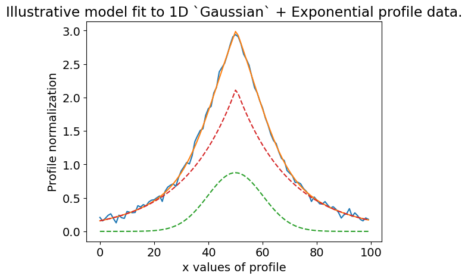
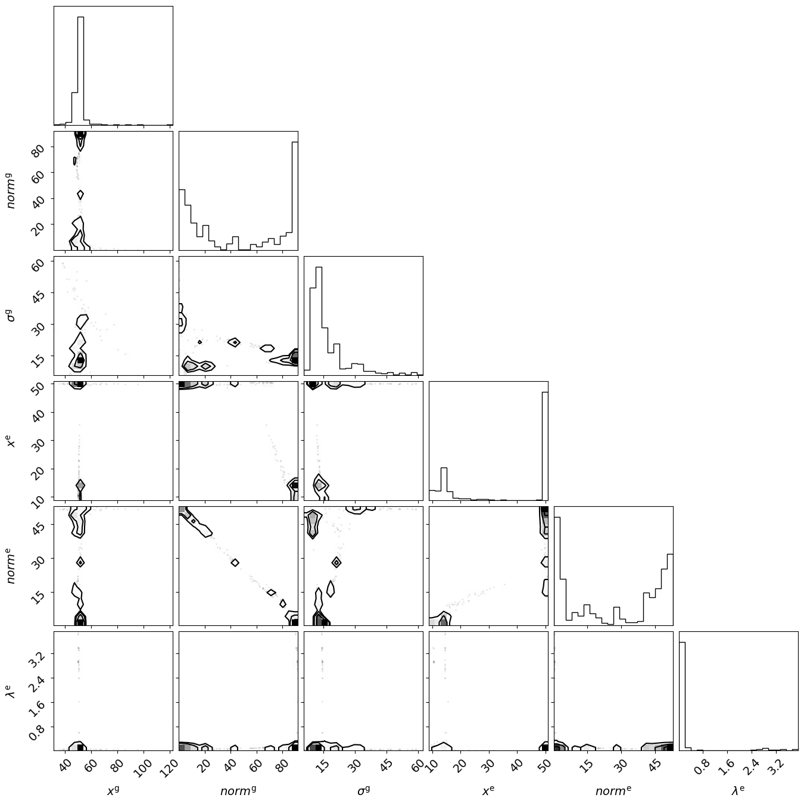

> ✏️ **This page is auto-generated from [`scripts/chapter_1_introduction/tutorial_5_results_and_samples.py`](../../scripts/chapter_1_introduction/tutorial_5_results_and_samples.py) — do not edit it directly.**
> It shows the example fully executed, with its real output images.
> Run it yourself via the [Python script](../../scripts/chapter_1_introduction/tutorial_5_results_and_samples.py) or the [Jupyter notebook](../../notebooks/chapter_1_introduction/tutorial_5_results_and_samples.ipynb).

Tutorial 5: Results And Samples
===============================

In this tutorial, we'll cover all of the output that comes from a non-linear search's `Result`  object.

We used this object at various points in the chapter. The bulk of material covered here is described in the example
script `autofit_workspace/overview/simple/result.py`. Nevertheless, it is a good idea to refresh ourselves about how
results in **PyAutoFit** work before covering more advanced material.

__Contents__

This tutorial is split into the following sections:

- **Data**: Load the dataset from the HowToFit/dataset folder.
- **Reused Functions**: Reuse the `plot_profile_1d` and `Analysis` classes from the previous tutorial.
- **Model Fit**: Run a non-linear search to generate a `Result` object.
- **Result**: Examine the `Result` object and its info attribute.
- **Samples**: Introduce the `Samples` object containing the non-linear search samples.
- **Parameters**: Access parameter values from the samples.
- **Figures of Merit**: Examine log likelihood, log prior, and log posterior values.
- **Instances**: Return results as model instances from samples.
- **Vectors**: Return results as 1D parameter vectors.
- **Labels**: Access the paths, names, and labels for model parameters.
- **Posterior / PDF**: Access median PDF estimates for the model parameters.
- **Plot**: Visualize model fit results using instances.
- **Errors**: Compute parameter error estimates at specified sigma confidence limits.
- **PDF**: Plot Probability Density Functions using corner.py.
- **Other Results**: Access maximum log posterior and other sample statistics.
- **Sample Instance**: Create instances from individual samples in the sample list.
- **Bayesian Evidence**: Access the log evidence for nested sampling searches.
- **Derived Errors (PDF from samples)**: Compute errors on derived quantities from sample PDFs.
- **Samples Filtering**: Filter samples by parameter paths for specific parameter analysis.
- **Latex**: Generate LaTeX table code for modeling results.


```python

from autofit import setup_notebook; setup_notebook()

import autofit as af
import autofit.plot as aplt
import os
from os import path
import numpy as np
import matplotlib.pyplot as plt
```

    Working Directory has been set to `HowToFit`


__Data__

Load the dataset from the `HowToFit/dataset` folder.


```python
dataset_path = path.join("dataset", "example_1d", "gaussian_x1__exponential_x1")
```

__Dataset Auto-Simulation__

If the dataset does not already exist on your system, it will be created by running the corresponding
simulator script. This ensures that all example scripts can be run without manually simulating data first.


```python
if not path.exists(dataset_path):
    import subprocess
    import sys

    subprocess.run(
        [sys.executable, "scripts/simulators/simulators.py"],
        check=True,
    )

data = af.util.numpy_array_from_json(file_path=path.join(dataset_path, "data.json"))
noise_map = af.util.numpy_array_from_json(
    file_path=path.join(dataset_path, "noise_map.json")
)
```

__Reused Functions__

We'll reuse the `plot_profile_1d` and `Analysis` classes of the previous tutorial.


```python


def plot_profile_1d(
    xvalues,
    profile_1d,
    title=None,
    ylabel=None,
    errors=None,
    color="k",
    output_path=None,
    output_filename=None,
):
    plt.errorbar(
        x=xvalues,
        y=profile_1d,
        yerr=errors,
        linestyle="",
        color=color,
        ecolor="k",
        elinewidth=1,
        capsize=2,
    )
    plt.title(title)
    plt.xlabel("x value of profile")
    plt.ylabel(ylabel)
    if not path.exists(output_path):
        os.makedirs(output_path)
    plt.savefig(path.join(output_path, f"{output_filename}.png"))
    plt.clf()


class Analysis(af.Analysis):
    def __init__(self, data, noise_map):
        super().__init__()

        self.data = data
        self.noise_map = noise_map

    def log_likelihood_function(self, instance):
        model_data = self.model_data_from_instance(instance=instance)

        residual_map = self.data - model_data
        chi_squared_map = (residual_map / self.noise_map) ** 2.0
        chi_squared = sum(chi_squared_map)
        noise_normalization = np.sum(np.log(2 * np.pi * noise_map**2.0))
        log_likelihood = -0.5 * (chi_squared + noise_normalization)

        return log_likelihood

    def model_data_from_instance(self, instance):
        """
        To create the summed profile of all individual profiles in an instance, we can use a dictionary comprehension
        to iterate over all profiles in the instance.
        """
        xvalues = np.arange(self.data.shape[0])

        return sum([profile.model_data_from(xvalues=xvalues) for profile in instance])

    def visualize(self, paths, instance, during_analysis):
        """
        This method is identical to the previous tutorial, except it now uses the `model_data_from_instance` method
        to create the profile.
        """
        xvalues = np.arange(self.data.shape[0])

        model_data = self.model_data_from_instance(instance=instance)

        residual_map = self.data - model_data
        chi_squared_map = (residual_map / self.noise_map) ** 2.0

        """The visualizer now outputs images of the best-fit results to hard-disk (checkout `visualizer.py`)."""
        plot_profile_1d(
            xvalues=xvalues,
            profile_1d=self.data,
            title="Data",
            ylabel="Data Values",
            color="k",
            output_path=paths.image_path,
            output_filename="data",
        )

        plot_profile_1d(
            xvalues=xvalues,
            profile_1d=model_data,
            title="Model Data",
            ylabel="Model Data Values",
            color="k",
            output_path=paths.image_path,
            output_filename="model_data",
        )

        plot_profile_1d(
            xvalues=xvalues,
            profile_1d=residual_map,
            title="Residual Map",
            ylabel="Residuals",
            color="k",
            output_path=paths.image_path,
            output_filename="residual_map",
        )

        plot_profile_1d(
            xvalues=xvalues,
            profile_1d=chi_squared_map,
            title="Chi-Squared Map",
            ylabel="Chi-Squareds",
            color="k",
            output_path=paths.image_path,
            output_filename="chi_squared_map",
        )

```

__Model Fit__

Now lets run the non-linear search to get ourselves a `Result`.


```python


class Gaussian:
    def __init__(
        self,
        centre=30.0,  # <- **PyAutoFit** recognises these constructor arguments
        normalization=1.0,  # <- are the Gaussian`s model parameters.
        sigma=5.0,
    ):
        """
        Represents a 1D Gaussian profile.

        This is a model-component of example models in the **HowToFit** lectures and is used to fit example datasets
        via a non-linear search.

        Parameters
        ----------
        centre
            The x coordinate of the profile centre.
        normalization
            Overall normalization of the profile.
        sigma
            The sigma value controlling the size of the Gaussian.
        """
        self.centre = centre
        self.normalization = normalization
        self.sigma = sigma

    def model_data_from(self, xvalues: np.ndarray):
        """

        Returns a 1D Gaussian on an input list of Cartesian x coordinates.

        The input xvalues are translated to a coordinate system centred on the Gaussian, via its `centre`.

        The output is referred to as the `model_data` to signify that it is a representation of the data from the
        model.

        Parameters
        ----------
        xvalues
            The x coordinates in the original reference frame of the data.
        """
        transformed_xvalues = np.subtract(xvalues, self.centre)
        return np.multiply(
            np.divide(self.normalization, self.sigma * np.sqrt(2.0 * np.pi)),
            np.exp(-0.5 * np.square(np.divide(transformed_xvalues, self.sigma))),
        )


class Exponential:
    def __init__(
        self,
        centre=30.0,  # <- **PyAutoFit** recognises these constructor arguments
        normalization=1.0,  # <- are the Exponential`s model parameters.
        rate=0.01,
    ):
        """
        Represents a 1D Exponential profile.

        This is a model-component of example models in the **HowToFit** lectures and is used to fit example datasets
        via a non-linear search.

        Parameters
        ----------
        centre
            The x coordinate of the profile centre.
        normalization
            Overall normalization of the profile.
        ratw
            The decay rate controlling has fast the Exponential declines.
        """
        self.centre = centre
        self.normalization = normalization
        self.rate = rate

    def model_data_from(self, xvalues: np.ndarray):
        """
        Returns a 1D Gaussian on an input list of Cartesian x coordinates.

        The input xvalues are translated to a coordinate system centred on the Gaussian, via its `centre`.

        The output is referred to as the `model_data` to signify that it is a representation of the data from the
        model.

        Parameters
        ----------
        xvalues
            The x coordinates in the original reference frame of the data.
        """
        transformed_xvalues = np.subtract(xvalues, self.centre)
        return self.normalization * np.multiply(
            self.rate, np.exp(-1.0 * self.rate * abs(transformed_xvalues))
        )


model = af.Collection(gaussian=af.Model(Gaussian), exponential=af.Model(Exponential))

analysis = Analysis(data=data, noise_map=noise_map)

search = af.Emcee(
    name="tutorial_5_results_and_samples",
    path_prefix="chapter_1_introduction",
)

print(
    """
    The non-linear search has begun running.
    Checkout the HowToFit/output/chapter_1_introduction/tutorial_5_results_and_samples
    folder for live output of the results.
    This Jupyter notebook cell with progress once the search has completed - this could take a few minutes!
    """
)

result = search.fit(model=model, analysis=analysis)

print("The search has finished run - you may now continue the notebook.")
```

    
        The non-linear search has begun running.
        Checkout the HowToFit/output/chapter_1_introduction/tutorial_5_results_and_samples
        folder for live output of the results.
        This Jupyter notebook cell with progress once the search has completed - this could take a few minutes!
        
    2026-07-11 18:13:35,792 - autofit.non_linear.search.abstract_search - INFO - Starting non-linear search with 1 cores.


    2026-07-11 18:13:35,802 - tutorial_5_results_and_samples - INFO - The output path of this fit is HowToFit/output/chapter_1_introduction/tutorial_5_results_and_samples/f7b96c133609a46d15a374506304464c


    2026-07-11 18:13:35,802 - tutorial_5_results_and_samples - INFO - Outputting pre-fit files (e.g. model.info, visualization).


    2026-07-11 18:13:36,280 - autofit.non_linear.initializer - INFO - Generating initial samples of model using JAX LH Function cores


    2026-07-11 18:13:36,298 - autofit.non_linear.initializer - INFO - Initial samples generated, starting non-linear search


    2026-07-11 18:13:36,299 - tutorial_5_results_and_samples - INFO - Visualizing Starting Point Model in image_start folder.


    2026-07-11 18:13:36,700 - tutorial_5_results_and_samples - INFO - Starting new Emcee non-linear search (no previous samples found).


      0%|          | 0/2000 [00:00<?, ?it/s]

    .../PyAutoFit/autofit/non_linear/fitness.py:299: RuntimeWarning: invalid value encountered in scalar subtract
      log_likelihood -= np.sum(log_prior_list)
      0%|          | 8/2000 [00:00<00:26, 74.19it/s]

      1%|          | 16/2000 [00:00<00:27, 72.81it/s]

      1%|          | 24/2000 [00:00<00:26, 73.85it/s]

      2%|▏         | 33/2000 [00:00<00:25, 76.58it/s]

      2%|▏         | 41/2000 [00:00<00:25, 75.73it/s]

      2%|▏         | 49/2000 [00:00<00:25, 76.12it/s]

      3%|▎         | 57/2000 [00:00<00:25, 75.21it/s]

      3%|▎         | 66/2000 [00:00<00:24, 77.67it/s]

      4%|▎         | 74/2000 [00:00<00:25, 75.47it/s]

      4%|▍         | 83/2000 [00:01<00:24, 77.76it/s]

      5%|▍         | 91/2000 [00:01<00:24, 76.83it/s]

      5%|▌         | 100/2000 [00:01<00:24, 79.11it/s]

      5%|▌         | 109/2000 [00:01<00:23, 80.50it/s]

      6%|▌         | 118/2000 [00:01<00:24, 76.82it/s]

      6%|▋         | 126/2000 [00:01<00:24, 75.55it/s]

      7%|▋         | 135/2000 [00:01<00:23, 77.78it/s]

      7%|▋         | 143/2000 [00:01<00:24, 76.73it/s]

      8%|▊         | 151/2000 [00:01<00:25, 73.01it/s]

      8%|▊         | 159/2000 [00:02<00:24, 74.65it/s]

      8%|▊         | 167/2000 [00:02<00:24, 74.40it/s]

      9%|▉         | 175/2000 [00:02<00:24, 74.11it/s]

      9%|▉         | 183/2000 [00:02<00:24, 75.36it/s]

     10%|▉         | 191/2000 [00:02<00:26, 68.58it/s]

     10%|▉         | 198/2000 [00:02<00:26, 68.30it/s]

     10%|█         | 206/2000 [00:02<00:25, 71.27it/s]

     11%|█         | 215/2000 [00:02<00:23, 75.64it/s]

     11%|█         | 223/2000 [00:02<00:24, 72.79it/s]

     12%|█▏        | 231/2000 [00:03<00:23, 74.61it/s]

     12%|█▏        | 239/2000 [00:03<00:23, 73.71it/s]

     12%|█▏        | 248/2000 [00:03<00:22, 77.89it/s]

     13%|█▎        | 257/2000 [00:03<00:21, 79.68it/s]

     13%|█▎        | 266/2000 [00:03<00:22, 77.02it/s]

     14%|█▎        | 274/2000 [00:03<00:24, 71.27it/s]

     14%|█▍        | 283/2000 [00:03<00:23, 73.97it/s]

     15%|█▍        | 291/2000 [00:03<00:23, 73.88it/s]

     15%|█▍        | 299/2000 [00:04<00:24, 68.93it/s]

     15%|█▌        | 306/2000 [00:04<00:25, 66.42it/s]

     16%|█▌        | 313/2000 [00:04<00:25, 67.24it/s]

     16%|█▌        | 321/2000 [00:04<00:24, 69.53it/s]

     16%|█▋        | 329/2000 [00:04<00:23, 71.64it/s]

     17%|█▋        | 337/2000 [00:04<00:22, 72.74it/s]

     17%|█▋        | 345/2000 [00:04<00:23, 70.85it/s]

     18%|█▊        | 353/2000 [00:04<00:22, 72.74it/s]

     18%|█▊        | 361/2000 [00:04<00:22, 72.86it/s]

     18%|█▊        | 369/2000 [00:04<00:22, 71.19it/s]

     19%|█▉        | 377/2000 [00:05<00:22, 71.89it/s]

     19%|█▉        | 385/2000 [00:05<00:23, 69.75it/s]

     20%|█▉        | 393/2000 [00:05<00:22, 72.13it/s]

     20%|██        | 401/2000 [00:05<00:23, 69.27it/s]

     20%|██        | 408/2000 [00:05<00:23, 67.27it/s]

     21%|██        | 415/2000 [00:05<00:23, 66.45it/s]

     21%|██        | 423/2000 [00:05<00:23, 67.68it/s]

     22%|██▏       | 431/2000 [00:05<00:22, 70.07it/s]

     22%|██▏       | 439/2000 [00:06<00:22, 69.83it/s]

     22%|██▏       | 448/2000 [00:06<00:21, 73.22it/s]

     23%|██▎       | 456/2000 [00:06<00:21, 72.75it/s]

     23%|██▎       | 464/2000 [00:06<00:20, 74.37it/s]

     24%|██▎       | 472/2000 [00:06<00:20, 75.91it/s]

     24%|██▍       | 480/2000 [00:06<00:20, 74.28it/s]

     24%|██▍       | 488/2000 [00:06<00:20, 74.74it/s]

     25%|██▍       | 496/2000 [00:06<00:20, 74.98it/s]

     25%|██▌       | 504/2000 [00:06<00:20, 71.45it/s]

     26%|██▌       | 512/2000 [00:06<00:20, 72.93it/s]

     26%|██▌       | 520/2000 [00:07<00:19, 74.43it/s]

     26%|██▋       | 528/2000 [00:07<00:19, 75.63it/s]

     27%|██▋       | 536/2000 [00:07<00:19, 76.55it/s]

     27%|██▋       | 545/2000 [00:07<00:18, 78.21it/s]

     28%|██▊       | 553/2000 [00:07<00:19, 75.93it/s]

     28%|██▊       | 561/2000 [00:07<00:19, 74.41it/s]

     28%|██▊       | 569/2000 [00:07<00:19, 73.75it/s]

     29%|██▉       | 578/2000 [00:07<00:18, 75.98it/s]

     29%|██▉       | 586/2000 [00:07<00:19, 73.93it/s]

    /tmp/ipykernel_436/283143368.py:41: RuntimeWarning: overflow encountered in square
      chi_squared_map = (residual_map / self.noise_map) ** 2.0


     30%|██▉       | 594/2000 [00:08<00:19, 73.77it/s]

     30%|███       | 602/2000 [00:08<00:18, 73.60it/s]

     30%|███       | 610/2000 [00:08<00:18, 74.11it/s]

     31%|███       | 619/2000 [00:08<00:18, 76.06it/s]

     31%|███▏      | 628/2000 [00:08<00:17, 78.60it/s]

     32%|███▏      | 636/2000 [00:08<00:17, 77.26it/s]

     32%|███▏      | 644/2000 [00:08<00:19, 69.35it/s]

     33%|███▎      | 652/2000 [00:08<00:19, 70.75it/s]

     33%|███▎      | 660/2000 [00:08<00:19, 69.13it/s]

     33%|███▎      | 668/2000 [00:09<00:18, 71.03it/s]

     34%|███▍      | 676/2000 [00:09<00:18, 73.07it/s]

     34%|███▍      | 684/2000 [00:09<00:17, 74.50it/s]

     35%|███▍      | 693/2000 [00:09<00:17, 76.16it/s]

     35%|███▌      | 701/2000 [00:09<00:17, 76.39it/s]

     35%|███▌      | 709/2000 [00:09<00:17, 74.63it/s]

     36%|███▌      | 717/2000 [00:09<00:17, 74.73it/s]

     36%|███▋      | 725/2000 [00:09<00:16, 75.29it/s]

     37%|███▋      | 733/2000 [00:09<00:16, 75.30it/s]

     37%|███▋      | 741/2000 [00:10<00:16, 75.54it/s]

     37%|███▋      | 749/2000 [00:10<00:16, 75.38it/s]

     38%|███▊      | 757/2000 [00:10<00:17, 72.60it/s]

     38%|███▊      | 765/2000 [00:10<00:17, 72.00it/s]

     39%|███▊      | 773/2000 [00:10<00:17, 70.15it/s]

     39%|███▉      | 781/2000 [00:10<00:17, 70.60it/s]

     39%|███▉      | 789/2000 [00:10<00:16, 71.62it/s]

     40%|███▉      | 797/2000 [00:10<00:16, 72.48it/s]

     40%|████      | 805/2000 [00:10<00:16, 70.52it/s]

     41%|████      | 813/2000 [00:11<00:16, 72.06it/s]

     41%|████      | 821/2000 [00:11<00:16, 72.30it/s]

     41%|████▏     | 829/2000 [00:11<00:16, 72.28it/s]

     42%|████▏     | 837/2000 [00:11<00:15, 73.90it/s]

     42%|████▏     | 845/2000 [00:11<00:15, 73.47it/s]

     43%|████▎     | 853/2000 [00:11<00:15, 73.92it/s]

     43%|████▎     | 861/2000 [00:11<00:15, 74.02it/s]

     44%|████▎     | 870/2000 [00:11<00:14, 76.25it/s]

     44%|████▍     | 878/2000 [00:11<00:15, 74.18it/s]

     44%|████▍     | 886/2000 [00:12<00:15, 73.97it/s]

     45%|████▍     | 894/2000 [00:12<00:14, 74.34it/s]

     45%|████▌     | 903/2000 [00:12<00:14, 75.95it/s]

     46%|████▌     | 912/2000 [00:12<00:14, 77.43it/s]

     46%|████▌     | 920/2000 [00:12<00:13, 77.36it/s]

     46%|████▋     | 928/2000 [00:12<00:14, 74.85it/s]

     47%|████▋     | 937/2000 [00:12<00:13, 77.00it/s]

     47%|████▋     | 945/2000 [00:12<00:13, 77.21it/s]

     48%|████▊     | 953/2000 [00:12<00:13, 76.39it/s]

     48%|████▊     | 961/2000 [00:13<00:14, 73.76it/s]

     48%|████▊     | 969/2000 [00:13<00:13, 74.45it/s]

     49%|████▉     | 977/2000 [00:13<00:13, 74.21it/s]

     49%|████▉     | 985/2000 [00:13<00:13, 75.79it/s]

     50%|████▉     | 993/2000 [00:13<00:13, 74.88it/s]

     50%|█████     | 1001/2000 [00:13<00:13, 72.09it/s]

     50%|█████     | 1009/2000 [00:13<00:13, 72.25it/s]

     51%|█████     | 1017/2000 [00:13<00:13, 72.02it/s]

     51%|█████▏    | 1025/2000 [00:13<00:14, 68.55it/s]

     52%|█████▏    | 1032/2000 [00:14<00:14, 67.29it/s]

     52%|█████▏    | 1039/2000 [00:14<00:14, 66.11it/s]

     52%|█████▏    | 1046/2000 [00:14<00:14, 64.57it/s]

     53%|█████▎    | 1053/2000 [00:14<00:14, 63.57it/s]

     53%|█████▎    | 1061/2000 [00:14<00:13, 67.08it/s]

     53%|█████▎    | 1069/2000 [00:14<00:13, 68.10it/s]

     54%|█████▍    | 1076/2000 [00:14<00:13, 67.69it/s]

     54%|█████▍    | 1085/2000 [00:14<00:12, 71.44it/s]

     55%|█████▍    | 1093/2000 [00:14<00:13, 69.70it/s]

     55%|█████▌    | 1101/2000 [00:15<00:12, 71.59it/s]

     55%|█████▌    | 1109/2000 [00:15<00:12, 71.62it/s]

     56%|█████▌    | 1117/2000 [00:15<00:12, 71.72it/s]

     56%|█████▋    | 1125/2000 [00:15<00:12, 72.04it/s]

     57%|█████▋    | 1133/2000 [00:15<00:12, 71.86it/s]

     57%|█████▋    | 1141/2000 [00:15<00:12, 69.37it/s]

     57%|█████▋    | 1149/2000 [00:15<00:11, 71.23it/s]

     58%|█████▊    | 1157/2000 [00:15<00:11, 72.22it/s]

     58%|█████▊    | 1166/2000 [00:15<00:11, 74.27it/s]

     59%|█████▊    | 1174/2000 [00:16<00:11, 72.96it/s]

     59%|█████▉    | 1182/2000 [00:16<00:11, 72.88it/s]

     60%|█████▉    | 1190/2000 [00:16<00:10, 74.17it/s]

     60%|█████▉    | 1198/2000 [00:16<00:10, 74.25it/s]

     60%|██████    | 1206/2000 [00:16<00:10, 74.09it/s]

     61%|██████    | 1214/2000 [00:16<00:10, 72.44it/s]

     61%|██████    | 1222/2000 [00:16<00:10, 72.55it/s]

     62%|██████▏   | 1231/2000 [00:16<00:10, 75.69it/s]

     62%|██████▏   | 1240/2000 [00:16<00:09, 77.41it/s]

     62%|██████▏   | 1248/2000 [00:17<00:10, 74.80it/s]

     63%|██████▎   | 1256/2000 [00:17<00:10, 73.53it/s]

     63%|██████▎   | 1265/2000 [00:17<00:09, 75.60it/s]

     64%|██████▎   | 1273/2000 [00:17<00:09, 75.92it/s]

     64%|██████▍   | 1281/2000 [00:17<00:09, 76.73it/s]

     64%|██████▍   | 1289/2000 [00:17<00:09, 73.47it/s]

     65%|██████▍   | 1297/2000 [00:17<00:09, 72.04it/s]

     65%|██████▌   | 1305/2000 [00:17<00:09, 73.10it/s]

     66%|██████▌   | 1313/2000 [00:17<00:09, 71.44it/s]

     66%|██████▌   | 1321/2000 [00:18<00:09, 72.30it/s]

     66%|██████▋   | 1329/2000 [00:18<00:09, 72.91it/s]

     67%|██████▋   | 1337/2000 [00:18<00:08, 74.47it/s]

     67%|██████▋   | 1345/2000 [00:18<00:08, 75.26it/s]

     68%|██████▊   | 1353/2000 [00:18<00:08, 76.25it/s]

     68%|██████▊   | 1361/2000 [00:18<00:08, 74.20it/s]

     68%|██████▊   | 1369/2000 [00:18<00:08, 72.91it/s]

     69%|██████▉   | 1377/2000 [00:18<00:08, 73.98it/s]

     69%|██████▉   | 1385/2000 [00:18<00:08, 71.35it/s]

     70%|██████▉   | 1393/2000 [00:19<00:08, 69.60it/s]

     70%|███████   | 1401/2000 [00:19<00:08, 70.70it/s]

     70%|███████   | 1409/2000 [00:19<00:08, 71.40it/s]

     71%|███████   | 1418/2000 [00:19<00:07, 74.14it/s]

     71%|███████▏  | 1426/2000 [00:19<00:07, 74.19it/s]

     72%|███████▏  | 1434/2000 [00:19<00:07, 74.10it/s]

     72%|███████▏  | 1442/2000 [00:19<00:07, 74.04it/s]

     72%|███████▎  | 1450/2000 [00:19<00:07, 75.10it/s]

     73%|███████▎  | 1458/2000 [00:19<00:07, 74.41it/s]

     73%|███████▎  | 1466/2000 [00:20<00:07, 72.40it/s]

     74%|███████▎  | 1474/2000 [00:20<00:07, 71.94it/s]

     74%|███████▍  | 1482/2000 [00:20<00:07, 70.81it/s]

     74%|███████▍  | 1490/2000 [00:20<00:07, 72.59it/s]

     75%|███████▍  | 1498/2000 [00:20<00:06, 71.78it/s]

     75%|███████▌  | 1506/2000 [00:20<00:07, 68.40it/s]

     76%|███████▌  | 1513/2000 [00:20<00:07, 68.47it/s]

     76%|███████▌  | 1521/2000 [00:20<00:06, 69.23it/s]

     76%|███████▋  | 1529/2000 [00:20<00:06, 70.26it/s]

     77%|███████▋  | 1537/2000 [00:21<00:06, 70.55it/s]

     77%|███████▋  | 1545/2000 [00:21<00:06, 70.00it/s]

     78%|███████▊  | 1553/2000 [00:21<00:06, 70.81it/s]

     78%|███████▊  | 1561/2000 [00:21<00:06, 72.77it/s]

     78%|███████▊  | 1569/2000 [00:21<00:05, 73.54it/s]

     79%|███████▉  | 1577/2000 [00:21<00:05, 73.57it/s]

     79%|███████▉  | 1585/2000 [00:21<00:05, 72.68it/s]

     80%|███████▉  | 1593/2000 [00:21<00:05, 73.98it/s]

     80%|████████  | 1601/2000 [00:21<00:05, 72.83it/s]

     80%|████████  | 1609/2000 [00:22<00:05, 71.79it/s]

     81%|████████  | 1617/2000 [00:22<00:05, 72.98it/s]

     81%|████████▏ | 1625/2000 [00:22<00:05, 72.89it/s]

     82%|████████▏ | 1633/2000 [00:22<00:05, 72.22it/s]

     82%|████████▏ | 1641/2000 [00:22<00:05, 67.82it/s]

     82%|████████▏ | 1648/2000 [00:22<00:05, 64.96it/s]

     83%|████████▎ | 1655/2000 [00:22<00:05, 62.73it/s]

     83%|████████▎ | 1662/2000 [00:22<00:05, 57.47it/s]

     83%|████████▎ | 1668/2000 [00:23<00:06, 53.52it/s]

     84%|████████▎ | 1674/2000 [00:23<00:05, 54.52it/s]

     84%|████████▍ | 1681/2000 [00:23<00:05, 57.01it/s]

     84%|████████▍ | 1687/2000 [00:23<00:05, 55.06it/s]

     85%|████████▍ | 1693/2000 [00:23<00:05, 55.90it/s]

     85%|████████▌ | 1701/2000 [00:23<00:04, 60.88it/s]

     85%|████████▌ | 1708/2000 [00:23<00:04, 63.12it/s]

     86%|████████▌ | 1715/2000 [00:23<00:04, 63.64it/s]

     86%|████████▌ | 1723/2000 [00:23<00:04, 66.77it/s]

     87%|████████▋ | 1731/2000 [00:23<00:03, 67.81it/s]

     87%|████████▋ | 1738/2000 [00:24<00:04, 65.19it/s]

     87%|████████▋ | 1746/2000 [00:24<00:03, 67.84it/s]

     88%|████████▊ | 1753/2000 [00:24<00:03, 67.77it/s]

     88%|████████▊ | 1760/2000 [00:24<00:03, 68.29it/s]

     88%|████████▊ | 1767/2000 [00:24<00:03, 60.78it/s]

     89%|████████▊ | 1774/2000 [00:24<00:03, 58.79it/s]

     89%|████████▉ | 1781/2000 [00:24<00:03, 60.22it/s]

     89%|████████▉ | 1789/2000 [00:24<00:03, 63.41it/s]

     90%|████████▉ | 1796/2000 [00:25<00:03, 64.03it/s]

     90%|█████████ | 1803/2000 [00:25<00:03, 64.64it/s]

     90%|█████████ | 1810/2000 [00:25<00:02, 65.27it/s]

     91%|█████████ | 1818/2000 [00:25<00:02, 67.56it/s]

     91%|█████████▏| 1827/2000 [00:25<00:02, 72.51it/s]

     92%|█████████▏| 1835/2000 [00:25<00:02, 71.79it/s]

     92%|█████████▏| 1843/2000 [00:25<00:02, 71.43it/s]

     93%|█████████▎| 1851/2000 [00:25<00:02, 71.65it/s]

     93%|█████████▎| 1859/2000 [00:25<00:01, 72.78it/s]

     93%|█████████▎| 1867/2000 [00:26<00:01, 68.36it/s]

     94%|█████████▎| 1874/2000 [00:26<00:01, 68.36it/s]

     94%|█████████▍| 1882/2000 [00:26<00:01, 69.97it/s]

     94%|█████████▍| 1890/2000 [00:26<00:01, 72.45it/s]

     95%|█████████▍| 1898/2000 [00:26<00:01, 73.01it/s]

     95%|█████████▌| 1906/2000 [00:26<00:01, 73.61it/s]

     96%|█████████▌| 1914/2000 [00:26<00:01, 72.18it/s]

     96%|█████████▌| 1923/2000 [00:26<00:01, 75.41it/s]

     97%|█████████▋| 1931/2000 [00:26<00:00, 74.26it/s]

     97%|█████████▋| 1939/2000 [00:27<00:00, 73.15it/s]

     97%|█████████▋| 1947/2000 [00:27<00:00, 72.32it/s]

     98%|█████████▊| 1955/2000 [00:27<00:00, 72.66it/s]

     98%|█████████▊| 1963/2000 [00:27<00:00, 74.16it/s]

     99%|█████████▊| 1971/2000 [00:27<00:00, 73.24it/s]

     99%|█████████▉| 1979/2000 [00:27<00:00, 70.40it/s]

     99%|█████████▉| 1987/2000 [00:27<00:00, 70.67it/s]

    100%|█████████▉| 1995/2000 [00:27<00:00, 70.68it/s]

    100%|██████████| 2000/2000 [00:27<00:00, 71.81it/s]

    


    2026-07-11 18:14:04,943 - tutorial_5_results_and_samples - INFO - Fit Running: Updating results (see output folder).


    2026-07-11 18:14:05,339 - autofit.non_linear.samples.samples - INFO - Samples with weight less than 1e-10 removed from samples.csv.


    2026-07-11 18:14:05,352 - autofit.non_linear.search.updater - INFO - Creating latent samples by drawing 100 from the PDF.


    2026-07-11 18:14:06,434 - arviz - INFO - Found 'auto' as default backend, checking available backends


    2026-07-11 18:14:06,435 - arviz - INFO - Matplotlib is available, defining as default backend


    2026-07-11 18:14:06,440 - arviz - INFO - arviz_base 1.0.0 available, exposing its functions as part of the `arviz` namespace


    2026-07-11 18:14:06,662 - arviz - INFO - arviz_stats 1.0.0 available, exposing its functions as part of the `arviz` namespace


    2026-07-11 18:14:06,678 - arviz - INFO - arviz_plots 1.0.0 available, exposing its functions as part of the `arviz` namespace


    2026-07-11 18:14:06,920 - root - WARNING - Too few points to create valid contours


    2026-07-11 18:14:06,963 - root - WARNING - Too few points to create valid contours


    2026-07-11 18:14:07,098 - root - WARNING - Too few points to create valid contours


    2026-07-11 18:14:07,219 - root - WARNING - Too few points to create valid contours


    2026-07-11 18:14:07,240 - root - WARNING - Too few points to create valid contours


    2026-07-11 18:14:07,880 - tutorial_5_results_and_samples - INFO - Removing all files except for .zip file


    2026-07-11 18:14:08,109 - tutorial_5_results_and_samples - INFO - Search complete, returning result


    The search has finished run - you may now continue the notebook.


    <Figure size 640x480 with 0 Axes>


__Result__

Here, we'll look in detail at what information is contained in the `Result`.

It contains an `info` attribute which prints the result in readable format.


```python
print(result.info)
```

    Maximum Log Likelihood                                                          184.51147165
    
    model                                                                           Collection (N=6)
        gaussian                                                                    Gaussian (N=3)
        exponential                                                                 Exponential (N=3)
    
    Maximum Log Likelihood Model:
    
    gaussian
        centre                                                                      49.937
    ... [15 lines of output truncated] ...
        centre                                                                      49.84 (8.93, 50.81)
        normalization                                                               29.09 (0.25, 52.60)
        rate                                                                        0.06 (0.02, 3.90)
    
    
    Summary (1.0 sigma limits):
    
    gaussian
        centre                                                                      50.12 (49.91, 50.41)
        normalization                                                               41.40 (12.05, 85.47)
        sigma                                                                       14.14 (13.09, 16.43)
    exponential
        centre                                                                      49.84 (15.53, 50.10)
        normalization                                                               29.09 (5.59, 45.67)
        rate                                                                        0.06 (0.06, 0.09)
    
    instances
    
    


__Samples__

The result contains a `Samples` object, which contains all of the non-linear search samples. 

Each sample corresponds to a set of model parameters that were evaluated and accepted by our non linear search, 
in this example emcee. 

This also includes their log likelihoods, which are used for computing additional information about the model-fit,
for example the error on every parameter. 

Our model-fit used the MCMC algorithm Emcee, so the `Samples` object returned is a `SamplesMCMC` object.


```python
samples = result.samples

print("MCMC Samples: \n")
print(samples)
```

    MCMC Samples: 
    
    SamplesMCMC(450)


__Parameters__

The parameters are stored as a list of lists, where:

 - The outer list is the size of the total number of samples.
 - The inner list is the size of the number of free parameters in the fit.

Below, we print the first sample — its second parameter (Gaussian -> normalization) and its third
parameter (Gaussian -> sigma). Any other sample index would work the same way; index `0` is used
here so the example remains valid regardless of how many samples the search produced.


```python
samples = result.samples
print("Sample 0's second parameter value (Gaussian -> normalization):")
print(samples.parameter_lists[0][1])
print("Sample 0's third parameter value (Gaussian -> sigma)")
print(samples.parameter_lists[0][2], "\n")
```

    Sample 0's second parameter value (Gaussian -> normalization):
    71.10567165730815
    Sample 0's third parameter value (Gaussian -> sigma)
    19.041078224688448 
    


__Figures of Merit__

The Samples class also contains the log likelihood, log prior, log posterior and weight_list of every accepted sample, 
where:

- The log likelihood is the value evaluated from the likelihood function (e.g. -0.5 * chi_squared + the noise 
normalized).

- The log prior encodes information on how the priors on the parameters maps the log likelihood value to the log 
posterior value.

- The log posterior is log_likelihood + log_prior.

- The weight gives information on how samples should be combined to estimate the posterior. The weight values depend on
the sampler used, for MCMC samples they are all 1 (e.g. all weighted equally).

Below, we inspect the first sample. Any sample index would work the same way; index `0` is used here
so the example is valid regardless of how many samples the search produced.


```python
print("log(likelihood), log(prior), log(posterior) and weight of the first sample.")
print(samples.log_likelihood_list[0])
print(samples.log_prior_list[0])
print(samples.log_posterior_list[0])
print(samples.weight_list[0])
```

    log(likelihood), log(prior), log(posterior) and weight of the first sample.
    181.55217157376288
    -6.882365196642858
    174.66980637712
    1.0


__Instances__

The `Samples` contains many results which are returned as an instance of the model, using the Python class structure
of the model composition.

For example, we can return the model parameters corresponding to the maximum log likelihood sample.


```python
max_lh_instance = samples.max_log_likelihood()

print("Max Log Likelihood `Gaussian` Instance:")
print("Centre = ", max_lh_instance.gaussian.centre)
print("Normalization = ", max_lh_instance.gaussian.normalization)
print("Sigma = ", max_lh_instance.gaussian.sigma, "\n")

print("Max Log Likelihood Exponential Instance:")
print("Centre = ", max_lh_instance.exponential.centre)
print("Normalization = ", max_lh_instance.exponential.normalization)
print("Sigma = ", max_lh_instance.exponential.rate, "\n")
```

    Max Log Likelihood `Gaussian` Instance:
    Centre =  49.93679305733673
    Normalization =  22.316040613432797
    Sigma =  10.154534833581186 
    
    Max Log Likelihood Exponential Instance:
    Centre =  50.246449585900606
    Normalization =  41.21960028703172
    Sigma =  0.05184778273594719 
    


__Vectors__

All results can alternatively be returned as a 1D vector of values, by passing `as_instance=False`:


```python
max_lh_vector = samples.max_log_likelihood(as_instance=False)
print("Max Log Likelihood Model Parameters: \n")
print(max_lh_vector, "\n\n")
```

    Max Log Likelihood Model Parameters: 
    
    [49.93679305733673, 22.316040613432797, 10.154534833581186, 50.246449585900606, 41.21960028703172, 0.05184778273594719] 
    
    


__Labels__

Vectors return a lists of all model parameters, but do not tell us which values correspond to which parameters.

The following quantities are available in the `Model`, where the order of their entries correspond to the parameters 
in the `ml_vector` above:
 
 - `paths`: a list of tuples which give the path of every parameter in the `Model`.
 - `parameter_names`: a list of shorthand parameter names derived from the `paths`.
 - `parameter_labels`: a list of parameter labels used when visualizing non-linear search results (see below).


```python
model = samples.model

print(model.paths)
print(model.parameter_names)
print(model.parameter_labels)
print(model.model_component_and_parameter_names)
print("\n")
```

    [('gaussian', 'centre'), ('gaussian', 'normalization'), ('gaussian', 'sigma'), ('exponential', 'centre'), ('exponential', 'normalization'), ('exponential', 'rate')]
    ['centre', 'normalization', 'sigma', 'centre', 'normalization', 'rate']
    ['x', 'norm', '\\sigma', 'x', 'norm', '\\lambda']
    ['gaussian.centre', 'gaussian.normalization', 'gaussian.sigma', 'exponential.centre', 'exponential.normalization', 'exponential.rate']
    
    


From here on, we will returned all results information as instances, but every method below can be returned as a
vector via the `as_instance=False` input.

__Posterior / PDF__

The ``Result`` object contains the full posterior information of our non-linear search, which can be used for
parameter estimation. 

The median pdf vector is available from the `Samples` object, which estimates the every parameter via 1D 
marginalization of their PDFs.


```python
median_pdf_instance = samples.median_pdf()

print("Max Log Likelihood `Gaussian` Instance:")
print("Centre = ", median_pdf_instance.gaussian.centre)
print("Normalization = ", median_pdf_instance.gaussian.normalization)
print("Sigma = ", median_pdf_instance.gaussian.sigma, "\n")

print("Max Log Likelihood Exponential Instance:")
print("Centre = ", median_pdf_instance.exponential.centre)
print("Normalization = ", median_pdf_instance.exponential.normalization)
print("Sigma = ", median_pdf_instance.exponential.rate, "\n")
```

    Max Log Likelihood `Gaussian` Instance:
    Centre =  50.11700527756945
    Normalization =  41.400469983078125
    Sigma =  14.142197776206366 
    
    Max Log Likelihood Exponential Instance:
    Centre =  49.8412364067728
    Normalization =  29.08945386035243
    Sigma =  0.06288372193481495 
    


__Plot__

Because results are returned as instances, it is straight forward to use them and their associated functionality
to make plots of the results:


```python
model_gaussian = max_lh_instance.gaussian.model_data_from(
    xvalues=np.arange(data.shape[0])
)
model_exponential = max_lh_instance.exponential.model_data_from(
    xvalues=np.arange(data.shape[0])
)
model_data = model_gaussian + model_exponential

plt.plot(range(data.shape[0]), data)
plt.plot(range(data.shape[0]), model_data)
plt.plot(range(data.shape[0]), model_gaussian, "--")
plt.plot(range(data.shape[0]), model_exponential, "--")
plt.title("Illustrative model fit to 1D `Gaussian` + Exponential profile data.")
plt.xlabel("x values of profile")
plt.ylabel("Profile normalization")
plt.show()
plt.close()
```


    

    


__Errors__

The samples include methods for computing the error estimates of all parameters, via 1D marginalization at an 
input sigma confidence limit. 


```python
errors_at_upper_sigma_instance = samples.errors_at_upper_sigma(sigma=3.0)
errors_at_lower_sigma_instance = samples.errors_at_lower_sigma(sigma=3.0)

print("Upper Error values of Gaussian (at 3.0 sigma confidence):")
print("Centre = ", errors_at_upper_sigma_instance.gaussian.centre)
print("Normalization = ", errors_at_upper_sigma_instance.gaussian.normalization)
print("Sigma = ", errors_at_upper_sigma_instance.gaussian.sigma, "\n")

print("lower Error values of Gaussian (at 3.0 sigma confidence):")
print("Centre = ", errors_at_lower_sigma_instance.gaussian.centre)
print("Normalization = ", errors_at_lower_sigma_instance.gaussian.normalization)
print("Sigma = ", errors_at_lower_sigma_instance.gaussian.sigma, "\n")
```

    Upper Error values of Gaussian (at 3.0 sigma confidence):
    Centre =  43.05174582345312
    Normalization =  50.462490200940366
    Sigma =  44.6052208883872 
    
    lower Error values of Gaussian (at 3.0 sigma confidence):
    Centre =  13.918276635649953
    Normalization =  41.400075258873066
    Sigma =  8.005905398848578 
    


They can also be returned at the values of the parameters at their error values:


```python
values_at_upper_sigma_instance = samples.values_at_upper_sigma(sigma=3.0)
values_at_lower_sigma_instance = samples.values_at_lower_sigma(sigma=3.0)

print("Upper Parameter values w/ error of Gaussian (at 3.0 sigma confidence):")
print("Centre = ", values_at_upper_sigma_instance.gaussian.centre)
print("Normalization = ", values_at_upper_sigma_instance.gaussian.normalization)
print("Sigma = ", values_at_upper_sigma_instance.gaussian.sigma, "\n")

print("lower Parameter values w/ errors of Gaussian (at 3.0 sigma confidence):")
print("Centre = ", values_at_lower_sigma_instance.gaussian.centre)
print("Normalization = ", values_at_lower_sigma_instance.gaussian.normalization)
print("Sigma = ", values_at_lower_sigma_instance.gaussian.sigma, "\n")
```

    Upper Parameter values w/ error of Gaussian (at 3.0 sigma confidence):
    Centre =  93.16875110102256
    Normalization =  91.86296018401849
    Sigma =  58.74741866459357 
    
    lower Parameter values w/ errors of Gaussian (at 3.0 sigma confidence):
    Centre =  36.198728641919494
    Normalization =  0.0003947242050568983
    Sigma =  6.136292377357789 
    


__PDF__

The Probability Density Functions (PDF's) of the results can be plotted using the Emcee's visualization
tool `corner.py`, which is wrapped via the `aplt.corner_cornerpy` function.


```python
aplt.corner_cornerpy(samples=result.samples)
```

    2026-07-11 18:14:08,597 - root - WARNING - Too few points to create valid contours


    2026-07-11 18:14:08,654 - root - WARNING - Too few points to create valid contours


    2026-07-11 18:14:08,798 - root - WARNING - Too few points to create valid contours


    2026-07-11 18:14:08,834 - root - WARNING - Too few points to create valid contours


    2026-07-11 18:14:08,853 - root - WARNING - Too few points to create valid contours


    

    


__Other Results__

The samples contain many useful vectors, including the samples with the highest posterior values.


```python
max_log_posterior_instance = samples.max_log_posterior()

print("Maximum Log Posterior Vector:")
print("Centre = ", max_log_posterior_instance.gaussian.centre)
print("Normalization = ", max_log_posterior_instance.gaussian.normalization)
print("Sigma = ", max_log_posterior_instance.gaussian.sigma, "\n")

```

    Maximum Log Posterior Vector:
    Centre =  49.93679305733673
    Normalization =  22.316040613432797
    Sigma =  10.154534833581186 
    


All methods above are available as a vector:


```python
median_pdf_instance = samples.median_pdf(as_instance=False)
values_at_upper_sigma = samples.values_at_upper_sigma(sigma=3.0, as_instance=False)
values_at_lower_sigma = samples.values_at_lower_sigma(sigma=3.0, as_instance=False)
errors_at_upper_sigma = samples.errors_at_upper_sigma(sigma=3.0, as_instance=False)
errors_at_lower_sigma = samples.errors_at_lower_sigma(sigma=3.0, as_instance=False)
```

__Sample Instance__

A non-linear search retains every model that is accepted during the model-fit.

We can create an instance of any lens model -- below we create an instance of the last accepted model.


```python
instance = samples.from_sample_index(sample_index=-1)

print("Gaussian Instance of last sample")
print("Centre = ", instance.gaussian.centre)
print("Normalization = ", instance.gaussian.normalization)
print("Sigma = ", instance.gaussian.sigma, "\n")
```

    Gaussian Instance of last sample
    Centre =  49.12110332539849
    Normalization =  22.855124856009187
    Sigma =  10.199451132678083 
    


__Bayesian Evidence__

If a nested sampling `NonLinearSearch` is used, the evidence of the model is also available which enables Bayesian
model comparison to be performed (given we are using Emcee, which is not a nested sampling algorithm, the log evidence 
is None).:


```python
log_evidence = samples.log_evidence
```

__Derived Errors (PDF from samples)__

Computing the errors of a quantity like the `sigma` of the Gaussian is simple, because it is sampled by the non-linear 
search. Thus, to get their errors above we used the `Samples` object to simply marginalize over all over parameters 
via the 1D Probability Density Function (PDF).

Computing errors on derived quantities is more tricky, because they are not sampled directly by the non-linear search. 
For example, what if we want the error on the full width half maximum (FWHM) of the Gaussian? In order to do this
we need to create the PDF of that derived quantity, which we can then marginalize over using the same function we
use to marginalize model parameters.

Below, we compute the FWHM of every accepted model sampled by the non-linear search and use this determine the PDF 
of the FWHM. When combining the FWHM's we weight each value by its `weight`. For Emcee, an MCMC algorithm, the
weight of every sample is 1, but weights may take different values for other non-linear searches.

In order to pass these samples to the function `marginalize`, which marginalizes over the PDF of the FWHM to compute 
its error, we also pass the weight list of the samples.

(Computing the error on the FWHM could be done in much simpler ways than creating its PDF from the list of every
sample. We chose this example for simplicity, in order to show this functionality, which can easily be extended to more
complicated derived quantities.)


```python
fwhm_list = []

for sample in samples.sample_list:
    instance = sample.instance_for_model(model=samples.model)

    sigma = instance.gaussian.sigma

    fwhm = 2 * np.sqrt(2 * np.log(2)) * sigma

    fwhm_list.append(fwhm)

median_fwhm, lower_fwhm, upper_fwhm = af.marginalize(
    parameter_list=fwhm_list, sigma=3.0, weight_list=samples.weight_list
)

print(f"FWHM = {median_fwhm} ({upper_fwhm} {lower_fwhm}")
```

    FWHM = 33.30233080420287 (141.4978563547001 14.097275235204755


__Samples Filtering__

Our samples object has the results for all three parameters in our model. However, we might only be interested in the
results of a specific parameter.

The basic form of filtering specifies parameters via their path, which was printed above via the model and is printed 
again below.


```python
samples = result.samples

print("Parameter paths in the model which are used for filtering:")
print(samples.model.paths)

print("All parameters of the very first sample")
print(samples.parameter_lists[0])

samples = samples.with_paths([("gaussian", "centre")])

print("All parameters of the very first sample (containing only the Gaussian centre.")
print(samples.parameter_lists[0])

print("Maximum Log Likelihood Model Instances (containing only the Gaussian centre):\n")
print(samples.max_log_likelihood(as_instance=False))
```

    Parameter paths in the model which are used for filtering:
    [('gaussian', 'centre'), ('gaussian', 'normalization'), ('gaussian', 'sigma'), ('exponential', 'centre'), ('exponential', 'normalization'), ('exponential', 'rate')]
    All parameters of the very first sample
    [48.65596967347352, 71.10567165730815, 19.041078224688448, 50.48493591145581, 13.710995372478395, 0.12390418007909251]
    All parameters of the very first sample (containing only the Gaussian centre.
    [48.65596967347352]
    Maximum Log Likelihood Model Instances (containing only the Gaussian centre):
    
    [49.93679305733673]


Above, we specified each path as a list of tuples of strings. 

This is how the source code internally stores the path to different components of the model, but it is not 
in-profile_1d with the PyAutoFIT API used to compose a model.

We can alternatively use the following API:


```python
samples = result.samples

samples = samples.with_paths(["gaussian.centre"])

print("All parameters of the very first sample (containing only the Gaussian centre).")
print(samples.parameter_lists[0])
```

    All parameters of the very first sample (containing only the Gaussian centre).
    [48.65596967347352]


Above, we filtered the `Samples` but asking for all parameters which included the path ("gaussian", "centre").

We can alternatively filter the `Samples` object by removing all parameters with a certain path. Below, we remove
the Gaussian's `centre` to be left with 2 parameters; the `normalization` and `sigma`.


```python
samples = result.samples

print("Parameter paths in the model which are used for filtering:")
print(samples.model.paths)

print("All parameters of the very first sample")
print(samples.parameter_lists[0])

samples = samples.without_paths(["gaussian.centre"])

print(
    "All parameters of the very first sample (containing only the Gaussian normalization and sigma)."
)
print(samples.parameter_lists[0])
```

    Parameter paths in the model which are used for filtering:
    [('gaussian', 'centre'), ('gaussian', 'normalization'), ('gaussian', 'sigma'), ('exponential', 'centre'), ('exponential', 'normalization'), ('exponential', 'rate')]
    All parameters of the very first sample
    [48.65596967347352, 71.10567165730815, 19.041078224688448, 50.48493591145581, 13.710995372478395, 0.12390418007909251]
    All parameters of the very first sample (containing only the Gaussian normalization and sigma).
    [71.10567165730815, 19.041078224688448, 50.48493591145581, 13.710995372478395, 0.12390418007909251]


__Latex__

If you are writing modeling results up in a paper, you can use inbuilt latex tools to create latex table 
code which you can copy to your .tex document.

By combining this with the filtering tools below, specific parameters can be included or removed from the latex.

Remember that the superscripts of a parameter are loaded from the config file `notation/label.yaml`, providing high
levels of customization for how the parameter names appear in the latex table. This is especially useful if your model
uses the same model components with the same parameter, which therefore need to be distinguished via superscripts.


```python
latex = af.text.Samples.latex(
    samples=result.samples,
    median_pdf_model=True,
    sigma=3.0,
    name_to_label=True,
    include_name=True,
    include_quickmath=True,
    prefix="Example Prefix ",
    suffix=" \\[-2pt]",
)

print(latex)
```

    Example Prefix $x^{\rm{g}} = 50.12^{+43.05}_{-13.92}$ & $norm^{\rm{g}} = 41.40^{+50.46}_{-41.40}$ & $\sigma^{\rm{g}} = 14.14^{+44.61}_{-8.01}$ & $x^{\rm{e}} = 49.84^{+0.97}_{-40.91}$ & $norm^{\rm{e}} = 29.09^{+23.51}_{-28.84}$ & $\lambda^{\rm{e}} = 0.06^{+3.84}_{-0.04}$ \[-2pt]


__Wrap Up__

This tutorial showed how to inspect the results of a model-fit: the maximum log likelihood instance, the full set of
samples, parameter estimates with errors at a given confidence, and how to output quantities to a LaTeX table. These
tools are the foundation for interpreting every model-fit you perform with **PyAutoFit**.


```python

```
